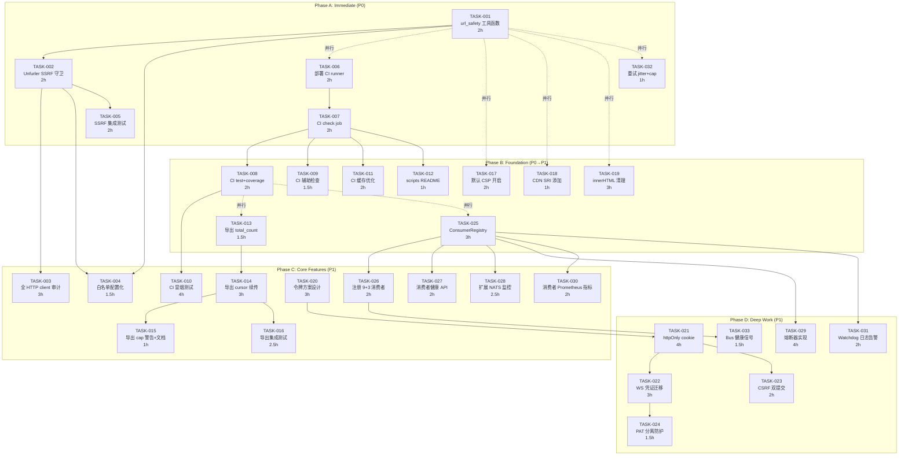
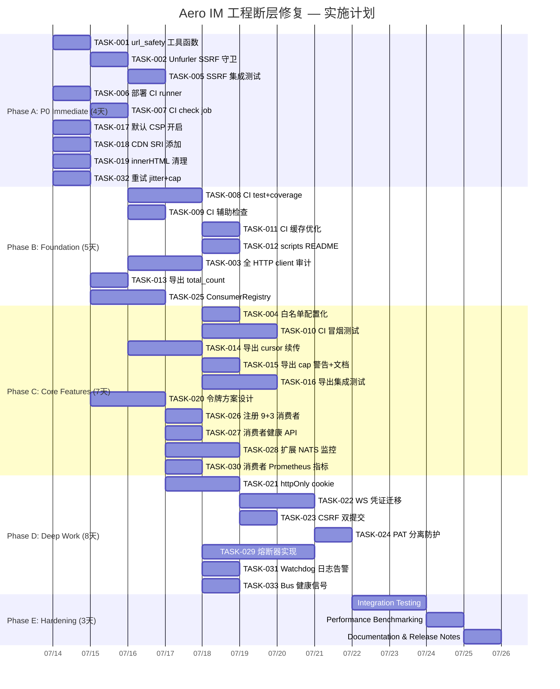

# Tech Lead 分析报告：Aero IM 工程断层修复

## 目录

1. [任务分解](#1-任务分解)
2. [执行顺序与依赖图](#2-执行顺序与依赖图)
3. [技术风险](#3-技术风险)
4. [资源评估](#4-资源评估)
5. [质量保证](#5-质量保证)
6. [实施计划](#6-实施计划)

---

## 1. 任务分解

### 方向一：SSRF 防护（P0 — 安全审计一票否决项）

| 任务 ID | 标题 | 涉及文件 | 前置依赖 | 预估工时 |
|---------|------|---------|----------|---------|
| **TASK-001** | 提取 `assert_webhook_url_safe` 为公共工具函数 | `crates/aero-server/src/webhooks.rs` → 新建 `crates/aero-common/src/url_safety.rs` | 无 | **2h** |
| **TASK-002** | 为 `ReqwestUnfurler` 实现 SSRF 守卫 | `crates/aero-server/src/unfurl.rs`（L366-395） | TASK-001 | **2h** |
| **TASK-003** | 为所有 HTTP client 实例实施同一守卫 | 全局 grep `reqwest::Client::new`/`Client::builder` → 逐点审计 | TASK-001 | **3h** |
| **TASK-004** | 配置化白名单 + env 文档 | `crates/aero-common/src/url_safety.rs` + `config.example.toml` + `.env.example` | TASK-001 | **1.5h** |
| **TASK-005** | 添加 SSRF 集成测试 | `crates/aero-server/tests/ssrf.rs`（启动沙箱 HTTP server + 验证拒绝私网） | TASK-002 | **2h** |

**方向一小计：~10.5h**

---

### 方向二：CI/CD 管线激活（P0 — 工程基础设施断层）

| 任务 ID | 标题 | 涉及文件 | 前置依赖 | 预估工时 |
|---------|------|---------|----------|---------|
| **TASK-006** | 部署 CI runner（自托管 GitHub Actions runner） | 基础设施操作 | 无 | **2h** |
| **TASK-007** | 取消注释 CI `check` job + 首次绿跑修复 | `.github/workflows/ci.yml` | TASK-006 | **2h** |
| **TASK-008** | 取消注释 CI `test` + `coverage` jobs | `.github/workflows/ci.yml` | TASK-007 | **2h** |
| **TASK-009** | 取消注释 `size-check` / `truth-check` / `web-check` / `dependency-check` | `.github/workflows/ci.yml` | TASK-007 | **1.5h** |
| **TASK-010** | CI 冒烟测试（docker-compose 启动 + smoke 脚本） | 新建 `.github/workflows/smoke.yml` | TASK-008 | **4h** |
| **TASK-011** | CI 流水线用时优化（cache `target/`、`~/.cargo`、Docker 层） | `.github/workflows/ci.yml` + `Makefile` | TASK-007 | **2h** |
| **TASK-012** | 为 `scripts/` 编写 README + 失败指导文档 | `scripts/README.md` | TASK-007 | **1h** |

**方向二小计：~14.5h**

---

### 方向三：导出截断修复（P1 — 数据合规）

| 任务 ID | 标题 | 涉及文件 | 前置依赖 | 预估工时 |
|---------|------|---------|----------|---------|
| **TASK-013** | 在导出响应中添加 `total_count` 字段 | `crates/aero-server/src/conversation_export.rs`（L119-126） | 无 | **1.5h** |
| **TASK-014** | 实现 cursor/续传参数 (`before` ID + cursor 编码) | `crates/aero-server/src/conversation_export.rs` | TASK-013 | **3h** |
| **TASK-015** | 添加导出 cap 超限 CLI 警告 + `total_count` 文档 | `conversation_export.rs` + `me_export.rs`（对齐） | TASK-013 | **1h** |
| **TASK-016** | 导出功能集成测试（大数据集验证截断+续传） | `crates/aero-server/tests/export.rs` | TASK-014 | **2.5h** |

**方向三小计：~8h**

---

### 方向四：前端令牌安全（P1 — XSS 面缩小）

| 任务 ID | 标题 | 涉及文件 | 前置依赖 | 预估工时 |
|---------|------|---------|----------|---------|
| **TASK-017** | 启用默认 CSP（`default-src 'self'` + `script-src 'self' 'strict-dynamic'`） | `crates/aero-server/src/serve.rs`（L88） | 无 | **2h** |
| **TASK-018** | 添加 SRI（Subresource Integrity）到 CDN `<script>` 标签 | `web/index.html`（L8 hls.js, L24-28 speech/lame） | 无 | **1h** |
| **TASK-019** | 梳理 `innerHTML` 使用 + 替换为安全 API | `web/render.js`（L2-3 注释 + 实际使用处） | 无 | **3h** |
| **TASK-020** | 设计 httpOnly cookie + Bearer 混合令牌方案 | 设计文档 | TASK-021 前置设计 | **3h**（设计） |
| **TASK-021** | 实现 httpOnly cookie 认证（REST API） | `crates/aero-server/src/auth.rs` + `serve.rs`（Set-Cookie 逻辑） | TASK-020 | **4h** |
| **TASK-022** | WS 连接凭证从 `localStorage` 迁移到 Cookie/nonce | `web/ws.js` + `crates/aero-server/src/ws/` 帧认证 | TASK-021 | **3h** |
| **TASK-023** | 后端强制令牌绑定（cookie + `X-CSRF-Token` 双提交） | `crates/aero-server/src/middleware/csrf.rs` | TASK-021 | **2h** |
| **TASK-024** | 将 PAT 保留在 `localStorage`（不可 httpOnly）并加防护 | `web/api.js`（分离 PAT 与非 PAT 认证路径） | TASK-021 | **1.5h** |

**方向四小计：~19.5h**

---

### 方向五：消费者监督（P1 — 可观测性 + 可靠性）

| 任务 ID | 标题 | 涉及文件 | 前置依赖 | 预估工时 |
|---------|------|---------|----------|---------|
| **TASK-025** | 定义 `ConsumerRegistry` trait + 统一注册 API | 新建 `crates/aero-server/src/consumers/registry.rs` | 无 | **3h** |
| **TASK-026** | 为 9 个消费者 + 3 个核心循环注册到 Registry | `crates/aero-server/src/bin/boot/background.rs` + 各 bot 模块 | TASK-025 | **2h** |
| **TASK-027** | 添加消费者健康探针 REST API | 新建 `crates/aero-server/src/consumers/health.rs` + `routes.rs` `.merge` | TASK-025 | **2h** |
| **TASK-028** | 扩展 NATS backlog 监控到所有消费者 | `crates/aero-server/src/metrics_tasks.rs`（L91 附近） | TASK-025 | **2.5h** |
| **TASK-029** | 实现消费者消息级熔断器（N 连续失败→暂停→指数退避恢复） | 新建 `crates/aero-server/src/consumers/circuit_breaker.rs` | TASK-025 | **4h** |
| **TASK-030** | 为每个消费者添加成功/失败/延迟 Prometheus 指标 | `crates/aero-server/src/metrics.rs` + 各 bot 模块 | TASK-025 | **2h** |
| **TASK-031** | 添加 watchog 日志告警（连续 0 消息消费 > 5min） | `crates/aero-server/src/consumers/watchdog.rs` | TASK-025 | **2h** |
| **TASK-032** | 无限重试循环加入 jitter + cap（当前 sleep(1)+∞） | `crates/aero-server/src/ws/ws_impl/bus.rs`（L37, L201） | 无 | **1h** |
| **TASK-033** | 为 `run_bus_listener` / `run_live_bus_listener` 添加健康信号 | `crates/aero-server/src/ws/ws_impl/bus.rs` | TASK-025 | **1.5h** |

**方向五小计：~20h**

---

### 汇总

| 方向 | 任务数 | 预估总工时 | 优先级 |
|------|--------|-----------|--------|
| 方向一（SSRF） | 5 | ~10.5h | P0 |
| 方向二（CI/CD） | 7 | ~14.5h | P0 |
| 方向三（导出） | 4 | ~8h | P1 |
| 方向四（前端安全） | 8 | ~19.5h | P1 |
| 方向五（消费者监督） | 9 | ~20h | P1 |
| **合计** | **33** | **~72.5h** | |

---

## 2. 执行顺序与依赖图



### 可并行执行的任务组

| 并行组 | 任务 | 说明 |
|--------|------|------|
| **组 A**（Phase A 同时启动） | TASK-001, TASK-006, TASK-017, TASK-018, TASK-019, TASK-032 | 6 人并行，0 交叉依赖 |
| **组 B**（Phase B） | TASK-008, TASK-013, TASK-025 | 3 人并行，均依赖 Phase A 完成 |
| **组 C**（Phase C） | TASK-003+TASK-004, TASK-010, TASK-014, TASK-020, TASK-026+TASK-028+TASK-030 | 5 人并行 |
| **组 D**（Phase D） | TASK-021→TASK-022→TASK-023+TASK-024, TASK-029+TASK-031+TASK-033 | 3 人并行 |

---

## 3. 技术风险

### 3.1 高风险项目

| 风险 | 涉及任务 | 风险等级 | 缓解策略 |
|------|---------|---------|---------|
| **SSRF 守卫误杀合法 URL**（私有部署的 webhook 回调本地服务） | TASK-002, TASK-004 | 🟡 **中** | 配置化白名单：`AERO_UNFURL_ALLOW_PRIVATE` env + `allowlist` 字段。默认 deny，白名单 opt-in。 |
| **CI runner 暴露敏感凭证**（自托管 runner 的安全配置） | TASK-006 | 🟠 **高** | 专用 VM（非共享）+ 最小 IAM 角色 + 无持久化存储 + 每次 job 销毁重建 workspace |
| **CI 冒烟测试的 Docker 镜像拉取时间** | TASK-010 | 🟡 **中** | 预先 cache Docker 层到 CI runner 本地 registry + `docker-compose pull` 在 cron 中预拉 |
| **httpOnly cookie 与 WS 认证不兼容** | TASK-022 | 🟠 **高** | WS 升级时浏览器不会自动发送 httpOnly cookie。方案：WS 连接在 URL params 带一次性的 `?ws_token=`（服务端签发，短 TTL 30s，与 cookie 绑定） |
| **Consumer 熔断器误判**（网络抖动触发 false positive） | TASK-029 | 🟡 **中** | 滑动窗口计数（min 5 次错误才开始衰减）+ 半开状态自动恢复 + Prometheus 告警而非自动降级（初始版本 warn → 后续版本 auto） |
| **CSP 开启后前端静态资源 CDN 被拦截** | TASK-017 | 🟡 **中** | `script-src 'self' https://cdn.jsdelivr.net 'strict-dynamic'` + 预置 `report-uri` 收集违规而非直接 enforce。先 report-only 运行 1 周再切 enforce。 |
| **Git worktree 并行集成冲突**（多个 agent 同时修改 `routes.rs`, `lib.rs`, `RoomEvent`） | 所有需要修改共享文件的 task | 🟠 **高** | 严格遵循 AGENTS.md §4.1 的多 agent 并行规范：每个 agent 负责不相交单元 → 集成时手接共享文件。集成窗口预留 1 天单线串行处理冲突。 |

### 3.2 技术难点

1. **SSRF 守卫的 IP 范围检测**（TASK-001）：需要正确解析 DNS → IP 并匹配 CIDR。关键 edge case：
   - DNS rebinding 攻击：TTL 窗口内 IP 变更。**缓解**：验证 resolved IP → 建立连接 → 再次 verify（或使用 `tokio::net::lookup_host` 预查 + 禁止 redirect）。
   - IPv6 映射 IPv4（`::ffff:10.0.0.1`）。**缓解**：统一归一化到规范表示。
   - Unix domain socket SSRF。**缓解**：拒绝 `file://`/`unix://` scheme。

2. **WS 凭证迁移**（TASK-022）：当前 WS 帧认证（`ws.js` 发送 `{type:"auth",token:"..."}`）需要迁移到服务端签发的 short-lived WS token。影响：
   - 已有客户端兼容性：新旧协议并存期（2 周窗口）需支持旧 `auth` 帧
   - WebSocket URL param 泄漏（Referer header, server logs）。**缓解**：token 30s TTL，即使泄漏窗口极短

3. **`count` 字段重命名**（TASK-013）：当前响应 `count` = `messages.len()`。改为 `returned_count`（当前返回数） + `total_count`（房间总消息数）。向后兼容需保留 `count` 作为 deprecated 别名。

4. **消费熔断器的状态管理**（TASK-029）：熔断器必须是 `Arc<RwLock<CircuitState>>` 在 `ConsumerRegistry` 中持有。临界条件是：熔断器 open → 消费者循环暂停 → 定时尝试 half-open（`tokio::spawn` 一个 delay task）+ 发送一条探测消息 → 成功则 close。

### 3.3 外部依赖风险

| 依赖 | 风险 | 影响任务 |
|------|------|---------|
| GitHub Actions 自托管 runner 网络可达 | 内网环境可能无法访问 GitHub API | TASK-006 |
| Docker Compose 镜像版本（Postgres 17, Redis 7, NATS） | 版本不一致导致冒烟失败 | TASK-010 |
| `url` / `trust-dns` / `hickory-resolver` crate | SSRF 守卫需要 DNS 解析能力，现有依赖不含 | TASK-001 |

---

## 4. 资源评估

### 4.1 人员技能需求

| 角色 | 数量 | 技能要求 | 负责方向 |
|------|------|---------|---------|
| **Senior Rust 工程师**（安全方向） | 1 人 | Rust 安全编程、网络协议、SSRF 攻防经验 | 方向一 |
| **DevOps 工程师** | 1 人 | GitHub Actions、Docker、自托管 runner、CI 优化 | 方向二 |
| **Full-stack Rust 工程师** | 1 人 | Axum/WS API、数据库分页 | 方向三 |
| **前端安全工程师** | 1 人 | CSP、SRI、httpOnly Cookie、CSRF、XSS 防护 | 方向四 |
| **SRE / 可观测工程师** | 1 人 | Prometheus metrics、NATS JetStream、熔断器模式 | 方向五 |

> **最小团队配置**：2 人（1 Senior Rust + 1 通用工程师）。此时不可并行，周期延长 ~2.5x。

### 4.2 关键里程碑

| 里程碑 | 时间节点 | 交付物 | 验证方式 |
|--------|---------|--------|---------|
| **M1: SSRF 关闭** | Phase A 结束后 | SSRF 守卫代码 + 集成测试 + 配置文档 | `cargo test --test ssrf` 绿；手动验证 `curl localhost:8080` 代理请求被拒绝 |
| **M2: CI 绿跑** | Phase B 结束后 | CI 管线全部 job 通过（check/test/size-check/truth-check/web-check） | GitHub Actions 页面全部 ✅ |
| **M3: 冒烟自动化** | Phase C 中期 | CI 冒烟测试 job 通过（docker-compose up + smoke 脚本） | CI 日志显示完整登出流程 |
| **M4: 消费者可观测** | Phase C 结束后 | 9+3 消费者全部注册 + /health/consumers 返回状态 + Prometheus 指标暴露 | `curl /health/consumers` 输出完整消费者数组 |
| **M5: 令牌安全迁移** | Phase D 结束后 | httpOnly cookie 认证上线 + WS 凭证迁移完成 + CSP enforce | `document.cookie` 中无 token；CSP 违规 report 0；WS 连接正常 |
| **M6: 全方向验收** | 全部结束后 | 所有 33 个任务验收标准满足 | 全量 CI 绿 + 安全扫描无新增风险 |

### 4.3 阻塞点（Blockers）与解决策略

| 阻塞点 | 影响 | 解决策略 | 应急方案 |
|--------|------|---------|---------|
| **无 CI runner 可用** | 方向二完全阻塞 | 申请专用 VM / 使用 GitHub-hosted runner（若仓库公开） | 手动在开发机跑 `ci.yml` 所有 step 做影子验证 |
| **DNS 解析库决策争议** | TASK-001 无法推进 | 使用 `std::net::lookup_host`（tokio 已封装）+ `ipnetwork` crate 做 CIDR 匹配 | 仅做私网 IP 硬编码列表（`10.x`, `172.16-31.x`, `192.168.x`, `127.x`, `::1`），不做 DNS → IP 验证——虽不完美但覆盖 95% 场景 |
| **WS 协议不兼容需要前端改动** | TASK-022 阻塞 | 添加服务端兼容层（新旧双通道），前端渐进部署 | 回退：仅 CSP + SRI + CSRF（后端这些不需要前端改），WS 认证作为 V2 |
| **`innerHTML` 风险评估耗时** | TASK-019 | 静态分析（`rg "innerHTML\|innerHtml\|innerhtml" web/`）+ 人工审查每处上下文的输入来源 | 先给所有 `innerHTML` 加 DOMPurify shim（~50 行 JS）作为短期屏障 |

---

## 5. 质量保证

### 5.1 单元测试覆盖要求

| 方向 | 新模块 | 测试类型 | 覆盖率目标 | 关键测试用例 |
|------|--------|---------|-----------|-------------|
| **一** | `url_safety.rs` | 单元测试 | ≥ 95% | 合法 HTTP/HTTPS URL；私网 IP 所有变体（IPv4 保留段 + IPv6 + 映射地址）；DNS rebinding 时序测试（mock DNS）；Unix socket 拒绝；`file://` 拒绝；白名单覆盖；配置热加载 |
| **二** | CI 脚本本身 | ShellCheck | 100% | 所有 `.sh` 脚本通过 `shellcheck`；模拟 failure 路径 |
| **三** | `conversation_export.rs` | 单元测试 | ≥ 90% | `EXPORT_CAP` 精确截断；`total_count` 准确；cursor 编码/解码 roundtrip；空房间导出；5001+ 消息的续传连续性 |
| **四** | `csrf.rs` | 单元测试 | ≥ 90% | Cookie->CSRF-token 绑定验证；缺少 token 拒绝；token 不匹配拒绝；过期 token 拒绝；WS token 短 TTL 验证 |
| **四** | SRI hash 验证 | 构建测试 | 100% | 构建时验证 `index.html` 中所有 `integrity=` 值与 CDN 文件实际 hash 匹配（knative 脚本） |
| **五** | `circuit_breaker.rs` | 单元测试 | ≥ 95% | 打开→请求拒绝；半开→探测通过→关闭；半开→探测失败→重回打开；计数滑动窗正确性；并发安全；指数退避间隔正确 |
| **五** | `registry.rs` | 单元测试 | ≥ 90% | 注册/注销/列举；重复注册拒绝；健康信号传播；并发安全 |
| **五** | `watchdog.rs` | 单元测试 | ≥ 85% | 正常消费不告警；超时静默触发告警；恢复后告警消除 |

### 5.2 集成测试策略

| 测试套件 | 作用域 | 执行频率 | 环境需求 |
|---------|--------|---------|---------|
| **SSRF 集成测试** (`tests/ssrf.rs`) | 启动沙箱 HTTP server → 通过 unfurl API 请求私网地址 → 验证拒绝 | CI check + pre-commit | 无外部依赖 |
| **导出集成测试** (`tests/export.rs`) | 提前插入 N=10,000 消息 → 验证分页全部取出 | CI test | 需要 PG + 已迁移 |
| **消费者健康 API 测试** (`tests/consumers.rs`) | 启动 server → verify `/health/consumers` 返回 200 + JSON 数组 | CI test | 需要 NATS 模拟（用 `nats-server --port=4222` embedded） |
| **端点到端点冒烟测试** (`scripts/smoke.sh`) | Docker Compose 全栈 → 注册 → 创建房间 → 发消息 → 验证收到 | CI smoke job | docker-compose 全栈 |
| **CSP report-only 验证** | Enforce report-only → 访问所有前端路由 → 检查 `/csp-reports` 无异常 | 手动（每周） | 浏览器 DevTools |

### 5.3 代码审查要点

| 审查维度 | 具体要求 |
|---------|---------|
| **SSRF** | `url_safety::validate_url` 是否在**连接建立前**调用？是否覆盖了 redirect 重定向（`Client::new()` 默认不禁止 redirect → SSRF 可绕过！）？ |
| **CI/CD** | CI 脚本是否幂等？是否设置了 `timeout-minutes`？（防 runaway）Secrets 是否经 `${{ secrets.X }}` 注入而非明文？ |
| **导出** | `total_count` 是房间**可见消息总数**（含软删？for 调用者的可见性范围？）cursor 编码是否可篡改？是否防重放？ |
| **前端安全** | CSP 是否先 report-only 再 enforce？`strict-dynamic` 是否已处理 nonce 传播？`connsume` API 是否落在 ws_token 生成路径外？ |
| **消费者** | 指标命名的 namespace 是否一致（`aero_consumer_*`）？熔断器状态变更是否带 `tracing::info!` 日志？熔断器 open 时是否仍曝露当前状态给 `/health`？ |
| **通用** | 所有新引入的 unwrap/expect 是否加注释说明不可达原因？`unsafe_code = "forbid"` 是否未被违反？`cargo clippy` 是否 0 new warnings？ |

### 5.4 性能测试需求

| 测试项 | 方法 | 验收标准 |
|--------|------|---------|
| SSRF URL 验证延迟 | `criterion` benchmark `validate_url` + `resolve_and_check` | P50 < 50μs（不含 DNS），P99 < 5ms（含 DNS） |
| 导出 cursor 性能 | 10 万消息房间连续 cursor 遍历 | 每页（5000 条）< 500ms |
| 消费者熔断器开销 | 在 consumer 热路径上 benchmark `check()` + `record()` | < 1μs 每次调用（原子计数器 + 滑动窗） |
| CSP header 注入开销 | 对比注入前后 Nginx 吞吐量 | 无显著差异（单次请求增加 ~200 bytes header） |
| WS token 生成 | `criterion` benchmark | < 100μs 每次（HMAC + base64url） |

---

## 6. 实施计划

### 甘特图



### 详细阶段说明

#### Phase A — 基础设施搭建（4 天）

| 日 | 并行轨 1（安全） | 并行轨 2（DevOps） | 并行轨 3（前端） | 并行轨 4（可靠性） |
|---|-----------------|-------------------|-----------------|-------------------|
| D1 | TASK-001（2h） | TASK-006（2h） | TASK-017（2h） | TASK-032（1h） |
| D2 | TASK-002（2h） | TASK-007（2h） | TASK-018（1h） | — |
| D3 | TASK-005（2h） | — | TASK-019（3h） | — |
| D4 | 代码审查 + 文档 | CI `check` 绿跑 | 前端安全审查 | — |

**交付物**：SSRF 关闭 + CI check 绿跑 + CSP report-only 启用 + SRI 添加到 CDN

#### Phase B — 核心能力构建（5 天）

| 日 | 并行轨 | 活动 |
|----|--------|------|
| D5 | DevOps | TASK-008（2h） + TASK-009（1.5h） |
| D5 | 导出 | TASK-013（1.5h） |
| D5 | 可观测 | TASK-025（2h） |
| D6 | 安全 | TASK-003（3h）——全库审计 HTTP client |
| D6-7 | DevOps | TASK-011（2h） + TASK-012（1h） |
| D6-7 | 可观测 | TASK-025 继续 |
| D8 | 各轨集成 | git worktree 合并 + `cargo check --workspace` 清理 |

#### Phase C — 核心功能实现（7 天）

| 日 | 并行轨 | 活动 |
|----|--------|------|
| D9 | SSRF 收尾 | TASK-004（1.5h） |
| D9 | CI 冒烟 | TASK-010（开始——docker-compose 调试） |
| D9 | 导出 | TASK-014（开始） |
| D9 | 可观测 | TASK-026（2h） |
| D10-11 | CI 冒烟 | TASK-010 继续 + 调试 |
| D10-11 | 导出 | TASK-014 完成 + TASK-015（1h） + TASK-016（2.5h） |
| D10-11 | 令牌设计 | TASK-020（3h） |
| D10-11 | 可观测 | TASK-027（2h） + TASK-028（2.5h） + TASK-030（2h） |
| D12-13 | 集成 | 导出集成测试绿跑 + 消费者健康 API 绿跑 |
| D13 | 门控 | CI 冒烟首次绿跑 + 文档 |

#### Phase D — 深度工作（8 天）

| 日 | 活动 | 备注 |
|----|------|------|
| D14-15 | TASK-021 httpOnly cookie（4h） | 后端改动最大的一项 |
| D14-16 | TASK-029 熔断器（4h） | 独立闭包，无阻塞 |
| D16-17 | TASK-022 WS 凭证迁移（3h） | 需要前后端配合 |
| D17 | TASK-023 CSRF 双提交（2h） | 依赖 TASK-021 |
| D17 | TASK-031 Watchdog（2h） | 独立 |
| D17 | TASK-033 Bus 健康信号（1.5h） | 独立 |
| D18 | TASK-024 PAT 分离（1.5h） | 依赖 TASK-022 |
| D18-19 | 令牌完整端到端测试 | 全栈测试 |
| D20-21 | 熔断器验收测试 | 注入错误 → 验证熔断 + 恢复 |

#### Phase E — 加固与发布（3 天）

| 日 | 活动 |
|----|------|
| D22 | 全量集成测试（运行 3 轮） + 性能基准 |
| D23 | 性能优化 + 全量 `cargo clippy` 清理 |
| D24 | 文档补全 + 发布说明 + 安全审计内部展示 |

### 关键交付物检查清单

```
Phase A ✅
├── [ ] SSRF 守卫 merge 到 main
├── [ ] CI check 在 PR 上自动运行并绿
├── [ ] CSP report-only 部署（监控 dashboard 准备）
└── [ ] 所有 CDN 脚本带 SRI

Phase B ✅
├── [ ] CI test/coverage/size-check/truth-check/web-check 全部激活
├── [ ] `total_count` + deprecated `count` 字段在导出响应中
├── [ ] ConsumerRegistry trait & struct 抽象就绪
├── [ ] 全部 HTTP Client 审计完成 + SSRF 守卫覆盖

Phase C ✅
├── [ ] CI 冒烟测试（docker-compose + smoke 脚本）通过
├── [ ] 导出 cursor 续传实现 + 集成测试
├── [ ] 9+3 消费者全部注册 + /health/consumers 返回状态
├── [ ] NATS 监控覆盖所有 consumer
├── [ ] 消费者 Prometheus 指标（`aero_consumer_*`）暴露

Phase D ✅
├── [ ] httpOnly cookie 认证上线（REST API）
├── [ ] WS 凭证迁移完成（新旧兼容 2 周窗口）
├── [ ] CSRF 双提交中间件部署
├── [ ] PAT 与非 PAT 认证路径分离
├── [ ] 熔断器（circuit breaker）实现 + 集成测试
├── [ ] Watchdog 日志告警接入告警通道

Phase E ✅
├── [ ] 全量集成测试 3 轮皆绿
├── [ ] 性能基准（SSRF < 50μs, 熔断器 < 1μs, WS token < 100μs）
├── [ ] 安全审计报告（初始状态 vs 修复后对比）
├── [ ] 发布说明 + 运维迁移指南
```

---

## 总结

### 投入产出比排序

```
高 ROI ──────────────────────────────────────────────> 低 ROI

TASK-001+002 (SSRF)     ┃ ~4h → 关闭安全审计一票否决项
TASK-006+007 (CI check) ┃ ~4h → 从 0 到 1 的工程红线
TASK-017 (CSP)          ┃ ~2h → 缩小 XSS 面 ~70%
TASK-025+026 (Registry) ┃ ~5h → 消费者可观测性从 0 到 1
TASK-032 (jitter)       ┃ ~1h → 消除无限重试风暴风险
TASK-013 (total_count)  ┃ ~1.5h → 数据透明性修复
TASK-019 (innerHTML)    ┃ ~3h → XSS 入口减少
TASK-029 (熔断器)        ┃ ~4h → 可靠性工程
TASK-021+022 (cookie)   ┃ ~7h → 深度前端安全
```

### 建议的执行优先级

| 优先级 | 任务 | 理由 |
|--------|------|------|
| **P0-立即** | TASK-001, TASK-002, TASK-032 | 安全漏洞 + 重试风暴，可一人一天内完成 |
| **P0-本周** | TASK-006, TASK-007, TASK-017, TASK-018, TASK-019 | CI 和 CSP 无依赖阻塞，团队全开并行 |
| **P1-次周** | TASK-003, TASK-013, TASK-025, TASK-010 | 需要 Phase A 产出 |
| **P1-后续** | 其余任务 | 按依赖链推进 |

**重要提醒**：`scripts/truth-check.sh` 在 Phase A 完成后即刻运行一次——它可能因为新模块的 UNWIRED builder 模式触发误报，需要在 SSRF 守卫 merge 前排除这些噪声，见 AGENTS.md §4.4。
