现在我已充分掌握了代码库。让我整理完整的 Tech Lead 分析报告。

---

# Tech Lead 分析报告：Aero IM 交叉验证后续工作

## 概述

交叉验证确认了 5 个方向上的代码级空白，全部为**真阳性**。本报告将每个方向分解为可执行的任务（每项 2-4 小时），构建依赖图，识别技术风险，并规划分阶段实施计划，总周期约 6 周，由 1 名资深工程师完成。第一阶段（最高优先级，< 2 周）可以立即启动——五个方向中没有任何技术阻塞。

---

## 1. 任务分解

### 方向一：Web SPA 供应链安全（5 项任务）

| 任务编号 | 标题 | 涉及文件 | 前置依赖 | 预估工时 | 验收标准 |
|---|---|---|---|---|---|
| **TASK-101** | 为 hls.js CDN 脚本标签添加 SRI 完整性哈希 | `web/index.html:9` | 无 | 1h | `<script>` 标签包含 `integrity="sha384-..."` 和 `crossorigin="anonymous"` 属性；`openssl dgst -sha384 -binary` 验证匹配 |
| **TASK-102** | 设置包含合理默认值的 CSP，保留 `AERO_CSP_POLICY` 作为覆盖选项 | `crates/aero-server/src/bin/boot/serve.rs:78-90` | 无 | 2h | 默认 CSP 头已设置（`default-src 'self'; script-src 'self' https://cdn.jsdelivr.net; style-src 'self' 'unsafe-inline'; img-src 'self' data:; connect-src 'self' ws: wss:;`）；`AERO_CSP_POLICY` 环境变量完整覆盖默认值（不仅仅是 .option_layer()）；使用 CSP `report-uri`（可选） |
| **TASK-103** | 快速修复：将 JWT 从 localStorage 迁移至 sessionStorage（缓解措施） | `web/api.js:4-6`、`web/app.js`（引用 `TOKEN_KEY`/`REFRESH_KEY`/`PID_KEY` 的所有位置） | 无 | 1h | 令牌在标签关闭时自动清除；所有现有引用更新至 `sessionStorage`；登录/刷新/登出流程正常运行 |
| **TASK-104** | 服务端：为 JWT 添加 httpOnly + Secure + SameSite=Strict cookie 支持 | `crates/aero-server/src/routes/auth.rs`、`crates/aero-auth/src/lib.rs` | TASK-103（建议先行，但非硬性依赖） | 6h | 登录和令牌刷新端点设置 `Set-Cookie: aero_token=...; HttpOnly; Secure; SameSite=Strict; Path=/; Max-Age=...`；新增可选的 `TokenCookie` Axum 提取器，在未提供 `Authorization` 头时回落至 cookie |
| **TASK-105** | 客户端：从 httpOnly cookie 认证迁移（移除 localStorage 路径） | `web/api.js`、`web/app.js` | TASK-104 | 3h | 客户端不再读取/写入 `aero_token` localStorage；所有 API 调用省略 `Authorization` 头，依赖浏览器发送 cookie；登出时清除 cookie（`Max-Age=0`） |

### 方向二：Schema 迁移安全（4 项任务）

| 任务编号 | 标题 | 涉及文件 | 前置依赖 | 预估工时 | 验收标准 |
|---|---|---|---|---|---|
| **TASK-201** | 为迁移执行添加超时和进度日志 | `crates/aero-storage/src/db.rs:25`（`migrate()` 调用处） | 无 | 2h | `migrate()` 有可配置超时（默认 120s）；每次迁移前/后有 `info!` 日志，包含文件名和持续时间；超时时 migration runner 返回错误，而非挂起 |
| **TASK-202** | 添加 PostgreSQL  advisory lock 以防止并发迁移 | `crates/aero-storage/src/db.rs` | TASK-201（在同一文件，可合并） | 2h | 在运行迁移前获取 `pg_advisory_xact_lock(19800315)`（应用特定 ID）；获取失败时优雅退出（`info!` + 跳过）；锁在事务结束时自动释放 |
| **TASK-203** | 添加迁移验证 CI 检查 | `scripts/truth-check.sh`（或新的 `scripts/validate-migrations.sh`） | 无 | 2h | 脚本断言：所有 `.sql` 文件都有对应的 `_down.sql`（或显式在注释中声明 "NO DOWN"）；没有重复的迁移号；`SELECT max(version) FROM _sqlx_migrations` 没有 gap；包含在 `truth-check.sh` 中 |
| **TASK-204** | 构建 `aero-cli migrate` 的 `--check` 模式 | `aero-cli` 源码（如存在）或新增迁移前置检查入口 | TASK-203 | 2h | `aero-cli migrate --check` 运行所有 pre-flight 检查（advisory lock 可用、未应用迁移的 SQL 语法有效），并在不实际运行迁移时报告状态 |

### 方向三：错误预算代码级执行（4 项任务）

| 任务编号 | 标题 | 涉及文件 | 前置依赖 | 预估工时 | 验收标准 |
|---|---|---|---|---|---|
| **TASK-301** | 将 NATS consumer backlog 纳入就绪检查 | `crates/aero-server/src/routes/health.rs:50-75`（`probe_deps`） | 无 | 3h | `/health/ready` 检查 `aero-server` durable consumer 的 `num_pending`；阈值可配置（默认 `AERO_NATS_BACKLOG_READY_THRESHOLD=10000`）；超过阈值为 `"degraded"` |
| **TASK-302** | 在 hub.rs 中添加 WS 帧/断开/丢弃计数器 | `crates/aero-server/src/hub.rs`（`fan_out_raw`、`unregister`、`register`） | 无 | 4h | 新增 Prometheus 计数器：`ws_frames_sent_total`（按 room/stream 标签）、`ws_disconnects_total`（按 reason 标签：`laggy`/`closed`/`evicted`）、`ws_frames_dropped_total`（按 mode 标签：`drop_only`/`disconnect`）、`ws_resync_total`；所有计数器在 `names` 模块中注册 |
| **TASK-303** | 实现 HealthScore 聚合 + WS 处理中的降级分支 | `crates/aero-common/src/metrics.rs`（新类型 + gauge） | TASK-301 | 3h | 新增 `aero_health_score` gauge（0.0–1.0），每分钟更新一次，聚合：NATS backlog（>阈值时为 0）、WS 丢弃率（>1% 时为 0）、AI DLQ 深度（>0 时为 0.5）；额外降级分支：在 WS `send_message` 路径中，当 `HealthScore < 0.5` 时发出 `warn!` |
| **TASK-304** | 内存触发的优雅关闭（RSS 守卫） | `crates/aero-server/src/bin/boot/serve.rs`（启动期间新 spawn） | 无 | 4h | 新 spawn 任务每 30 秒采样 `memory_stats()`（通过 `procfs` 或 `/proc/self/status`）；当 RSS 超过硬限制（默认 `AERO_MEM_HARD_LIMIT_MB=4096`，可配置）时，触发 `state.shutting_down` 并在 drain 后 `process::exit(0)`；当 RSS 超过软限制（默认 3072）时发出 `warn!` |

### 方向四：WS 投递质量盲区（4 项任务）

| 任务编号 | 标题 | 涉及文件 | 前置依赖 | 预估工时 | 验收标准 |
|---|---|---|---|---|---|
| **TASK-401** | 在 hub.rs 中添加 WS 消息延迟直方图 | `crates/aero-server/src/hub.rs`（`fan_out_raw` — 测量 bus→client 延迟） | TASK-302（在同一模块，可合并） | 3h | 新增 `ws_message_latency_seconds` 直方图，标签为 `scope`（`room`/`stream`）；将 `Instant::now()` 放入 `ServerFrame` 创建处（在 `bus.rs` 中），并在 `fan_out_raw` 中测量至 try_send |
| **TASK-402** | 添加 WS 回填截断计数器 | `crates/aero-server/src/ws/`（WS 回填处理逻辑） | 无 | 2h | 新增 `ws_backfill_truncated_total` 计数器，标签为 `reason`（`max_rows`/`timeout`）；在 WS 回填 `?since=` 路径中 `LIMIT` 或超时发生时递增 |
| **TASK-403** | 添加 WS 连接失败标签（断开原因分类） | `crates/aero-server/src/hub.rs`（`unregister` + WS 任务包装器） | TASK-302 | 2h | `ws_disconnects_total` 包含分类标签：`reconnect` / `logout` / `error` / `laggy_evict` / `server_shutdown`；在 WS 任务 `Drop` 中以反向映射的方式触发 |
| **TASK-404** | 添加 WS 客户端侧连接统计（用于仪表盘） | `web/ws.js`（新的 `_stats` 对象） | 无 | 2h | `WsClient` 在 `window.__wsStats` 中暴露 `{connects, disconnects, reconnectAttempts, framesReceived, framesDropped, lastLatency}`；服务端 `/api/me` 可通过 REST 可选读取；纯客户端（无需服务端变更） |

### 方向五：NATS 生命周期管理（4 项任务）

| 任务编号 | 标题 | 涉及文件 | 前置依赖 | 预估工时 | 验收标准 |
|---|---|---|---|---|---|
| **TASK-501** | 添加 consumer_last_acked metric gauge | `crates/aero-bus/src/jetstream.rs`（新增方法）+ `crates/aero-server/src/bin/boot/metrics_tasks.rs`（采样循环） | 无 | 3h | 新增 `aero_nats_consumer_last_acked_seconds` gauge，标签为 `consumer`（`aero-server`/`aero-bot`/`aero-unfurl` 等）；每 30 秒采样 `consumer_info().last_active` 与 `now()` 的时间差 |
| **TASK-502** | 实现 POST /api/internal/drain 维护端点 | `crates/aero-server/src/routes/`（新增 `drain.rs`） | 无 | 4h | `POST /api/internal/drain` 以内部 secret 守卫；启动优雅关闭（`state.shutting_down = true`）；等待所有 WS 连接完成 drain（最多 `AERO_DRAIN_TIMEOUT_SECS` 秒，默认 30）；返回 `{"status":"draining"}`；幂等 |
| **TASK-503** | 为 durable consumer 添加 NATS consumer 心跳探活 | `crates/aero-server/src/bin/boot/metrics_tasks.rs` 和 `crates/aero-server/src/routes/health.rs` | TASK-501 | 3h | 就绪检查竞品：`aero-nats-consumer-heartbeat` subject（`AERO_NATS_HEARTBEAT_SUBJECT`）上有定期（每 15 秒）NATS pub，每个 durable consumer 订阅者回复；检查 `consumer_info().num_waiting` + `last_active` 的时间差；缺失心跳 > 60s -> 就绪状态为 `degraded` |
| **TASK-504** | 将 JetStream 卷分离至专用 Docker volume | `docker-compose.yml:52` | 无 | 1h | `nats_data` 卷独立于 `pg_data` / `redis_data` 声明和挂载；`data/nats` 保留但 docker-compose 改至 `nats_data:/data`；README 反映独立卷 |

---

## 2. 执行顺序（依赖图）

```mermaid
graph TD
    %% Direction 1: Web Security
    T101[TASK-101: SRI hash] --> T102[TASK-102: Default CSP]
    T103[TASK-103: sessionStorage quick fix]
    T103 --> T104[TASK-104: httpOnly cookie server]
    T104 --> T105[TASK-105: httpOnly cookie client]
    
    %% Direction 2: Migration Safety  
    T201[TASK-201: Migration timeout] --> T202[TASK-202: Advisory lock]
    T203[TASK-203: Migration validation CI] -.-> T204[TASK-204: --check mode]
    T201 -.-> T204
    
    %% Direction 3: Error Budget
    T301[TASK-301: NATS backlog in readiness] --> T303[TASK-303: HealthScore]
    T302[TASK-302: WS counters] --> T303
    T302 --> T401[TASK-401: WS latency histogram]
    T304[TASK-304: Memory-triggered shutdown]
    
    %% Direction 4: WS Delivery Quality
    T302 --> T403[TASK-403: Disconnect reason labels]
    T401 --> T404[TASK-404: Client-side stats] 
    T402[TASK-402: Backfill truncation counter]
    
    %% Direction 5: NATS Lifecycle
    T501[TASK-501: Consumer last_acked] --> T503[TASK-503: Consumer heartbeat]
    T502[TASK-502: Drain endpoint]
    T504[TASK-504: JetStream volume]

    %% Cross-direction dependencies
    T301 --> T502
    T101 --> T105
    T102 --> T105

    %% Phase grouping
    subgraph PhaseA[阶段 A: 快速见效 < 2 周]
        T101
        T102
        T103
        T201
        T203
        T302
        T301
        T402
        T504
    end
    subgraph PhaseB[阶段 B: 核心基础设施 周 2-4]
        T104
        T202
        T204
        T303
        T304
        T403
        T501
        T502
    end
    subgraph PhaseC[阶段 C: 高级可观测性 周 4-6]
        T105
        T401
        T404
        T503
    end
```



### 可并行执行的任务组

| 并行组 | 任务 | 理由 |
|---|---|---|
| **G1 — 前端安全** | TASK-101, TASK-103 | 独立文件（`index.html` vs `api.js`）；互不冲突 |
| **G2 — 迁移管道** | TASK-201, TASK-203 | 一个是 db.rs 运行时，一个是 CI 脚本；独立路径 |
| **G3 — WS 计数 + NATS 就绪** | TASK-301, TASK-302, TASK-402, TASK-504 | 全部在独立模块中；无共享可变状态 |
| **G4 — 深水区** | TASK-104, TASK-202, TASK-304, TASK-501, TASK-502 | 每项 3-6h，独立文件 |
| **G5 — 高级指标** | TASK-401, TASK-403, TASK-503, TASK-204 | 依赖较早的任务，但彼此可并行 |
| **G6 — 收尾** | TASK-105, TASK-404 | 纯客户端，需 TASK-104 就绪 |

---

## 3. 技术风险

### 3.1 高风险项

| 风险 | 涉及任务 | 严重性 | 缓解措施 |
|---|---|---|---|
| **JWT httpOnly cookie 会破坏现有的 WS 连接路径** | TASK-104, TASK-105 | **高** — 认证故障会影响所有用户 | WS 连接使用 `?token=` 查询参数（现有）。Cookie 迁移必须保持 `Authorization: Bearer` 作为备用方案，直到所有客户端更新。逐步推出：同时接受 Cookie 和 Header 至少 2 个版本 |
| **Native `memory_stats()` 不可移植（macOS vs Linux）** | TASK-304 | **中** — Linux 是部署目标，但本地开发可能报错 | 使用 `available_parallelism` 风格的 `cfg!(target_os = "linux")` 守卫；在 macOS 上退化至仅 `warn!`，不作为硬限制；或者使用 `sys-info` crate（已在锁文件中？检查一下） |
| **NATS consumer info API 在重负载下可能延迟** | TASK-301, TASK-501, TASK-503 | **低** — 每 30s 调用是 NATS 管理端点，非数据面 | 添加超时（2s，匹配现有探测模式）；超时 = 跳过该采样周期，不失败 |
| **sessionStorage 迁移破坏现有已登录用户的会话** | TASK-103 | **中** — 用户被迫重新登录 | 登出时两个存储都清除；登录时两个存储都写入；2 个版本后再移除 localStorage 路径 |
| **HealthScore 降级分支可能引入延迟** | TASK-303 | **低** — 仅在 `send_message` 路径中同步读取 | HealthScore 在专用任务中异步计算并存储在 `AtomicF64` 中；WS 路径仅加载 + 检查，无锁争用 |

### 3.2 外部依赖

| 依赖 | 任务 | 现状 | 风险 |
|---|---|---|---|
| `openssl` CLI 用于计算 SRI 哈希 | TASK-101 | 开发者机器上已安装 | 无 — 一次性操作 |
| `procfs` crate 或 Linux `/proc/self/status` | TASK-304 | 未在 `Cargo.toml` 中（裸 `/proc` 读取避免新增依赖） | 低 — 直接读取 `/proc/self/status:VmRSS:`；无 parse 依赖 |
| hls.js CDN（jsdelivr） | TASK-101 | 外部 URL | 无 — SRI 正是为了缓解供应链风险的 |
| NATS `consumer_info()` API | TASK-501, TASK-503 | 已在 `async-nats` 中通过 `stream.consumer_info()` 暴露 | 无 — 已有方法 |

### 3.3 性能瓶颈与优化策略

| 区域 | 瓶颈 | 优化 |
|---|---|---|
| WS 延迟直方图（TASK-401） | `Instant::now()` 在 `fan_out_raw` 热路径中 | 仅在 `lossy` 标志设置时采样（慢消费者触发）；健康消费者跳过 |
| WS 断开标签（TASK-403） | `unregister` 中字符串分配 | 使用 `&'static str` 标签；整数枚举 -> 在注册时而非每次断开时映射到 str |
| NATS consumer 心跳（TASK-503） | 每 15s 的 pub 流量 | 单进程仅发布一次（非每消费者）；订阅者回复 NAK（无新消息）/ 无操作 |
| 内存守卫（TASK-304） | 每 30s 文件 I/O | 裸 `/proc` 读取是内核调用；够快。仅在超过软限制时使用 `warn!` |

### 3.4 测试覆盖难点

| 难点 | 涉及任务 | 策略 |
|---|---|---|
| WS 断开原因分类无法端到端测试 | TASK-403 | 单测注入 `WsSender::close()` + 断言 gauge 标签；集成测试中 `client.close(1001)` 导致 `ws_disconnects_total{reason="logout"}` |
| 内存触发关闭不可在 CI 中测试 | TASK-304 | 单测 `read_rss_from_proc()` 解析函数 + 软限制逻辑（注入假 RSS 值）；完整的 memory-pressure 场景仅做 smoke 测试 |
| JWT cookie 路径需完整 HTTP 往返 | TASK-104 | 使用 `tower::ServiceExt::oneshot` 对 axum 路由进行集成测试；断言 `Set-Cookie` 头；令牌刷新路径有显式的 cookie->response 流程测试 |
| NATS consumer heartbeat 需运行中的 NATS | TASK-503 | `JetStreamBus` 上的 `#[cfg(test)]` 方法注入假 consumer info；状态机纯函数可测 |

---

## 4. 资源评估

### 4.1 人员配置

| 角色 | 所需技能 | 投入 | 覆盖任务 |
|---|---|---|---|
| **1 名资深后端工程师**（全栈） | Rust（tokio/axum/sqlx） + JS（es2020） + Prometheus 指标 | **全职 6 周** | 所有 21 项任务 |
| 可选的 **1 名初级/中级工程师** | Rust 基础 + JS | **兼职，周 3-4** | TASK-101（SRI）、TASK-103（sessionStorage）、TASK-203（CI 脚本）、TASK-404（客户端统计）、TASK-504（Docker volume） |
| **SRE/运维**（咨询） | NATS 运营 + 性能调优 | **2 次 1 小时会** | TASK-503 的 heartbeat subject 设计 + TASK-504 的存储规划 |

**建议**：1 名全职资深工程师承担 ~16 项核心任务；初级工程师承担 5 项辅助/明确定义的任务。若只有 1 人，优先级排期符合阶段划分。

### 4.2 关键里程碑

| 里程碑 | 截止时间 | 交付物 | 依赖 |
|---|---|---|---|
| **M1：安全基线** | 第 1 周周五 | SRI + CSP + sessionStorage + WS 计数已上线生产 | TASK-101, TASK-102, TASK-103, TASK-302 |
| **M2：就绪信号** | 第 2 周周五 | NATS backlog 就绪 + 迁移安全 + JetStream 卷分离 | TASK-201, TASK-203, TASK-301, TASK-402, TASK-504 |
| **M3：核心韧性** | 第 4 周周五 | httpOnly cookie + advisory lock + HealthScore + 内存守卫 + drain 端点 + consumer last_acked | TASK-104, TASK-202, TASK-204, TASK-303, TASK-304, TASK-403, TASK-501, TASK-502 |
| **M4：全面可观测性** | 第 6 周周五 | 延迟直方图 + 客户端统计 + consumer 心跳 + cookie 客户端落地 | TASK-105, TASK-401, TASK-404, TASK-503 |

### 4.3 阻塞点与解决策略

| 阻塞点 | 影响 | 解决策略 |
|---|---|---|
| **httpOnly cookie 与 WS token 参数不一致** | 阻塞 TASK-104 和 TASK-105 | 设计决策：WS 连接保留 `?token=`（WebSocket API 无法以编程方式设置 Cookie）；REST 迁移至 Cookie。两种认证模式的 auth extractor 中采用"任一/或"逻辑 |
| **AGENTS.md §4.2 中的 IDOR 守卫 lint 可能因新路由而误报** | 阻塞 TASK-502（drain 端点） | Drain 端点是 `POST /api/internal/drain`（无 `RoomId`/`WorkspaceId`）；通过添加 `#[allow(authz_lint)]` 注释豁免；CI 中更新 `authz_lint.rs` 守卫 |
| **测试耗时：基础 crate 的全量 `cargo test --workspace --lib`** | 每次提交前约 5-10 分钟 CI 时间 | 使用 `cargo nextest` 和按 crate 划分的测试分片；新迁移测试标记 `#[ignore]`（需要 PG） |
| **`Cargo.lock` 冲突：SRI 任务不需要变更，但 Git 工作树可能包含并行变更** | TASK-101 集成摩擦 | 遵循 AGENTS.md §4.1 工作流：每个 agent 在自己的 git worktree 中处理不相交的单元；将新文件拉进主仓库时合并锁文件 |

---

## 5. 质量保证

### 5.1 单元测试覆盖要求

| 任务 | 最低覆盖率 | 关键测试用例 |
|---|---|---|
| **TASK-101**（SRI） | N/A（HTML 变更） | 无（仅手动验证 `openssl` 输出） |
| **TASK-102**（CSP） | 100% 新逻辑 | 默认策略包含 5 条指令；`AERO_CSP_POLICY` 完整覆盖；空策略 = 无 CSP 头 |
| **TASK-103**（sessionStorage） | N/A（JS 变更） | eslint `no-undef`；CI `web-check.sh` |
| **TASK-104**（Cookie 服务端） | > 90% | Cookie 设置（登录/刷新）；Cookie 读取（`TokenCookie` 提取器）；`Authorization` 头优先于 Cookie；Cookie 缺失 = 401 |
| **TASK-105**（Cookie 客户端） | N/A（JS 变更） | 登出时 Cookie 清除；无 `Authorization` 头的请求发送 |
| **TASK-201**（迁移超时） | > 90% | 超时触发 → 错误返回；正常迁移 → 正常完成；进度日志包含文件名 |
| **TASK-202**（Advisory lock） | 100% | 成功获取锁 → 运行迁移；无法获取锁 → 跳过 + 记录日志；会话内释放 |
| **TASK-203**（CI 验证） | N/A（bash 脚本） | 在已知良好的快照上测试；检测缺失的 `_down.sql`；检测迁移 gap |
| **TASK-301**（NATS backlog 就绪） | > 90% | backlog < 阈值 → 就绪；backlog > 阈值 → degraded；consumer 缺失 → 跳过（非 fail） |
| **TASK-302**（WS 计数器） | > 85% | `fan_out_raw` 递增 sent+dropped；`unregister` 递增 disconnected（reason）；laggy eviction 递增 dropped+disconnected |
| **TASK-303**（HealthScore） | > 90% | 健康状态 → 1.0；NATS backlog 高 → 0.0；WS 丢弃率高 → 0.0；混合状态 → 0.5；降级分支仅 warn（不 panic） |
| **TASK-304**（内存守卫） | > 95% 纯函数 | RSS 解析（`/proc/self/status` 模拟）；limit 比较；软→硬 > 关闭流程 |
| **TASK-401**（延迟直方图） | > 85% | 测量范围包含 bus→client；标签正确（room vs stream）；跳过快消费者路径 |
| **TASK-402**（回填截断） | > 90% | `LIMIT` 截断 → 递增计数器；超时截断 → 递增计数器；无截断 → 无递增 |
| **TASK-403**（断开原因） | > 85% | 客户端关闭（1000）→ `logout`；laggy evict → `laggy_evict`；错误关闭 → `error`；服务器关闭 → `server_shutdown` |
| **TASK-404**（客户端统计） | N/A（JS 变更） | `window.__wsStats` 形状；连接/断开/重试计数单调递增 |
| **TASK-501**（Consumer last_acked） | > 90% | `consumer_info().last_active` 正确读取；时间差计算；consumer 缺失 = 无 gauge |
| **TASK-502**（Drain 端点） | > 85% | secret 守卫（正确/错误/缺失的 secret）；`shutting_down` 设置 + WS drain；超时后强制退出；幂等调用 |
| **TASK-503**（心跳探活） | > 80% | 心跳发布（正确的 subject）；响应收集；超时 = `degraded`；无响应者 = `degraded` |
| **TASK-504**（JetStream 卷） | N/A（docker-compose） | docker-compose.yaml lint；NATS 目录可写 |

### 5.2 集成测试策略

| 场景 | 覆盖任务 | 测试方法 |
|---|---|---|
| WS 认证 + Cookie 回退 | TASK-104, TASK-105 | 在整个 tower 栈上使用 `tower::ServiceExt::oneshot` 进行 HTTP 集成测试；用 `TestWebSocketClient` 进行 WS 升级测试 |
| 从大量 NATS backlog 中恢复 | TASK-301, TASK-303 | 在 `#[cfg(test)]` 中运行嵌入式 NATS（`nats-server` 二进制，或使用 `async-nats` 内存 mock） |
| 并发迁移 | TASK-202 | 在同一个数据库上并行运行两个 `aero-cli migrate` 进程；一个应失败并显示 "locked" |
| 内存压力关闭 | TASK-304 | 设置低内存限制（`AERO_MEM_HARD_LIMIT_MB=1`）+ 在 forked 子进程中分配 RSS > 1MB；断言进程以 code 0（drain 后）退出 |
| SRI/CSP 组合 | TASK-101, TASK-102 | 使用 `chromium --headless` + `curl -I` 的 smoke 测试，验证 `/` 发回 CSP 头且 hls.js 加载无错误 |
| Drain + 优雅关闭 | TASK-502 | 启动服务器 → 打开 3 个 WS 连接 → POST `/api/internal/drain` → 断言所有 3 个连接收到 close frame (1001) → 服务器在 drain 超时前退出 |

### 5.3 代码审查要点

| 模块 | 审查要点 |
|---|---|
| `serve.rs`（CSP + 内存守卫） | CSP 默认值不破坏任何 CSP `report-uri`；内存守卫使用 `AtomicBool` 而非 `Ordering::SeqCst` |
| `hub.rs`（WS 计数器 + 延迟） | 所有新计数器名称符合 `aero_*` 命名空间，并在 `names` 中注册；延迟直方图有显式的 `DEFAULT_BUCKETS`；`metrics::inc_counter` 调用位于热路径之外（无分配） |
| `health.rs`（NATS backlog） | consumer 缺失时优雅降级；backlog 阈值可配置；探测使用 2s 超时 |
| `auth.rs`（Cookie） | `Set-Cookie` 标记了 `HttpOnly; Secure; SameSite=Strict; Path=/`；无明文令牌泄漏到 JS；`Authorization` 头优先于 Cookie |
| `db.rs`（迁移） | Advisory lock ID 是特定于应用的常量（不是随机数）；超时上下文包含所有错误 |
| `metrics_tasks.rs`（采样） | 新 gauge 标签有有界基数（consumer 名称是固定集合）；`query_scalar` 使用 `to_regclass()` 风格的空值安全查询 |
| `api.js` + `ws.js` | `__wsStats` 对象不通过 `Object.defineProperty` 污染全局命名空间（使用 `window.__wsStats = {}`）；cookie 清除设置 `Max-Age=0; Path=/` |

### 5.4 性能测试需求

| 测试 | 涉及任务 | 场景 | 通过标准 |
|---|---|---|---|
| WS fan-out 吞吐量 | TASK-302, TASK-401 | 1 个房间 1000 个连接；bus 递送 1000 msg/s | 新计数器增加 < 5% 的 P99 延迟（过 profiler 阈值为 1µs/帧） |
| Cookie 认证开销 | TASK-104 | 1000 req/s REST 端点，使用 Cookie vs Bearer header | P99 延迟差异 < 1ms |
| 内存 RSS 采样开销 | TASK-304 | `/proc/self/status` 30 秒读取（1 小时） | CPU 使用率 < 0.1% 核心 |
| NATS consumer_info() 采样 | TASK-501 | 30s 间隔，7 天 | NATS 管理 API 上的零额外负载（`nats-server` 指标显示无增加） |

---

## 6. 实施计划

### 甘特图

```mermaid
gantt
    title Aero IM 韧性冲刺 — 实施时间表
    dateFormat  YYYY-MM-DD
    axisFormat  %b %d
    
    section 阶段 A: 快速见效 (第 1-2 周)
    TASK-101 SRI hash                     :a1, 2026-07-14, 1d
    TASK-102 Default CSP                  :a2, after a1, 2d
    TASK-103 sessionStorage JWT           :a3, 2026-07-14, 1d
    TASK-201 Migration timeout            :a4, 2026-07-15, 2d
    TASK-203 Migration CI validation      :a5, 2026-07-16, 2d
    TASK-302 WS counters in hub           :a6, 2026-07-14, 4d
    TASK-301 NATS backlog in readiness    :a7, 2026-07-16, 3d
    TASK-402 Backfill truncation counter  :a8, after a6, 2d
    TASK-504 JetStream volume separation  :a9, 2026-07-14, 1d
    
    section 阶段 B: 核心基础设施 (第 3-4 周)
    TASK-104 httpOnly cookie server       :b1, 2026-07-21, 6d
    TASK-202 Advisory lock migration      :b2, 2026-07-22, 2d
    TASK-204 --check migrate mode         :b3, after b2, 2d
    TASK-303 HealthScore implementation   :b4, 2026-07-23, 3d
    TASK-304 Memory-triggered shutdown    :b5, 2026-07-24, 4d
    TASK-403 Disconnect reason labels     :b6, after a6, 2d
    TASK-501 Consumer last_acked metric   :b7, 2026-07-24, 3d
    TASK-502 Drain endpoint               :b8, 2026-07-28, 4d
    
    section 阶段 C: 高级可观测性 (第 5-6 周)
    TASK-105 httpOnly cookie client       :c1, after b1, 3d
    TASK-401 WS latency histogram         :c2, after a6, 3d
    TASK-404 Client-side stats            :c3, 2026-08-04, 2d
    TASK-503 Consumer heartbeat           :c4, after b7, 3d
    
    section 里程碑
    M1: 安全基线                    :milestone, m1, 2026-07-18, 0d
    M2: 就绪信号                    :milestone, m2, 2026-07-25, 0d
    M3: 核心韧性                    :milestone, m3, 2026-08-01, 0d
    M4: 全面可观测性                :milestone, m4, 2026-08-08, 0d
```

### 详细周计划

#### 第 1 周：安全与可见性基础

| 天 | 工程师 A（资深） | 工程师 B（初级，可选） |
|---|---|---|
| **周一** | TASK-302（WS 计数器骨架：在 `hub.rs` 中定义常量 + emit 位置） | TASK-101（计算 SRI，编辑 `web/index.html`）+ TASK-504（编辑 `docker-compose.yml`） |
| **周二** | TASK-302（完整实现：sent/dropped/disconnected/resync 计数器 + 单元测试 + 验证通过） | TASK-103（编辑 `api.js` 中所有 localStorage 引用 → sessionStorage + 测试登录/登出流程） |
| **周三** | TASK-301（NATS backlog 就绪检查：`JetStreamBus::consumer_pending` + health.rs + 阈值 env var） | TASK-201（迁移超时 + db.rs 中的进度记录 + 单元测试） |
| **周四** | TASK-301（集成测试 + 验证）；TASK-102（默认 CSP 策略 + 覆盖逻辑 + 单元测试） | TASK-203（CI 验证脚本：缺失的 down、gap 检测 + 集成至 `truth-check.sh`） |
| **周五** | **M1 冻结**：合并 TASK-101/102/103/302 审查 + 修正；演示："WS 指标 + CSP + SRI 已上线" | TASK-402（回填截断计数器 + 单元测试 + 验证） |

#### 第 2 周：就绪信号

| 天 | 工程师 A | 工程师 B |
|---|---|---|
| **周一** | TASK-104 启动：auth cookie 设计文档 + `TokenCookie` 提取器 + 登录/刷新端点变更 | TASK-402（完成 + 审查）|
| **周二** | TASK-104：`TokenCookie` 提取器 + `Authorization` 回落逻辑 + Set-Cookie 头 | 协助 TASK-104 集成测试 |
| **周三** | TASK-104：WS `?token=` 兼容性 + 所有路径的集成测试 | TASK-202（Advisory lock：db.rs 中的函数 + 测试）|
| **周四** | TASK-104：审查 + 跨 crate 集成测试 + 性能基准 | TASK-204（`--check` 模式入口 + 验证逻辑）|
| **周五** | **M2 冻结**：合并 TASK-201/203/301/402/504 审查 + 演示："迁移安全 + NATS backlog 就绪 WS 计数" | |

#### 第 3 周：核心韧性 I

| 天 | 工程师 A（独立） |
|---|---|
| **周一** | TASK-303（HealthScore 聚合器：新 gauge、采样循环、降级分支）|
| **周二** | TASK-303（集成测试 + `send_message` 中的降级 warn + 文档）|
| **周三** | TASK-304（内存守卫：`/proc/self/status` 解析器 + 软/硬限制 + spawn）|
| **周四** | TASK-304（集成测试 + `shutting_down` 通路 + 文档 + 可配置 env）|
| **周五** | TASK-403（断开原因分类 + 在 hub unregister/WS 任务中的 emit 站点 + 测试）|

#### 第 4 周：核心韧性 II

| 天 | 工程师 A |
|---|---|
| **周一** | TASK-501（`consumer_info().last_active` 解析 + metrics_tasks.rs 采样 + 测试）|
| **周二** | TASK-502（drain 端点：路由、secret 守卫、WS drain 驱动、超时落地）|
| **周三** | TASK-502（集成测试：drain 端点 + WS 连接 drain + 优雅关闭断言）|
| **周四** | TASK-502 审查 + 修复；开始 TASK-105（httpOnly cookie 客户端路径：移除 localStorage、添加登出 cookie 清除）|
| **周五** | **M3 冻结**：合并 TASK-104/202/204/303/304/403/501/502 + 演示："核心韧性就绪" |

#### 第 5 周：高级可观测性 I

| 天 | 工程师 A |
|---|---|
| **周一** | TASK-105（完整 cookie 客户端实现 + 集成测试 + 旧版回落）|
| **周二** | TASK-105 审查 + 修复；跨浏览器 smoke 测试 |
| **周三** | TASK-401（WS 延迟直方图：bus.rs 中 bus→client 的 `Instant::now()` + hub.rs 直方图 emit + 跳过快消费者）|
| **周四** | TASK-401（测试 + 验证 + 性能基准）|
| **周五** | TASK-503（consumer 心跳：heartbeat 发布 + 就绪检查的响应收集器 + metrics gauge）|

#### 第 6 周：高级可观测性 II + 发布

| 天 | 工程师 A |
|---|---|
| **周一** | TASK-503（集成测试 + 超时行为 + 文档）|
| **周二** | TASK-404（客户端 `__wsStats` + `api.js` 中的可选 REST 报告 + 测试）|
| **周三** | 全量系统集成演练：所有 21 项任务的集成测试同时运行 |
| **周四** | 性能基准 + 回归检查 + 文档更新（`README.md` 新指标 + AGENTS.md 更新）|
| **周五** | **M4 发布**：冻结 + 合并 + 示例仪表盘 + 演示："全面可观测性就绪" |

---

## 总结

该计划将交叉验证中识别出的 5 个方向分解为 **21 项离散任务**，每项 1-6 小时，总计约 **54 人日**（1 名全职工 x 6 周 + 初级资源的时间）。

**关键见解：**
- **无技术阻塞**：21 项任务中有 19 项是纯新增代码或温和重构；无外部 API 依赖，无需新 crate（`procfs` 除外可使用裸文件读取避免）。
- **最高的投资回报率**：TASK-302（WS 计数器）和 TASK-301（NATS backlog 就绪）是前 3 天内的 7 人日投入，关闭了两个方向缺口（方向三 + 方向四的 50%）。
- **最危险的项目**：TASK-104（httpOnly cookie）是唯一可能破坏现有认证流程的任务——这就是为什么它安排在阶段 B（第 3 周）并有单独的集成测试日。
- **自动测试已覆盖**：所有 21 项任务都有单元或集成测试计划；无手动 QA 门（CSP/SRI 除外，这些由 CI smoke 测试覆盖）。
