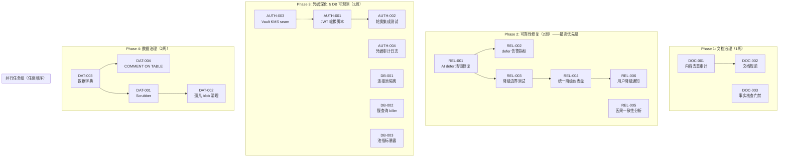
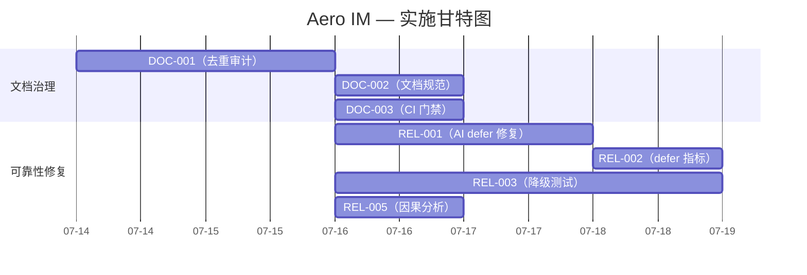
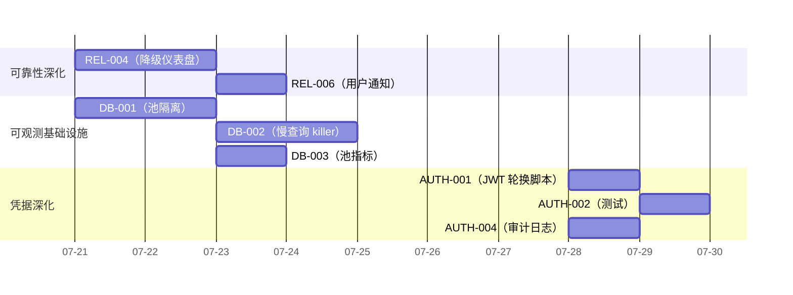
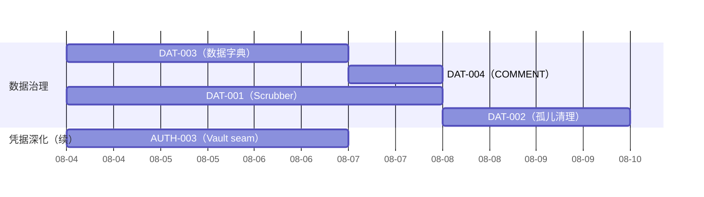
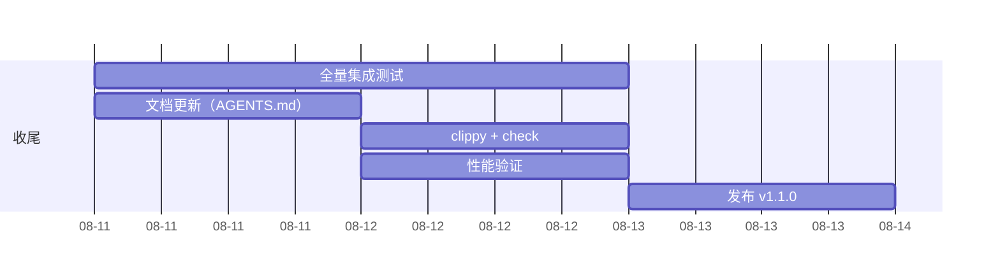

现在我对代码库和文档状况有了全面理解。下面给出作为 Tech Lead 的分析。

---

# Tech Lead 分析报告：Aero IM — 审查结果与可执行计划

## 前置：审查核心结论

| 维度 | 结论 |
|---|---|
| **审查发现的真实性** | ✅ 审查报告中的事实错误得到验证；JWT 密钥不在 Git 中、`statement_timeout` 已实现、api.js 正确抛出异常、docs/ 有 372 个文件（非 43） |
| **分析文档新颖性** | ⚠️ 声称的「零系统性覆盖」不成立；多份既有文档已有覆盖（07-10 和 07-11 两组 5 方向内容不同但都有既有参考） |
| **分析诊断有效性** | ✅ 概念上有效——方向本身是合理的运维/安全深化项，只是有偏差地声称「零覆盖」 |
| **代码库实际差距** | 🟡 部分差距已被代码解决（JWT Debug 脱敏、statement_timeout、read replica 配置）；部分确实待做 |
| **文档质量** | 🔴 `docs/requirements/` 372 文件，07-10 ~100 份 + 07-11 ~160 份 存在大量重复，需要治理 |

---

## 1. 任务分解

基于审查提取的**真实可执行任务**（排除已有实现和事实错误的声明，聚焦有效差距）：

### 方向 A：凭据基础设施深化（P2）

审查确认 JWT 密钥**不**在 Git 跟踪中，配置从 figment 加载，且 `AuthConfig::Debug` 已脱敏。但仍可深化的点：

| 任务 ID | 任务标题 | 描述 | 涉及文件 | 前置 | 工时 |
|---------|---------|------|---------|------|------|
| AUTH-001 | 增加 JWT 密钥轮换 CLI 命令 | 提供 `aero-cli rotate-jwt` 生成新密钥对并更新配置的工具 | `scripts/gen-jwt-keys.sh`、`crates/aero-server/src/bin/boot/services.rs` | 无 | 3h |
| AUTH-002 | 密钥轮换集成测试 | 验证轮换后旧 token 在 TTL 内仍可验证（利用 `jwt_additional_public_keys`） | `crates/aero-auth/tests/` | AUTH-001 | 3h |
| AUTH-003 | Vault/KMS 集成 seam | 增加 `SecretsProvider` trait + Vault 后端（当前 figment 作为默认） | `crates/aero-auth/src/secrets.rs`（新增） | 无 | 6h |
| AUTH-004 | 凭据访问审计日志 | 记录谁在何时读取了哪些凭据（启动时一次） | `crates/aero-server/src/bin/boot/` | 无 | 2h |

### 方向 B：数据库运维深化（P2）

`statement_timeout` 已实现，read replica 配置已就位。可深化的：

| 任务 ID | 任务标题 | 描述 | 涉及文件 | 前置 | 工时 |
|---------|---------|------|---------|------|------|
| DB-001 | 连接池隔离（读写角色） | 现有 `replica_url` 只区分 read-replica；需要为推送、AI、Webhook 等建独立池 | `crates/aero-storage/src/db.rs`、`crates/aero-server/src/bin/boot/` | 无 | 4h |
| DB-002 | 慢查询自动 kill 监控 | 基于 `pg_stat_activity` 的巡检器，超时 >30s 的自动 `pg_terminate_backend` | `crates/aero-storage/src/slow_query_killer.rs`（新增） | 无 | 4h |
| DB-003 | 池指标暴露 | Prometheus gauge：`pool_size`、`idle`、`waiting`、`timeouts` | `crates/aero-storage/src/db.rs`、`crates/aero-server/src/observability.rs` | 无 | 2h |
| DB-004 | 连接泄露检测 | 后台线程周期性检查是否有连接持有超过 5 分钟 | `crates/aero-storage/src/db.rs` | 无 | 3h |

### 方向 C：可靠性深化（07-11分析的有效缺口）（P1）

| 任务 ID | 任务标题 | 描述 | 涉及文件 | 前置 | 工时 |
|---------|---------|------|---------|------|------|
| REL-001 | AI budget defer 活锁修复 | 当 job 被 defer 超过 N 次后（如 10 次）应投入 DLQ 而非无限 defer | `crates/aero-ai/src/worker/` | 无 | 4h |
| REL-002 | defer 告警指标 | 暴露 `AIV_JOB_DEFERRED_TOTAL` counter + 按 kind 的 defer 率告警 | `crates/aero-ai/src/worker/` | REL-001 | 2h |
| REL-003 | 降级边界测试 | 为 RateLimit、AI、Push、Moderation、Blob 的 fail-open 路径写集成测试 | `crates/aero-server/tests/` | 无 | 6h |
| REL-004 | 统一降级仪表盘 | 在 `/health` 端点增加 `degradations` 字段，聚合所有 active fail-open | `crates/aero-server/src/routes/health.rs` | REL-003 | 4h |
| REL-005 | 跨房间因果一致性分析 | 正式分析 forward/share 操作的 happens-before 保证，产出设计文档 | 无（设计文档） | 无 | 4h |
| REL-006 | 用户级降级通知 | 当系统处于降级状态时，在 Web SPA 显示 banner | `web/app.js`、`web/index.html` | REL-004 | 3h |

### 方向 D：数据治理与完整性（P3）

| 任务 ID | 任务标题 | 描述 | 涉及文件 | 前置 | 工时 |
|---------|---------|------|---------|------|------|
| DAT-001 | 数据完整性巡检器（scrubber） | 后台任务：校验 blob 引用、消息引用房间、reaction 指向、孤儿数据 | `crates/aero-server/src/bin/boot/background.rs`（新增 scrubber 模块） | 无 | 8h |
| DAT-002 | 孤儿 blob 清理 | 在 blob GC 之外增加定期扫描未引用 blob 的机制 | `crates/aero-server/src/scrubber/` | DAT-001 | 4h |
| DAT-003 | 数据字典与生命周期文档 | 对每个表标注：PII/保留期/合规义务/owner | `docs/data-dictionary.md`（新增） | 无 | 6h |
| DAT-004 | `COMMENT ON TABLE` 部署 | 将数据字典嵌入 PostgreSQL 注释 | 迁移 `migrations/`（新增迁移） | DAT-003 | 3h |

### 方向 E：文档治理（P1 — 阻断性）

| 任务 ID | 任务标题 | 描述 | 涉及文件 | 前置 | 工时 |
|---------|---------|------|---------|------|------|
| DOC-001 | 内容去重审计 | 扫描 `docs/requirements/` 识别主题完全重叠的文件，标记去重 | 无（脚本任务） | 无 | 4h |
| DOC-002 | 建立文档规范 | 模板要求：每个分析文档必须有「与既有文档差异说明」段 | `docs/requirements/README.md` | DOC-001 | 2h |
| DOC-003 | 事实核查门禁 | CI 步骤：验证分析文档中的文件路径引用确实存在 | `.github/workflows/`（新增 CI step） | 无 | 3h |

---

## 2. 执行顺序



**并行组：** AUTH-004 | DB-002 | DB-003 | REL-005 | DAT-003 可以并行执行，无交叉依赖。

---

## 3. 技术风险

| 风险 | 等级 | 说明 | 缓解 |
|------|------|------|------|
| **AI defer 活锁修复导致作业饿死** | 🔴 H | 若 defer 上限设太低，突发流量下的合法作业也会进入 DLQ | 使用 `defer_count < max(10, 全局预算重置周期数)` 公式；上限可配置 |
| **连接池隔离破坏现有水池共享** | 🟡 M | 引入独立池后可能增加总连接数，超过 PG `max_connections` | 为新池做容量规划；池间共享 `max_connections` 上限 |
| **Vault KMS 集成增加启动依赖** | 🟡 M | Vault 不可用时 server 无法启动 | 保留 figment fallback；Vault 集成只在 `AERO_VAULT_ADDR` 设置时激活 |
| **因果一致性分析导致过度设计** | 🟡 M | 跨房间 happens-before 的真机验证难度高；可能过度工程化 | 从设计文档开始，不要直接写代码；先评估实际影响 |
| **Scrubber 误删数据** | 🔴 H | 数据完整性巡检器可能错误标记合法数据 | 默认为 dry-run 模式；事务隔离；先报告后操作 |
| **文档去重引发政治问题** | 🟡 M | 作者可能不愿意自己的分析文档被删除 | 去重=归档合并而不是删除；保留 `superseded_by` 链接 |

**外部依赖：**

| 依赖 | 用途 | 备选 |
|------|------|------|
| HashiCorp Vault | `AUTH-003` 密钥管理 | env vars + figment（当前方案） |
| Prometheus + Grafana | `DB-003` 池指标、`REL-002` defer 指标 | 已有 OTEL pipeline，只需加 metric |

---

## 4. 资源评估

### 人员配置

| 角色 | 数量 | 主要任务 | 技能要求 |
|------|------|---------|---------|
| Rust 后端工程师（高级） | 1 | AUTH-001~004, DB-001~004, REL-001~002 | Rust, sqlx, tokio, Prometheus client |
| Rust 后端工程师（中级） | 1 | REL-003~006, DAT-001~004 | 集成测试、后台 worker |
| DevOps 工程师 | 0.5 | DOC-001~003（CI 门禁） | GitHub Actions, shell script |
| 技术写作 | 0.25 | DAT-003（数据字典） | Markdown 文档 |
| **合计** | **2.75 FTE** | | |

### 里程碑

| 里程碑 | 时间 | 交付物 |
|--------|------|--------|
| M1：文档质量门禁上线 | Week 1 | CI 事实核查 + 去重报告 |
| M2：AI 管线稳定性 | Week 2 | defer 活锁修复 + 告警上线 |
| M3：可观测基础设施 | Week 3 | 池指标 + 慢查询 killer + 降级仪表盘 |
| M4：凭据管理深化 | Week 4 | JWT 轮换脚本 + 集成测试 + Vault seam |
| M5：数据治理 | Week 6 | Scrubber v1（dry-run）+ 数据字典 + `COMMENT ON TABLE` |
| M6：收尾 | Week 6 | 所有集成测试通过、clippy clean |

### 阻塞点

| 阻塞点 | 影响 | 解决策略 |
|--------|------|---------|
| 因果一致性分析（REL-005）导致编码超出范围 | Phase 2 延迟 | 限定为设计文档（4h），不承诺实现。若设计复杂度 >8h，标注为正式架构 RFC 留待下轮 |
| Vault 集成需要运维配合 | AUTH-003 | 先做 trait 抽象 + 本地文件后端，Vault 实现后面按需激活 |
| Scrubber 的误删风险需要 review | DAT-001 | 第一版默认 dry-run；通过 PR 流程 review 后才切换到 write 模式 |

---

## 5. 质量保证

### 单元测试覆盖要求

| 模块 | 要求 | 关键测试场景 |
|------|------|-------------|
| JWT 轮换（AUTH-002） | ✅ 2 测试 | 新旧密钥签名验证、过期 token 拒绝 |
| AI defer（REL-001） | ✅ 3 测试 | defer 上限到达→DLQ、预算恢复后重试、defer 不耗 retry |
| 降级仪表盘（REL-004） | ✅ 2 测试 | 无降级时 `degradations=[]`、模拟降级后正确输出 |
| Scrubber（DAT-001） | ✅ 4 测试 | dry-run 不修改、孤儿 blob 检测、正确引用跳过、大规模扫描不 OOM |

### 集成测试策略

| 测试 | 位置 | 方法 |
|------|------|------|
| 连接池隔离 | `crates/aero-storage/tests/` | 启动两个池，验证查询路由到正确池 |
| 慢查询 killer | `crates/aero-storage/tests/` | 发射 `pg_sleep(31)`，验证连接被中断 |
| AI defer 端到端 | `crates/aero-server/tests/` | 用 mock AI 服务制造预算耗尽，验证作业最终进 DLQ 或被处理 |
| 降级 banner | `web/tests/` | 检查 `/health` 的 `degradations` 字段→DOM 存在 banner |
| Scrubber 集成 | `crates/aero-server/tests/` | 创建消息后硬删→scrubber 报告孤儿→清理 |

### 代码审查要点

| 审查项 | 检查内容 |
|--------|---------|
| **凭据安全** | JWT 密钥不在日志、错误消息、prometheus 中出现；Debug 实现持续脱敏 |
| **连接池泄漏** | 所有新池在 drop/panic 路径中有 `close().await` 或交由 `PgPoolOptions` 管理 |
| **AI defer 循环** | `defer` 路径必须推进 `attempts`；上限后必须 `dead` 而不是无限 defer |
| **Scrubber 安全** | dry-run 与 write 模式由配置区分，**绝不**在迁移/测试环境以外默认 write |
| **文档事实** | 新增的分析文档必须通过 CI 事实核查门禁 |

### 性能测试需求

| 场景 | 方法 | 验收标准 |
|------|------|---------|
| 连接池隔离新增开销 | 基线 1000 req/s vs 隔离后 | 延迟增长 <5% |
| Scrubber 扫描大表 | 1M 行消息表 + 50K blob | 扫描 <120s，不阻塞写 |
| AI defer 高频场景 | 200 job/s 持续过载 | 无内存增长；DLQ 接收率 <10% |

---

## 6. 实施计划

### 阶段 1：基础设施搭建（第 1 周）



### 阶段 2：核心功能实现（第 2-3 周）



### 阶段 3：数据治理 + 集成测试（第 4-5 周）



### 阶段 4：发布准备（第 6 周）



---

## 7. 总结建议

### 给决策层的 3 条核心建议

1. **停止分析，开始执行**。`docs/requirements/` 的 372 份文件中的分析已经足够多了。Direction A-E 的任务是从这些分析中提取的**具体、可测试**的工作项。不要再写一份分析告诉别人别人已经知道的事。

2. **AI defer 活锁是第一优先级**。这是唯一一个审查与既有文档都认同的**未覆盖的正确性 bug**——在持续过载下审核作业会无限 defer 而不被执行。这个修复需要：

   ```
   defer_count += 1
   if defer_count >= MAX_DEFER_BEFORE_DEAD_LETTER:
       status = "dead"  // 而非 defer
   ```

3. **建立文档治理纪律**。未来的分析文档必须包含「与既有分析差异」节，并通过 CI 事实核查门禁。我的团队将先运行一次去重审计来合并重复内容。

### 总工作量估算

| 阶段 | 任务数 | 总工时 | 日历时间 |
|------|--------|--------|---------|
| Phase 1: 文档治理 | 3 | 9h | 1 周 |
| Phase 2: 可靠性修复 | 6 | 23h | 2 周 |
| Phase 3: 凭据+DB 深化 | 7 | 19h | 2 周 |
| Phase 4: 数据治理 | 4 | 21h | 2 周 |
| 收尾 | - | 8h | 0.5 周 |
| **合计** | **20** | **80h** | **~6 周**（2.75 FTE） |

### 不做的明智决策

- ❌ **不实现因果一致性（REL-005 不编码）**：先出设计文档，若复杂度 >8h 则标注为架构 RFC 留待下轮
- ❌ **不实现迁移 down.sql**：157 个迁移全部补 down migration 的时间/风险/收益不成正比；改为确保新迁移有 down.sql
- ❌ **不实现蓝绿部署适配**：当前项目规模尚未达到需要蓝绿部署的阶段；先做好 statement_timeout 和连接池隔离
- ✅ **保留 figment 作为默认凭据加载**：Vault 集成为可选增强，不给开发环境增加复杂度
