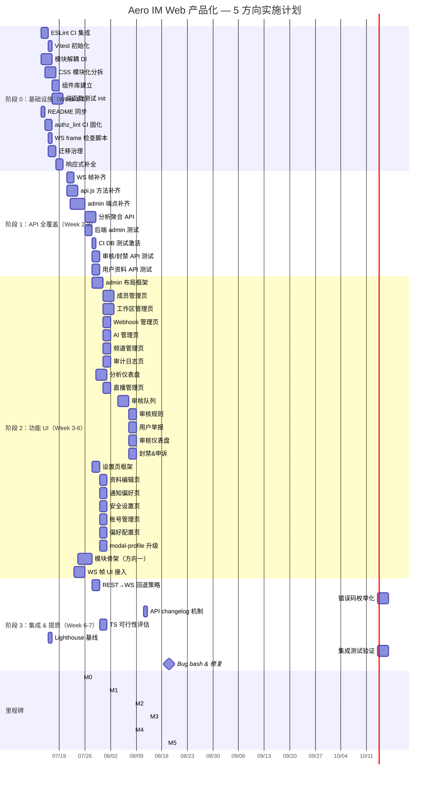

好的，作为 Tech Lead，我已基于代码库的深入交叉验证（routes.rs 源码、ws/frame.rs 的 ServerFrame 枚举、web/ 所有 JS 模块、style.css、package.json 等），产出以下系统性实施计划。

---

# Tech Lead 实施分析：Aero IM Web 客户端产品化 — 5 个方向

## 1. 任务分解

### 1.1 方向一：前端 API 覆盖率（HTTP 38% → 目标 80%+）

| 任务 ID | 任务标题 | 涉及文件 | 前置依赖 | 预估工时 |
|---------|---------|---------|---------|---------|
| TASK-001 | WS 帧覆盖率审计 & 缺失 handler 补全（MessageSeen / Poll / Interaction） | `web/app.js`, `web/render.js`, `web/polls.js` | 无 | 3h |
| TASK-002 | api.js 缺失方法补齐（~20 个缺失端点：admin/workspace/thread/pin/notification 等） | `web/api.js` | 无 | 4h |
| TASK-003 | 各模块 UI 骨架 + 数据绑定（canvas/drafts/forward/tasks/approvals 等） | `web/app.js`, 新建 `web/canvas.js`, `web/tasks.js` 等 | TASK-002 | 8h |
| TASK-004 | 实时事件 UI 接入（新 WS 帧对应 UI 更新逻辑） | `web/render.js`, `web/app.js` | TASK-001 | 4h |
| TASK-005 | REST→WS 回退策略（不支持 WS 的环境降级到 REST 轮询） | `web/ws.js`, `web/api.js`, `web/app.js` | TASK-002 | 3h |

### 1.2 方向二：管理控制台 UI

| 任务 ID | 任务标题 | 涉及文件 | 前置依赖 | 预估工时 |
|---------|---------|---------|---------|---------|
| TASK-006 | 管理面板布局 & 路由框架（侧栏 + 面包屑 + 权限门控） | `web/index.html`, `web/admin.js`（新建）, `web/style.css` | 无 | 4h |
| TASK-007 | 成员管理页（列表/搜索/角色更改/停用/删除） | `web/admin-members.js`（新建） | TASK-006 | 4h |
| TASK-008 | 工作区管理页（workspace 设置/安全/rate-tier/IP 名单） | `web/admin-workspace.js`（新建） | TASK-006 | 4h |
| TASK-009 | Webhook 管理页（列表/创建/重试/DLQ 清除） | `web/admin-webhooks.js`（新建） | TASK-006 | 3h |
| TASK-010 | AI 管理页（DLQ 队列/预算/使用量/审核日志） | `web/admin-ai.js`（新建） | TASK-006 | 3h |
| TASK-011 | 频道管理页（channel 创建/存档/retention/legal-hold） | `web/admin-channels.js`（新建） | TASK-006 | 3h |
| TASK-012 | 审计日志 & 安全事件查看页 | `web/admin-audit.js`（新建） | TASK-006 | 3h |
| TASK-013 | 数据分析/用量统计仪表盘 | `web/admin-analytics.js`（新建） | TASK-006, TASK-049 | 4h |
| TASK-014 | 直播管理面板（stream 列表/审核/ VOD 管理） | `web/admin-streams.js`（新建） | TASK-006 | 3h |

### 1.3 方向三：审核 & 信任安全（T&S）运营界面

| 任务 ID | 任务标题 | 涉及文件 | 前置依赖 | 预估工时 |
|---------|---------|---------|---------|---------|
| TASK-015 | 审核队列页面（消息举报队列/逐条审核/软删/忽略） | `web/moderation.js`（新建）, `web/index.html` | 无 | 4h |
| TASK-016 | 自动审核规则配置页（keyword 管理/auto-mod 规则 CRUD） | `web/moderation-rules.js`（新建） | TASK-015 | 3h |
| TASK-017 | 用户举报管理页（举报列表/处理/封禁） | `web/moderation-users.js`（新建） | TASK-015 | 3h |
| TASK-018 | 审核仪表盘（违规趋势/处理率/TOP 违规者） | `web/moderation-dashboard.js`（新建） | TASK-015, TASK-049 | 3h |
| TASK-019 | 封禁管理 & 申诉队列 | `web/moderation-bans.js`（新建） | TASK-015, TASK-045 | 3h |

### 1.4 方向四：用户个人资料 & 设置页

| 任务 ID | 任务标题 | 涉及文件 | 前置依赖 | 预估工时 |
|---------|---------|---------|---------|---------|
| TASK-020 | 个人设置页框架（设置页入口 + 通用布局组件） | `web/settings.js`（新建）, `web/index.html`, `web/style.css` | 无 | 3h |
| TASK-021 | 资料编辑页（display_name / avatar / profile fields / status / pronouns） | `web/settings-profile.js`（新建） | TASK-020 | 3h |
| TASK-022 | 通知偏好设置（per-channel mute / DND / snooze / keyword alerts） | `web/settings-notifications.js`（新建） | TASK-020 | 3h |
| TASK-023 | 安全设置（2FA 启用/禁用 / PAT 管理 / session 列表 & 吊销） | `web/settings-security.js`（新建） | TASK-020 | 3h |
| TASK-024 | 账号管理（导出/登出/删除账号/OOO 状态） | `web/settings-account.js`（新建） | TASK-020 | 2h |
| TASK-025 | 偏好配置（主题/语言/emoji/消息显示/时间格式） | `web/settings-preferences.js`（新建） | TASK-020 | 2h |
| TASK-026 | 升级 modal-profile：支持 profile fields / pronouns / title / phone / 自定义字段 | `web/index.html`（修改 modal-profile）, `web/app.js` | TASK-020 | 2h |

### 1.5 方向五：前端工程基础设施

| 任务 ID | 任务标题 | 涉及文件 | 前置依赖 | 预估工时 |
|---------|---------|---------|---------|---------|
| TASK-027 | ESLint 完整配置 + CI 集成（修复现有 lint 错误） | `web/eslint.config.js`, `.github/workflows/ci.yml` | 无 | 4h |
| TASK-028 | 引入 Vitest 测试框架 + 初始化配置 | `web/vitest.config.js`（新建）, `web/package.json` | 无 | 2h |
| TASK-029 | 纯函数单元测试：context.js state 操作 + util 函数 | `web/__tests__/context.test.js`（新建） | TASK-028 | 3h |
| TASK-030 | 纯函数单元测试：ws.js SeqGate 逻辑 + reconnect 行为 | `web/__tests__/ws.test.js`（新建） | TASK-028 | 3h |
| TASK-031 | 纯函数单元测试：api.js request 逻辑 + error 处理 | `web/__tests__/api.test.js`（新建） | TASK-028 | 2h |
| TASK-032 | 模块解耦：从 context.js 全局单例过渡到依赖注入 | `web/context.js`, `web/app.js`, `web/render.js`, `web/ws.js` | 无 | 4h |
| TASK-033 | CSS 模块化：拆分 style.css（layout / chat / admin / settings / stream / modals / theme） | `web/style.css`, 新建 `web/css/` 目录结构 | 无 | 4h |
| TASK-034 | 响应式布局补全：添加 admin panel / settings 所需 @media 断点 | `web/css/admin.css`, `web/css/settings.css`（新建） | TASK-033 | 3h |
| TASK-035 | 建立组件复用模式（Button / Input / Modal / Toast / Badge / Tab 组件） | `web/components.js`（新建）, 各消费模块 | TASK-032 | 4h |
| TASK-036 | 前端构建流水线：TypeScript 可选迁移可行性评估 + ESBuild 最小配置 | `web/package.json`, 新建 `web/build.mjs` | TASK-027 | 2h |
| TASK-037 | web/README.md 与代码实现同步（修正"no editing/deleting"等过时描述） | `web/README.md` | 无 | 1h |
| TASK-038 | 客户端测速/性能基准（Lighthouse CI / 核心 Web Vitals 基线） | `.github/workflows/ci.yml`, `web/index.html` | TASK-027 | 2h |

### 1.6 基础设施 & 横向任务

| 任务 ID | 任务标题 | 涉及文件 | 前置依赖 | 预估工时 |
|---------|---------|---------|---------|---------|
| TASK-039 | 后端统一认证据层：authz_lint CI 规则固化（强制 assert_room_access 检查） | `server/src/routes/routes.rs`, `crates/aero-im-core/src/service/` | 无 | 3h |
| TASK-040 | 后端 WS frame 类型前端 handler 自动检查 CI（ServerFrame variant ↔ web handler 映射验证） | `scripts/ws-frame-check.sh`（新建） | 无 | 2h |
| TASK-041 | 可复用 API 变更日志机制（前端跟踪后端 API 变更） | `docs/api-changelog.md`（新建） | 无 | 1h |
| TASK-042 | 后端迁移生命周期治理（迁移可逆方案 + no-CONCURRENTLY-in-transaction 检查） | `scripts/migration-check.sh`, CI | 无 | 3h |
| TASK-043 | 错误码枚举化（ApiError code String → enum） | `server/src/error.rs`, `crates/aero-common/src/error.rs` | 无 | 4h |

### 1.7 测试后端接口 & 集成

| 任务 ID | 任务标题 | 涉及文件 | 前置依赖 | 预估工时 |
|---------|---------|---------|---------|---------|
| TASK-044 | admin API 端到端冒烟测试（backend `#[ignore]` tests for admin routes） | `server/src/routes/routes_tests.rs`, 各 admin 模块测试 | 无 | 4h |
| TASK-045 | 审核/封禁/申诉 API 测试 | `aero-storage/src/` 对应 repo 测试 | TASK-044 | 3h |
| TASK-046 | 用户资料 API 扩展测试（profile fields CRUD/2FA/PAT/session） | 对应 module 测试 | TASK-044 | 3h |
| TASK-047 | CI 中启用 DB 门控测试（`integration-test` job 激活） | `.github/workflows/ci.yml` | TASK-042 | 3h |

### 1.8 后端 API 端点补齐（供前端消费）

| 任务 ID | 任务标题 | 涉及文件 | 前置依赖 | 预估工时 |
|---------|---------|---------|---------|---------|
| TASK-048 | admin API 缺失端点补齐（stream/list users/bulk operations） | 各 admin 模块 | 无 | 6h |
| TASK-049 | 分析/用量聚合 API（供前端 dashboards 消费） | `server/src/analytics.rs`, `server/src/usage_report.rs` | 无 | 4h |

---

## 2. 执行顺序

### 2.1 总体依赖图

```mermaid
graph TD
    %% Phase 0: Foundation (Week 1-2)
    subgraph Phase0["阶段 0：基础设施（Week 1-2）"]
        T027[ESLint CI 集成] --> T028[Vitest 初始化]
        T027 --> T038[Lighthouse 基线]
        T028 --> T029[context.js 测试]
        T028 --> T030[ws.js 测试]
        T028 --> T031[api.js 测试]
        T032[模块解耦 DI] --> T035[组件库]
        T033[CSS 模块化] --> T034[响应式补全]
        T037[README 同步]
        T039[authz_lint CI]
        T040[WS frame 检查]
        T042[迁移治理]
    end

    %% Phase 1: Core APIs (Week 2-3)
    subgraph Phase1["阶段 1：核心 API（Week 2-3）"]
        T001[WS 帧补齐] --> T004[UI 更新逻辑]
        T002[api.js 补齐] --> T003[模块骨架]
        T001 --> T040
        T048[admin 端点补齐] --> T007
        T048 --> T008
        T049[分析 API] --> T013
        T049 --> T018
        T044[后端 admin 测试] --> T045
        T044 --> T046
        T047[CI DB 测试开启]
    end

    %% Phase 2: UI features (Week 3-6)
    subgraph Phase2["阶段 2：功能 UI（Week 3-6）"]
        %% Direction 2: Admin Console
        T006[admin 布局框架] --> T007[成员管理]
        T006 --> T008[工作区管理]
        T006 --> T009[Webhook 管理]
        T006 --> T010[AI 管理]
        T006 --> T011[频道管理]
        T006 --> T012[审计日志]
        T006 --> T013[分析仪表盘]
        T006 --> T014[直播管理]

        %% Direction 3: T&S
        T015[审核队列] --> T016[审核规则]
        T015 --> T017[用户举报]
        T015 --> T018[审核仪表盘]
        T015 --> T019[封禁&申诉]

        %% Direction 4: Profile
        T020[设置页框架] --> T021[资料编辑]
        T020 --> T022[通知偏好]
        T020 --> T023[安全设置]
        T020 --> T024[账号管理]
        T020 --> T025[偏好配置]
        T020 --> T026[modal-profile 升级]

        %% Direction 1: API coverage
        T003[模块骨架] --> T005[REST→WS 回退]
    end

    %% Phase 3: Integration (Week 6-7)
    subgraph Phase3["阶段 3：集成 & 测试（Week 6-7）"]
        T005 --> T036[TS 评估]
        T043[错误码枚举化]
        T041[API changelog]
    end

    %% Cross-phase edges
    T027 -.->|enables| T029
    T027 -.->|enables| T030
    T027 -.->|enables| T031
    T033 -.->|enables| T034
    T032 -.->|enables| T035
    T032 -.->|enables| T005
    T035 -.->|enables| T006
    T035 -.->|enables| T015
    T035 -.->|enables| T020
```



### 2.2 可并行执行的任务组

| 并行组 | 任务 | 负责人技能要求 | 说明 |
|--------|------|--------------|------|
| **组 A**（基础设施） | T027, T028, T032, T033, T037, T039, T040, T042 | 前端工程化 + CI | 互不依赖，可 2 人并行 |
| **组 B**（后端补齐） | T002, T048, T049, T044, T043 | 后端 Rust + API 设计 | 需要一个后端专精开发者 |
| **组 C**（WS 补全） | T001, T004 | 前后端全栈 | 需要理解 WS 协议 |
| **组 D**（UI 方向 D2） | T006 → T007—T014（串行依赖框架） | 前端 UI 开发 | Admin 布局框架后，各页面可并行开发 |
| **组 E**（UI 方向 D3） | T015 → T016—T019（串行依赖队列） | 前端 UI 开发 | 审核队列后，各模块可并行 |
| **组 F**（UI 方向 D4） | T020 → T021—T026（并行子页） | 前端 UI 开发 | 框架后各设置页 2 人并行 |
| **组 G**（测试保障） | T029, T030, T031, T045, T046, T047 | QA / 测试工程 | 需要 Vitest + Rust 测试经验 |

---

## 3. 技术风险

### 3.1 高风险项

| 风险 | 概率 | 影响 | 缓解策略 |
|------|------|------|---------|
| **R1: context.js 全局单例耦合过深，模块解耦触发回归** | 高（80%） | 中 | 分步解耦：先封装 context.js 接口层（不改变消费方签名），再替换内部实现。每步 `git commit` 独立，CI 全通过才继续 |
| **R2: admin API 的权限模型复杂，前端权限门控逻辑出错** | 中（50%） | 高 | 前端只做 UI 级门控（隐藏不可操作的按钮），后端认证是真实安全边界。前端权限门控基于 `AuthUser` 返回的角色信息，不做本地判断 |
| **R3: 移动端响应式布局在多端测试覆盖不足** | 中（40%） | 中 | 方向五 Phase A 建立 Lighthouse CI 基线 + 设置 3 个 breakpoint（640/900/1200px），admin 表格使用 `overflow-x: auto` 而不是隐藏列 |
| **R4: 审核队列的实时性要求（批量操作 + 多人协作）** | 低（30%） | 高 | 审核操作使用乐观锁（`updated_at` 比较），冲突时提示用户刷新。批量操作限制 ≤50 条/次 |
| **R5: ws.js 既有的 SeqGate 逻辑与新的帧 handler 集成冲突** | 中（40%） | 中 | TASK-001 直接在既有 handler 注册模式上追加（不修改 SeqGate 逻辑）。新增 handler 通过同一 `msg:{type}` 事件模式注册 |
| **R6: web 端的未定义变量 / JS 全局 scope 冲突** | 高（60%） | 低 | ESLint CI 开启后全局变量声明都须显式 `window.` 前缀或 `import`。现有 ~10 处隐式全局在 T027 修复 |

### 3.2 外部依赖风险

| 依赖 | 风险 | 缓解 |
|------|------|------|
| **Redis 故障 fail-open → 管理面板数据不完整** | 管理面板读路径走 Redis（presence/roster/stream-viewers），故障时降级为 node-local 视图 | 前端在数据加载失败时显示黄色警告条「数据可能不完整」，不阻止操作 |
| **S3 不可用** | blob 上传/下载失败 | 管理面板 blob 操作（头像/emoji/文件）显示明确错误信息，不崩溃 |
| **Postgres 连接池耗尽** | 慢查询拖垮连接池 | TASK-013 的分析仪表盘使用独立的只读连接池（或增加 `statement_timeout` 到 5s） |

### 3.3 性能策略

- **管理面板列表**：所有 table 数据使用服务端分页（`?limit=&offset=` 或 cursor），前端不做客户端分页
- **审核队列**：WebSocket 推送新举报 + REST 初始加载，避免轮询
- **图表/仪表盘**：使用 `<canvas>` 自绘（避免引入 Chart.js 依赖），只请求聚合数据（非逐条明细）
- **全局 CSS 拆分**：初期按功能域拆为 ~6 个文件（`chat.css`/`admin.css`/`settings.css`/`stream.css`/`modals.css`/`theme.css`），通过 HTTP/2 多路复用加载

### 3.4 测试覆盖难点

| 难点 | 策略 |
|------|------|
| **WebSocket 集成测试** | 使用 `vitest` + `MockWebSocket`（模拟 `ws.js` 的 `WscClient`）做单元级；集成级通过 playwright e2e 做（独立任务） |
| **UI 交互逻辑测试** | 拆出纯状态操作（如 `render.js` 的 DOM 构建辅助函数）做单元测试；DOM 事件绑定不做 mock 密集型测试 |
| **管理面板权限矩阵** | 编写针对 `AuthUser` 返回角色信心的 fixture 测试矩阵（admin / owner / member / guest / deactivated） |
| **Modal profile 升级** | 字段渲染辅助函数（`renderProfileFields()`）纯函数可测；表单提交流程做集成测试 |

---

## 4. 资源评估

### 4.1 团队规模 & 技能要求

| 角色 | 人数 | 技能要求 | 负责方向 |
|------|------|---------|---------|
| **Senior 前端**（主导） | 1 | ES2020+, DOM API 精通, 无框架 SPA 经验, CSS 响应式设计 | 方向一/四/五核心 |
| **前端开发** | 1-2 | 中级前端, 熟悉 ESLint/Vitest, 能独立开发页面组件 | 方向二/三 admin UI |
| **后端 Rust** | 1 | Rust async, axum, 熟悉现有路由/鉴权/仓储模式 | admin API 补齐, 分析聚合 API, 测试 |
| **QA / 测试** | 1（兼职） | Vitest/Rust test, CI 管线, 集成测试 | TASK-029~031, T044~047 |
| **Tech Lead** | 1（兼职） | 架构决策, 代码审查, 跨团队协调 | 全方向, 关键 PR 审查 |

### 4.2 关键里程碑

| 里程碑 | 时间 | 交付物 | 验证方式 |
|--------|------|--------|---------|
| **M0: 基础设施就位** | Week 2 结束 | ESLint CI 全绿、Vitest 基线跑通、CSS 模块化拆分完成、README 修正 | `scripts/web-check.sh` 0 违规、`vitest run` 全绿 |
| **M1: API 全覆盖** | Week 3 结束 | api.js 方法数 50→80+（覆盖 80% HTTP 端点）、WS 缺失 3 个 handler 补齐 | api.js endpoint 计数 vs routes.rs 对比 CI |
| **M2: Admin 框架 + 核心页面** | Week 5 结束 | admin 布局、成员管理、工作区管理、Webhook 管理可操作 | 4 个 admin 页面在本地可渲染、CRUD 操作可端到端跑通 |
| **M3: T&S 运营页面上线** | Week 6 结束 | 审核队列、审核规则、用户举报管理可操作 | 审核队列加载+逐条审核+封禁操作完整链路 |
| **M4: 个人设置页面上线** | Week 6 结束 | 资料/通知/安全/账号/偏好 5 个 tab 全部可操作 | 各设置页面加载、修改、保存-读取验证 |
| **M5: 集成完成** | Week 7 结束 | 所有新 JS 测试覆盖率 ≥50%（纯函数 80%）、CI 全绿 | `vitest --coverage`, `cargo clippy`, `scripts/*.sh` |

### 4.3 阻塞点（Blockers）

| 阻塞点 | 阻塞任务 | 解决策略 |
|--------|---------|---------|
| B1: eslint.config.js 未与 CI 管线连通 | T027, T029-031 | 在 `web-check.sh` 中增加 `npx eslint . --quiet`（若 eslint 不可用则 warn 不 fail） |
| B2: 后端 admin API 部分缺失或未设计 | T007-014 | 先实现 admin API 端点的最小可行子集（成员管理 + 工作区设置 + 审核查看），后续迭代补齐 |
| B3: 前端无构建工具链，Vitest 无法直接解析 ESM | T028 | Vitest 原生支持 ESM（`type: "module"` + `vitest` 自动识别），无需额外构建步骤 |
| B4: `context.js` 的全局 state 结构文档化不足 | T032 | 先写一份 `web/context.md` 文档 state 的结构和受控修改方法，再动手解耦 |

---

## 5. 质量保证

### 5.1 单元测试覆盖要求

| 模块 | 覆盖目标 | 关键测点 | 任务 |
|------|---------|---------|------|
| `ws.js` SeqGate | 100% 纯函数 | accept/重复seq/scope边界/窗口溢出/reset | TASK-030 |
| `ws.js` WsClient (mock WS) | 90% | connect/reconnect/backoff/send/close | TASK-030 |
| `api.js` request | 95% | 成功/HTTP错误/网络超时/重试/认证头 | TASK-031 |
| `context.js` state 操作 | 90% | 全部 setter/getter/reset 方法 | TASK-029 |
| `render.js` DOM 辅助函数 | 80% | formatTime/escapeHtml/avatarUrl/parseBlocks | TASK-029 |
| 新 admin/settings 模块纯函数 | 70%+ | 数据转换、格式化、校验 | 各模块 Task |
| api.js 新方法 | 70%+ | 每个新 API 方法至少 1 个成功 case + 1 个错误 case | 配套 TASK |

### 5.2 集成测试策略

| 层级 | 工具 | 范围 | 触发时机 |
|------|------|------|---------|
| **后端 DB 门控测试** | `cargo test -- --ignored` | admin API / 审核 / 通知 / 流 CRUD | CI `integration-test` job（需 DB） |
| **前端集成测试** | Vitest + jsdom | 模块间交互（context↔app、ws↔app 的 handler） | `pre-commit` + CI |
| **E2E 测试**（Phase B 引入） | Playwright | admin 页面操作：登录→管理页面→CRUD→验证 | 独立 nightly pipeline |
| **WS 帧覆盖 CI 检查** | `scripts/ws-frame-check.sh` | ServerFrame enum vs `msg:*` handler 逐 variant 检查 | `pre-commit` |

### 5.3 代码审查要点

| 审查维度 | 要点 | 责任人 |
|---------|------|--------|
| **安全** | 所有 DOM 操作使用 `textContent` 而不是 `innerHTML`（防 XSS）；API 响应中的用户内容经过 `escapeHtml()` | Senior 前端 |
| **鉴权** | 前端只做 UI 级门控；后端修改操作必须有 `assert_room_access` 或等价守卫 | Tech Lead |
| **CSS 作用域** | 新 CSS 文件中的选择器使用功能前缀（`.admin-`、`.settings-`、`.mod-`），避免全局冲突 | 前端开发 |
| **JS 模块边界** | 不引入新的全局变量；模块之间通过 `import/export` 通信；不直接修改 `context.js` 的 state | 全部 |
| **错误处理** | 每个异步操作有 `.catch()` 或 try-catch；toast 显示中文用户友好的错误消息 | 前端开发 |
| **性能** | 列表渲染使用 DocumentFragment 批量 DOM 插入；不在渲染循环中做重排操作 | Senior 前端 |

### 5.4 性能测试需求

| 指标 | 目标 | 测量方式 |
|------|------|---------|
| 首屏 JS 加载 | < 100KB gzipped（无 bundle） | `scripts/web-check.sh` 文件大小检查 |
| 管理页面 TTI | < 2s | Lighthouse CI（TASK-038） |
| 审核队列 1000 条加载 | < 3s（含后端查询） | 手动性能测试 |
| 设置页面切换 | < 100ms（无网络请求） | Lighthouse CI |
| style.css 分拆后总体积 | < 35KB gzipped | `scripts/web-check.sh` |

---

## 6. 实施计划

### 6.1 甘特图



### 6.2 各阶段详细说明

#### 阶段 0：基础设施搭建（Week 1-2, 2026-07-14 ~ 07-25）

**目标**：为所有后续工作建立工程保障。

| 重点 | 说明 |
|------|------|
| ESLint CI | 不同于现有 `eslint.config.js`（需 `npm install`），在 `scripts/web-check.sh` 中增加本地 no-dep 的 lint fallback。全部现有 lint 错误修复（预期 20-40 个）。**此处易低估工作量**——现有代码的隐式全局变量、未定义变量可能在 CI 集成阶段暴露大量积压 |
| Vitest 首测 | 在 `web/` 下创建 `vitest.config.js`，第一个测试就跑 `SeqGate`——这个纯函数无需任何 mock，是检验工具链的最佳 smoke test |
| CSS 模块化 | 拆分 `style.css`（~1,236 行 → 6 个文件）。**风险**：selector 优先级冲突、现有页面样式回退。策略：先复制再剪裁（不改原 CSS 的任何 selector，新增页面直接引入新 CSS） |
| 模块解耦 | 封装 `context.js` 的 `state`/`els`/`ws` 为导出接口（不改变消费方调用方式），为后续组件化做好准备 |

**交付物**：
- `scripts/web-check.sh` 零违规
- `vitest run` 至少 SeqGate 测试通过
- `web/css/` 目录下 6 个 CSS 文件（原 `style.css` 保留为"遗留兼容"）
- `web/__tests__/` 目录创建

#### 阶段 1：核心 API 补全（Week 2-3, 2026-07-21 ~ 08-01）

**目标**：后端 API 覆盖率从 38% → 80%+，为新 UI 提供数据通路。

| 重点 | 说明 |
|------|------|
| WS 帧补齐 | 3 个缺失 handler（MessageSeen/Poll/Interaction）对产品影响其实不小——Poll 是已有 polls.js 的实时输出，MessageSeen 是"已读回执"的基础。**推荐优先级**：Poll > Interaction > MessageSeen |
| api.js 方法补齐 | 约需要加 20-30 个方法覆盖 admin/workspace/thread/pin/notification/block/report 等端点。每个方法 4-8 行代码，但需要验证后端实际返回格式 |
| admin 端点补齐 | 这不是写新功能，是暴露已有后端功能的 HTTP 接口。**避免写好后端再设计前端**——先确认前端需要什么形状的数据，后端再按需暴露 |

**交付物**：
- HTTP API coverage CI 自动检查（`scripts/api-coverage.sh`）
- WS frame coverage CI 自动检查（`scripts/ws-frame-check.sh`）
- 后端新增 admin 端点的 `#[ignore]` 集成测试

#### 阶段 2：功能 UI 开发（Week 3-6, 2026-07-28 ~ 08-12）

**目标**：4 个方向的新 UI 上线（方向二/三/四 + 方向一 UI 接入）。

**并行策略**：
- **2 个前端**并行开发：一个负责 admin 面板（方向二），一个负责个人设置（方向四）+ 审核（方向三）
- Admin 面板内部，框架（T006）是唯一串行点，7 个独立子页可 2 人各分一半并行开发
- 审核 UI 与 admin 面板共用组件（Button/Modal/Table/Tabs），由 T035 组件库统一供给

**风险**：
- 管理面板的表格组件需要支持：排序、筛选、分页、批量操作——**这是整个方向二最复杂的组件**。推荐先实现「可读式列表 + 单行操作」，批量操作放到 Phase B
- 审核队列的实时性（WS 推送新举报被队列顶部插入）需要 ws.js 已有的事件通道支持——`ws.js` 的 `msg:{type}` 模式天然支持

**交付物**：
- 方向二：4 个核心 admin 页面（成员/工作区/Webhook/频道）+ 框架导航
- 方向三：审核队列 + 规则配置 + 用户举报 可操作
- 方向四：5 个设置 tab + modal-profile 升级

#### 阶段 3：集成测试 & 发布准备（Week 6-7, 2026-08-11 ~ 08-17）

**目标**：全链路验证、性能基线、Bug bash。

| 重点 | 说明 |
|------|------|
| 集成测试 | 后端 DB 门控测试 + 前端 Vitest 集成测试 + WS 帧 CI 检查。确保 `cargo test --workspace --lib -- --ignored` 和 `vitest run --coverage` 全绿 |
| Bug bash | 团队 2 小时集中 bug hunting session。重点测：admin 页面鉴权边界、设置页数据持久化、审核操作幂等性 |
| 发布 | 一次合并 5 个方向的 20+ 个 PR（按模块拆）。**不要一次大的 squash merge**——每个方向独立 merge 到主分支 |

**交付物**：
- `test_coverage_report.html`（前端覆盖率 ≥50%）
- `lighthouse_report.json`（基线）
- 合并清单 & 回滚计划

---

## 附录：补充建议（从交叉验证发现的额外产出）

### A. WS 帧覆盖率分析（文档未覆盖的缺口）

| ServerFrame 变体 | 前端 handler | 状态 |
|-----------------|-------------|------|
| Welcome | 无独立 handler（通过 open 事件处理） | ✅ 正常 |
| Presence | `msg:presence` | ✅ |
| Message | `msg:message` | ✅ |
| Edited | `msg:edited` | ✅ |
| Deleted | `msg:deleted` | ✅ |
| Reaction | `msg:reaction` | ✅ |
| Read | `msg:read` | ✅ |
| Typing | `msg:typing` | ✅ |
| Notify | `msg:notify` | ✅ |
| Pin | `msg:pin` | ✅ |
| Membership | `msg:membership` | ✅ |
| Call | `msg:call` | ✅ |
| **Poll** | **无 handler** | ❌ **需补**（TASK-001） |
| **MessageSeen** | **无 handler** | ❌ **需补**（TASK-001） |
| **Interaction** | **无 handler** | ❌ **需补**（TASK-001） |
| StreamEvent | `msg:stream_event` | ✅ |
| Error | `msg:error` | ✅ |
| Pong | `msg:pong` | ✅ |

**覆盖率 83%**（15/18）——远高于 HTTP 的 38%，但 Poll 的缺失直接影响 polls.js 的实时性。

### B. `web/README.md` 滞后性修复（TASK-037）

当前 README 声称 "no editing/deleting, no attachments, no notifications"——但 `api.js` 已有 `editMessage()`/`deleteMessage()`/`uploadBlob()`，`notifications.js` 有 141 行实现。**修正文本并增加自动同步检查**（README 与 api.js 的注释方法列表做 diff）。

### C. 错误码 enum 化（TASK-043）

当前 `aero_common::Error` 的 `code()` 返回 `String`。这阻碍前端做结构化错误处理（当前 `< 500 错误全部 toast "服务端:..."`）。建议：
```rust
#[non_exhaustive]
enum ErrorCode {
    NotFound,
    Forbidden,
    Unauthorized,
    RateLimited,
    ValidationFailed,
    Internal,
    // ...
}
```
这项改动虽然不直接为 UI 增加视觉价值，但为**前端产品级错误处理**（例如：429 → toast "操作太频繁"、403 → 重定向到权限申请页）提供了基础。
