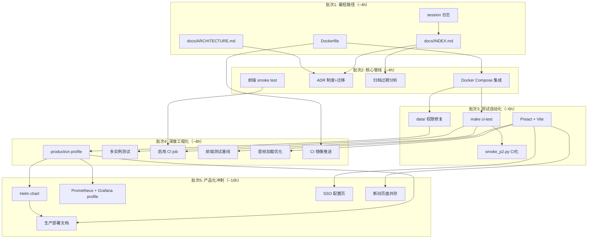
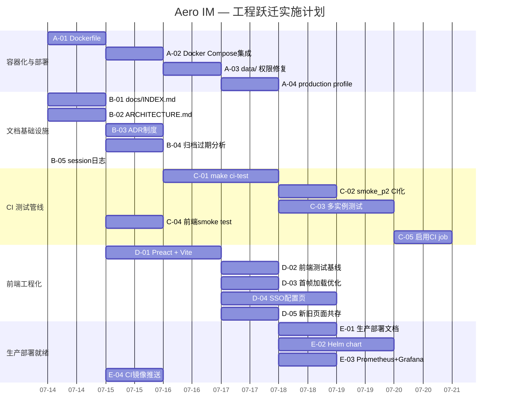

# Tech Lead 分析报告：从「功能完备」到「可交付产品」的工程跃迁

## 摘要

本分析基于 `/home/u1/aero-im/docs/requirements/2026-07-11-five-engineering-transitions-from-prototype-to-product.md`，结合项目现状验证（273 份分析文档、38 个手动冒烟脚本、0 JS 测试、0 Dockerfile、0 文档导航），对该文档提出的 5 个工程跃迁方向进行任务分解、依赖编排、风险评估与实施规划。

**核心判断**：该文档的诊断是**准确且有建设性的**。项目拥有 87+ 功能点、819 个单元测试、扎实的后端架构（NATS + Hub + WS 扇出），但「交付腺」——CI、部署、前端工程化、知识管理——全部阻塞，导致功能无法到达真实用户。

---

## 1. 任务分解

将 5 个跃迁拆解为 **21 个可执行任务**（每个 2-4 小时），按方向分组。

### 1.1 方向 A：容器化与一键部署（Dockerfile + Docker Compose 集成）

| 任务 ID | 标题 | 涉及文件 | 前置 | 工时 | 验收标准 |
|---------|------|---------|------|------|---------|
| **A-01** | 编写多阶段 `Dockerfile` | `Dockerfile.new`, `.dockerignore` | 无 | 2h | `docker build -t aero-server .` 成功，产物 < 200MB |
| **A-02** | 集成 aero-server 到 `docker-compose.yml` | `docker-compose.yml` | A-01 | 1.5h | `docker compose up --build` 启动全部服务，server ready 且可响应 `/health` |
| **A-03** | 解决 `data/` 权限摩擦 | `docker-compose.yml`（用户映射）, 可选 `entrypoint.sh` | A-02 | 1h | 无需 `AERO__SERVER__BLOB_DIR` 覆盖，容器启动后本地 server 可写 blob |
| **A-04** | `production` profile（无 Jaeger, 资源限制, healthcheck） | `docker-compose.yml`, 可选 `docker-compose.prod.yml` | A-02 | 2h | `docker compose --profile production up` 启动无 Jaeger 的可部署栈 |

### 1.2 方向 B：文档基础设施与知识管理

| 任务 ID | 标题 | 涉及文件 | 前置 | 工时 | 验收标准 |
|---------|------|---------|------|------|---------|
| **B-01** | 创建 `docs/INDEX.md` 导航索引 | `docs/INDEX.md` | 无 | 1.5h | 所有 `docs/` 子目录均有条目，标注类型/状态/一句话结论 |
| **B-02** | 创建 `docs/ARCHITECTURE.md` 一页概览 | `docs/ARCHITECTURE.md` | 无 | 2h | 一页内覆盖数据流（NATS→Hub→WS）、crate 依赖图、核心抽象 |
| **B-03** | 建立 ADR 记录制度 + 迁移既有决策 | `docs/decisions/ADR-*.md`, 迁移 `docs/decisions/DECISIONS.md` | B-01 | 2h | `docs/decisions/DECISIONS.md` 拆分为 ≥3 个独立 ADR 文件（ADR-001~003），模板就绪 |
| **B-04** | 归档过期分析文档 | `docs/archive/`, `docs/requirements/` 文档标记 `superseded-by` | B-01 | 2h | ≥30 份分析文档标记 superseded 或移入 archive |
| **B-05** | 建立 session 学习日志 | `docs/session-logs/`, `docs/session-logs/.gitkeep` | 无 | 0.5h | 日志目录就绪，模板文件存在，`docs/INDEX.md` 收录 |

### 1.3 方向 C：CI 集成测试管线

| 任务 ID | 标题 | 涉及文件 | 前置 | 工时 | 验收标准 |
|---------|------|---------|------|------|---------|
| **C-01** | `make ci-test` 目标——单命令集成测试 | `Makefile`, `scripts/ci-test.sh` | A-02（需要容器化 server） | 2h | `make ci-test` 在 throwaway 库上跑通 `smoke.sh`，失败返回非零退出码 |
| **C-02** | 将 `smoke_p2.py`（P2 冒烟）加入 CI | `scripts/ci-test.sh`, `.github/workflows/ci.yml`（取消注释 integration-test job） | C-01 | 2h | CI 中 `smoke_p2.py` 自动通过；错误时阻断 PR |
| **C-03** | 多实例集成测试 | `scripts/ci-multi-instance.sh`, `Makefile` | C-01 | 3h | 启动 2 个 server 实例（不同端口），验证跨实例消息投递 + 去重 + 游标 |
| **C-04** | 前端 smoke test（加载不崩溃、关键 DOM 存在） | `scripts/ci-web-smoke.sh`, `.github/workflows/ci.yml` | 无 | 1.5h | `node scripts/ci-web-smoke.js` 验证 `index.html` 无 404、无 JS 异常 |
| **C-05** | 启用集成测试 CI job | `.github/workflows/ci.yml` | C-01~C-04 | 0.5h | CI 中 `integration-test` job 自动运行，PR 合并前阻断 |

### 1.4 方向 D：前端工程化基础

| 任务 ID | 标题 | 涉及文件 | 前置 | 工时 | 验收标准 |
|---------|------|---------|------|------|---------|
| **D-01** | 引入 Preact + 构建工具链 | `web/package.json`, `web/vite.config.js`, `web/` 迁移至 `src/` 目录 | 无 | 3h | `npm run build` 产出打包后单文件；`npm run dev` 可热更新开发 |
| **D-02** | 建立前端测试基线（Vitest + 首轮 smoke） | `web/vitest.config.js`, `web/src/__tests__/smoke.test.js` | D-01 | 2h | ≥5 个 smoke 测试通过；`npm test` 在 CI 中运行 |
| **D-03** | 首帧加载优化（modulepreload / 合并关键模块） | `web/index.html`, `web/src/*.js` | D-01 | 1.5h | 首帧 HTTP 请求从 ~15 降为 ≤3（关键路径） |
| **D-04** | 实现第一个管理控制台页面（SSO 配置页） | `web/src/pages/sso-config.js`, `web/src/router.js` | D-01 | 4h | 管理员可访问 `/admin/sso` 页，通过表单配置 OIDC SSO（缺后端则显示 mock） |
| **D-05** | 旧页面逐步迁移骨架（保持双模式共存） | `web/index.html` 升级入口，`web/src/legacy-bridge.js` | D-01 | 2h | 新 Preact 页面与旧 ES Module 页面可共存切换 |

### 1.5 方向 E：生产部署就绪

| 任务 ID | 标题 | 涉及文件 | 前置 | 工时 | 验收标准 |
|---------|------|---------|------|------|---------|
| **E-01** | 编写生产部署文档 | `docs/deployment/production.md` | A-04 | 2h | 涵盖：依赖清单、配置 checklist、TLS 终止、NATS cluster 模式、备份策略、扩容流程 |
| **E-02** | 初始 Helm chart | `charts/aero-im/Chart.yaml`, `charts/aero-im/templates/*` | A-04 | 4h | `helm template` 产出有效 Kubernetes manifest（Deployment + Service + ConfigMap + migration Job） |
| **E-03** | Prometheus + Grafana docker compose profile | `docker-compose.monitoring.yml`, `monitoring/` 仪表盘配置激活 | A-04 | 2h | `docker compose -f docker-compose.yml -f docker-compose.monitoring.yml up` 启动带监控的完整栈 |
| **E-04** | 编写 CI 构建 → Docker 镜像推送 | `.github/workflows/release.yml`, `Dockerfile` | A-01 | 2h | CI 中 build 镜像并打 tag，推送到 registry（`docker.pkg.github.com` 或 Docker Hub） |

---

## 2. 执行顺序与依赖图



### 并行化策略

| 并行组 | 任务 | 所需技能 | 互不干扰保证 |
|--------|------|---------|------------|
| **组1：容器 + 前端 + 文档** | A-01, B-01, B-02, D-01 | Rust + Docker / 前端 / 文档写作 | 文件完全不重叠 |
| **组2：测试 + 归档** | C-04, B-03, B-04, A-02 | Shell + Node / Git / Docker | `scripts/` 与 `docs/` 不冲突 |
| **组3：CI + 权限 + 前端框架** | A-03, C-01, C-02, D-02 | Docker / CI 配置 / 前端测试 | 不同文件系统空间 |

---

## 3. 技术风险

### 3.1 高影响风险

| 风险 | 概率 | 影响 | 缓解策略 |
|------|------|------|---------|
| **Rust 多阶段构建膨胀** | 中 | 高 | Release 构建需 ~30min，镜像 >1GB。缓解：使用 `cargo chef` 或 `cargo build --release` 缓存依赖层；`.dockerignore` 排除 `docs/`, `web/node_modules` |
| **多实例测试非确定性失败** | 中 | 高 | 两个实例竞争条件（seq 竞态、NATS consumer 注册时机）。缓解：启动后 `sleep 2` + retry 模式；测试断言用 `try_wait(5s)` 而非立即 assert |
| **前端迁移中旧页面退化** | 中 | 高 | 渐进迁移期间旧 JS 路径可能被新构建管线打断。缓解：`legacy-bridge.js` 严格隔离，加 CI 步骤验证旧页面加载不崩溃 |
| **`data/` 权限修复引入 docker-compose 不兼容** | 低 | 中 | 卷映射用户 ID 在不同 Linux 发行版不同（UID 1000 vs 1001）。缓解：加 `entrypoint.sh` 运行时 fix，而非硬编码 UID |
| **273 份分析文档归档决策争议** | 中 | 中 | 谁决定哪些 superseded？作者可能不同意。缓解：只对 `2026-07-09-*` 密集重复的批次自动标记，保留原始文件移入 archive |

### 3.2 低影响但需关注的风险

| 风险 | 说明 |
|------|------|
| **`make ci-test` 中 server 启动超时** | 首次 `cargo build` 可能 >5min；用 `cargo build --release` 或缓存；超时设为 120s |
| **Helm chart 维护成本** | Kubernetes 版本差异可能导致模板不兼容；初始 chart 保持简单（Deployment + Service + ConfigMap），不覆盖 Ingress/CRD |
| **前端测试真浏览器依赖** | Playwright 需要 Chromium 二进制，CI 中拉取 ~300MB。缓解：先用 `node --test` 做无 DOM smoke，有 DOM 测试用 `happy-dom` 而非 Playwright |

### 3.3 技术难点详细分析

**难点1：多实例测试（C-03）**
- 两个 server 实例绑定不同端口（`AERO__SERVER__PORT=3031`），共享同一 NATS/Redis/PG
- 需验证：实例 A 发消息 → NATS 扇出 → 实例 B 的 WS 客户端收到
- 竞争条件：首个实例启动时未等第二个实例 consumer 就绪
- 解：用 `await server_ready(http://localhost:3030/health)` 和 `http://localhost:3031/health` 双轮询

**难点2：前端渐进迁移（D-01 + D-05）**
- 当前 `web/` 是裸 ES Module 无构建，引入 Vite 后旧 `import` 路径需重写
- 解：Vite 的 `optimizeDeps.include` + `build.rollupOptions.input` 支持多入口；逐步迁移路径：auth view 先迁 Preact，chat view 保留原生

**难点3：ADR 迁移（B-03）**
- 当前 `docs/decisions/DECISIONS.md` 已有 5 个决策记录（ADR-001~005），但都在一个文件中
- 需分割为独立文件 + 保留 git 历史
- 解：`git mv docs/decisions/DECISIONS.md docs/decisions/archive/DECISIONS.md`，新创 `docs/decisions/ADR-001.md` 等

---

## 4. 资源评估

### 4.1 人员需求

| 角色 | 数量 | 技能要求 | 负责任务 |
|------|------|---------|---------|
| **Rust/基础设施工程师** | 1 人 | Docker, CI/CD, Rust build, Shell 脚本 | A-01~A-04, C-01~C-05, E-01~E-04 |
| **前端工程师** | 1 人 | Preact/Vite, JS 测试, Web 性能优化 | D-01~D-05 |
| **文档/知识管理** | 0.5 人（兼职） | Markdown, 信息架构 | B-01~B-05 |
| **技术 Lead 审阅** | 0.5 人（兼职） | 全栈架构理解 | 审阅 Dockerfile, Helm chart, 测试管线, ADR |

**实际约束**：根据当前项目模式（单人 agent session），这些角色需要**串行**或**紧耦合协作**。建议按以下方式：

1. **第 1-2 天**：一个人先做批次 1（A-01, B-01, B-02, B-05）——基础设施 + 文档骨架，**互不阻塞**
2. **第 3-4 天**：分两条线——一条做 Docker Compose + CI（A-02, C-01），另一条做前端基础（D-01）
3. **第 5-7 天**：深度工程化

### 4.2 时间评估（单人全职）

| 阶段 | 任务数 | 估计工时 | 日历日（全职 6h/天） |
|------|--------|---------|-------------------|
| 批次 1：最短路径 | 4 | 6h | 1 天 |
| 批次 2：核心管线 | 4 | 5.5h | 1 天 |
| 批次 3：测试自动化 | 4 | 8.5h | 1.5 天 |
| 批次 4：深度工程化 | 6 | 13h | 2.5 天 |
| 批次 5：产品化冲刺 | 5 | 12h | 2 天 |
| **总计** | 23 | 45h | ~8 天 |

### 4.3 阻塞点（Blockers）与解决策略

| 阻塞点 | 紧急性 | 解决策略 |
|--------|--------|---------|
| **CI runner 不可用** | 高（C-02/C-05 依赖） | 文档中声明「CI 配置就绪，等待 runner 接入」，先在本地 `make ci-test` 验证 |
| **前端框架选择分歧** | 中（D-01 依赖） | 推荐 Preact——零 JSX 编译是伪需求（Vite 天然支持 JSX），体积小（3KB），API 与 React 对齐，团队成员可后续迁移 |
| **Docker Hub 限流/镜像拉取慢** | 低（A-01/A-02） | 使用 `docker pull` 缓存或国内镜像加速；生产用自建 registry |

---

## 5. 质量保证

### 5.1 测试覆盖要求

| 层级 | 类型 | 目标覆盖率 | 对应任务 |
|------|------|-----------|---------|
| **L1：Rust 单元** | `cargo test --lib` | 保持 819+ 不降 | 已存在 |
| **L2：容器化集成** | `make ci-test` | `smoke.sh` + `smoke_p2.py` 全量通过 | C-01, C-02 |
| **L3：多实例端到端** | 双 server 启动脚本 | 消息投递 / 去重 / 游标正确性 | C-03 |
| **L4：前端 smoke** | Node.js 脚本 | 页面加载无崩溃 / 关键 DOM / 无 404 | C-04 |
| **L5：前端单元** | Vitest | ≥20 个测试（新 Preact 组件） | D-02 |

### 5.2 集成测试策略

```
┌─────────────────────────────────────────────┐
│          make ci-test（单命令）                │
├─────────────────────────────────────────────┤
│  1. docker compose up -d (PG+Redis+NATS)     │
│  2. cargo build --release (or docker build)  │
│  3. cargo run --bin aero-cli migrate         │
│  4. aero-server --port 3030 &                │
│  5. wait-for-it localhost:3030 -t 30         │
│  6. bash scripts/smoke.sh                    │
│  7. python3 scripts/smoke_p2.py              │
│  8. docker compose down                      │
│  9. exit $FAILURES                           │
└─────────────────────────────────────────────┘
```

**关键设计原则**：
- 每个 `ci-test` 运行使用**一次性 throwaway 数据库**（`CREATE DATABASE aero_ci_$RANDOM`），不污染开发/共享库
- 测试结束后**无论成功/失败**都 `docker compose down` + `DROP DATABASE IF EXISTS`
- 多实例测试（C-03）需捕获两个 server 的 stdout/stderr，失败时 dump 日志

### 5.3 代码审查要点

| 审查目标 | 重点检查项 | 违反即阻断 |
|---------|-----------|-----------|
| **Dockerfile** | 多阶段构建、`.dockerignore` 排除、`USER nonroot` 安全、`HEALTHCHECK` | 安全漏洞（root 运行、secret 泄露） |
| **docker-compose.yml** | server service 的 `depends_on`、healthcheck、卷映射不产生 root 文件 | `data/` 仍然 root 权限 |
| **Makefile** | `ci-test` target 失败时返回非零、无硬编码路径 | 静默吞错误 |
| **Helm chart** | 无硬编码 secret（用 `existingSecret`）、migration 用 init container 或 Job | 敏感信息在 values.yaml |
| **前端迁移** | Vite 配置正确、旧 import 路径兼容、legacy-bridge 不引入循环依赖 | 旧页面加载 JS 异常 |

### 5.4 性能测试需求

| 场景 | 指标 | 工具 | 触发时机 |
|------|------|------|---------|
| 容器化 server 启动时间 | <10s（从 RUN 到 /health 200） | `time docker compose up` | 每次 A-02 变更 |
| 多实例消息延迟 | p99 < 200ms | 自定义脚本测 WS 往返 | C-03 首次和每次大变更 |
| 前端首帧加载 | <2s（Fast 3G） | Lighthouse / `load-time.js` | D-03 后 |
| Docker 镜像大小 | <200MB | `docker images` | A-01 每次变更 |

---

## 6. 实施计划

### 阶段 1：基础设施搭建（天 1-2）

```
Day 1   │ A-01 Dockerfile  ── A-02 Docker Compose 集成 ── A-03 data/ 权限修复
        │ B-01 docs/INDEX.md  ── B-02 docs/ARCHITECTURE.md  ── B-05 session 日志
        │
Day 2   │ A-04 production profile
        │ B-03 ADR 制度 + 迁移 ── B-04 归档过期分析
        │ C-04 前端 smoke test（独立，无依赖）
```

**里程碑 1** (Day 2 末)：`docker compose up --build` 一键启动全套系统 + `docs/INDEX.md` 可导航全部文档 + 前端加载验证。

### 阶段 2：核心测试管线（天 3-4）

```
Day 3   │ C-01 make ci-test ── C-02 smoke_p2.py CI 化
        │ D-01 Preact + Vite 引入
        │
Day 4   │ C-03 多实例测试
        │ C-05 启用 CI job
        │ D-02 前端测试基线
        │ D-03 首帧加载优化
```

**里程碑 2** (Day 4 末)：`make ci-test` 全自动化通过 + 前端有测试框架运行 ≥5 个测试 + 多实例场景验证。

### 阶段 3：前端工程化 + 部署就绪（天 5-7）

```
Day 5-6 │ D-04 SSO 配置管理页面
        │ D-05 新旧页面共存迁移骨架
        │ E-04 CI 镜像推送
        │
Day 7   │ E-01 生产部署文档
        │ E-02 Helm chart（初始）
        │ E-03 Prometheus + Grafana profile
```

**里程碑 3** (Day 7 末)：第一个管理 UI 可用 + Docker 镜像 CI 自动构建 + 生产部署文档就绪 + Helm chart 生成有效 Kubernetes manifest。

### 阶段 4：验证与收尾（天 8-9）

```
Day 8   │ 端到端验证：全新的克隆仓库初始化
        │   git clone → make dev → make ci-test
        │ 修复最终摩擦点
        │
Day 9   │ 完善 docs/deployment/production.md 中发现的缺口
        │ 添加 readthedocs / 文档站初步结构
        │ 最终代码审查 + ADR 补全
```

**里程碑 4** (Day 9 末)：新人可以从零到部署全部在 README 描述的 3 个步骤内完成。`docs/` 可导航、Docker 镜像 CI 构建、前端不崩溃。

### 甘特图（Mermaid Gantt）



---

## 附录：与 ROADMAP 第六版的呼应

分析文档中的五个跃迁与 ROADMAP.md 第六版（P0-P2 方向）是**互补而非冲突**的关系：

| 本分析跃迁 | ROADMAP 方向 | 关系 |
|-----------|-------------|------|
| **容器化部署** | 方向二（追踪）方向四（扩展） | **前提条件**——没有 Docker 镜像，追踪和读副本的部署无法验证 |
| **文档基础设施** | 全部方向 | **跨领域加速器**——降低新贡献者和 agent session 的学习曲线 |
| **CI 测试管线** | 全部方向 | **质量门禁**——每个 ROADMAP 方向需要 CI 验证其正确性 |
| **前端工程化** | 方向五（企业 UI 端） | **依赖**——管理控制台、canvas 编辑器的 UI 实现 |
| **生产部署就绪** | 方向二~五 | **交付通道**——没有它，任何 ROADMAP 方向都不能到达生产环境 |

**建议优先级**：先花 30% 的工程时间（3 天）做本分析的批次 1-2（基础设施 + 文档 + CI 基础），**然后**才回到 ROADMAP 的功能方向。因为当前的 5 个制约直接阻塞了 ROADMAP 方向的交付质量——没有 CI，不能保证 P0 成本的变更不破坏既有行为；没有前端工程化，方向五的 canvas 编辑器无法实现；没有 Docker 镜像，所有部署相关的测试（读副本、追踪）无法在生产类环境验证。

---

*分析完成于 2026-07-12 · 基于项目第七轮全局扫描数据*
