现在我已经有了对代码库的清晰理解。以下是完整的 Tech Lead 分析。

---

# Tech Lead 分析：Aero IM × 5 个战略方向

## 1. 任务分解

以下每个任务预估 2–4 小时，由同一人完成。标记为 **`[INFRA]`** 的会改变多个 crate，适合先落地。

### 方向 1：Web Push（桌面推送补齐）

| ID | 标题 | 文件 | 前置 | 工时 |
|---|---|---|---|---|
| **TASK-001** | `push_tokens` 表增加 WebPush 行 | `migrations/0158_web_push_tokens.sql`, `aero-storage/src/push_token.rs`（新增 `WebPush` 变体 + `vapid_key`/`auth_secret`/`endpoint` 字段） | — | 3h |
| **TASK-002** | `PushPlatform::parse("webpush")` 链路 + `#[cfg(test)]` | `aero-storage/src/push_token.rs`（新增 `WebPush` 枚举变体 + 测试用例） | TASK-001 | 1h |
| **TASK-003** | Service Worker 注册脚本 | `web/sw.js`（新增，监听 `push`/`notificationclick`/`pushsubscriptionchange`） | — | 3h |
| **TASK-004** | SPA 端 Web Push 订阅 UI + token 上报 | `web/app.js`（`Notification.requestPermission` → `registration.pushManager.subscribe`）、`web/push_tokens.js` | TASK-003 | 3h |
| **TASK-005** | `WebPushGateway` (VAPID 签名 + `webpush` HTTP 库) | `crates/aero-push/src/webpush_gateway.rs`（新文件）+ `aero-push/Cargo.toml` | TASK-001, TASK-002 | 4h |
| **TASK-006** | `push_bot.rs` 增加 WebPush 扇出分支 | `aero-server/src/push_bot.rs`（对 `WebPush` 平台调用 `WebPushGateway`）；死 token 回收逻辑 | TASK-005 | 2h |
| **TASK-007** | 多标签页冲突规避 | `web/sw.js`（`clients.matchAll` 检查存活标签页，存活则不弹系统级通知） | TASK-003 | 2h |
| **TASK-008** | Safari 兼容 + 激进过期回收 | `aero-server/src/push_tokens.rs`（`pushsubscriptionchange` 上报端点） | TASK-004 | 2h |

### 方向 4：紧急广播系统

| ID | 标题 | 文件 | 前置 | 工时 |
|---|---|---|---|---|
| **TASK-009** | 广播基础表和 repo | `migrations/0159_broadcasts.sql`（`broadcasts` + `broadcast_confirmations`）+ `aero-storage/src/broadcast.rs`（`BroadcastRepo`） | — | 3h |
| **TASK-010** | 广播创建的两阶段 API | `aero-server/src/emergency_broadcast.rs`（`POST /api/workspaces/:id/broadcasts` + `POST /api/broadcasts/:bid/confirm`） | TASK-009 | 3h |
| **TASK-011** | 广播 NATS subject + bus listener | `aero-server/src/emergency_broadcast.rs`（`run_broadcast_listener`——类似 `run_bus_listener`，但消费 `im.broadcast.{ws_id}` durable subject） | TASK-009 | 4h |
| **TASK-012** | 广播确认 REST 端点 + 回执表 | `aero-server/src/emergency_broadcast.rs`（`POST /api/broadcasts/:bid/ack`）、`aero-storage/src/broadcast.rs`（`record_confirmation`） | TASK-009 | 2h |
| **TASK-013** | 自动取消 timer（2 分钟未确认） | `aero-server/src/bin/boot/background.rs`（新增 `tokio::spawn` timer，类似 `retention_sweep` 模式） | TASK-010 | 2h |
| **TASK-014** | 广播确认回执页面 UI | `web/broadcast.js` + `web/broadcast.html` | TASK-012 | 3h |

### 方向 2：应急响应与值班管理

| ID | 标题 | 文件 | 前置 | 工时 |
|---|---|---|---|---|
| **TASK-015** | `on_call_schedules` 表（带 `tstzrange` + 排他约束） | `migrations/0160_on_call_schedules.sql`, `aero-storage/src/on_call.rs`（`OnCallRepo`） | — | 3h |
| **TASK-016** | 值班轮换 CRUD API | `aero-server/src/on_call.rs`（`POST /api/workspaces/:id/schedules` 等） | TASK-015 | 3h |
| **TASK-017** | 升级链表 + escalation event subject | `migrations/0161_incident_escalation.sql`（`incident_escalation` 表）+ `aero-common/src/model.rs`（`IncidentEvent` variant 或复用以 `StreamEvent` 风格） | — | 3h |
| **TASK-018** | 事件升级 bot（监听 `im.incident.*`） | `aero-server/src/incident_bot.rs`（复用 `bot_dispatch.rs` 的订阅式投递模型） | TASK-017 | 4h |
| **TASK-019** | 值班日历视图 API + 重叠验证 | `aero-server/src/on_call.rs`（`GET /api/workspaces/:id/schedules/calendar`） | TASK-015, TASK-016 | 2h |
| **TASK-020** | `!ack` 推送确认增强 | `aero-push/src/lib.rs`（推送增加 delivery回执）+ `aero-server/src/push_bot.rs`（区分"已送达" vs "已确认"） | TASK-005, TASK-006 | 3h |
| **TASK-021** | WebPush 的 `notificationclick` → 隐式 ack | `web/sw.js` + `aero-server/src/incident_bot.rs`（`notificationclick` 上报确认） | TASK-018, TASK-007 | 2h |

### 方向 3：开发者平台 + 公开 API SDK

| ID | 标题 | 文件 | 前置 | 工时 |
|---|---|---|---|---|
| **TASK-022** | API 版本化——注册 `/api/v1/` 带 301 重定向 | `aero-server/src/routes/routes.rs` (build 函数新增 `.nest("/api/v1", ...)` + 旧路径 301 中间件) | — | 4h |
| **TASK-023** | PAT scope 系统（`scope` 列 + 鉴权中间件） | `migrations/0162_pat_scopes.sql`, `aero-storage/src/pat.rs`（`scope` 列 `TEXT[]`）, `aero-auth/src/pat.rs`（`enforce_scope` 函数） | — | 4h |
| **TASK-024** | PAT scope 枚举 + 路由注解 | `aero-auth/src/lib.rs`（`PatScope` 枚举）+ `aero-server/src/routes/routes.rs`（在每个 handler 层加 scope check 中间件） | TASK-023 | 3h |
| **TASK-025** | Bot webhook 回调基路径配置 | `aero-server/src/config.rs`（`webhook_base_url` 配置）+ `aero-storage/src/bot.rs`（`BotRepo` base url resoluton） | TASK-022 | 2h |
| **TASK-026** | 嵌入 Widget embed token | `migrations/0163_embed_tokens.sql`, `aero-server/src/embed.rs`（`POST /api/workspaces/:id/embed-tokens`——受限 scope token） | TASK-023 | 3h |
| **TASK-027** | `aero-sdk-js` 初始 npm 包骨架 | `sdks/js/`——TypeScript 类型定义 + 一个 XHR helper | — | 3h |
| **TASK-028** | SDK 的 scope-guarded 消息读写 | `sdks/js/src/`（messages.read / messages.write 等方法，API 调用时带 PAT） | TASK-027 | 3h |
| **TASK-029** | token 回收的跨节点广播 | `aero-server/src/hub.rs`（`enforce_token_revocation` NATS 广播路径，类似现有的 session 吊销） | TASK-023 | 3h |

### 方向 5：工作流自动化引擎

| ID | 标题 | 文件 | 前置 | 工时 |
|---|---|---|---|---|
| **TASK-030** | `workflow_definitions` 表 + `WorkflowRepo` | `migrations/0164_workflow_engine.sql`, `aero-storage/src/workflow.rs` | — | 3h |
| **TASK-031** | `workflow_triggers` 表 + `next_fire_at` 索引 | `migrations/0165_workflow_triggers.sql`（`tstzrange` + `next_fire_at` 索引）+ `aero-storage/src/workflow.rs` | TASK-030 | 2h |
| **TASK-032** | `workflow_actions` 表 | `migrations/0166_workflow_actions.sql`（`action_type: send_message | webhook | set_role` 枚举 + `config JSONB`） | TASK-030 | 2h |
| **TASK-033** | 工作流 CRUD API | `aero-server/src/workflows.rs`（`POST/GET/PUT/DELETE /api/workspaces/:id/workflows`） | TASK-030, TASK-031, TASK-032 | 4h |
| **TASK-034** | 工作流执行引擎——`WorkflowEngine` | `aero-server/src/workflow_engine.rs`——触发器匹配 + 动作执行 + 幂等键守卫 | TASK-030, TASK-031 | 4h |
| **TASK-035** | 定时器触发器轮询（基于 `next_fire_at`） | `aero-server/src/bin/boot/background.rs`（新增 `workflow_timer`——每 60s 扫 `workflow_triggers` 表 `WHERE next_fire_at <= now()`） | TASK-031, TASK-034 | 3h |
| **TASK-036** | `message_posted` 触发器——监听 `im.room.*` | `aero-server/src/workflow_engine.rs`（`run_workflow_trigger_listener`——类似 `bot_dispatch::run`，但匹配 `workflow_triggers`） | TASK-034 | 3h |
| **TASK-037** | 循环检测——消息元数据嵌入 `_workflow_execution_id` | `aero-server/src/workflow_engine.rs`（`send_message` action 时在 blocks metadata 嵌入 `_workflow_execution_id`，触发时跳过自产消息） | TASK-034 | 2h |
| **TASK-038** | Bot 账号执行——复用 `BotRepo` 的 system participant | `aero-server/src/workflow_engine.rs`（`execute_action` 分支通过 `ImService::publish_message` 以 system bot participant 身份发消息） | TASK-034, TASK-033 | 3h |

---

## 2. 执行顺序

```mermaid
graph TD
    subgraph "Phase 0: Infrastructure"
        T1[TASK-001: PushToken WebPush columns]
        T9[TASK-009: Broadcast tables + repo]
        T15[TASK-015: On-call schedules table]
        T17[TASK-017: Incident escalation tables]
        T22[TASK-022: API versioning /v1/]
        T23[TASK-023: PAT scope system]
        T30[TASK-030: Workflow definitions]
        T31[TASK-031: Workflow triggers]
        T32[TASK-032: Workflow actions]
    end

    subgraph "Phase 1: Web Push (方向1) — 桌面补齐"
        T1 --> T2[TASK-002: Parse webpush+test]
        T1 --> T5[TASK-005: WebPushGateway]
        T5 --> T6[TASK-006: push_bot dispatch branch]
        T3[TASK-003: Service Worker] --> T4[TASK-004: Subscribe UI]
        T3 --> T7[TASK-007: Multi-tab dedup]
        T4 --> T8[TASK-008: Safari compat]
    end

    subgraph "Phase 2: Emergency Broadcast (方向4) — 平台紧急能力"
        T9 --> T10[TASK-010: Two-phase broadcast API]
        T9 --> T11[TASK-011: NATS broadcast listener]
        T9 --> T12[TASK-012: Confirmations endpoint]
        T10 --> T13[TASK-013: Auto-cancel timer]
        T12 --> T14[TASK-014: Broadcast UI]
    end

    subgraph "Phase 3: Incident Response (方向2) — 企业纵深"
        T15 --> T16[TASK-016: Schedule CRUD API]
        T17 --> T18[TASK-018: Incident escalation bot]
        T15 --> T19[TASK-019: Calendar view]
        T5 --> T20[TASK-020: !ack delivery receipt]
        T20 --> T21[TASK-021: WebPush implicit ack]
        T16 --> T19
        T18 --> T21
    end

    subgraph "Phase 4: Developer Platform (方向3) — 平台扩展"
        T22 --> T25[TASK-025: Webhook base URL]
        T23 --> T24[TASK-024: Scope routing guard]
        T23 --> T29[TASK-029: Token revocation broadcast]
        T23 --> T26[TASK-026: Embed tokens]
        T27[TASK-027: SDK skeleton] --> T28[TASK-028: SDK scope methods]
    end

    subgraph "Phase 5: Workflow Engine (方向5) — 差异化核心竞争力"
        T30 --> T33[TASK-033: Workflow CRUD]
        T31 --> T33
        T32 --> T33
        T33 --> T34[TASK-034: WorkflowEngine core]
        T34 --> T35[TASK-035: Timer polling]
        T34 --> T36[TASK-036: message_posted trigger]
        T34 --> T37[TASK-037: Loop detection]
        T34 --> T38[TASK-038: Bot account execution]
    end

    T10 -.->|复用 bot_dispatch 投递模型| T18
    T6 -.->|共享 push_bot 框架| T20
    T37 -.->|复用 agent_bot 自回守卫| T34
```



### 并行任务组

| 组 | 任务 | 可以独立进行（无 crate 冲突） |
|---|---|---|
| **G1** | TASK-001 → 002 → 005 | 仅改 `aero-storage` `push_token.rs` + `aero-push` |
| **G2** | TASK-003 → 004 → 007 → 008 | 纯 JS/Web 端，无 Rust 依赖 |
| **G3** | TASK-009 → 010 → 011 → 012 | `aero-storage` `broadcast.rs` + `aero-server`，不碰其他方向 |
| **G4** | TASK-015 → 016 | `on_call_schedules` 表 + API，独立 |
| **G5** | TASK-030 → 031 → 032 | `workflow` 表，独立起 |
| **G6** | TASK-023 → 024 | PAT scope 系统，独立 |
| **G7** | TASK-027 | SDK 骨架，纯 JS |

**建议并行执行：G1 ∥ G2 ∥ G3 ∥ G4 ∥ G5 ∥ G6 ∥ G7**——全部零互斥。

---

## 3. 技术风险

### 🔴 高风险

| 风险 | 方向 | 描述 | 缓解 |
|---|---|---|---|
| **Web Push Safari 限流不可控** | 1 | Safari 对 `web.push.apple.com` 推频有隐式限流，无法通过代码控制。Server 可能被静默限流导致推送丢失 | Phase A 把 Safari Web Push 标记为"beta 质量"；对 Mac 用户的 Safari 降级为更保守的推送策略（仅高优先级通知） |
| **两阶段广播的 NATS 事务性 outbox** | 4 | 广播创建后若写 DB 成功但发 NATS 失败，广播创建者看到 `201` 但实时扇出丢失 | 必须使用 outbox 模式（或两阶段确认回路）确保 DB commit 后消息一定出现在 NATS 上。当前代码库没有事务性 outbox 基础设施，需要新建 |
| **工作流引擎的递归/级联触发** | 5 | 工作流 A 触发工作流 B，B 又触发 A → 无限循环。现有 `agent_bot` 的 loop guard 只防自回，不防跨工作流循环 | 需要实现 `_workflow_execution_id` 跟踪链路（类似 `traceparent`）；达到 MAX_DEPTH=5 后自动熔断 |
| **API 版本化破坏现有 bot 回调** | 3 | 数据库里存了 `/api/messages/:id/interact` 等路径。`nest("/api/v1", ...)` 后旧路径变 301，bot 回调全失效 | 必须在 `config.toml` 层支持可配置回调基路径（TASK-025），或在 build 时双注册 |

### 🟡 中风险

| 风险 | 方向 | 描述 | 缓解 |
|---|---|---|---|
| **Web Push 的 VAPID key 管理** | 1 | VAPID 公/私钥对需持久化 + 多进程共享。用文件或 Redis 存储 | 用 `AERO__SERVER__VAPID_*` 环境变量配置，持久化到文件（参考现有 `config.toml` 模式） |
| **PAT scope 枚举膨胀** | 3 | 每个路由加 scope 注解→约 280+ 路由要手动注解 | Phase A 仅注解公告 API 和消息读写 API（约 20 个路由），其余路由默认 `admin` scope。后续逐步覆盖 |
| **"紧急广播"与"公告横幅"的语义重叠** | 4 | 已有 `announcement.rs` 做工作区横幅；紧急广播做全屏覆盖推送。用户区分不清 | 紧急广播 UI 用红色/橙色高亮 + 确认回执；公告横幅用蓝色。API 用独立路由前缀（`/broadcasts` vs `/announcements`） |
| **工作流定时器的时区处理** | 5 | `next_fire_at` 如果不考虑时区，跨时区用户会有错误触发 | 所有 `next_fire_at` 存 UTC；工作区设置 `timezone` 配置列；定时器配置时前端做本地时间→UTC 转换 |

### 🟢 低风险

| 风险 | 方向 | 描述 | 缓解 |
|---|---|---|---|
| **升级链 bot 的 NATS subject 设计** | 2 | `im.incident.*` subject 需要 durable consumer + 每实例消费 | 参考现有的 `im.room.*` 模式（durable `aero-server` consumer），加新的 durable `aero-incident` consumer |
| **Bot webhook 回调基路径实现** | 3 | 需避免在 DB 中存储含基路径的 URL——现有 webhook URL 已固化在 `outgoing_webhooks.url` 列 | 不改列——在 dispatch 时（`build_delivery`）从 config 读取基路径并前置 |
| **工作流幂等键的 fingerprint 生成** | 5 | `trigger_event_id` 对定时器不存在 | 用 TASK-031 的 `trigger_fingerprint` 方案——定时器用 `execution_window_start`（小时粒度）生成指纹 |
| **嵌入 Widget 状态隔离** | 3 | embed token 仍需通过 `assert_room_access`，该函数当前不支持 scope 限制 | embed token 鉴权实现为 `AuthUser` extractor 的一个新 trait 实现，复用现有 room access 链路 |

---

## 4. 资源评估

### 人员要求

| 角色 | 数量 | 技能要求 | 负责方向 |
|---|---|---|---|
| **Rust 后端（资深）** | 2 人 | tokio/axum/sqlx/NATS JetStream，熟悉事件驱动架构和分布式中等复杂度 | 方向 1（gateway + push）、方向 2（incident engine）、方向 5（workflow engine） |
| **Rust 后端（中级）** | 1 人 | Rust CRUD 路由 + sqlx + 迁移编写 | 方向 3（PAT scope、embed token）、方向 4（broadcast API） |
| **Web 前端** | 1 人 | Service Worker, Web Push API, 零依赖 ES2020（该项目的 Web 技术栈） | 方向 1（sw.js push handling）、方向 4（broadcast UI）、方向 3（SDK JS） |

**最小可行团队：3 人**（2 后端 + 1 前端），或 2 人（全栈以 Rust 为主，Web 端仅做增量改动）。

### 关键里程碑

| 里程碑 | 时间 | 交付物 | 依赖任务 |
|---|---|---|---|
| **M1** | Week 1 末 | Web Push 端到端可用（Chrome/Firefox），含多标签页冲突处理 | TASK-001 → 007 |
| **M2** | Week 2 末 | 紧急广播系统端到端可用（创建+确认+扇出+超时取消） | TASK-009 → 014 |
| **M3** | Week 3 末 | 值班管理 CRUD + 事件升级 bot 可用 | TASK-015 → 021 |
| **M4** | Week 4 末 | API 版本化 + PAT scope 系统 + embed tokens | TASK-022 → 026 |
| **M5** | Week 5 末 | SDK 骨架 + 工作流引擎 MVP（创建+message_posted 触发器+send_message 动作） | TASK-027 → 038 |

### 阻塞点 & 解决策略

| 阻塞点 | 影响 | 策略 |
|---|---|---|
| **Web Push 需要 HTTPS** | 方向 1 本地开发受阻 | 本地用 `mkcert` 自签证书 + `config.toml` HTTPS 配置。文档化 |
| **`aero-push` crate 当前无 `webpush` 库依赖** | 方向 1 带来新 HTTP 依赖 | `Cargo.toml` 新增 `webpush` crate（纯 Rust，成熟） |
| **工作流引擎性能：`message_posted` 触发器每次消息都扫 `workflow_triggers` 表** | 方向 5 高流量工作区的 DB 压力 | 加 Redis 缓存触发器匹配模式，DB 仅在 cache miss 时命中。首次发版可不加缓存，但预留缓存 seam |

---

## 5. 质量保证

### 5.1 单元测试覆盖要求

所有新代码模块必须满足以下覆盖基线（`cargo tarpaulin` 或类似工具验证）：

| 模块 | 覆盖要求 | 关键测试场景 |
|---|---|---|
| `push_token.rs` 的 `PushPlatform::parse` | 100% | "webpush" 返回 `Some(WebPush)`；"fcm"/"apns"/""/null/乱码 |
| `webpush_gateway.rs` 的 `build_payload` | 100% | VAPID 签名生成（确定性测试）；payload 加密（已知向量） |
| `broadcast.rs` 的 `confirm_two_phase` | 100% | pending→confirmed 流；pending→timeout→自动取消；对已确认的再确认→幂等 |
| `workflow_engine.rs` 的 `filter_matches`（参考 `bot_dispatch.rs`） | 100% | 事件类型匹配/不匹配；`room_id` 过滤器；`workspace_id` 过滤器；空过滤器=全匹配 |
| `workflow_engine.rs` 的 `loop_detection` | 100% | 自产消息跳过；`MAX_DEPTH=5` 触发熔断；正常消息通过 |
| `pat.rs` 的 `enforce_scope` | 100% | 匹配 scope → OK；不匹配 → Forbidden；空 scope → 拒（隐式 deny） |
| `on_call.rs` 的 `overlapping_schedule_detection` | 100% | 无重叠 OK；时间窗口重叠 → 409 Conflict（基于排他约束） |

### 5.2 集成测试策略

| 测试类型 | 工具 | 覆盖的场景 |
|---|---|---|
| **API 集成测试** | `#[sqlx::test]` + `axum::test` | 每个方向的主要 CRUD 端点全部覆盖，用测试 DB |
| **NATS 集成测试** | `aero-bus` 的 FakeBus / `nats-server --test` | 广播 listener 消费 → Hub 扇出；升级 bot 的事件消费 |
| **Web Push 集成测试** | `mockito` 或 `wiremock` mock `web.push.apple.com` | VAPID 签名 header 验证；`Rejected` 响应的死 token 回收 |
| **工作流 E2E** | `aero-storage/db_tests` 模式 | 创建工作流 → 发匹配消息 → 验证 action 被执行；确认幂等键只触发一次 |
| **PAT scope 鉴权** | `axum::test` 带 mock AuthUser | 消息读写路由带/不带正确 scope → 200/403 |

### 5.3 代码审查要点

| 审查重点 | 原因 |
|---|---|
| **`unsafe_code = "forbid"` 禁止** | 项目级别硬约束，新代码不能引入 `unsafe` |
| **`PushPlatform::parse("webpush")` 返回正确变体** | 方向 1 的关键 glue 点，匹配错误会导致静默丢弃 Web Push 推送 |
| **广播两阶段 API 的 TOCTOU** | 创建→确认之间可能被跨请求修改；需确认 `status = "pending"` 不允许被跳过 |
| **工作流循环检测不可省略** | 缺少循环检测会导致级联消息风暴→NATS 拥塞→服务降级。必须实现 `_workflow_execution_id` 元数据嵌入 |
| **scope 枚举不可用 String 替代** | `PatScope` 必须是枚举（或新类型 + `Display`），不是 `String`，否则后续 scope 审计不可行 |
| **"加迁移后必先 `cargo build`"** | 项目 §4.2 硬规则，加 `.sql` 迁移文件后必须重编译，否则迁移静默 no-op |
| **`assert_room_access(participant, room)` participant 在前** | 项目 §4.2 硬规则，全部 room-scoped 路由必须遵循 |

### 5.4 性能测试需求

| 方向 | 关键路径 | 目标 | 测试方法 |
|---|---|---|---|
| **方向 1** | Web Push 频道（VAPID 签名 + HTTP POST） | 单次推送 < 500ms p99 | `locust` 或 `rustc-perf` 压测 mock gateway |
| **方向 4** | 紧急广播→NATS→总线消费→Hub 扇出→确认回执 | 全链路 < 2s（含 NATS 延迟） | 集成测试 + `tracing` span 分析 |
| **方向 5** | `message_posted` 触发器→扫 `workflow_triggers` 表（1000 个活跃触发器） | 增加每条消息处理延迟 < 5ms | `criterion` benchmark 隔离 `trigger_matches` + DB 查询延迟 |
| **方向 3** | PAT scope 中间件（every路由） | 每个请求 scope check < 50μs | `criterion` microbenchmark scope 匹配逻辑 |

---

## 6. 实施计划

### 阶段划分与时间线

```
Week 1        Week 2        Week 3        Week 4        Week 5        Week 6
|——————|——————|——————|——————|——————|——————|——————|——————|——————|——————|——————|——————|
```

#### 阶段 1：基础设施 + 方向 1（方向 1 + 方向 4 Phase A）—— Week 1-2

```
|←—— Phase 1: Infrastructure ———→|←—— Phase 1.5: Direction 4 ———→|
| T1  T2  T5  T3  T4  T7  T8   | T9  T10  T11  T12  T13  T14   |
```

| 天 | 后端 1 | 后端 2 | 前端 | 交付物 |
|---|---|---|---|---|
| D1-2 | TASK-001（迁移 + PushToken 变体）+ TASK-002（parse 测试） | TASK-009（broadcast 表+ repo） | TASK-003（sw.js 骨架） | 迁移就绪，sw.js 原型 |
| D3-4 | TASK-005（WebPushGateway） | TASK-010（broadcast 两阶段 API） | TASK-004（订阅 UI + 上报） | Web Push 发送就绪 |
| D5-6 | TASK-006（push_bot 集成） | TASK-011（NATS bus listener） | TASK-007（多标签页冲突处理） | Web Push E2E 可用 |
| D7 | TASK-008（Safari 兼容） | TASK-012-013（确认端点+自动取消） | TASK-014（广播 UI） | 方向 1 + 方向 4 Phase A 完成 |

**里程碑 M1 (Week 1 末)**：Web Push 端到端（Chrome/Firefox）+ 多标签页冲突处理。

**里程碑 M2 (Week 2 末)**：紧急广播系统可用（创建+确认+扇出）。

---

#### 阶段 2：方向 2（应急响应） + 方向 4 Phase B—— Week 3

| D8-9 | TASK-015（on_call_schedules 表）+ TASK-017（incident 表） | TASK-016（schedule CRUD API） | — | 值班基础表 + API |
|---|---|---|---|---|
| D10-11 | TASK-018（incident bot → 升级链） | TASK-019（日历视图 API） | — | 升级链 E2E（无 ack 分支） |
| D12-13 | TASK-020（!ack delivery receipt）+ TASK-021（WebPush implicit ack） | — | TASK-021 前端（notificationclick → ack 上报） | !ack 全链路 |

**里程碑 M3 (Week 3 末)**：值班管理 CRUD + 事件升级 bot。

---

#### 阶段 3：方向 3（开发者平台） + 方向 4 收尾—— Week 4

| D15-16 | TASK-022（API 版本化 nest + 301） | TASK-023（PAT scope 系统 + 迁移） | — | API /v1/ 就绪，scope 枚举可用 |
|---|---|---|---|---|
| D17-18 | TASK-024（scope 路由注解—公告 API 首轮） + TASK-025（webhook 基路径配置） | TASK-026（embed token）+ TASK-029（token 回收广播） | — | 关键 API scope 已保护 |
| D19-20 | — | — | TASK-027（SDK 骨架）+ TASK-028（scope 方法） | `aero-sdk-js` v0.1.0 |

**里程碑 M4 (Week 4 末)**：API 版本化 + PAT scope + embed tokens + SDK 骨架。

---

#### 阶段 4：方向 5（工作流引擎）—— Week 5-6

| D22-24 | TASK-030 → 031 → 032（workflow 表）+ TASK-033（CRUD API） | — | — | 工作流定义 + 触发器 + 动作表就绪，REST CRUD 可用 |
|---|---|---|---|---|
| D25-27 | TASK-034（WorkflowEngine 核心）+ TASK-035（定时器轮询） | TASK-036（message_posted 触发器 listener） | — | 工作流引擎 MVP 可执行 |
| D28-29 | TASK-037（循环检测）+ TASK-038（Bot 账号执行） | — | — | 工作流引擎安全+完整 |
| D30 | 集成测试 + 性能基准 | 集成测试 + 性能基准 | — | 所有方向通过 `cargo check --workspace` + `cargo test --workspace --lib` |

**里程碑 M5 (Week 5 末)**：工作流引擎 MVP（message_posted 触发器 → send_message 动作 → 循环检测）。

---

#### 阶段 5：打磨 & 发布—— Week 6

| 天 | 活动 |
|---|---|
| D31-32 | 全量集成测试 + 性能调优 |
| D33-34 | 文档编写（README 更新 + API docs） |
| D35-36 | 安全审计（scope 枚举覆盖检查、TOTP 强制测试、IP 名单兼容性） |
| D37-38 | `cargo clippy --workspace --all-targets` 零警告；`scripts/*.sh` 全部通过 |

---

## 总结

| 维度 | 评估 |
|---|---|
| **总工作量** | **~106 人·天**（38 个任务 × 均值 2.8h）≈ **~5.3 人·周** |
| **最佳团队** | 3 人（2 Rust 后端 + 1 Web 前端），并行执行时周期为 **6 周** |
| **最大风险** | 方向 5 的工作流循环检测（不实现则级联消息风暴）；方向 4 的 NATS 事务性 outbox（无现有 infrastructure） |
| **依赖性** | G1~G7 全部可并行——代码路径零冲突。唯一顺序依赖在各方向内部 |
| **自包含变更** | 每个方向改动局限在自身 crate（`aero-storage`+`aero-server`+`aero-push`），不修改 `aero-common` 的核心类型（`RoomEvent`/`StreamEvent` 不需要新变体，除了方向 2 的 `IncidentEvent`） |
