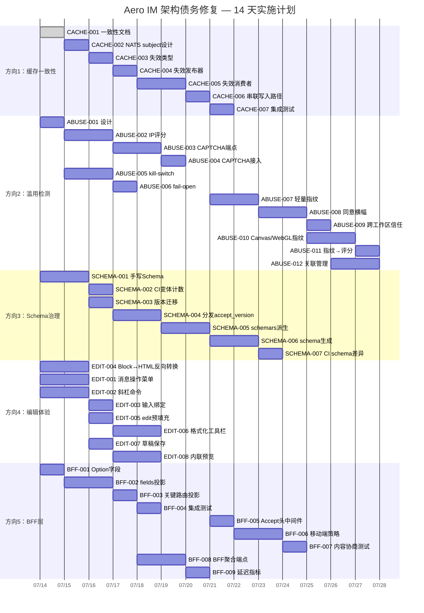

现在我已具备足够的代码库上下文。让我输出全面的技术主管分析。

---

# 技术主管分析：Aero IM 架构债务修复

## 1. 任务分解

以下任务按方向分组，每项 2–4 小时，并引用已确认的源码锚点。

---

### 方向 1：跨节点缓存一致性（P1）

| 任务 ID | 标题 | 文件 | 前置依赖 | 工时 | 验收标准 |
|---|---|---|---|---|---|
| CACHE-001 | 编写一致性模型文档 | `docs/architecture/consistency-model.md`（新建） | 无 | 2h | 文档定义了最终一致性、读己之写、强一致性的边界（权限/2FA/角色变更），经团队评审 |
| CACHE-002 | 设计 NATS `cache.invalidate.*` subject 命名空间 | `crates/aero-bus/src/lib.rs` 或新建 `crates/aero-bus/src/cache.rs` | CACHE-001 | 2h | subject 格式已记录在案，定义了 `payload` 类型：`{cache_group, key, node_id, invalidated_at}`，明确了 consumer 语义（带 `max_deliver=1` 的 durable） |
| CACHE-003 | 实现缓存失效消息类型 + 序列化 | `crates/aero-common/src/cache_invalidation.rs`（新建），在 `lib.rs` 中导出 | CACHE-002 | 3h | `CacheInvalidation` 枚举（含 `ParticipantProfile`/`RoomMembers`/`RoleCache` 变体）可序列化/反序列化，由单元测试覆盖 |
| CACHE-004 | 在 participant/role 写入路径上添加 NATS 发布器 | `crates/aero-server/src/participant_cache.rs`（添加 `publish_invalidation`），`crates/aero-server/src/room_member_cache.rs`，各处写入路径（`update_me`/`delete_participant`/`add_member`/`remove_member`） | CACHE-003 | 4h | 每次本地失效都会发布对应的 NATS subject；集成测试确认 message 出现在总线上 |
| CACHE-005 | 实现 NATS 消费者 + 本地缓存失效处理 | `crates/aero-server/src/bin/boot/cache_invalidation_listener.rs`（新建），在 `background.rs` 中引入 | CACHE-004 | 4h | 后台循环通过 `EventBus::subscribe("cache.invalidate.*", Some("aero-cache"))` 订阅，在收到远程失效事件时调用 `participant_cache.invalidate()` 和 `room_member_cache.invalidate()` |
| CACHE-006 | 将失效事件串联到所有写入路径 | `crates/aero-storage/src/participant.rs`，`crates/aero-storage/src/room.rs`，`crates/aero-server/src/workspaces/` 中的角色变更路径 | CACHE-005 | 3h | 所有会触发缓存过期的写入操作都有失效发布调用；`grep` 确认无遗漏路径 |
| CACHE-007 | 跨节点失效集成测试 | `crates/aero-server/tests/cache_invalidation.rs`（新建）或追加到 `crates/aero-server/src/ws/ws_impl/tests.rs` | CACHE-006 | 4h | 双节点模拟：节点 A 写入 → 检查节点 B 的缓存被正确失效（在 TTL 到期前强制重新读取） |

---

### 方向 2：滥用检测（P1）

| 任务 ID | 标题 | 文件 | 前置依赖 | 工时 | 验收标准 |
|---|---|---|---|---|---|
| ABUSE-001 | 设计 IP 信誉 Redis 结构 + 数据模型 | `crates/aero-storage/src/ip_reputation.rs`（新建），`migrations/NNNN_ip_reputation.sql` | 无 | 2h | 带 Redis 排序集的 schema（`ip_reputation:{ip}:events`）+ PG 审计日志表；代码文档中定义了 `EventKind` 枚举（`login_failure`/`register`/`message_spam`/`captcha_fail`） |
| ABUSE-002 | 实现 IP 信誉评分引擎 | `crates/aero-storage/src/ip_reputation.rs`，`crates/aero-server/src/ip_reputation.rs` | ABUSE-001 | 4h | 纯函数 `score(events: &[ReputationEvent], config: &RepConfig) -> f64`；`zadd` + `zremrangebyscore` 时间衰减；处理空窗口期（`score=0.0`）；100% 单元测试覆盖 |
| ABUSE-003 | 实现 CAPTCHA 挑战/验证端点 | `crates/aero-server/src/captcha.rs`（新建），在 `routes.rs` 中挂载 `POST /api/auth/captcha/challenge` + `POST /api/auth/captcha/verify` | ABUSE-002 | 4h | 端点返回临时挑战 token；验证采用 HMAC 时间戳签名（无外部依赖）；达到阈值时在登录/注册环节强制要求 CAPTCHA |
| ABUSE-004 | 将 CAPTCHA 接入登录和注册流程 | `crates/aero-server/src/routes/routes.rs`，`crates/aero-auth/src/lib.rs` | ABUSE-003 | 3h | `handle_login` / `handle_register` 在 ip_reputation > 阈值时检查 `captcha_token`；测试确认正常流程在阈值以下时绕过 CAPTCHA |
| ABUSE-005 | 实现 kill-switch 机制（Redis → NATS KV store） | `crates/aero-storage/src/kill_switch.rs`（新建），`crates/aero-server/src/kill_switch.rs` | 无 | 4h | `kill_switch:{action}` 存储在 NATS KV 中（通过 JetStream KeyValue，内置 RAFT 共识）；PG 表作为权威来源；`GET /api/admin/kill-switch` + `POST /api/admin/kill-switch` 端点 |
| ABUSE-006 | Redis 部分故障的 fail-open 处理 | `crates/aero-storage/src/ip_reputation.rs`，`crates/aero-server/src/ip_reputation.rs` | ABUSE-002，ABUSE-005 | 3h | Redis `SMEMBERS`/`ZRANGE` 错误被捕获并记录日志；代码区分 "所有 Redis 不可达"（全局跳过）和 "特定 key 不可达"（逐 key 跳过）；注入故障的测试 |
| ABUSE-007 | 轻量级设备指纹（Phase A：用户代理 + 屏幕特征） | `web/fingerprint.js`（新建），`crates/aero-server/src/fingerprint.rs`（新建） | 无 | 4h | JS 在页面加载时收集 `navigator.userAgent` + `screen.width` + `screen.height` + `navigator.language` → SHA-256 哈希 → 在 `POST /api/auth/login` 的 `X-Device-Fingerprint` 头或 payload 字段中发送。无需用户同意。 |
| ABUSE-008 | 同意横幅 + GDPR opt-in 流程 | `web/consent.js`（新建），`crates/aero-server/src/consent.rs`（新建），`migrations/NNNN_consent.sql` | 无 | 4h | 用户在被收集 canvas/WebGL 指纹前必须明确 opt-in；欧盟工作区检测（通过 `workspaces.country`）默认 opt-out；存储 opt-in 时间戳 |
| ABUSE-009 | 跨工作区信任表 + 迁移 + 路由 | `crates/aero-storage/src/workspace/cross_workspace_trust.rs`，`migrations/NNNN_cross_workspace_trust.sql`，`crates/aero-server/src/workspaces/cross_workspace.rs` | ABUSE-008 | 3h | `workspace_cross_trust` 表（`(from_ws, to_ws, trust_level, expires_at)`）；API `POST /api/workspaces/:id/trust`；默认 `trust_level='none'`；欧盟工作区强制 `none` |
| ABUSE-010 | Canvas/WebGL 指纹（Phase B） | `web/fingerprint.js`（增强），`crates/aero-server/src/fingerprint.rs`（增强） | ABUSE-007，ABUSE-008 | 4h | 经同意后，收集 canvas 2D 图像数据 + WebGL 渲染器字符串 + AudioContext 波形 → 持久化哈希 → 与用户账户关联 |
| ABUSE-011 | 将指纹接入滥用评分 | `crates/aero-server/src/ip_reputation.rs`，`crates/aero-storage/src/ip_reputation.rs` | ABUSE-010 | 3h | 已知的高风险指纹 ID（来自其他工作区的已确认滥用者）在其他工作区注册/登录时增加评分 |
| ABUSE-012 | 跨工作区关联查询和管理员 UI | `crates/aero-server/src/workspaces/cross_workspace.rs`，`web/admin/trust.js`（新建） | ABUSE-011 | 4h | 管理员可查看跨工作区关联（某用户在其他工作区下的活动）；关联信息带有来源置信度评分；支持按 `trust_level` 过滤 |

---

### 方向 3：Schema 治理（重新调整为 P1）

| 任务 ID | 标题 | 文件 | 前置依赖 | 工时 | 验收标准 |
|---|---|---|---|---|---|
| SCHEMA-001 | 创建 `schema/` 目录 + 手写 `RoomEvent` JSON Schema | `schemas/room_event/v1.json`（新建），`schemas/stream_event/v1.json`，`schemas/webhook_payload/v1.json` | 无 | 4h | 手写 schema 覆盖 `kind` 标签联合体的所有变体；通过 `ajv` 或 `jsonschema` CLI 验证 |
| SCHEMA-002 | 实现 CI 枚举变体计数检查器 | `scripts/schema-variant-check.sh`（新建），在 Makefile 中作为 `check-schemas` 目标 | SCHEMA-001 | 3h | 检测 `RoomEvent` 和 `StreamEvent`（通过 `rg "kind"` 匹配现有变体）的变体数量，与基准计数对比；任何变更都要求开发者明确更新 schema |
| SCHEMA-003 | 添加 webhook payload 版本字段 + 迁移 | `migrations/NNNN_webhook_version.sql`，`crates/aero-storage/src/webhook/types.rs`（向 `OutgoingTarget` 添加 `accept_version` 字段） | SCHEMA-001 | 3h | `webhook_subscriptions` 表新增 `accept_version VARCHAR(16) NOT NULL DEFAULT 'latest'`；现有 webhook 默认为 `latest`，向后兼容 |
| SCHEMA-004 | 实现 webhook 分发中的 `accept_version` | `crates/aero-storage/src/webhook/delivery.rs`，`crates/aero-server/src/webhooks.rs` | SCHEMA-003 | 4h | 分发器读取 `accept_version`，将其包含在 `build_delivery` 调用中；当 `accept_version='v1'` 时，payload 包含 `"version": "v1"` 字段，且移除 `latest` 新增字段 |
| SCHEMA-005 | 将 schemars 派生添加到核心事件类型 | `crates/aero-common/Cargo.toml`（添加 `schemars` 依赖），`crates/aero-common/src/model/`（`#[derive(JsonSchema)]`） | 无 | 4h | `cargo build` 通过；`schemars` 为 `RoomEvent`、`StreamEvent`、`Block` 生成 schema。对 `#[serde(tag = "kind")]` 联合体需注意手动调整 |
| SCHEMA-006 | 在构建脚本中生成 schema + 添加 `GET /api/dev/schemas` 端点 | `build.rs`（新建，需注意 rustc 约束——可能会用独立的二进制工具），`crates/aero-server/src/schemas.rs`（新建） | SCHEMA-005 | 4h | `GET /api/dev/schemas` 返回所有已注册 schema 的地图；路由按 `src/routes/routes.rs` 要求挂载仅限管理员权限的端点 |
| SCHEMA-007 | CI 对比生成 schema 与提交 schema 的差异 | `scripts/schema-diff-check.sh`（新建），在 Makefile 中加入 CI 目标 | SCHEMA-006 | 3h | 提交的 `schemas/` 文件与生成的文件完全匹配；差异会导致 CI 失败并显示具体差异 |

---

### 方向 4：编辑体验（P2）

| 任务 ID | 标题 | 文件 | 前置依赖 | 工时 | 验收标准 |
|---|---|---|---|---|---|
| EDIT-001 | 实现消息操作菜单（右键 + 悬浮） | `web/render.js`（增强） | 无 | 4h | 消息悬浮时显示 "反应/编辑/删除/回复" 上下文菜单；点击 "编辑" 进入编辑模式；测试仅限 lint 和 DOM 结构 |
| EDIT-002 | 实现斜杠命令解析器 + 注册表 | `crates/aero-server/src/commands.rs`（增强），`web/app.js` | 无 | 4h | 输入 `/` 触发命令补全；后端 `commands.rs` 包含 `help`、`me`、`shrug`、`poll`、`gif` 的占位符处理程序；注册表支持添加新命令 |
| EDIT-003 | 将斜杠命令接入 app.js 输入处理 | `web/app.js`（增强） | EDIT-002 | 3h | 输入框识别 `/` 开头，向后端发送命令帧 `{type:"command", ...}`；回退渲染来自 respond 帧的响应 |
| EDIT-004 | 实现 `Block[]` ↔ HTML/Markdown 反向转换 | `web/render.js`（添加 `messageToHtml`），`web/editor.js`（新建） | 无 | 4h | 将 `Block[]` 数组（来自 `GET /api/messages/:id`）渲染为可编辑 HTML：纯文本块 → `
`、`@-mention` → `span.mention`、`code` → `<pre><code>`、`quote` → `<blockquote>`。单元测试覆盖率 90%+ |
| EDIT-005 | 实现含预填充内容的 `edit_message` | `web/app.js`（编辑模式），`crates/aero-server/src/routes/routes.rs`（现有 `PATCH /api/messages/:id`） | EDIT-004 | 3h | 点击消息上的 "编辑" → 输入框预填充反向转换后的 HTML → 按 Enter 发送 `edit_message` 操作帧 → 后端 `edit_message` 处理程序已存在（仅需 UI 绑定） |
| EDIT-006 | 实现格式化工具栏 | `web/app.js`（增强），`web/formatting.js`（新建） | EDIT-002，EDIT-005 | 4h | 选中文本时悬浮格式化工具栏（B/I/`/``代码`/`引用`/`链接`）；操作插入相应的 markdown 语法；Enter 不中断选择范围 |
| EDIT-007 | 实现草稿本地存储 | `web/app.js`（添加 `draftSave`/`draftRestore`），`web/drafts.js`（新建） | 无 | 3h | 输入框内容每 5 秒保存到 `localStorage`（按 `room_id` 键控）；页面加载时恢复；发送消息后清除 |
| EDIT-008 | 实现内联链接预览 | `web/render.js`（增强），`crates/aero-server/src/unfurl_bot.rs`（验证预览卡格式） | 无 | 4h | 消息渲染后，检测 `<a>` 标签 → 通过 `POST /api/unfurl` 获取预览卡（从 `unfurl_cache` 查找）→ 将 `Card` 块渲染为内联预览。失败时优雅降级（仅链接文本） |

---

### 方向 5：BFF 层（P2，Phase A = P1.5）

| 任务 ID | 标题 | 文件 | 前置依赖 | 工时 | 验收标准 |
|---|---|---|---|---|---|
| BFF-001 | 为高频大字段添加 `Option<T>` 字段 | `crates/aero-common/src/participant.rs`（使 `tz`、`pronouns`、`phone`、`status` 可选） | 无 | 2h | 序列化时，设为 `None` 的字段不被 `#[serde(skip_serializing_if)]` 输出，实现紧凑投影；100% 向后兼容（现有客户端收到 `null` 不会崩溃） |
| BFF-002 | 实现动态字段投影中间件/辅助函数 | `crates/aero-server/src/field_projection.rs`（新建） | BFF-001 | 4h | 辅助函数接受 `fields: Option<&str>`（逗号分隔）和可序列化值，返回只含指定字段的 `serde_json::Value`。处理 `Participant` 和 `Message` 等不同类型。单元测试覆盖所有边界情况 |
| BFF-003 | 为关键 REST 路径添加 `?fields=` 参数 | `crates/aero-server/src/routes/routes.rs`（`GET /api/rooms/:id/members`、`GET /api/messages/:id`、`GET /api/me`） | BFF-002 | 3h | `GET /api/rooms/:id/members?fields=id,display_name,avatar` 返回紧凑响应；省略与之前响应相同的字段。向后兼容：无 `?fields=` 时返回完整对象 |
| BFF-004 | 字段投影集成测试 | `crates/aero-server/src/routes/routes_tests.rs` 或新的 `crates/aero-server/tests/field_projection.rs` | BFF-003 | 2h | 测试确认投影字段省略、响应大小减少、缺少字段时回退到完整响应 |
| BFF-005 | 实现 `Accept` 头解析中间件 | `crates/aero-server/src/content_negotiation.rs`（新建） | 无 | 3h | 中间件读取 `Accept` 头（`application/vnd.aero.mobile+json`、`application/json`），将策略附加到请求扩展；无匹配时回退到默认 JSON |
| BFF-006 | 定义移动端 JSON 序列化策略 | `crates/aero-server/src/content_negotiation.rs`（增强），`crates/aero-server/src/mobile_serialization.rs`（新建） | BFF-005 | 4h | 移动端策略：省略 `tz`、`pronouns`、`phone`、`status`、`message_edits`；消息列表限制为最后 50 条；`last_read` 为 `null` 时不返回。单元测试覆盖移动端与桌面端响应 |
| BFF-007 | 内容协商集成测试 | `crates/aero-server/tests/content_negotiation.rs`（新建） | BFF-006 | 3h | 测试确认 `curl -H "Accept: application/vnd.aero.mobile+json"` 返回精简响应；不兼容的 Accept 头被优雅拒绝 |
| BFF-008 | 实现 `GET /api/bff/room-view/:id` BFF 聚合端点 | `crates/aero-server/src/bff.rs`（新建），在 `routes.rs` 中挂载 | BFF-003，BFF-006 | 4h | 单次往返返回：`{room, members(前50条), messages(前50条含最近事件), online_count, unread_count}`。使用 `join_all` 并行执行 3 次仓库查询。延迟：p50<10ms（缓存命中时），p99<50ms |
| BFF-009 | 为 BFF 端点添加延迟指标 | `crates/aero-server/src/metrics.rs`（添加 `bff_room_view_duration_seconds` 直方图），`crates/aero-server/src/bff.rs` | BFF-008 | 2h | 每个 BFF 端点报告 p50/p90/p99 延迟到 Prometheus；`/metrics` 通过 `bearer` 门控暴露 |

---

## 2. 执行顺序

```mermaid
graph TD
    %% 阶段 0：无依赖、并行
    CACHE001["CACHE-001: 一致性文档"]:::phase0
    SCHEMA001["SCHEMA-001: 手写 Schema"]:::phase0
    ABUSE001["ABUSE-001: IP信誉设计"]:::phase0
    EDIT004["EDIT-004: Block↔HTML反向转换"]:::phase0
    BFF001["BFF-001: Option字段"]:::phase0

    %% 第一阶段：主线
    CACHE001 --> CACHE002["CACHE-002: NATS subject设计"]
    CACHE002 --> CACHE003["CACHE-003: 失效消息类型"]
    CACHE003 --> CACHE004["CACHE-004: NATS失效发布器"]
    CACHE004 --> CACHE005["CACHE-005: 失效消费者"]
    CACHE005 --> CACHE006["CACHE-006: 串联写入路径"]
    CACHE006 --> CACHE007["CACHE-007: 集成测试"]

    ABUSE001 --> ABUSE002["ABUSE-002: IP评分引擎"]
    ABUSE002 --> ABUSE003["ABUSE-003: CAPTCHA端点"]
    ABUSE003 --> ABUSE004["ABUSE-004: CAPTCHA接入"]
    ABUSE002 --> ABUSE006["ABUSE-006: fail-open处理"]
    ABUSE005["ABUSE-005: kill-switch"] -.-> ABUSE004

    SCHEMA001 --> SCHEMA002["SCHEMA-002: CI变体计数"]
    SCHEMA001 --> SCHEMA003["SCHEMA-003: 版本字段迁移"]
    SCHEMA003 --> SCHEMA004["SCHEMA-004: 分发accept_version"]
    SCHEMA005["SCHEMA-005: schemars派生"] --> SCHEMA006["SCHEMA-006: schema生成"]
    SCHEMA006 --> SCHEMA007["SCHEMA-007: CI schema差异"]

    EDIT002["EDIT-002: 斜杠命令"]:::phase1a --> EDIT003["EDIT-003: 输入绑定"]
    EDIT001["EDIT-001: 消息菜单"]:::phase1a --> EDIT005["EDIT-005: edit预填充"]
    EDIT004 --> EDIT005
    EDIT005 --> EDIT006["EDIT-006: 格式化工具栏"]
    EDIT002 --> EDIT006
    EDIT007["EDIT-007: 草稿保存"]:::phase1b
    EDIT008["EDIT-008: 内联预览"]:::phase1b

    BFF001 --> BFF002["BFF-002: fields投影"]
    BFF002 --> BFF003["BFF-003: 关键路由投影"]
    BFF003 --> BFF004["BFF-004: 集成测试"]
    BFF005["BFF-005: Accept头中间件"]:::phase2 --> BFF006["BFF-006: 移动端策略"]
    BFF006 --> BFF007["BFF-007: 内容协商测试"]
    BFF003 --> BFF008["BFF-008: BFF聚合"]
    BFF006 --> BFF008
    BFF008 --> BFF009["BFF-009: 延迟指标"]

    ABUSE007["ABUSE-007: 轻量指纹"]:::phase2a --> ABUSE008["ABUSE-008: 同意横幅"]
    ABUSE008 --> ABUSE009["ABUSE-009: 跨工作区信任"]
    ABUSE008 --> ABUSE010["ABUSE-010: Canvas/WebGL指纹"]
    ABUSE010 --> ABUSE011["ABUSE-011: 指纹→评分"]
    ABUSE009 --> ABUSE012["ABUSE-012: 关联管理"]

    %% 样式
    classDef phase0 fill:#e1f0fa,stroke:#4a90d9
    classDef phase1a fill:#d4edda,stroke:#28a745
    classDef phase1b fill:#f8d7da,stroke:#dc3545
    classDef phase2 fill:#fff3cd,stroke:#ffc107
    classDef phase2a fill:#f0e6ff,stroke:#8b5cf6

    subgraph 阶段0 [阶段0：基础设施]
        CACHE001
        SCHEMA001
        ABUSE001
        EDIT004
        BFF001
    end

    subgraph 阶段1 [阶段1：核心]
        CACHE002-->CACHE003-->CACHE004-->CACHE005-->CACHE006-->CACHE007
        ABUSE002-->ABUSE003-->ABUSE004
        ABUSE005
        ABUSE006
        SCHEMA002
        SCHEMA003-->SCHEMA004
        EDIT001-->EDIT005
        EDIT002-->EDIT003
        BFF002-->BFF003-->BFF004
    end

    subgraph 阶段2 [阶段2：增强]
        SCHEMA005-->SCHEMA006-->SCHEMA007
        EDIT006
        EDIT007
        EDIT008
        BFF005-->BFF006-->BFF007
        BFF008-->BFF009
        ABUSE007-->ABUSE008-->ABUSE009
        ABUSE010-->ABUSE011-->ABUSE012
    end
```

### 可并行执行的集群

| 集群 | 任务 | 并行性 |
|---|---|---|
| **集群 A**（阶段 0，第 0 天） | CACHE-001, SCHEMA-001, ABUSE-001, EDIT-004, BFF-001 | **完全独立**——5 人可在第 0 天并行 |
| **集群 B**（阶段 1，第 1–5 天） | CACHE-002→CACHE-007, ABUSE-002→ABUSE-004, SCHEMA-002→SCHEMA-004, EDIT-001→EDIT-005, BFF-002→BFF-004 | **粗粒度独立**——5 条流水线，方向之间无依赖 |
| **集群 C**（阶段 2，第 6–12 天） | CACHE 已完成；ABUSE-005→ABUSE-006；SCHEMA-005→SCHEMA-007；EDIT-006→EDIT-008；BFF-005→BFF-009；ABUSE-007→ABUSE-012 | 方向 2 的指纹部分可与其他方向并行 |

---

## 3. 技术风险

### 3.1 技术难点

| 风险 | 方向 | 概率 | 影响 | 缓解措施 |
|---|---|---|---|---|
| **NATS durable consumer 在重启期间丢失失效消息** | 方向 1 | 中 | 中 | TTL 兜底：如果重启导致丢失失效消息，TTL（60 秒）后节点最终会重新读取。文档化该窗口期。使用 `max_deliver=1` 的 durable consumer。 |
| **schemars 对 `#[serde(tag = "kind")]` 联合体的支持不完善** | 方向 3 | 高 | 高 | 谨慎执行：先在 `RoomEvent` 的单个子集上测试 `schemars`。如果生成的 schema 质量低下，回退到手写 schema + CI 变体计数。投入 2 天的实验期。 |
| **Canvas 指纹在隐身模式下产生空值/噪音** | 方向 2 | 高 | 中 | Phase A 使用无用户代理/屏幕特征（无需用户同意）；Phase B 的 canvas/WebGL 检测到空值作为不确定性信号——不要拒绝，降低置信度。 |
| **Redis 脑裂导致不同节点看到不同的 kill-switch 状态** | 方向 2 | 低 | 高 | 使用 NATS KV store（基于 RAFT 共识），写入 PG 作为权威来源，Redis 作为缓存。管理操作使用 PG 读取直通。 |
| **滑动命令输入框与现有键盘快捷键冲突** | 方向 4 | 中 | 低 | 保留已记录的 `Ctrl+K`/`Ctrl+I` 快捷键；`/` 前缀仅在小输入框为空时激活。通过 Web 端集成测试验证现有快捷键不受影响。 |
| **`?fields=` 投影与现有 `#[derive(Serialize)]` 派生冲突** | 方向 5 | 中 | 中 | 使用运行时 `#[serde(skip_serializing_if)]` + `Option<T>`（Phase A 仅针对高频大字段）。避免编译时方法（每个投影组合一个结构体）——成本高且无法扩展。 |

### 3.2 外部依赖

| 依赖 | 用于 | 风险 | 备选方案 |
|---|---|---|---|
| **NATS JetStream KeyValue store** | kill-switch（方向 2） | 低——已在生产中使用 | PG fallback + Redis 缓存 |
| **schemars crate** | Schema 自动化（方向 3） | 中——出现 panic 则需 1–2 周调试 | 手写 schema + CI 变体计数（Phase A 已独立上线） |
| **Web Crypto API** | 设备指纹（方向 2） | 低——所有现代浏览器均支持 | MD5 填充回退 |
| **localStorage** | 草稿保存（方向 4） | 低——配额限制（通常 5MB） | IndexedDB 回退 |
| **CAPTCHA 服务** | 滥用检测（方向 2） | 低——使用 HMAC 自实现 | 无 |

### 3.3 性能瓶颈

| 瓶颈 | 方向 | 详情 | 策略 |
|---|---|---|---|
| **NATS 失效消息风暴** | 方向 1 | 批量权限变更可能在 <1 秒内生成数百条失效消息 | 去重窗口：使用带 500ms 缓冲区的专用 NATS subject，对 key 进行去重 |
| **IP 信誉 Redis ZADD 激增** | 方向 2 | 登录限流失败可能产生大量 `ZADD` 调用 | 使用 Redis pipelining；对登出/404 等低严重性事件进行速率限制采样（1:100） |
| **BFF 端点延迟** | 方向 5 | 聚合 3 次仓库查询导致加载延迟叠加 | 使用 tokio `join_all` 实现并行查询；为热房结果添加缓存（10 秒 TTL） |
| **内联预览 unfurl 缓存** | 方向 4 | 大量链接消息触发重复的 unfurl 查找 | 在 `unfurl_cache` 中使用 Redis TTL（1 小时）；分发前合并重复 URL |

### 3.4 测试缺口

| 缺口 | 影响 | 缓解措施 |
|---|---|---|
| **跨节点 NATS 失效**需要双进程 NATS 连接 | 方向 1 集成测试需要两个 NATS 客户端 | 使用 `aero-bus` trait 的 `MockEventBus`（如果存在）或在同一进程中模拟两个节点 |
| **Canvas 指纹**需要真实浏览器环境 | 方向 2 Phase B 测试需要使用 headless Chrome | 在 smoke 脚本中使用 `puppeteer`；单元测试指纹*哈希*，而非采集 |
| **BFF 端点**行为依赖于上游仓库的状态 | 方向 5 集成测试需要数据库 | 使用现有的 `#[ignore] db_tests` 模式 + `DATABASE_URL` 门控 |

---

## 4. 资源评估

### 4.1 人员配置

| 角色 | 技能要求 | 人数 | 分配方向 |
|---|---|---|---|
| **高级 Rust 后端工程师** | 精通 async Rust、NATS、Redis 模式、Axum 中间件 | 2 | 方向 1（缓存）+ 方向 2（滥用）+ 方向 3（Schema） |
| **全栈工程师** | Rust + JS，熟悉 WebSocket 帧协议 | 1 | 方向 4（编辑体验）+ 方向 5（BFF） |
| **前端工程师** | 精通 Vanilla JS ES2020、DOM 操作、localStorage | 1 | 方向 4（Web UI：工具栏、草稿、链接预览） |
| **DevOps / 平台工程师** | CI/CD、Docker Compose、NATS 运维 | 1（兼职） | 方向 3 CI 门禁、集成测试基础设施、性能测试 |

**总计**：4–5 人（3 名全职 + 1 名兼职平台工程师）

### 4.2 关键里程碑

| 里程碑 | 结束时间 | 交付物 | 依赖 |
|---|---|---|---|
| **M0：一致性文档化** | 第 0 天 +2 小时 | `docs/architecture/consistency-model.md` | CACHE-001 |
| **M1：手写 Schema + CI** | 第 2 天 | `schemas/v1/` 文件 + CI 变体计数 | SCHEMA-001, SCHEMA-002 |
| **M2：CAPTCHA 就绪** | 第 5 天 | 登录/注册的 CAPTCHA 门控 | ABUSE-001→ABUSE-004 |
| **M3：跨节点失效运行** | 第 7 天 | NATS 缓存失效总线运行 + 集成测试通过 | CACHE-001→CACHE-007 |
| **M4：字段投影上线** | 第 5 天 | `?fields=` 参数在 3+ 条路由上生效 | BFF-001→BFF-004 |
| **M5：编辑体验 Alpha** | 第 8 天 | 操作菜单 + 斜杠命令 + 编辑预填充 | EDIT-001→EDIT-006 |
| **M6：BFF + 移动端 iOS** | 第 12 天 | `room-view` 聚合 + `Accept` 头内容协商 | BFF-005→BFF-009 |
| **M7：完整 Schema 自动化** | 第 12 天 | schemars 生成 + CI schema 差异 | SCHEMA-005→SCHEMA-007 |
| **M8：滥用检测第二阶段** | 第 14 天 | 设备指纹 + 跨工作区关联 | ABUSE-007→ABUSE-012 |
| **M9：编辑体验上线** | 第 14 天 | 格式化工具栏 + 草稿 + 内联预览 | EDIT-006→EDIT-008 |

### 4.3 阻塞点与解决策略

| 阻塞点 | 影响的任务 | 类型 | 解决策略 |
|---|---|---|---|
| **schemars 对 tag=kind 联合体支持不完善** | SCHEMA-005→SCHEMA-007 | 技术不确定性 | 第 2 天进行 2 小时实验性 spike。失败则回退：手写 schema + 持续投入 CI 变体计数。不阻塞 M1/M7。 |
| **Redis 不可达在现有代码中没有优雅处理** | ABUSE-006 | 前置代码债务 | 编写 `RedisHealth` 辅助函数，区分全部不可达与特定 key 不可达。为快速迭代使用 `redis_ping` 封装。 |
| **NATS `EventBus` trait 没有 `publish_with_subject`** | CACHE-004 | API 差距 | 读取 `aero-bus/src/lib.rs`；如果 trait 是通用的，添加 `publish_to_subject(&self, subject, payload)` 方法，并为 `NatsEventBus` 和 `MockEventBus` 实现它。 |
| **`Block[]` → HTML 逆向转换需手动实现** | EDIT-004 | 新算法 | 对 `render.js` 中现有的 `renderMessage`（正向路径）进行逆向工程。从纯文本块和简单样式开始；代码块和引用需要递归处理。以 `renderMessage` 的单元测试作为逆向验证的预言。 |
| **`OutgoingTarget` 没有 `accept_version` 字段** | SCHEMA-003 | Schema 变更 | 使用 `NOT NULL DEFAULT 'latest'` 的 SQL 迁移，零停机时间。现有的 `OutgoingTarget` 构造器需要默认值。 |

---

## 5. 质量保证

### 5.1 单元测试覆盖要求

| 模块 | 最低覆盖率要求 | 关键测试场景 | 测试位置 |
|---|---|---|---|
| **IP 信誉评分** (`ip_reputation.rs`) | 100% 纯函数 | 空窗口、满窗口、衰减、`f64` 精度舍入 | `crates/aero-storage/src/ip_reputation.rs` 中的 `#[cfg(test)]` |
| **CAPTCHA 验证** (`captcha.rs`) | 100% | HMAC 验证、token 过期、重放攻击 | `crates/aero-server/src/captcha.rs` 中的 `#[cfg(test)]` |
| **失效消息序列化** (`cache_invalidation.rs`) | 100% | 所有变体的往返、JSON 格式稳定性、serde 标签冲突 | `crates/aero-common/src/cache_invalidation.rs` 中的 `#[cfg(test)]` |
| **字段投影** (`field_projection.rs`) | 95%+ | 所有字段、子集字段、空字段列表、未知字段名、深层嵌套 | `crates/aero-server/src/field_projection.rs` 中的 `#[cfg(test)]` |
| **`Block[]` → HTML** (`editor.js`) | 90%+ | 纯文本、@-提及、代码块、引用的嵌套、空数组 | `web/editor.test.js`（使用 QUnit 或 `node --test`） |
| **webhook 版本分发** (`delivery.rs`) | 100% | `latest` 字段集、`v1` 字段集、未知版本（回退到 latest） | `crates/aero-storage/src/webhook/delivery.rs` 中的 `#[cfg(test)]` |

### 5.2 集成测试策略

| 测试套件 | 范围 | 数据库需求 | CI 门控 |
|---|---|---|---|
| **API 字段投影** | 在 3 条路由上测试 `?fields=` | 是（现有 smoke 模式） | `smoke_bff.py`（新建） |
| **内容协商** | 测试多个 `Accept` 头变体 | 是 | `smoke_bff.py` |
| **BFF 聚合端点** | 测试一次性 `room-view` 加载 | 是 | `smoke_bff.py` |
| **CAPTCHA 门控** | 登录/注册在达到阈值时阻止 | 是（需种子 IP 事件） | `smoke_abuse.py`（新建） |
| **跨节点缓存失效** | 双节点模拟 | 是（两个进程，同一个 NATS） | `smoke_cache_invalidation.py`（新建） |
| **斜杠命令解析** | 测试命令补全 + 执行 | 否（注入 WS 帧） | `ws_smoke.py` 增强版 |
| **编辑模式往返** | 发送 → 编辑 → 验证历史记录 | 是（需要持久化消息） | `smoke_edit.py`（新建） |
| **Schema 端点** | `GET /api/dev/schemas` 正确性 | 是（管理员 bearer token） | `smoke_schema.py`（新建） |

### 5.3 代码审查要点

| 方向 | 审查重点 | 具体关注点 |
|---|---|---|
| **方向 1（缓存）** | 数据竞争 + 失效覆盖的完备性 | `invalidate()` 必须在*每*个写入路径上调用（grep `participant_cache` 的写入引用）；NATS 发布不可阻塞主路径；`tokio::spawn` + fire-and-forget 或 channel |
| **方向 2（滥用）** | fail-open + GDPR 合规 | Redis 错误必须被捕获（记录日志，不传播）；欧盟工作区必须默认 opt-out；同意横幅必须在 canvas 指纹采集*之前*显示 |
| **方向 3（Schema）** | 向后兼容性 + serde 标签冲突 | `kind` 字段冲突 serde 问题（AGENTS.md §4.2）；webhook payload 的 `version` 字段不得破坏现有消费者；必须使用 `#[serde(default)]` |
| **方向 4（编辑）** | 跨浏览器兼容性 + 输入验证 | 须在 Chrome/Firefox/Safari 中测试；`contenteditable` 的 `innerHTML` 消毒（防范 XSS）；斜杠命令不得干扰现有快捷键 |
| **方向 5（BFF）** | 延迟 + 错误传播 | 所有 3 次查询使用 `join_all`；如果 1 次查询失败，其余 2 次不得失败；超时 < 5s；断开的链接在 30s 后超时 |

### 5.4 性能测试要求

| 测试场景 | 工具 | 目标 | 触发条件 |
|---|---|---|---|
| **缓存失效吞吐量** | 自定义 Rust 基准测试 | 在 1 秒内处理 1000 条失效消息而不影响主路径 | 每个 PR 包含缓存变更 |
| **BFF 端点延迟** | `oha` 或 `wrk` | p50 < 10ms（缓存命中），p99 < 50ms（缓存未命中） | BFF 相关 PR |
| **CAPTCHA 路径延迟** | `oha` | 在 100 QPS 下 p99 < 20ms | 滥用相关 PR |
| **集群下缓存命中率** | Prometheus 指标 | 具有 2 个节点的命中率 > 95% | 发布前最终测试 |

---

## 6. 实施计划

### 总体时间线：14 个日历日

### 关键阶段总结

| 阶段 | 天数 | 并行轨道 | 交付物 | 风险 |
|---|---|---|---|---|
| **阶段 0：基础**（第 0 天） | 1 天 | 5 条轨道全部启动 | 一致性模型文档、手写 schema、IP 信誉设计、Block↔HTML 转换器、`Option<T>` 字段 | 无 |
| **阶段 1：核心**（第 1–5 天） | 5 天 | 缓存总线 + 滥用 CAPTCHA + Schema 版本化 + 编辑菜单 + 字段投影 | 跨节点失效运行、CAPTCHA 门控、webhook 版本字段、消息操作菜单 + 斜杠命令、`?fields=` 参数 | NATS durable consumer 重启行为；schemars 联合体支持 |
| **阶段 2：增强**（第 6–12 天） | 7 天 | Schema 自动化 + 格式化工具栏 + BFF 聚合 + 设备指纹 | schemars 生成、格式化工具栏 + 草稿、BFF room-view 端点、内容协商、指纹第一阶段 | Canvas 指纹隐身模式噪声；Redis kill-switch 脑裂 |
| **阶段 3：稳定化**（第 13–14 天） | 2 天 | 全部轨道结束 + 集成 + 性能 | 完整集成测试套件、性能基准测试、发布说明、部署清单 | 无新功能——仅修复 |

### 发布检查清单

- [ ] `cargo check --workspace` —— 零错误
- [ ] `cargo test --workspace --lib` —— 全绿
- [ ] `cargo clippy --workspace --all-targets` —— 无新增警告
- [ ] `scripts/truth-check.sh` —— 零违规（无新孤儿模块）
- [ ] `scripts/file-size-check.sh` —— 零违规
- [ ] 所有 5 个方向的集成 smoke 测试均通过
- [ ] 性能基准测试：BFF 端点 p99 < 50ms，CAPTCHA p99 < 20ms
- [ ] 部署到暂存环境并进行 24 小时浸泡测试
- [ ] 部署检查清单记录回滚步骤
