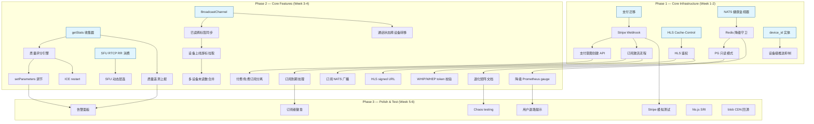
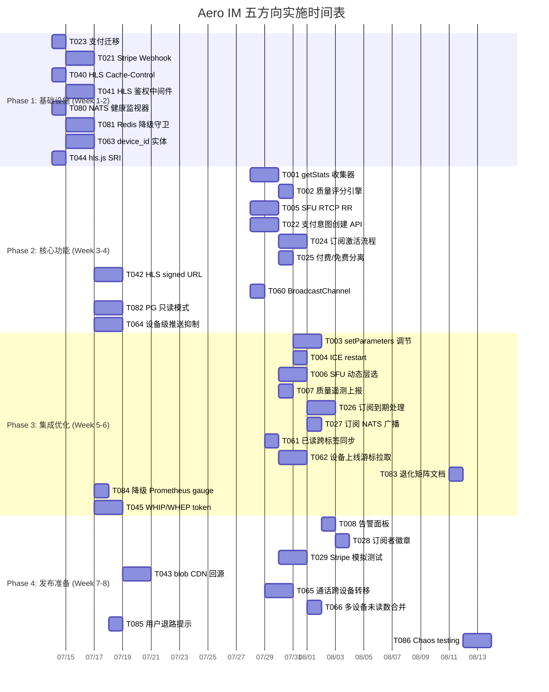

Now I have sufficient context from cross-referencing the analysis against the actual source code. Here is my Tech Lead analysis:

---

# Tech Lead 分析报告：Aero IM 架构缺口实现规划

## 0. 交叉验证回顾

已对分析文档中五个方向的核心断言进行源码级验证：

| 断言 | 验证结果 | 关键证据 |
|------|---------|---------|
| 方向一：calls.js 无质量 API 调用 | ✅ 确认 | `getStats`/`setParameters`/`scaleResolutionDownBy` 零出现 |
| 方向二：支付为"空壳" | ✅ 确认 | `subscribe` 执行纯 `INSERT`，无支付网关交互 |
| 方向三：HLS 无 Cache-Control | ✅ 确认 | `serve.rs` 中 `Cache-Control` 零出现 |
| 方向四：无跨设备/标签页协调 | ✅ 确认 | `BroadcastChannel`/`SharedWorker`/`device_id` 零出现 |
| 方向五：NATS 故障不导致 PG 回滚 | ✅ **修正确认** | `publish_room_event` 失败仅 `warn!`，不传播错误 |
| hls.js CDN 无 SRI | ✅ 确认 | `index.html` 中 `<script src>` 无 `integrity=` |

---

## 1. 任务分解

### 方向一：WebRTC 质量自适应（P1）

| ID | 任务标题 | 涉及文件 | 前置依赖 | 工时(h) | 验收标准 |
|---|---|---|---|---|---|
| TASK-001 | 客户端 `getStats` 轮询收集器 | `web/calls.js` | 无 | 3 | 每 5s 轮询 `pc.getStats()`，提取 `roundTripTime`/`packetsLost`/`framesPerSecond`/`bitrate`，存入 `state.call.stats` 环形缓冲区 |
| TASK-002 | 质量评分引擎（客户端） | `web/calls.js` | TASK-001 | 2 | 根据 RTT(>300ms=降级)、丢包率(>5%=降级)、FPS(<15=降级) 输出 `{action: 'degrade'\|'restore'\|'stable', level: 'high'\|'medium'\|'low'}` |
| TASK-003 | `RTCRtpSender.setParameters` 动态调节 | `web/calls.js` | TASK-002 | 3 | `degrade` → `scaleResolutionDownBy=2.0` + `maxBitrate` 降低；`restore` → 恢复原始参数；验证 `encoding` 层切换 |
| TASK-004 | ICE restart 路径 | `web/calls.js` | TASK-001 | 2 | `iceconnectionstatechange` 收到 `disconnected` 时调用 `pc.restartIce()` 而非等 `failed` 挂断；30s 超时后仍挂断 |
| TASK-005 | SFU 端 RTCP Receiver Report 消费 | `crates/aero-live-webrtc/src/rtcp_feedback.rs`, `crates/aero-live-webrtc/src/simulcast.rs` | 无（独立） | 4 | 解析 RR 中的 `fractionLost`/`cumulativeLost`；当丢包 >10% 时触发 `SimulcastSelector.select('medium')` 降级 |
| TASK-006 | SFU 动态层选：质量→订阅者映射 | `crates/aero-live-webrtc/src/forward/mod.rs` | TASK-005 | 3 | `SfuForwarder.subscriber_estimate_bps` 接入丢包数据；订阅者个别降级不影响其他人 |
| TASK-007 | 端到端质量遥测上报 | `web/calls.js` + `crates/aero-server/src/` | TASK-001 | 2 | 每 30s 将 `min/max/avg RTT + 丢包率 + 分辨率` 聚合通过 WS 帧 `quality_report` 上报；服务端落地 `otel` metrics |
| TASK-008 | 连接失败告警面板（运维） | `crates/aero-common/src/metrics.rs` | TASK-007 | 2 | Prometheus `webrtc_call_duration_seconds` + `webrtc_connection_failures_total`；Grafana 面板模板 |

**方向一合计：21h**

### 方向二：支付结算（P1）

| ID | 任务标题 | 涉及文件 | 前置依赖 | 工时(h) | 验收标准 |
|---|---|---|---|---|---|
| TASK-020 | Stripe 客户端 SDK 集成 | `web/payments.js`（新建） | 无 | 2 | 初始化 `Stripe(publishableKey)`；提供 `createPaymentMethod` / `confirmPayment` 封装 |
| TASK-021 | 后端 Stripe Webhook 端点 | `crates/aero-server/src/stripe_webhook.rs`（新建） | 无 | 4 | `POST /api/stripe/webhook` 验签；处理 `checkout.session.completed` → `customer.subscription.updated` → `invoice.paid` → `customer.subscription.deleted` |
| TASK-022 | 支付意图创建 API | `crates/aero-server/src/payments.rs`（新建）+ `crates/aero-server/src/routes/routes.rs` | TASK-021 | 3 | `POST /api/creators/:id/subscribe/checkout` 创建 Stripe Checkout Session；将 `tier_id`/`creator_id` 写入 `payment_intents` 表；返回 `url` 给客户端 |
| TASK-023 | 创收模型：`payment_intents` 表迁移 | `migrations/NNNN_payment_intents.sql`（新建） | 无 | 2 | 表含 `id(pk)`, `participant_id`(fk), `creator_id`, `tier_id`, `stripe_session_id`, `stripe_subscription_id`, `status`(enum: pending/active/canceled/expired), `amount_cents`, `created_at`, `updated_at` |
| TASK-024 | 订阅激活流程 | `crates/aero-storage/src/payment.rs`（新建） | TASK-022 + TASK-023 | 3 | Webhook receipt → 验证 `amount_cents ≥ tier.price_cents` → `UPDATE creator_subscriptions SET active=true, tier_id=$1` → 广播 `RoomEvent::SubscriptionStatus` |
| TASK-025 | 付费/免费订阅路径分离 | `crates/aero-server/src/subscriptions.rs` | TASK-022 | 2 | 保留当前免费 subscribe（关注语义）为 `POST /api/creators/:id/follow`；新增付费 `POST /api/creators/:id/subscribe?tier_id=x` 走 Stripe Checkout |
| TASK-026 | 订阅到期/取消处理 | `crates/aero-server/src/stripe_webhook.rs` + `crates/aero-storage/src/payment.rs` | TASK-024 | 3 | 定期（Cron/Webhook）→ `deleted` → `active=false` + 广播 `SubscriptionStatus`；grace period 3 天 |
| TASK-027 | 订阅状态 NATS 广播 + 跨设备同步 | `crates/aero-im-core/src/service/events.rs` (新增 `RoomEvent::SubscriptionStatus` variant) + `crates/aero-common/src/model/event.rs` | TASK-024 | 2 | Webhook 处理成功后 `publish_room_event(SubscriptionStatus{participant,creator,tier,active})` → NATS → 所有设备收到 |
| TASK-028 | 订阅者徽章在聊天中显示 | `web/render.js` + `crates/aero-common/src/live.rs` | TASK-026 | 2 | 聊天消息的 `is_subscriber` 字段从 `creator_subscriptions` 实时查询；UI 中徽章渲染 |
| TASK-029 | 测试：Stripe webhook 模拟 | `crates/aero-server/tests/`（新建） | TASK-021 | 3 | 用 `wiremock` 或 fixture 模拟 Stripe 事件 payload；验证验签、`payment_intents` 状态变更、`subscription` 激活全链路 |

**方向二合计：26h**

### 方向三：CDN/内容分发（P1 若直播已生产，否则 P2）

| ID | 任务标题 | 涉及文件 | 前置依赖 | 工时(h) | 验收标准 |
|---|---|---|---|---|---|
| TASK-040 | HLS Cache-Control 策略 | `crates/aero-server/src/serve.rs` | 无 | 2 | `.m3u8` 设置 `Cache-Control: no-cache`；`.ts` 设 `Cache-Control: public, max-age=3600`；blob 附件设 `private, max-age=86400` |
| TASK-041 | HLS 路径鉴权中间件 | `crates/aero-server/src/hls_auth.rs`（新建） | 无 | 4 | 中间件检查 `/hls/{stream_id}/*` 请求：Bearer token 或 signed cookie；验证 `stream` 查询 `streams` 表是否公开/用户有权限；未授权 `401` |
| TASK-042 | HLS signed URL 生成 | `crates/aero-server/src/hls_auth.rs` | TASK-041 | 3 | `GET /api/streams/:id/playback-token` → 返回 `{url: "/hls/.../index.m3u8?token=..."}`；token = `HMAC(stream_id + expiry)`，有效期 12h |
| TASK-043 | blob 附件 CDN 回源策略 | `crates/aero-storage/src/blob.rs` + `crates/aero-server/src/serve.rs` | TASK-040 | 3 | `S3BlobStore` 生成 presigned URL 供客户端直接下载；`LocalFsBlobStore` 设置 `Cache-Control` + `Content-Disposition` |
| TASK-044 | hls.js SRI + 版本锁定 | `web/index.html` | 无 | 1 | 替换 `cdn.jsdelivr.net/npm/hls.js@...` 为锁定版本 URL + 添加 `integrity` 哈希 + `crossorigin="anonymous"` |
| TASK-045 | 直播播放鉴权：WHIP/WHEP token 校验 | `crates/aero-live-whip/src/session.rs` | TASK-041 | 3 | WHEP 订阅请求中验证 `Authorization` header 或 `?token=` query param；拒绝未授权播放 |

**方向三合计：16h**

### 方向四：跨设备协同（P2）

| ID | 任务标题 | 涉及文件 | 前置依赖 | 工时(h) | 验收标准 |
|---|---|---|---|---|---|
| TASK-060 | 跨标签页事件总线（BroadcastChannel） | `web/context.js` + `web/broadcast.js`（新建） | 无 | 2 | 创建 `BroadcastChannel('aero')`；监听 `message` 事件更新 `state`；发送类型：`read_advance`/`call_state`/`typing_indicator`/`room_switch` |
| TASK-061 | 已读游标跨标签页同步 | `web/context.js` + `web/ws.js` | TASK-060 | 2 | 标签页 A `mark_read` → WS send → 服务端存最大游标 → 广播 `ReadReceipt` → 标签页 B 收到 `BroadcastChannel` 消息后更新 `unreadByRoom` |
| TASK-062 | 设备上线已读游标拉取 | `web/ws.js` + `crates/aero-server/src/collab.rs` | TASK-061 | 3 | 新 WS 连接建立时客户端发 `sync_read_receipts` → 服务端返回所有房间最大 `last_read_message_id` → 客户端推进本地游标 |
| TASK-063 | 服务端 `device_id` 实体 + 设备注册 | `migrations/NNNN_devices.sql` + `crates/aero-storage/src/device.rs` | 无 | 3 | 表 `devices(id, participant_id, device_name, device_type, push_token, last_seen_at)`；`POST /api/devices` 注册；`DELETE /api/devices/:id` 解绑 |
| TASK-064 | 推送去重：设备级推送抑制 | `crates/aero-server/src/push_bot.rs` | TASK-063 | 3 | 推送前检查 `devices` 表中同一 participant 的已推送状态；设备 B 已通过 WS 收到消息则跳过推送给它 |
| TASK-065 | 通话状态跨设备转移 | `web/calls.js` + `web/broadcast.js` | TASK-060 | 4 | 标签页 A 通话中 → 标签页 B 发起同一通话 → BroadcastChannel 通知 A 释放 → B 接管；通过 `call_transfer` WS 帧协调 |
| TASK-066 | 多设备未读数合并 | `web/notifications.js` + `crates/aero-server/src/notifications.rs` | TASK-062 | 2 | 服务端已读回执按 `participant_id` 去重（已完成）；客户端 fetch `/api/me/unread-counts` 返回全局最新值 |

**方向四合计：19h**

### 方向五：依赖退化矩阵（P3）

| ID | 任务标题 | 涉及文件 | 前置依赖 | 工时(h) | 验收标准 |
|---|---|---|---|---|---|
| TASK-080 | NATS 健康监视器 | `crates/aero-server/src/health.rs` | 无 | 2 | `GET /health/live` 周期 ping NATS；`GET /health/ready` 检查 NATS/Redis/PG 三通；NATS 断开时返回 `200` 但 header `X-Degraded: nats-down` |
| TASK-081 | Redis 降级统一守卫 | `crates/aero-common/src/health.rs`（新建） + 各散落点 | 无 | 4 | 新建 `DegradationManager`：枚举 `Degradation{NatsDown, RedisDown, PgReadOnly, AllGood}`；各模块通过 `manager.status()` 获取统一降级信息而非各自判断 |
| TASK-082 | PG 只读模式 | `crates/aero-server/src/middleware/readonly.rs`（新建） | 无 | 4 | 检测 PG 主库不可用 → `AppState.readonly_mode` 设为 `true`；所有 mutating 路由返回 `503 Service Unavailable (read-only mode)`；只读查询（消息历史、搜索）正常 |
| TASK-083 | 退化矩阵文档 | `docs/operations/degradation-matrix.md`（新建） | TASK-080 + TASK-081 + TASK-082 | 2 | 文档覆盖 5 种依赖故障场景 x 10 个功能域的退化行为；包含运维操作指引（M7 级别 runbook） |
| TASK-084 | 降级状态 Prometheus gauge | `crates/aero-common/src/metrics.rs` + `crates/aero-server/src/observability.rs` | TASK-081 | 2 | `degradation_status{target="nats|redis|pg"} 0|1`；告警规则 `if >1 for 30s` |
| TASK-085 | NATS 故障时用户退路提示 | `web/notifications.js` + `web/chrome.js` | TASK-080 | 2 | 服务端 REST `/health/degradation` 返回降级状态 → 客户端非静默版本 Toast 提示"实时消息推送暂不可用，刷新页面可查看最新消息" |
| TASK-086 | Chaos testing 脚本 | `scripts/chaos-test.sh`（新建） | TASK-080—TASK-085 全部 | 4 | 脚本逐个断开 NATS/Redis/PG 连接验证降级行为；自动断言预期行为（如 NATS 断开时发消息仍 200） |

**方向五合计：20h**

---

## 2. 执行顺序

### 并行任务组

| 并行组 | 包含任务 | 负责人技能 |
|--------|---------|-----------|
| **Group A**: 客户端 WebRTC | TASK-001, TASK-002, TASK-003, TASK-004, TASK-007 | 前端/WebRTC 专家 |
| **Group B**: SFU 质量 | TASK-005, TASK-006 | Rust/str0m 专家 |
| **Group C**: 支付直列 | TASK-023 → TASK-021 → TASK-022 → TASK-024 → TASK-025 → TASK-026 | 全栈 + Stripe 经验 |
| **Group D**: CDN/鉴权 | TASK-040 → TASK-041 → TASK-042 → TASK-043, TASK-044, TASK-045 | 后端/安全 |
| **Group E**: 跨设备 | TASK-063 (独立) + TASK-060 → TASK-061 → TASK-062 → TASK-065 → TASK-066 | 全栈 + Web API |
| **Group F**: 退化矩阵 | TASK-080 → TASK-081 → TASK-082 → TASK-083 → TASK-084 → TASK-085 → TASK-086 | 运维/SRE 思维 |

---

## 3. 技术风险

### 3.1 高风险项

| 风险 | 方向 | 级别 | 说明 | 缓解措施 |
|------|------|------|------|---------|
| **WebRTC `setParameters` 浏览器兼容性** | 方向一 | 🟠 中 | `RTCRtpSender.setParameters` 在 Safari 中对 `scaleResolutionDownBy` 支持不一致；Firefox 可能静默忽略 | 特性检测 + fallback：不支持时降级到全量发送；BrowserStack 测试矩阵 |
| **Stripe Webhook 幂等性** | 方向二 | 🔴 高 | Stripe 可能重投同一 webhook 事件；处理不幂等会导致重复扣款或重复激活 | 用 `stripe_session_id` UNIQUE 约束 + `ON CONFLICT DO NOTHING`；webhook 处理函数天然幂等 |
| **SFU 动态码率决策收敛** | 方向一 | 🟠 中 | 多个订阅者不同网络质量 → SFU 需同时以不同质量转发同一流 → 计算膨胀 | 实现"观看者分组"策略：以当前最低质量订阅者为准，减至 N 人共用同一降级触发阈值 |
| **HLS 鉴权性能开销** | 方向三 | 🟢 低 | 每个 `.ts` 切片请求都走签名验证 → 高并发直播的鉴权成为瓶颈 | 验证 token 用对称 HMAC（无 DB 查询）+ 设置 `Cache-Control: public` 减少重复验证；考虑 CDN edge auth（如 CloudFront signed cookies） |
| **BroadcastChannel 与 Service Worker 共存** | 方向四 | 🟢 低 | 移动端 Safari 和 Firefox 对 `BroadcastChannel` 支持不同步 | 使用 `'BroadcastChannel' in window` 特性检测；不支持时退化为单标签页模式 |
| **PG 只读模式检测延迟** | 方向五 | 🟠 中 | PG 主库故障后只读检测有 5-10s 延迟 → 期间写入请求返回 500 | 使用 PgBouncer `show databases` 或 `pg_isready` 主动探测；超时后快速降级 |

### 3.2 外部依赖

| 依赖 | 用途 | 替代方案 |
|------|------|---------|
| **Stripe API** (方向二) | 支付处理 | Paddle（免 PCI）、Lemon Squeezy（免税），但需重新设计 webhook |
| **CDN 提供商** (方向三) | HLS / blob 分发 | 自建 Nginx + cache（增加运维成本） |
| **hls.js** (方向三) | HLS 客户端播放 | native HLS（仅 Safari），但兼容性不够 |
| **BroadcastChannel API** (方向四) | 跨标签页通信 | `SharedWorker`（更复杂）、`localStorage` + `storage` event（有延迟） |

### 3.3 测试难点

| 测试场景 | 难点 | 策略 |
|---------|------|------|
| WebRTC getStats 质量降级 | 需要真实 WebRTC 连接 + 模拟劣化网络 | `puppeteer` + `chrome-devtools` 模拟网络限速（`Network.emulateNetworkConditions`） |
| Stripe webhook 端到端 | Stripe 沙箱需要真实事件触发 | 用 `stripe-cli listen --forward-to` 本地转发 + fixture 事件 |
| 跨标签页广播 | 需要多页面浏览器上下文 | Playwright 多 page 测试 |
| 退化矩阵 chaos test | 需要破坏性环境（断 NATS/Redis/PG） | Docker Compose 独立栈 + `pumba` 网络混沌注入 |
| SFU 动态质量切换 | 需要多个 str0m 模拟对端 | 现有测试框架已模拟 SFU 转发，扩展增加不同丢包率的 `MockPeer` |

---

## 4. 资源评估

### 4.1 人员需求

| 角色 | 数量 | 技能要求 | 主要负责方向 |
|------|------|---------|------------|
| **前端/WebRTC 工程师** | 1 人 | JavaScript (ES2020), WebRTC API, `getStats`/`setParameters`, BroadcastChannel | 方向一（客户端）+ 方向四 |
| **Rust 后端工程师（IM 领域）** | 1 人 | Rust, tokio, axum, sqlx, NATS, Redis | 方向五 + 方向三（鉴权） |
| **Rust 后端工程师（媒体领域）** | 1 人 | Rust, str0m, RTP/RTCP, SFU, HLS | 方向一（SFU 端）+ 方向三（HLS） |
| **全栈工程师（支付）** | 1 人 | Rust + Stripe API + 前端支付 UI | 方向二（支付全链路） |

**最小团队配置**：2 人（1 全职前端 + 1 全职后端，支付部分外包或增加 1 人）

### 4.2 关键里程碑

| 里程碑 | 日期（从项目启动） | 交付物 |
|--------|-------------------|--------|
| **M1: 基础就绪** | 第 2 周末 | `payment_intents` 迁移上线 + Stripe webhook 端点部署 + HLS Cache-Control + NATS/Redis 监视器 + `devices` 表 |
| **M2: 核心功能** | 第 4 周末 | 客户端 WebRTC 质量自适应完成 + 付费订阅可下单 + HLS 鉴权保护 + 跨标签页已读同步 |
| **M3: 端到端验证** | 第 6 周末 | Chaos test 脚本全绿 + 退化矩阵文档发布 + Stripe 沙箱端到端测试 + 跨设备通话转移 |
| **M4: 生产发布** | 第 8 周末 | Grafana 面板上线 + runbook 更新 + 生产观察 72h + SLO 定义 |

### 4.3 阻塞点与解决策略

| 阻塞点 | 影响方向 | 解决策略 |
|--------|---------|---------|
| **Stripe 账户申请/合规审批** | 方向二 | 提前启动；先用 `stripe-cli` mock 模式开发，不与审批阻塞 |
| **生产 CDN 采购** | 方向三 | 先使用 CloudFront（AWS 已有）或 Cloudflare；如需采购走侧道，不影响鉴权开发 |
| **SRI 哈希随版本变化** | 方向三 | CI 中自动化拉取最新 hls.js 版本并更新 `integrity`；或锁定特定版本用 `@1.5.18` |

---

## 5. 质量保证

### 5.1 单元测试覆盖要求

| 模块 | 测试要求 | 最低覆盖率 | 关键测试场景 |
|------|---------|-----------|------------|
| 客户端质量评分引擎 (TASK-002) | `jest` / 纯函数测试 | 90%+ | RTT=200ms → `stable`；RTT=500ms → `degrade`；丢包率=15% → `degrade`；恢复后 → `restore` |
| SFU RTCP 消费 (TASK-005) | `cargo test` | 85%+ | `fractionLost=0` → 保持；`fractionLost=50` → 触发降级；空 Report → no-op |
| Stripe webhook 处理 (TASK-021) | `cargo test` + wiremock | 90%+ | 签名验证；重复事件幂等；`invoice.paid` 金额不足不激活；`customer.subscription.deleted` 停用 |
| HLS token 验证 (TASK-042) | `cargo test` | 95%+ | 有效 token → 200；过期 token → 401；篡改 token → 401；HMAC 密钥轮换 |
| 跨标签页 BroadcastChannel (TASK-060) | Playwright e2e | 功能验收 | 标签页 A `mark_read` → B 未读数更新；A 发起通话 → B 显示通话状态 |
| 降级守卫 (TASK-081) | `cargo test` | 90%+ | NATS 断 → `degraded` 且 `state` 正确；Redis 断 → `degraded`；全通 → `all_good` |
| PG 只读模式 (TASK-082) | `cargo test` + `sqlx` mock | 85%+ | `readonly=true` → 写路由 `503`；读路由 `200`；切换回读写模式后恢复正常 |

### 5.2 集成测试策略

| 集成测试 | 工具 | 持续时间 | 触发条件 |
|---------|------|---------|---------|
| **Stripe 端到端** | `stripe-cli listen` + curl | ~5min | PR merged to main |
| **WebRTC 质量降级（浏览器）** | Playwright + chrome-devtools 限速 | ~2min | PR with calls.js changes |
| **跨标签页同步** | Playwright 多 page | ~1min | PR with broadcast.js changes |
| **HLS 鉴权全链路** | Playwright + `ffmpeg` 推流（mock） | ~3min | Weekly CI |
| **Chaos 矩阵** | Docker Compose + pumba | ~10min | 每发布前 |

### 5.3 代码审查要点

| 领域 | 审查重点 |
|------|---------|
| **WebRTC** | `pc.getStats()` 是否在连接关闭后不再调用（防止 `InvalidStateError`）；`setParameters` 前后是否检查 `pc.signalingState` |
| **支付** | 金额比较是否用 `i64` 而非 `f64`（浮点精度问题）；Stripe secret key 是否从环境变量注入而非硬编码；webhook 签名是否必验 |
| **HLS 鉴权** | 直播流 URL 是否含用户标识（防分享）；`token` 是否包含 `exp` + `stream_id` + `participant_id` 三个字段；密钥是否可轮换 |
| **跨标签页** | `BroadcastChannel` message 是否序列化/反序列化容错（JSON.parse 失败不爆炸）；消息类型是否有白名单 |
| **降级守卫** | 是否有 `tokio::select!` 超时（避免健康检查永久阻塞）；降级状态变更是否 atomic；降级恢复后有路径回 `all_good` |

### 5.4 性能测试需求

| 测试场景 | 负载 | 指标 |
|---------|------|------|
| HLS 鉴权性能 | 1000 QPS `.ts` 请求 | P50 < 5ms, P99 < 20ms |
| SFU 动态质量切换 | 50 个订阅者同时切换质量 | 切换延迟 < 1 RTT, CPU 增量 < 10% |
| Stripe webhook 并发 | 100 个 webhook 同时到达 | 处理时间 < 500ms, 0 死锁 |
| BroadcastChannel 多标签页 | 5 个标签页同时收发 | 消息延迟 < 100ms, 无消息丢失 |
| PG 只读模式切换 | 主库故障 → 只读切换 | 切换时间 < 3s, 受影响请求 < 10 |

---

## 6. 实施计划

### 阶段交付物检查清单

#### Phase 1（第 1-2 周）验收

- [ ] `payment_intents` 表已迁移，`aero-cli migrate` 通过
- [ ] `POST /api/stripe/webhook` 已部署，`stripe-cli trigger` 返回 200
- [ ] HLS `.m3u8` 返回 `Cache-Control: no-cache`，`.ts` 返回 `Cache-Control: public, max-age=3600`
- [ ] `GET /health/live` 和 `/health/ready` 区分 NATS/Redis/PG 状态
- [ ] `devices` 表已迁移，设备注册/解绑 API 可用
- [ ] `web/index.html` hls.js 带 SRI integrity

#### Phase 2（第 3-4 周）验收

- [ ] 客户端每 5s `getStats` 采集数据，`state.call.stats` 有环形缓冲区
- [ ] 质量评分引擎接受 RTT/丢包率/FPS 输入并输出 `degrade`/`restore`/`stable`
- [ ] SFU `rtcp_feedback.rs` 解析 RR 字段
- [ ] `POST /api/creators/:id/subscribe/checkout` 返回 Stripe Checkout URL
- [ ] 免费订阅分离为 `follow`，付费走 Stripe
- [ ] HLS `/hls/{id}/*` 鉴权中间件拒绝无 token 请求
- [ ] `BroadcastChannel` 在标签页之间同步 `read_advance` 和 `call_state`

#### Phase 3（第 5-6 周）验收

- [ ] `setParameters` 实际降低编码分辨率
- [ ] `iceconnectionstatechange` → `disconnected` 调用 `restartIce()`
- [ ] SFU 根据丢包率动态切换 simulcast 层
- [ ] `quality_report` WS 帧每 30s 上报一次聚合指标
- [ ] 订阅到期自动停用 + `SubscriptionStatus` 广播
- [ ] 新设备上线自动拉取所有房间最大已读游标
- [ ] 退化矩阵文档 `docs/operations/degradation-matrix.md` 评审通过

#### Phase 4（第 7-8 周）验收

- [ ] Grafana 面板显示 WebRTC 连接质量、支付转化率、CDN 命中率
- [ ] 混沌测试脚本通过：NATS 断开→消息存储正常→无数据丢失
- [ ] Stripe 沙箱端到端：创建 Checkout → 模拟支付 → webhook 处理 → 订阅激活
- [ ] 通话跨设备转移：A 标签页通话中 → B 标签页接管 → A 释放
- [ ] 生产环境观察 72h 无误报

---

## 附录：分析文档修正摘要

来自交叉验证中的关键修正，供实施时参考：

| 分析原始断言 | 修正 | 影响 |
|------------|------|------|
| "NATS publish 错误导致消息存储事务也回滚" | 实际 `publish_room_event` 失败仅 `warn!`，不 Propagation → 消息已存储但实时推送丢失 | 方向五重心从"解耦"（已做到）转为"异步感知"（缺告警） |
| "目前 subscribe 是免费的" | 更精确：**零金额**。`price_cents` 存了但从不校验 | 方向二保留免费 subscribe（关注） + 新增付费路径 |
| "无 Cache-Control → 浏览器/CDN 不缓存" | `ServeDir` 默认提供 `Last-Modified`，浏览器做条件请求缓存；但无显式策略 | 方向三需区分 `.m3u8`（no-cache）和 `.ts`（max-age） |
| "跨设备已读服务端不支持" | 服务端 `receipts` 表已按 `(room_id, participant_id)` 去重存储最大游标；**客户端**缺拉取机制 | 方向四重心从"服务端"转移至"客户端同步协议" |
| `connectionstatedchange` 拼写错误 | 应为 `connectionstatechange`（不影响结论） | 无实质影响 |
