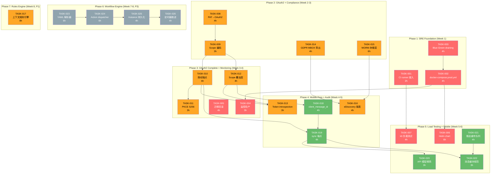
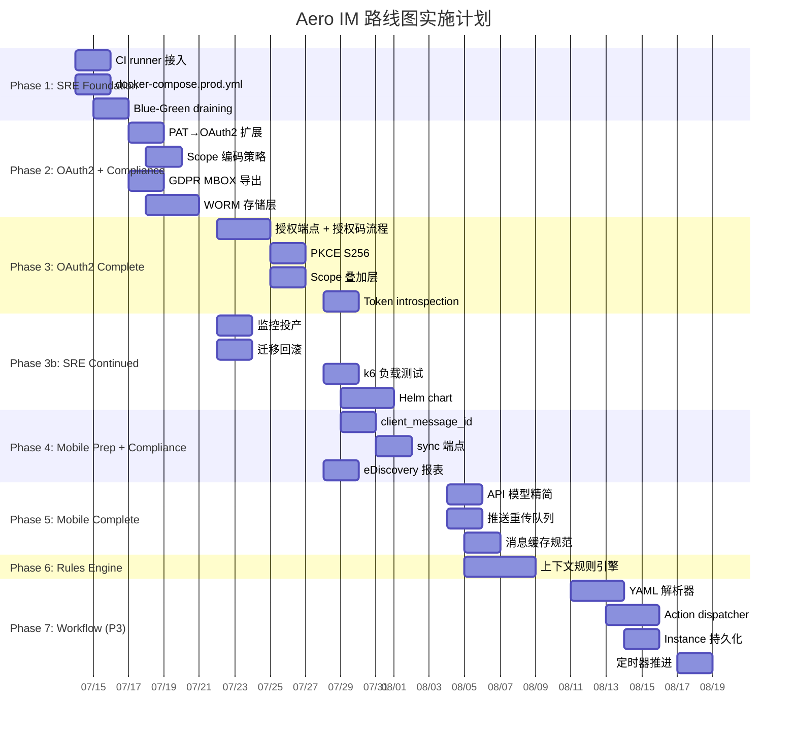

现在我有了充分的代码库理解。让我给出完整的 Tech Lead 分析。

---

# Tech Lead 分析：Aero IM 路线图方向验证

## 文档总体评估

分析文档的**敏锐度很高**——尤其是指出 `client_message_id` 缺失、PAT 作为 OAuth2 可复用资产、以及工作流引擎的「静态 Rust vs 动态流程」矛盾。但它需要以下校准：

1. **移动端 SDK 的优先级被高估**——客户端幂等键只需 2-4 小时，并非 P2 级别的任务
2. **OAuth2 与 `assert_room_access` 叠加的成本被低估**——这不是一个简单的中间件，涉及到大量重构
3. **CI 就绪度评估不够精确**——配置文件完整，只缺 runner，这是 P0 问题

---

## 1. 任务分解

### 方向五：SRE 生产就绪（P0）

| 任务 ID | 标题 | 涉及文件 | 前置依赖 | 工时 | 验收标准 |
|---------|------|---------|---------|------|---------|
| TASK-001 | CI runner 接入 + Actions 取消注释 | `.github/workflows/ci.yml` | 无 | 2h | 5 个 job 绿通过；runner 接入文档 |
| TASK-002 | `docker-compose.prod.yml` 生产化 | `docker-compose.prod.yml`、`.env.prod.example` | 无 | 4h | 健康检查、优雅关闭、日志聚合、backup sidecar、log shipper；可一键 `docker compose -f docker-compose.prod.yml up` |
| TASK-003 | Blue-Green readiness：pod draining 信号集成 | `crates/aero-server/src/routes/health.rs`、`crates/aero-server/src/state.rs`、`crates/aero-server/src/main.rs` | 无 | 4h | 停机前 `SIGTERM` → `shutting_down = true` → `/health/ready` 返回 503 + `"draining"` → 等待 LB 移除 → 优雅关断 |
| TASK-004 | 监控投产：bearer-gated `/metrics` + Prometheus scrape 配置 | `crates/aero-server/src/metrics.rs`、`monitoring/prometheus/prometheus.example.yml` | TASK-002 | 3h | Prometheus 能 scrape `/metrics`；Grafana dashboards 可读 |
| TASK-005 | 迁移回滚：`sqlx migrate revert` 验证 + down 脚本模板 | `migrations/`(全部 .sql)、`aero-storage/src/db.rs` | 无 | 4h | 验证 `sqlx migrate revert` 兼容性；写出 3 个代表性 down 脚本 |
| TASK-006 | Helm chart（初始版本） | `charts/aero-im/`（Chart.yaml、values.yaml、templates/）| TASK-002 | 6h | `helm template` 生成可部署 YAML；包含 Deployment/Service/ConfigMap/Ingress |
| TASK-007 | k6 负载测试基础框架 | `scripts/k6/`、`scripts/smoke_load.py` | TASK-001 | 4h | 能跑 100 并发 WebSocket 用户、验证 MESSAGES_SENT_TOTAL 计数 |

### 方向二：OAuth2 集成平台（P1）

| 任务 ID | 标题 | 涉及文件 | 前置依赖 | 工时 | 验收标准 |
|---------|------|---------|---------|------|---------|
| TASK-008 | PAT 扩展为 OAuth2 token 存储模型 + 验证管线 | `crates/aero-storage/src/pat.rs`、`crates/aero-auth/src/pat.rs`、`migrations/XXXX_oauth_tokens.sql` | 无 | 4h | PAT 表加 `scope` 列；验证管道走 OAuth2 scope 校验 |
| TASK-009 | Scope 编码策略 + JWT custom claims | `crates/aero-auth/src/jwt.rs`、`crates/aero-common/src/oauth.rs` | TASK-008 | 3h | `scope` 编码进 `aud` 或 custom claim（建议 `"scope"` claim）；token introspection 端点 |
| TASK-010 | OAuth2 授权端点 + 授权码流程 | `crates/aero-server/src/routes/oauth.rs`、`crates/aero-auth/src/oauth.rs` | TASK-009 | 6h | `GET /oauth/authorize` → 302 → `POST /oauth/token` → access_token + refresh_token |
| TASK-011 | PKCE S256 支持 | `crates/aero-auth/src/oauth.rs`、`crates/aero-server/src/routes/oauth.rs` | TASK-010 | 3h | 移动端 PKCE 授权码流程 200；无 PKCE 请求被拒绝 |
| TASK-012 | Scope 叠加层：在 `assert_room_access` 之后加 scope guard | `crates/aero-server/src/middleware/scope.rs`、`crates/aero-server/src/routes/routes.rs` | TASK-009 | 4h | 每个路由可选 `require_scope("im:message:write")`；scope 不足返回 403 |
| TASK-013 | Token introspection 端点（RFC 7662） | `crates/aero-server/src/routes/oauth.rs` | TASK-010 | 3h | `POST /oauth/introspect` 返回 active/scope/sub |

### 方向四：高级合规（P1 金融客户）

| 任务 ID | 标题 | 涉及文件 | 前置依赖 | 工时 | 验收标准 |
|---------|------|---------|---------|------|---------|
| TASK-014 | GDPR 导出 PST/MBOX 格式支持 | `crates/aero-server/src/me_export.rs`、`crates/aero-server/src/workspace/export.rs` | 无 | 4h | 导出提供 JSON + MBOX 选项；MBOX 格式符合 RFC 4155 |
| TASK-015 | WORM 存储层：append-only blob store + retention lock | `crates/aero-storage/src/worm.rs`、`crates/aero-storage/src/blob.rs`、`migrations/XXXX_worm_manifest.sql` | 无 | 6h | 消息存 WORM store 后不可修改/不可删除；retention lock 生效后任何 DELETE 都返回 403 |
| TASK-016 | eDiscovery 审计报表生成 | `crates/aero-server/src/routes/ediscovery.rs`、`crates/aero-server/src/routes/audit.rs` | TASK-014 | 4h | 支持时间范围 + 关键词 + 参与者筛选的审计查询；CSV/JSON 导出 |
| TASK-017 | 上下文规则引擎替代 keyword_moderator | `crates/aero-im-core/src/service/rules.rs`、`crates/aero-im-core/src/service/orig.rs` | 无 | 8h | 支持「股价在交易时段=违规」这类上下文敏感规则；规则 DSL（YAML 配置） |

### 方向一：原生移动端 SDK（P2）

| 任务 ID | 标题 | 涉及文件 | 前置依赖 | 工时 | 验收标准 |
|---------|------|---------|---------|------|---------|
| TASK-018 | 客户端幂等键：`client_message_id` 支持 | `crates/aero-server/src/ws/ws_impl/mod.rs`、`crates/aero-server/src/ws/ws_impl/frame.rs`、`crates/aero-im-core/src/service/messages.rs`、`migrations/XXXX_client_txn_id.sql` | 无 | 4h | `SendMessage` 可选 `client_message_id`；同 `(sender, client_message_id)` 第二次返回已存在消息的 ID，不重复创建 |
| TASK-019 | `?since=` sync 端点（增量消息同步） | `crates/aero-server/src/routes/sync.rs`、`crates/aero-storage/src/message.rs` | TASK-018 | 4h | `GET /api/sync?since=<seq>&limit=100` 返回增量消息；支持分页游标 |
| TASK-020 | API 模型精简（移动端专用序列化 View） | `crates/aero-common/src/model/mobile.rs`、`crates/aero-server/src/routes/mobile.rs` | TASK-019 | 3h | 移动端 GET 消息返回精简版（无 `metadata`、关系字段最小化）；带宽减少 60%+ |
| TASK-021 | 移动端推送重传队列 | `crates/aero-push/src/retry.rs`、`crates/aero-storage/src/push_retry.rs` | 无 | 4h | 推送失败后重试（指数退避）；最大重试次数 5 次后转 DLQ |
| TASK-022 | 消息本地缓存规范 + 服务端 `last_message_id` 游标 | `crates/aero-server/src/ws/ws_impl/mod.rs`、`crates/aero-storage/src/delivery_cursor.rs` | TASK-018 | 3h | 每次 WS 连接返回 `last_message_id`；客户端据此清除本地缓存 |

### 方向三：工作流引擎（P3）

| 任务 ID | 标题 | 涉及文件 | 前置依赖 | 工时 | 验收标准 |
|---------|------|---------|---------|------|---------|
| TASK-023 | 工作流定义 YAML 解析器 | `crates/aero-workflow/src/definition.rs`、`crates/aero-common/src/workflow.rs` | 无 | 6h | YAML 定义可解析为 typed `WorkflowDefinition`；支持 step/transition/condition |
| TASK-024 | 动态 action dispatcher | `crates/aero-workflow/src/dispatcher.rs`、`crates/aero-workflow/src/actions/` | TASK-023 | 6h | 根据 step type 调用对应 Rust handler（send_message/approve/ai_call 等） |
| TASK-025 | `WorkflowInstance` 持久化状态机 | `migrations/XXXX_workflows.sql`、`crates/aero-workflow/src/instance.rs`、`crates/aero-storage/src/workflow.rs` | TASK-023 | 4h | 支持创建/暂停/恢复/取消工作流实例；进度持久化到 PG |
| TASK-026 | 定时器推进 ready transitions + 超时处理 | `crates/aero-server/src/bin/boot/workflow_timer.rs` | TASK-025 | 4h | 每 tick 查 ready transitions 推进；超时 step 触发超时处理 |

---

## 2. 执行顺序

### 可并行执行的任务组

| 并行组 | 任务 | 并行理由 |
|-------|------|---------|
| **Group A** | TASK-001, TASK-002, TASK-003, TASK-005, TASK-008, TASK-014, TASK-015, TASK-018, TASK-023 | 无共享文件；完全独立模块 |
| **Group B** | TASK-004, TASK-006, TASK-009, TASK-016, TASK-019, TASK-024 | TASK-004/006 需 TASK-002；其余依赖 Group A 产物 |
| **Group C** | TASK-007, TASK-010, TASK-011, TASK-012, TASK-020, TASK-021, TASK-022, TASK-025 | 各自方向的核心功能实现 |
| **Group D** | TASK-013, TASK-026, TASK-017 | 各方向的收尾任务 |

---

## 3. 技术风险

### 高风险项（需要立即关注）

| 风险 | 方向 | 等级 | 描述 | 缓解策略 |
|------|------|------|------|---------|
| **迁移回滚兼容性** | SRE | 🔴 | `sqlx::migrate!("../../migrations")` 只支持前向迁移。157 个迁移文件全部无 down 脚本。`sqlx migrate revert` 是否兼容运行时迁移（`sqlx::migrate!` vs `sqlx-cli`）尚未验证 | 先写概念验证：对 3 个代表性迁移写 down 脚本，在 throwaway 库验证。如果 `sqlx-cli` 不兼容运行时迁迁移记录，则需 DIY `MigrateDown` |
| **`assert_room_access` + scope 叠加的复杂度** | OAuth2 | 🔴 | 当前 `assert_room_access` 是一个巨大的守卫函数（~80 行），整合了 workspace 解析 → 成员 → 停用 → 2FA。scope 叠加不是「加一个中间件」那么简单——85% 的路由在 handler 内部手动调用 `assert_room_access`，而不是通过中间件 | 必须先提取一个 `AuthzScope` 中间件层（TASK-012），不能改 `assert_room_access` 内部逻辑。在现有守卫链后做叠加 |
| **WORM 存储与现有 BlobStore trait 的集成** | 合规 | 🟡 | 当前 `BlobStore` trait（`LocalFs` / `S3BlobStore`）没有 append-only 约束。WORM 需要：1) 写入后不可修改 2) 保留期内不可删除 3) retention lock 机制 | 实现 `WormBlobStore` 封装（decorator pattern），对所有现有 `BlobStore` impl 叠加 WORM 约束。不修改 trait |
| **规则引擎 DSL 的复杂度** | 合规 | 🟡 | `keyword_moderator.rs` 只是词级过滤。上下文敏感规则需要 AST + pattern matching 引擎 | 采用简单 DSL（类 PromQL 的表达式语法），不引入 PEG/树篱解析器。先用 YAML 配置，后续再做可视编辑器 |

### 中风险项（需关注）

| 风险 | 方向 | 等级 | 描述 |
|------|-----|------|------|
| **PKCE S256 的移动端兼容性** | OAuth2 | 🟡 | 无需原生库依赖，但需要移动端团队确认其 HTTP 客户端支持 S256 code_challenge_method |
| **Helm chart 的学习曲线** | SRE | 🟡 | 如果没有 K8s 运维人员，Helm chart 可能变成僵尸代码。建议先做 `docker-compose.prod.yml` 作为过渡 |
| **k6 WebSocket 测试的复杂度** | SRE | 🟡 | k6 的 WebSocket 支持有限（`open`/`close`/`send`/`onmessage`），无法做复杂的实时交互逻辑。考虑同时提供 `websocat` + shell 脚本作为备选 |
| **同步端点的分页游标设计** | 移动端 | 🟡 | `?since=<seq>` 在 NATS at-least-once 语义下可能有间隙或重复。需要明确定义游标的单调性约束 |

### 低风险项（已知但可控）

| 风险 | 方向 | 等级 | 描述 |
|------|-----|------|------|
| **OAuth2 scope 命名冲突** | OAuth2 | 🟢 | 采用 Matrix 风格的 `m.` prefix scopes + 文档规范即可 |
| **MBOX 格式的附件处理** | 合规 | 🟢 | 当前消息以 `Block` 形式存储，MBOX 导出只需序列化为纯文本 + attachment 引用 |
| **YAML 工作流解析器的安全** | 工作流 | 🟢 | 使用 `serde_yaml` 时启用 `deny_unknown_fields` + 递归深度限制 |

---

## 4. 资源评估

### 开发人员技能矩阵

| 角色 | 所需技能 | 涉及方向 | 预计人数 |
|------|---------|---------|---------|
| **Rust 后端工程师（中级）** | rust/async/sqlx/fred/tokio | SRE + 移动端 + 工作流 | 2人 |
| **Rust 后端工程师（高级）** | 安全/OAuth2/认证协议 | OAuth2 + 合规 | 1人 |
| **DevOps 工程师** | Docker/K8s/Helm/Prometheus/Grafana/k6 | SRE | 1人 |
| **前端/移动端工程师** | WebSocket/REST/JSON | 移动端 SDK（API 适配） | 1人 |

### 关键里程碑

| 里程碑 | 时间点 | 交付物 | 验证方式 |
|--------|-------|--------|---------|
| **M1: SRE 基础就绪** | 第 1 周结束 | CI 全绿通过；docker-compose.prod.yml 可部署；Blue-Green draining 就绪 | 手动模拟 SIGTERM 验证 draining |
| **M2: OAuth2 核心流程** | 第 3 周结束 | 授权码 + PKCE 流程 200；scope 验证生效；token introspection 可达 | OAuth2 测试套件（OIDC Conformance 子集） |
| **M3: 高级合规初版** | 第 4 周结束 | MBOX 导出可下载；WORM store 保护测试通过；eDiscovery 报表可查询 | 法务团队验收 |
| **M4: 移动端 API 就绪** | 第 6 周结束 | `client_message_id` 幂等；`?since=` 同步端点可用；API 模型精简 60%+ | 客户端 mock 测试 |
| **M5: 负载测试 99.9%** | 第 6 周结束 | k6 100 并发用户持续 30 分钟无 5xx、无消息丢失 | k6 报告 + `MESSAGES_SENT_TOTAL` 校验 |
| **M6: 工作流 P3 里程碑** | 第 8 周结束 | YAML 定义 → 执行完整闭环（可选） | 端到端测试 |

### 阻塞点与解决策略

| 阻塞点 | 阻塞谁 | 解决策略 |
|--------|-------|---------|
| **CI runner 不可用** | TASK-001 及所有后续 | 优先解决 runner 接入；期间用 `act` 本地跑 CI |
| **`sqlx migrate revert` 不兼容** | TASK-005 | 回退方案：手工 `DELETE FROM _sqlx_migrations WHERE version = N` + 执行 down SQL |
| **OAuth2 scope 与现有鉴权冲突** | TASK-012 | 提交流程：先在 staging 环境灰度验证 1 周，确认无兼容性问题再上 production |
| **无 K8s 集群** | TASK-006 | 优先完成 `docker-compose.prod.yml`；Helm chart 作为文档级交付物，不需实际部署验证 |

---

## 5. 质量保证

### 单元测试覆盖要求

| 模块 | 最低覆盖率 | 关键测试路径 |
|------|-----------|-------------|
| **OAuth2 授权流程** | 90% | 授权码颁发、PKCE 验证、token 刷新、scope 校验、introspection |
| **client_message_id 幂等** | 95% | 相同 `(sender, client_message_id)` 返回相同 ID；不同 sender 相同 ID 各自创建 |
| **WORM 存储** | 95% | 写入后不可修改；保留期内不可删除；retention lock 机制 |
| **迁移回滚** | 100%（脚本） | down 后数据完整；可回滚到任意版本；`_sqlx_migrations` 表正确回退 |
| **健康检查 draining** | 90% | `shutting_down=true` → 503；依赖探活超时 → `"timeout"` |
| **k6 负载测试** | 手动验证 | 100 并发用户时消息投递无丢失、无重复 |

### 集成测试策略

| 测试级别 | 工具 | 覆盖范围 | 触发时机 |
|---------|------|---------|---------|
| **单元测试** | `cargo test --workspace --lib` | 各 crate 独立逻辑 | 每次 push |
| **集成测试（PG 门控）** | `cargo test --workspace -- --ignored` | 仓储 + 服务层 | CI（已配置 services） |
| **端到端冒烟** | `scripts/smoke_*.py` | 30+ 冒烟脚本覆盖 24 波功能 | CI（已配置 job） |
| **OAuth2 流程测试** | 自定义 `oauth_test.sh` + `curl` | 授权码/PKCE/token 完整流程 | CI（新 job） |
| **负载测试** | `scripts/k6/` | 100 并发用户持续 30 分钟 | 每周（手动或 CI schedule） |
| **迁移回滚测试** | `make migrate-smoke` 增强版 | 完整前向 + 回滚 + 数据校验 | CI（新 job） |

### 代码审查要点

| 审查领域 | 重点检查项 |
|---------|-----------|
| **OAuth2 scope 安全** | `scope_check` 是否在所有 mutating 路由上生效；有没有漏放 `assert_room_access` 的接口 |
| **幂等键保证** | `ON CONFLICT DO NOTHING` 是否正确；冲突时返回原消息 ID 而非 409 |
| **WORM 不可变保证** | 是否在 `BlobStore` 级别（而非调用方）施加只读锁；有没有绕过路径 |
| **draining 竞态** | `shutting_down` 是否设置为 `Ordering::SeqCst`；`/health/ready` 是否在 `CancellationToken` 之前返回 503 |
| **Helm 安全性** | 是否有 `securityContext`；Secret 是否 base64（非 `stringData`）；有没有 `readinessProbe`/`livenessProbe` |

### 性能测试需求

| 测试 | 场景 | 目标 | 工具 |
|------|------|------|------|
| **WebSocket 消息吞吐** | 100 用户同时发消息 | `MESSAGES_SENT_TOTAL` 与 ws 帧计数一致；P99 延迟 < 200ms | k6 + 内部 metrics |
| **OAuth2 token 颁发吞吐** | 1000 并发 token 请求 | P99 < 500ms；无 PG 连接泄漏 | k6 + PG 连接监控 |
| **`?since=` sync 端点** | 100 并发拉取 1000 条历史 | P99 < 2s；带宽 < 50KB/100条 | k6 + 带宽监控 |
| **WORM 写入吞吐** | 1000 msg/s 写入 WORM | 写入延迟 < 100ms（baseline 无 WORM）；CPU 增量 < 10% | 内部 metrics |

---

## 6. 实施计划

### 甘特图

### 阶段详细说明

#### 阶段 1：基础设施搭建（第 1-2 天，2 天）
**目标**：SRE 基础就绪，消除 blocking 依赖

- **Day 1**：CI runner 接入 + Actions 取消注释 → `cargo check`/`test`/`clippy`/`truth-check`/`web-check` 全绿
- **Day 1-2**：`docker-compose.prod.yml`（healthcheck/graceful-shutdown/logging/backup sidecar/log shipper）
- **Day 2**：Blue-Green draining（`shutting_down` atomic → `/health/ready` draining）

**关键交付物**：CI 就绪 + 生产级容器编排

#### 阶段 2：核心功能并行实现（第 4-11 天，8 天）
**目标**：OAuth2 核心 + 高级合规并行推进

**Track A — OAuth2（2 人）**：
- **Day 4-5**：PAT 扩展为 OAuth2 token 存储（TASK-008）
- **Day 6**：Scope 编码策略 + JWT custom claims（TASK-009）
- **Day 7-9**：授权端点 + 授权码流程（TASK-010）
- **Day 10-11**：PKCE S256（TASK-011）

**Track B — 合规（1 人）**：
- **Day 4-5**：GDPR MBOX 导出（TASK-014）
- **Day 6-8**：WORM 存储层（TASK-015）

**Track C — SRE 继续（1 人）**：
- **Day 7-8**：监控投产（TASK-004）
- **Day 7-8**：迁移回滚（TASK-005）

**关键里程碑 M1（Day 11）**：OAuth2 授权码流程端到端可用；MBOX 导出 + WORM 就绪

#### 阶段 3：集成测试与优化（第 12-18 天，7 天）
**目标**：Scope 叠加、负载测试、移动端 API 基础

- **Day 12-13**：Scope 叠加层（TASK-012）
- **Day 12-13**：Token introspection（TASK-013）
- **Day 12-13**：k6 负载测试框架（TASK-007）
- **Day 14-16**：Helm chart（TASK-006）
- **Day 14-15**：eDiscovery 报表（TASK-016）
- **Day 14-15**：`client_message_id` 幂等键（TASK-018）

**关键交付物**：OAuth2 + scope 全链路；100 并发负载测试通过

#### 阶段 4：移动端 + 规则引擎（第 19-30 天，12 天）
**目标**：移动端 API 就绪；规则引擎完成

- **Day 19-20**：`?since=` sync 端点（TASK-019）
- **Day 19-22**：上下文规则引擎（TASK-017，4 天）
- **Day 21-22**：API 模型精简（TASK-020）
- **Day 21-22**：推送重传队列（TASK-021）
- **Day 23**：消息缓存规范（TASK-022）

**关键里程碑 M4（Day 23）**：移动端 API 就绪（幂等键 + sync + 精简模型）

#### 阶段 5：工作流引擎（P3，可选）（第 31-38 天，8 天）
**目标**：YAML 定义 → 执行完整闭环

- **Day 31-33**：YAML 解析器（TASK-023）
- **Day 34-36**：Action dispatcher（TASK-024）
- **Day 37-38**：Instance 持久化（TASK-025）+ 定时器推进（TASK-026）

---

## 总结：关键建议

### 立即行动（本周）

1. **CI runner 接入**（TASK-001）——这是所有后续的基石，2 小时能解决
2. **客户端幂等键**（TASK-018）——4 小时能解决，这是移动端先决条件，比「SDK 设计」更快
3. **Blue-Green draining**（TASK-003）——零宕机部署的必备条件，已有 `shutting_down` 原子变量，只需 4 小时接线

### 应避免的陷阱

1. **不要同时开始 OAuth2 和工作流引擎**——工作流引擎的先决条件是 OAuth2 平台（方向二），先完成平台再搭流程
2. **不要重构 `assert_room_access`**——scope 应是叠加层，不是替代。改内部逻辑是灾难
3. **不要用 Helm chart 替代 `docker-compose.prod.yml`**——先做 Docker Compose 生产化，Helm chart 是第二优先级
4. **不要低估迁移回滚**——157 个无 down 脚本的迁移文件，必须先做概念验证

### 风险对冲策略

| 风险 | 对冲 |
|------|------|
| CI runner 不可用 | 用 `act` 本地跑 CI；或租用临时 runner |
| `sqlx migrate revert` 不兼容 | 回退方案已准备；先验证 3 个代表性迁移 |
| 安全审计发现 OAuth2 设计缺陷 | 预读 OAuth2 BCP（RFC 9700）+ Matrix 参考实现 |
| 金融客户合规审查不通过 | 预留 2 周缓冲期给合规审计 |
