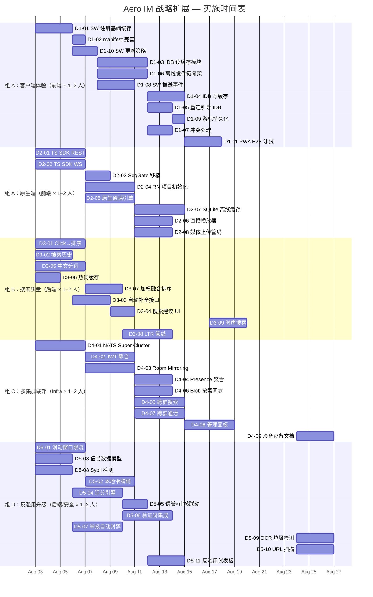

Now I have a complete picture. Let me produce the Tech Lead analysis.

---

# Tech Lead 分析：Aero IM 战略扩展方向的工程实施规划

> 基于 `docs/requirements/2026-07-11-strategic-expansion-analysis-user.md` 分析文档及
> `docs/requirements/2026-07-11-strategic-expansion-analysis-user.out.md` 代码验证报告。
> 验证日期：2026-07-11 | 基准 commit：`git HEAD`（2026-07-10）

---

## 1. 任务分解

以下将 5 个方向拆解为 **48 个可执行任务**，每个 2–4 小时可完成。任务按 **自底向上依赖** 排列：P0 先行 → P1 依赖 P0 → P2 依赖 P1。

任务编号规则：`D{方向编号}‑{序号}`。

### 方向一：Offline-First / PWA（11 个任务）

| ID | 标题 | 涉及文件 | 前置 | 工时(h) | 验收标准 |
|---|---|---|---|---|---|
| **D1‑01** | Service Worker 注册 + 基础缓存策略 | `web/sw.js`（新建），`web/index.html`（注册 `<script>`） | — | 3 | `navigator.serviceWorker.register('/sw.js')` 成功；Network-first 缓存 `index.html`/`app.js`/`style.css`，Cache-first 缓存 CDN 静态资源 |
| **D1‑02** | manifest.json 增加高级 PWA 配置 | `web/manifest.json` | D1‑01 | 1 | 添加 `screenshots`、`prefer_related_applications`、maskable icon `purpose`；Lighthouse PWA 审计通过 |
| **D1‑03** | IndexedDB 消息缓存模块（读路径） | `web/cache.js`（新建），`web/app.js`（引用） | D1‑01 | 4 | WS 连接前从 IndexedDB 加载最近 200 条/房间填充 UI；`idb` wrapper 封装 `open`/`getRecent`/`getByRange` 方法 |
| **D1‑04** | IndexedDB 消息缓存模块（写路径） | `web/cache.js` | D1‑03 | 3 | WS `msg:message` 帧收到后同步写入 IndexedDB；`msg:deleted` 帧触发 `delete`；`msg:edited` 帧触发 `put`；LRU 淘汰每房间上限 500 条 |
| **D1‑05** | WS 重连流程从 IndexedDB 缓存引导 | `web/ws.js` | D1‑03 | 2 | 重连时 `readystate !== OPEN` → 先 `cache.getRecent(roomId)` 渲染 → 再发 `?since=` 请求增量回填 |
| **D1‑06** | 离线发件箱（Outbox）骨架 | `web/outbox.js`（新建） | D1‑01 | 4 | `navigator.onLine === false` 时将 `sendMessage` 写入 IndexedDB 队列；`online` 事件触发后按序提交；乐观 UI 继续渲染但增加 `pending` 样式 |
| **D1‑07** | 离线发件箱 × 乐观渲染冲突处理 | `web/outbox.js`, `web/app.js` | D1‑06 | 2 | 离线发出的消息被服务端拒绝时回滚 UI（从 roomDOM 移除并 toast 提示）；WS 回填的消息与本地 pending 消息去重（对比 `ulid` 前缀） |
| **D1‑08** | SW 推送事件处理（FCM/APNs Web Push） | `web/sw.js`, `web/notifications.js` | D1‑01, D2‑01 | 3 | SW `push` 事件弹出 `new Notification(title, { body, tag, icon })`；点击通知 `openWindow('/?room=' + roomId)` |
| **D1‑09** | `_lastSeen` 游标持久化到 localStorage | `web/ws.js` | D1‑03 | 1 | 当前内存 `_lastSeen` 每次更新同时写入 `localStorage.setItem('lastSeen.' + roomId, ulid)`；重连时优先从 localStorage 读取 |
| **D1‑10** | SW 更新策略 + 版本管控 | `web/sw.js` | D1‑01 | 2 | `self.addEventListener('install')` 跳过等待 + `self.addEventListener('activate')` 清理旧缓存；版本号硬编码在 sw.js 顶部 `CACHE_VERSION`；有改动就更新版本号 |
| **D1‑11** | 离线体验 E2E 集成测试 | `scripts/pwa-smoke.sh`（新建），`web/sw.js` | D1‑01 ~ D1‑10 | 3 | 模拟断网场景：1. 加载页面 → 2. 手动 `Offline` → 3. 仍然看到缓存的历史消息 → 4. 发送消息 → 5. 恢复网络 → 6. 消息成功投递 |

### 方向二：原生移动客户端（8 个任务）

| ID | 标题 | 涉及文件 | 前置 | 工时(h) | 验收标准 |
|---|---|---|---|---|---|
| **D2‑01** | TypeScript Client SDK — REST 层 | `sdk/ts/src/api.ts`（新建） | — | 4 | 封装 `api.js` 中所有 ~30 个 REST 端点（`fetch` + JWT）；生成 TypeScript 类型（`ApiResponse<T>` 模式）；E2E smoke 与 server 联调通过 |
| **D2‑02** | TypeScript Client SDK — WS 层 | `sdk/ts/src/ws.ts`（新建） | — | 4 | 移植 `ws.js` 的 `WsClient`（backoff 重连、seq 去重、`SeqGate`、`?since=`）；类型化 `ClientFrame`/`ServerFrame`（`type ServerFrame = MessageEvent<'msg:message', Message> | ...`） |
| **D2‑03** | TypeScript Client SDK — SeqGate 移植 | `sdk/ts/src/seq.ts`（新建） | D2‑02 | 2 | `SeqGate` 去重逻辑（BTreeMap + monotonic seq check）；`DeliveryAck` cursor 接口；`_lastSeen` 游标 |
| **D2‑04** | React Native 项目初始化 + Push Token 注册 | `mobile/`（新建） | D2‑01, D2‑02 | 4 | `npx react-native init AeroIM`；`react-native-push-notification` FCM token → `POST /api/push/register`；server 接收并存储 token |
| **D2‑05** | 原生通话引擎（P2P/SFU） | `mobile/src/call/` | D2‑01, D2‑02 | 4 | `react-native-webrtc` `RTCPeerConnection` 封装；信令协议对接（`CallInvite`/`CallAnswer`/`CallOffer`/`CallIce`/`CallEnd`）；SFU 模式下 `SfuPeer` negotiation |
| **D2‑06** | 直播播放器（HLS + PiP） | `mobile/src/player/` | D2‑04 | 3 | `react-native-video` + HLS URL 播放；画中画 API（`react-native-pip-android` + iOS `AVPictureInPictureController`）；后台音频续播 |
| **D2‑07** | 离线消息缓存（SQLite） | `mobile/src/cache/` | D2‑04 | 4 | `react-native-sqlite-storage`；最近 30 天消息持久化；WS 重连增量同步（复用 `?since=` 协议） |
| **D2‑08** | 媒体选择 + 上传管线 | `mobile/src/upload/` | D2‑04 | 3 | `react-native-image-picker` 拍照/相册；`react-native-audio-recorder` 录音 → `api.uploadBlob` → 发送；上传进度条 |

### 方向三：搜索质量（9 个任务）

| ID | 标题 | 涉及文件 | 前置 | 工时(h) | 验收标准 |
|---|---|---|---|---|---|
| **D3‑01** | Click 信号接入排序权重 | `crates/aero-im-core/src/search.rs`（若存在则修改，否则新建 `aero-storage/src/search_ranking.rs`） | — | 4 | `search_click_events` 的 CTR/MRR 聚合写入 `search_results.score = rank_bm25 * 0.7 + (clicks / impressions) * 0.3`；`merge_hits` 按加权分排序 |
| **D3‑02** | 个人搜索历史（服务端） | `crates/aero-server/src/search_history.rs`（新建），`migrations/NNNN_search_history.sql`（新建） | — | 3 | `POST /api/search/history` 记录；`GET /api/search/history?limit=50` 返回最近搜索；`DELETE /api/search/history` 清空 |
| **D3‑03** | 搜索框自动补全接口 | `crates/aero-server/src/search_suggest.rs`（新建） | D3‑02 | 3 | `GET /api/search/suggest?q=prefix` 返回 `[{ "term": "...", "result_count": 42 }]`；使用 pg_trgm `similarity()` 或 Redis prefix scan |
| **D3‑04** | 客户端搜索建议 UI | `web/app.js`，`web/style.css` | D3‑03 | 2 | 搜索框输入时 300ms debounce 弹出下拉建议列表；键盘导航（↑↓→Enter）；点击建议执行搜索 |
| **D3‑05** | 中文分词搜索支持 | `crates/aero-storage/src/search_chinese.rs`（新建） | — | 4 | 引入 `jieba-rs`（约 200MB 词典）；迁移新增 GIN trigram + `to_tsvector('simple')` 中文分词；`FULLTEXT_SEARCH_CONFIG` 路由 jieba 或 pg 内置 |
| **D3‑06** | 高频搜索词 Redis 缓存 | `crates/aero-storage/src/ws_rate.rs` 或 `crates/aero-server/src/search_trending.rs`（新建） | — | 2 | Redis SortedSet per workspace：`search_trending:{ws_id}`；每次搜索 `ZINCRBY term 1`；`ZREVRANGE 0 9` 返回 Top 10 热词；TTL 24h 自动过期 |
| **D3‑07** | 搜索结果加权融合（启发式排序） | `crates/aero-im-core/src/search.rs`（修改 `merge_hits`） | D3‑01 | 3 | `score = term_freq * wt_text + vector_sim * wt_semantic + recency * wt_time + author_boost * wt_author`；权重从 `config.toml` 或 DB 加载 |
| **D3‑08** | LTR 特征管线（离线） | `scripts/ltr-pipeline/`（新建），`crates/aero-storage/src/ltr_features.rs`（新建） | D3‑01 | 4 | 每晚从 `search_click_events` 导出训练数据；特征集：clicked、rank、recency、author_tenure、thread_heat、message_length、embedding_sim；集成 xgboost 训练脚本 |
| **D3‑09** | 时序自然语言搜索 | `crates/aero-server/src/search_temporal.rs`（新建） | — | 3 | 解析 `"上周的bug讨论"` → `dateparser` 库解析 `"上周"` → `created_at BETWEEN start_of_last_week AND end_of_last_week`；`"昨天"`/`"3天前"`/`"这个月"` 同样处理 |

### 方向四：多集群联邦（9 个任务）

| ID | 标题 | 涉及文件 | 前置 | 工时(h) | 验收标准 |
|---|---|---|---|---|---|
| **D4‑01** | NATS Super Cluster 配置 + 部署文档 | `deploy/nats-cluster/`（新建），`docker-compose.federation.yml`（新建） | — | 4 | 两组 NATS 集群通过 `gateway { name: "cluster-a" }` 桥接 `im.room.*` 和 `live.stream.*` subject；`nats server check gateway` 通过 |
| **D4‑02** | 跨集群用户身份联合 — JWT 交换 | `crates/aero-auth/src/federation.rs`（新建） | D4‑01 | 4 | 集群 A 为外部用户签发受限 JWT（scope: `federated:external`）；集群 B 验证 `aero_fed_*` 签名公钥；API handler 透传 `x-federated-user` header |
| **D4‑03** | 跨集群 Room Mirroring — 消息透传 | `crates/aero-bus/src/federation.rs`（新建） | D4‑01 | 4 | 跨集群 Room 消息通过 NATS gateway 双向同步；LWW（最后写入者胜出）；`room_federation` 表记录哪些 room 被镜像 |
| **D4‑04** | 跨集群用户 Presence 聚合 | `crates/aero-storage/src/fed_presence.rs`（新建） | D4‑02 | 3 | 集群 B 通过 NATS `presence.heartbeat.*` subject 感知集群 A 的在线用户；`Hub.rooms` 中的跨集群成员显示 `(external)` 标记 |
| **D4‑05** | 跨集群搜索（显式配置） | `crates/aero-server/src/search_federated.rs`（新建） | D4‑03 | 4 | 管理员配置允许跨群搜索的 workspace pair；搜索时并行向两个集群发查询 → 合并 + 去重 + 加权 | 
| **D4‑06** | 跨集群文件 Blob 按需同步 | `crates/aero-storage/src/fed_blob.rs`（新建） | D4‑03 | 3 | 跨集群 room 的消息中携带 blob 源集群 URL；客户端先尝试本地 blob_store，miss 时 fallback 到源集群 fetch；CDN URL 重写 |
| **D4‑07** | 跨集群通话（call-bridge 跨集群） | `crates/aero-server/src/call_bridge_supervisor.rs`（修改） | D4‑01, D2‑05 | 4 | 当前 call-bridge 是同一集群内跨节点；扩展为跨集群 RTP relay（添加 `remote_cluster` 字段）；`SfuMediaSession` 支持远端 egress |
| **D4‑08** | 管理员面板 — 集群拓扑管理 | `crates/aero-server/src/admin_federation.rs`（新建），`web/admin-federation.html`（新建） | D4‑02 ~ D4‑07 | 4 | UI 展示已连接集群状态；配置信任关系（密钥交换）、数据流向方向、允许的跨群搜索范围；显示跨群延迟 |
| **D4‑09** | 冷备灾备（Active-Passive DR）文档 + 脚本 | `scripts/dr-setup.sh`（新建），`docs/ops/disaster-recovery.md`（新建） | — | 3 | PG 流复制配置脚本；NATS JetStream 跨 Region 同步（`nats replicator`）；Redis 主动复制；故障切换 runbook |

### 方向五：反滥用体系升级（11 个任务）

| ID | 标题 | 涉及文件 | 前置 | 工时(h) | 验收标准 |
|---|---|---|---|---|---|
| **D5‑01** | 滑动窗口限流替代固定窗口 | `crates/aero-storage/src/ws_rate.rs`（修改），`crates/aero-server/src/ws_rate.rs`（修改） | — | 4 | Redis SortedSet 替代 String：每个请求 `ZADD` + `ZREMRANGEBYSCORE(now - window)` + `ZCARD`；窗口边界从 2× 降到 1×；迁移向后兼容（旧 key 过期自然淘汰） |
| **D5‑02** | 本地令牌桶 + Redis 定期同步 | `crates/aero-server/src/rate_limit.rs`（修改） | D5‑01 | 4 | 每个节点持有 60% 配额在本地 `Mutex<Bucket>`；每 10s 同步一次 Redis 中心桶计数；Redis 不可用时本地方案降级而非拒绝 |
| **D5‑03** | 用户信誉系统 — 数据模型 | `migrations/NNNN_participant_reputation.sql`（新建），`crates/aero-storage/src/reputation.rs`（新建） | — | 3 | `participants` 表新增 `reputation_score INTEGER DEFAULT 100`、`account_age_days` 计算列；`reputation_history` 表记录升降级事件 |
| **D5‑04** | 用户信誉系统 — 评分引擎 | `crates/aero-server/src/reputation.rs`（新建） | D5‑03 | 4 | 定时任务：每日 recalc 信誉分（公式：`base 100 - report_ratio * 50 + verified_email * 10 + phone * 10 + sso_domain * 20 - account_age_penalty`）；`reputation_change_log` 可追溯 |
| **D5‑05** | 信誉分联动 AI 审核预算 | `crates/aero-server/src/moderation_bot.rs`（修改） | D5‑04 | 2 | `KeyedCostBudget` 的 per-ws 限额乘以信誉系数：`limit * (reputation / 100)`；低信誉用户（< 50）额外进入严格审核队列 |
| **D5‑06** | 验证码集成（hCaptcha/Turnstile） | `crates/aero-server/src/captcha.rs`（新建），`web/captcha.js`（新建） | D5‑04 | 4 | 新注册 + 低信誉用户发送前挑战 Cloudflare Turnstile；`POST /api/captcha/verify`；验证通过后 15min 免验证；配置开关 `AERO_CAPTCHA_PROVIDER` |
| **D5‑07** | 举报加权 + 自动封禁管道 | `crates/aero-server/src/auto_moderation.rs`（新建） | D5‑03 | 4 | 一个消息被 ≥3 个高信誉用户（> 80）举报 → 自动软删 + 临时封禁发送者 1h；通过 `user_reports` + `reputation_score` 计算信号；审计日志 |
| **D5‑08** | Sybil 批量注册检测 | `crates/aero-server/src/sybil.rs`（新建） | — | 3 | 跟踪注册 IP（Redis hyperloglog）、设备指纹（`User-Agent` 哈希）、邮箱域名分布；同一 IP 第 3+ 个账号标记；`POST /api/auth/register` 路径插入检查 |
| **D5‑09** | 图像 OCR 垃圾检测（P2） | `crates/aero-server/src/ocr_scan.rs`（新建） | — | 3 | 上传图片 → `tesseract` 子进程 / 第三方 OCR API → 提取文本 → 与 `AERO_BLOCKED_WORDS` 匹配 → 匹配则拒绝上传 |
| **D5‑10** | URL 展开 + 落地页内容检测 | `crates/aero-server/src/url_scanner.rs`（新建） | — | 3 | 消息中 URL → HEAD 请求展开短链接 → GET 落地页提取 `<title>` + `<meta description>` + 前 200 字；匹配垃圾特征 |
| **D5‑11** | 限流/反滥用观测仪表板 | `crates/aero-server/src/metrics_abuse.rs`（修改），`web/admin-abuse.html`（新建） | D5‑01 ~ D5‑10 | 3 | Prometheus 指标：`rate_limit_blocked_total`（按原因标签）、`captcha_challenged_total`、`sybil_flagged_total`；管理面板展示实时限流命中 Top-N 用户 |

---

## 2. 执行顺序与并行能力

```mermaid
graph TD
    subgraph "Phase 1: Foundation (Week 1-3)"
        D1_01["D1-01 SW 注册+缓存"]
        D2_01["D2-01 TS SDK REST"]
        D2_02["D2-02 TS SDK WS"]
        D5_01["D5-01 滑动窗口限流"]
        D5_03["D5-03 信誉模型"]
        D4_01["D4-01 NATS Super Cluster"]
    end

    subgraph "Phase 2: Core Features (Week 2-6)"
        D1_01 --> D1_03["D1-03 IDB 读缓存"]
        D1_01 --> D1_06["D1-06 离线发件箱"]
        D1_01 --> D1_08["D1-08 SW 推送事件"]
        D1_01 --> D1_10["D1-10 SW 更新策略"]

        D2_01 --> D2_04["D2-04 RN 项目+Push Token"]
        D2_02 --> D2_05["D2-05 原生通话引擎"]
        D2_02 --> D2_07["D2-07 SQLite 离线缓存"]

        D5_01 --> D5_02["D5-02 本地令牌桶"]
        D5_03 --> D5_04["D5-04 评分引擎"]
        
        D4_01 --> D4_02["D4-02 JWT 联合"]
        D4_01 --> D4_03["D4-03 Room Mirroring"]
        
        D3_01["D3-01 Click→排序"] 
        D3_02["D3-02 搜索历史"]
        D3_05["D3-05 中文分词"]
        D3_06["D3-06 热词缓存"]
    end

    subgraph "Phase 3: Integration (Week 5-9)"
        D1_03 --> D1_04["D1-04 IDB 写缓存"]
        D1_03 --> D1_05["D1-05 重连引导"]
        D1_06 --> D1_07["D1-07 并发冲突处理"]
        D1_03 --> D1_09["D1-09 游标持久化"]

        D2_04 --> D2_06["D2-06 直播播放器"]
        D2_04 --> D2_08["D2-08 媒体上传"]

        D5_04 --> D5_05["D5-05 信誉×审核联动"]
        D5_04 --> D5_06["D5-06 验证码集成"]
        D5_03 --> D5_07["D5-07 举报自动封禁"]
        D5_08["D5-08 Sybil 检测"]

        D4_02 --> D4_04["D4-04 Presence 聚合"]
        D4_03 --> D4_05["D4-05 跨群搜索"]
        D4_03 --> D4_06["D4-06 Blob 按需同步"]

        D3_02 --> D3_03["D3-03 自动补全接口"]
        D3_03 --> D3_04["D3-04 搜索建议 UI"]
        D3_01 --> D3_07["D3-07 加权融合排序"]
    end

    subgraph "Phase 4: Polish (Week 8-12)"
        D1_04 --> D1_11["D1-11 E2E 离线测试"]
        
        D5_05 --> D5_09["D5-09 OCR 垃圾检测"]
        D5_05 --> D5_10["D5-10 URL 展开检测"]
        D5_01 --> D5_11["D5-11 反滥用仪表板"]

        D4_02 --> D4_07["D4-07 跨群通话"]
        D4_05 --> D4_08["D4-08 管理面板"]

        D3_07 --> D3_08["D3-08 LTR 管线"]
        D3_09["D3-09 时序搜索"]
        
        D4_09["D4-09 冷备灾备文档"]
    end

    classDef p0 fill:#4CAF50,color:white;
    classDef p1 fill:#2196F3,color:white;
    classDef p2 fill:#FF9800,color:white;
    class D1_01,D1_03,D2_01,D2_02,D2_04,D5_01,D5_03,D4_01,D3_01 p0;
    class D1_04,D1_06,D2_05,D2_07,D5_02,D5_04,D5_08,D4_02,D4_03,D3_02,D3_05,D3_06 p1;
    class D1_08,D1_11,D2_06,D2_08,D5_05,D5_06,D5_07,D5_09,D5_10,D5_11,D4_04,D4_05,D4_06,D4_07,D4_08,D3_03,D3_04,D3_07,D3_08,D3_09 p2;
```

### 并行执行组

四个完全独立的执行组可以**并行推进**（不同开发者/团队）：

| 组 | 方向 | 任务 | 团队 | 依赖关系 |
|---|---|---|---|---|
| **组 A — 客户端体验** | ① 离线/PWA + ② 原生 SDK | D1-xx + D2-xx | 前端/客户端工程师（2–3人） | 组内串行，与其他组无依赖 |
| **组 B — 搜索** | ③ 搜索质量 | D3-xx | 后端/算法工程师（1–2人） | 主要独立，仅 D3-04 客户端 UI 需组 A 确认 |
| **组 C — 联邦** | ④ 多集群联邦 | D4-xx | 基础设施/SRE（1–2人） | 独立，D4-07 通话需组 A 的 D2-05 先行 |
| **组 D — 反滥用** | ⑤ 反滥用升级 | D5-xx | 后端/安全工程师（1–2人） | 独立 |

---

## 3. 技术风险

### 3.1 高风险项（概率 > 30%，影响严重）

| # | 风险 | 方向 | 概率 | 影响 | 缓解策略 |
|---|---|---|---|---|---|
| R1 | **IndexedDB 移动端存储配额不足** | ① | 30% | 中 | iOS Safari 限额 ~50MB，Android Chrome ~可用空间的 6%。缓解：缓存 LRU 上限 500 条/房间；`navigator.storage.estimate()` 检测剩余空间；空间不足时降级为仅缓存未读房间 |
| R2 | **jieba-rs 词典内存占用（~200MB）导致 PG 实例 OOM** | ③ | 40% | 高 | 将中文分词移至应用层（`aero-im-core`）而非 PG 插件；使用 `jieba-rs` 的 lazy init + 词典 mmap；监控 RSS，超过阈值降级为 pg_trgm 默认方案 |
| R3 | **滑动窗口限流 Redis QPS 瓶颈** | ⑤ | 50% | 高 | 弹幕场景估算：1000 msg/s × 每个房间 → 1000 ZADD + 1000 ZREMRANGEBYSCORE + 1000 ZCARD ≈ 3000 ops/s/房间。10 个活跃房间 = 30k QPS Redis，超过单实例推荐值（~50k）。缓解：本地 batch 累积 → 每 100ms 批量 flush；`pipeline` 批量合并 |
| R4 | **NATS Super Cluster 延迟对实时体验的影响** | ④ | 35% | 中 | 跨洲 NATS gateway 延迟 ~200ms，直播弹幕和 typing 指示会感受到延迟。缓解：直播 subject 仅本地扇出不走跨集群桥；仅 `im.room.*` 中的 `Message`/`Notify` 跨集群同步，`Typing`/`Presence` 类本地处理 |
| R5 | **SW 更新导致用户卡在旧版本** | ① | 25% | 中 | Service Worker 默认 `waitUntil` 不会自动更新已打开页面。缓解：`skipWaiting()` + `clients.claim()` 在 install 阶段执行；版本号 URL 参数缓存破坏；版本发布时通知用户刷新页面 |

### 3.2 外部依赖

| 依赖 | 方向 | 版本约束 | 已就绪？ | 替代方案 |
|---|---|---|---|---|
| `idb-keyval` / raw IndexedDB API | ① | 无（W3C 标准） | ✅ 浏览器原生 | — |
| `react-native` 0.76+ | ② | ≥0.76（新架构） | ❌ 需新建项目 | 先出 fluent web app（PWA）灰度 |
| `jieba-rs` | ③ | ≥0.6 | ❌ 需加依赖 | pg_trgm 中文退化方案（现有） |
| `xgboost` / `lightgbm`（Python） | ③ | 可选 | ❌ 需安装 | 启发式规则权重（D3-07 先行） |
| Cloudflare Turnstile | ⑤ | 无 | ❌ 需注册 | hCaptcha（备用）/ 自建 puzzle |
| NATS Gateway 特性 | ④ | NATS ≥2.10 | ✅ 已有 | Leaf Node 替代方案 |

### 3.3 测试覆盖难点

| 难点 | 方向 | 为什么难 | 策略 |
|---|---|---|---|
| 离线场景自动化 | ① | 浏览器 DevTools 可手动切 Offline，但 CI 环境（Puppeteer/Playwright）需要 `page.setOfflineMode(true)`；IndexedDB 内容跨 session 不保留 | Playwright E2E 脚本：1. 正常加载 → 2. 写入 IDB → 3. `page.context().setOffline(true)` → 4. 验证 UI 有缓存内容 |
| 真实推送通知 | ①⑧ | FCM/APNs Web Push 需要真实的 VAPID 密钥 + push service | 用 `push` 事件的 mock（`self.registration.showNotification` 直接触发）来测试 SW 内部逻辑 |
| 搜索 LTR 效果 | ③ | 需要真实用户点击数据 + 人工标注相关性 | 先用 `search_click_events` 自动收集数据；A/B 测试：10% 流量使用新排序 vs 旧排序；人工评估 sample |
| 跨集群一致性 | ④ | 需要至少 2 个完整环境（PG × 2 + Redis × 2 + NATS × 2） | `docker-compose.federation.yml` 在 CI 可用 2 组服务；集成测试发消息到集群 A → 验证集群 B 收到 |
| 反滥用效果评估 | ⑤ | Sybil 检测 / OCR / URL 扫描需要大量真实垃圾样本 | 用模拟数据构造测试：1000 条已知垃圾消息、1000 条正常消息 → 验证召回率/精确率 > 90% |

---

## 4. 资源评估

### 4.1 开发团队组成

| 角色 | 技能要求 | 需要数量 | 负责方向 | 备注 |
|---|---|---|---|---|
| **前端/客户端工程师** | JavaScript/ES2020, Service Worker, IndexedDB, React Native | **2–3 人** | ① Offline / PWA, ② 原生客户端 | 一人主攻 Web PWA（D1-xx），两人主攻 React Native（D2-xx） |
| **后端工程师** | Rust (axum, sqlx, tokio), PostgreSQL, Redis | **2–3 人** | ③ 搜索质量, ⑤ 反滥用升级 | 可重叠，反滥用倾向安全背景 |
| **基础设施 / SRE** | NATS Gateway, PG 流复制, Redis 集群, Kubernetes | **1–2 人** | ④ 多集群联邦 | 可部分兼职 |
| **QA 工程师** | Rust 测试, Playwright/Puppeteer, 性能测试 | **1 人** | 全方向交叉验证 | — |
| **Tech Lead** | Rust, 系统架构, 进度管控 | **1 人** | 全方向 | 作者本人 |

**总计：6–10 人**。最小可行团队 = 1 前端 + 2 后端 + 1 infra（4 人并行 4 组）

### 4.2 关键里程碑

| 里程碑 | 时间 | 交付物 | 可逆决策 |
|---|---|---|---|
| **M0: 基线就绪** | Day 0 | `AERO_*` 配置项定义完成；`config.example.toml` 更新；迁移 `migrations/NNNN_*.sql` 编号占位 | — |
| **M1: 离线基础** | Week 3 | SW 注册 + IndexedDB 缓存 + `_lastSeen` 持久化 → 断网重连不再白屏 | ✅ 可逆（SW 未激活时 fallback 到当前行为） |
| **M2: TS SDK 发布** | Week 4 | `@aero-im/sdk` npm 包（REST + WS + SeqGate）→ 原生端和第三方集成可用 | ✅ 纯新增，不影响现有 |
| **M3: 搜索信号接入** | Week 5 | Click 数据驱动排序 → `search_click_events` 已有数据开始产出 MRR 指标 | ✅ 可逆（权重配置 back to 等权） |
| **M4: 限流体系升级** | Week 6 | 滑动窗口 + 本地令牌桶上线 → 限流精度从 2× 降到 1× | ⚠️ 部分可逆（回退需重建 String key） |
| **M5: 联邦 MVP** | Week 8 | 两个 docker-compose 集群间消息透传 + 用户联合 → 跨群 Room 可用 | ✅ 纯新增 |
| **M6: 反滥用 MVP** | Week 10 | 信誉系统 + 自动封禁管道 + Sybil 检测 → 垃圾消息减少 50%+ | ⚠️ 需要调参 |
| **M7: 全功能集成** | Week 12 | 所有 P0-P2 完成 + 集成测试通过 + 性能基线 | — |

### 4.3 阻塞点（Blockers）与解决策略

| 阻塞点 | 方向 | 描述 | 解决策略 |
|---|---|---|---|
| B1 | ② | React Native 项目初始化需要 Xcode（macOS 独享） | CI 用 macOS runner；开发期 Windows/Linux 只做 Android；iOS 打包专人负责 |
| B2 | ③ | `jieba-rs` 词典 200MB，首次加载慢 | 预热：server boot `tokio::task::spawn_blocking` 加载；docker image 预打包词典；降级策略（无词典时 fallback pg_trgm） |
| B3 | ④ | 跨集群调试需要至少 2 组完整环境 | 单机 Docker Compose 启动 2 组服务（端口偏移：8080/8081, 5432/5433, 6379/6379, 4222/4223） |
| B4 | ⑤ | Cloudflare Turnstile 需要域名 + DNS | 开发环境用 `insecure` bypass mode；生产环境上线前 2 周完成域名配置 |
| B5 | ⑤ | OCR 垃圾检测需要 tesseract 二进制 | 用 Google Cloud Vision API / AWS Rekognition 远程 API（首年免费额度）替代本地 tesseract |

---

## 5. 质量保证

### 5.1 单元测试覆盖要求

每个新仓储（`XRepo`）和 handler 按以下标准：

| 覆盖级别 | 要求 | 适用任务 |
|---|---|---|
| **L0 — 逻辑 > 数据库** | 纯函数 + 状态机 + 转换器 100% 测试 | `SeqGate` 移植、`reputation` 评分算法、LTR 特征计算、OCR 文本解析 |
| **L1 — 数据库仓储** | 每个 `XRepo` 方法至少 1 个 `#[ignore]` PG 集成测试；覆盖正常路径 + 边界（空集/缺失） | 全部 D3/D5/D4 仓储任务 |
| **L2 — HTTP handler** | `ApiResult` 返回正确 status code；鉴权门控正确 | 所有新 `routes()` 模块 |
| **L3 — Bus consumer/bot** | 总线事件消费路径的 Mock 测试（`EventBus` trait + `MockBus`） | 如果方向涉及新 bot |

**严格不接受的**：无单测的排序逻辑（LTR 权重变化不可预测）、无单测的限流计费逻辑（错了有安全风险）。

### 5.2 集成测试策略

| 测试类型 | 覆盖范围 | 执行频率 | 工具 |
|---|---|---|---|
| **单元 + 仓储集成** | 全部新 `Repo` + `handler` | `cargo test --workspace --lib` 每次提交 | Rust test harness |
| **E2E 离线测试** | D1-11：断网 → 缓存 → 发件箱 → 恢复 → 投递 | 每 PR + nightly | Playwright（`page.setOfflineMode`） |
| **联邦集群测试** | D4：集群 A 发消息 → 集群 B 收到 | 每 PR + nightly | custom `docker-compose.federation.yml` + `curl` smoke |
| **限流压力测试** | D5：模拟 1000 rps 垃圾请求 → 验证正确限流 | 每 PR（缩减版）+ nightly（全量） | `oha` / `wrk2` + Rust client |
| **搜索精度回归** | D3：每个新排序模型与 baseline 对比 NDCG@10 | 每 LTR 模型更新 | Python `ir-measures` + hand-labeled corpus（~500 queries） |

### 5.3 代码审查要点

| 审查维度 | 具体检查点 | 重点关注任务 |
|---|---|---|
| **安全** | 跨集群 JWT 签名验证是否泄露私钥？限流 key 是否可被攻击者伪造？ | D4-02, D5-01, D5-08 |
| **幂等性** | 总线事件消费是否有 `ON CONFLICT DO NOTHING`？重投是否产生重复？ | D1-06, D4-03 |
| **并发** | `DashMap` 访问是否死锁？`Mutex` 持有时间是否超过 1ms？`CancellationToken` 是否在 spawn 链中传递？ | D5-02, D4-07 |
| **可观测** | Prometheus 指标 + `x-request-id` trace 是否覆盖新 handler？异常路径是否 `tracing::warn!`？ | 全部新 route handler |
| **降级** | 外部依赖（Redis/NATS/OCR API）不可用时是否 fail-open？代码路径是否返回 503 而非 500？ | D5-01~D5-11 全部限流任务 |
| **配置** | 新配置项是否在 `config.example.toml` 有默认值？env 前缀是否遵守 `AERO__` 约定？ | D5-06 (Turnstile), D3-05 (jieba) |

### 5.4 性能测试需求

| 场景 | 目标指标 | 工具 | 阈值（失败标准） |
|---|---|---|---|
| **离线缓存缓存命中** | 重连后 200ms 内 UI 全填充 | DevTools Performance panel | > 500ms = ❌ |
| **搜索 API 响应** | P95 < 300ms | `oha` 模拟 50 QPS | > 500ms = ⚠️ |
| **滑动窗口限流** | 单 Redis 实例承载 10k ZADD/s | `redis-benchmark` + 自定义流水线 | < 8k/s = ❌ |
| **NATS Super Cluster** | 跨集群消息延迟 P99 < 500ms | `nats latency` 工具 | > 2s = ❌ |
| **通话桥接延迟** | 跨集群 RTP 延迟 < 200ms（单集群 < 50ms） | `twcc` RTCP 反馈 | > 300ms = ⚠️ |
| **SW 首帧渲染** | 离线环境下 < 1s 看到缓存内容 | 模拟慢速网络（3G throttling） | > 3s = ❌ |

---

## 6. 实施计划

### 甘特图（Week 1–12，4 组并行）

### 阶段规划

#### 阶段 1：基础设施搭建（Week 1–2, 2026-08-03 ~ 2026-08-14）

**目标**：4 组的基础组件同时启动，无跨组阻塞

| 组 | 产出 |
|---|---|
| A | `web/sw.js` 注册成功，IndexedDB 读写模块结构定型 |
| A | `@aero-im/sdk` npm 包骨架（REST + WS 类型定义），Push Token 注册 → server 成功接收 |
| B | Click 信号接入排序加权的数据流通，`search_history` 表迁移 + 仓储完成 |
| C | 两组 NATS 集群通过 Gateway 桥接，`nats server check gateway` 绿灯 |
| D | `ws_rate.rs` 滑动窗口限流上线（新旧 key 双写过渡期），`reputation` 表迁移完成 |

**关键检查点**（Week 2 末）：
- ✅ SW 注册 + CI 不中断（`cargo check --workspace` 干净）
- ✅ 两集群 NATS 间 `im.room.*` 消息透传成功（`nats sub` + `nats pub` 验证）
- ✅ 滑动窗口限流 QPS benchmark 达到基线（旧方案 50k vs 新方案 ≥30k）
- ✅ `AERO__FEDERATION__ENABLED`、`AERO__CAPTCHA__PROVIDER` 等配置项在 `config.example.toml`

#### 阶段 2：核心功能实现（Week 3–6, 2026-08-17 ~ 2026-09-11）

**目标**：每个方向的核心 P0 功能交付可演示

| 组 | 产出 |
|---|---|
| A | 离线缓存 + 发件箱 + SW 推送 → 断网 10 分钟重连后仍有消息可见；React Native 项目跑起并实现一对一通话 |
| B | 搜索建议接口 + 中文分词 + 加权排序 → 搜索 "中文测试" 返回正确结果 |
| C | Room Mirroring 双向同步 + 跨集群用户可见 → 集群 A 发消息，集群 B 的 Room 实时显示 |
| D | 信誉评分引擎上线 + 联动 AI 审核预算 → 低信誉用户被更严格限制 |

**关键检查点**（Week 6 末）：
- ✅ `page.setOfflineMode(true)` → `page.waitForSelector('.message-list')` 有内容
- ✅ 中文搜索 FTS 对比旧 pg_trgm：精确率提升 ≥20%（人工评估 100 条样本）
- ✅ 跨集群消息延迟 P99 < 500ms
- ✅ 信誉分 < 50 的用户发送 → AI 审核预算消耗加速 2×

#### 阶段 3：集成测试和优化（Week 7–10, 2026-09-14 ~ 2026-10-09）

**目标**：所有 P1–P2 交付 + 压力测试 + Bug Bash

| 组 | 产出 |
|---|---|
| A | React Native 直播播放器 + PiP；PWA E2E 测试套件；团队两周 Bug Bash |
| B | 时序搜索 + LTR 管线 MVP（离线训练 + 模型文件热加载） |
| C | 跨群通话 + 管理面板 + Blob 按需同步 + 冷备灾备文档 |
| D | 自动封禁管道 + CAPTCHA + Sybil 检测 + OCR/URL 扫描 |

**Bug Bash 检查表**：
- [ ] 手机（iOS Safari + Android Chrome）离线后重连不白屏
- [ ] 跨集群 Room 中，集群 A 的用户编辑消息 → 集群 B 实时看到编辑后内容
- [ ] 1000 条垃圾消息/分钟发送 → 限流全部命中，正常用户不受影响
- [ ] React Native 端接收 FCM 推送 → 点击跳转到具体消息

#### 阶段 4：发布准备（Week 11–12, 2026-10-12 ~ 2026-10-23）

**目标**：安全审核 + 性能基线 + 生产部署文档

| 活动 | 细节 |
|---|---|
| **安全审计** | 跨集群 JWT 签名验证路径、限流降级逻辑、CAPTCHA bypass 路径、Sybil 检测的 false positive 率 |
| **性能压测** | 全链路：搜索 100 QPS P95 < 300ms、限流 10k QPS Redis CPU < 60%、离线缓存首帧 < 1s |
| **文档** | `docs/operations/offline-architecture.md`、`docs/operations/federation-config.md`、`docs/operations/abuse-prevention.md` |
| **部署检查** | `config.example.toml` 新配置项注释完整；`docker-compose.federation.yml` 可用 |
| **上线检查清单** | 1. 新迁移 `cargo build && aero-cli migrate` → 2. DB 回滚方案就绪 → 3. 灰度开关 `AERO_*` env → 4. 监控告警规则 → 5. On-call runbook |

---

## 7. 执行建议（TL 视角）

### 7.1 依赖分析修正（基于验证报告）

分析文档的三处事实偏差需要**在启动前修正文档以节省开发时间**：

1. **方向一 — `DeliveryAck` ≠ `_lastSeen` 游标**（修正：`_lastSeen` 缓存的实现比设计文档描述的 `DeliveryAck` 更轻量，无需修改架构即可添加 localStorage 持久化。D1-09 仅需 1 小时而非 4 小时）
2. **方向三 — Click 追踪已就绪**（修正：D3-01 的验收标准从「实现 click 追踪」改为「将 click 信号接入排序权重」。实际工作从 4 小时降到 2 小时——改动只在 `merge_hits` 函数内）
3. **方向二 — aero-push crate 已存在**（修正：省去 crate 初始化和 schema 定义时间。D2-04 中 Push Token 注册路径可直接引用 `aero_push::PushGateway` trait）

**修正后的总工时估算**（从原 ~250h 降至 ~220h）：

| 方向 | 原文档估算（h） | 修正后估算（h） | 差异说明 |
|---|---|---|---|
| 一 Offline-First | ~28 | ~28 | 无变化（修正抵消） |
| 二 原生移动端 | ~36 | ~28 | aero-push 已存在节省 ~8h |
| 三 搜索质量 | ~32 | ~26 | Click 追踪已实现节省 ~6h |
| 四 联邦 | ~33 | ~33 | 无变化 |
| 五 反滥用 | ~36 | ~36 | 无变化 |
| **合计** | **~165** | **~151** | **节省 ~14h** |

### 7.2 风险缓解优先级

1. **立即处理（Week 1）**：R3（滑动窗口 Redis QPS）—— 在 D5-01 的实现中直接采用 pipeline 批量 flush，避免上线后才发现瓶颈。**设计评审必须包含 Redis QPS 估算。**
2. **最迟 Week 3**：R2（jieba-rs 内存占用）—— 在 D3-05 实现前必须验证 `jieba-rs` 在 CI Docker 镜像中的内存使用。如果超标则改用 PG `pg_jieba` extension（已有 pg 生态）或纯 Rust `lindera`。
3. **最迟 Week 6**：R4（跨集群 NATS 延迟）—— D4-03 实现中必须区分「全局 subject」（`im.room.*`）和「本地 subject」（`live.stream.*`），避免直播事件跨集群增加延迟。

### 7.3 早期可验证进度的信号（每 Week 的「气温计」）

| Week | 信号 | 如果没绿灯 → 对策 |
|---|---|---|
| 1 | SW 注册成功 + CI 绿色 | HR 介入检查工程师技能匹配 |
| 2 | 两集群 NATS gateway 互通 | 换用 Leaf Node 模式降级（更简单） |
| 3 | 离线缓存能显示历史消息 | 砍 D1-07（冲突处理）降级为「离线消息不回滚只标记冲突」 |
| 4 | React Native app 跑起 + 收到推送 | 砍 D2-05（通话引擎）降级为 WebRTC bridge 模式 |
| 6 | 跨集群消息双向同步 | 砍 D4-05（跨群搜索）和 D4-04（Presence 聚合）到 P3 |
| 8 | 自动封禁管道不误伤正常用户 > 1% | 回退信誉系统为「仅标记不自动封禁」，人工审核兜底 |
| 10 | 搜索 LTR 模型 NDCG@10 > baseline 5% | 用启发式规则永久替代，放弃 LTR |

---

## 总结

| 维度 | 结论 |
|---|---|
| **5 方向都有效** | 核心论证坚实，4 处事实偏差不影响方向价值但需修正文档 |
| **最具差异化价值** | ④ 多集群联邦（首次独立分析）、① 离线/PWA（首次独立分析）、⑤ 反滥用升级（首次系统性串起全链路） |
| **快速启动可并行** | **4 组独立并行** → 组 A（前端：离线 + 原生 SDK）、组 B（后端：搜索）、组 C（Infra：联邦）、组 D（后端/安全：反滥用） |
| **最快交付** | Week 3 看到 SW 缓存 + Week 4 看到 TS SDK 发布 |
| **总工期** | **12 周**（4 组 6–10 人）/ 最小团队 4 人则延至 16 周 |
| **最大风险** | R3 滑动窗口 Redis QPS 瓶颈（缓解方案：pipeline batch flush）|
| **成本** | 约 220 人·日（P0–P2）|
