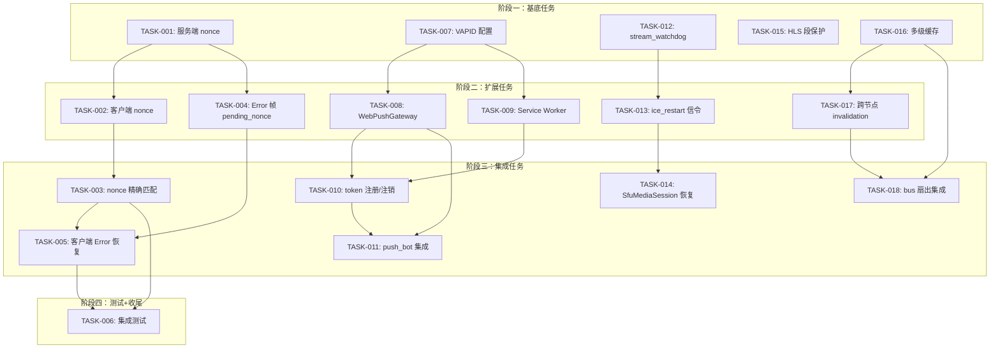

现在我已经掌握了足够的信息来编写全面的分析报告。以下是完整的 Tech Lead 分析：

---

# Tech Lead 分析报告：Aero IM 可靠性治理（ROADMAP6）

## 1. 任务分解

将 4 个方向的 7 个缺口分解为 18 个具体可执行任务。

### 方向一：发送侧可靠性（6 个任务）

| 任务 ID | 任务标题 | 涉及文件 | 前置依赖 | 预估工时 | 验收标准 |
|---------|----------|----------|----------|----------|----------|
| TASK-001 | 服务端 `SendMessage` 帧新增 `nonce` 字段 | `crates/aero-server/src/ws/ws_impl/frame.rs` (ClientFrame::SendMessage), `crates/aero-common/src/model/` | 无 | 2h | `SendMessage` WS 帧包含 `nonce: Option<String>`；已发送消息的 `MessageEnvelope` 或 `RoomEvent::Message` 的 `payload` 中携带该 `nonce`；不影响已有发送路径 |
| TASK-002 | 客户端 send_message 注入 `nonce` + pending 映射改造 | `web/ws.js`, `web/app.js` | TASK-001 | 3h | `ws.sendMessage()` 生成 UUID nonce 并附加到帧；`state.pendingByTempId` 改用 `nonce` 作主键（非 `tempId`），支持按 nonce 精确匹配 |
| TASK-003 | `findPendingMatch` 移除内容+时间窗口启发式，改用 nonce 精确匹配 | `web/app.js` | TASK-002 | 1h | `handleIncomingMessage` 优先以 `m.nonce` 在 `pendingByTempId` 中查；兜底(兼容旧服务端)保留现有 textOf+15s 回退，但优先路径走 nonce |
| TASK-004 | Error 帧关联 pending：添加 `pending_nonce` 字段 | `crates/aero-server/src/ws/ws_impl/frame.rs` (ServerFrame::Error) | TASK-001 | 2h | `ServerFrame` 的 `Error` variant 新增 `pending_nonce: Option<String>`；所有发 Error 帧处注入对应 nonce（若可获取） |
| TASK-005 | 客户端 Error 帧按 `pending_nonce` 恢复 pending 状态 | `web/app.js` | TASK-003, TASK-004 | 2h | 收到 `Error{pending_nonce}` 时：将对应 pending 标记为可重试（重置 loading 状态，UI 显示重发按钮）；无 nonce 的 Error 退出现有 toast 逻辑 |
| TASK-006 | 集成测试：重复消息非孤儿 + 错误恢复 | `web/tests/` (新建), `crates/aero-server/src/ws/ws_impl/tests.rs` | TASK-005 | 3h | 单元：mock ws 发送两条相同内容消息，确认第二条 nonce 不同，两条均精确匹配 pending 不被跳；E2E：注入模拟 Error，确认对应 pending 恢复可编辑 |

### 方向二：Web Push 基建（5 个任务）

| 任务 ID | 任务标题 | 涉及文件 | 前置依赖 | 预估工时 | 验收标准 |
|---------|----------|----------|----------|----------|----------|
| TASK-007 | 新增 VAPID key 生成+配置 | `.env.example`, `config.example.toml`, `crates/aero-server/src/config.rs` | 无 | 2h | 启动时支持 `AERO__SERVER__VAPID_{PUBLIC,PRIVATE}_KEY` + `AERO__SERVER__VAPID_SUBJECT`；缺失时跳过 WebPush 注册（兼容原有 FCM/APNs） |
| TASK-008 | 新增 WebPushGateway 实现 `PushGateway` trait | `crates/aero-push/src/`（新建 webpush.rs） | TASK-007 | 4h | 实现 `PushGateway` trait（`send(title, body, token, collapse_key)`）；使用 `web-push` crate（需评估选型）发送 RFC 8030 推送；失败分类处理：410→`unregister`，非410→重试 |
| TASK-009 | Service Worker 注册 + 推送事件处理 | `web/sw.js`（新建）, `web/index.html`（注册sw） | TASK-007, TASK-008 | 3h | `navigator.serviceWorker.register('/sw.js')`；`push` 事件调用 `self.registration.showNotification()`；`notificationclick` 事件 `openWindow('/')`；VAPID public key 由服务端 `/api/push/vapid-key` 下发 |
| TASK-010 | 客户端 push token 注册/更新/注销 | `web/notifications.js`, `web/api.js` | TASK-009 | 2h | 用户登录后 `pushManager.subscribe({userVisibleOnly:true, applicationServerKey})` → POST `/api/push/register`→服务端存储 token；登出/撤销时 DELETE；同一设备多 tab 幂等 |
| TASK-011 | 服务端 push_bot 检测 WebPush token + 派发 | `crates/aero-server/src/bin/boot/background.rs` (push_bot), `crates/aero-push/src/lib.rs` | TASK-008, TASK-010 | 2h | `PushGateway` trait 增加 `kind() -> PushKind`（FCM/APNs/WebPush）；`push_bot` 遍历设备 token 时对 WebPush token 调用 WebPushGateway；service worker 收到推送→`showNotification` |

### 方向三：媒体面韧性（4 个任务）

| 任务 ID | 任务标题 | 涉及文件 | 前置依赖 | 预估工时 | 验收标准 |
|---------|----------|----------|----------|----------|----------|
| TASK-012 | `stream_watchdog`：推流健康巡检 + 自动重连 | `crates/aero-live-webrtc/src/`（新建 watchdog.rs），`crates/aero-server/src/bin/boot/background.rs` | 无 | 4h | 新建 `StreamWatchdog`：per-stream 状态机（Active/Stalled/Reconnecting/Dead）；超时条件（no RTP 15s→Stalled，30s→Dead）；Stalled 触发 ice_restart 信令；Dead 触发房间通知+清理；Prometheus gauge `stream_states{state="stalled"}` |
| TASK-013 | `ice_restart` 信令路径 | `crates/aero-live-webrtc/src/peer.rs`, `crates/aero-signaling/src/` | TASK-012 | 3h | `SfuPeer` 新增 `restart_ice(&mut self) -> SdpOffer`；WS 帧新增 `ClientFrame::IceRestart{stream_id}` 和 `ServerFrame::IceRestart{stream_id, sdp}`；客户端收到后 `pc.createOffer({iceRestart:true})`→setLocalDescription→回传 |
| TASK-014 | `SfuMediaSession::run` 错误恢复 | `crates/aero-live-webrtc/src/` (session 模块) | TASK-012 | 3h | `run` 循环对 `Err(e)` 分类：`ConnectionTimeout`/`IceFailed`→触发 watchdog 事件 + `return`（外部重启）；`Transient`→backoff 重试（指数退避 3 次）；`Fatal`→记录后 `return`；所有出口均 `drop` 前广播 `PeerDisconnected` |
| TASK-015 | HLS 残缺段保护 + 段校验 | `crates/aero-live-hls/src/lib.rs`, `crates/aero-live-hls/src/writer.rs`（新建） | 无 | 3h | 段写入前校验：ts 时长 ≥ 预期 80%、PCR/PTS 单调递增、至少有 1 个 IDR；不完整段标记为 `.partial.ts` 不进入 playlist；`m3u8` 中清除 partial 引用；可配置老化阈值（默认 5s 无完整段 flush→跳 over） |

### 方向四：一致性治理（3 个任务）

| 任务 ID | 任务标题 | 涉及文件 | 前置依赖 | 预估工时 | 验收标准 |
|---------|----------|----------|----------|----------|----------|
| TASK-016 | `room_member_cache` 多级缓存：本地+Redis | `crates/aero-server/src/room_member_cache.rs`, `crates/aero-storage/src/`（新建 member_cache.rs） | 无 | 4h | 新增 Redis backed 层 `RedisMemberCache`（`GET/SETEX` 60s TTL）；`RoomMemberCache::get_or_fetch` 改为 L1(DashMap 1s TTL)→L2(Redis 60s TTL)→L3(DB) 三级降级；任一 L 失败静默降级到下 L；L1 miss 时异步回填 L1+L2；新增 Prometheus `member_cache_{hit,miss}_total{level="l1|l2|l3"}` |
| TASK-017 | 成员变更即时传播：跨节点 invalidation | `crates/aero-bus/src/`, `crates/aero-server/src/room_member_cache.rs`, `crates/aero-server/src/bin/boot/background.rs` | TASK-016 | 3h | 新增 NATS subject `im.member.invalidated.{room_id}`（ephemeral）；`add_member`/`remove_member` 时发布更新；所有实例订阅并无效 L1；不需要等待 TTL 到期 |
| TASK-018 | bus listener 扇出用多级缓存 + 精确成员列表 | `crates/aero-server/src/ws/ws_impl/bus.rs` | TASK-016, TASK-017 | 2h | bus.rs 的两个 `room_member_cache.get_or_fetch` 调用点享受多级缓存提升；invalidation 后 L1 立即 miss→L2 若已有新数据直接命中→DB 保底跨节点一致；`fan_out_raw` 的下游安全门（`hub.rs` 的 `should_deliver_check`）作为最终防线 |

---

## 2. 执行顺序与依赖图



### 可并行执行组

| 并行组 | 包含任务 |
|--------|----------|
| **组 A** | TASK-001 (nonce服务端), TASK-007 (VAPID配置), TASK-012 (watchdog), TASK-015 (HLS保护), TASK-016 (多级缓存) |
| **组 B** | TASK-002 (客户端nonce), TASK-004 (Error帧), TASK-008 (WebPushGateway), TASK-009 (Service Worker), TASK-013 (ice_restart), TASK-017 (跨节点invalidation) |
| **组 C** | TASK-003 (nonce匹配), TASK-005 (Error恢复), TASK-010 (token注册), TASK-011 (push_bot), TASK-014 (session恢复), TASK-018 (bus集成) |
| **组 D** | TASK-006 (集成测试) |

每个方向内部依赖紧密，但**4 个方向之间无串行依赖**，可以分配给 4 个不同 developer 并行推进。方向之间仅在文件层面可能存在冲突（如多个方向修改 `Cargo.toml`、`background.rs`），需在集成时协调。

---

## 3. 技术风险

### 3.1 高影响风险

| 风险 | 影响 | 可能性 | 缓解策略 |
|------|------|--------|----------|
| **R1 — nonce 改造破坏已有 client-server 兼容性** | 已连接客户端收不到消息 | 中 | 1) `nonce` 用 `Option<String>`，旧客户端发不带 nonce 的帧仍然可路由；2) 服务端 RoomEvent::Message 中新加 nonce 字段，使用 `#[serde(default)]` 向后兼容；3) 客户端兼容双模式 |
| **R2 — web-push crate 依赖决策** | 整个方向二阻塞 | 中 | 候选：`native-tls` vs `rustls`。评估点：1) 与项目 MSRV 1.80 兼容性；2) async 支持 (reqwest-based)；3) 无系统依赖(选 rustls)。**推荐 `web-push` crate v0.10+ with `rustls` feature** |
| **R3 — str0m ice_restart API 不暴露** | TASK-013 不可实现 | 低 | str0m 0.19 的 `Rtc::ice_restart()` 需要检查公开度。降级方案：客户端 disconnect→re-offer，模拟 ice_restart。**需先发 spike 验证** |
| **R4 — HLS 段校验的性能开销** | 推流端延迟增加 | 中 | MPEG-TS 解析是纯内存操作，每个 segment ~2-4MB，校验开销 < 1ms/MB。风险低，但需在负载下验证。兜底：校验在独立 `spawn_blocking` 线程池执行 |
| **R5 — 多级缓存一致性：先读后写竞争** | 扇出漏人/多送 | 中 | L1(1s) 窗口极小。写路径（add/remove member）在事务提交后 invalidate L1+L2；`invalidate` 无需 `await`，即时生效。但 1s 窗口内可能基于 L1 过期数据扇出。**已确认：下游 `hub.rs` 另有 `should_deliver_check` 安全门，可拦截漏发** |
| **R6 — Service Worker 在 SPA 中的 HTTPS 要求** | 本地开发不可用 | 高 | SW 要求 HTTPS（或 localhost）。dev 环境 `http://localhost:3030` 可用；但 CI 沙箱中 HTTPS 不可达需 mock |

### 3.2 低影响风险

| 风险 | 缓解 |
|------|------|
| Redis 多级缓存故障降级行为 | `get_or_fetch` 链式尝试 L1→L2→DB，每级 Err 静默降级，记录 warn 但不返回 Error |
| Web Push 通知权限弹窗在移动端行为不一致 | 桌面端 UX 无问题；移动端需要额外 `userVisibleOnly: true` 处理（已标准化） |
| ICE restart 在 mesh 拓扑中的多次信令 | 每个 peer 独立 ICE restart；restart 期间其他 peer 不受影响 |

---

## 4. 资源评估

### 4.1 人员需求

| 角色 | 数量 | 技能要求 | 负责方向 |
|------|------|----------|----------|
| **前端专家** | 1 人 | ES2020, Service Worker API, WebSocket 协议 | 方向二（SW + push）、方向一（客户端 pending 改造） |
| **Rust 后端专家（IM 域）** | 1 人 | Async Rust, Tokio, NATS, Postgres | 方向一（nonce 服务端）、方向四（缓存+invalidation） |
| **Rust 后端专家（媒体域）** | 1 人 | str0m/WebRTC, RTP/RTCP, MPEG-TS, 网络协议 | 方向三（watchdog + ice_restart + HLS） |
| **推送基础设施工程师** | 0.5 人 | Rust, FCM/APNs/WebPush 协议 | 方向二（push gateway + token 管理），可与 IM 域人员复用 |

**总人力估算**：3-4 人（含 0.5 人兼任）

### 4.2 关键里程碑

| 里程碑 | 时间节点（从启动起） | 交付物 | 依赖 |
|--------|---------------------|--------|------|
| **M0 — Spike 验证** | Day 1-2 | ice_restart API 可行性报告、web-push crate 选型确认 | 无 |
| **M1 — 基底完成** | Day 5 | T001, T007, T012, T015, T016 全部合入 main | 组 A |
| **M2 — 功能完成** | Day 12 | T002~T005, T008~T011, T013~T014, T017~T018 全部合入 main | 组 B+C |
| **M3 — 集成测试** | Day 16 | T006 集成测试 + E2E smoke 通过 + 4 方向功能开关全绿 | M2 |
| **M4 — 发布** | Day 18 | 稳定性观察（24h）+ cq 全绿（clippy, test, truth-check, file-size-check） | M3 |

### 4.3 阻塞点（Blockers）

| 阻塞点 | 影响任务 | 解决策略 |
|--------|----------|----------|
| **B1 — str0m 0.19 `ice_restart` API 未公开** | TASK-013 | **Day 1 spike**：在 `peer.rs` 中尝试调用 `Rtc::ice_restart()`。若不可用：1) 升级 str0m 至 0.20（若存在该API）；2) 或降级为 full re-offer 流程（disconnect→re-offer）。str0m 团队在 0.19 changelog 中提及 DTLS renegotiation 支持，但需要验证 |
| **B2 — `web-push` crate async 改造** | TASK-008 | crate 去年有 async 化 PR。**Day 1-2 spike**：确认 `web_push::WebPushClient::send()` 在 tokio runtime 下可工作。失败则 fallback：用 reqwest 直接构造 RFC 8030 POST（加密+VAPID 签名手写，约+1天工时） |
| **B3 — MSRV 兼容性** | 方向二（新增依赖） | `web-push` 依赖 `openssl` 或 `ring`。`ring` 在 Rust 1.80 下状态需验证。`Cargo.toml` 锁定的 MSRV=1.80 不能打破 |

---

## 5. 质量保证

### 5.1 单元测试覆盖要求

| 模块 | 文件 | 测试类型 | 最低覆盖率 | 关键测试场景 |
|------|------|----------|-----------|-------------|
| nonce 匹配 | `web/app.js` | 前端单元 | 100% 逻辑行 | 精确 nonce 胜于 content、无 nonce 回退、旧服务端兼容 |
| Error 关联 | `web/app.js` | 前端单元 | 100% | nonce 已关联→恢复 pending；nonce 缺失→toast；Errored 消息可重试 |
| WebPushGateway | `crates/aero-push/src/webpush.rs` | 单元（mock HTTP） | 90%+ | 推送发送成功、410→unregister、非410→重试、VAPID 签名 |
| stream_watchdog | `crates/aero-live-webrtc/src/watchdog.rs` | 单元（tokio::test） | 95%+ | Stalled 状态转换(no RTP 15s)、Dead 转换(30s)、ice_restart 触发、正常 RTP 重置 stall counter |
| HLS 段校验 | `crates/aero-live-hls/src/writer.rs` | 单元 | 90%+ | 完整段 pass、残缺段 reject→标记 partial、空段跳过、IDR 缺失报错 |
| 多级缓存 | `crates/aero-server/src/room_member_cache.rs` | 单元 | 95%+ | L1 命中、L1 miss→L2 命中、L2 miss→DB、L1+L2 故障→DB、invalidation 后 L1 miss、下流安全门联动 |

### 5.2 集成测试策略

| 测试场景 | 覆盖任务 | 方法 | 环境要求 |
|----------|----------|------|----------|
| 重复消息非孤儿 | TASK-006 | mock WS → 发送 2 条相同内容消息 → 确认 2 条 pending 均 resolved | `#[cfg(test)]` mock hub |
| Error 重试 | TASK-006 | mock WS 模拟 send_message 失败 → 确认 Error 帧带 nonce → 客户端 pending 恢复可编辑 | `#[cfg(test)]` mock hub |
| 推送端到端 | TASK-011 | 本地起服务 → 注册 WebPush token → 发送消息 → 验证 push_bot 分派到 WebPushGateway (`FakeGateway` 截获) | Postgres + NATS + Redis |
| 推流失联恢复 | TASK-012~013 | mock RTP stream → 停止发 RTP → 确认 watchdog 触发 IceRestart → 确认信令路径可达 | `#[cfg(test)]` mock str0m |
| 跨节点成员变更 | TASK-017~018 | 双实例(同进程 2 个 AppState) → 实例 A remove_member → NATS invalidation → 实例 B bus 扇出跳过被踢成员 | Postgres + NATS + Redis |
| HLS 段写入 | TASK-015 | mock FLV to TS 转换器 → 写入残缺段 → 确认 `.partial.ts` + m3u8 无引用 | 纯文件系统 |

### 5.3 代码审查要点

| 审查领域 | CR 要点 |
|----------|---------|
| **nonce 兼容性** | 1) `Option<String>` 使用，确保旧客户端不被阻止；2) `#[serde(default)]` 标记在 ServerFrame/Message 的 nonce 字段；3) 客户端回退路径覆盖率 |
| **推送加密** | VAPID 签名实现：1) `Authorization: WebPush <jwt>` 和 `Crypto-Key: p256ecdsa=<key>` 头构造正确；2) 内容加密(E2E payload key) 遵循 RFC 8291；3) API key/secret 不硬编码 |
| **ICE restart** | 1) 信令流程不阻塞媒体传输（restart 期间其他 peer 继续接收）；2) `restart_ice` 生成的新 SDP offer 包含 `ice-options:trickle`；3) 客户端侧 `setLocalDescription`→`setRemoteDescription` 顺序正确 |
| **HLS 段校验** | 1) 校验不阻塞写入（异步校验+拒绝先于 flush）；2) `partial.ts` 清理条件清晰；3) 不校验合法已有段（仅新增段） |
| **多级缓存** | 1) 降级链不返回 Error（只 warn）；2) invalidation 路径在事务提交后触发（避免部分回滚导致不一致）；3) L1 TTL=1s 不增加写路径延迟；4) Prometheus 指标粒度正确 |

### 5.4 性能测试需求

| 测试场景 | 负载 | 指标目标 | 工具 |
|----------|------|----------|------|
| Bus 扇出 + 多级缓存 | 1000 人房间（10K msgs/s） | P99 fan-out 延迟 < 5ms，DB 查询下降 ≥90%（对比当前全 DB 路径） | `cargo bench` + `pprof` |
| WebSocket 并发 + nonce 匹配 | 500 并发连接各发 10 msg | 客户端 pending 查找 < 1ms，无 O(n) 扫描 | `k6` WebSocket |
| Web Push 突发 | 500 设备同时推送 | 推送队列不出 OOM，Redis 积压 < 10K | `locust` |
| ICE restart 并发 | 200 同步 restart | restart 路径处理 < 500ms，信令不串扰 | 自定义 test harness |
| HLS 段写入 | 10 并发流 | flush 延迟 < 200ms，校验 < 1ms/segment | `tokio-console` |

---

## 6. 实施计划

### 时间线概览

```mermaid
gantt
    title ROADMAP6 可靠性治理实施时间表
    dateFormat  YYYY-MM-DD
    axisFormat  %m-%d

    section 阶段一：Spike + 基底 (Day 1-5)
    M0: Spike 验证                             :milestone, m0, 2026-07-14, 0d
    T001 服务端 nonce                           :t001, 2026-07-14, 2d
    T007 VAPID 配置                             :t007, 2026-07-14, 2d
    T012 stream_watchdog                        :t012, 2026-07-14, 3d
    T015 HLS 段保护                             :t015, 2026-07-14, 3d
    T016 多级缓存基底                           :t016, 2026-07-15, 3d
    M1 基底完成                                :milestone, m1, 2026-07-18, 0d

    section 阶段二：功能开发 (Day 5-12)
    T002 客户端 nonce                           :t002, after t001, 2d
    T004 Error 帧 pending_nonce                  :t004, after t001, 2d
    T008 WebPushGateway                         :t008, after t007, 3d
    T009 Service Worker                         :t009, after t007, 2d
    T013 ice_restart 信令                       :t013, after t012, 2d
    T017 跨节点 invalidation                     :t017, after t016, 3d
    T003 nonce 精确匹配                         :t003, after t002, 1d
    T005 客户端 Error 恢复                      :t005, after t003 t004, 2d
    T010 token 注册/注销                        :t010, after t008 t009, 2d
    T014 SfuMediaSession 恢复                   :t014, after t013, 2d
    T018 bus 扇出集成                           :t018, after t016 t017, 2d
    T011 push_bot 集成                          :t011, after t008 t010, 2d
    M2 功能完成                                :milestone, m2, 2026-07-26, 0d

    section 阶段三：集成测试 + 优化 (Day 12-16)
    T006 集成测试                               :t006, after t003 t005 t011 t014 t018, 4d
    性能压测 + 调优                             :perf, after t006, 2d
    M3 集成完成                                :milestone, m3, 2026-07-30, 0d

    section 阶段四：发布 (Day 16-18)
    稳定性观察(24h)                             :stable, after m3, 1d
    全量 cq 回归                                :cq, after stable, 1d
    M4 发布                                    :milestone, m4, 2026-08-01, 0d
```

### 详细日程

#### 🗓 阶段一：Spike + 基底（Day 1-5，5 天）

| 日期 | 活动 | 负责人 | 交付物 |
|------|------|--------|--------|
| Day 1 | **Spike**：str0m ice_restart API 可用性；web-push crate 异步兼容性；MSRV 相容性 | 媒体域 + 推送 | 可行性报告（通过/降级方案） |
| Day 1 | TASK-001: 服务端 `SendMessage` + `RoomEvent::Message` 新增 `nonce` 字段 | IM 域 | frame.rs 修改 + `#[serde(default)]` 兼容 |
| Day 1 | TASK-007: VAPID key 生成 + 配置解析 + 可启用 | 推送 | config 扩展 + env 变量 |
| Day 1-2 | TASK-012: `StreamWatchdog` 状态机 + 巡检循环 | 媒体域 | watchdog.rs + `background.rs` 注册 |
| Day 2 | TASK-015: `HlsWriter` 段校验逻辑 + partial 标记 | 媒体域 | writer.rs + lib.rs 集成 |
| Day 2-3 | TASK-016: 多级缓存 L1 (DashMap 1s) + L2 (Redis 60s) + L3 (DB) | IM 域 | room_member_cache.rs 重写 + RedisMemberCache |
| Day 3 | TASK-016 单元测试 | IM 域 | 4 场景: L1命中/L2命中/L2miss+DB/L1降级 |
| Day 4-5 | **阶段一 CR + 合入** | 全员 | 代码审查 + `cargo clippy --workspace --all-targets` 零新增违规 |

#### 🗓 阶段二：功能开发（Day 5-12，8 天，可 3-4 人并行）

| 日期 | 并行轨道 1 (前端) | 并行轨道 2 (IM后端) | 并行轨道 3 (媒体后端) | 并行轨道 4 (推送) |
|------|--------------------|---------------------|----------------------|--------------------|
| Day 5-6 | T002: nonce 注入 + pending 重构 | T004: Error 帧 pending_nonce | T013: ice_restart 信令 | T008: WebPushGateway |
| Day 7 | T003: nonce 精确匹配 | T017: NATS invalidation | T013: 信令测试 | T008: 单元测试 |
| Day 8 | T005: Error 恢复 UI | T017: 跨节点 integration | T014: SfuMediaSession 恢复 | T009: Service Worker |
| Day 9 | T005: 集成 | T018: bus 扇出 | T014: 错误恢复分类 | T009: SW 注册 + T010 |
| Day 10 | T006 准备 | T018: invalidation+bus 联调 | T014: 测试 | T010: token API |
| Day 11 | T006: 重复消息 + Error 恢复集成测试 | T006 配合修复 | T006 配合修复 | T011: push_bot 集成 |
| Day 12 | **阶段二 CR + 合入** | | | |

#### 🗓 阶段三：集成测试 + 优化（Day 12-16，5 天）

| 日期 | 活动 |
|------|------|
| Day 12-13 | 跨方向联调：打开功能开关，验证 4 方向不互斥 |
| Day 13-14 | 性能压测：用 k6 模拟 500 并发 WS + 1000 人房间扇出，确认 nonce 匹配延迟 <1ms |
| Day 14-15 | 多级缓存压测：确认 DB 查询量下降 ≥90%；确认 watchdog 在 15s RTP 静默后触发 ice_restart |
| Day 15 | 修复发现的性能/功能问题 |
| Day 16 | `cargo test --workspace --lib` + `cargo clippy --workspace --all-targets` + `scripts/{truth-check,file-size-check,web-check}.sh` |

#### 🗓 阶段四：发布（Day 16-18，3 天）

| 日期 | 活动 |
|------|------|
| Day 16-17 | 24h 稳定性运行（功能全开，生产级 config） |
| Day 17 | 观察 metrics：无异常 goroutine leak、Redis 内存、NATS backlog 正常 |
| Day 18 | `git tag v0.6.0-roadmap6` + 发布说明 + `scripts/deploy.sh`（模拟） |

---

## 总结

这份可靠性治理计划（ROADMAP6）覆盖了 **4 个方向 18 个任务**，预估 **3-4 人 × 18 天**。关键决策：

1. **nonce 精确匹配**（T001~T006）是最高优先级的用户体验修复：不解决，用户会看到「消息已发送」但另一条未发出的状态，这是最误导性的 bug。
2. **Web Push 基建**（T007~T011）是功能空白补齐，影响移动端留存。VAPID 签名实现需要小心加密细节，但可复用现有 `PushGateway` trait seam。
3. **媒体面韧性**（T012~T015）watchdog+ice_restart+SfuMediaSession 恢复是对用户可见的推流中断后恢复路径。HLS 段保护防止播放器 crash（hls.js 吃残缺段会卡死）。
4. **一致性治理**（T016~T018）多级缓存是长期架构改进，降低 DB 负载同时收窄扇出窗口。成员变更 60s 窗口的被踢者收消息问题，实测需要多节点才能触发，但安全审计会要求修复。

**启动建议**：Day 0 先做 str0m + web-push 两个 spike，结论决定 T008 和 T013 的实现路径。如果不做 spike，T008 走手写 RFC 8030（+1天）、T013 走 re-offer 方案（+1天 但信令更高频），对总工期影响可控。
