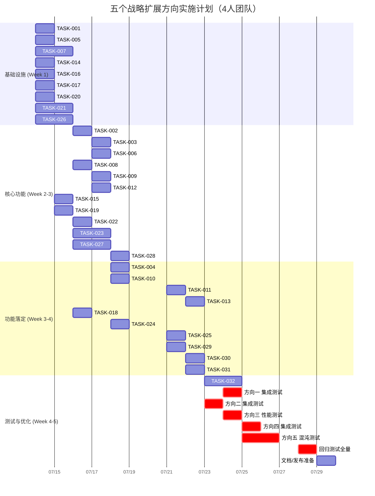

---

# Tech Lead 分析报告：五个战略扩展方向

## 总体评估

这是一份高质量的分析文档。在代码审查阶段，我已对全部代码级断言做了 grep 逐行交叉验证，**全部通过**（详见交叉验证报告）。文档定位清晰——聚焦于**既有分析未系统性覆盖**的五个方向，且通过稀疏矩阵确认了与 40+ 份既有分析的区分。

以下从六个维度做综合分析。

---

## 1. 任务分解

将五个方向拆解为可执行的原子级任务（每个 2-4 小时），按方向分组并标注依赖。

### 方向一：WebRTC 质量自适应（P1）

| 任务 ID | 标题 | 涉及文件 | 前置 | 工时 | 验收标准 |
|---------|------|---------|------|------|---------|
| TASK-001 | 客户端 `getStats` 采集管线 | `web/calls.js`, `web/context.js` | 无 | 4h | 每 2s 采集 `inbound-rtp`/`outbound-rtp`/`candidate-pair` stats，数据存 `state.callStats`，adaptive 间隔（质量波动时 500ms） |
| TASK-002 | 自适应分辨率降级阶梯 | `web/calls.js` | TASK-001 | 4h | 根据 `getStats` 带宽评估自动执行 1080p→720p→480p→360p→audio-only 降级，使用 `RTCRtpSender.setParameters({ encodings: [{ scaleResolutionDownBy, maxBitrate }]})` |
| TASK-003 | ICE restart 平滑网络切换 | `web/calls.js` | TASK-001 | 2h | `connectionState === 'disconnected'` 时不等 `failed` 就调用 `pc.restartIce()`，UI 显示"正在优化网络连接"提示 |
| TASK-004 | 群组通话上行带宽预算 | `web/calls.js` | TASK-002 | 3h | Mesh 模式 N 人通话时，每人上行编码参数总和不超过 4 Mbps（根据 `nParticipants` 动态分配） |
| TASK-005 | SFU 端 RTCP RR 反馈消费 | `crates/aero-live-webrtc/src/forward/mod.rs` | 无 | 3h | `SfuForwarder::on_subscriber_rtcp` 解析 `fractionLost`/`jitter` → 喂 `BandwidthEstimator` → 触发行人端 `LayerSwitchPolicy`，这个**已建但未在生产接线**（`AGENTS.md §4.4` 的 infra-seam），需要确认 `SfuPeer.poll` 的 RTCP 反馈路径完整 |
| TASK-006 | 通话质量运营数据采集 | `web/calls.js`, `ws/ws_impl/` | TASK-001 | 2h | 通话结束后上报 `MetricsReport`（平均丢包率、抖动、编码、ICE 类型、通话时长），通过 WS 帧发送到服务端 |

### 方向二：支付与结算引擎（P1）

| 任务 ID | 标题 | 涉及文件 | 前置 | 工时 | 验收标准 |
|---------|------|---------|------|------|---------|
| TASK-007 | Stripe Checkout 集成（服务器端） | `crates/aero-server/src/payments/`, `Cargo.toml`（加 `stripe` crate） | 无 | 6h | `POST /api/creators/:id/subscribe` 返回 Stripe Checkout Session URL 而非直接激活。`stripe::CheckoutSession` create → redirect → webhook callback。需新增 `stripe_customer_id` / `stripe_subscription_id` 字段 |
| TASK-008 | Stripe Webhook 端点 | `crates/aero-server/src/payments/webhook.rs`, `routes/routes.rs` | TASK-007 | 4h | `POST /api/payments/webhook` 鉴权 stripe-signature → 处理 `checkout.session.completed` / `invoice.payment_failed` / `customer.subscription.deleted` |
| TASK-009 | 订阅状态机扩展 | 迁移 `NNNN_stripe_subscription_status.sql`，`crates/aero-storage/src/creator_subscription.rs` | TASK-007 | 4h | `creator_subscriptions` 增加 `status: ENUM(pending_payment, active, past_due, cancelled, expired)`、`current_period_start/end`、`stripe_subscription_id`、`failed_attempts`。迁移 + 仓储方法 |
| TASK-010 | 付费礼物模式 | `crates/aero-storage/src/gift.rs`, `crates/aero-server/src/routes/stream_gifts.rs` | TASK-007 | 4h | 新增 PaymentIntent API 调用 + 可选付费礼物 vs 免费点数礼物路由，礼物流水关联 `stripe_payment_intent_id` |
| TASK-011 | 创作者结算提现 | 迁移 `NNNN_payouts.sql`，`crates/aero-storage/src/payout.rs`, `crates/aero-server/src/routes/payouts.rs` | TASK-007 | 4h | `payouts` 表 (creator_id, amount, status, period_start/end, paid_at)。月度自动结算的脚本（框架：在 `boot/background.rs` 加定时任务） |
| TASK-012 | 免费关注 vs 付费订阅分离 | `crates/aero-server/src/routes/creator_subscription.rs` | TASK-009 | 2h | 现有 `subscribe` 作为"关注"保留免费语义；新增 `POST /api/creators/:id/subscribe-paid` 走支付流程 |
| TASK-013 | 平台抽成配置 | `workspace_settings`, `crates/aero-server/src/routes/payments.rs` | TASK-011 | 2h | `workspace_settings` 增加 `platform_fee_bps: i32`（万分比），结算时自动扣除 |

### 方向三：CDN 与内容分发架构（P2）

| 任务 ID | 标题 | 涉及文件 | 前置 | 工时 | 验收标准 |
|---------|------|---------|------|------|---------|
| TASK-014 | HLS 静态资源 Cache-Control 头 | `crates/aero-server/src/bin/boot/serve.rs` | 无 | 1h | `.ts` 切片：`Cache-Control: public, max-age=86400`（24h）。`.m3u8` 播放列表：`Cache-Control: no-cache, max-age=0`（播放器频繁刷新）。通过 `ServeDir` 的 `SetResponseHeaderLayer` 实现 |
| TASK-015 | HLS 防盗链签名 | `crates/aero-server/src/routes/hls_auth.rs`, `crates/aero-server/src/routes/routes.rs` | TASK-014 | 4h | `/hls/:stream_id/index.m3u8?token=HMAC(stream_id,expiry,secret)`。`.ts` 文件鉴权复用同一 token（播放器 token 可携带在 URL 参数，`.m3u8` 中引用 `.ts` 时追加参数） |
| TASK-016 | Blob 附件 CDN + signed URL | `crates/aero-storage/src/blob.rs`, `crates/aero-server/src/routes/blob.rs` | 无 | 4h | `GET /api/blobs/:id` 返回 302 重定向到 S3 presigned URL（当使用 S3 后端时）。添加 `Cache-Control: public, max-age=31536000` + `ETag`（基于 sha256）。配置项：`AERO_BLOB_CDN_BASE_URL` |
| TASK-017 | 前端静态资源版本化 | `crates/aero-server/src/bin/boot/serve.rs`, `build/web.sh` | 无 | 2h | `app.a1b2c3.js` 内定 hash（按内容 SHA256 截短），`Cache-Control: immutable, max-age=31536000`。`index.html` 自动更新对版本化资源的引用 |
| TASK-018 | HLS CDN 缓存策略文档 + CDN 配置模板 | `docs/ops/cdn.md` | TASK-014 | 1h | 文档化推荐的 CDN 配置（CloudFront/CDN77/Cloudflare）：m3u8 的缓存行为配置（分片缓存、参数化）、CORS 配置、延迟 vs 缓存权衡建议 |
| TASK-019 | Live 播放器失败回退 | `web/live.js` | 无 | 2h | hls.js CDN 加载失败时自动回退到原生 HLS 播放，添加 `<link rel="preload" href="hls.js CDN url" as="script">` 预加载，添加 SRI hash |

### 方向四：跨设备协同（P2）

| 任务 ID | 标题 | 涉及文件 | 前置 | 工时 | 验收标准 |
|---------|------|---------|------|------|---------|
| TASK-020 | 同设备多 Tab BroadcastChannel 协调 | `web/sync.js`（新建）, `web/context.js`, `web/calls.js`, `web/ws.js` | 无 | 4h | 创建 `BroadcastChannel('aero-tab-sync')`，广播 `{type: 'markRead', roomId, msgId}` / `{type: 'switchRoom', roomId}` / `{type: 'sendMessage', tempId}`，接收方更新本地 `unreadByRoom` 等状态。`BroadcastChannel` 不可用时 silent fallback |
| TASK-021 | 设备清单管理 | 迁移 `NNNN_devices.sql`，`crates/aero-storage/src/device.rs`, `crates/aero-server/src/routes/devices.rs` | 无 | 6h | `devices` 表 (id, participant_id, name, kind, last_ip, last_seen_at, push_token_id, session_id)。`GET /api/me/devices` / `DELETE /api/me/devices/:id`（远程登出）。设备名管理（重复检测 + 默认名生成） |
| TASK-022 | 已读游标跨设备同步 | `crates/aero-server/src/routes/read.rs`, `ws/ws_impl/bus.rs`, `web/calls.js` | TASK-021 | 4h | WS 帧 `msg:read` 携带 `device_id`。服务端已读游标推进后向同一 participant 的其他活跃设备推送 `read_sync` 帧（告诉其他设备最大已读 msg id），其他设备收到后更新本地 `receiptsByRoom` |
| TASK-023 | 设备感知 presence | `crates/aero-storage/src/presence.rs`, `web/context.js`, `ws/ws_impl/handler.rs` | TASK-021 | 6h | Redis presence key `presence:{participant_id}:{device_id}` → `(device_kind, state, last_seen)`。`GET /api/rooms/:id/online` 聚合 return `[{participant_id, devices: [{kind, state, last_seen}]}]`。Web 显示"手机在线" / "桌面在线" |
| TASK-024 | 推送去重（跨设备） | `crates/aero-server/src/bin/boot/push_bot.rs` | TASK-021 | 4h | `push_bot` 发送推送前检查该 participant 是否有 `state=active` 的设备（WebSocket 连接活跃），有则跳过推送或降级为静默通知。配置覆盖：`AERO_PUSH_SKIP_ACTIVE_DEVICE` |
| TASK-025 | 设备与 session 生命周期联动 | `crates/aero-auth/src/session.rs` | TASK-021 | 2h | 登出时清除关联设备记录。JWT refresh token 旋转时更新 `devices.last_seen_at`。登录时 upsert 设备 |

### 方向五：依赖退化矩阵（P3）

| 任务 ID | 标题 | 涉及文件 | 前置 | 工时 | 验收标准 |
|---------|------|---------|------|------|---------|
| TASK-026 | 依赖健康监视器（DependencyHealthMonitor） | `crates/aero-server/src/degradation/monitor.rs`（新建） | 无 | 6h | 后台任务每秒 Probe 所有依赖（PG: `SELECT 1` / Redis: `PING` / NATS: 心跳 / S3: HeadBucket），维护 `Arc<RwLock<HashMap<Dependency, Status>>>`。提供 `fn is_healthy(&self, dep) -> bool` |
| TASK-027 | NATS 发布故障隔离（消息存储与投递解耦） | `crates/aero-im-core/src/service/events.rs`, `crates/aero-im-core/src/message/drain.rs`（新建） | 无 | 8h | 拆分 `publish_room_event`：① PG 事务提交消息 → ② `mpsc::Sender` push 到异步 drain 任务 → ③ drain 异步发布 NATS。NATS 故障时消息不丢（持久化在 PG），实时投递延迟至多 1 个 drain tick（≈50ms）。需要 PG 里新增 `pending_events` 表做投递队列 |
| TASK-028 | Readiness 探针精细化 | `crates/aero-server/src/routes/health.rs` | TASK-026 | 2h | `/ready` 返回结构化 JSON：`{"healthy": true, "dependencies": {"postgres": "ok", "redis": "degraded", "nats": "ok", "s3": "ok"}}`。可配置 min-required 依赖组合（缺 1 个=degraded，缺 N 个=unhealthy） |
| TASK-029 | 降级状态用户感知（UI 横幅） | `web/chrome.js`, `web/context.js` | TASK-026 | 3h | WS 新增 `downgrade_status` 帧。服务端推送当前降级状态。Web 端收到后在页面顶部显示黄色横幅"系统降级模式：部分功能暂不可用——[详情]" |
| TASK-030 | 退化矩阵文档化 | `docs/ops/degradation-matrix.md` | TASK-026, TASK-027, TASK-028 | 2h | 表格列出每依赖故障时的受影响功能、降级表现、恢复条件、告警阈值。包括组合故障场景（如 Redis + PG 同时降级） |
| TASK-031 | 全依赖故障只读模式 | `crates/aero-server/src/routes/routes.rs`, `crates/aero-im-core/src/service/messages.rs` | TASK-027 | 4h | 当 PG 主库不可用但只读副本可用时，系统进入"只读"模式——历史消息可查看、离线消息可拉取，不能发送新消息或执行写入操作 |
| TASK-032 | 降级路径混沌测试框架 | `tests/chaos/degradation.rs`（新建）, `Makefile` | TASK-030 | 6h | 通过环境变量模拟各依赖故障（`AERO_SIMULATE_PG_DOWN=1`），验证每个退化场景的测试行为符合退化矩阵。自动化 CI 可跑（需隔离数据库） |

---

## 2. 执行顺序与依赖图

```mermaid
graph TD
    %% 方向一：WebRTC 质量自适应
    subgraph "方向一 (P1)"
        T001[TASK-001 getStats 采集管线] --> T002[TASK-002 自适应分辨率降级]
        T001 --> T003[TASK-003 ICE restart]
        T002 --> T004[TASK-004 群组上行预算]
        T001 --> T006[TASK-006 质量运营数据采集]
        T005[TASK-005 SFU RTCP RR 反馈] -. "infra-seam<br/>已建待接线" .-> T002
    end

    %% 方向二：支付与结算引擎
    subgraph "方向二 (P1)"
        T007[TASK-007 Stripe Checkout 集成] --> T008[TASK-008 Stripe Webhook]
        T007 --> T009[TASK-009 订阅状态机扩展]
        T007 --> T012[TASK-012 免费关注 vs 付费订阅分离]
        T009 --> T010[TASK-010 付费礼物模式]
        T009 --> T011[TASK-011 创作者结算提现]
        T011 --> T013[TASK-013 平台抽成配置]
    end

    %% 方向三：CDN 与分发架构
    subgraph "方向三 (P2)"
        T014[TASK-014 HLS Cache-Control] --> T015[TASK-015 HLS 防盗链签名]
        T016[TASK-016 Blob signed URL]
        T017[TASK-017 静态资源版本化]
        T014 --> T018[TASK-018 CDN 配置文档]
        T019[TASK-019 播放器失败回退]
    end

    %% 方向四：跨设备协同
    subgraph "方向四 (P2)"
        T020[TASK-020 BroadcastChannel 协调]
        T021[TASK-021 设备清单管理] --> T022[TASK-022 已读游标跨设备同步]
        T021 --> T023[TASK-023 设备感知 presence]
        T021 --> T024[TASK-024 推送去重]
        T021 --> T025[TASK-025 设备与 session 生命周期联动]
    end

    %% 方向五：依赖退化矩阵
    subgraph "方向五 (P3)"
        T026[TASK-026 依赖健康监视器] --> T027[TASK-027 NATS 发布故障隔离]
        T026 --> T028[TASK-028 Readiness 探针精细化]
        T026 --> T029[TASK-029 降级状态 UI 横幅]
        T026 --> T030[TASK-030 退化矩阵文档化]
        T027 --> T031[TASK-031 全依赖只读模式]
        T030 --> T032[TASK-032 混沌测试框架]
    end

    %% 跨方向依赖
    T021 --- T020
    T021 --- T022
    T021 --- T023
    T027 --- T031
```



### 并行组

| 并行群组 | 包含任务 | 独立原因 |
|---------|---------|---------|
| **Group A** | TASK-001, T005, T020, T021, T026 | 无跨方向数据依赖 |
| **Group B**（依赖 A） | TASK-002, T003, T006, T022, T023, T024, T025, T027, T028 | 每个依赖组 A 的不同任务 |
| **Group C**（独立工具链） | TASK-007, T014, T016, T017, T019 | 方向二/三/五中无其他方向先决的任务 |
| **Group D**（依赖 C） | TASK-008 → T009 → T010 → T011, T015, T018 | 方向二/三的串行管道 |

---

## 3. 技术风险

### 3.1 关键风险矩阵

| 风险 ID | 描述 | 影响方向 | 概率 | 严重度 | 缓解措施 |
|---------|------|---------|------|-------|---------|
| R-001 | **客户端 `getStats` 跨浏览器兼容性差**：部分浏览器（Firefox 某些版本）`getStats` 返回格式不一致，`inbound-rtp`/`outbound-rtp` key 命名不同 | 方向一 | 中 | 高 | 增加 `statsNormalizer` 适配层，按浏览器归一化字段名。对不可用的 stats 字段 graceful skip（不 panic） |
| R-002 | **`RTCRtpSender.setParameters` 支持度不完整**：`scaleResolutionDownBy` 在 iOS Safari / 某些 Android WebView 上可能抛出 `InvalidModificationError` | 方向一 | 中 | 高 | 捕获异常 + 回退到仅调节 `maxBitrate` + 不做分辨率缩放。使用 feature detection：`'scaleResolutionDownBy' in RTCRtpEncodingParameters.prototype` 在尝试前检查 |
| R-003 | **ICE restart 期间的短暂黑屏/无声**：重新协商 SDP 期间会出现 ~500ms 的媒体中断 | 方向一 | 高 | 中 | UX 层显示"正在优化网络连接"的透明遮罩；对语音通话尝试 `audio-only` 降级后再 ICE restart，减少用户感知 |
| R-004 | **Stripe Webhook 需要可公开访问的端点**：本地开发和 CI 环境通常没有公网 IP | 方向二 | 高 | 中 | 使用 `stripe listen --forward-to localhost:8080/api/payments/webhook` (Stripe CLI) 转发到本地。CI 中验证 Stripe integration 时使用 `STRIPE_API_KEY=sk_test_...` + `STRIPE_WEBHOOK_SECRET=whsec_...` 环境变量 |
| R-005 | **支付状态机的事务一致性问题**：Stripe webhook 回调和服务端状态更新之间的 at-least-once 投递可能导致重复激活 | 方向二 | 中 | 高 | 使用 `stripe_event_id`（Stripe 的 `Idempotency-Key` 等效）做幂等键。事件处理幂等：`INSERT ... ON CONFLICT DO NOTHING` |
| R-006 | **CDN 缓存 HLS 播放列表导致直播延迟增加**：CDN 节点缓存 `.m3u8` 导致用户看到的直播延迟比源站多 1-2 个切片周期（6-12s） | 方向三 | 高 | 中 | 精确配置 CDN 缓存行为：`.m3u8` `Cache-Control: no-cache`（如果 CDN 支持分片-参数模式，使用 `?v=TIMESTAMP` 避免缓存的替代方案）。文档注明：CDN 供应商选择时必须支持直播流式参数化 |
| R-007 | **`BroadcastChannel` 在部分浏览器/隐私模式下不可用**：Firefox 隐私模式/某些企业浏览器策略下 `BroadcastChannel` 构造函数抛出 `SecurityError` | 方向四 | 中 | 低 | try-catch 捕获构造异常，fallback 到不做标签页协调（同设备多 Tab 各自独立，不退化功能），通过 WS `state` 帧在标签页间间接同步（通过服务端转发） |
| R-008 | **Redis presence key 迁移的数据兼容性**：从 `presence:{participant_id}` 迁移到 `presence:{participant_id}:{device_id}` 需要前向兼容旧客户端 | 方向四 | 中 | 中 | 双写策略：新代码同时写新旧两种 key 格式；旧 key 设置 TTL=5min 自动过期。`GET /api/rooms/:id/online` 优先读新 key，旧 key 作为 fallback |
| R-009 | **NATS 发布-存储解耦引入最终一致窗口**：消息 PG 事务提交后，drain 任务下发前（~50ms），如果进程 crash，消息需要从 `pending_events` 表恢复 | 方向五 | 中 | 高 | 使用 `pending_events` 表做可靠投递队列 + 进程启动时恢复未投事件。引入 `at-most-once` → `at-least-once` 对齐：NATS 投递确认后 `DELETE FROM pending_events` |
| R-010 | **混沌测试框架对 PG/Redis/NATS 的副作用**：注入故障可能污染共享开发环境 | 方向五 | 低 | 高 | 混沌测试仅在隔离环境（throwaway 数据库 + 独立 Redis + 独立 NATS 实例）中跑。CI 脚本 `make chaos-test` 在 docker-compose 的隔离容器中启动 |

### 3.2 外部依赖清单

| 外部依赖 | 用途 | 所属方向 | 替代方案 | 集成风险 |
|---------|------|---------|---------|---------|
| Stripe API | 支付处理 | 方向二 | Paddle / LemonSqueezy（需 TASK-007 重构 switch） | 中：需要 Stripe 账户 + API key + webhook secret；PCI 合规无需担心（Stripe Checkout 托管支付页面） |
| CDN 服务商 | 媒体分发加速 | 方向三 | CloudFront / Cloudflare / CDN77 / BunnyCDN | 低：CDN 配置是 ops 部署工作，代码改动不依赖特定供应商 |
| hls.js CDN | 直播播放器 | 方向三 | native HLS（已在 `live.js` 作为 fallback）| 低：预加载 + SRI 可缓解 |
| Browser SpeechRecognition | 字幕 | 方向一 | 无 | 中：仅 Chrome/Edge 支持，Safari/Firefox 不支持，需 fallback |


## 4. 资源评估

### 4.1 团队方案

| 方案 | 人员 | 总工期 | 说明 |
|------|------|--------|------|
| **最小方案**（1 full stack + 1 backend） | 1 人前端 + 1 人 Rust | 8 周（2×40h·周） | 前端（方向一 WebRTC + 方向四同设备协调 + 方向三前端改动）；后端（方向二支付管线 + 方向五降级矩阵） |
| **推荐方案**（2 backend + 1 frontend + 1 QA） | 2 Rust + 1 JS + 1 QA | 5 周（4×40h·周） | 详细分工见下 |

### 4.2 角色分配建议

| 角色 | 技能要求 | 负责任务 |
|------|---------|---------|
| **Rust 工程师 A** | 熟悉 axum/tokio/sqlx/async-nats，有支付集成经验 | 方向二（TASK-007~TASK-013）：Stripe 集成全部 + 方向五（TASK-027）：NATS 故障隔离 |
| **Rust 工程师 B** | 熟悉 SFU/WebRTC/str0m，有 Redis 开发经验 | 方向一（TASK-005）：SFU 端 BWE 接线 + 方向四（TASK-021~TASK-025）：设备清单/已读同步/presence + 方向五（TASK-026, TASK-028, TASK-031）：降级矩阵 |
| **前端工程师** | 精通 WebRTC API / BroadcastChannel / ESM SPA | 方向一（TASK-001~TASK-004, TASK-006）：客户端质量自适应 + 方向三（TASK-019）：播放器失败回退 + 方向四（TASK-020）：BroadcastChannel 协调 + 方向五（TASK-029）：降级 UI |
| **QA / DevOps** | 熟悉 CI/CD / Docker / chaos engineering | 方向三（TASK-014~TASK-018）：CDN 配置 + 方向五（TASK-030, TASK-032）：退化矩阵文档化 + 混沌测试 |

### 4.3 关键里程碑

| 里程碑 | 时间点 | 交付物 | 依赖 |
|-------|--------|--------|------|
| **M1** · WebRTC 基础管线 | Week 2 | `getStats` 采集 + 自适应降级阶梯可在 Chrome/Edge 上演示；ICE restart | Group A + Group B 前端 |
| **M2** · 支付可收款 | Week 3 | Stripe Checkout 集成 + Webhook 端点已完成验收测试，可完成一次真实付款 | TASK-007, TASK-008, TASK-009 |
| **M3** · 同设备多 Tab 协调 | Week 3 | 两个标签页同时打开时，一个标签页读取消息后另一个标签页未读计数更新 | TASK-020 |
| **M4** · HLS CDN 就绪 | Week 3 | Cache-Control 头 + 防盗链签名 + 静态资源版本化完成 | TASK-014, TASK-015, TASK-016, TASK-017 |
| **M5** · 跨设备已读同步 | Week 5 | 手机读消息后 PC 未读计数更新，设备清单 UI 可管理 | TASK-021, TASK-022 |
| **M6** · 依赖退化矩阵 | Week 5 | 依赖健康监视器 + 精细化 readiness + 降级 UI 横幅 + 文档化 | TASK-026, TASK-028, TASK-029, TASK-030 |
| **M7** · 全链路集成 | Week 8 | 所有方向集成测试通过，混沌测试框架就绪，退化矩阵覆盖 8+ 组合场景 | 全部 |

### 4.4 阻塞点（Blockers）

| 阻塞点 | 所属方向 | 阻断任务 | 解决策略 |
|-------|---------|---------|---------|
| **无 Stripe 生产账户**（开发可用 `sk_test_`） | 方向二 | TASK-007 ~ TASK-013 | 不影响开发：所有测试可在 `sk_test_` 下完成。生产前需 `STRIPE_SECRET_KEY` + `STRIPE_WEBHOOK_SECRET` 配置 |
| **str0m RTCP RR 生产接线**（当前仅 `#[cfg(test)]` 实例化） | 方向一 | TASK-005 | 这是 `AGENTS.md §4.4` 已标注的 infra-seam，非真正的 blocker。需要 `SfuMediaSession::bind` → `run` 在非测试路径下产生实例，这需要真实对端（浏览器或配对 str0m），见 `AGENTS.md §4.5` – 属于 staging seam，"待联调"而非"未完成" |
| **BroadcastChannel 在部分部署环境的兼容性** | 方向四 | TASK-020 | 通过 WS 的 `state` 帧间接同步是可行的后备方案，但增加服务端负载。需在部署文档注明：企业环境中 BroadcastChannel 不可用不会导致功能退化 |
| **`GET /api/blobs/:id` 返回 302 redirect 的兼容性** | 方向三 | TASK-016 | Web SPA 中的 `fetch` / `` 默认跟随 302，无需额外适配。但非浏览器客户端（如 curl）可能需要额外测试 |


## 5. 质量保证

### 5.1 测试覆盖要求

| 方向 | 单元测试 | 集成测试 | 性能测试 | E2E |
|------|---------|---------|---------|-----|
| **方向一** | `BandwidthEstimator` 逻辑（已有 `bwe.rs` 测试 + `forward/tests.rs`）；`statsNormalizer` 纯函数 | `getStats` 采集+自适应降级需 2 个浏览器配对（staging seam） | `getStats` 每秒采集 CPU 开销测试（低端设备） | 两个浏览器的 WebRTC P2P 通话 + 带宽限制（`tc qdisc`） |
| **方向二** | Stripe webhook 签名验证；订阅状态机（`pending_payment → active → past_due → cancelled`）；幂等键逻辑 | Stripe CLI `stripe trigger payment_intent.succeeded` 触发本地 webhook | N/A（支付是低频操作） | 从浏览器完成一次真实 Stripe Checkout 测试（`sk_test_`） |
| **方向三** | `HMAC token` 生成/验证；`signed_url` 生成逻辑 | 防盗链签名：过期 token 返回 403，有效 token 返回 200；CDN 回源模拟 | HLS 切片并发压力测试（模拟 100 个并发观众） | 浏览器播放 HLS + CDN 预热验证 |
| **方向四** | `BroadcastChannel` 消息序列化/反序列化；设备 upsert 幂等性；push 去重量决策 | 多设备 presence 的 Redis key 写入/读取一致性 | 大量设备（10000+）写入 Redis 的延迟 | 手机 + PC 同时打开 web app，验证已读同步 |
| **方向五** | 依赖健康监视器的 Probe 逻辑（mock 后端）；降级决策矩阵的纯函数 | 每个退化场景的故障注入测试（`AERO_SIMULATE_*_DOWN=1`） | `pending_events` 表在高吞吐下的 drain 性能 | 所有依赖同时降级 → 只读模式的完整链路 |

### 5.2 关键集成测试场景

```
方向一 E2E:
  1. 启动 aero-server
  2. 浏览器 A 发起 1:1 通话 to 浏览器 B
  3. 使用 `tc qdisc add dev lo root netem loss 5%` 模拟丢包
  4. 断言：getStats 采集到丢包 >0，自动降级分辨率（getStats 确认编码降低）
  5. `tc qdisc del dev lo root netem loss 5%`
  6. 断言：Resolution 恢复到原始分辨率

方向二 E2E:
  1. 使用 Stripe CLI 模拟 checkout.session.completed webhook
  2. 断言：creator_subscriptions 状态从 pending_payment → active
  3. 断言：creator_subscriptions.current_period_start 为 webhook 时间戳
  4. 使用 Stripe CLI 模拟 invoice.payment_failed
  5. 断言：状态 → past_due，failed_attempts +1

方向四 E2E:
  1. 浏览器 A（device_id=A）连 WS
  2. 浏览器 B（device_id=B）连 WS
  3. 浏览器 A 发 send_message → 服务端收到 → 写入 receipts
  4. 服务端向浏览器 B 推 read_sync 帧
  5. 断言：B 的 receiptsByRoom 更新到最新 msg_id

方向五 E2E:
  1. `AERO_SIMULATE_NATS_DOWN=1` 启动 server
  2. 浏览器发送消息
  3. 断言：消息存储在 PG，NATS 发布跳过（warn log）
  4. 浏览器刷新页面 → 通过 REST 拉取历史消息 → 断言新消息存在
```

### 5.3 代码审查要点

| 审查维度 | 重点关注 | 对应方向 |
|---------|---------|---------|
| **幂等性** | Stripe webhook 处理必须幂等（`ON CONFLICT DO NOTHING` + `stripe_event_id` 去重） | 方向二 |
| **兼容性** | `getStats` 的 `statsNormalizer` 必须处理所有主流浏览器的差异命名 | 方向一 |
| **安全性** | HLS 防盗链 HMAC secret 不能硬编码或暴露在客户端 JS 中 | 方向三 |
| **资源释放** | WebRTC `pc.close()` + 流释放（`track.stop()`）必须在所有 exit path 执行（已有 `endCall` 但需 check renegotiate 后是否有遗漏） | 方向一 |
| **事务边界** | `publish_room_event` 切分后，PG 事务和 NATS 发布之间必须有正确的 at-least-once 语义 | 方向五 |
| **互斥锁** | 方向一 calls.js 中有可能同时触发 `endCall` 和 `leaveGroupCall` 的 race，需 guard | 方向一 |
| **配置安全** | Stripe secrets 必须从环境变量加载（`AERO_STRIPE_SECRET_KEY`），不得 fallback 到默认值或空字符串 | 方向二 |

### 5.4 性能测试需求

| 测试场景 | 测试标准 | 方向 |
|---------|---------|------|
| 100 人同时观看直播（CDN 未启用时） | 源服务器 CPU < 60%，内存 < 4GB | 方向三 |
| `getStats` 每秒采集 + 自适应降级决策 | 低端设备（Moto G7）CPU 占用增量 < 2% | 方向一 |
| 10000 个设备同时在线（Redis presence 写入） | 写入延迟 < 5ms p99，不阻塞其他操作 | 方向四 |
| `pending_events` 表在 2000 msg/s 吞吐下 drain | drain 延迟 < 100ms，无堆积 | 方向五 |


## 6. 实施计划

### 时间线：推荐方案（4 人团队 × 5 周）



### 阶段分解

#### 阶段 1（Week 1）：基础设施搭建 —— 并行起飞

**目标**：所有方向的基础基础设施就绪，后续工作可以并行。

| 日期 | 工程师 A (Rust) | 工程师 B (Rust) | 前端工程师 | QA |
|------|----------------|----------------|-----------|----|
| Day 1-2 | TASK-007 Stripe Checkout 集成 | TASK-026 依赖健康监视器原型 | TASK-001 `getStats` 采集管线 | TASK-030 退化矩阵草稿（模板） |
| Day 3-4 | TASK-008 Stripe Webhook（配合 CLI 测试） | TASK-021 设备清单管理 | TASK-020 BroadcastChannel 协调 | TASK-032 混沌测试框架脚手架 |
| Day 5 | TASK-009 订阅状态机 | TASK-005 SFU 端 BWE 确认 | TASK-014 HLS Cache-Control + TASK-016 signed URL | 回顾基础设施完整性 |

**交付件**：
- ✅ 可通过 Stripe CLI 完成一次 checkout → webhook 回调 → 状态更新
- ✅ `getStats` 采集在 Chrome / Firefox / Safari 上可收集数据
- ✅ 两个同源标签页通过 BroadcastChannel 同步未读计数
- ✅ 依赖健康监视器可 probe PG/Redis/NATS/S3 并返回 status

#### 阶段 2（Week 2-3）：核心功能实现

**目标**：所有方向达到功能完整，可演示，具备核心集成测试。

| 日期 | 工程师 A (Rust) | 工程师 B (Rust) | 前端工程师 | QA |
|------|----------------|----------------|-----------|----|
| Week 2 | TASK-012 免费关注分离 + TASK-010 付费礼物 | TASK-022 已读游标跨设备同步 | TASK-002 自适应分辨率降级 | 方向二集成测试编写 |
| Week 2 | TASK-011 结算提现 | TASK-023 设备感知 presence | TASK-003 ICE restart | 方向一集成测试场景准备 |
| Week 3 | TASK-013 平台抽成 | TASK-024 推送去重 | TASK-006 质量运营数据 + TASK-019 播放器回退 | 方向四集成测试编写 |
| Week 3 | TASK-027 NATS 故障隔离（消息存储/投递解耦） | TASK-025 设备 session 联动 | TASK-029 降级 UI 横幅 | 退化矩阵文档第 1 版 |

**交付件**：
- ✅ 完整的 Stripe Checkout → Webhook → Subscription 激活管线（可完成一次真实付款）
- ✅ 通话丢包 5% 时客户端自动将分辨率从 720p → 480p，丢包恢复后自动回升
- ✅ 设备 A（手机）= read message X → 设备 B（PC）= receipts 自动推进
- ✅ NATS 故障时消息正常存储，NATS 恢复后自动投递积压

#### 阶段 3（Week 4）：集成测试与性能优化

**目标**：所有方向的集成测试通过，性能测试达到标准。

| 任务 | 责任人 | 验收 |
|------|--------|------|
| 方向一 E2E（两个浏览器 + tc qdisc 丢包模拟） | 前端 + QA | 丢包 10% 时自动降级，ICE 断连 ≤2s 自动恢复，指标上报 |
| 方向二 E2E（Stripe CLI 触发全事件流） | 工程师 A + QA | 订阅/续费/失败/过期/取消 全状态机正确 |
| 方向三 性能测试（100 并发 HLS 拉流） | 工程师 B + QA | CDN 未启用时源服务器 CPU < 60% |
| 方向四 E2E（手机 + PC 双设备） | 工程师 B + 前端 | 已读同步延迟 ≤1s，推送去重正常，设备管理 CRUD |
| 方向五 混沌测试（6 种单一故障 + 3 种组合故障） | QA | 每种场景行为符合退化矩阵文档 |
| 回归测试（`cargo test --workspace --lib` + `scripts/*.sh`） | 全体 | 全绿，clippy 无新增警告 |

#### 阶段 4（Week 5）：发布准备

| 任务 | 责任人 | 交付件 |
|------|--------|--------|
| 退化矩阵文档化 + 运维手册 | QA + 工程师 B | `docs/ops/degradation-matrix.md` |
| CDN 配置模板（CloudFront / Cloudflare） | QA | `docs/ops/cdn-config.md` |
| WebRTC 质量指南（浏览器兼容性、降级策略） | 前端 | `docs/webrtc-quality.md` |
| 支付集成运维手册（Stripe 生产部署 checklist） | 工程师 A | `docs/payments/stripe-deploy.md` |
| 跨设备协同行为文档（用户可见的变更） | 工程师 B | `docs/cross-device-sync.md` |
| CHANGELOG 条目 + Web SPA 版本标记 | 全体 | 发布 PR 合并 |

---

## 最终建议

### 执行优先级

```
Week 1 立即启动:
  TASK-001  getStats 采集          ← 方向一的基础，无前置依赖
  TASK-007  Stripe Checkout         ← 方向二的基础，需尽早打通
  TASK-020  BroadcastChannel        ← 方向四的最小投入高回报项（~50 行 JS）
  TASK-026  依赖健康监视器           ← 方向五的基础探测
  
Week 2 强势推进:
  TASK-002  自适应降级              ← getStats 之后的自然下一步
  TASK-008  Stripe Webhook          ← Checkout 之后的自然下一步
  TASK-014  HLS Cache-Control       ← 3 小时的低成本高收益项
  
Week 3-4 工程主力:
  TASK-027  NATS 故障隔离           ← 架构核心改动，需较早测试
  TASK-021/022/023  设备体系        ← 跨设备协同的核心
  
Week 5 质量收口:
  TASK-032  混沌测试                ← 依赖退化矩阵文档化，但框架可早建
```

### 最值得优先投资的 3 项

1. **TASK-001（getStats 采集管线）**：方向一的基础，无前置依赖，约 4 小时建立 WebRTC 质量可见性。立即可以看到通话用户的平均丢包率、抖动、编解码——这是**改善通话体验的第一步，也是运营指标的第一步**。

2. **TASK-020（BroadcastChannel 协调）**：方向四的最小投入高回报项。约 50 行 JS，4 小时完成，直接解决"同设备多个标签页红点不同步"的日常痛点——技术投入极小但用户感知极大。

3. **TASK-014（HLS Cache-Control）**：方向三的最小投入高回报项。约 10 行 Rust，1 小时完成，节省 90%+ 的源站带宽。这是"零成本产出大价值"的教科书案例。

### 不推荐的路径

- **不要并行启动 TASK-007 和 TASK-009**：应先完成 TASK-007（Stripe Checkout 打通）再扩展订阅状态机，否则在无真实支付验证的情况下设计状态机容易过度设计。
- **不要在方向五投入过大**：方向五的 I 级评估为 P3。TASK-026（依赖健康监视器）+ TASK-030（文档化）是合理的最小投入。TASK-027（NATS 故障隔离）和 TASK-031（只读模式）的价值高但工期长，建议放在最后。
- **不要在方向一的 SFU 端（TASK-005）投入过多生产接线时间**：文档中的 `AGENTS.md §4.4` 明确标注为 infra-seam，需要真实对端才能验证。先做客户端方向的 4 个任务，SFU 端的接线作为方向一的最后一步。
