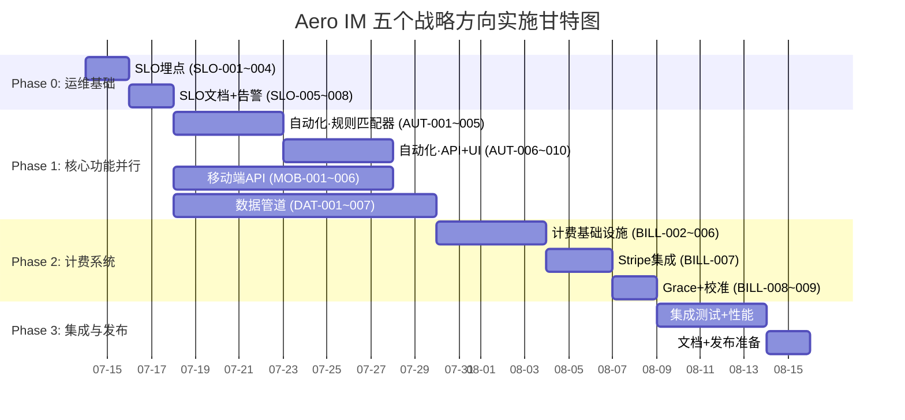

Now I have a thorough understanding of the codebase structure. Here's the comprehensive Tech Lead analysis:

---

# Tech Lead 分析报告：五个战略扩展方向

> **日期**: 2026-07-12
> **基于**: `docs/requirements/2026-07-10-five-strategic-expansion-directions.md`
> **代码库基线**: 16 crates, 157 migrations, ~25K Rust, ~5.9K Web SPA
> **当前 crate 结构**: `crates/aero-{common,storage,server,bus,auth,...}`, 路由位于 `crates/aero-server/src/routes/routes.rs` 单点装配

---

## 1. 任务分解

### 方向①（P1）：零代码工作流自动化引擎

| 任务 ID | 标题 | 涉及文件 | 前置依赖 | 工时 | 验收标准 |
|---------|------|---------|---------|------|---------|
| **AUT-001** | `automation_rules` 表迁移 + 仓储 | `migrations/0158_automation_rules.sql`, `crates/aero-storage/src/automation_rule.rs` | 无 | 3h | 表含 id, name, workspace_id, creator_id, trigger_kind, trigger_config(JSONB), action_kind, action_config(JSONB), enabled, max_executions, created_at, updated_at; 仓储提供 CRUD + list_by_trigger_kind(workspace, kind) |
| **AUT-002** | 规则匹配器引擎 | `crates/aero-server/src/automation_engine.rs` | AUT-001 | 4h | 输入 `RoomEvent` → 按 trigger_kind 索引查匹配规则 → 评估条件(trigger_config) → 输出 `(rule, action_kind, action_config)` 有序列表 |
| **AUT-003** | 动作执行器 trait + 3 个 impl | `crates/aero-server/src/automation_actions.rs` | AUT-002 | 3h | trait `AutomationAction { async fn execute(&self, rule, action_config, event) → Result }`; 三个 impl: SendMessage(复用 bot/direct_message 路径), CreateTask(复用 approvals/tasks), CallWebhook(复用 webhook/delivery) |
| **AUT-004** | bus 钩子：事件→规则引擎 | `crates/aero-server/src/automation_engine.rs` (接线到 `bot_dispatch.rs` 或新 bus consumer) | AUT-002, AUT-003 | 2h | NATS durable consumer `aero-automation` 监听 `im.room.*` + `live.stream.*`; 经过频率/类型过滤后喂给规则匹配器 |
| **AUT-005** | 防循环守卫 + 速率限制 | `crates/aero-server/src/automation_engine.rs` | AUT-004 | 2h | `max_depth = 3` 在动作 context 中追踪深度; `same_action_guard` 60s 内同一房间相同规则不重复; 仅允许低频触发器(消息创建/成员变更/直播状态/定时) |
| **AUT-006** | REST API：规则 CRUD | `crates/aero-server/src/automation_rules.rs` (路由模块) | AUT-001 | 2h | `POST/GET /api/workspaces/:id/automation-rules`, `PATCH/DELETE /api/automation-rules/:id`; 创建者 deactivate 时 cascade 停用; 校验 `action_config` schema 合法性 |
| **AUT-007** | 执行历史 + 调试日志 | `migrations/0159_automation_executions.sql`, `crates/aero-storage/src/automation_execution.rs`, `crates/aero-server/src/automation_rules.rs` | AUT-004 | 2h | `automation_executions` 表记录 rule_id, event_summary, result, error, duration_ms; `GET /api/automation-rules/:id/executions` 分页列表 |
| **AUT-008** | 定时触发器实现 | `crates/aero-server/src/automation_engine.rs` + 复用 `scheduled.rs` | AUT-002 | 2h | 每日/每周/自定义 cron 规则 → 规则匹配器触发无事件动作; 复用既有 `cron` 解析 + NextTick 调度 |
| **AUT-009** | 规则 UI (Web 表单) | `web/automation.js`, `web/automation.html` (或集成到现有管理面板) | AUT-006 | 6h | 表单驱动的条件-动作配置: 选择触发器类型 → 填写条件参数 → 选择动作类型 → 填写配置; 规则列表页 + 启用/停用 toggle + 执行历史查看 |
| **AUT-010** | 接线到 `routes.rs` + 测试 | `crates/aero-server/src/routes/routes.rs`, 集成测试 | AUT-006 至 AUT-009 | 2h | `.merge(crate::automation_rules::routes())` 加入 routes.rs; 集成测试覆盖触发器匹配、动作执行、防循环 |

**方向① 小计**: 28 工时 (3.5 人天)

---

### 方向②（P2）：Mobile-First API 面

| 任务 ID | 标题 | 涉及文件 | 前置依赖 | 工时 | 验收标准 |
|---------|------|---------|---------|------|---------|
| **MOB-001** | 字段投影: `?fields=` 参数 | `crates/aero-server/src/routes/routes.rs` (room_history handler), `common/src/model/message.rs` (serialize) | 无 | 1.5h | `GET /api/rooms/:id/messages?fields=id,blocks,sender_id,created_at` 返回只包含指定字段; 缺少 fields 参数时行为不变(向后兼容) |
| **MOB-002** | 未读房间汇总端点 | `crates/aero-server/src/routes/routes.rs` (新路由), `crates/aero-storage/src/read_state.rs` (新查询) | 无 | 2h | `GET /api/me/unread-rooms` 返回 `[{room_id, unread_count, last_message_summary, last_activity_at}]`; 走 `read_state` 表聚合查询, O(N) 可控 |
| **MOB-003** | 增量同步: `?since=` 优化 | `crates/aero-server/src/routes/routes.rs` (room_history), `crates/aero-storage/src/message.rs` | MOB-001 | 3h | `GET /api/rooms/:id/delta?since=<seq>` 返回 seq 之后的新建/编辑/删除消息; 上限 7 天回退到全量分页; 需要 `messages_room_created_idx` 索引覆盖 seq |
| **MOB-004** | Push inline reply | `crates/aero-server/src/push_inline_reply.rs`, `crates/aero-push/src/lib.rs` (扩展) | 无 | 3h | `POST /api/push/reply/<notification_id>` 接受 `{text}`; 验证一次性 token(TTL 5min); 定位到原房间+原线程; 以原 sender 身份发消息; FCM/APNs 通知包含 inline reply action |
| **MOB-005** | 缩略图端点 (on-the-fly) | `crates/aero-server/src/thumbnail.rs`, `Cargo.toml` (加 `image` crate) | 无 | 4h | `GET /api/blobs/:id/thumb?w=200&h=200` 返回等比例缩放 jpeg; 缓存生成结果到 blob_store 并设 TTL; 原图 < 50KB 跳过缩略图直接返回 |
| **MOB-006** | API 版本化中间件 | `crates/aero-server/src/routes/routes.rs` (中间件), `common/src/header.rs` | 无 | 1h | 中间件解析 `X-API-Version` 头; 请求路由到对应版本的 handler (v1 作为默认); 响应头 `X-API-Version: v1`; 版本不匹配返回 400 含支持版本列表 |

**方向② 小计**: 14.5 工时 (1.8 人天)

---

### 方向③（P2）：事件数据管道与分析引擎

| 任务 ID | 标题 | 涉及文件 | 前置依赖 | 工时 | 验收标准 |
|---------|------|---------|---------|------|---------|
| **DAT-001** | Event Lake durable consumer | `crates/aero-server/src/event_lake.rs`, `crates/aero-server/src/bin/boot/background.rs` | 无 | 3h | 新 NATS durable consumer `event-lake` 监听 `im.room.*` + `live.stream.*` + 审计事件; 写入 JSONL 到 `AERO_BLOB_DIR/event-lake/{date}/` 或 S3 路径; 写入前脱敏 participant_id → hash |
| **DAT-002** | 使用分析事件注册表 | `crates/aero-server/src/event_lake.rs` (事件过滤) | DAT-001 | 1h | 仅持久化有分析价值的事件类型: Message, Edited, Deleted, Reaction, StreamChat, StreamGift, CallSession, FileUpload; 排除: typing, presence, read_receipt |
| **DAT-003** | 事件格式 + schema 版本 | `common/src/model/event.rs` (扩展) | DAT-001 | 1h | 每行 JSON 含 `{event_kind, event_version: 1, seq, room_id, workspace_id, timestamp, data}`; `data` JSONB 存储事件具体 payload; event_version 字段支持 schema 演化 |
| **DAT-004** | 看板 API: 预聚合查询 | `crates/aero-server/src/admin_analytics.rs`, `crates/aero-storage/src/admin_analytics.rs` | 无 | 3h | `GET /api/admin/analytics/{metric}?from=&to=&granularity=` 支持 metrics: messages, users_active, search_queries, ai_tokens; granularity 支持 hour/day/week/month |
| **DAT-005** | 审计事件流：PG→Bus | `crates/aero-server/src/audit_publisher.rs`, `crates/aero-storage/src/audit.rs` (扩展) | 无 | 2h | 软删/ban/角色变更/设置变更等审计操作在提交后 publish 到 NATS subject `audit.tenant.{id}`; event-lake consumer 捕获写入湖 |
| **DAT-006** | CSV 用量导出 | `crates/aero-server/src/usage_report.rs` (扩展) | DAT-004 | 1.5h | `GET /api/workspaces/:id/usage/csv?from=&to=` 返回 CSV (Response `Content-Disposition: attachment`); 包含消息数/AI Token/存储用量/成员数按日细分 |
| **DAT-007** | 存储/带宽成本核算 | `crates/aero-storage/src/usage_report.rs` (扩展), `crates/aero-server/src/usage_report.rs` (扩展) | DAT-004 | 2h | `UsageReport` 新增 `estimated_storage_cost_cents`, `estimated_bandwidth_cost_cents`, `estimated_ai_cost_cents`; 基于硬编码单价计算(可配置 `AERO_COST_PER_*` env) |

**方向③ 小计**: 13.5 工时 (1.7 人天)

---

### 方向④（P2）：SLO 框架与运维闭环

| 任务 ID | 标题 | 涉及文件 | 前置依赖 | 工时 | 验收标准 |
|---------|------|---------|---------|------|---------|
| **SLO-001** | API 延迟直方图埋点 | `crates/aero-server/src/metrics.rs`, `crates/aero-common/src/metrics.rs` | 无 | 2h | `aero_api_duration_ms` 直方图 labels: `method`, `route`, `status`; 从已有 `http_metrics_layer` 扩展 duration bucket; bucket 分布: [5, 10, 25, 50, 100, 250, 500, 1000, 2500, 5000] |
| **SLO-002** | 消息扇出延迟直方图 | `crates/aero-server/src/hub.rs` | 无 | 1h | `aero_messages_fanout_latency_ms` 直方图: 从 bus 收到 → fan_out_raw 完成; hub.rs 的 `fan_out_raw` 入口和出口计时 |
| **SLO-003** | WebSocket 连接稳定性指标 | `crates/aero-server/src/metrics.rs`, `crates/aero-server/src/ws/mod.rs` | 无 | 1h | `aero_ws_disconnects_total` (label: reason), `aero_ws_reconnects_total` (gauge: 当前重连中连接数); `ws/mod.rs` 的 disconnect handler 记录原因 |
| **SLO-004** | AI 任务成功率指标 | `crates/aero-ai/src/worker/mod.rs` (或已有 `ai_job` 计数) | 无 | 1h | `aero_ai_job_success_rate` = rate(success) / rate(attempts); 复用已有 `ai_usage` 表的计数(需暴露到 Prometheus) |
| **SLO-005** | SLO 定义文档 | `docs/slo.md` | SLO-001 至 SLO-004 | 2h | 定义每个 SLI 的目标: API 可用性 ≥99.9%(28d), API p95 ≤500ms(28d), 消息扇出 p99 ≤200ms(7d), WS 断连率 ≤5%(1h), AI 成功率 ≥99%(7d); 窗口期 + 燃烧率告警规则 |
| **SLO-006** | PrometheusRule + Grafana dashboard | `monitoring/prometheus/rules.yml`, `monitoring/grafana/dashboards/slo.json` | SLO-005 | 3h | 燃烧率告警: 2h 内消耗 10% 错误预算 → Pager; 6h 内消耗 30% → P2; 剩余错误预算 > 50% → green, 20-50% → yellow, < 20% → red |
| **SLO-007** | On-Call runbook | `docs/runbook/` (新目录) | SLO-005 | 3h | 3-5 个常见故障场景: PG 连接池耗尽、NATS consumer lag、Redis 不可用、AI 上游超时、磁盘空间满; 每个场景含诊断命令、恢复步骤、升级路径 |
| **SLO-008** | 错误预算面板 | `monitoring/grafana/dashboards/error-budget.json` | SLO-006 | 1.5h | Grafana single-stat 显示每个 SLO 的剩余错误预算 % + 燃烧率 + 达成状态; 30 天窗口滑动计算 |

**方向④ 小计**: 14.5 工时 (1.8 人天)

---

### 方向⑤（P2）：多租户用量计费基础设施

| 任务 ID | 标题 | 涉及文件 | 前置依赖 | 工时 | 验收标准 |
|---------|------|---------|---------|------|---------|
| **BILL-001** | 成本估算端点 | `crates/aero-server/src/usage_report.rs` (扩展) | DAT-007 (单价配置) | 2h | `GET /api/workspaces/:id/usage/cost-estimate` 返回 `{total_est_cents, breakdown: {messages, ai_tokens, storage_gb, bandwidth_gb}}`; 基于 `AERO_COST_PER_*` 环境变量(有默认值) |
| **BILL-002** | `ai_usage` 增加成本列 | `migrations/0160_ai_usage_cost.sql`, `crates/aero-storage/src/ai_usage.rs` (写路径) | 无 | 1.5h | `ai_usage.cost_in_cents` INT NOT NULL DEFAULT 0; `ai_usage.cost_per_token_micro_cents` INT (快照单价); 写入时根据模型计算成本 |
| **BILL-003** | `plan_tiers` 表 + 仓储 | `migrations/0161_plan_tiers.sql`, `crates/aero-storage/src/plan_tier.rs` | 无 | 2.5h | `plan_tiers(id, name, max_members, max_storage_bytes, max_ai_tokens_monthly, max_bandwidth_gb, price_cents_monthly, is_custom, created_at)`; `WorkspacePlanRepo` CRUD |
| **BILL-004** | 工作区-计划关联表 + 迁移 | `migrations/0162_workspace_plans.sql`, `crates/aero-storage/src/workspace_plan.rs` | BILL-003 | 1.5h | `workspace_plans(workspace_id PK, plan_tier_id, status: active/grace_period/suspended, billing_start, grace_end, stripe_subscription_id?)`; 当前计划查询 |
| **BILL-005** | 配额检查中间件 | `crates/aero-server/src/plan_enforcement.rs`, `crates/aero-server/src/routes/routes.rs` (中间件) | BILL-004 | 3h | `PlanEnforcementLayer`: 在每个 mutating 操作前校验配额(成员数/存储/AI Token); 超限返回 402 `{error: "quota_exceeded", plan: "free", upgrade_url}`; fail-open: DB 不可达时跳过检查 |
| **BILL-006** | 配额中间件接线 + 路由 | `crates/aero-server/src/plan_enforcement.rs` (实现), `crates/aero-server/src/routes/routes.rs` | BILL-005 | 1h | 路由级中间件应用到: `POST /api/messages`, `POST /api/blobs`, `POST /api/ai/ask` 等; 排除只读 GET 路由 |
| **BILL-007** | Stripe Webhook receiver | `crates/aero-server/src/stripe_webhook.rs`, `migrations/0163_stripe_events.sql` (幂等键) | BILL-004 | 4h | `POST /api/stripe/webhook` 验证签名; 处理 `checkout.session.completed`, `customer.subscription.updated/deleted`; 更新 `workspace_plans.status`; 幂等键防重放 |
| **BILL-008** | 用量超限 Grace Period 定时器 | `crates/aero-server/src/bin/boot/background.rs`, `crates/aero-server/src/plan_grace.rs` | BILL-005 | 2h | 每日定时器扫描超限工作区; 超出后 7 天 grace → 自动降级到 Free(或自定义策略); 超限通知(发送给 workspace owner) |
| **BILL-009** | 每日用量校准任务 | `crates/aero-server/src/bin/boot/background.rs` | BILL-002, BILL-004 | 1.5h | 每日校准: `SELECT SUM(size) FROM blobs WHERE workspace_id IN (SELECT id FROM workspaces)` 刷新计数器; 记录校准日志 |

**方向⑤ 小计**: 19 工时 (2.4 人天)

---

### 跨方向基础设施

| 任务 ID | 标题 | 涉及文件 | 前置依赖 | 工时 | 验收标准 |
|---------|------|---------|---------|------|---------|
| **INFRA-001** | `AERO_COST_PER_*` 配置项 | `crates/aero-common/src/config.rs`, `.env.example`, `config.example.toml` | 无 | 0.5h | `AERO_COST_PER_MESSAGE_MICRO_CENTS`, `AERO_COST_PER_AI_TOKEN_MICRO_CENTS`, `AERO_COST_PER_STORAGE_GB_CENTS`, `AERO_COST_PER_BANDWIDTH_GB_CENTS` 可配置 |

**总工时**: 方向① 28h + 方向② 14.5h + 方向③ 13.5h + 方向④ 14.5h + 方向⑤ 19h + INFRA-001 0.5h = **90 工时** (约 11.25 人天 / 2-3 Sprint)

---

## 2. 执行顺序与依赖图

```mermaid
graph TD
    %% 方向④ — 最低成本, 建议立即启动
    subgraph "Phase 0: 运维基础 (Sprint 1, Week 1)"
        SLO001[SLO-001 API延迟直方图]
        SLO002[SLO-002 消息扇出延迟]
        SLO003[SLO-003 WS稳定性指标]
        SLO004[SLO-004 AI任务成功率]
        SLO005[SLO-005 SLO定义文档]
        SLO006[SLO-006 PrometheusRule+Grafana]
        SLO007[SLO-007 On-Call runbook]
        SLO008[SLO-008 错误预算面板]
        INFRA001[INFRA-001 成本配置项]
        
        SLO001 --> SLO005
        SLO002 --> SLO005
        SLO003 --> SLO005
        SLO004 --> SLO005
        SLO005 --> SLO006
        SLO005 --> SLO007
        SLO006 --> SLO008
    end

    %% 方向① — P1 产品差异化, 独立 track
    subgraph "Phase 1: 自动化引擎 (Sprint 1-2)"
        AUT001[AUT-001 规则表+仓储] 
        AUT002[AUT-002 规则匹配器引擎] --> AUT003
        AUT002 --> AUT004[AUT-004 bus钩子]
        AUT003[AUT-003 动作执行器trait+impl]
        AUT004 --> AUT005[AUT-005 防循环守卫]
        AUT002 --> AUT006[AUT-006 REST API规则CRUD]
        AUT006 --> AUT008[AUT-008 定时触发器]
        AUT004 --> AUT007[AUT-007 执行历史]
        AUT001 --> AUT002
        AUT001 --> AUT006
        AUT005 --> AUT010[AUT-010 接线routes.rs+测试]
        AUT006 --> AUT009[AUT-009 规则UI web表单]
        AUT009 --> AUT010
        AUT007 --> AUT010
        AUT008 --> AUT010
    end

    %% 方向② — 独立 track
    subgraph "Phase 1: 移动端基础 (Sprint 1-2)"
        MOB001[MOB-001 字段投影] 
        MOB002[MOB-002 未读房间汇总]
        MOB003[MOB-003 增量同步]
        MOB004[MOB-004 Push inline reply]
        MOB005[MOB-005 缩略图端点]
        MOB006[MOB-006 API版本化]
        
        MOB001 --> MOB003
    end

    %% 方向③ — 方向⑤ 的前置依赖
    subgraph "Phase 1: 数据管道 (Sprint 1-3) "
        DAT001[DAT-001 Event Lake consumer]
        DAT002[DAT-002 分析事件过滤] --> DAT001
        DAT003[DAT-003 事件格式+版本] --> DAT001
        DAT001 --> DAT004[DAT-004 看板API]
        DAT001 --> DAT005[DAT-005 审计事件流]
        DAT004 --> DAT006[DAT-006 CSV用量导出]
        DAT004 --> DAT007[DAT-007 存储/带宽成本核算]
        INFRA001 --> DAT007
    end

    %% 方向⑤ — 依赖方向③
    subgraph "Phase 2: 计费系统 (Sprint 3-4)"
        DAT007 --> BILL001[BILL-001 成本估算端点]
        BILL002[BILL-002 ai_usage成本列] 
        BILL003[BILL-003 plan_tiers表]
        BILL003 --> BILL004[BILL-004 工作区-计划关联]
        BILL004 --> BILL005[BILL-005 配额检查中间件]
        BILL005 --> BILL006[BILL-006 配额中间件接线]
        BILL004 --> BILL007[BILL-007 Stripe Webhook]
        BILL004 --> BILL008[BILL-008 Grace Period定时器]
        BILL005 --> BILL009[BILL-009 每日用量校准]
    end

    %% 关键路径 highlight
    classDef critical fill:#f96,stroke:#333,stroke-width:2px
    classDef revenue fill:#6f9,stroke:#333,stroke-width:2px
    class AUT001,AUT002,AUT004,AUT005,AUT010 critical
    class BILL005,BILL007 revenue
```



### 并行执行组

| 组 | 包含任务 | 负责人数 | Sprint |
|----|---------|---------|-------|
| **G1: 运维基础** | SLO-001 至 SLO-008 | 1 人 | S1 |
| **G2: 自动化引擎 (P1)** | AUT-001 至 AUT-010 | 2 人并行 (后端+前端) | S1-S2 |
| **G3: 移动端 API** | MOB-001 至 MOB-006 | 1 人 | S1-S2 |
| **G4: 数据管道** | DAT-001 至 DAT-007 | 1-2 人 | S1-S3 |
| **G5: 计费系统** | BILL-001 至 BILL-009 | 1-2 人 (依赖 G4 的 DAT-007) | S3-S4 |

---

## 3. 技术风险

### 3.1 方向①：自动化引擎

| 风险 | 概率 | 影响 | 应对 |
|------|------|------|------|
| **循环触发导致无限递归** | 高 | 高 (资源耗尽) | `max_depth = 3` + 60s 相同动作去重 + `detected_cycle` Prometheus 告警。**已在边界条件中考虑，但实现时极易遗漏** |
| **规则数量膨胀→O(N) 事件匹配** | 中 | 中 (延迟增加) | 触发器类型索引 (Redis Sorted Set 缓存活跃规则); 可在规则启用/停用时刷新缓存, 不用每次事件查 PG |
| **动作执行失败静默** | 中 | 中 (用户以为规则工作了但没) | 执行日志 + 可选的失败通知给规则创建者 (邮件/站内信); 每 10 次失败自动停用规则 |
| **规则创建者权限变更** | 低 | 中 (僵尸 bot) | 执行时复用 `BotRepo::send_message` 的 room_access 校验; 创建者 deactivate 时 cron 停用规则 |
| **动作执行器与既有 bot 架构的集成边界不清晰** | 中 | 中 (设计争议) | SendMessage 动作复用一个轻量 `SystemParticipant` (类似 `agent_bot` 的 bot 身份), 不走完整 `bot_dispatch`; 单独开辟 `automation_actions.rs` |
| **UI 复杂度高(拖拽编辑器 vs 表单)** | 中 | 中 (工时估计) | **MVP 坚决不做拖拽编辑器**。REST API + 表单驱动的「选择触发器类型 → 填写参数 → 选择动作类型 → 填写参数」。Slack Workflows 第一版也是表单 |

### 3.2 方向②：移动端 API

| 风险 | 概率 | 影响 | 应对 |
|------|------|------|------|
| **字段投影导致 Axum serde 序列化复杂性** | 中 | 低 | 使用 `#[serde(skip_serializing_if = "Option::is_none")]` + 运行时构建 `serde_json::Value`; 不要用宏生成 N 个变体 |
| **增量 sync 游标过大 (用户离线一周)** | 中 | 低 | 设置 7 天上限, 超限返回 302 指引全量端点 |
| **缩略图 on-the-fly 导致首次请求慢** | 高 | 中 | 异步生成 + 缓存到 blob_store; 首次请求直接返回原图并后台生成; 或预生成 (上传后立即创建缩略图) |
| **Push inline reply 的安全模型** | 中 | 高 (被滥用) | 一次性 token (TTL 5min, single-use); 绑定到 notification_id + user_id + device_id; FCM/APNs 通知 payload 只含 token + room_id |

### 3.3 方向③：数据管道

| 风险 | 概率 | 影响 | 应对 |
|------|------|------|------|
| **NATS consumer lag 导致事件湖写入瓶颈** | 低 | 中 | 异步写入 (tokio::spawn + bounded channel); 使用 S3 multipart upload 批量写入; 注意 durable consumer 的 ack 策略——先写本地缓冲再 ack |
| **事件 Schema 演化导致分析查询断裂** | 中 | 中 | JSONB 存储 + `event_version` 字段; 查询时按版本解析; 写入时保留原始 payload |
| **存储成本不可控** | 中 | 中 | 设置 retention: 原始事件 90 天 + 聚合数据永久; 使用 S3 Lifecycle Policy 自动清理; 大于 1MB 的事件 payload 裁剪或排除 |
| **GDPR 删除一致性** | 高 | 高 (合规风险) | 事件湖写入时脱敏 (participant_id → SHA256 hash); 分析聚合不包含个人数据; `delete_me` 路径扩展事件湖的脱敏记录标记 |

### 3.4 方向④：SLO

| 风险 | 概率 | 影响 | 应对 |
|------|------|------|------|
| **告警配置不当导致疲劳** | 中 | 中 (告警被忽略) | 燃烧率告警 (每 1h 消耗 > 5% 错误预算才触发) 而非固定阈值; 告警需持续 5min 才 fire; 所有告警必须有 runbook |
| **SLI 目标设置过高** | 中 | 低 | 初期 99.9% (月 ~43min 故障), 下一个迭代再考虑 99.95%; 业务非核心实时系统, 不需要 99.99% |
| **延迟直方图的 bucket 配置不合理** | 低 | 低 | 使用对数分布 [5, 10, 25, 50, 100, 250, 500, 1000, 2500, 5000]; 重点观察 p50(用户感知), p95(长尾), p99(异常) |

### 3.5 方向⑤：计费

| 风险 | 概率 | 影响 | 应对 |
|------|------|------|------|
| **计费门控 fail-open vs fail-close 选择错误** | 高 | 高 (PR 灾难或收入损失) | **初期 fail-open**: 计费系统不可达时允许操作通过, 记录异常告警。收入损失 < PR 灾难。达到收入规模后再改为 fail-close |
| **计划配额计算与存储实际不一致** | 中 | 高 (计费争议) | 每日校准: `SELECT SUM(size) FROM blobs` 刷新计数器; 在 billing cycle 结束时以校准后数字为准 |
| **AI Token 单价变化** | 中 | 中 | `ai_usage.cost_per_token_micro_cents` 字段快照记录时单价; 历史账单不受调价影响 |
| **Stripe Webhook 幂等性** | 中 | 高 (重复收费) | Webhook 幂等键 (Stripe `Idempotency-Key` header); 实现 `stripe_events` 表记录已处理的 event_id; 重复事件跳过 |
| **企业客户定制合同无法映射到标准 tier** | 中 | 中 | `plan_tiers.is_custom = true` 跳过自动计费检查; 允许手动设置配额覆盖 |

---

## 4. 资源评估

### 4.1 团队建议

| 角色 | 技能要求 | 数量 | 负责方向 |
|------|---------|------|---------|
| **资深 Rust 后端 (SDE III+)** | Rust/async/sqlx/NATS/Axum, 精通既有架构 | 2 人 | 方向① (自动化引擎核心) + 方向③ (数据管道) |
| **全栈工程师** | Rust + JS/ES2020, 既熟悉后端也熟悉 web | 1 人 | 方向① UI + 方向② 移动端 API |
| **DevOps/基础设施工程师** | Prometheus/Grafana/Docker, 了解 SRE 实践 | 1 人 (兼职) | 方向④ SLO (~14h 工作量, 可兼职) |
| **后端工程师** | Rust/PG/Stripe 集成经验 | 1 人 | 方向⑤ 计费系统 |

**最小可行团队**: 3 人 (2 Rust 后端 + 1 全栈)

### 4.2 关键里程碑

| 里程碑 | 时间 | 交付物 | 依赖 |
|-------|------|--------|------|
| **M1: SLO 基线建立** | Sprint 1 Week 1 (Day 5) | 延迟/错误率直方图部署到生产; SLO 文档 v1; PrometheusRule 就绪 | SLO-001 至 SLO-006 |
| **M2: 自动化引擎 MVP** | Sprint 2 Week 1 (Day 10) | 规则 CRUD API + 消息/成员变更触发器 + 发消息/发 webhook 动作; 可通过 curl 创建和测试规则 | AUT-001 至 AUT-006 |
| **M3: 自动化引擎完整版** | Sprint 2 Week 2 (Day 15) | Web UI 表单配置规则; 定时触发; 执行历史; 防循环守卫 | AUT-007 至 AUT-010 |
| **M4: 移动 API 基础** | Sprint 2 Week 2 (Day 15) | 字段投影、未读汇总、增量同步、缩略图端点全部部署 | MOB-001 至 MOB-006 |
| **M5: 事件湖就绪** | Sprint 3 Week 1 (Day 20) | Event Lake 写入 S3; 看板 API 返回预聚合数据; 审计事件流接线 | DAT-001 至 DAT-005 |
| **M6: 计费系统 MVP** | Sprint 4 Week 1 (Day 30) | 成本估算端点; plan_tiers 定义; 配额检查中间件(storage 门控); Stripe Webhook 接收 | BILL-001 至 BILL-007 |
| **M7: 计费系统完整版** | Sprint 4 Week 2 (Day 35) | Grace Period 定时器; 每日校准; 超限通知 | BILL-008, BILL-009 |

### 4.3 阻塞点 (Blockers) 与解决策略

| # | 阻塞点 | 影响范围 | 解决策略 | 责任人 |
|---|--------|---------|---------|-------|
| B1 | 方向③ 的 Event Lake 需要决定 S3/MinIO 接入(是走既有 `S3BlobStore` 还是新写入器) | DAT-001 | 复用 `AERO_S3_*` 配置 + `S3BlobStore::put` 以 JSONL key 写入同一 bucket 的 `event-lake/` 前缀下, 不引入新配置 | Tech Lead |
| B2 | 方向① 的规则执行者身份(用哪个 participant_id 发消息) | AUT-003 | 使用 `SystemParticipant { id: "automation-{rule_id}", display_name: "Automation" }` 类似 agent_bot 的身份; 需要 `BotRepo` 支持 dynamic creation of automation bot | 后端 |
| B3 | 方向⑤ 的配额检查和 AI 预算(既有 `ai_usage.rs` 的 `CostBudget` 在新的 plan_enforcement 中如何共存) | BILL-005 | `plan_enforcement` 作为**外层硬门控**(按工作区月配额), 内层 `CostBudget` 作为**内层软限流**(60s 窗口), 两者独立不冲突 | Tech Lead + 后端 |
| B4 | Stripe 集成需要测试账号 / 无法在 CI 测试 | BILL-007 | Stripe 测试模式 + `stripe-webhook` 签名验证可本地 mock; CI 中用 `--cfg test` gate 跳过; 集成测试走 `stripe-mock` Docker image | DevOps |

---

## 5. 质量保证

### 5.1 单元测试覆盖要求

| 模块 | 最小覆盖率 | 关键测试点 |
|------|-----------|-----------|
| `automation_engine.rs` | 85% | 规则匹配(多种 trigger_kind)、条件评估、防循环守卫(max_depth 边界)、空规则集、无匹配事件 |
| `automation_actions.rs` | 80% | 每个动作类型(发消息/创建任务/webhook)的 execute + 失败行为; bot 身份权限校验 |
| `plan_enforcement.rs` | 85% | 各配额类型校验(成员数/存储/AI Token)、超限=402、fail-open(DB 不可达)、grace 期内行为 |
| `event_lake.rs` | 75% | 事件脱敏、事件过滤(允许列表/排除列表)、Schema 版本写入、大 payload 裁剪 |
| `metrics.rs` (SLO) | 80% | 直方图边界 bucket 分布、标签 cardinality 控制(确认 route template 而非 concrete id) |
| `push_inline_reply.rs` | 85% | token 生成+验证(TTL/single-use)、回复定位(原房间线程)、失败回退 |
| `stripe_webhook.rs` | 80% | 签名验证失败→401; 幂等键跳过重复; `checkout.session.completed` 事件处理 |

### 5.2 集成测试策略

| 测试域 | 策略 | 工具/方法 |
|--------|------|----------|
| **方向① 自动化端到端** | 创建规则 → 发送触发事件 → 验证动作执行 | `#[sqlx::test]` 全栈集成测试; 使用 `EventBus::fake` 或 `NATS::jetstream` test container |
| **方向② 增量同步** | 建立消息序列 → 调用 delta endpoint → 验证返回正确 diff | 参数化测试: 0 增量、单条、批量(1000+)、跨越 7 天阈值回落全量 |
| **方向③ 事件湖写入 + 读取** | 写 JSONL 到本地 temp → 验证格式 + 脱敏 + retention | 本地文件系统模拟 S3; 验证脱敏字段 |
| **方向④ SLI 埋点正确性** | 发送已知负载 → 检查 `/metrics` 输出包含预期 metric | HTTP GET `/metrics` + regex parse; 验证 bucket 计数合理 |
| **方向⑤ 配额门控** | 设置配额上限 → 触发超限操作 → 验证 402 + 消息不持久化 | 参数化: 成员超限、存储超限、AI Token 超限、grace 期内降级 |

### 5.3 代码审查要点

| 审查维度 | 检查项 |
|---------|--------|
| **安全** | 方向② Push Reply 的 token 是一次性且有时效的吗? 方向⑤ 计费门控是 fail-open 吗(确认不是 fail-close)? 方向① 规则有深度限制吗? |
| **幂等性** | 方向① 事件触发重复处理会导致重复动作吗? 方向⑤ Stripe webhook 有幂等键吗? |
| **并发安全** | 方向① 规则匹配器在多线程下有竞争吗(用 `tokio::sync::RwLock` 还是无锁)? 方向③ event-lake 写入有 channel backpressure 吗? |
| **可观测** | 每个新组件有 Prometheus 指标/日志吗? 方向① 自动化执行有 `tracing::info` 吗? 方向④ SLI 直方图有 `route` template 标签吗(不是 concrete id)? |
| **向后兼容** | 方向② `?fields=` 参数缺省行为不变吗? 方向③ 现有 `analytics.rs` 不受影响吗? |
| **配置管理** | 方向⑤ `AERO_COST_PER_*` 是否有合理默认值 + `.env.example` 文档? |

### 5.4 性能测试需求

| 场景 | 负载参数 | 验收标准 | 优先级 |
|------|---------|---------|--------|
| 方向① 规则匹配(100 条活跃规则) | 每秒钟 1000 个 `im.room.*` 事件 | 规则匹配延迟 p99 < 5ms | P1 |
| 方向① 动作执行(发消息) | 每秒 100 个规则匹配 → 发消息 | 消息发送延迟 p99 < 200ms | P1 |
| 方向② 增量同步(10K 消息房间) | 连续 30 秒请求 `?since=` | 响应时间 p95 < 100ms | P2 |
| 方向③ Event Lake 写入 | 每秒 500 条事件写入 S3 | 写入延迟 p99 < 50ms; 无 consumer lag 增长 | P1 |
| 方向⑤ 配额检查 | 每秒 500 个 mutating 操作 + 配额检查 | 配额检查增加延迟 < 5ms; fail-open 下无额外延迟 | P2 |

---

## 6. 实施计划 (时间线)

### 阶段 0: 基础设施与准备 (Sprint 0, ~3 天)

```
Day 1-2: SLO 埋点
  - SLO-001 API 延迟直方图
  - SLO-002 消息扇出延迟直方图
  - SLO-003 WS 稳定性指标
  - SLO-004 AI 任务成功率
Day 3: SLO 文档 + 配置
  - SLO-005 SLO 定义文档
  - SLO-006 PrometheusRule + Grafana
  - INFRA-001 成本配置项
```

**产出**: 生产环境已有延迟/错误率直方图; SLO 文档 v1; PrometheusRule 就绪可告警。

### 阶段 1: 核心功能并行开发 (Sprint 1-2, ~2 周 = 10 工作日)

**Track A — 自动化引擎 (2 人)**

```
Sprint 1 (Week 1-2):
  Day 1-2:   AUT-001 规则表 + 仓储 (1人)
  Day 2-3:   AUT-002 规则匹配器引擎 (1人)
  Day 3-4:   AUT-003 动作执行器 (1人)
  Day 4-5:   AUT-004 bus 钩子 (1人)
  Day 5-6:   AUT-005 防循环守卫 (1人)
  Day 5-7:   AUT-006 REST API 规则 CRUD (1人)
Day 8-10 (Sprint 2):
  Day 8-9:   AUT-007 执行历史 (1人)
  Day 8-9:   AUT-008 定时触发器 (1人)
  Day 9-10:  AUT-009 Web UI (全栈)
  Day 10:    AUT-010 接线 + 集成测试 (两队合并)
```

**Track B — 移动端 API (1 人)**

```
Sprint 1 (Week 1-2):
  Day 1:     MOB-001 字段投影
  Day 2-3:   MOB-002 未读房间汇总
  Day 3-4:   MOB-003 增量同步
  Day 5-6:   MOB-004 Push inline reply
  Day 7:     MOB-006 API 版本化
  Day 8-9:   MOB-005 缩略图端点
  Day 10:    集成测试 + 文档
```

**Track C — 数据管道 (1 人)**

```
Sprint 1-2 (Week 1-2):
  Day 1-2:   DAT-001 Event Lake consumer
  Day 2-3:   DAT-002 + DAT-003 事件过滤 + 格式
  Day 4-5:   DAT-005 审计事件流
  Day 6-8:   DAT-004 看板 API (预聚合查询)
  Day 9-10:  DAT-006 + DAT-007 CSV导出 + 成本核算
```

### 阶段 2: 计费系统 + SLO 完善 (Sprint 3-4, ~2 周 = 10 工作日)

**Track D — 计费系统 (1-2 人)**

```
Sprint 3 (Week 3-4):
  Day 1-2:   BILL-002 ai_usage 成本列
  Day 2-3:   BILL-003 plan_tiers 表 + 仓储
  Day 3-4:   BILL-004 工作区-计划关联
  Day 4-6:   BILL-005 配额检查中间件
  Day 6-7:   BILL-006 中间件接线
  Day 7-9:   BILL-007 Stripe Webhook
  Day 9-10:  BILL-008 Grace Period + BILL-009 校准
  
  (BILL-001 依赖于 DAT-007, 在 DAT-007 完成后立即执行)
```

**Track E — SLO 完善 (DevOps, 兼职)**

```
Sprint 3 (Week 3-4):
  穿插完成 SLO-007 (On-Call runbook) + SLO-008 (错误预算面板)
  以及 SLO-001 至 SLO-006 的 bugfix + 调参
```

### 阶段 3: 集成测试与优化 (Sprint 5, ~1 周 = 5 工作日)

```
Day 1-2:   跨方向集成测试
  - 自动化触发 → 发送消息 → 移动端增量同步推送到端
  - 事件湖消费 → 看板 API 数据正确
  - 配额超限 → 402 → 支付 → 自动解除
Day 3-4:   性能测试 + 调优
  - 规则匹配器 (100 规则 × 1000 事件/s)
  - Event Lake 写入吞吐
  - 增量同步响应时间
Day 5:     文档 + 发布准备
  - 更新 README.md 功能矩阵
  - 更新 config.example.toml
  - 更新 .env.example
  - 发布 v0.8.0 (或对应版本号)
```

### 阶段 4: 发布与后续迭代 (Sprint 6+)

```
Week 6:  灰度发布 (staging → 5% 生产流量 → 全量)
Week 7:  监控 + 调优 (基于生产数据调整 SLO 目标、告警阈值)
Week 8:  后续方向:
  - 方向①: Visual drag-drop workflow editor (V2)
  - 方向②: React Native / Flutter 移动 SDK
  - 方向⑤: 发票 PDF 生成、年度合同折扣
```

---

### 甘特图总览



---

## 总结建议

### 立即行动 (本周)

1. **启动 SLO-001 至 SLO-004**：延迟直方图 + 错误率指标。~5 工时, 不依赖任何外部条件, 最低成本的运维提升。投入产出比最高。

2. **启动 AUT-001**：`automation_rules` 表迁移 + 仓储。解锁整个方向①。这是 P1 方向的关键路径。

3. **确定 INFRA-001 配置项**：`AERO_COST_PER_*` 环境变量。方向③ 和 方向⑤ 都依赖。仅 0.5 工时。

### 第一周 (Sprint 1)

4. **并行启动 3 个 track**：自动化引擎 (2人) + 移动端 API (1人) + 数据管道 (1人)。3 个 track 无耦合, 完全可并行。这可以在 2 周内并行产出约 56 工时的工作量。

### 风险管理

5. **方向① 防循环守卫 (AUT-005) 是质量门**：没有防循环守卫, 自动化引擎不能上线。这是必须在前端设计就确认的硬约束, 不是「后续优化」。

6. **方向⑤ 的计费门控必须 fail-open**：这是硬性要求。收入损失 < PR 灾难。在全链路压测验证计费系统可靠性之前, 保持 fail-open。

7. **方向③ Event Lake 的 GDPR 合规需要在写入时完成**：不要在查询时脱敏。这是因为事件湖的数据是跨 Schema 版本持久化的, 后续修改已写入数据的成本更高。

### 不建议做的事

8. **方向① 不做可视化拖拽编辑器**：MVP 用表单 + REST API。Slack Workflows 第一版也是表单驱动的「if-this-then-that」。拖拽编辑器是 V2 功能, 工程体量约是表单的 3-4 倍。

9. **方向⑤ 不要自建计费系统**：只做 Stripe 集成。不要做「发票系统」「对账系统」「信用额度」等一系列替代 Stripe 的功能。Stripe 收费 2.9% + 0.30$, 自己实现这些的成本远高于 Stripe 的费用。

10. **方向③ 不要引入 ClickHouse/DuckDB 等新依赖**：MVP 阶段直接用 S3/JSONL + PG 预聚合。大规模 (>10TB) 时才引入 OLAP 引擎。引入新基础设施会增加部署复杂度和运维成本。
