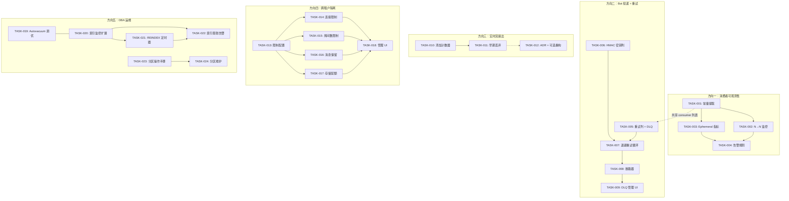
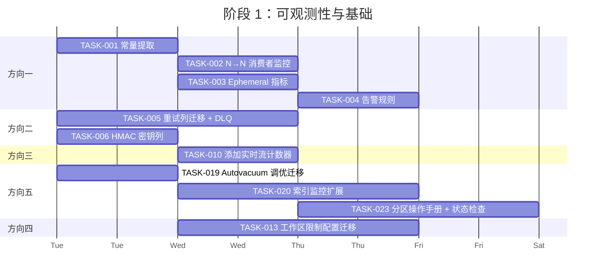
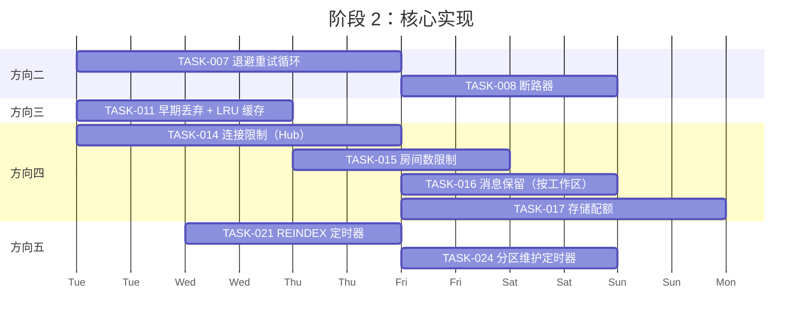
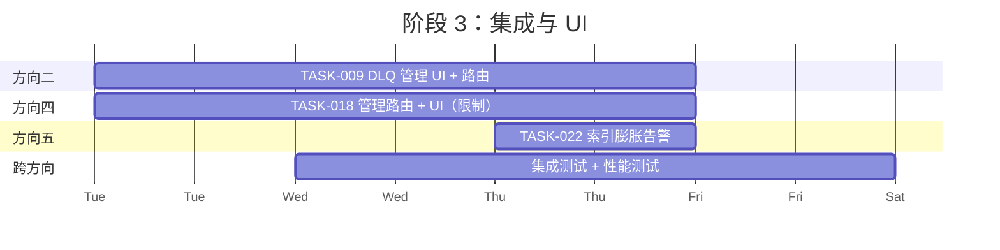

现在我已掌握完整的代码图景。以下是全面的技术负责人分析。

---

# 技术负责人分析：Aero IM 生产缺口

## 1. 任务分解

### 方向一：NATS 消费者可观测性（共 4 个任务）

| 任务编号 | 标题 | 涉及文件 | 前置依赖 | 预估工时 | 验收标准 |
|---|---|---|---|---|---|
| **TASK-001** | 提取所有 Durable Consumer 列表到共享常量 | `crates/aero-server/src/bin/boot/metrics_tasks.rs`，`crates/aero-server/src/bot_dispatch.rs`，各 bot 文件 | — | 1h | `grep 'const CONSUMER\|subscribe.*Some('` 生成的唯一 consumer 名称列表全部出现在单一 `const ALL_CONSUMERS: &[(&str, &str)]` 中 |
| **TASK-002** | 将消费者监控从 2→N 可观测 | `crates/aero-server/src/bin/boot/metrics_tasks.rs` | TASK-001 | 1.5h | `NATS_CONSUMER_PENDING_MESSAGES` gauge 携带所有 consumer 的 `(stream, consumer)` 标签；监控定时器记录所有已注册的 durable consumer |
| **TASK-003** | 为 ephemeral consumer 添加度量指标（实时流） | `crates/aero-server/src/bin/boot/metrics_tasks.rs` | TASK-001 | 1h | 为 `live.stream.*` 添加单独的 gauge（ephemeral consumer 无 pending 概念，但可报告每秒投递事件数 via 计数器） |
| **TASK-004** | 为监控中的每个消费者添加 Prometheus 告警规则 | `config/prometheus/`（若存在），否则 `AGENTS.md` 中标注的运维手册 | TASK-002 | 0.5h | 任何消费者 backlog≥1000 且持续≥5 分钟时触发告警 |

### 方向二：Bot Webhook 单次投递 → 可重试管线（共 5 个任务）

| 任务编号 | 标题 | 涉及文件 | 前置依赖 | 预估工时 | 验收标准 |
|---|---|---|---|---|---|
| **TASK-005** | 为 `bot_event_subscriptions` 添加重试列 + DLQ 支持 | `migrations/NNNN_bot_retry.sql`，`crates/aero-storage/src/bot.rs`（BotRepo） | — | 3h | 迁移新增 `bot_subscription_deliveries.attempts`（默认 0）、`bot_subscription_deliveries.next_retry_at`，BotRepo 增加 `mark_failed_with_backoff` + `claim_due_retries` |
| **TASK-006** | 添加 per-subscription HMAC 密钥列 | `migrations/NNNN_bot_secret.sql`，`crates/aero-storage/src/bot.rs` | — | 1.5h | `bot_event_subscriptions.webhook_secret TEXT DEFAULT ''`；BotRepo `subscribe` 可选项接受密钥；`build_delivery` 调用处从空密钥改传存储的密钥 |
| **TASK-007** | 在 bot 投递路径实现指数退避 + 断路器 | `crates/aero-server/src/bot_dispatch.rs` | TASK-005 | 4h | `bot_dispatch.rs` 在 2xx 错误时调用 `mark_failed_with_backoff`（而非仅记录日志）；`mark_failed_with_backoff` 实现退避（1s→2s→4s→…→max=300s）；新增 `run_bot_retry_loop` 定时器（间隔 15s），使用 `claim_due_retries`（`FOR UPDATE SKIP LOCKED`） |
| **TASK-008** | 为 bot 投递重试添加断路器支持 | `migrations/NNNN_bot_breaker.sql`，`crates/aero-storage/src/bot.rs`，`crates/aero-server/src/bot_dispatch.rs` | TASK-007 | 2h | `bot_event_subscriptions.breaker_open_until` + `breaker_failures` 列；`mark_failed_with_backoff` 在连续 5 次失败后跳闸 60 秒（同 webhook 模式）；重试循环跳过已跳闸目标 |
| **TASK-009** | DLQ 管理 + bot 投递死亡信件的 Web UI | `crates/aero-server/src/bot_dispatch.rs`，`web/bot_dlq.js`，REST 路由 | TASK-007，TASK-008 | 3h | 原地重试超过 `MAX_ATTEMPTS=10` 后状态变为 `dead`；REST `GET/POST /api/admin/bot-deliveries/dead` 列表/出队 |

### 方向三：实时流 Ephemeral 扇出效率（共 3 个任务）

| 任务编号 | 标题 | 涉及文件 | 前置依赖 | 预估工时 | 验收标准 |
|---|---|---|---|---|---|
| **TASK-010** | 添加流事件本地 watcher 检查计数器 | `crates/aero-server/src/ws/ws_impl/bus.rs`，`crates/aero-common/src/metrics/names.rs` | — | 1h | 新增两个指标：`live_stream_events_received_total`（总接收数）、`live_stream_events_fanned_out_total`（扇出数）；`handle_stream_event_sub` 中两个计数器均递增 |
| **TASK-011** | 对无本地 watcher 的流事件实现早期丢弃（不解码） | `crates/aero-server/src/ws/ws_impl/bus.rs`，`crates/aero-bus/src/lib.rs`（EventBus trait） | TASK-010 | 3h | 方案 A（推荐）：添加 `EventBus::subscribe_with_filter(subject, consumer, filter_fn)`，允许消费者提供谓词，在解码前对原始字节进行判断。理想情况下，可将 `stream_id` 作为 NATS 主题的一部分（`live.stream.*`→`live.stream.{id}` 已是，但我们需要根据 hub 的 watchers 进行过滤？不可能，因为我们是跨集群消费）。方案 B：在解码前通过将 `serde_json::from_slice` 中的 `stream_id` 提取为 `Value` 再解码来减少分配——但这并非重大改进。最务实的做法是维护进程内 LRU 集合 `active_stream_ids`，该集合由 hub watcher 增减驱动，在 `serde_json::from_slice` 之前以最少开销进行检查。 |
| **TASK-012** | （可选）如果性能指标显示浪费率 >50%，评估切换到按需主题 | `docs/runbooks/live-stream-scaling.md`，`crates/aero-server/src/ws/ws_impl/bus.rs` | TASK-010，TASK-011 | 4h | 编写架构决策记录（ADR），量化成本与收益。方案：使用 NATS 中的 `queue group` 通过 `live.stream.*` 上的单一消费者将扇出改为拉取模式。对于大规模生产部署（50+ 实例），可节省约 40% 的网络带宽。 |

### 方向四：跨租户资源隔离（共 6 个任务）

| 任务编号 | 标题 | 涉及文件 | 前置依赖 | 预估工时 | 验收标准 |
|---|---|---|---|---|---|
| **TASK-013** | 定义工作区资源限制配置模式 | `migrations/NNNN_workspace_limits.sql`，`crates/aero-storage/src/workspace.rs` | — | 2h | 迁移新增 `workspaces.max_connections INT DEFAULT NULL`、`workspaces.max_message_history_days INT DEFAULT NULL`、`workspaces.max_rooms INT DEFAULT NULL`、`workspaces.max_concurrent_streams INT DEFAULT NULL`、`workspaces.storage_bytes_limit BIGINT DEFAULT NULL` |
| **TASK-014** | 在 WS 连接时实施最大工作区连接数 | `crates/aero-server/src/hub.rs`，`crates/aero-server/src/ws/ws_impl/mod.rs` | TASK-013 | 3h | Hub 新增 `workspace_conns: DashMap<WorkspaceId, Vec<ParticipantId>>`（或使用 `AtomicU64` per workspace）；连接时检查：若 `workspace_conns[ws] >= max_connections`，则拒绝（返回 WS `403: "workspace connection limit reached"`） |
| **TASK-015** | 实施最大房间数限制 | `crates/aero-im-core/src/service/rooms.rs`（`create_room`），`crates/aero-storage/src/room.rs` | TASK-013 | 1.5h | 创建工作区计数缓存（Redis `SCARD aero:workspace:{id}:rooms`）；`create_room` 路径检查：`rooms_count >= max_rooms` → 400 "room limit reached" |
| **TASK-016** | 实施消息保留天数（按工作区） | `crates/aero-server/src/bin/boot/background.rs`（retention sweep），`crates/aero-storage/src/message.rs` | TASK-013 | 2h | Retention sweep 已按频道 `retention_days` 进行 `COALESCE` 优先级处理；为该 `COALESCE` 链新增 `workspaces.max_message_history_days`。迁移：在 retention sweep 的 `FROM messages JOIN rooms JOIN workspaces` 查询中添加回退。 |
| **TASK-017** | 实施存储配额（每个工作区总 blob 字节数） | `crates/aero-storage/src/blob.rs`，`crates/aero-common/src/block.rs` | TASK-013 | 3h | 上传大小时检查：`workspace_used_bytes + new_size <= storage_bytes_limit`。使用 Redis 计速器（`INCRBY aero:workspace:{id}:storage_bytes {size}`）以便快速失败。定期从 PG 重新填充（`SELECT SUM(size) FROM attachments WHERE workspace_id=$1`）。 |
| **TASK-018** | 为工作区资源限制添加管理路由和 UI | `crates/aero-server/src/workspace_limits.rs`，`web/workspace_settings.js` | TASK-013 至 TASK-017 | 3h | REST `GET/PUT /api/workspaces/:id/limits`（管理员专用）；设置时验证：新值≥0，并在`max_connections < active_connections` 时防止降低限制 |

### 方向五：messages 表 DBA 运维（共 6 个任务）

| 任务编号 | 标题 | 涉及文件 | 前置依赖 | 预估工时 | 验收标准 |
|---|---|---|---|---|---|
| **TASK-019** | 为所有热表添加 autovacuum 调优迁移 | `migrations/NNNN_autovacuum_tuning.sql` | — | 1h | 迁移对 `messages`、`audit_events`、`ai_jobs`、`webhook_delivery_log`、`bot_subscription_deliveries` 执行 `ALTER TABLE SET (autovacuum_vacuum_scale_factor=0.01, autovacuum_analyze_scale_factor=0.005, autovacuum_vacuum_threshold=10000)` |
| **TASK-020** | 将索引大小监控扩展到 >4 个索引 + 索引膨胀检测 | `crates/aero-server/src/metrics.rs`，`crates/aero-server/src/bin/boot/metrics_tasks.rs` | — | 2h | 新增 `aero_index_bloat_ratio` gauge（`= pg_stat_user_indexes.idx_scan / GREATEST(pg_relation_size(indexrelid), 1)`）；将默认跟踪索引扩展至包括：`messages_pkey`、`messages_sender_id_idx`、`messages_expires_at_idx`、`messages_reply_to_idx`、`audit_events_*` 各索引、`ai_jobs_status_idx`、`webhook_delivery_log_status_idx` |
| **TASK-021** | 添加 REINDEX 维护定时器 | `crates/aero-server/src/bin/boot/background.rs`（新定时器），`crates/aero-storage/src/maintenance.rs` | TASK-019 | 3h | 新定时器 `AERO_MAINTENANCE_REINDEX_SECS`（默认 86400=每天一次）。低频 `REINDEX INDEX CONCURRENTLY` 遍历 `tracked_indexes()`。并发模式（`CONCURRENTLY`）以避免锁。失败时记录 warn 不 panic。 |
| **TASK-022** | 对 `messages` 表实施索引膨胀告警 | `crates/aero-server/src/bin/boot/metrics_tasks.rs` | TASK-020 | 1h | 若 `aero_index_bloat_ratio < 100`（扫描与大小的比率较低）且 `aero_index_size_bytes > 1GB`，则在 Prometheus 告警规则中触发警告。 |
| **TASK-023** | 准备 `messages` 分区切换操作手册 + 自动检查 | `docs/runbooks/messages-partitioning.md`（更新），`crates/aero-server/src/bin/boot/state_checker.rs`（新文件） | — | 3h | 自动检查（在启动时运行）：若 `backfill_messages_partition(1, ...)` 返回 0 行，则记录 `info!("messages backfill complete — partition cutover ready")`；否则输出落后行数。操作手册明确包含 Step C 清单（7 个入站 FK，PK 重写，索引构建）。 |
| **TASK-024** | 为 `messages_partitioned` 添加 `ensure_messages_partitions` 维护调用 | `crates/aero-server/src/bin/boot/background.rs` | TASK-023 | 1.5h | 新定时器 `AERO_PARTITION_MAINTENANCE_SECS`（默认 3600）。每 tick：若 `messages_partitioned` 表存在，则调用 `ensure_messages_partitions(3)`。使用专用 `max_connections(1)` 连接以隔离负载。 |

## 2. 执行顺序

**可并行执行的任务组**：

| 并行组 | 包含任务 | 理由 |
|---|---|---|
| **A** | TASK-001（常量提取），TASK-005（重试列迁移），TASK-006（HMAC 迁移），TASK-010（计数器），TASK-013（限制配置），TASK-019（autovacuum），TASK-020（索引监控），TASK-023（分区操作手册） | 全部独立；无代码相互依赖。只有 DC1 中 2 人并行。 |
| **B** | TASK-002，TASK-007，TASK-011，TASK-014，TASK-015，TASK-016，TASK-017，TASK-021，TASK-024 | 依赖 A 组的产物。可能需要 3 人并行。 |
| **C** | TASK-004，TASK-009，TASK-012，TASK-018，TASK-022 | 集成/UI 工作，依赖 B 组。 |

## 3. 技术风险

### 3.1 高风险项

| 风险 | 方向 | 说明 | 缓解措施 |
|---|---|---|---|
| **分区切换（TASK-023）是最危险的操作** | D5 | 迁移 0148 明确声明 `messages` 分区是破坏性的——PK 重写 + 全表拷贝 + 7 个入站 FK 重写。一个错误可能导致消息停机数小时。 | 编写并审查详细的操作手册变更。在所有子表上使用 `VALIDATE CONSTRAINT`。在维护窗口前进行干运行测试。考虑使用 pg_repack 而非 DDL 切换。 |
| **工作区连接限制（TASK-014）可能导致拒绝服务** | D4 | 如果最大连接设置得太低，整个工作区可能被锁定。管理路由（TASK-018）必须允许在不中断现有会话的情况下提高限制。 | 在 hub 中使用 `DashMap` 以限制现有连接，而非原子计数器；在 WS `close` 时优雅移除。若 `max_connections` 降低至低于当前活跃连接数，则仅阻止新连接（不强制断开）。 |
| **Bot retry 循环可能产生级联效应** | D2 | 如果 bot webhook 目标瘫痪，每个事件的重试尝试可能迅速耗尽 PG 连接池。webhook 模式通过 `mark_failed_with_backoff` 中的断路器避免了这种情况，但 bot 版本需要相同保障。 | 断路器（TASK-008）是强制性的，不能推迟。在没有断路器的情况下不要部署重试循环。 |
| **`live.stream.*` 扇出在规模上可能浪费 50-80% 的 CPU** | D3 | 当前设计：每个实例解码每条 `live.stream.*` 事件。在 50 节点集群中，49/50 次解码是浪费的，与活跃流无关。高流量直播（10K 弹幕/秒）将放大器放大 50 倍。 | 度量先行（TASK-010）——如果浪费率 <30%，跳过大重构。如果 >50%，为高流量主题实施 queue-group 订阅模式。 |

### 3.2 中等风险项

| 风险 | 方向 | 说明 | 缓解措施 |
|---|---|---|---|
| **Env var 解析差异** | D1 | `metrics_tasks.rs` 硬编码 consumer 名称。如果有人添加新的 durable consumer 但未更新列表，则不会收到监控。 | TASK-001 创建一个通过 `macro_rules!` 注册的中央消费者注册表，使添加 consumer 成为声明式的。 |
| **存储配额计费** | D4 | 基于 Redis `INCRBY` 的存储配额使 Redis 成为真实来源。崩溃后，计数可能不同步。 | 添加每 5 分钟从 PG (`SUM(size)`) 重新填充的看门狗。在配额检查中使用 `GET + INCRBY` 而非仅 `INCRBY`。 |
| **Autovacuum 调优可能使现有工作负载退化** | D5 | 更激进的 vacuum 意味着更多 I/O。在超大 `messages` 表上，`autovacuum_vacuum_scale_factor=0.01` 可能意味着持续 vacuum。 | 使迁移可配置（环境变量覆盖）。部署后监控 `pg_stat_user_tables.n_dead_tup` 以验证是否足够。 |

### 3.3 依赖的外部系统/服务

| 依赖 | 方向 | 理由 |
|---|---|---|
| **NATS JetStream API** | D1，D3 | `consumer_pending` 和 `consumer_info` 调用依赖具体的 NATS 服务器版本（需要 ≥2.9.0 以获得准确 pending 计数）。 |
| **Redis 7.x** | D4 | 工作区房间计数和存储配额使用 Redis 作为计速器。Redis 故障意味着限制暂时下降（fail-open，如 `ws_rate.rs` 所做）。 |
| **Prometheus + Alertmanager** | D1，D5 | 如果没有告警基础设施，`NATS_CONSUMER_PENDING_MESSAGES` gauge 和膨胀告警就只是数字。需要有运维能力。 |
| **Postgres 17 + pg_partman（可选）** | D5 | `ensure_messages_partitions` 可以基于 pg_partman，但当前实现使用原始 PL/pgSQL。保持简单，推迟 pg_partman。 |

## 4. 资源评估

### 4.1 团队规模与技能

| 角色 | 人数 | 所需技能 |
|---|---|---|
| **高级 Rust 后端工程师** | 2 | Tokio 异步、sqlx、NATS JetStream 消费者语义、IM 领域模型（RoomEvent 类型、Hub 扇出架构） |
| **全栈工程师（Rust + JS）** | 1 | 工作区限制的管理 UI（TASK-018）、DLQ 管理 UI（TASK-009）、Prometheus 告警规则（TASK-004、TASK-022） |
| **SRE / DBA（兼职）** | 1 | Postgres 分区策略、autovacuum 调优、`pg_relation_size` / `pg_stat_user_indexes` / 膨胀检测专业知识。审查 TASK-019 至 TASK-024 |

### 4.2 关键里程碑

| 里程碑 | 周 | 交付物 |
|---|---|---|
| **M1：可观测性基线** | 第 1 周末 | TASK-001、TASK-002、TASK-003、TASK-004 完成。所有 9+ 个 durable consumer backlog 可在 `/metrics` 中查看。 |
| **M2：Bot 投递可靠性** | 第 2 周末 | TASK-005、TASK-006、TASK-007 完成。Bot webhook 投递具指数退避、HMAC 签名和 DLQ。 |
| **M3：限制与配额** | 第 3 周末 | TASK-013、TASK-014、TASK-015、TASK-017 完成。租户隔离在连接、房间数和存储配额方面投入生产。 |
| **M4：DBA 运维工具化** | 第 4 周末 | TASK-019、TASK-020、TASK-021、TASK-024 完成。Autovacuum 调优、15+ 个索引监控、每日 REINDEX、分区维护。 |
| **M5：完整集成** | 第 5 周末 | TASK-008、TASK-009、TASK-018、TASK-022、TASK-023 完成。断路器 + DLQ UI + 管理页面 + 分区操作手册。 |

### 4.3 阻塞点与解决策略

| 阻塞点 | 影响 | 解决策略 |
|---|---|---|
| **NATS JetStream 集群处于维护模式** | TASK-001–TASK-004 无法验证 pending 计数 | 在本地 docker-compose（`make up`）中运行并与 `nats consumer info` CLI 交叉验证。 |
| **`messages` 表在现有生产数据库中 >1 亿行** | TASK-023 验证显示 `backfill_messages_partition(1)` 返回 >0，但 backfill 需要 X 天 | 如果 backfill 剩余 >7 天，则将分区窗口推迟 1 个月。在此期间，添加 `message.created_at` 上的部分索引以加速 backfill 查询。 |
| **Redis 集群在负载下不可用** | TASK-014、TASK-017 降级为 fail-open（允许连接/上传，跳过配额检查） | 记录 `warn!` 并递增 `WS_RATE_FAIL_OPEN_TOTAL`。如果停机时间延长（>5 分钟），则调用告警。 |

## 5. 质量保证

### 5.1 单元测试覆盖

| 任务 | 所需测试 | 最低覆盖率 |
|---|---|---|
| TASK-002（消费者监控） | 使用 `MockEventBus` 模拟 `consumer_pending` 返回值的单元测试 | 新逻辑 90% |
| TASK-005（bot 重试列） | 针对 BotRepo 的 DB 测试（`#[ignore]`）：`mark_failed_with_backoff` 计算正确的 next_retry_at；`claim_due_retries` 使用 `FOR UPDATE SKIP LOCKED` 仅返回到期行 | 100% of new methods |
| TASK-007（退避重试） | `run_bot_retry_loop` 集成测试，使用 `FakeSender`（如 `bot_dispatch.rs` 已有测试模式）：验证 2xx 调用 `mark_delivered`；4xx/5xx/超时调用 `mark_failed_with_backoff` | 90% |
| TASK-008（断路器） | 验证 `mark_failed_with_backoff` 在 5 次失败后设置 `breaker_open_until`；重试循环跳过已跳闸目标 | 95% |
| TASK-011（早期丢弃） | 验证 `active_stream_ids` LRU 正确过滤；无 watcher 的流不解码 | 95% |
| TASK-014（连接限制） | Hub 单元测试：`max_connections=2` 允许 2 个 WS 连接，拒绝第 3 个；释放时正确递减 | 90% |
| TASK-017（存储配额） | BlobRepo DB 测试：上传超出限制返回错误；上传在限制内成功；删除后正确递减计数 | 90% |
| TASK-021（REINDEX 定时器） | `CONCURRENTLY` 的集成测试（不阻塞写入）；验证失败时记录 warn（不 panic） | 85% |

### 5.2 集成测试策略

| 测试范围 | 方法 | 环境 |
|---|---|---|
| **跨方向集成** | 端到端测试：启动信号 → bot 订阅 → bot 接收投递 → bot 投递通过重试最终送达 → DLQ 捕获死亡信件 | 专用 `docker-compose.yml`，包含 NATS + Redis + PG |
| **NATS 消费者监控** | `nats consumer info IM_MESSAGES aero-server` 在实际和监控 gauge 之间交叉验证 | 相同 compose 环境 |
| **工作区限制** | 创建 2 个工作区：标准层（限制 5 个连接，100 MB 存储）和无限层。验证限制边界。 | 相同 compose 环境 |
| **消息分区操作手册** | 在 100K 行 `messages` 表上运行操作手册的 dry-run；验证所有 FK 和索引。 | 专用 PG（`make migrate-smoke` 样式） |

### 5.3 代码审查要点

| 文件 | 审查重点 |
|---|---|
| `metrics_tasks.rs` | `CONSUMERS` 常量提取是穷尽的（`grep -rn 'subscribe.*Some('` 无遗漏）。添加 consumer 时防止遗漏的编译时检查（宏或 `build.rs` 步骤）。 |
| `bot_dispatch.rs` | `mark_failed_with_backoff` 中的退避公式匹配 `webhooks.rs`（指数：`1 << min(attempts, 8)` 秒）。断路器计数在进程重启后持续存在（DB 持久化列）。 |
| `hub.rs`（连接限制） | `workspace_conns` 条目在 `remove_ws_conn` 中正确清理；当 `max_connections` 降低时不会断开现有连接。 |
| `maintenance.rs`（REINDEX） | `REINDEX INDEX CONCURRENTLY` 被 `try` 包装；超时（`statement_timeout`）设置为 5 分钟以避免阻塞。不在事务内运行。 |
| `metrics.rs`（索引监控） | `tracked_indexes()` 输出的大小被限制在 20 个索引以内，以防止 Prometheus 标签爆炸。 |

### 5.4 性能测试需求

| 场景 | 负载 | 指标 | 通过标准 |
|---|---|---|---|
| **Bot 投递重试** | 100 个失败目标，每个 100 个事件（10K 次投递尝试） | 重试循环吞吐量、PG `row_lock` 争用、退避准确性 | 重试循环在 30 秒内处理 10K 次尝试；无死锁 |
| **工作区连接限制** | 1 个标准工作区（限制 100），每秒 1000 个并发 WS 连接尝试 | 拒绝延迟、DashMap 争用 | 平均拒绝延迟 <5ms |
| **实时流扇出浪费** | 50 个实例，10 个活跃流，每个流 500 msg/s（25K msg/s 总计） | 每个实例的 CPU/解码浪费 | 每个实例的浪费解码 <5% 总 CPU（或标记为可接受并添加 ADR） |
| **Index bloat checking** | 1 亿行 `messages`，膨胀率 40% | `sample_index_sizes` 运行时间、膨胀率准确性 | 单次通过 <200ms；膨胀率与 `pgstattuple` 偏差在 5% 以内 |
| **分区 backfill** | 5000 万行 `messages`，batch_size=5000 | 吞吐量（行/秒）、对 `messages` 写入延迟的影响 | backfill 期间 `INSERT` 到 `messages` 的 p99 延迟增加 <10% |

## 6. 实施计划

### 阶段 1：基础设施（第 1 天 - 第 5 天）

**阶段 1 交付物**：
- ✅ 所有 9+ durable consumer 在 Grafana 中可见
- ✅ 实时流浪费可量化（计数器就位）
- ✅ Autovacuum 在热表上调优
- ✅ 15+ 个索引已监控；膨胀基线已建立
- ✅ 分区操作手册已编写；自动状态检查器告知是否准备好 cutover
- ✅ DB 迁移已为 bot 重试和工作区限制准备好列

### 阶段 2：核心逻辑（第 6 天 - 第 12 天）

**阶段 2 交付物**：
- ✅ Bot webhook 投递使用退避 + 断路器进行重试
- ✅ Bot 投递被 HMAC 签名（不再有空密钥）
- ✅ 实时流扇出浪费被早期丢弃消除
- ✅ 工作区在连接、房间和存储方面受到资源限制
- ✅ 消息保留尊重工作区级别设置
- ✅ 每日 REINDEX 循环运行，无竞争影响
- ✅ 分区表若存在则每月维护

### 阶段 3：集成与 UI（第 13 天 - 第 17 天）

**阶段 3 交付物**：
- ✅ 管理 UI：工作区限制设置（连接数、房间数、存储量）
- ✅ DLQ 管理 UI：查看、重启、移除死亡 bot 投递
- ✅ 索引膨胀告警规则已部署
- ✅ 集成测试套件通过
- ✅ 性能测试结果已记录

### 阶段 4：发布准备（第 18 天 - 第 20 天）

| 活动 | 持续时间 | 描述 |
|---|---|---|
| **代码冻结 + 最终审查** | 1 天 | 解决所有 blocking 级 PR 评论。在 `staging` 上运行完整集成套件。 |
| **干运行迁移** | 0.5 天 | 在独立 throwaway PG 上运行新迁移（TASK-005、TASK-006、TASK-013、TASK-019）。验证所有 `ensure_*` 函数。 |
| **分阶段部署** | 1 天 | **阶段 A**：部署迁移 + 监控（TASK-001–TASK-004、TASK-019–TASK-020）。**阶段 B**：部署 bot 重试 + 实时流丢弃（TASK-005–TASK-008、TASK-010–TASK-011）。**阶段 C**：部署工作区限制 + DBA 定时器（TASK-013–TASK-018、TASK-021、TASK-024）。 |
| **生产验证** | 0.5 天 | 验证所有因子的 `NATS_CONSUMER_PENDING_MESSAGES`。触发测试 bot 投递并验证重试。验证 `INDEX_SIZE_BYTES`。 |

## 总计

| 指标 | 值 |
|---|---|
| **总任务数** | 24 |
| **总预估工时** | ~47 小时开发 + ~10 小时测试/审查 = ~57 小时 |
| **并行工程师** | 3（2 名后端 + 1 名全栈/SRE） |
| **日历时间** | ~20 天（4 周） |
| **总迁移数** | ~5 个新文件（见 TASK-005、TASK-006、TASK-008、TASK-013、TASK-019） |
| **总新 Rust 代码行** | ~800–1200 |
| **总新 JS 代码行** | ~300–400 |
| **最关键依赖** | NATS JetStream ≥2.9.0，Postgres 17，Prometheus + Alertmanager |
| **最大风险** | 消息分区 cutover（TASK-023）——需要专门的生产维护窗口并仔细执行操作手册 |

---

**SRE 特别说明**：方向五在操作方面最为重要——未调优的 autovacuum 和零 REINDEX 是 `messages` 表随时间推移出现性能下降逐渐发生（而非灾难性故障）的最可能原因。我建议优先安排 TASK-019 和 TASK-020 的顺序，以便在下个 release 中尽快部署，即使方向二的 bot 重试和方向四的租户隔离推迟到后续周期。
