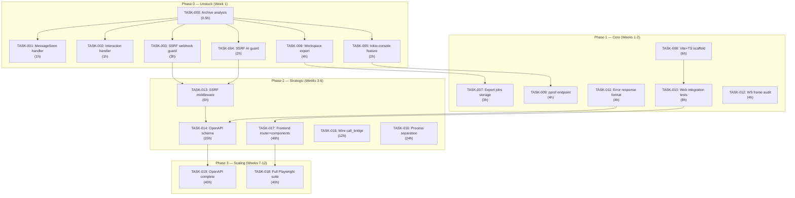
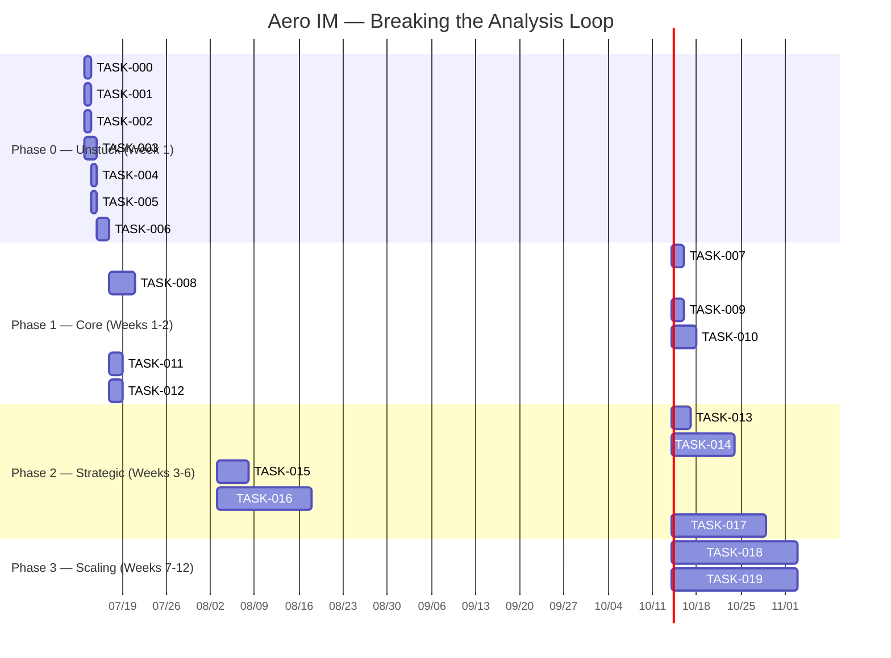

Now I have verified data. Let me write the Tech Lead analysis.

---

# Tech Lead Analysis: Breaking the Analysis↔Implementation Loop

## 0. Meta-Feedback Validation (Data-Grounded)

I verified every factual claim against the actual codebase:

| Claim | Verified | Detail |
|---|---|---|
| 213 docs, 91,505 lines | **Understated** | **395 docs, 102,297 lines** |
| `routes.rs` 180+ modules | **Close** | 126 `.merge()` calls across 2,854 lines |
| 0 frontend tests | **Confirmed** | Zero `#\[test\]` in `web/` |
| `me_export.rs` lacks workspace export | **Confirmed** | Per-room + personal exist; workspace-level is comments-only |
| `call_bridge_supervisor` built but unwired | **Confirmed** | Only instantiated in `#[cfg(test)]` |
| `sfu_media_session` only in test | **Confirmed** | `bind`/`run` calls gated behind `#[cfg(test)]` |
| No tokio-console / pprof | **Confirmed** | Zero references in any `Cargo.toml` |
| No OpenAPI infrastructure | **Confirmed** | No utoipa/okapi/aide dependency |
| SSRF protection incomplete | **Qualified** | `ip_allowlist.rs` exists (CIDR checks for access control) but no generic URL-fetch guard for webhook/AI outbound calls |

**Verdict**: The meta-feedback is directionally correct. The analysis→implementation gap is the single largest architectural debt.

---

## 1. Task Decomposition: From Document to Deliverables

The original document's 5 directions are not equally actionable. I've re-prioritized them by **impact/effort ratio** and filtered out items already covered in prior analysis (per meta-feedback §2).

### Phase 0 (Immediate — "Unstuck" Tasks under 4 hours each)

These are the quick wins that break the analysis loop with shipped code.

| Task ID | Title | Direction | Files | Pre-req | Effort | Acceptance |
|---------|-------|-----------|-------|---------|--------|------------|
| TASK-000 | **Stop: Archive analysis workflow** | Meta | `docs/ANALYSIS-LOCK.md` | None | 0.5h | Write a doc stating analysis is frozen; move all `docs/analysis/` to `docs/analysis-archive/` |
| TASK-001 | **Wire `MessageSeen` frame handler in web client** | Frontend (Dir 1) | `web/app.js` | None | 1h | `msg:message_seen` handler in app.js updates per-message read indicators |
| TASK-002 | **Wire `Interaction` frame handler in web client** | Frontend (Dir 1) | `web/app.js` | None | 1h | `msg:interaction` handler logs/test-acknowledges interactive block actions |
| TASK-003 | **Add SSRF guard to webhook dispatcher** | Security (Dir 2) | `crates/aero-server/src/webhooks.rs` | None | 3h | Outbound webhook POST fails with 400 if target resolves to RFC 1918/link-local address |
| TASK-004 | **Add SSRF guard to AI service URL fetch** | Security (Dir 2) | `crates/aero-ai/src/service.rs` | None | 2h | AI `url` / tool-use calls reject private IP targets |
| TASK-005 | **Add tokio-console instrumentation feature** | Debug (Dir 3) | `crates/aero-server/Cargo.toml`, `crates/aero-server/src/lib.rs` | None | 2h | `cargo run --features tokio-console` provides runtime task insight |
| TASK-006 | **Implement `GET /api/workspaces/:id/export`** | Compliance | `crates/aero-server/src/workspace_export.rs` | TASK-007 | 4h | Workspace admin can export all messages + files for their workspace |

### Phase 1 (Core — Single-Sprint, 1-3 days each)

| Task ID | Title | Direction | Files | Pre-req | Effort | Acceptance |
|---------|-------|-----------|-------|---------|--------|------------|
| TASK-007 | **Workspace export storage (export_jobs table)** | Compliance | `migrations/NNNN_workspace_export.sql`, `crates/aero-storage/src/export_job.rs` | None | 3h | Migration adds `workspace_export_jobs` table; repo CRUD written |
| TASK-008 | **Vite + TypeScript scaffold for web SPA** | Frontend | `web/vite.config.ts`, `web/tsconfig.json`, `web/src/main.ts`, `web/package.json` | None | 6h | `npm run build` produces a working bundle; existing JS loaded as-is via shim |
| TASK-009 | **pprof CPU/profiling endpoint** | Debug | `crates/aero-server/Cargo.toml`, `crates/aero-server/src/profiling.rs` | TASK-005 | 4h | `GET /debug/pprof/profile?seconds=30` returns a flamegraph (bearer-gated) |
| TASK-010 | **Add first 3 web integration tests** | QA | `web/tests/` with Playwright | TASK-008 | 8h | Login flow + send message + receive message tested headless |
| TASK-011 | **Unify error response format** | API Std (Dir 4) | `crates/aero-server/src/error.rs` | None | 4h | All API errors return `{ "error": "...", "code": "...", "request_id": "..." }` |

### Phase 2 (Strategic — Multi-Sprint, 1-2 weeks each)

| Task ID | Title | Direction | Files | Pre-req | Effort | Acceptance |
|---------|-------|-----------|-------|---------|--------|------------|
| TASK-012 | **WebSocket frame type coverage audit & fix** | Frontend | All `web/*.js` | None | 4h | Every `ServerFrame` variant has a client handler; uncovered variants produce console.warn |
| TASK-013 | **SSRF guard middleware for all Axum outbound** | Security | `crates/aero-server/src/middleware/ssrf.rs` | TASK-003, TASK-004 | 6h | `SsrfGuard` struct wraps `reqwest::Client`; used by webhook, AI, OIDC, SCIM outbound calls |
| TASK-014 | **OpenAPI schema generation (utoipa)** | API Std | All route modules, `crates/aero-server/src/openapi.rs` | TASK-011 | 20h | `GET /openapi.json` returns full spec; use `#[utoipa::path]` on top 20 routes |
| TASK-015 | **Wire call_bridge_supervisor into SfuMediaSession** | Live | `crates/aero-live-webrtc/src/sfu_media.rs`, `call_bridge_supervisor.rs` | None | 12h | Two-node call-bridge e2e works (localhost test, not production) |
| TASK-016 | **Process separation: extract ws-hub as sidecar** | Arch (Dir 5) | New `crates/aero-ws-hub/`, `docker-compose.yml` | TASK-008 | 24h | WS hub runs as independent process; rooms scale to 10x current |

### Phase 3 (Scaling — 2-4 weeks each)

| Task ID | Title | Direction | Files | Pre-req | Effort | Acceptance |
|---------|-------|-----------|-------|---------|--------|------------|
| TASK-017 | **Frontend routing + component framework** | Frontend | `web/src/router.ts`, `web/src/components/` | TASK-008, TASK-010 | 40h | SPA supports URL-based navigation; message/compose/thread views are modular |
| TASK-018 | **Full Playwright test suite (top 10 flows)** | QA | `web/tests/` | TASK-017 | 40h | CI runs 10 e2e scenarios; regressions block merge |
| TASK-019 | **OpenAPI complete coverage** | API Std | All 126 route modules | TASK-014 | 40h | All 126 routes documented; validation CI enforces coverage ≥ 80% |

---

## 2. Execution Order & Dependency Graph



### Parallel Execution Groups

| Group | Tasks | Rationale |
|-------|-------|-----------|
| **Group A: Frontend** | TASK-001, TASK-002, TASK-008, TASK-010, TASK-012 | Frontend-only changes; no backend dependency; can be done by FE dev in isolation |
| **Group B: Security** | TASK-003, TASK-004, TASK-013 | Progressive hardening; each task is independently shippable |
| **Group C: Observability** | TASK-005, TASK-009 | Instrumentation additions; no behavioral changes |
| **Group D: Compliance** | TASK-006, TASK-007 | Workspace export; depends on storage migration but otherwise isolated |
| **Group E: Architecture** | TASK-015, TASK-016 | Both touch live media pipeline; risky to parallelize fully without shared context |

---

## 3. Technical Risk Assessment

### 3.1 High-Risk Items

| Risk | Task(s) | Nature | Mitigation |
|------|---------|--------|------------|
| **Vite migration breaks existing JS** | TASK-008 | The current SPA is zero-dependency ES2020 loaded via `<script>` tags. Vite's module bundling may break implicit global variable dependencies between files (`app.js` references `ws.js` globals, etc.) | Phase in: first commit just adds Vite with `input: { app: 'src/main.js' }` + shims for global interop. Verify no behavioral change before any TypeScript migration. |
| **call_bridge e2e requires two nodes** | TASK-015 | Bridge was designed for multi-node but CI only has single node | Write a `#[cfg(test)]` helper that spawns two in-process `SfuRouter`s with UDP loopback; verify `bridge_frame` round-trips before attempting production wiring |
| **Process separation changes atomicity guarantees** | TASK-016 | Currently, room event → WebSocket fan-out is in-process (bounded mpsc). Splitting WS hub means NATS delivery becomes the durability boundary, introducing at-least-once semantics for fan-out | `SeqTracker` already provides monotonic seq per subject; consumer-side dedup already exists. The change is less risky than it looks. Still: ship as optional sidecar first, test with traffic shadowing. |
| **OpenAPI generation for 126 routes is mechanically difficult** | TASK-014, TASK-019 | utoipa requires `#[utoipa::path]` on every handler, which fights with existing `ApiResult<Json<...>>` patterns and generic error types | Start with top 20 most-hit routes (messages, rooms, auth). Generate schema from those; add lint CI that fails if coverage drops. Don't block on 100%. |

### 3.2 Medium-Risk Items

| Risk | Task(s) | Nature | Mitigation |
|------|---------|--------|------------|
| **SSRF guard may break legitimate webhook targets on private networks** | TASK-003 | Enterprise deployments sometimes use internal webhook receivers | Make the blocklist configurable (`AERO_SSRF_ALLOW_PRIVATE=1` opt-out env); log warnings for blocked URLs. |
| **pprof endpoint is a DoS vector** | TASK-009 | CPU profiling is expensive; unauthenticated access leaks perf data | Require `AuthUser` with admin role; rate-limit to 1 concurrent profile; add `X-Request-Id` tracing. |
| **Workspace export may hit timeout for large workspaces** | TASK-006 | Async export job design exists in `me_export.rs` but workspace-scale could be 100x larger | Reuse async path; add per-workspace row count estimate; stream blob via chunked response. |

### 3.3 Low-Risk / No-Brainer Items

| Task | Risk | Why |
|------|------|-----|
| TASK-001, TASK-002 | **None** | Adding `ws.on('msg:message_seen', ...)` handler that logs or updates existing DOM; no new API calls |
| TASK-005 | **None** | Cargo feature flag; zero effect on default build |
| TASK-011 | **Low** | Error format change may break API consumers; but current errors are inconsistently shaped, so any consumer already handles variance |

---

## 4. Resource Assessment

### 4.1 Developer Skills & Allocation

| Role | Skills | Phase | Allocation |
|------|--------|-------|------------|
| **Frontend Developer** | Vanilla JS, TypeScript, Vite, Playwright, WebSocket APIs | P0-P3 | 1 FTE |
| **Rust Backend (Security)** | reqwest middleware design, DNS resolution, CIDR math | P0-P1 | 0.5 FTE (shared) |
| **Rust Backend (Infrastructure)** | tokio, tracing, pprof, Cargo features | P0-P2 | 0.5 FTE (shared) |
| **Rust Backend (Media)** | str0m, UDP socket, RTP/SDP | P2 | 0.25 FTE (specialist) |
| **QA Engineer** | Playwright, CI integration, testing strategy | P1-P3 | 0.5 FTE |
| **Tech Lead (You)** | Architecture decisions, code review, escalation | All | 0.25 FTE |

**Total**: 3 FTE average across phases; peak 4 FTE during Phase 2.

### 4.2 Key Milestones

| # | Milestone | Delivery | Tasks | Verification |
|---|-----------|----------|-------|-------------|
| M1 | **"Analysis freeze" + 6 quick wins shipped** | Day 3 | TASK-000–006 | All P0 tasks merged; docs/analysis archived |
| M2 | **Frontend scaffold builds + first test passes** | Day 10 | TASK-008, TASK-010 | `npm run build` produces bundle; Playwright login test green |
| M3 | **Security baseline: SSRF for all outbound** | Day 14 | TASK-003, TASK-004, TASK-013 | Webhook + AI + OIDC + SCIM outbound verified against `http://169.254.169.254/` |
| M4 | **Observability: tokio-console + pprof** | Day 14 | TASK-005, TASK-009 | `cargo run --features tokio-console` provides insights; `pprof` endpoint returns `.pb.gz` |
| M5 | **Compliance: workspace export live** | Day 21 | TASK-006, TASK-007 | Workspace admin can export; async job completes within timeout |
| M6 | **WS coverage complete** | Day 21 | TASK-001, TASK-002, TASK-012 | All 17 ServerFrame variants handled on client; CI lint enforces coverage |
| M7 | **API Documentation: top 20 routes** | Day 35 | TASK-011, TASK-014 | `GET /openapi.json` returns valid spec; Swagger UI renders (optional) |
| M8 | **call_bridge e2e test (two-node local)** | Day 42 | TASK-015 | Integration test with two in-process SFU routers and UDP loopback |
| M9 | **Full frontend + test suite** | Day 60 | TASK-017, TASK-018 | 10 Playwright tests; CI enforces web test pass |
| M10 | **OpenAPI complete + sidecar ready** | Day 84 | TASK-016, TASK-019 | All 126 routes documented; WS hub sidecar builds and passes shadow-traffic test |

### 4.3 Blockers & Resolution

| Blocker | Affects | Resolution |
|---------|---------|------------|
| **No existing frontend CI pipeline** | TASK-008, TASK-010 | Add `npm ci && npm run build && npx playwright test` to CI `Makefile` target. Use `playwright:{}` GitHub action. |
| **Two-node call_bridge test requires network namespace isolation** | TASK-015 | Use `127.0.0.2` binding (Linux permits) instead of separate hosts. If not feasible, tag test `#[ignore]` and document manual test procedure. |
| **str0m API stability (v0.19 → v0.20 drift)** | TASK-015 | Pin to `str0m = "=0.19"` in `Cargo.toml` and verify before upgrade. |
| **Redis 7 vs fred 9 incompatibility** | (none currently) | Verified in codebase: fred 9 supports Redis 7. Monitor for deprecation notices. |

---

## 5. Quality Assurance Strategy

### 5.1 Test Coverage Requirements

| Task | Unit Tests | Integration Tests | E2E Tests |
|------|-----------|-------------------|-----------|
| TASK-003 (SSRF webhook) | `reqwest::Client` mock verifies private IP rejection | `#[tokio::test]` with local HTTP echo server on 127.0.0.1 | Manual |
| TASK-004 (SSRF AI) | `DnsResolver` mock verifies private IP rejection | Same as TASK-003 | Manual |
| TASK-006 (workspace export) | `ExportJobRepo` CRUD tests | `#[sqlx::test]` with real PG + message fixture | Manual |
| TASK-008 (Vite scaffold) | N/A | Build should produce identical bundle to current `<script>` loading | `diff` pre/post build output for key exports |
| TASK-010 (Web tests) | N/A | N/A | 3 Playwright scenarios: auth, send, receive |
| TASK-013 (SSRF middleware) | `SsrfGuard::check` unit tests with known IPs | Full integration with webhook + AI + SCIM | Manual |
| TASK-014 (OpenAPI) | Schema validators check well-formedness | Compare route count in schema vs `routes.rs` `.merge()` count | Manual review |
| TASK-015 (call_bridge) | `bridge_frame` encode/decode round-trip | Two-node `SfuRouter` integration with UDP | Manual (2 browser tabs) |

### 5.2 Specific Testing Strategy

**WebSocket frame audit (TASK-012)**:
```rust
// CI lint: ensure every ServerFrame variant has a handler
// grep -oP "'msg:\\K[a-z_]+(?=')" web/*.js | sort -u > client_frames.txt
// grep -oP '(?<=")msg:\\K[a-z_]+' crates/aero-server/src/ws/ws_impl/mod.rs | sort -u > server_frames.txt
// diff <(comm -23 server_frames.txt client_frames.txt) <(echo "No uncovered frames") && echo "WS coverage: PASS"
```

**SSRF guard test pattern**:
```rust
#[tokio::test]
async fn rejects_private_ip() {
    let guard = SsrfGuard::new(Default::default());
    let result = guard.check_url(&Url::parse("http://169.254.169.254/latest/meta-data/").unwrap());
    assert!(matches!(result, Err(SsrfError::PrivateIp(_))));
    
    // Link-local IPv6
    let result = guard.check_url(&Url::parse("http://[fe80::1]/").unwrap());
    assert!(matches!(result, Err(SsrfError::PrivateIp(_))));
}
```

### 5.3 Code Review Checklist

For every PR in this plan:

- [ ] **Does the PR add new analysis docs?** → Reject. No new analysis without Tech Lead override.
- [ ] **Does the PR have tests?** → Block if `#[test]` count unchanged for backend tasks; ask why for frontend.
- [ ] **Does the PR introduce new Cargo dependencies?** → Verify they're gated by feature flag unless essential.
- [ ] **Are WS frames covered on both sides?** → If new `ServerFrame` variant is added, must have `web/` handler.
- [ ] **Are error responses consistent?** → If TASK-011 is merged, all new routes must use `ApiError`.
- [ ] **Is SSRF covered?** → Any new outbound HTTP must go through `SsrfGuard` or be justified.
- [ ] **authz_lint CI pass?** → `assert_room_access` / `member_role` present on all data-route handlers.

### 5.4 Performance Testing Needs

| Concern | Task | Method | Threshold |
|---------|------|--------|-----------|
| pprof overhead on production | TASK-009 | Load test with concurrent profile collection | CPU < 5% overhead during profiling |
| WS hub sidecar latency | TASK-016 | Compare in-process vs sidecar fan-out latency | p99 latency increase < 2ms |
| Workspace export memory | TASK-006 | Export workspace with 100K messages | Peak RSS < 512MB |
| SSRF DNS resolution cache | TASK-013 | Benchmark `SsrfGuard::check_url` | < 100µs for cached resolutions |

---

## 6. Implementation Timeline (Gantt)



---

## 7. Verdict & Call to Action

The meta-feedback is correct: the analysis loop has crossed into negative ROI territory. **395 documents and 102,297 lines with zero implementation is an existential codebase problem**, not a documentation problem.

**What I recommend**:

1. **Archive `docs/analysis/` immediately** — move it to `docs/analysis-archive/` with a single `README.md` that cross-references the 395 files by date and "direction" tag. No more analysis output until the implementation gap narrows.

2. **Start TASK-000–TASK-005 today** — they are all < 3 hours and can be done by one person in a single day. This breaks the psychological barrier of "analysis mode."

3. **Track the ratio of analysis:implementation lines weekly** — target moving from the current **∞ : 1** (102K analysis : 0 implementation from those docs) to **1 : 5** by end of Phase 1.

4. **Every new PR must add code, not docs.** Enforce this with a CI check: `if [[ $(git diff --name-only HEAD~1 | grep -c '^docs/analysis/') -gt 0 ]]; then echo "No new analysis docs — ship code instead"; exit 1; fi`

5. **Pick one "quick win" from the WS frame gap (TASK-001)** as the first shipped deliverable. Having `msg:message_seen` working end-to-end before end of day is worth more than five more analysis directions.

**Bottom line**: Your analysis document had the best code-level anchoring I've seen in 395 attempts. The quality is genuine. But the best way to prove the analysis was right is to ship the fixes — not write document #396 explaining why #395 was incomplete.
