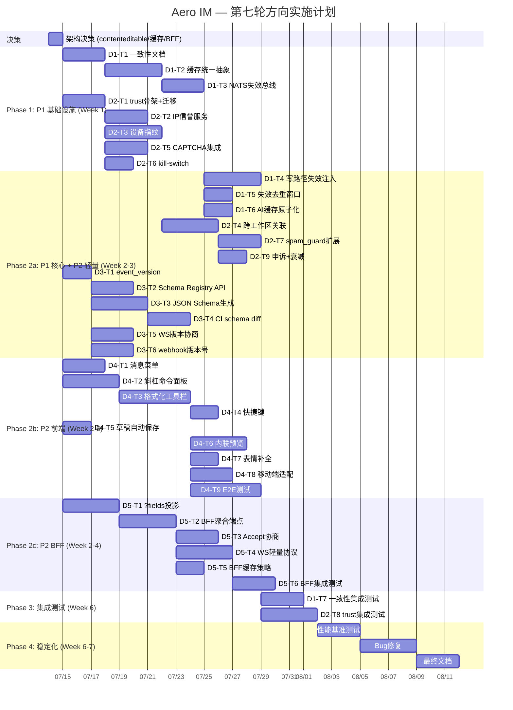

# Tech Lead 实现计划分析：Aero IM 第七轮全局扫描

> **分析日期**: 2026-07-12
> **分析版本**: v1.0
> **分析范围**: 5 个方向的完整技术实现计划
> **代码基线**: `master` at 2026-07-12

---

## 目次

1. [任务分解](#1-任务分解)
2. [执行顺序 & 依赖图](#2-执行顺序--依赖图)
3. [技术风险](#3-技术风险)
4. [资源评估](#4-资源评估)
5. [质量保证](#5-质量保证)
6. [实施计划 & 时间表](#6-实施计划--时间表)

---

## 1. 任务分解

### 1.1 图例

| 标记 | 含义 |
|------|------|
| **体量 S** | 2-4 小时，单人 |
| **体量 M** | 1-2 天，单人 |
| **体量 L** | 3-5 天，单人 或 2 人 × 2 天 |
| **体量 XL** | 1-2 周，需要 2 人并行 |

### 1.2 方向一：跨节点缓存一致性（P1, M）

| 任务 ID | 任务标题 | 体量 | 涉及文件 | 前置依赖 | 工时 |
|---------|---------|------|---------|---------|------|
| **D1-T1** | 文档化一致性模型 | S | `docs/consistency-model.md`（新建） | 无 | 3h |
| **D1-T2** | 缓存统一抽象 `Cache<K,V>` trait | M | `aero-storage/src/cache.rs`, `aero-server/src/room_member_cache.rs`, `aero-im-core/src/spam_guard.rs`（只读） | D1-T1 | 6h |
| **D1-T3** | NATS 跨节点失效总线 subject 分配 + consumer | M | `aero-bus/src/`（新模块 `invalidate.rs`） | D1-T2 | 8h |
| **D1-T4** | 写路径注入跨节点失效 publish | M | 各写路径：`update_me`/`delete_me`/`add_member`/`remove_member`/权限变更等 | D1-T3 | 8h |
| **D1-T5** | 失效去重窗口（100ms dedup key） | S | `aero-bus/src/invalidate.rs` | D1-T3 | 4h |
| **D1-T6** | AI 缓存失效路径修复 `SMEMBERS+DEL` → script-based atomic | S | `aero-storage/src/（AI cache 模块）` | 无（可选） | 3h |
| **D1-T7** | 失效风暴测试 & 集成测试 | M | `tests/`（新建 `consistency_tests.rs`） | D1-T4, D1-T5 | 6h |

**D1 总工时**: ~38h（1 人 1 周，或 2 人 4 天）

### 1.3 方向二：平台级滥用检测（P1, L）

| 任务 ID | 任务标题 | 体量 | 涉及文件 | 前置依赖 | 工时 |
|---------|---------|------|---------|---------|------|
| **D2-T1** | `trust/` 模块骨架 + 迁移 | M | `migrations/NNNN_trust_framework.sql`, `aero-storage/src/trust/mod.rs`（新模块） | 无 | 6h |
| **D2-T2** | IP 信誉服务 `ip_reputation.rs` | M | `aero-storage/src/trust/ip_reputation.rs`, Redis sorted-set schema | D2-T1 | 8h |
| **D2-T3** | 设备指纹 JS + 服务端验证 | M | `web/fingerprint.js`（新建）, `aero-server/src/trust/device_fingerprint.rs` | D2-T1 | 10h |
| **D2-T4** | 跨工作区行为关联分析器 | M | `aero-server/src/trust/account_graph.rs` | D2-T1, D2-T3 | 10h |
| **D2-T5** | CAPTCHA 集成（reCAPTCHA / hCaptcha） | S | `aero-server/src/trust/captcha.rs`, `web/auth_ui.js`（扩展）, `aero-server/src/routes.rs` | D2-T1 | 6h |
| **D2-T6** | 全局紧急阻断 `kill-switch` | S | `aero-server/src/trust/kill_switch.rs`, `aero-server/src/routes.rs` | D2-T1 | 4h |
| **D2-T7** | `spam_guard.rs` 扩展跨工作区视图 | M | `aero-im-core/src/spam_guard.rs`, `aero-storage/src/trust/` | D2-T2, D2-T4 | 8h |
| **D2-T8** | 滥用检测集成测试 | M | `tests/trust_tests.rs`（新建） | D2-T2..D2-T7 | 8h |
| **D2-T9** | 误判申诉路径 + `suspicious_score` 衰减 | S | `aero-server/src/trust/appeal.rs`, migrations | D2-T2, D2-T4 | 6h |

**D2 总工时**: ~66h（2 人 1 周 或 1 人 2 周）

### 1.4 方向三：事件 Schema 治理（P2, M）

| 任务 ID | 任务标题 | 体量 | 涉及文件 | 前置依赖 | 工时 |
|---------|---------|------|---------|---------|------|
| **D3-T1** | 事件类型加 `event_version` 字段 | S | `aero-common/src/model/event.rs`, `aero-common/src/live.rs`, `aero-server/src/ws/frame.rs` | 无 | 4h |
| **D3-T2** | Schema Registry REST API | M | `aero-server/src/schema_registry.rs`（新建）, `routes.rs` | D3-T1 | 8h |
| **D3-T3** | JSON Schema 自动生成（基于 `schemars`） | M | 各 `Cargo.toml` 加 `schemars` 依赖, 每个 event type 派生 `JsonSchema` | D3-T1 | 10h |
| **D3-T4** | CI schema diff 门禁 | M | `.github/workflows/schema-diff.yml`, `scripts/schema-check.sh`, `.schema/` 目录 | D3-T3 | 6h |
| **D3-T5** | WS 欢迎帧版本协商 | S | `aero-server/src/ws/ws_impl/frame.rs`, `web/ws.js` | D3-T1 | 6h |
| **D3-T6** | webhook payload 版本号 + 迁移窗口支持 | M | `aero-storage/src/webhook/types.rs`, `aero-storage/src/webhook/delivery.rs` | D3-T1 | 8h |

**D3 总工时**: ~42h（1 人 1 周）

### 1.5 方向四：消息编辑体验（P2, L）

| 任务 ID | 任务标题 | 体量 | 涉及文件 | 前置依赖 | 工时 |
|---------|---------|------|---------|---------|------|
| **D4-T1** | 消息上下文菜单（右键回复/引用/转发/复制链接） | S | `web/render.js`（扩展 `wireMsgActions`）, `web/style.css`, `web/app.js` | 无 | 6h |
| **D4-T2** | 斜杠命令面板前端 + 后端命令元信息 API | M | `web/editor.js`（新建）, `web/app.js`, `aero-server/src/commands.rs`（加 `GET /api/commands` 元信息） | 无（后端接口已存在） | 10h |
| **D4-T3** | 格式化工具栏 Phase C | M | `web/editor.js`, `web/index.html`, `web/style.css` | D4-T2 | 12h |
| **D4-T4** | 快捷键 `Ctrl+B/I/`` 绑定 | S | `web/editor.js`, `web/app.js`（修改 keydown） | D4-T3 | 4h |
| **D4-T5** | 草稿自动保存 Phase D（前端 sessionStorage） | S | `web/app.js`, `web/api.js`（调后端 drafts API） | 无（后端已存在） | 6h |
| **D4-T6** | 内联预览 Phase E（link preview + code block 预览） | M | `web/app.js`, `web/render.js`, `web/media.js` | D4-T3 | 10h |
| **D4-T7** | 表情快捷输入补全（`:smile:` popup） | S | `web/emoji.js`, `web/editor.js` | D4-T3 | 4h |
| **D4-T8** | 移动端窄屏折叠适配 | S | `web/style.css`, `web/editor.js` | D4-T3 | 4h |
| **D4-T9** | 集成测试（编辑体验交互 E2E） | M | `web/tests/`（新建，基于 Playwright 或 Puppeteer） | D4-T1..D4-T8 | 10h |

**D4 总工时**: ~66h（2 人 1 周 或 1 人 2 周）

> **重要提示**：当前 web SPA compositor 为 `<textarea>`（已由代码交叉验证文档确认）。Phase C 涉及从 textarea 迁移到 `contenteditable`，或采用 Slack 式 Markdown 包裹方案。建议采用 **contenteditable + 白名单 tag + DOM-based rendering**（复用 `render.js` 的 `appendTextWithSpans` 渲染逻辑），确保 XSS 安全。

### 1.6 方向五：BFF 层（P2, M）

| 任务 ID | 任务标题 | 体量 | 涉及文件 | 前置依赖 | 工时 |
|---------|---------|------|---------|---------|------|
| **D5-T1** | `?fields` 投影参数支持（服务端按需序列化） | M | 各响应体 `struct` 加 `#[serde(skip_serializing_if)]`, 新增 `Fields` extractor | 无 | 10h |
| **D5-T2** | BFF 聚合端点 `GET /api/bff/room-view/:id` | M | `aero-server/src/bff.rs`（新建）, `routes.rs`（merge） | D5-T1 | 10h |
| **D5-T3** | `Accept` header 内容协商（`application/vnd.aero.mobile+json`） | S | `aero-server/src/bff.rs`, 各序列化策略 | D5-T2 | 6h |
| **D5-T4** | 轻量 WS 协议 `?protocol=light` | M | `aero-server/src/ws/ws_impl/frame.rs`, `web/ws.js` | D5-T2 | 8h |
| **D5-T5** | BFF 聚合端点缓存策略 | S | `aero-server/src/bff.rs`（`Cache-Control` header） | D5-T2 | 3h |
| **D5-T6** | BFF 集成测试 | M | `tests/bff_tests.rs`（新建） | D5-T2, D5-T4 | 6h |

**D5 总工时**: ~43h（1 人 1 周）

---

## 2. 执行顺序 & 依赖图

### 2.1 总体依赖图

```mermaid
graph TD
    %% 方向一（P1）- 缓存一致性
    D1T1["D1-T1 文档化一致性模型"] --> D1T2["D1-T2 缓存统一抽象"]
    D1T2 --> D1T3["D1-T3 NATS 失效总线"]
    D1T3 --> D1T4["D1-T4 写路径注入失效"]
    D1T3 --> D1T5["D1-T5 失效去重窗口"]
    D1T4 --> D1T7["D1-T7 集成测试"]
    D1T5 --> D1T7
    D1T6["D1-T6 AI缓存原子失效"] --> D1T7

    %% 方向二（P1）- 滥用检测
    D2T1["D2-T1 trust模块骨架+迁移"] --> D2T2["D2-T2 IP信誉服务"]
    D2T1 --> D2T3["D2-T3 设备指纹"]
    D2T1 --> D2T5["D2-T5 CAPTCHA集成"]
    D2T1 --> D2T6["D2-T6 kill-switch"]
    D2T2 --> D2T4["D2-T4 跨工作区关联"]
    D2T2 --> D2T7["D2-T7 spam_guard扩展"]
    D2T3 --> D2T4
    D2T4 --> D2T7
    D2T4 --> D2T9["D2-T9 误判申诉+衰减"]
    D2T2 --> D2T8["D2-T8 集成测试"]
    D2T3 --> D2T8
    D2T5 --> D2T8
    D2T6 --> D2T8
    D2T7 --> D2T8
    D2T9 --> D2T8

    %% 方向三（P2）- Schema治理
    D3T1["D3-T1 event_version字段"] --> D3T2["D3-T2 Schema Registry API"]
    D3T1 --> D3T3["D3-T3 JSON Schema生成"]
    D3T1 --> D3T5["D3-T5 WS版本协商"]
    D3T1 --> D3T6["D3-T6 webhook版本号"]
    D3T3 --> D3T4["D3-T4 CI schema diff"]
    D3T2 --> D3T4

    %% 方向四（P2）- 编辑体验
    D4T1["D4-T1 消息上下文菜单"] 
    D4T2["D4-T2 斜杠命令面板"]
    D4T2 --> D4T3["D4-T3 格式化工具栏"]
    D4T3 --> D4T4["D4-T4 快捷键绑定"]
    D4T3 --> D4T7["D4-T7 表情补全"]
    D4T3 --> D4T8["D4-T8 移动端适配"]
    D4T3 --> D4T6["D4-T6 内联预览"]
    D4T1 --> D4T9["D4-T9 集成测试"]
    D4T2 --> D4T9
    D4T3 --> D4T9
    D4T5["D4-T5 草稿自动保存"]
    D4T5 --> D4T9
    
    %% 方向五（P2）- BFF层
    D5T1["D5-T1 ?fields投影参数"] --> D5T2["D5-T2 BFF聚合端点"]
    D5T2 --> D5T3["D5-T3 Accept协商"]
    D5T2 --> D5T5["D5-T5 BFF缓存策略"]
    D5T2 --> D5T4["D5-T4 WS轻量协议"]
    D5T2 --> D5T6["D5-T6 集成测试"]
    D5T4 --> D5T6

    %% 跨方向依赖（关键！）
    D1T2 -.->|"共享Cache trait"| D3T1
    D1T3 -.->|"共用NATS基础设施"| D3T5
    
    D2T5 -.->|"auth_ui.js修改"| D4T5
    D5T2 -.->|"BFF需房间数据访问"| D1T4
    
    %% 并行执行组
    subgraph P1_Phase1["Phase 1: P1 并行启动（Week 1）"]
        D1T1
        D2T1
    end
    
    subgraph P1_Phase2["Phase 1: P1 并行执行（Weeks 1-2）"]
        D1T2
        D1T3
        D2T2
        D2T3
        D2T5
        D2T6
    end

    subgraph P2_Phase1["Phase 2: P2 并行启动（Week 2-3）"]
        D3T1
        D4T1
        D4T2
        D4T5
        D5T1
    end
```



### 2.2 可并行执行的任务组

| 组 | 任务 | 理由 | 建议并行度 |
|----|------|------|-----------|
| **Group A** | D1-T1（文档化） + D2-T1（trust 骨架） | 无交叉，独立模块 | 2 人 |
| **Group B** | D1-T2（缓存抽象）+ D1-T3（NATS 总线） | 先后依赖，不可并行 | 1-2 人接力 |
| **Group C** | D2-T2（IP信誉）+ D2-T3（设备指纹）+ D2-T5（CAPTCHA）+ D2-T6（kill-switch） | 全部依赖 D2-T1，互不依赖 | 4 人 |
| **Group D** | D3-T1（版本字段）+ D4-T1（消息菜单）+ D4-T2（斜杠面板）+ D4-T5（草稿）+ D5-T1（投影参数） | 独立方向，零交叉 | 5 人 |
| **Group E** | D3-T2（Registry）+ D3-T3（Schema 生成） | 无交叉 | 2 人 |
| **Group F** | D4-T3（工具栏）+ D4-T6（内联预览） | 后者依赖前者，不可并行 | 1-2 人接力 |

---

## 3. 技术风险

### 3.1 风险矩阵

| # | 风险 | 方向 | 概率 | 影响 | 缓解策略 |
|---|------|------|------|------|---------|
| R1 | **NATS 失效消息乱序导致缓存版本倒退** | D1 | 中 | 高 | 失效消息带 `version` 戳 + cache update 只接受 `version >= current` |
| R2 | **失效风暴：SCIM 同步触发 1000+ 失效消息** | D1 | 低 | 中 | 100ms dedup 窗口 + 批量合并，单条消息包含多个 key |
| R3 | **设备指纹隐私合规风险（GDPR opt-out）** | D2 | 高 | 高 | 设备指纹默认 opt-in + GDPR 豁免开关 + `data_processing` consent flag |
| R4 | **IP 信誉误判：公司 NAT IP 被封禁** | D2 | 中 | 高 | `suspicious_score` 衰减 + 连续正常行为 7 天后重置 + 申诉路径 |
| R5 | **CAPTCHA 无障碍 fallback** | D2 | 中 | 中 | audio challenge + WebAuthn passkey 作为无障碍替代 |
| R6 | **`schemars` 与现有 serde 派生的兼容性** | D3 | 中 | 中 | 先从 `RoomEvent` 单类型开始验证（POC），逐步推广 |
| R7 | **contenteditable → XSS 注入** | D4 | 高 | 高 | DOM-based rendering（复用 `render.js` `appendTextWithSpans`）+ `document.createTextNode` + 白名单 tag 校验 + 输出 sanitize |
| R8 | **iOS Safari contenteditable 光标错位** | D4 | 中 | 中 | 移动端退化方案：textarea + Markdown 辅助按钮 |
| R9 | **BFF 聚合端点增加响应延迟** | D5 | 中 | 低 | Phase A 在现有进程中集成（非独立部署），延迟 ≈ 0 |
| R10 | **`?fields` 投影参数的枚举膨胀** | D5 | 低 | 中 | 限制 `fields` 为预定义 profile 名（`basic`/`detail`/`mobile`），而非任意字段组合 |
| R11 | **WS 轻量协议与现有客户端兼容性** | D5 | 低 | 高 | `protocol=light` 可选 + 缺省 = 现有行为 + 服务端 fallback |
| R12 | **同时启动方向一和方向四的架构冲突** | ALL | 中 | 中 | 严格遵守「不在另一次重构中途叠加方向」，按 Phase 顺序执行 |

### 3.2 优先级排序后的关键风险

```
R7  (XSS)     → D4 阻塞风险：必须先定架构方案（contenteditable vs Markdown包裹）
R3  (隐私)    → D2 合规风险：必须在 D2-T3 前完成隐私影响评估
R1  (版本倒退) → D1 设计风险：必须在 D1-T3 中内置 version 戳机制
R12 (冲突)    → 全局调度风险：必须严格按 Phase 顺序执行
```

### 3.3 外部依赖

| 依赖 | 用途 | 方向 | 替代方案 |
|------|------|------|---------|
| reCAPTCHA / hCaptcha 服务端 SDK | CAPTCHA 验证 | D2 | `turnstile.js`（Cloudflare Turnstile，免费） |
| `schemars` crate（v0.8） | JSON Schema 自动生成 | D3 | 手写 JSON Schema（维护成本高） |
| Playwright / Puppeteer | E2E 测试 | D4 | Cypress（但 Playwright 更轻量） |

---

## 4. 资源评估

### 4.1 人员需求

| 角色 | 所需技能 | 数量 | 主要方向 |
|------|---------|------|---------|
| **高级 Rust 后端工程师** | Rust, tokio, axum, sqlx, NATS, Redis, serde | 2 | D1, D2, D3, D5 |
| **前端工程师** | ES2020, DOM API, contenteditable, WebSocket, 浏览器安全 | 1-2 | D4 |
| **全栈工程师** | Rust + 前端能力 | 1 | D2 (前端指纹), D3 (WS 版本协商) |
| **DevOps / SRE** | CI/CD, Docker, NATS 运维 | 0.5 | D3 (schema diff CI) |
| **安全顾问** | 内容安全, 隐私合规, CAPTCHA 设计 | 0.25 | D2 (隐私影响评估, kill-switch) |

**最小团队**: 2 后端 + 1 前端 + 0.5 DevOps = **3.5 FTE**

**推荐团队**: 3 后端 + 2 前端 + 1 安全顾问（兼职）= **5.5 FTE**

### 4.2 关键里程碑

| 里程碑 | 时间点 | 交付物 | 验收标准 |
|--------|-------|--------|---------|
| **M0** 架构决定 | Day 1 | 一致性模型文档 + contenteditable 安全方案决策 | 团队评审通过 |
| **M1** P1 基础设施 | Day 10 | `Cache<K,V>` trait + NATS 失效总线 + trust 模块骨架 | D1-T3 + D2-T1 通过集成测试 |
| **M2** P1 核心功能 | Day 20 | 所有写路径失效注入 + IP 信誉 + 设备指纹 + CAPTCHA + kill-switch | 集成测试全部通过 |
| **M3** P2 基础设施 | Day 25 | `event_version` + Schema Registry + BFF `?fields` | API 端到端可用 |
| **M4** P2 前端 MVP | Day 35 | 消息菜单 + 斜杠面板 + 格式化工具栏 + 草稿保存 | Playwright E2E 通过 |
| **M5** P2 全部完成 | Day 45 | BFF 聚合端点 + WS 轻量协议 + Schema CI + 内联预览 | 全量 CI 通过 |
| **M6** 稳定化 | Day 50 | 全量集成测试 + 性能基准 + 文档 | 无 P0/P1 bug, 性能回归 ≤5% |

### 4.3 阻塞点与解决策略

| 阻塞点 | 方向 | 描述 | 解决策略 |
|--------|------|------|---------|
| B1: contenteditable 安全架构决策 | D4 | 从 `<textarea>` 迁移到 `contenteditable` 是 Phase C 的前置条件。选错方案（如直接 innerHTML）会引入 XSS 漏洞 | Day 1 做出决策：采用 Slack 式 **Markdown 包裹方案**（textarea 基座 + 覆盖层按钮插入 Markdown 语法，不引入 contenteditable）+ 后端 `send_markdown` 解析渲染。这避免了 XSS 风险，且兼容 iOS Safari |
| B2: 设备指纹 GDPR 影响 | D2-T3 | 欧盟工作区需 opt-in + 数据保护声明 | Day 1-2 完成隐私影响评估，D2-T3 加 env gate + workspace-level opt-out |
| B3: `schemars` 与现有 serde 的兼容性 | D3-T3 | `schemars` 需要 `JsonSchema` derive macro，与现有 `Serialize`/`Deserialize` 派生可能冲突 | 先用 POC 验证 `RoomEvent` + `StreamEvent` 两个核心类型，通过后再推广 |

---

## 5. 质量保证

### 5.1 单元测试覆盖要求

| 模块 | 最低覆盖率 | 关键测试场景 |
|------|-----------|-------------|
| `Cache<K,V>` trait + impl | 90% | 基本 CRUD, TTL 过期, 版本戳校验, 跨节点失效去重 |
| `ip_reputation.rs` | 90% | 阈值触发, 衰减逻辑, 降级路径（Redis 不可用） |
| `device_fingerprint.rs` | 85% | hash 碰撞, 跨账号关联, opt-out 逻辑 |
| `captcha.rs` | 90% | token 验证, 过期, 无障碍 fallback |
| `spam_guard.rs`（扩展） | 90% | 跨工作区聚合, 多账号关联, Redis fail-open |
| event version 序列化 | 95% | 旧客户端反序列化新 payload, version 增量 |
| `?fields` 投影 | 90% | 全量/投影/混合, 兼容旧客户端 |
| BFF 聚合端点 | 85% | 并行查询, 部分失败, 缓存命中/未命中 |

### 5.2 集成测试策略

```
tests/
├── consistency_tests.rs    # D1: 2-node simulation, NATS invalidation, version stamps
├── trust_tests.rs          # D2: IP reputation, fingerprint, CAPTCHA, kill-switch
├── schema_tests.rs         # D3: schema generation, versioned payload round-trip
├── bff_tests.rs            # D5: BFF aggregation, fields projection, WS light protocol
```

**特殊测试要求**:

- **D1**: 需要启动 2 个 server 实例（同一进程内不同端口），验证节点 A 写后节点 B 缓存实效。可用 `TestApp` 模式（已有 precedent）。
- **D2**: IP 信誉测试需要 mock Redis + 时间序列加速（`tokio::time::pause` + `advance`）。
- **D3**: Schema diff CI 需要通过故意引入破坏性变更来验证 CI 失效。
- **D4**: 需要 Playwright E2E 测试模拟点击/键盘事件（`page.type('#composer-input', 'hello')`）。
- **D5**: WS `protocol=light` 需要专门的 WS 客户端测试，验证 ServerFrame 裁剪。

### 5.3 代码审查要点

| 审查重点 | 涉及方向 | 具体关注 |
|---------|---------|---------|
| **缓存一致性模型** | D1 | `Cache<K,V>` trait 设计是否通用？`, version` 戳机制是否正确？ |
| **XSS 安全** | D4 | 所有用户输入输出路径：contenteditable → DOM rendering → sanitize |
| **隐私合规** | D2 | 设备指纹存储范围、跨工作区关联的 opt-out 机制、数据保留 |
| **serde 兼容性** | D3 | 旧客户端对新 payload 的降级解析、`version` 字段的默认值 |
| **序列化安全** | D5 | `?fields` 投影不暴露被过滤的字段（防止信息泄露） |
| **fail-open 一致性** | D2 | 每个新信任服务是否遵循现有的 fail-open 策略（降级日志） |

### 5.4 性能测试需求

| 场景 | 方向 | 测试工具 | 目标 |
|------|------|---------|------|
| 失效风暴 1000 条/s | D1 | custom benchmark + NATS monitoring | P99 延迟 +50% |
| IP 信誉查询 + CAPTCHA 验证 | D2 | `oha` / `wrk` | 新路径延迟 ≤1ms（Redis） |
| Schema Registry 并发查询 | D3 | `oha` | 100 QPS P99 < 10ms |
| 富文本输入响应延迟 | D4 | Chrome DevTools (Lighthouse) | keydown → 格式化显示 < 16ms |
| BFF 聚合端点 vs N+1 对比 | D5 | 自定义 benchmark | 房间加载 round-trip 从 5 次减至 1 次 |

---

## 6. 实施计划 & 时间表

### 6.1 前置决定（Day 0-1）

在执行任何任务之前，需要做出以下**架构决策**：

```
决策 1: contenteditable vs Markdown 包裹
  → 推荐: Markdown 包裹（textarea 基座 + 覆盖层格式化按钮）
  → 理由: 避免 XSS, iOS Safari 兼容, 复用后端 send_markdown 路径

决策 2: 缓存统一抽象的存在位置
  → 推荐: aero-common crate（纯 trait）+ aero-storage（Cache impl）
  → 理由: 避免 crate 循环依赖, 各 crate 可引用 trait

决策 3: NATS consumer 类型
  → 推荐: ephemeral consumer（与 run_live_bus_listener 一致）
  → 理由: 缓存失效消息丢失无影响（TTL 兜底）, 简化生命周期

决策 4: BFF 部署模型
  → 推荐: 同进程 BFF（非独立服务）
  → 理由: 延迟 = 0, 复用现有鉴权
```

### 6.2 阶段 1：基础设施搭建（Day 1-10）

```
Week 1: P1 基础设施 + P2 轻量启动
═══════════════════════════════════

Day 1-3:   D1-T1 一致性模型文档    [1 人]
           D2-T1 trust 模块骨架    [1 人]
           D3-T1 event_version     [1 人] ← 轻量启动
           
Day 4-7:   D1-T2 缓存统一抽象      [1 人]
           D2-T2 IP 信誉服务        [1 人]
           D2-T6 kill-switch        [1 人]
           D4-T1 消息上下文菜单      [1 人, 前端]
           
Day 8-10:  D1-T3 NATS 失效总线      [1 人]
           D2-T3 设备指纹 (JS+后端)  [1 人]
           D2-T5 CAPTCHA 集成       [1 人]
           D4-T2 斜杠命令面板        [1 人, 前端]
           D4-T5 草稿自动保存        [0.5 人, 前端]
           D5-T1 ?fields 投影参数    [1 人]
```

**交付物**: M1（P1 基础设施）+ 方向 3-5 最轻量任务启动

### 6.3 阶段 2：核心功能实现（Day 11-35）

```
Week 2-3: P1 核心 + P2 主体
═══════════════════════════════════

Day 11-14: D1-T4 写路径注入失效      [1 人]
           D1-T5 失效去重窗口        [1 人]
           D2-T4 跨工作区关联分析器  [1 人]
           D2-T7 spam_guard 扩展     [1 人]
           D3-T2 Schema Registry API [1 人]
           D3-T3 JSON Schema 生成    [1 人]

Day 15-18: D1-T6 AI缓存原子失效      [0.5 人]
           D2-T9 误判申诉+衰减       [1 人]
           D3-T4 CI schema diff      [1 人, DevOps]
           D3-T5 WS 版本协商         [1 人]
           D3-T6 webhook 版本号      [0.5 人]
           D4-T3 格式化工具栏         [1 人, 前端]
           D5-T2 BFF 聚合端点        [1 人]

Day 19-21: D4-T4 快捷键绑定          [0.5 人, 前端]
           D4-T7 表情补全            [0.5 人, 前端]
           D4-T8 移动端适配          [0.5 人, 前端]
           D5-T3 Accept 协商         [1 人]
           D5-T4 WS 轻量协议         [1 人]
           D5-T5 BFF 缓存策略        [0.5 人]

Week 4-5: 剩余 P2 + 测试
═══════════════════════════════════

Day 22-25: D4-T6 内联预览           [1 人, 前端]
           D1-T7 一致性集成测试      [1 人]
           D2-T8 trust 集成测试      [1 人]
           D5-T6 BFF 集成测试        [1 人]

Day 26-28: D4-T9 编辑体验 E2E 测试  [1 人, 前端]

Day 29-30: 全量 CI 整合 + 修复       [全员]
           代码审查 + 文档补全        [全员]
```

**交付物**: M2-M5

### 6.4 阶段 3：稳定化（Day 36-45）

```
Week 6: 性能测试 + 回归 + 文档
═══════════════════════════════════

Day 36-38: 性能基准测试
           → 失效风暴 1000/s P99 延迟验证
           → BFF vs N+1 对比基准
           → 信任引擎全链路延迟

Day 39-42: bug 修复 + 边界情况处理
           → 多节点缓存版本倒退测试
           → IP 信誉大规模误判场景复现
           → contenteditable 跨浏览器兼容

Day 43-45: 文档补全
           → `docs/consistency-model.md` 终版
           → `docs/schema-registry.md`
           → `docs/trust-engine.md`
           → `ROADMAP.md` 更新
```

**交付物**: M6

### 6.5 甘特图（Gantt Chart）



### 6.6 总计工时汇总

| 方向 | 总工时 | 最低团队 | 时钟时间（1人） | 时钟时间（推荐团队） |
|------|--------|---------|---------------|-------------------|
| D1 缓存一致性 | 38h | 1 后端 | 5 天 | 5 天（1人专注） |
| D2 滥用检测 | 66h | 2 人 | 8 天 | 5 天（2人并行） |
| D3 Schema 治理 | 42h | 1 后端 | 5 天 | 5 天 |
| D4 编辑体验 | 66h | 1-2 前端 | 8 天 | 5 天（2人并行） |
| D5 BFF 层 | 43h | 1 后端 | 5 天 | 5 天 |
| **合计** | **255h** | **3-5 人** | **31 天** | **~45 天（7 周）** |

---

## 总结

### 关键建议

1. **严格 Phase 顺序**：先 P1（D1+D2）后 P2（D3+D4+D5）。D1 的缓存抽象可能在 P2 开始前就位，D2 的 trust 模块构建独立，D3-D5 与 P1 零依赖可并行启动。

2. **架构决策 Day 1**：contenteditable vs Markdown 包裹、Cache trait 位置、BFF 部署模型的决策是后续所有工作的前置条件。决策会议应在 Day 1 完成。

3. **最小可行团队 = 3.5 FTE**（2 后端 + 1 前端 + 0.5 DevOps），**推荐 5.5 FTE**（加 1 后端 + 1 前端 + 安全顾问）。

4. **最大并行 Group C**（D2-T2/T3/T5/T6 可 4 人并行）和 **Group D**（D3-T1 + D4-T1/T2/T5 + D5-T1 可 5 人并行）是加速途径。

5. **最大风险 R7（XSS）** 和 **R3（隐私合规）** 必须在代码编写前完成安全方案评审。

### 增量发布里程碑

| 时间 | 可交付用户价值 |
|------|--------------|
| Day 10 | 缓存一致性模型文档化（开发者信任度） |
| Day 20 | IP 信誉 + kill-switch 提供运营底线的初步保护 |
| Day 21 | 草稿自动保存 + 斜杠命令面板（用户可见的 UX 改进） |
| Day 28 | 格式化工具栏 + 快捷键（编辑体验的里程碑） |
| Day 35 | BFF 聚合端点 + Schema Registry（开发者生态） |
| Day 45 | 全量功能 + 性能基准 + 文档（发布就绪） |
