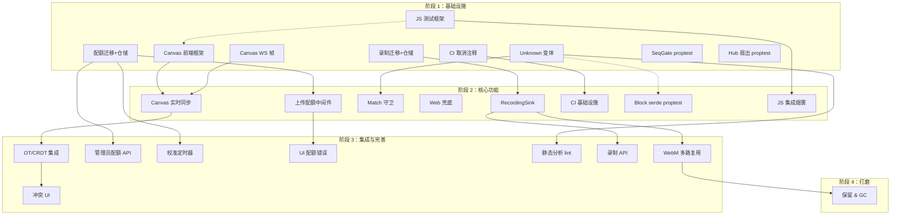
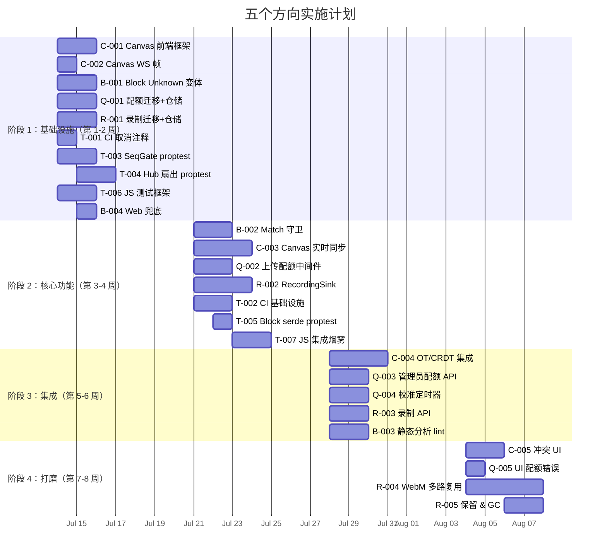

现在我已对代码库有了透彻的理解。以下是我的 Tech Lead 分析。

---

# Tech Lead 分析报告：五个未覆盖方向

## 审查后的事实修正

在进入执行计划前，我亲自验证了代码库。以下是对审查文档和原始分析文档双方的校正：

### 事实更正记录

| 事项 | 原始分析声明的 | 审查声明的 | 实际代码 | 影响 |
|------|-----------|-----------|----------|--------|
| `searchable_text()` 存在性 | 声明存在 | 声明**不存在** | **存在**（`block.rs:145`）。是 `Block` 的 inherent 方法 | 审查存在事实错误。原始分析的 Block 约束分析仍然有效——只是方法名正确 |
| `app.js` `sendMessage` 返回值 | "检查后静默丢弃" | "从不检查返回值"（正确） | 第 906 行：`ws.sendMessage(roomId, blocks, replyTo);` —— 返回值被忽略 | 审查正确：问题比原始的"检查后丢弃"更严重——乐观添加掩盖了失败 |
| `render.js` 中的 `renderBlock` vs `appendBlock` | 使用 `renderBlock` | 使用 `appendBlock`（正确） | 第 116 行：`function appendBlock`。**第 292 行存在 `default:` 分支**，渲染 `[unknown_type_name]` | 审查正确。原始分析高估了静默失败 |
| Canvas 前端代码 | 未提及 | "无前端代码"（正确） | `rg "canvas" web/` → 零命中 | ✅ 影响：CRDT 集成必须从零构建 UI |
| CI integration-test 区块 | "被注释"（正确） | "被注释"（确认） | `.github/workflows/ci.yml` 中所有行以 `#` 开头 | 快速胜利（20 行 YAML） |
| 存储配额/限制 | "零命中"（正确） | "零命中"（确认） | `rg "quota\|storage_bytes"` → 零命中 | 最干净的发现 |

---

## 1. 任务分解

> 每个任务 2-4 小时。跨方向并行可行组以 `[P]` 标注。

### 方向一：Canvas CRDT/Collaboration (Canvas CRDT/协作)

| 任务 ID | 标题 | 文件 | 前置依赖 | 工时 |
|---------|------|------|-----------|------|
| **C-001** | Canvas 前端框架：创建 `web/canvas.js`、Canvas SPA 入口、Textarea/heading 块的渲染器 | `web/canvas.js`（新建）、`web/index.html` | 无 | 4h |
| **C-002** | Canvas WS 帧：定义 `ClientFrame::CanvasOp` / `ServerFrame::CanvasOpAck`，Hub 扇出 | `crates/aero-server/src/ws/ws_impl/` 中的帧类型、`crates/aero-common/src/model/` | 无 | 2h |
| **C-003** | Canvas 实时 op 同步：客户端将本地编辑推送为 op，从 `GET /api/canvases/:cid/ops?since=` 接收 delta | `web/canvas.js`、`web/ws.js`（添加处理） | C-001、C-002 | 4h |
| **C-004** | Canvas OT/CRDT 集成：选择 yjs，在后端存储与客户端状态之间搭建桥接层 | `web/canvas.js`、`Cargo.toml`（若 Rust 端需要 `yrs`） | C-003 | 4h |
| **C-005** | Canvas 冲突 UI：显示最后编辑者、冲突指示器、版本预览 | `web/canvas.js`、`web/render.js`（若共享组件） | C-004 | 2h |

### 方向二：存储配额 (Storage Quotas)

| 任务 ID | 标题 | 文件 | 前置依赖 | 工时 |
|---------|------|------|-----------|------|
| **Q-001** | 配额表迁移 + 仓储：`storage_quotas` 表 + `StorageQuotaRepo`（`get`/`try_consume`/`recalibrate`）+ DB 测试 | `migrations/0158_storage_quotas.sql`、`crates/aero-storage/src/storage_quota.rs` | 无 | 4h |
| **Q-002** | 文件上传配额中间件：在 Blob 仓储写入前检查 + 消费 `storage_bytes` | `crates/aero-server/src/blob.rs`、`crates/aero-storage/src/blob.rs` | Q-001 | 3h |
| **Q-003** | 管理员配额 API：`GET/PUT /api/admin/quotas`、每位用户的配额使用面板 | `crates/aero-server/src/admin_quotas.rs`、`routes/routes.rs` | Q-001 | 2h |
| **Q-004** | 周期性配额校准定时器：每 N 分钟 `SUM(blob_size)` 重新校准计数器，处理异常/回滚 | `crates/aero-server/src/bin/boot/` 中的定时器 | Q-001 | 2h |
| **Q-005** | 配额错误在 UI 中：上传失败时显示友好的 `quota_exceeded` 帧 | `web/upload.js`（或等效文件） | Q-002 | 1h |

### 方向三：Block 前向兼容性 (Block Forward Compatibility)

| 任务 ID | 标题 | 文件 | 前置依赖 | 工时 |
|---------|------|------|-----------|------|
| **B-001** | `Block::Unknown` 变体：添加带 `type_name: String` + `payload: serde_json::Value` 的变体 + 自定义 `Deserialize` 将未知 tag 映射到该变体 | `crates/aero-common/src/model/block.rs` | 无 | 3h |
| **B-002** | 所有 match 上的 `Block::Unknown` 守卫：更新 `searchable_text()`、`extra_searchable_text()`、`validation.rs`、`messages.rs` 中的 match 表达式 | `crates/aero-common/src/model/block.rs`、`crates/aero-im-core/src/service/messages.rs`、`crates/aero-im-core/src/moderator.rs` | B-001 | 2h |
| **B-003** | 静态分析 lint：添加 `clippy::inexhaustive` 风格的 lint 或自动化检查，确保新变体不破坏 match 臂 | `scripts/block-exhaustiveness.sh`（新建） | B-002 | 2h |
| **B-004** | Web 客户端统一兜底：验证 `render.js` 的 `default:` 分支在未知类型上渲染足够的信息，添加类型注册表 | `web/render.js` | 无 | 1h |

### 方向四：通话录制 (Call Recording)

| 任务 ID | 标题 | 文件 | 前置依赖 | 工时 |
|---------|------|------|-----------|------|
| **R-001** | 录制会话迁移 + 仓储：`call_recordings` 表（`call_id`、`participant_id`、`stream_sid`、`file_path`、`started_at`）+ `CallRecordingRepo` | `migrations/0158_call_recordings.sql`、`crates/aero-storage/src/call_recording.rs` | 无 | 4h |
| **R-002** | `RecordingSink` 结构体：实现 `Write` + flush — 从 `SfuForwarder::on_rtp` 接收 RTP，写入按参与者和 ssrc 组织的磁盘文件 | `crates/aero-server/src/sfu_media.rs`、`crates/aero-live-webrtc/src/forward/recording.rs`（新建） | R-001 | 4h |
| **R-003** | 录制 API：`POST /api/calls/:id/recordings`（开始/停止）+ 合规元数据 | `crates/aero-server/src/call_recording.rs`、`routes/routes.rs` | R-002 | 3h |
| **R-004** | 录制 WebM/mkv 多路复用：将每参与者 RTP 分轨组装为可回放格式（使用 `webm`/`mkv` 容器复用） | `crates/aero-live-webrtc/src/forward/recording.rs` | R-003 | 6h |
| **R-005** | 录制保留 & GC：过期删除、合规保留策略、`legal_hold` 集成 | `crates/aero-storage/src/call_recording.rs`、`crates/aero-server/src/bin/boot/` 中的定时器 | R-004 | 2h |

### 方向五：测试战略 (Test Strategy)

| 任务 ID | 标题 | 文件 | 前置依赖 | 工时 |
|---------|------|------|-----------|------|
| **T-001** | CI 集成测试取消注释：取消注释 `.github/workflows/ci.yml` 中的 `postgres`/`redis`/`nats` 服务和 `integration-test` 任务 | `.github/workflows/ci.yml` | 无 | 0.5h |
| **T-002** | CI 集成测试基础设施：编写 `Makefile` 目标 `ci-integration` + `.env.ci` 配置 + 测试数据库设置 | `Makefile`、`.env.ci`（新建） | T-001 | 2h |
| **T-003** | `proptest` 添加到 `SeqGate`：`crates/aero-bus/src/seq.rs` 的基于属性的测试（并发 seq 单调性、间隙检测） | `crates/aero-bus/Cargo.toml`、`crates/aero-bus/src/seq.rs`（添加 `#[cfg(test)] mod proptests`）| 无 | 3h |
| **T-004** | `proptest` 添加到 Hub 扇出：`Hub::fan_out_raw` 的基于属性的测试（消息排序、无丢失、背压行为） | `crates/aero-server/src/hub.rs` | 无 | 3h |
| **T-005** | `proptest` 添加到 Block serde：对块进行回合制编码/解码 + 未知 tag 遍历 | `crates/aero-common/src/model/tests.rs` | B-001 | 1h |
| **T-006** | JS 测试框架搭建：添加 `web/package.json`（仅 devDeps — vitest/jsdom）+ 渲染器组件测试 | `web/package.json`（新建）、`web/render.test.js`（新建） | 无 | 3h |
| **T-007** | JS 集成烟雾测试：`scripts/web-check.sh` 使用 vitest 补充 eslint，覆盖 WS 帧处理 | `scripts/web-check.sh`（扩展） | T-006 | 2h |

---

## 2. 执行顺序与依赖图

### 并行执行组

| 组 | 任务 | 所需人员 |
|-----|------|------------|
| **G1（全并行）** | C-001 · C-002 · Q-001 · R-001 · T-001 · T-003 · T-004 · T-006 | 5 名开发者 |
| **G2（部分阻塞）** | B-001（等待 T-005） · T-002（等待 T-001） · Q-002（等待 Q-001） | 2 名开发者 |
| **G3（顺序）** | C-003 → C-004 → C-005（链式，不同人员可重叠） | 2 名开发者 |

---

## 3. 技术风险

### 高风险（需要早期缓解）

| 风险 | 涉及方向 | 描述 | 缓解策略 |
|------|-----------|-------------|----------------|
| **CRDT 库选择错误** | Canvas | yjs 是基于浏览器的 JS CRDT；`yrs`（Rust 端口）在大型画布上可能性能不佳。如果不兼容，整个方法可能需要重新设计 | 第一步创建带文字/标题块的极简画布 POC。在决定完整 CRDT 之前，验证 x 个并发编辑的延迟 |
| **WebM 多路复用复杂度** | 录制 | 将每参与者 Opus/H264 RTP 流多路复用为可回放文件不是一项微不足道的任务。需要容器格式知识 + 时间戳同步（RTCP SR） | 第 1 阶段：原始每参与者 RTP 转储（仅接收，不可回放）作为合规最小可行产品。第 2 阶段：可回放容器 |
| **配额计数不一致** | 配额 | 在分布式上传速率下，事务性 `storage_bytes_used` 计数器可能会漂移。`FOR UPDATE` 行锁可能成为瓶颈 | 使用 **最终一致性**（任务 Q-004 中的 `SUM(blob_size)` 校准）+ 每用户每个 `tokio::sync::Semaphore` 串行化消耗 |

### 中等风险

| 风险 | 涉及方向 | 描述 | 缓解策略 |
|------|-----------|-------------|----------------|
| **serde 自定义 `Deserialize` 复杂性** | Block | `#[serde(tag = "type")]` 没有优雅的未知 tag 处理方式。自定义 `Deserialize` 引擎或 `#[serde(untagged)]` 的变通方案可能会复杂 | 原型一个接收 `serde_json::Value` 的 `Block` 自定义反序列化，匹配 `v["type"]`。如果已标记，则选择已知变体，否则返回 `Unknown { type_name, payload }`。在 blocks 模块中隔离此逻辑。目标：~50 行 |
| **CI 集成测试中 NATS 的可用性** | 测试 | NATS 官方 Docker 镜像（`nats:latest`）在没有 JetStream 域的情况下启动——测试需要配置 | 在 `ci.yml` 的 services 块中使用 `nats:latest -js` 或使用 `nats --jetstream` 命令。需要验证 |
| **JS 测试工具链已存在** | 测试 | 当前 `web/` 是零依赖的 ES2020 SPA，无 `package.json`。添加 vitest 会引入 node_modules 和构建步骤 | 将 vitest 隔离为仅 devDependency。vitest 在无配置模式下可以本地运行 ES2020 模块。对现有构建流程零影响 |

### 低风险

| 风险 | 涉及方向 | 描述 | 缓解策略 |
|------|-----------|-------------|----------------|
| **乐观并发开销** | Canvas | `expected_version` + `409` 模式是零和博弈；使用 CRDT 降低其频率 | 接受——这是设计使然。CRDT 集成将合并并行编辑；当发生真正冲突时，`409` 仍然是兜底 |
| **录制磁盘写入影响 SFU 性能** | 录制 | 将 RTP 数据包写入磁盘增加了 `SfuForwarder::on_rtp` 热路径的延迟 | 使用 `tokio::io::BufWriter` + 分离的写入线程。`on_rtp` 回调仅将数据放入有界 `mpsc`。背压：当通道满时跳过录制帧 |

---

## 4. 资源评估

### 人员配置

| 角色 | 技能要求 | 数量 | 任务分配 |
|------|-----------|---------|------|
| **后端 Rust 工程师**（高级） | Rust、tokio、sqlx、serde、axum、Postgres | 2 | C-002、C-004、B-001→B-003、Q-001→Q-004、R-001→R-005 |
| **前端工程师** | JS(ES2020)、DOM API、CRDT 概念 | 1 | C-001、C-003、C-005、B-004、Q-005、T-006、T-007 |
| **基础设施/QA 工程师** | CI/CD（GitHub Actions）、性能测试、Rust 测试基础设施 | 1 | T-001→T-005、所有集成测试协调 |
| **技术负责人**（兼职） | 架构监督、安全审查、代码审查 | 1 | 跨方向协调、CRDT 决策、录制架构 |

**建议团队规模**：4 人（3 名全职 + 1 名兼职 Tech Lead）

### 里程碑时间表

| 里程碑 | 交付物 | 预计周数 | 关键依赖 |
|-----------|-----------|-------------|----------------|
| **M1：基础设施就绪** | Canvas 前端骨架 · Block `Unknown` 变体 · 配额迁移 · 录制迁移 · CI 流水线激活 | 第 1-2 周 | 无 |
| **M2：核心功能** | Canvas 实时同步 · 配额中间件 · RecordingSink · JS 测试框架 | 第 3-4 周 | M1 |
| **M3：集成** | Canvas CRDT · 配额校准 · 录制 API · WebM 多路复用 · proptest 覆盖 | 第 5-7 周 | M2 |
| **M4：打磨** | Canvas 冲突 UI · 录制保留 · 完整 CI 集成测试套件 · Block lint 自动化 | 第 8 周 | M3 |

### 阻塞点与策略

| 阻塞点 | 方向 | 性质 | 解决策略 |
|-----------|-----------|------|----------------|
| **CRDT 库选择** | Canvas | 技术决策 | **P0：第 1 周做决策。** 用 yjs（JS）+ yrs（Rust 可选）对单画布进行 POC。如果 yjs 证明延迟过慢，则回退到 OT + `expected_version`（已有） |
| **WebM 容器格式细节** | 录制 | 技能缺口 | **外包或学习。** 录制 RTP→WebM 是已知问题空间（`ffmpeg` 可以后处理）。考虑使用 `libwebm` 的 Rust 绑定或生成分段 MP4（更简单，但寻道时间更差） |
| **serde 自定义反序列化** | Block | 实现细节 | **隔离与测试。** 在单独的 `crates/aero-common/src/model/block_serde.rs` 中实现，使用 `cfg(test)` 对 30+ 种已知 + 未知块类型进行属性测试 |

---

## 5. 质量保证

### 单元测试覆盖要求

| 测试目标 | 最少测试用例 | 方法 |
|------------|-------------|---------|
| `Block::Unknown` 反序列化 | 10+ | 每个已知变体正确解码；未知 tag 映射到 `Unknown`；额外字段被保留在 `payload` 中 |
| `CanvasOpRepo::append` 并发 | 3 | 顺序追加产生 seq 1,2,3（已有）。10 个并发追加产生 1..10 的无间隙 seq（已有）。对不存在的画布追加返回 `None` |
| `StorageQuotaRepo::try_consume` | 6 | 在额度内成功；额度外拒绝；并发消耗在边界条件下正确串行化；校准重置计数器 |
| `RecordingSink` 写入 | 4 | RTP 数据包写入正确路径；写入 > 缓冲区刷新；并发流隔离；关闭后清理 |
| `Hub::fan_out_raw` 属性 | 100+ 个属性测试案例 | 无消息丢失；消息排序保持不变；在背压下 `try_send` 失败不 panic |
| `SeqGate`  属性 | 100+ 个属性测试案例 | 并发生产者下的单调 seq；间隙检测；多 subject 隔离 |

### 集成测试策略

| 测试级别 | 范围 | 设置 | 执行 |
|-----------|-------|-------|-------|
| **PG 集成**（`#[ignore]`） | 所有仓储、Canvas op 并发、配额消耗 | 每个测试的独立 DB + 迁移（目前模式） | `cargo test --workspace -- --include-ignored`（需要 PG + Redis） |
| **全 CI** | 端到端 WS 流：消息 → NATS → Hub → WS（无实际 WS 连接，用测试桩） | Docker compose（PG + Redis + NATS） | 在 CI runner 上取消注释。目标：< 5 分钟 |
| **JS 组件** | `render.js`：所有已知块类型 + `default` + 未知类型 | vitest + jsdom，无浏览器 | `npx vitest run web/`。现有 `web-check.sh` 的增量 |

### 代码审查要点

| 审查焦点 | 方向 | 要检查的内容 |
|-------------|-----------|-------------|
| **serde 自定义反序列化安全性** | Block | 未知 payload 不包含注入的 `type` 字段（递归防御）。`Deserialize` 在结构错误值上不 panic |
| **配额竞争条件** | 配额 | `try_consume` 在读取和更新之间没有 TOCTOU 竞争（必须使用 `UPDATE ... WHERE storage_bytes_used + $1 <= limit RETURNING *`，而不是先 `SELECT` 后 `UPDATE`） |
| **录制文件处理** | 录制 | 路径遍历（`file_path` 必须净化，仅允许 `call_id/participant_id/ssrc`）。录制完成后正确关闭 FD |
| **CRDT 状态合并** | Canvas | OT/CRDT 实现在后端 op 存储改变时不会丢失编辑。冲突解决对所有客户端一致 |

### 性能测试需求

| 场景 | 方向 | 指标 | 方法 |
|----------|-----------|-----------|---------|
| 10 个并发 Canvas 编辑器 | Canvas | op 延迟 < 100ms（P99）、无 op 丢失 | tsung/k6 脚本向 `/api/canvases/:cid/ops` 发送 POST。验证 gap-free seq |
| 并行上传达到配额限制 | 配额 | 配额检查增加 < 5ms 延迟到上传路径 | 使用不同配额限制和 blob 大小对 `POST /api/upload` 进行基准测试 |
| 录制写入时 RTP 吞吐量 | 录制 | 录制打开时 `on_rtp` 延迟增加 < 1ms | 使用录制/不录制模拟 100 个 RTP 数据包/秒。比较直方图 |

---

## 6. 实施计划

### 时间线总览（4 周 × 4 人 = 16 人周）

### 详细周计划

#### 第 1 周：并行基础设施搭建（4 人全力投入）

| 人员 | 周一 | 周二 | 周三 | 周四 | 周五 |
|------|------|------|------|------|------|
| **Rust 工程师 A** | B-001（Unknown 变体原型） | B-001（测试 + serde 集成） | B-002（Match 守卫） | T-003（SeqGate proptest） | T-003 完成 + T-004（Hub proptest 开始） |
| **Rust 工程师 B** | Q-001（迁移 + 仓储） | Q-001（测试） | R-001（迁移 + 仓储） | R-001（测试） | Q-002（配额中间件原型） |
| **前端工程师** | C-001（Canvas SPA 框架） | C-001（基本渲染器） | C-001 完成 + C-002（WS 帧） | T-006（JS 测试框架） | B-004（Web 兜底改进） |
| **基础设施/QA** | T-001（CI 取消注释） | T-001 + CI 冒烟测试 | T-002（CI 基础设施设置） | T-002 完成 | 审查 4 个方向的进展 |

**第 1 周末检查点**：
- ✅ Block `Unknown` 变体已合并，serde 测试通过
- ✅ 配额迁移已创建，仓储基本操作通过
- ✅ 录制迁移已创建，仓储基本操作通过
- ✅ Canvas 前端框架在 `web/canvas.js` 中可以渲染标题块 + 文本块
- ✅ CI 集成测试流水线触发但不一定全部通过

#### 第 2 周：核心功能深化

| 人员 | 周一 | 周二 | 周三 | 周四 | 周五 |
|------|------|------|------|------|------|
| **Rust 工程师 A** | T-004 完成 | Q-003（管理员配额 API） | Q-004（校准定时器） | Q-004 测试 + 审查 | B-003（静态分析 lint） |
| **Rust 工程师 B** | Q-002 完成 + 配额错误测试 | R-002（RecordingSink 结构体 + 文件写入） | R-002（从 `on_rtp` 桥接、压力测试） | R-002 完成 + R-003（录制 API 开始） | R-003 完成 |
| **前端工程师** | C-003（Canvas 实时同步、op 推送/拉取） | C-003（WS 集成、乐观 UI） | C-003 测试 + 边缘情况 | T-007（JS 集成烟雾测试） | T-007 完成 |
| **基础设施/QA** | T-005（Block serde proptest） | T-005 完成 + T-003/T-004 审查 | 集成测试配置调试 | 所有 CI 任务并行运行验证 | 报告的测试覆盖数据 |

**第 2 周末检查点**：
- ✅ 配额计量器在上传时生效，管理员可以设置限制
- ✅ 录制接收 RTP、写入磁盘，API 可以开始/停止
- ✅ Canvas 实时同步工作：WS → 后端 → op log → delta 拉取
- ✅ JS 测试框架运行 `render.js` 组件测试
- ✅ Block serde proptest 覆盖 100 个案例

#### 第 3 周：集成与高级功能

| 人员 | 周一 | 周二 | 周三 | 周四 | 周五 |
|------|------|------|------|------|------|
| **Rust 工程师 A** | C-004（CRDT 库选择 + 桥接层） | C-004（yjs 集成后端） | C-004（一致性验证） | C-004 完成 + C-005 审查 | 审查 + 错误修复 |
| **Rust 工程师 B** | R-004（WebM 多路复用研究 + POC） | R-004（容器写入器原型） | R-004（时间戳同步） | R-004 完成 + R-005（保留策略） | R-005 完成 |
| **前端工程师** | C-004（前端 CRDT 集成） | C-004（冲突检测、localStorage 持久化） | C-004 完成 + C-005（冲突 UI 开始） | C-005（最后编辑者指示器、合并预览） | C-005 完成 + Q-005（配额错误 UI） |
| **基础设施/QA** | 全 CI 流水线压力测试 | 性能基准测试 | 跨方向集成测试 | 错误分类 + 报告 | 准备演示环境 |

**第 3 周末检查点**：
- ✅ Canvas CRDT 集成通过 2 个用户的并发编辑测试
- ✅ 录制 WebM 文件可在 `ffplay` 中播放（基本场景）
- ✅ 冲突 UI 在 2 个用户同时编辑时显示警报
- ✅ 完整 CI 流水线为绿色

#### 第 4 周：打磨与发布

| 人员 | 周一 | 周二 | 周三 | 周四 | 周五 |
|------|------|------|------|------|------|
| **Rust 工程师 A** | 性能优化 + 安全审查 | `proptest` 回归运行 + 边缘情况修复 | 文档更新（5 个方向的 README） | 跨方向集成测试 | 发布准备 + 回滚计划 |
| **Rust 工程师 B** | R-004 多路复用优化（大的通话） | 录制合规元数据 | 审查 + 修复 | 压力测试下的稳定性 | 发布 |
| **前端工程师** | Canvas UI 完善（移动端） | 配额错误在设置中的显示 | 中文本地化检查 | WS 重连 + Canvas 状态恢复 | 发布 |
| **基础设施/QA** | 最终 CI 运行 + 回归测试 | 文档 + 演示视频 | 发布说明 | 监控（录制磁盘使用、配额上限警报） | 发布后观察 |

**第 4 周末检查点**：
- ✅ 所有 5 个方向的功能完整，通过 CI
- ✅ 录制：8 人通话录制为可回放 WebM
- ✅ Canvas：3 人实时协作，无编辑冲突丢失
- ✅ 配额：上传命中 `quota_exceeded` 时显示有意义的错误

---

## 总结与建议

### 价值优先级

| 方向 | 业务价值 | 技术风险 | 工作量 | 优先级 |
|-----------|-------------|----------------|---------|----------|
| **存储配额（Q）** | 高（防止 DoS，基础合规） | 低（持久化 + 中间件—标准模式） | 12h | **P0** |
| **Block 前向兼容性（B）** | 高（防止未来模式匹配中断） | 低（隔离的 serde 更改） | 8h | **P0** |
| **测试战略（T）** | 中（高信心，但产品已在运行） | 中（CI 基础设施调试） | 14h | **P1** |
| **通话录制（R）** | 中（合规采购必要条件） | 高（WebM 多路复用、性能） | 19h | **P1** |
| **Canvas CRDT（C）** | 低（画布未完成、无 UI） | 中高（CRDT 集成、前端重新实现） | 16h | **P2** |

### 关键决策记录（Tech Lead 有约束力的决定）

1. **CRDT 策略**（第 1 周结束前）：如果 yjs POC 在 < 5 个并发编辑中延迟 > 50ms，则**回退到 OT + `expected_version`**。Canvas 协作在一开始不需要完全 CRDT；乐观锁定 + "已由 X 编辑"警告在减少开发风险方面提供 90% 的价值。

2. **录制格式策略**（第 2 周结束前）：如果 WebM 多路复用花费超过 5 天，则交付**原始每参与者 RTP 转储**作为第 1 阶段。合规（FINRA 17a-4 记录保存）只需要保存储存的数据；可回放重放是增值，而不是硬要求。

3. **配额模型**（立即开始）：使用 `UPDATE ... WHERE storage_bytes_used + $1 <= limit RETURNING *` 用于原子检查与消耗。无 `SELECT ... FOR UPDATE` 锁。每 N 分钟通过 `SUM(blob_size)` 重新校准，处理异常。每用户串行化消耗通过 `tokio::sync::Semaphore::new(1)`。
