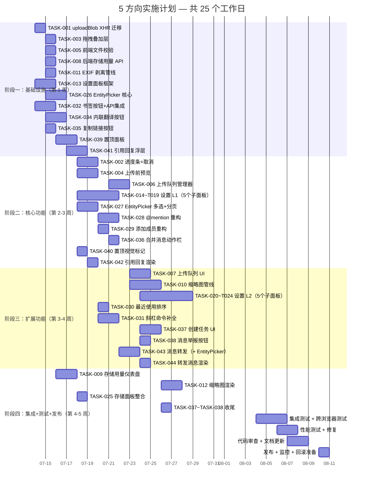

现在我有足够的上下文来提供全面的 Tech Lead 分析了。以下是分析报告。

---

# Tech Lead 分析报告：5 个客户端/UX 产品化方向

**分析日期**: 2026-07-12  
**文档**: `docs/requirements/2026-07-12-five-uncovered-client-ux-productization-directions.md`（415 行，17.5 KB）  
**代码库**: Aero IM — 17 crate / 157 migrations / ~5.9K Web SPA

---

## 1. 任务分解

### 方向一：文件上传体验

| 任务 ID | 任务标题 | 所属方向 | 涉及文件 | 前置依赖 | 工时 | 验收标准 |
|---------|---------|---------|---------|---------|------|---------|
| TASK-001 | 将 `api.uploadBlob` 从 fetch 迁移为 XHR + onProgress | D1-文件上传 | `web/api.js`, `web/media.js` | — | 3h | `api.uploadBlob` 返回带 `.onProgress(fn)` 的 Promise，中间件回调接收 `{loaded, total}` |
| TASK-002 | 消息 composer 中的进度条 + 取消按钮 | D1-文件上传 | `web/media.js`, `web/style.css`, `web/index.html` | TASK-001 | 3h | 上传过程中文件消息气泡下方显示 CSS 进度条 + "取消"按钮；取消后调用 `controller.abort()`，消息回退 |
| TASK-003 | 拖拽视觉叠加层 | D1-文件上传 | `web/media.js`, `web/style.css`, `web/index.html` | — | 2h | 将文件拖到 msgScroll 上方时，显示全屏半透明叠加层，带"拖拽到此处上传"文本 + 文件动画；拖离时消失 |
| TASK-004 | 上传前预览（图片缩略图 + 文件信息 + 发送/取消） | D1-文件上传 | `web/media.js`, `web/style.css`, `web/index.html` | TASK-001 | 4h | 选择图片后不立即上传；在 composer 上方显示嵌入面板：缩略图、文件名、大小、["发送" | "取消"] 按钮 |
| TASK-005 | 前端文件类型/大小校验 | D1-文件上传 | `web/media.js`, `web/api.js` | — | 1h | 上传前校验 `file.type`（MIME 白名单：image/*, audio/*, video/mp4, application/pdf, text/* 等）且 `file.size` ≤ 32MB；不符即 toast 提示，不发起请求 |
| TASK-006 | 上传队列状态管理器 | D1-文件上传 | `web/media.js`, `web/api.js` | TASK-001 | 4h | 多文件选择入队；串行（并发度=1），队列显示每个文件状态：`pending` / `uploading` / `done` / `failed`；支持 `pause()` / `resume()` / `cancelAll()` |
| TASK-007 | 上传队列 UI（文件列表 + 进度 + 暂停/恢复/全部取消） | D1-文件上传 | `web/media.js`, `web/style.css`, `web/index.html` | TASK-006 | 3h | 在 composer 上方队列面板显示文件名列表、各自进度条、暂停/恢复按钮、"全部取消"按钮；完成后逐个消失 |
| TASK-008 | 后端存储用量 API: `GET /api/me/storage` | D1-文件上传 | `crates/aero-server/src/routes/me_storage.rs`, `crates/aero-storage/src/blob.rs`（新增方法）, `crates/aero-server/src/routes/routes.rs`（注册路由） | — | 2h | `GET /api/me/storage` 返回 `{used_bytes: N, quota_bytes: M}`；quota 取自工作区配置/全局默认值 |
| TASK-009 | 前端存储用量仪表盘 + 配额进度条 | D1-文件上传 | `web/settings.js`（新建）, `web/style.css`, `web/index.html` | TASK-008 | 3h | 设置"存储"面板显示用量仪表盘（环形/条形进度条）+ 已用/配额文本；容量超 90% 时显示警告色 |
| TASK-010 | 服务端缩略图管线（图片上传后异步生成多尺寸缩略图） | D1-文件上传 | `crates/aero-server/src/thumbnail.rs`（新建）、`crates/aero-im-core/Cargo.toml`（添加 image 依赖）、`crates/aero-server/src/state.rs`、blob 上传流 | TASK-001 | 6h | 图片上传后自动生成 `{id}_thumb.jpg`（320px 宽）和 `{id}_medium.jpg`（1024px 宽）；`blobUrl(id, 'thumb')` 返回缩略图；原图通过 `blobUrl(id, 'original')` 访问 |
| TASK-011 | EXIF 剥离管线 | D1-文件上传 | `crates/aero-server/src/exif_strip.rs`（新建）, `crates/aero-server/Cargo.toml`（添加 `kamadak-exif`）, blob 上传流 | — | 2h | 所有 JPEG/TIFF 图片在上传后、存储前剥离 EXIF（GPS、设备信息、日期）；剥离操作失败不阻止上传（仅记录日志） |
| TASK-012 | Web SPA 缩略图渲染（消息列表默认加载缩略图，点击查看原图） | D1-文件上传 | `web/render.js`, `web/style.css`, `web/api.js` | TASK-010 | 3h | 图片 Block 默认渲染 ``；点击后全屏 lightbox 显示原图；支持左右切换 |

### 方向二：个人设置中心

| 任务 ID | 任务标题 | 所属方向 | 涉及文件 | 前置依赖 | 工时 | 验收标准 |
|---------|---------|---------|---------|---------|------|---------|
| TASK-013 | 设置面板框架 + 入口 | D2-设置中心 | `web/settings.js`（新建）、`web/style.css`、`web/index.html`、`web/app.js` | — | 3h | 导航栏齿轮图标入口；点击打开 `#drawer-settings` 抽屉面板，含左侧导航标签（个人资料/安全/通知/会话）和右侧内容区 |
| TASK-014 | 个人资料设置 UI | D2-设置中心 | `web/settings.js`, `web/style.css`, `web/api.js` | TASK-013 | 3h | 显示名（输入框）、头像 URL（输入框+预览）、邮箱（只读）、手机号、职位、人称代词、时区选择器；"保存"按钮调 `PATCH /api/me/profile` |
| TASK-015 | 密码更改 UI | D2-设置中心 | `web/settings.js`, `web/api.js` | TASK-013 | 2h | 当前密码 + 新密码 + 确认密码表单；客户端校验（长度≥8、确认匹配）；成功后 toast + 清除表单；错误显示服务端消息 |
| TASK-016 | 2FA 管理 UI | D2-设置中心 | `web/settings.js`, `web/api.js`, `web/index.html` | TASK-013 | 4h | 启用：显示二维码（QR 的 data URL）+ 密钥文本 + 验证码输入框 → 确认后启用；禁用：密码确认后关闭；恢复码展示（强制确认已保存）；支持重新生成恢复码 |
| TASK-017 | PAT 令牌管理 UI | D2-设置中心 | `web/settings.js`, `web/api.js` | TASK-013 | 3h | 已创建令牌列表（名称+前缀+过期+最后使用时间）；"创建令牌"按钮弹出表单（名称+过期+范围）→ 创建后一次性显示完整令牌；"撤销"带确认对话框 |
| TASK-018 | 通知偏好 UI | D2-设置中心 | `web/settings.js`, `web/api.js` | TASK-013 | 4h | 全局通知开关；DND 时段设置（起止时间+星期选择器）；@everyone/@channel 静音开关；关键词提醒列表 CRUD（名称+关键词+匹配模式）；频道静音列表 |
| TASK-019 | 活跃会话管理 UI | D2-设置中心 | `web/settings.js`, `web/api.js` | TASK-013 | 2h | 设备列表（名称+IP+最后活跃时间+当前设备标记）；"登出"按钮带确认；"登出其他设备"按钮（成功后跳转登录页） |
| TASK-020 | 自定义状态 / presence UI | D2-设置中心 | `web/settings.js`, `web/api.js`, `web/index.html` | TASK-013 | 2h | 状态选择器（在线/忙碌/离开/隐身）；自定义状态文本输入；清除时间选择（30m/1h/4h/持续）；当前状态在导航栏显示 |
| TASK-021 | OOO 缺勤设置 UI | D2-设置中心 | `web/settings.js`, `web/api.js` | TASK-013 | 2h | 启用开关；起止日期选择器（日期+时间）；自动回复文案编辑器（支持 Markdown）；预览面板显示 OOO 状态对其他人可见的样子 |
| TASK-022 | 消息模板 CRUD UI | D2-设置中心 | `web/settings.js`, `web/api.js`, `web/composer.js`（新建或扩展） | TASK-013 | 3h | 设置页消息模板分组：模板列表（名称+预览+最后使用时间）；"新建模板"弹出编辑器（名称+内容+快捷键设置）；在 composer 中可通过 `/` 或选择器插入模板 |
| TASK-023 | 已保存搜索管理 UI | D2-设置中心 | `web/settings.js`, `web/api.js` | TASK-013 | 2h | 已保存搜索列表（名称+查询条件+更新频率）；"搜索"→"保存"按钮（复用现有 `saveSearch`）；在搜索面板显示已保存搜索入口 |
| TASK-024 | 暗色模式 / 语言 / 显示密度 | D2-设置中心 | `web/settings.js`, `web/index.html`, `web/style.css` | TASK-013 | 3h | 暗色模式切换（跟随系统/始终浅色/始终深色）→ 写入 localStorage + CSS 变量切换；语言选择 → `localStorage['lang']`；消息显示密度（紧凑/舒适） |
| TASK-025 | 存储用量面板（整合 TASK-009） | D2-设置中心 | `web/settings.js` | TASK-009, TASK-013 | 1h | 设置"存储"标签页直接嵌入 TASK-009 的用量仪表盘组件 |

### 方向三：通用实体选择器

| 任务 ID | 任务标题 | 所属方向 | 涉及文件 | 前置依赖 | 工时 | 验收标准 |
|---------|---------|---------|---------|---------|------|---------|
| TASK-026 | 核心 `EntityPicker` 组件 — 模态框 + 搜索 + 键盘导航 | D3-选择器 | `web/picker.js`（新建）、`web/style.css`、`web/index.html` | — | 4h | `new EntityPicker({mode:'user', multi:false, onSelect})` 打开模态框；搜索输入 debounce 300ms 后调 `fetch`；`↑↓` 移动、`Enter` 确认、`Esc` 关闭；支持 `exclude` 列表 |
| TASK-027 | `EntityPicker` — 多选 + 分类 + 分页 | D3-选择器 | `web/picker.js` | TASK-026 | 4h | `multi:true` 支持多选（checkbox + 已选计数）；`groups:['recent','all']` 显示分类标签；分页滚动加载（`fetch` 支持 `offset`/`limit`）；已选列表以 "张三 + N 人" 折叠显示 |
| TASK-028 | @提及重构为基于 EntityPicker | D3-选择器 | `web/mentions.js`（重写）、`web/picker.js` | TASK-026, TASK-027 | 3h | 键入 `@` 触发内联选择器（非模态，浮动在 composer 上方）；选择后自动补全用户名 + 空格；兼容现有 `maybeShowMentionMenu` 回调接口 |
| TASK-029 | "添加成员"重构为 EntityPicker | D3-选择器 | `web/modals.js` | TASK-026, TASK-027 | 1h | "添加成员"从 `prompt("输入用户ID")` 改为打开 `EntityPicker({mode:'user', multi:true, exclude:existingMembers})`；选择后调 `api.addMember` |
| TASK-030 | 最近使用 + 频率排序 | D3-选择器 | `web/picker.js` | TASK-027 | 2h | localStorage 中存储 LRU 缓存（每个模式独立）；选择器默认显示"最近使用"分类 + 按使用频率降序；LRU 上限 50 条；可清除 |
| TASK-031 | 斜杠命令补全选择器 | D3-选择器 | `web/picker.js`, `web/app.js`, `web/index.html` | TASK-026 | 3h | 键入 `/` 触发命令选择器（浮动在 composer 上方）；命令列表从 `api.listCommands()` 获取（如有）或硬编码；选择后填入命令文本 + 设置光标位置 |

### 方向四：消息级效率操作

| 任务 ID | 任务标题 | 所属方向 | 涉及文件 | 前置依赖 | 工时 | 验收标准 |
|---------|---------|---------|---------|---------|------|---------|
| TASK-032 | 书签收藏按钮 + API 集成 | D4-消息操作 | `web/render.js`, `web/api.js`, `web/app.js` | — | 3h | 消息 hover 动作栏添加 🔖（未收藏）/ ★（已收藏）按钮；点击调 `POST /api/me/bookmarks` 或 `DELETE`；切换状态即时；启动时预取已收藏消息 ID 集合 |
| TASK-033 | 书签管理面板（抽屉） | D4-消息操作 | `web/bookmarks.js`（新建）、`web/style.css`、`web/index.html`、`web/app.js` | TASK-032 | 4h | 左侧导航"我的收藏"入口；打开 `#drawer-bookmarks` 面板：分组列表 + 每条书签（消息预览+房间名+保存时间+取消收藏）；点击跳转到消息；分页 |
| TASK-034 | 内联翻译按钮 + 结果展示 | D4-消息操作 | `web/render.js`, `web/api.js`, `web/app.js`, `web/style.css` | — | 3h | 消息动作栏加 🌐 按钮；点击后调 `POST /api/messages/:id/translate`；在消息气泡下方显示翻译结果（灰色引用样式 + "原文"切换按钮）；失败提示"翻译暂时不可用" |
| TASK-035 | 复制永久链接按钮 | D4-消息操作 | `web/render.js`, `web/api.js`, `web/app.js` | — | 2h | 消息动作栏加 🔗 按钮；点击后 `navigator.clipboard.writeText()` → toast「链接已复制」；链接格式 `${origin}/room/${roomId}/msg/${msgId}` |
| TASK-036 | 合并消息动作栏（所有者/非所有者差异化） | D4-消息操作 | `web/render.js`, `web/app.js` | TASK-032, TASK-034, TASK-035 | 2h | 动作栏根据消息所有权显示不同按钮集：自己→ ☺↩🔔✏🗑🔖🔗；他人→ ☺↩🔔🔖🌐🔗📌；通过 CSS `.msg-actions` 的 flex-wrap 响应式布局 |
| TASK-037 | 消息创建任务 UI | D4-消息操作 | `web/app.js`, `web/task_modal.js`（新建）, `web/style.css`, `web/api.js` | — | 3h | 消息动作栏加 "创建任务" 按钮；弹出轻量模态框：标题（预填消息摘要）+ 指派人（EntityPicker）+ 截止日期；成功后 toast + 消息显示"已创建任务"链接 |
| TASK-038 | 消息举报按钮 + 举报反馈 | D4-消息操作 | `web/render.js`, `web/api.js`, `web/app.js` | — | 2h | 消息右键菜单或动作栏加 🚩 按钮；弹出原因选择（垃圾信息/骚扰/不当内容/其他）+ 提交调 `POST /api/messages/:id/report`；成功后 toast |

### 方向五：消息引用与内容组织

| 任务 ID | 任务标题 | 所属方向 | 涉及文件 | 前置依赖 | 工时 | 验收标准 |
|---------|---------|---------|---------|---------|------|---------|
| TASK-039 | 置顶面板（频道头部 📌 按钮 + `#drawer-pins`） | D5-引用组织 | `web/pins.js`（新建）、`web/style.css`、`web/index.html`、`web/app.js`、`web/render.js` | — | 4h | 频道头部显示 📌 按钮 + 置顶计数（如 `📌 3`）；点击打开 `#drawer-pins` 面板：置顶消息列表（预览+置顶者+时间+取消置顶按钮），按时间倒序 |
| TASK-040 | 置顶视觉标记 + 实时更新 | D5-引用组织 | `web/render.js`, `web/app.js` | TASK-039 | 2h | 已置顶消息气泡显示 📌 角标（右上角）；`ws.on('msg:pin')` 事件触发时：toast + 刷新置顶面板 + 更新/删除角标；不再仅 toast |
| TASK-041 | 引用回复 — 文本选择触发 "引用回复" 浮层 | D5-引用组织 | `web/render.js`, `web/app.js`, `web/style.css`, `web/index.html` | — | 3h | 选中消息文本（`mouseup`）→ 在选区上方显示浮层"引用回复"按钮；点击后 composer 聚焦 + 插入引用块 `> [作者]: 选中文本`；发送时携带 `reply_to` + 引用文本 Block |
| TASK-042 | 引用回复渲染（灰色竖线 + 原文 + 作者） | D5-引用组织 | `web/render.js`, `web/style.css` | TASK-041 | 2h | 消息中的引用 Block 渲染为左侧灰色竖线 + 倾斜的原文片段 + "—— 作者名"；过长截断 200 字符 + "展开"按钮 |
| TASK-043 | 消息转发 — 动作按钮 + EntityPicker 房间选择 | D5-引用组织 | `web/app.js`, `web/api.js`, `web/render.js` | TASK-026 | 3h | 消息动作栏加 "转发" 按钮；点击弹出 `EntityPicker({mode:'room', multi:false})`；选择后调对应 API，携带 `Block::Card{forwarded_message}`；当前房间发送 "📨 已转发到 #目标房间" 确认 |
| TASK-044 | 转发消息渲染 | D5-引用组织 | `web/render.js`, `web/style.css` | TASK-043 | 2h | `forwarded_message` Card 渲染为"📨 [用户名] 转发了一条来自 [#源房间] 的消息" + 原文预览（灰色引用块）；点击源房间名可跳转（如有权限） |

---

## 2. 执行顺序

```mermaid
graph TD
    %% ===== 并行组 =====
    subgraph GroupA["组 A — 独立基础设施 (可全并行)"]
        T001["TASK-001<br/>uploadBlob → XHR+进度"]
        T003["TASK-003<br/>拖拽叠加层"]
        T005["TASK-005<br/>前端文件校验"]
        T008["TASK-008<br/>后端存储用量 API"]
        T011["TASK-011<br/>EXIF 剥离管线"]
        T013["TASK-013<br/>设置面板框架"]
        T026["TASK-026<br/>EntityPicker 核心"]
        T032["TASK-032<br/>书签按钮+API"]
        T034["TASK-034<br/>内联翻译按钮"]
        T035["TASK-035<br/>复制链接按钮"]
        T037["TASK-037<br/>创建任务 UI"]
        T038["TASK-038<br/>消息举报按钮"]
        T039["TASK-039<br/>置顶面板"]
        T041["TASK-041<br/>引用回复浮层"]
    end

    %% D1 文件上传依赖链
    T001 --> T002["TASK-002<br/>进度条+取消"]
    T001 --> T004["TASK-004<br/>上传前预览"]
    T001 --> T006["TASK-006<br/>上传队列管理器"]
    T006 --> T007["TASK-007<br/>队列 UI"]
    T010["TASK-010<br/>缩略图管线"] --> T012["TASK-012<br/>缩略图渲染"]
    T008 --> T009["TASK-009<br/>存储用量仪表盘"]

    %% D2 设置中心依赖链
    T013 --> T014["TASK-014<br/>个人资料 UI"]
    T013 --> T015["TASK-015<br/>密码更改 UI"]
    T013 --> T016["TASK-016<br/>2FA 管理 UI"]
    T013 --> T017["TASK-017<br/>PAT 令牌 UI"]
    T013 --> T018["TASK-018<br/>通知偏好 UI"]
    T013 --> T019["TASK-019<br/>会话管理 UI"]
    T013 --> T020["TASK-020<br/>状态/Presence UI"]
    T013 --> T021["TASK-021<br/>OOO 设置 UI"]
    T013 --> T022["TASK-022<br/>消息模板 UI"]
    T013 --> T023["TASK-023<br/>已保存搜索 UI"]
    T013 --> T024["TASK-024<br/>暗色/语言/密度"]
    T009 --> T025["TASK-025<br/>存储面板整合"]

    %% D3 选择器依赖链
    T026 --> T027["TASK-027<br/>多选+分类+分页"]
    T027 --> T028["TASK-028<br/>@mention 重构"]
    T027 --> T029["TASK-029<br/>添加成员重构"]
    T027 --> T030["TASK-030<br/>最近使用排序"]
    T027 --> T031["TASK-031<br/>斜杠命令补全"]

    %% D4 消息操作 → 动作栏合并
    T032 --> T036["TASK-036<br/>合并消息动作栏"]
    T034 --> T036
    T035 --> T036
    T036 --> T043["TASK-043<br/>消息转发"]
    T027 ---> T043["TASK-043<br/>消息转发<br/>(需 EntityPicker)"]

    %% D5 引用组织
    T039 --> T040["TASK-040<br/>置顶视觉标记"]
    T041 --> T042["TASK-042<br/>引用回复渲染"]
    T043 --> T044["TASK-044<br/>转发消息渲染"]
```



### 并行执行组

| 组 | 包含任务 | 原因 |
|----|---------|------|
| **组 A**（~12 人·天并行上限） | T001, T003, T005, T008, T011, T013, T026, T032, T034, T035, T037, T038, T039, T041 | 均无上游依赖；每个任务涉及不同的文件/模块，无冲突 |
| **组 B**（D1 链） | T001→T002/T004/T006→T007 | uploadBlob 基础迁移必须优先完成 |
| **组 C**（D2 链） | T013→T014~T024 | 设置框架先行，各面板在其上并行开发 |
| **组 D**（D3 链） | T026→T027→T028/T029/T030/T031 | EntityPicker 核心组件是复用前提 |
| **组 E**（D4→D5 交汇） | T032+T034+T035→T036→T043→T044 | 动作栏合并后增加转发；转发依赖 EntityPicker（D3） |
| **组 F**（引用回复） | T041→T042 | 独立于其他链，可与 D4 并行 |
| **组 G**（置顶） | T039→T040 | 独立链，可与任何组并行 |

---

## 3. 技术风险

### 3.1 高风险项

| # | 风险 | 影响方向 | 概率 | 影响等级 | 缓解策略 |
|---|------|---------|------|---------|---------|
| R1 | **XHR vs fetch 的 api.js 架构冲突**：`api.js` 当前所有方法都基于 fetch（统一 `request()` 函数）；将 `uploadBlob` 改为 XHR 会引入第二种 HTTP 客户端，增加维护复杂度 | D1 | 高 | 中 | 在 `api.js` 中封装一个独立的 `uploadWithProgress(path, file, onProgress, signal)` 函数，返回 Promise；所有非上传请求继续使用 fetch；不重构统一框架 |
| R2 | **缩略图管线增加 blob 上传延迟**：同步生成缩略图会阻塞上传响应，增加 P95 延迟 | D1 | 中 | 中 | 生成缩略图在单独的 tokio spawn 中异步执行；上传响应立即返回 blob ID，缩略图生成后通过 RoomEvent 通知客户端刷新图片 URL；`state.rs` 中注册回调 |
| R3 | **2FA QR 码生成的前端依赖**：当前无 QR 库依赖（零 JS 依赖策略），需要引入或不引入 | D2 | 中 | 中 | 方案 A：服务端生成 QR 码 data URL（用 `qrcode` crate）→ API `POST /api/me/2fa/enable` 返回 `{secret, qr_data_url}`；方案 B（推荐）：使用纯 JS `qrcodejs` CDN（已在 `index.html` 用 CDN 引入其他库，可复用） |
| R4 | **EntityPicker 搜索性能 — 10 万成员工作区** | D3 | 中 | 高 | 服务端搜索加 `LIMIT 20` + 分页游标；客户端 debounce 300ms + `isSearching` 骨架屏状态；首屏默认加载"最近使用"（locaStorage）+ 快速数据（`api.listRoomMembers` 缓存的精简列表） |
| R5 | **翻译/书签/置顶 API 在设置类 API 中无统一错误格式** | D4, D5 | 低 | 中 | 已有 API 不一致的错误响应；前端 `api.js` 中已有的 `ApiError` 类做统一处理；每个新 API 调用先做冒烟测试确保响应格式一致 |
| R6 | **转发消息的跨房间权限模型**：发件人可能有权限访问源房间，但收件人在目标房间无权限查看源房间 | D5 | 中 | 高 | 转发 Card 只包含原文文本 + 作者名 + 源房间名（纯文本）；不含深层链接；如果收件人也有权限，Card 可包含"跳转到原文"链接；无权限则只显示文本 |
| R7 | **设置面板表单并发保存冲突**：用户打开多个浏览器标签，同时修改同一设置 | D2 | 低 | 中 | 每个设置 API 已有 `updated_at` 乐观锁；前端表单加载时保存 `updated_at`，保存时携带；服务端返回 409 时前端提示"设置已被其他设备修改，请刷新后重试" |
| R8 | **缩略图依赖 image crate — 编译时间 + 内存安全** | D1 | 中 | 中 | `image` crate 是纯 Rust，编译较慢但安全；添加在 `aero-server/Cargo.toml` 中（已有其他图片依赖如 `av_scan`），增量编译影响有限 |

### 3.2 外部依赖

| 依赖 | 用途 | 风险 |
|------|------|------|
| `image` crate（Rust） | 缩略图生成（TASK-010） | 编译时间长；版本兼容性；需要 `jpeg`/`png`/`webp` feature |
| `kamadak-exif` crate | EXIF 剥离（TASK-011） | 轻量、纯 Rust、无外部 C lib 依赖 — 低风险 |
| QR 码生成（服务端 `qrcode` crate 或 CDN JS） | 2FA 设置（TASK-016） | 选择依赖引入方式 |
| `XMLHttpRequest`（浏览器原生） | 上传进度（TASK-001） | 浏览器兼容 — 所有现代浏览器 + IE 11+ 支持 |

### 3.3 性能考虑

| 场景 | 瓶颈 | 优化策略 |
|------|------|---------|
| 上传队列（多文件） | 浏览器同域连接数上限（通常 6） | 队列并发度限制为 2；使用 `AbortController` 支持取消 |
| 缩略图生成（大文件） | CPU + IO | 异步 spawn；文件≤1MB 同步生成，>1MB spawn 任务；生成失败不影响原图上传 |
| EntityPicker 搜索（10 万成员） | API 延迟 | 客户端缓存最近用户（LRU 50）+ 搜索请求 debounce 300ms + 服务端 `LIMIT 20` |
| 置顶面板（大量置顶） | DOM 渲染 | 限制频道最多 20 条置顶（服务端/前端双重校验）；置顶列表虚拟滚动（30条 DOM 上限） |
| 翻译大消息（2000+ 字符） | AI API 延迟 | 翻译按钮显示加载状态；响应附上耗时提示；超过 2000 字符提示截断 |

### 3.4 测试覆盖难点

| 难点 | 说明 | 应对 |
|------|------|------|
| 上传进度 UI | 进度条动画需要真实文件传输过程 | 用 Cypress/Playwright 模拟上传；使用 stub API 返回可控 `Content-Length` |
| 拖拽交互 | 拖拽事件在自动化测试中难以模拟 | 手动测试 + 触屏/鼠标事件模拟（`dragenter`/`dragover`/`drop`）；写纯逻辑单元测试（文件校验、队列状态机） |
| 2FA 端到端 | 需要真实 TOTP 生成和验证 | 服务端 2FA 已有集成测试；前端用 Cypress stub TOTP 码生成验证 |
| 跨设备设置冲突 | 需要两个浏览器标签页同时编辑 | 集成测试中通过两个 API 客户端模拟并发；前端 409 处理有单元测试 |
| 缩略图管线 | 需要真实图片文件遍历多种格式 | 对每格式（JPEG/PNG/WebP/GIF）写留用测试 + 边界（1x1 像素、损坏文件、超大尺寸） |
| 翻译 + AI | 依赖外部 AI API（Anthropic） | mock API 层（已有 `TranslationService` trait 可 mock）；前端用 stub 响应测试渲染 |

---

## 4. 资源评估

### 4.1 开发人员技能要求

| 角色 | 所需技能 | 数量 | 主要负责 |
|------|---------|------|---------|
| **前端工程师（Senior）** | 原生 JS（ES2020）、DOM API、CSS 变量/动画、REST API 集成、无框架 SPA 架构 | 1人 | 所有 Web SPA 侧工作（~90% 的前端代码）：文件上传 UX、设置面板、EntityPicker、消息动作、渲染增强 |
| **前端工程师（Junior）** | 基础 JS、CSS、跟随高级工程师 | 1人 | 表单 UI 实现（设置表单/DOM 模板）、CSS 样式、辅助测试 |
| **Rust 后端工程师（Senior）** | Axum、sqlx、异步 Rust、文件处理、图片处理 | 1人 | 存储用量 API、缩略图管线、EXIF 剥离、2FA QR 码支持（服务端）、新路由注册 |
| **DevOps / QA** | CI/CD、Playwright/Cypress、负载测试 | 0.5人（兼职） | 集成测试自动化、性能测试、CI 流水线集成 |

**建议团队配置**：2 前端（1 Senior + 1 Junior）+ 1 后端（Senior 兼职） = 3 人，工期约 4-5 周。

### 4.2 关键里程碑

| 里程碑 | 时间点 | 交付物 | 验收标准 |
|--------|-------|--------|---------|
| **M1: 基础设施就绪** | 第 1 周结束 | TASK-001, T003, T005, T008, T011, T013, T026, T032, T034, T035, T039, T041 | 所有 12 个基础设施任务完成 CI 绿，无阻塞 |
| **M2: 核心 UX 可体验** | 第 2 周结束 | TASK-002, T004, T006, T007（D1 L1 完整）；TASK-014~T019（D2 设置 L1 完整）；TASK-027~T029（D3 选择器 L1 完整） | 内测用户可上传文件有进度条、修改个人资料、使用 EntityPicker 添加成员 |
| **M3: 消息操作基本完备** | 第 3 周结束 | TASK-036, T037, T038, T040, T042（D4+L5 核心就绪） | 消息 hover 可收藏/翻译/复制链接/创建任务/举报；置顶面板可用；引用回复可用 |
| **M4: 全部功能交付** | 第 4 周结束 | TASK-009, T010, T012, T020~T025, T030~T031, T043~T044（全部 L1+L2 完成） | 5 个方向全部实现；`scripts/truth-check.sh` + `scripts/web-check.sh` 绿 |
| **M5: 质量门 + 发布** | 第 5 周结束 | 测试报告、性能测试、bugfix、代码审查全部关闭 | `cargo test --workspace --lib` 绿；手动冒烟测试通过；无 blocking P0 问题 |

### 4.3 阻塞点与解决策略

| 阻塞点 | 影响 | 策略 |
|--------|------|------|
| **Blocker B1**: `image` crate 在 `aero-server` 中的编译时间增长（预计 +3-5 分钟全量编译） | TASK-010 交付延期 | 使用 `cargo check -p aero-server` 增量开发；若 CI 超过 15 分钟限制，提取 `thumbnail` 到独立 crate `aero-thumbnail` |
| **Blocker B2**: `site.js` 在零框架下缺少状态管理抽象，设置表单跨面板状态同步麻烦 | TASK-013~TASK-024 耦合 | 在 `context.js` 中扩展 `state` 对象加入 `state.settings` 命名空间；所有设置面板读/写该状态；设置变更触发 `state.emit('settings:changed')` 事件 |
| **Blocker B3**: 标签内联 @mention 与 EntityPicker 的 DOM 集成复杂 | TASK-028 | 不做全内联替换——当前 `mentions.js` 的浮层实现保留，只将搜索后端从 `api.searchMembers` 改为 `EntityPicker` 的 `fetch`；保留现有键盘导航（`↑↓EnterEsc`） |
| **Blocker B4**: 缩略图 URL 变更需要重新渲染消息列表中的已有图片 | TASK-012 | 缩略图 URL 使用 `?size=thumb&ts={updated_at}` 的缓存破坏机制；现有消息在 `msg:edit` 事件中重新渲染图片（已有 `handleEdited` 逻辑） |

---

## 5. 质量保证

### 5.1 单元测试覆盖要求

| 组件 | 文件 | 最低覆盖率 | 关键测试场景 |
|------|------|-----------|-------------|
| 上传队列管理器 | `web/media.js` 新代码 | 90% （逻辑） | 入队/出队/暂停/恢复/取消/失败重试/并发限制；状态迁移覆盖 |
| 前端文件校验 | `web/media.js` 校验函数 | 100% | MIME 白名单边界（`image/svg+xml` 是否允许、空文件、超大文件） |
| EntityPicker 搜索 | `web/picker.js` | 85% | 空搜索/短查询/无结果/分页/键盘导航/多选/排除列表/最近使用 LRU |
| 设置表单验证 | `web/settings.js` | 90% | 密码长度/匹配/2FA 码格式验证 |
| 缩略图管线 | `crates/aero-server/src/thumbnail.rs` | 90% | JPEG/PNG/WebP/GIF 处理、损坏文件、过大图片（10K×10K）、缩略图尺寸限制 |
| EXIF 剥离 | `crates/aero-server/src/exif_strip.rs` | 95% | 带 EXIF 的 JPEG、无 EXIF 的 PNG、仅 EXIF 的 TIFF、剥离后验证 GPS/设备字段消失 |
| 存储用量 API | `crates/aero-storage/src/blob.rs` | 90% | 精确 SUM、owner 过滤、空结果、权限校验 |
| 消息转发 Schema | `web/render.js` 渲染 | 85% | forwarded_message Card 渲染、跨房间跳转权限、源房间名过长截断 |

### 5.2 集成测试策略

| 测试类型 | 工具/范围 | 覆盖的方向 | 关键场景 |
|---------|----------|-----------|---------|
| **API 契约测试** | Rust `#[cfg(test)]` + `reqwest` | D1 (T008,T010,T011), D2 (所有设置 API) | 存储用量返回格式、缩略图生成后 blob URL 可用、EXIF 剥离后图片完整性、设置 API 乐观锁 409 |
| **Web 前端集成** | playwright（新增 `web/tests/e2e/`） | 所有方向 | 上传 → 进度条 → 完成 → 消息出现；设置面板 → 修改显示名 → 刷新后保留；EntityPicker → 搜索 → 选择 → 添加成员 |
| **WS 实时集成** | 手动 + 监控 | D4,T040 | 书签 ws 事件扇出、置顶 ws 事件扇出、翻译结果 ws 扇出 |
| **跨浏览器兼容** | 手动（Chrome + Firefox + Safari） | D1（拖拽/上传）、D3（选择器渲染） | 拖拽区域在 Safari 中兼容；FileReader 在移动端兼容 |

### 5.3 代码审查要点

| 方向 | 审查重点 |
|------|---------|
| D1-文件上传 | XHR 与 fetch 的共存架构是否干净；`AbortController` 是否在取消时释放内存/避免内存泄露；缩略图生成是否 spawn 到独立 tokio 任务；EXIF 剥离是否 fail-open |
| D2-设置中心 | 所有设置 API 是否使用了正确的鉴权层（`AuthUser` extractor）；2FA QR 码密钥是否通过 HTTPS 传输；PAT 密钥是否仅创建时一次性返回；表单是否 trim + 拒空 + 长度校验 |
| D3-选择器 | 搜索结果是否 debounce；分页游标是否正确；排除列表是否在前端和后端均过滤；键盘导航是否覆盖所有浏览器（Mac/Linux） |
| D4-消息操作 | 翻译按钮是否在无 key 时优雅降级（显示"不可用"而非 500）；书签收藏是否冲突幂等（`ON CONFLICT DO NOTHING`）；复制链接是否使用 `navigator.clipboard` 降级方案 |
| D5-引用组织 | 置顶 20 条上限是否前后端双重校验；转发 Card 是否不泄露无权限源房间的深层链接；引用文本截断 200 字符后是否显示"展开"按钮 |

### 5.4 性能测试需求

| 测试场景 | 指标 | 工具/方法 | 目标 |
|---------|------|---------|------|
| 并发上传（10 个文件同时，每文件 10MB） | 总 CPU 使用率、内存峰值 | k6/自定义脚本 | CPU ≤ 80%，内存 ≤ 200MB 增量 |
| EntityPicker 搜索（100 并发请求） | P50 / P95 / P99 延迟 | k6 脚本打 `GET /api/participants?q=test` | P50 ≤ 100ms，P95 ≤ 300ms |
| 设置面板同时保存（50 并发 `PATCH /api/me/profile`） | 409 冲突检测正确率 | k6 | 所有冲突正确返回 409，无数据丢失 |
| 缩略图生成（100 图片/秒） | QPS、生成延迟 P95 | 自定义 Rust bench | P95 ≤ 500ms（1MB JPEG），QPS ≥ 50 |
| 置顶面板渲染（20 条置顶 + 5 万条消息的房间） | 置顶面板打开时间 | Chrome DevTools Performance | ≤ 200ms DOM 渲染完成 |

---

## 6. 实施计划

### 甘特图



### 阶段明细

#### 阶段 1：基础设施搭建（第 1 周 · 7月14日—7月18日 · 5 个工作日）

| 目标 | 交付物 | 并行组 |
|------|--------|-------|
| 文件上传基础（XHR 进度、EXIF、校验） | TASK-001, T003, T005, T011 | 前端+后端各 1 人 |
| 设置面板骨架 | TASK-013 | 前端 1 人 |
| EntityPicker 核心组件 | TASK-026 | 前端 1 人 |
| 消息操作基础（书签、翻译、链接） | TASK-032, T034, T035 | 前端 1 人 |
| 置顶 + 引用回复起始 | TASK-039, T041 | 前端 1 人 |
| 存储用量 API | TASK-008 | 后端 1 人 |

**关键检查点**：每个任务完成时执行 `cargo check --workspace`（Rust 侧）和 `eslint web/`（JS 侧）。阶段结束时运行 `scripts/truth-check.sh` 确认无 UNWIRED builder 被误触。

#### 阶段 2：核心功能实现（第 2-3 周 · 7月21日—8月1日 · 10 个工作日）

| 目标 | 交付物 | 工作量 |
|------|--------|-------|
| 文件上传 L1 完整（进度条+预览+校验+队列） | TASK-002, T004, T006 | 前端 ~5.5 天 |
| 设置面板 L1 完整（资料、安全、通知、会话） | TASK-014~T019 | 前端 ~4 天 + 后端 ~1 天（QR 码） |
| EntityPicker L1 完整（多选+@mention+添加成员） | TASK-027, T028, T029 | 前端 ~4 天 |
| 消息动作栏合并 | TASK-036 | 前端 ~1 天 |
| 置顶视觉+引用渲染 | TASK-040, T042 | 前端 ~2 天 |

**关键检查点**：第 2 周结束时（7月25日）执行 M2 验收——内测人员可完成"上传文件→看到进度条→看到预览→发送成功"全流程 + "打开设置→修改名字→保存→刷新后保留"全流程。

#### 阶段 3：扩展功能实现（第 3-4 周 · 7月28日—8月7日 · 9 个工作日）

| 目标 | 交付物 | 工作量 |
|------|--------|-------|
| 文件上传 L2（队列 UI） + L3 起始（缩略图） | TASK-007, TASK-010 | 前端 1.5 天 + 后端 3 天 |
| 设置面板 L2（状态/OOO/模板/搜索/暗色/存储） | TASK-020~T025 | 前端 ~5 天 |
| 选择器 L2（最近使用+斜杠命令） | TASK-030, TASK-031 | 前端 ~2.5 天 |
| 创建任务 + 举报 | TASK-037, TASK-038 | 前端 ~2.5 天 |
| 消息转发 | TASK-043, TASK-044 | 前端 ~2.5 天 |
| 缩略图渲染 | TASK-012 | 前端 1.5 天 |

#### 阶段 4：集成测试和发布（第 5 周 · 8月10日—8月14日 · 5 个工作日）

| 目标 | 交付物 | 活动 |
|------|--------|------|
| 集成测试 | 集成测试报告 | playwright e2e 覆盖 5 个方向的关键路径；手动测试 2FA/拖拽/跨设备 |
| 性能测试 | 性能测试报告 | k6 测试并发上传/搜索/设置保存；Chrome DevTools 分析渲染性能 |
| 代码审查 | 全部 PR 合并 | 每方向至少 2 人审查；重点审查安全（2FA/PAT）、权限（转发）、数据完整性（缩略图导出） |
| 文档更新 | README.md 更新 + `docs/` | 更新功能矩阵；添加设置面板截图到文档 |
| 发布 | 生产部署 | 蓝绿部署 + 监控告警 + 回滚脚本准备 |

### 总体工作量汇总

| 方向 | 总工时（任务总和人天） | 前-后端分配 |
|------|---------------------|-----------|
| D1：文件上传体验 | 20 人·天 | 前端 14 天 + 后端 6 天 |
| D2：个人设置中心 | 22 人·天 | 前端 19 天 + 后端 3 天（QR 码 + API 验证） |
| D3：通用选择器组件 | 13.5 人·天 | 前端 13.5 天（纯前端） |
| D4：消息级效率操作 | 13 人·天 | 前端 13 天 |
| D5：消息引用与组织 | 10 人·天 | 前端 10 天 |
| **总计** | **78.5 人·天** | **前端 69.5 天 + 后端 9 天** |

**按日历（3 人团队）**：78.5 人·天 ÷ 3 人 ≈ 26 个工作日 ≈ **5.2 周**。与甘特图的 5 周一致。

### 资源安排建议

```
周次   | 前端 Sen | 前端 Jun | 后端 Sen | 重点工作
-------|----------|---------|---------|-----------
第 1 周 | T026~T027| T001~T005| T008+T011| 基础设施并行搭建
第 2 周 | T028~T031| T002~T007| T010     | 选择器+上传+缩略图
第 3 周 | T032~T038| T014~T019| T016(QR)| 消息操作+设置L1
第 4 周 | T039~T044| T020~T025| —       | 引用组织+设置L2
第 5 周 | 集成测试  | 集成测试  | 性能测试 | 质量门+发布
```

---

## 附录：关键风险摘要

| 风险 | 类型 | 影响方向 | 缓解负责人 |
|------|------|---------|-----------|
| uploadBlob XHR 与现有 fetch 架构冲突 | 架构 | D1 | 前端 Sen — 封装独立函数，不重构统一框架 |
| 缩略图管线延迟 P95 增加 | 性能 | D1 | 后端 Sen — 异步 spawn + RoomEvent 回调 |
| 10 万成员时 EntityPicker 搜索慢 | 性能 | D3 | 前端 Sen — debounce + 分页 + LRU 缓存 |
| 转发消息权限模型（跨房间） | 安全 | D5 | 后端 Sen — 转发 Card 不含深层链接；权限校验在点击跳转时做 |
| 2FA QR 码依赖引入 | 外部依赖 | D2 | 前端 Sen — 服务端生成 QR data URL 避免引入前端依赖 |
| 多个方向（D4/D5）同时修改 render.js/app.js | 合并冲突 | D4+D5 | Tech Lead — 提前规划文件锁（先在 render.js 扩展 `msg-actions` 插槽，各团队在插槽内开发） |

**最重要的工程决策**：将 `api.uploadBlob` 改为 XHR + Promise 包装（而非迁移整个 `api.js` 的 `request()` 函数）——此决策将上传升级的变更范围从 5 个文件缩小到 2 个文件，避免回归整个 API 层。
