现在我已对代码库、现有分析和待分析文档有了全面了解。以下是我的 Tech Lead 分析。

---

# Technical Lead 实施分析：5 个真未被覆盖的高价值扩展方向

**日期**: 2026-07-12 | **分析基于**: `docs/requirements/2026-07-10-truly-uncovered-high-value-directions.md` + 源码验证（16 个 crate，~142K Rust）

---

## 前置：交叉验证说明

分析文档声称的交叉验证称 `2026-07-11-five-product-architecture-expansion-directions.md` 和 `2026-07-11-production-edge-cases-and-extension-directions.md` **在文件系统中不存在**。实际验证：

- `docs/analysis/` 中最新的文件是 `2026-07-12-architectural-analysis-operational-maturity.md`（方向一/二无重叠）
- `docs/analysis/2026-07-02-expansion-directions.md` 涵盖 Bot/前端/移动/直播/联邦——不涉及视觉审核、LLM 安全或租户生命周期
- 方向一（图像审核）和方向二（LLM 护栏）的**零覆盖声明基本成立**——没有现有分析以系统性方式触及这些主题
- 方向三（AI 网关）的部分内容**已经存在**——`crates/aero-ai/src/tier.rs` 实现了 `AiTier` 分类器、`tier_model()` 以及一个基于启发式的查询难度路由系统。这是网关需求的基础层，但尚未抽象 `Provider` trait 或故障转移
- 方向四（租户生命周期）和方向五（团队健康）确认**为真零覆盖**

---

## 1. 任务分解

### 方向一：图像与视觉内容安全审核管线

| 任务 ID | 任务标题 | 涉及文件 | 前置依赖 | 预估工时 | 验收标准 |
|---------|---------|---------|---------|---------|---------|
| IMG-01 | 视觉审核后端抽象 `VisionModerator` trait | `crates/aero-ai/src/vision.rs`（新）、`crates/aero-ai/src/lib.rs` | 无 | 3h | trait 定义完成：`async fn check_image(&self, bytes, mime) -> Result<VisionVerdict>` 含 `Safe`/`Flagged(reason)`/`Error` 变体 |
| IMG-02 | AWS Rekognition / 云 API 实现 | `crates/aero-ai/src/vision_rekognition.rs`（新） | IMG-01 | 4h | 实现 `VisionModerator`，调用 AWS Rekognition `DetectModerationLabels`，超时 5s，集成测试通过 |
| IMG-03 | ONNX 本地 NSFW 分类器（nsfwjs 模型） | `crates/aero-ai/src/vision_onnx.rs`（新）、`Cargo.toml`（加 `ort` crate） | IMG-01 | 5h | 加载 ONNX 模型，推理返回 NSFW 分数 >0.8 判为 `Flagged`，CPU 推理 <200ms |
| IMG-04 | PDQ 图像哈希去重存储 | `crates/aero-storage/src/vision_hash.rs`（新）、migration 新表 `image_hashes` | 无 | 3h | 计算 PDQ 哈希，Redis 近似去重集（`image_hashes:{ws_id}` sorted set），相同哈希命中后即时拦截 |
| IMG-05 | 视频关键帧提取 + 逐帧审核 | `crates/aero-ai/src/vision_video.rs`（新） | IMG-01 | 4h | ffmpeg 子进程每 5s 取关键帧，逐帧调用 `VisionModerator`，任一帧 `Flagged` 即标记整视频 |
| IMG-06 | content_sniff 流中集成视觉审核 | `crates/aero-im-core/src/content_sniff.rs`、`crates/aero-server/src/moderation_bot.rs` | IMG-01, IMG-04 | 5h | `Block::File { kind: Image|Video }` 持久化前插入异步视觉检查，复用 `moderation_bot` 预算队列模式，命中后 `soft_delete_audited`  + 广播 `Deleted` |
| IMG-07 | 人工审核队列扩展（human_review_queue） | `crates/aero-server/src/moderation_bot.rs`、migration 新表 `review_queue` | IMG-06 | 4h | `Flagged` 消息进入 `review_queue` 表，状态机 `pending`→`approved`/`rejected`，REST API 供管理员查看/处理 |
| IMG-08 | 配置化审核策略（per-workspace 分级） | `crates/aero-storage/src/vision_config.rs`（新）、migration | IMG-06 | 3h | 工作区级配置：`vision_moderation: off | api | onnx` + `video_scan: bool` + `action: flag | delete | review` |
| IMG-09 | 申诉/复审流程（ban_appeals 扩展） | `crates/aero-server/src/ban_appeals.rs` | IMG-07 | 2h | `ban_appeals` 表新增 `moderation_vision` 类别，用户提交申诉后管理员可逆审核决定 |

**方向一小计：33h（约 1 人-周）**

### 方向二：Prompt 注入防御与 LLM 护栏层

| 任务 ID | 任务标题 | 涉及文件 | 前置依赖 | 预估工时 | 验收标准 |
|---------|---------|---------|---------|---------|---------|
| PROMPT-01 | 注入模式库 + 快速匹配层 | `crates/aero-ai/src/guard/patterns.rs`（新）、`crates/aero-ai/src/guard/mod.rs`（新） | 无 | 4h | 50+ 条已知注入正则（越狱、角色反转、prompt 泄漏），5μs/条匹配速度，`match` 返回 `InjectionLikelihood::None/Low/High` |
| PROMPT-02 | 输出 PII 检测器 | `crates/aero-ai/src/guard/pii.rs`（新） | 无 | 3h | 复用现有 `pii_detect` 模式（或 re2 正则），检测 email/phone/SSN/API key，返回 `PiiFound { category, location }` |
| PROMPT-03 | 输出话题边界过滤器 | `crates/aero-ai/src/guard/topics.rs`（新） | 无 | 3h | 工作区可配置禁止话题列表（政治/医疗/法律建议等），LLM 输出匹配后拦截/截断 |
| PROMPT-04 | AiBackend 输入注入扫描集成 | `crates/aero-ai/src/service/mod.rs`、`crates/aero-ai/src/anthropic.rs` | PROMPT-01, PROMPT-02 | 4h | `answer_question` / `summarize` / `translate` / `rewrite` 所有入口调用 `InputGuard::check()`，`High` 判拒（返回错误），`Low` 加前缀警告 |
| PROMPT-05 | AiBackend 输出安全扫描集成 | `crates/aero-ai/src/service/mod.rs` | PROMPT-02, PROMPT-03 | 3h | LLM 返回后调用 `OutputGuard::check()`，命中话题边界/PII 则截断/替换，记录审计事件 |
| PROMPT-06 | RAG 上下文净化 | `crates/aero-ai/src/service/rag.rs`（新） | PROMPT-01 | 4h | RAG 检索候选消息后、构造 prompt 前，过滤包含已知注入模式的片段 + 截断过长时间文本 |
| PROMPT-07 | Token 预算（max_tokens 控制 + 超长拒绝） | `crates/aero-ai/src/service/service_impl.rs` | 无 | 2h | `answer_question` 加 `max_tokens` 参数（默认 4096），prompt >4K tokens 拒绝（独立于 AI 调用预算） |
| PROMPT-08 | 安全审计日志扩展 | `crates/aero-storage/src/ai_usage.rs`、migration `ai_call_log` 表 | PROMPT-04 | 4h | `ai_usage` 表加 `prompt_hash`、`output_truncated`、`safety_verdict`、`injection_score` 列；管理员 REST API 查询安全审计日志 |
| PROMPT-09 | fail-open 行为 + 独立安全预算 | `crates/aero-ai/src/guard/mod.rs`、`crates/aero-ai/src/budget.rs` | PROMPT-04 | 2h | 安全层自身故障时跳过过滤但记录审计事件（不阻塞 AI 服务）；安全 LLM 调用不计入工作区 AI 预算 |

**方向二小计：29h（约 3.5 人-天）**

### 方向三：AI 网关与模型路由层

| 任务 ID | 任务标题 | 涉及文件 | 前置依赖 | 预估工时 | 验收标准 |
|---------|---------|---------|---------|---------|---------|
| GW-01 | `AiProvider` trait 定义 | `crates/aero-ai/src/provider/mod.rs`（新） | 无 | 3h | trait 含 `async fn complete(&self, CompletionRequest) -> Result<CompletionResponse>`、`model_id() -> &str`、`cost_per_token() -> (f64, f64)` |
| GW-02 | `AnthropicProvider` — 现有 `AnthropicClient` 包装为 Provider | `crates/aero-ai/src/provider/anthropic.rs`（新） | GW-01 | 3h | 现有 `AnthropicClient` 保留，新增 `AnthropicProvider` 实现 `AiProvider`，复用 `complete` / `complete_stream` |
| GW-03 | `OpenAIProvider` — OpenAI / Azure OpenAI 兼容 | `crates/aero-ai/src/provider/openai.rs`（新） | GW-01 | 4h | 支持 OpenAI Chat Completions API + Azure OpenAI 端点，`OPENAI_API_KEY` / `AZURE_OPENAI_ENDPOINT` env 配置 |
| GW-04 | `OllamaProvider` — 本地模型 | `crates/aero-ai/src/provider/ollama.rs`（新） | GW-01 | 3h | ollama REST API 调用，`OLLAMA_BASE_URL` env（默认 `http://localhost:11434`），`OLLAMA_MODEL` |
| GW-05 | `ChainProvider` — 主→备故障转移 | `crates/aero-ai/src/provider/chain.rs`（新） | GW-02, GW-03, GW-04 | 4h | 主 provider 返回 429/5xx → 自动重试 → 切备（可配 1-3 级回退），`CircuitBreakerConfig`（5 次连续失败断路 60s） |
| GW-06 | `AiRouter` 路由策略层 | `crates/aero-ai/src/provider/router.rs`（新） | GW-01 | 5h | 按策略选择 provider+model：`{ "summary": "haiku", "ask": "sonnet", "code": "opus" }`，支持按租户等级 / 按延迟 / 按成本加权路由 |
| GW-07 | 语义缓存（pgvector 缓存表） | `crates/aero-ai/src/provider/cache.rs`（新）、migration `ai_response_cache` 表 | 无 | 5h | pgvector 表存 `(query_embedding, response, model, created_at)`，余弦>0.95 命中，TTL 可配（默认 5min），per-model 隔离 |
| GW-08 | 灰度 / A/B 流量分割 | `crates/aero-ai/src/provider/router.rs` | GW-06 | 3h | 支持 `model_a: 90%, model_b: 10%` 灰度路由，请求头 `X-Ai-Model-Beta` 强制指定模型 |
| GW-09 | AiService 重构为通过 Gateway 调用 | `crates/aero-ai/src/service/service_impl.rs` | GW-06 | 5h | `AiService` 内 `anthropic: Option<Arc<AnthropicClient>>` → `gateway: AiRouter`，所有业务路径通过 Gateway 路由 |
| GW-10 | Per-request 成本记录 | `crates/aero-storage/src/ai_usage.rs` | GW-09 | 2h | 每次 LLM 调用返回时记录 `model_used`、`input_tokens`、`output_tokens`、`cost_estimate` 到 `ai_usage` 表 |

**方向三小计：37h（约 1 人-周）**

### 方向四：租户生命周期管理

| 任务 ID | 任务标题 | 涉及文件 | 前置依赖 | 预估工时 | 验收标准 |
|---------|---------|---------|---------|---------|---------|
| TENANT-01 | 工作区模板（序列化/反序列化） | `crates/aero-server/src/workspace_template.rs`（新）、`crates/aero-storage/src/workspace_template.rs`（新） | 无 | 5h | `POST /api/workspaces/:id/export-template` 输出工作区配置 JSON（频道/角色/策略/集成），`POST /api/workspaces/from-template` 按模板新建 |
| TENANT-02 | 工作区归档 | `crates/aero-im-core/src/workspace.rs`、migration `workspaces.status` | 无 | 4h | `workspaces.status` 列 `active`/`frozen`/`deleted`，冻结状态拒写（`send_message` 返回 `Forbidden`）但可读历史；解冻恢复 |
| TENANT-03 | 工作区合并 CLI 工具 | `crates/aero-cli/src/workspace_merge.rs`（新） | TENANT-02 | 10h | `aero-cli workspace merge <source> <target>`，dry-run 模式，冲突解决策略（频道重命名 / 角色合并 / 消息批量插入），事务保护，静默模式（不触发通知） |
| TENANT-04 | 合并预检查 + 备份 | `crates/aero-cli/src/workspace_merge.rs` | TENANT-03 | 3h | 合并前全量备份（`pg_dump`），预检查报告（冲突清单、数据量评估），干运行模式可预览 |
| TENANT-05 | 跨工作区数据迁移（选择性频道/消息） | `crates/aero-server/src/workspace_migrate.rs`（新）、`crates/aero-storage/src/workspace_migrate.rs`（新） | TENANT-03 | 8h | `POST /api/workspaces/:id/migrate` 选择部分频道 + 消息范围 → 插入目标工作区，ID 冲突自动重映射 |
| TENANT-06 | 父/子租户层次结构 | `crates/aero-storage/src/workspace_tree.rs`（新）、migration `workspaces.parent_id` | TENANT-02 | 10h | `workspaces.parent_id` → 目录树，子工作区继承父级策略（IP 名单/2FA/隔离墙），跨子工作区搜索 API |
| TENANT-07 | 批量工作区创建 + 模板策略继承 | `crates/aero-server/src/workspace_template.rs` | TENANT-01, TENANT-06 | 4h | 教育/MSP 场景：`POST /api/workspaces/batch` 一次创建 N 个工作区，自动继承父级模板，自动命名 |
| TENANT-08 | 租户管理 REST API | `crates/aero-server/src/workspace_tenant.rs`（新） | TENANT-01 至 TENANT-06 | 5h | 租户生命周期完整 REST 面：`GET /api/admin/workspaces`、`POST merge`、`POST migrate`、`POST archive`、`GET tree` |

**方向四小计：49h（约 1.5 人-周）**

### 方向五：团队协作健康与情感分析平台

| 任务 ID | 任务标题 | 涉及文件 | 前置依赖 | 预估工时 | 验收标准 |
|---------|---------|---------|---------|---------|---------|
| HEALTH-01 | 聚合引擎 — 定时聚合任务 | `crates/aero-server/src/team_health/aggregator.rs`（新） | 无 | 5h | 每 5-15 分钟扫描 `messages WHERE sentiment IS NOT NULL`，按 `(workspace_id, room_id, date_hour)` 聚合情感分布、参与人数、回复率，写入 `team_health_snapshots` |
| HEALTH-02 | 参与度指标采集 | `crates/aero-server/src/team_health/metrics.rs`（新） | HEALTH-01 | 3h | 每频道统计：发言人数/成员数比、平均响应时间、消息链深度、回复率（reply_count / total_messages） |
| HEALTH-03 | 时间序列存储 + 滚动窗口 | migration `team_health_snapshots` 表、`crates/aero-storage/src/team_health.rs`（新） | HEALTH-01 | 3h | `team_health_snapshots` 表 + `metrics_jsonb`，保留 90 天（可配置），自动清理过期数据 |
| HEALTH-04 | 异常检测引擎（3-sigma / 移动平均） | `crates/aero-server/src/team_health/anomaly.rs`（新） | HEALTH-03 | 4h | 检测情感连续下降、参与度骤降、毒性突增等异常，稳定基线计算（14 天移动窗口），生成 `health_anomalies` 行 |
| HEALTH-05 | 健康评分 API | `crates/aero-server/src/team_health/routes.rs`（新） | HEALTH-03 | 3h | `GET /api/workspaces/:id/health` → 聚合健康评分（0-100）+ 子维度得分；`GET /api/workspaces/:id/health/anomalies` → 异常信号列表；`GET /api/workspaces/:id/health/teams` → 按部门聚合 |
| HEALTH-06 | AI 改善建议生成 | `crates/aero-server/src/team_health/advice.rs`（新） | HEALTH-04 | 4h | 基于异常信号调用 AI 生成可操作建议（"设计团队连续 3 日情感下降—建议组织团队活动"），LLM 调用走独立预算 |
| HEALTH-07 | Web 看板 UI | `web/health.html`（新）、`web/health.js`（新） | HEALTH-05 | 6h | 团队健康评分面板、趋势图表（Chart.js 或纯 SVG）、异常信号列表、AI 建议卡片，复用 `analytics.js` 渲染模式 |
| HEALTH-08 | 隐私保护 + 角色隔离 | `crates/aero-storage/src/workspace_roles.rs`、migration 角色表 | HEALTH-05 | 2h | 新角色 `health_viewer`，看板只展示聚合数据（不溯源到个人），默认 opt-in，数据保留 90 天后自动聚合丢弃原始标注 |
| HEALTH-09 | 定时邮件摘要报告 | `crates/aero-server/src/team_health/report.rs`（新） | HEALTH-05, 现有 `mailer.rs` | 4h | 每周/月向管理者推送团队健康摘要邮件，复用现有邮件基础设施 |

**方向五小计：34h（约 1 人-周）**

---

## 2. 执行顺序与依赖图

```mermaid
graph TD
    subgraph "Group A: 独立基础设施"
        IMG-01[IMG-01: VisionModerator trait]
        IMG-04[IMG-04: PDQ 哈希去重]
        PROMPT-01[PROMPT-01: 注入模式库]
        PROMPT-02[PROMPT-02: 输出 PII 检测]
        PROMPT-03[PROMPT-03: 话题边界过滤器]
        GW-01[GW-01: AiProvider trait]
        TENANT-01[TENANT-01: 工作区模板]
        TENANT-02[TENANT-02: 工作区归档]
        HEALTH-01[HEALTH-01: 聚合引擎]
    end

    subgraph "Group B: 核心集成层"
        IMG-02[IMG-02: 云 API 实现] --> IMG-01
        IMG-03[IMG-03: ONNX 本地实现] --> IMG-01
        IMG-05[IMG-05: 视频审核] --> IMG-01
        IMG-06[IMG-06: content_sniff 集成] --> IMG-01 & IMG-04
        PROMPT-04[PROMPT-04: 输入扫描集成] --> PROMPT-01 & PROMPT-02
        PROMPT-05[PROMPT-05: 输出扫描集成] --> PROMPT-02 & PROMPT-03
        PROMPT-06[PROMPT-06: RAG 上下文净化] --> PROMPT-01
        GW-02[GW-02: AnthropicProvider] --> GW-01
        GW-03[GW-03: OpenAIProvider] --> GW-01
        GW-04[GW-04: OllamaProvider] --> GW-01
        GW-05[GW-05: ChainProvider 故障转移] --> GW-02 & GW-03 & GW-04
        TENANT-03[TENANT-03: 合并 CLI] --> TENANT-02
    end

    subgraph "Group C: 高阶功能 + UI"
        IMG-07[IMG-07: 人工审核队列] --> IMG-06
        IMG-08[IMG-08: 配置化策略] --> IMG-06
        PROMPT-08[PROMPT-08: 安全审计日志] --> PROMPT-04 & PROMPT-05
        GW-06[GW-06: AiRouter 路由策略] --> GW-05
        GW-07[GW-07: 语义缓存] --> GW-06
        GW-09[GW-09: AiService 重构为网关] --> GW-06
        TENANT-05[TENANT-05: 跨工作区迁移] --> TENANT-03
        TENANT-06[TENANT-06: 父子租户] --> TENANT-02
        HEALTH-03[HEALTH-03: 时序存储] --> HEALTH-01
        HEALTH-04[HEALTH-04: 异常检测] --> HEALTH-03
        HEALTH-05[HEALTH-05: 健康评分 API] --> HEALTH-03 & HEALTH-04
        HEALTH-07[HEALTH-07: Web 看板] --> HEALTH-05
    end

    subgraph "Group D: 收尾 & 可观测"
        IMG-09[IMG-09: 申诉流程] --> IMG-07
        PROMPT-09[PROMPT-09: fail-open + 独立预算] --> PROMPT-04 & PROMPT-05
        GW-08[GW-08: 灰度/AB 流量分割] --> GW-06
        GW-10[GW-10: per-request 成本记录] --> GW-09
        TENANT-07[TENANT-07: 批量创建] --> TENANT-01 & TENANT-06
        TENANT-08[TENANT-08: 管理 REST API] --> TENANT-03 & TENANT-05 & TENANT-06
        HEALTH-06[HEALTH-06: AI 改善建议] --> HEALTH-04
        HEALTH-08[HEALTH-08: 隐私 + 角色] --> HEALTH-05
        HEALTH-09[HEALTH-09: 邮件报告] --> HEALTH-05
    end

    style Group A fill:#d4edda,stroke:#28a745
    style Group B fill:#fff3cd,stroke:#ffc107
    style Group C fill:#f8d7da,stroke:#dc3545
    style Group D fill:#e2e3e5,stroke:#6c757d
```



**可并行执行的任务组**：

| 组 | 方向 | 任务 | 建议并行性 |
|----|------|------|-----------|
| **组 A** | 全方向 | 基础设施层（traits/模型/表） | 7 个任务完全独立，可 3-4 人并行 |
| **组 B** | 方向一/二/三 | 核心集成 | 组 A 完成后 5-7 天，3 人并行（各方向 1 人） |
| **组 C** | 全方向 | 高阶功能 + UI | 组 B 完成后，2-3 人并行 |
| **组 D** | 全方向 | 收尾 | 组 C 完成后，1-2 人并行（主要是可观测和 REST API） |

---

## 3. 技术风险

### 3.1 高风险项

| 风险 | 方向 | 可能性 | 影响 | 缓解策略 |
|------|------|-------|------|---------|
| **ONNX 推理性能** — `ort` crate（或 `tract`）在 CPU 上的图像分类延迟 >500ms，会阻塞上传路径 | 方向一 | 中 | 高 | ONNX 作为可选后端，默认用云 API；异步队列（现有 `AiWorker` 模式）；CUDA 支持作为 v2 |
| **ffmpeg 子进程管理** — 视频关键帧提取依赖外部 ffmpeg 二进制，版本兼容/子进程泄漏/超时风险 | 方向一 | 中 | 高 | ffmpeg 通过 `tokio::process::Command` 超时控制 + 进程看门狗；Dockerfile 锁定 ffmpeg 版本；v2 考虑 `ffmpeg-next` crate（纯 Rust 绑定） |
| **PDQ 哈希冲突/近似去重精度** — 同一图片的不同压缩/尺寸会生成不同近似哈希 | 方向一 | 中 | 中 | PDQ 支持 hamming distance < 8 的近似匹配；Redis 使用 `ZRANGEBYSCORE` 范围查询 + 二级过滤 |
| **注入模式库对抗性绕过** — 攻击者会持续演化注入手法，静态规则库无法全面覆盖 | 方向二 | 高 | 高 | 双层防御：规则层（快速）+ LLM 层（慢但准确重校验）；规则库 CI 定期自动更新（社区贡献 + 爬取已知注入库） |
| **不同 provider 响应不一致** — 故障转移切到 OpenAI 后，同 prompt 返回不同答案，用户感知服务"坏了" | 方向三 | 中 | 高 | 返回体增加 `model_used`、`provider` 字段；sli 指标监控 per-provider 响应质量（情感一致性、格式合规）；Dashboard 透明展示 |
| **语义缓存 pgvector 索引膨胀** — 缓存表无节制增长，查询性能下降 | 方向三 | 中 | 中 | TTL 自动清理（默认 5min）+ 最大行数上限（`DELETE FROM ... WHERE created_at < now() - '5min'::interval` 批量清理） |
| **合并操作数据一致性** — 大规模工作区合并（>100K 消息）过程中 PG 事务超时/锁升级 | 方向四 | 高 | 极高 | 分批事务（每批 1000 消息）+ `listen/notify` 进度报告 + dry-run 强制预检查 + 合并前 `pg_dump` 全量备份 |
| **情感分析准确率** — 短消息（"好的""收到"）噪声大，聚合后趋势失去意义 | 方向五 | 中 | 中 | 按消息长度加权（<10 字消息权重 0.1）；聚合窗口够长（日/周粒度）；提供置信度指标 |
| **隐私合规风险** — 团队健康分析被感知为"员工监控"，引发法律/员工关系问题 | 方向五 | 中 | 极高 | 默认 opt-in；角色隔离（`health_viewer`）；数据保留策略；聚合不溯源；ToS 明确披露 + 法律审核 |

### 3.2 依赖外部系统/服务

| 依赖 | 方向 | 替代方案 | 关键性 |
|------|------|---------|--------|
| AWS Rekognition（或 Google/Azure 视觉 API） | 方向一 | ONNX + nsfwjs 本地模型 | 高（云 API 零运维但不可离线） |
| ffmpeg | 方向一 | `image` crate 的帧提取（仅图像/无视频） | 高（视频审核必须） |
| Anthropic（现有）+ OpenAI（新增）+ Ollama（可选） | 方向三 | 多 provider 互相备援 | 高（故障转移是核心价值） |
| OpenAPI / Azure OpenAI key | 方向三 | Ollama 本地回退 | 中（无 key 则回退只走 Anthropic） |
| pgvector 扩展（已就绪） | 方向三/五 | `cosine` 函数在应用层计算 | 低（已就绪） |
| 邮件发送基础设施（现有 `mailer.rs`） | 方向五 | 无（纯 REST 替代） | 中（邮件为准，无则只提供 REST） |

### 3.3 性能瓶颈

| 瓶颈 | 方向 | 场景 | 策略 |
|------|------|------|------|
| 图像审核每张 200-500ms（云 API） | 方向一 | 频道内批量发图（>10 张） | 异步队列 + 并发限制（默认 5 并发）+ 去重哈希跳过 |
| 安全层 2-3 次 LLM 调用/消息（输入+输出过滤） | 方向二 | 高吞吐房间（100 msg/s） | 规则层快速放行（跳过 LLM 调用）；每房间/工作区/消息并发 budget |
| 语义缓存查询（pgvector 索引） | 方向三 | 缓存未命中率高（<10%） | 缓存 miss 时不阻塞 LLM 调用（先发请求 + 异步写缓存）；缓存只命中重复 query |
| 工作区合并批量消息插入 | 方向四 | 合并 10 万+消息 | 分批（1000/batch）+ `COPY` 而非 INSERT + 事务拆分 |
| 聚合引擎全表扫 `messages.embedding` | 方向五 | 千万级消息表 | 分时隙扫（WHERE sent_at > now() - '15m'）+ 增量标记位 |

### 3.4 测试覆盖难点

| 难点 | 方向 | 原因 | 策略 |
|------|------|------|------|
| 图像审核端到端测试 | 方向一 | 需真实图像 + 外部 API 调用 | ONNX 后端测试（本地跑）覆盖逻辑；云 API 用 mock server（`wiremock`） |
| 注入对抗性测试 | 方向二 | 注入模式库有效性需红队验证 | CI 跑开源注入测试集（如 `JailbreakBench`）；定期人工红队 |
| 故障转移测试 | 方向三 | 需要模拟 provider 故障 | `ChaosProvider`（模拟 429/5xx/超时）覆盖断路器和回退逻辑 |
| 合并回滚测试 | 方向四 | 合并操作不可逆 | dry-run 模式全面测试 + `COPY` 备份后恢复验证 |
| 隐私合规验证 | 方向五 | 需验证聚合数据不可溯源到个人 | 数据脱敏测试 + 阈值验证（至少 N=5 成员才显示团队数据） |

---

## 4. 资源评估

### 4.1 团队组成建议

| 角色 | 技能要求 | 人数 | 负责方向 |
|------|---------|------|---------|
| **AI/ML 工程师** | Rust、LLM API、ONNX 推理、计算机视觉基础 | 1-2 | 方向一（视觉审核）+ 方向三（Provider） |
| **安全工程师** | Prompt 安全、注入防御、安全审计 | 1 | 方向二（护栏层） |
| **后端全栈工程师** | Rust、axum、Postgres、NATS | 2-3 | 方向三（路由/缓存）+ 方向四（租户） |
| **数据工程师** | 时序分析、聚合管道、pgvector | 1 | 方向五（健康分析） |
| **前端开发者** | ES2020、SPA、图表绘制、HTML/CSS | 1 | 方向五（看板 UI）+ 方向一（审核队列 UI） |
| **QA/测试工程师** | 集成测试、混沌工程、安全测试 | 1（可选） | 所有方向（跨方向端到端测试） |

**最低配置**: 4 人（1 AI/ML + 1 安全 + 2 后端全栈），方向五 UI 可延迟或简化
**理想配置**: 7-8 人（含前端和数据），并行推进所有方向

### 4.2 关键里程碑

| 里程碑 | 时间点 | 交付物 | 依赖 |
|--------|-------|--------|------|
| M1: 基础设施就位 | Day 14 | 所有 trait 定义 + 迁移 + 仓储抽象完成 | 组 A |
| M2: 方向一二核心可用 | Day 28 | 图像审核走通（云 API）+ LLM 护栏层运行（输入/输出过滤） | 组 B |
| M3: 方向三核心可用 | Day 35 | 多 Provider + 故障转移 + 语义缓存 | 组 B |
| M4: 方向四 MVP | Day 42 | 工作区归档 + 模板化创建 + 合并 CLI（dry-run） | 组 C |
| M5: 方向五 MVP | Day 49 | 聚合引擎 + 健康评分 API + 基本 Web 看板 | 组 C |
| M6: 全功能集成 | Day 63 | 所有方向功能完整 + CI/CD 集成 + 文档 | 组 D |

### 4.3 阻塞点（Blockers）

| 阻塞点 | 影响方向 | 现象 | 解决策略 |
|--------|---------|------|---------|
| **无 OpenAI/多个 LLM provider API key** | 方向三 | `OpenAIProvider` 无法集成测试 | 使用 Ollama 本地模型 + mock HTTP server 做 provider 测试；provider 抽象的测试不依赖真实 key |
| **ffmpeg 不在服务器环境中** | 方向一 | 视频审核无法工作 | v1 只做图像审核，视频审核标记为「需要 ffmpeg」；Docker 镜像预装 ffmpeg |
| **pgvector 版本兼容性** | 方向三/五 | 语义缓存表创建失败 | CI 增加 pgvector 版本兼容性测试（14/15/16/17） |
| **企业客户紧急需求** | 方向四 | 不可预知的客户合并窗口 | 方向四设计和测试优先保证 safe abort（dry-run + 备份），允许 `aero-cli workspace merge` 独立于主服务运行 |
| **前端开发人员瓶颈** | 方向五 | 看板 UI 延迟 | v1 看板 API 返回 JSON，用 `curl | jq` 可初步演示；Web UI 用 2 天快速实现图表（Chart.js CDN） |

---

## 5. 质量保证

### 5.1 单元测试覆盖要求

| 模块 | 最低覆盖率目标 | 关键测试用例 |
|------|---------------|-------------|
| `VisionModerator` (IMG-01/02/03) | 90%+ | 安全图像、NSFW 图像、空字节、超大文件、超时、API 错误 |
| `InjectionGuard` (PROMPT-01/04) | 95%+ | 已知注入模式匹配（50+ 条规则）、边界（空输入、非常长的输入、unicode bypass）、误报（正常工作请求） |
| `Provider` trait / `ChainProvider` (GW-01/05) | 90%+ | 主 provider 失败→重试→切备、断路器打开→半开→关闭、所有 provider 失败→错误 |
| `SemanticCache` (GW-07) | 90%+ | 精确命中、近似命中（cosine 0.94→miss, 0.96→hit）、TTL 过期、per-model 隔离 |
| `WorkspaceMerge` (TENANT-03) | 85%+ | dry-run vs 实际合并、频道名冲突（自动重命名）、角色冲突（高优先级合并）、membership 去重 |
| `TeamHealthAggregator` (HEALTH-01) | 90%+ | 空数据→零值、1 条消息→正确聚合、1000+ 消息→分桶正确、增量聚合（只处理新数据） |

### 5.2 集成测试策略

| 测试套件 | 范围 | 执行条件 | 环境要求 |
|---------|------|---------|---------|
| `tests/vision_integration.rs` | 图像审核全流程：上传→content_sniff→视觉检查→结果→通知 | `#[ignore]`, `AERO_VISION_TEST=1` | PG + Redis + ONNX model file（mock 云 API） |
| `tests/provider_failover.rs` | 多 provider 故障转移端到端：启动→主 provider 故障→切备→恢复 | `#[ignore]` | PG + 2 mock HTTP server |
| `tests/workspace_merge_e2e.rs` | 工作区合并全流程：创建 2 个工作区→填充数据→合并→验证一致性 | `#[ignore]` | PG（throwaway DB）+ Redis |
| `tests/team_health_e2e.rs` | 聚合→异常检测→评分→API→看板渲染 | `#[ignore]` | PG + `message_sentiment` 种子数据 |

### 5.3 代码审查要点

| 方向 | 审查重点 | 常见问题 |
|------|---------|---------|
| 方向一 | - 图像字节不应保存在内存中的长周期<br>- ffmpeg 子进程退出处理 | 内存泄漏、子进程僵尸、panic 未处理 |
| 方向二 | - fail-open 路径是否正确（安全层故障不阻断 AI）<br>- 审计日志是否可溯源（request_id、prompt_hash） | 安全层故障硬阻断、审计日志缺失关键字段 |
| 方向三 | - `AiProvider` 实现是否 handle 所有 HTTP 错误码（429/500/503）<br>- 缓存击穿（缓存 miss 时多请求同时穿透） | 断路器缺少半开状态、缓存更新逻辑 Race Condition |
| 方向四 | - 合并操作是否有幂等保护（重复执行不破坏数据）<br>- 冲突解决日志是否可审计 | 重复合并导致重复消息、频道名冲突静默跳过 |
| 方向五 | - 聚合数据不泄露个人身份<br>- `health_viewer` 角色权限校验是否遗漏 | 时序表错误暴露个人情感数据、看板 API 未做角色检查 |

### 5.4 性能测试需求

| 场景 | 测试工具 | 负载 | 验收标准 |
|------|---------|------|---------|
| 图像审核并发（10 张/s） | `oha` 或 `drill` | 10 并发，1000 请求 | P99 < 3s（含云 API 往返） |
| LLM 输入+输出过滤（50 msg/s） | k6 | 50 msg/s，持续 5min | 过滤层 P50 < 50ms（规则层）或 < 1.5s（LLM 层，异步） |
| AI 网关故障转移 | `chaos-mesh` 或 iptables | 模拟 Anthropic 503 | 故障后 < 3s 自动切备 |
| 工作区合并（50K 消息） | `pgbench` + 自定义脚本 | 50K 消息 + 500 成员 | 合并完成 < 30s，dry-run < 5s |
| 聚合引擎（100 万条消息） | 生产数据脱敏 | 扫描 100 万条 message | 增量聚合 < 5s/轮，全量 < 60s |

---

## 6. 实施计划

### 阶段 1：基础设施搭建（Day 1-14）

```
Day 1    Day 5        Day 10       Day 14
│         │             │            │
├─────────┼─────────────┼────────────┤
│ 组 A：7 个基础设施任务并行            │
│                                     │
├─ IMG-01  VisionModerator trait ─────┤
├─ IMG-04  PDQ 哈希去重 ─────────────┤
├─ PROMPT-01 注入模式库 ──────────────┤
├─ PROMPT-02 输出 PII 检测 ───────────┤
├─ PROMPT-03 话题边界过滤器 ───────────┤
├─ GW-01    AiProvider trait ─────────┤
├─ TENANT-01 工作区模板 ──────────────┤
├─ TENANT-02 工作区归档 ──────────────┤
├─ HEALTH-01 聚合引擎 ───────────────┤
│                                     │
│ 交付: 所有 trait 定义 + 迁移 + 仓储  │
│ validation: cargo check + test --lib │
└─────────────────────────────────────┘
```

**并行策略**: 4 人各负责 2-3 个不冲突的 task（IMG-01/04/HEALTH-01 一人，PROMPT-01/02/03 一人，GW-01 一人，TENANT-01/02 一人）

### 阶段 2：核心功能实现（Day 15-35）

```
Day 15      Day 22       Day 28       Day 35
│            │            │            │
├────────────┼────────────┼────────────┤
│ 组 B（方向一二三核心）   │ 方向一收尾  │
│                           │           │
├─ IMG-02/03 云+ONNX ──────┤           │
├─ IMG-05    视频审核 ─────┤           │
├─ IMG-06    content_sniff ├───┤        │
├─ IMG-07    审核队列 ─────┼───┤        │
├─ PROMPT-04 输入扫描 ─────┤           │
├─ PROMPT-05 输出扫描 ─────┤           │
├─ PROMPT-06 RAG 净化 ─────┤           │
├─ PROMPT-08 审计日志 ─────┼───┤        │
├─ GW-02/03/04 Provider ───┤           │
├─ GW-05     故障转移 ─────┤           │
├─ GW-06     路由策略 ─────┼───┤        │
├─ GW-09     AiService 重构 ───┤        │
│                                     │
│ 交付: 方向一二三功能核心可用          │
│ validation: 集成测试 + 手动端到端    │
└─────────────────────────────────────┘
```

**并行策略**: 3 条独立线（方向一 2 人、方向二 1 人、方向三 2 人）

### 阶段 3：高阶功能 + 集成（Day 36-56）

```
Day 36         Day 42         Day 49         Day 56
│               │              │              │
├───────────────┼──────────────┼──────────────┤
│ 组 C（方向四五核心）          │ 方向三四收集  │
│                              │              │
├─ TENANT-03 合并 CLI ─────────┤              │
├─ TENANT-04 合并预检查 ───────┤              │
├─ TENANT-05 跨工作区迁移 ─────┼──────┤         │
├─ TENANT-06 父子租户 ─────────┼──────┤         │
├─ GW-07      语义缓存 ────────┼──────┤         │
├─ GW-08      灰度/AB ────────┼──────┤         │
├─ GW-10      per-request 成本 ─────┤          │
├─ HEALTH-02/03 参与度+时序 ───┤              │
├─ HEALTH-04   异常检测 ───────┤              │
├─ HEALTH-05   健康 API ───────┼──────┤         │
├─ HEALTH-06   AI 建议 ────────┼──────┤         │
│                              │              │
│ 交付: 方向四五 MVP + 方向三收尾            │
│ validation: 端到端集成测试 + 性能测试       │
└─────────────────────────────────────────────┘
```

### 阶段 4：发布准备（Day 57-77）

```
Day 57         Day 63         Day 70         Day 77
│               │              │              │
├───────────────┼──────────────┼──────────────┤
│ 组 D（收尾 + 可观测）         │ 打磨 + 文档  │
│                              │              │
├─ IMG-08/09   配置+申诉 ──────┤              │
├─ PROMPT-09   fail-open ──────┤              │
├─ TENANT-07/08 批量+API ──────┤              │
├─ HEALTH-07   Web 看板 ───────┼──────┤         │
├─ HEALTH-08/09 隐私+邮件 ─────┤              │
│                              │              │
│ 全功能端到端测试 ─────────────┤              │
│ 性能基准测试 ─────────────────┤              │
│ 文档编写 ────────────────────┤              │
│ 安全审计 ────────────────────┼───┤           │
│                              │              │
│ 交付: 所有方向发布候选版本                   │
│ validation: cargo test + CI + smoke + doc   │
└─────────────────────────────────────────────┘
```

### 总时间线

| 阶段 | 时间 | 总预估工时 | 团队规模 | 并行度 |
|------|------|-----------|---------|--------|
| P1: 基础设施 | Day 1-14（2 周） | 约 80h | 4-5 人 | 高（7 任务并行） |
| P2: 核心功能 | Day 15-35（3 周） | 约 120h | 4-6 人 | 中（3 条并行线） |
| P3: 高阶功能 | Day 36-56（3 周） | 约 100h | 4-5 人 | 中（方向四五并行） |
| P4: 发布准备 | Day 57-77（3 周） | 约 80h | 4-5 人 | 低（主要在集成） |
| **总计** | **11 周（~2.5 个月）** | **约 380h** | | |

---

## 7. 补充建议

### 7.1 优先级再评估

基于 `AGENTS.md` §4（硬性工程规则）和当前代码库状态，我建议**调整文档中的原优先级**：

| 方向 | 文档优先级 | 建议优先级 | 理由 |
|------|-----------|-----------|------|
| 方向一：视觉审核 | P1 | **P1**（维持） | 合规底线 + 品牌保护，无替代方案。启动：立即 |
| 方向二：LLM 护栏 | P1 | **P1**（维持） | AI 面每增加一个路由，风险面扩大。启动：立即 |
| 方向三：AI 网关 | P2 | **P1.5**（提升） | 原因：当前 `AiService` 的 `AnthropicClient` 是 `Option`——如果没配 key 整个 AI 面都是空操作。已有 `AiTier` 框架**已存在**（`tier.rs`），说明方向三已经有人想到了。方向三的 Provider 抽象和故障转移可以直接提升现有 AI 系统的健壮性，是「P1 安全」的前置 |
| 方向四：租户生命周期 | P2 | **P2**（维持） | XL 工作量 + 低紧迫性。建议在拿到企业客户需求后再启动 |
| 方向五：团队健康 | P2 | **P3**（降级） | 原因：方向五依赖 `message_sentiment` 稳定产出高质量标注数据，但当前情感分析准确率未知。应先做 `sentiment` 质量评估（离线抽样验证），确认准确率 > 80% 后再启动聚合。方向五是最"锦上添花"的方向——在上线前优先级最低 |

### 7.2 关于文档声称的交叉验证

分析文档交叉验证中引用的两个 2026-07-11 文件在文件系统中**不存在**。方向一和方向二的零覆盖声明在可用分析中确实是正确的。方向三的部分（`AiTier` 路由）**已部分实现**在 `crates/aero-ai/src/tier.rs` 中——这是一个成熟的查询难度分类 + 模型选择机制。这意味着方向三的「已有基础」比文档所述的更多，实施角度应从「已存在的 AiTier 框架」出发，而不是从零开始。

### 7.3 建议的整合路径

方向三应该**复用 `AiTier` 分类器**作为路由策略的一环：
```
现有: classify_tier(query, hits) → AiTier → tier_model(tier) → model name
目标: AiRouter::route(query) → tier → select provider+model → call + cache
```

`tier.rs` 的 `REASONING_MARKERS`、`classify_tier()` 逻辑和 `tier_model()` 解析可以直接复用。方向三的 `AiRouter` 本质上是「tier classification + provider selection + failover + cache」的编排器，而不是发明新分类算法。

---

## 总结

| 指标 | 数值 |
|------|------|
| 总任务数 | 43 个 |
| 总预估工时 | ~182h（纯开发） |
| 建议团队规模 | 4-6 人 |
| 总时间线 | 11 周（2.5 个月） |
| 最高风险项 | 方向四合并数据一致性、方向五隐私合规 |
| 最大技术债务 | `AiBackend` 重构为 `AiGateway` |
| 最快价值实现 | 方向一（ONNX 本地 + content_sniff 集成，2 周可跑通） |
| 建议启动顺序 | 方向一二（立即）→ 方向三（第 3 周）→ 方向四（第 6 周）→ 方向五（第 8 周） |
