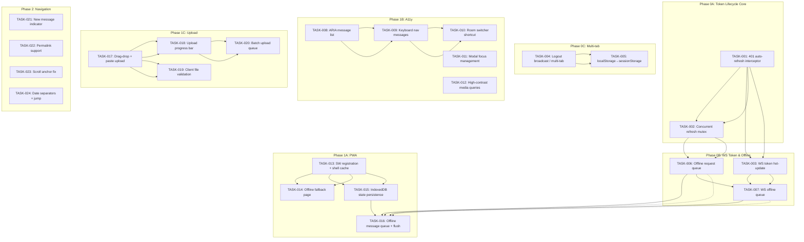
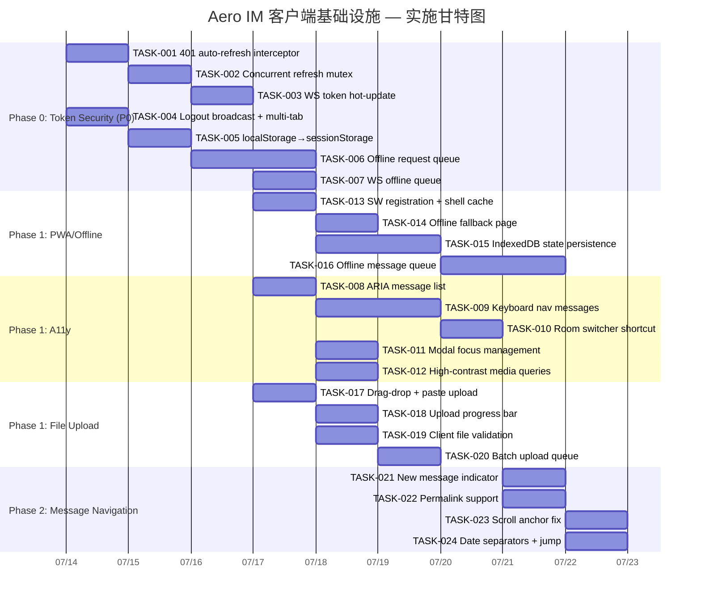

Now I have a thorough understanding of the codebase. Let me compile the Tech Lead analysis.

---

# Tech Lead 分析报告：客户端基础设施缺口

## 分析范围

基于交叉验证文档的核心发现，聚焦**真正未系统覆盖的方向**（Direction 1: token 生命周期），以及既有覆盖中需要排入开发管线的方向（a11y、PWA、文件上传、消息导航）。

---

## 1. 任务分解

### 方向一：Token 生命周期修复（P0 — 生产就绪阻塞项）

当前状态：
- 服务端 `/api/auth/refresh` **已实现**（`crates/aero-server/src/session.rs`），带有 token rotation、revocation list、reuse detection（10s grace window），OWASP 级刷新令牌旋转 + 回放检测
- 客户端 `api.js` 的 `auth.setSession()` **存储** refresh token 到 localStorage
- 客户端 `request()` 函数 **无 401 拦截+静默续期**——收到 401 直接抛 `ApiError`
- 默认 `access_ttl_secs = 3600`（1 小时），`refresh_ttl_secs = 604800`（7 天）
- WebSocket `ws.js` 的 `WsClient.connect(token)` 使用 token **快照**，永不更新——访问令牌过期后重连将携带过期 token → 连接失败

| 任务 ID | 任务标题 | 涉及文件 | 前置依赖 | 预估工时 | 验收标准 |
|---------|---------|---------|---------|---------|---------|
| TASK-001 | `api.js` 添加 401 自动刷新拦截器 | `web/api.js` | 无 | 2h | `request()` 收到 401 时自动调用 `/api/auth/refresh`，成功则重试原请求，两次失败才抛异常；不产生无限循环 |
| TASK-002 | 双 token 互斥锁防止并发刷新风暴 | `web/api.js` | TASK-001 | 1h | 10 个并发请求同时 401 时只有 1 次 `/api/auth/refresh` 调用；其余 9 个等待同一 Promise |
| TASK-003 | WebSocket token 热更新与重连 | `web/ws.js` | TASK-001 | 2h | `WsClient` 暴露 `updateToken(newToken)` 方法；当检测到因凭证过期断线时用新 token 重连；`_open()` 不再依赖构造时的 `this.token` 快照 |
| TASK-004 | 登出广播 + 多 tab 同步 | `web/api.js`, `web/context.js`, `web/auth_ui.js` | 无 | 2h | 任一 tab 登出时通过 `BroadcastChannel` 广播 `logout` 消息；其他 tab 在 500ms 内清除 session 并跳转登录页；登录成功向其他 tab 广播（可让后者静忽略或同步状态） |
| TASK-005 | localStorage → sessionStorage + in-memory 分层 | `web/api.js` | 无 | 1.5h | access token 仅存内存变量（非 localStorage）；refresh token 存 sessionStorage（标签页级，非持久 localStorage）；页面关闭后 access token 自然消失；减少 XSS 泄露窗口 |
| TASK-006 | 请求队列：断网时排队，恢复后重放 | `web/api.js` | TASK-001 | 3h | `request()` 在网络错误（`fetch` 抛出 `TypeError` / `AbortError`）时将请求元组入队；网络恢复（`window.online`）后按入队顺序重放；队列上限 50 项；超限直接拒绝 |
| TASK-007 | WS 发送离线队列 | `web/ws.js` | TASK-006 | 1.5h | `ws.send()` 在 `readyState !== OPEN` 时入队而非返回 false；连接恢复后 drain 队列；队列上限 100 帧 |

### 方向二：Accessibility（P1 — 企业合规门槛）

| 任务 ID | 任务标题 | 涉及文件 | 前置依赖 | 预估工时 | 验收标准 |
|---------|---------|---------|---------|---------|---------|
| TASK-008 | ARIA 标注消息列表 | `web/render.js` | 无 | 2h | 每条消息带 `role="article"`、`aria-label="来自 {sender}: {content}"`；消息列表容器带 `role="log"` 和 `aria-live="polite"`；新消息到达时屏幕阅读器能读出通知 |
| TASK-009 | 键盘导航消息列表 | `web/app.js`, `web/context.js` | TASK-008 | 2.5h | `↑/↓` 在消息间移动焦点（视觉高亮行）；`Enter` 打开回复/操作菜单；`Ctrl+Enter`/`Cmd+Enter` 发送；`/` 聚焦搜索 |
| TASK-010 | 房间切换键盘快捷键 | `web/app.js` | 无 | 1.5h | `Ctrl+K`/`Cmd+K` 打开房间快速切换面板；`↑/↓` 遍历房间列表；`Enter` 选中；`Esc` 关闭 |
| TASK-011 | 焦点管理（Modal Open/Close） | `web/context.js`, `web/modals.js` | 无 | 1h | `openModal` 保存当前焦点元素；关闭后恢复焦点；Modal 内 Tab 循环（trap focus） |
| TASK-012 | 高对比度 / 减少动效媒体查询 | `web/style.css` | 无 | 1h | `@media (prefers-reduced-motion)` 禁用过渡/动画；`@media (prefers-contrast: more)` 增强对比度；测试用例验证 |

### 方向三：PWA / 离线（P1 — 移动端与不稳定的网络）

| 任务 ID | 任务标题 | 涉及文件 | 前置依赖 | 预估工时 | 验收标准 |
|---------|---------|---------|---------|---------|---------|
| TASK-013 | Service Worker 注册与 shell 缓存 | `web/sw.js`（新文件）, `web/index.html` | 无 | 2h | `index.html` 注册 `sw.js`；SW 安装时缓存 `index.html` + JS + CSS；激活时清理旧缓存；SW 永不过期 / 激活后取控制 |
| TASK-014 | 离线后备页面 | `web/sw.js`, `web/offline.html`（新文件） | TASK-013 | 1.5h | 无网络时访问 `/` 返回缓存的 `index.html`（显示离线状态）；API 请求返回 `application/json` 时透传 `fetch` 失败不缓存假响应 |
| TASK-015 | IndexedDB 状态持久化 | `web/db.js`（新文件）, `web/context.js` | 无 | 3h | 用 `idb-keyval` 或原生 IndexedDB 封装 `PersistedState`：保存 `state.me`、`state.rooms`、`state.unreadByRoom`、`state.lastSeen`；页面加载时 100ms 内恢复；版本化 migration 优雅升级 |
| TASK-016 | 离线消息队列 + 在线 flush | `web/ws.js`, `web/sw.js` | TASK-015 | 2.5h | 离线时发送消息入 IndexedDB 队列；在线后（`fetch` 或 WS 恢复）逐条发送；每条标记 `{sent: true}` 或 `{failed: true}`；UI 显示发送状态图标 |

### 方向四：文件上传改进（P1 — 每日核心交互）

| 任务 ID | 任务标题 | 涉及文件 | 前置依赖 | 预估工时 | 验收标准 |
|---------|---------|---------|---------|---------|---------|
| TASK-017 | 拖放上传 + 粘贴上传 | `web/app.js`, `web/media.js` | 无 | 2h | 拖放文件到消息区域触发上传；`Ctrl+V` 粘贴截图/剪贴板文件触发上传；拖放时显示 drop zone 高亮 |
| TASK-018 | 上传进度条 | `web/api.js`, `web/render.js` | 无 | 1.5h | `xhr.upload.progress` 或 `fetch` 不支持则 `XMLHttpRequest` 封装；上传中显示进度条百分比 + 文件名；上传完成后替换为缩略图 |
| TASK-019 | 前端文件校验 | `web/media.js` | 无 | 1h | 上传前检查文件大小（配置上限，默认 100MB）；检查文件类型白名单（图片/视频/音频/文档扩展名）；超过限制 toast 提示，不发送请求 |
| TASK-020 | 批量上传队列 | `web/media.js`, `web/render.js` | TASK-018 | 2h | 多文件拖放逐个排队上传；队列 UI 显示整体进度（3/5 完成）；单文件失败不影响队列；最大并发 3 |

### 方向五：消息导航（P1 — 搜索功能的价值放大器）

| 任务 ID | 任务标题 | 涉及文件 | 前置依赖 | 预估工时 | 验收标准 |
|---------|---------|---------|---------|---------|---------|
| TASK-021 | 新消息指示器 | `web/render.js`, `web/app.js` | 无 | 1.5h | 消息区域向下滚动远离底部时出现「有新消息 ↓」按钮；点击滚动到底部并加载新消息；使用 IntersectionObserver 检测底部锚点 |
| TASK-022 | Permalink 支持 | `web/app.js`, `web/context.js` | 无 | 2h | 消息上下文菜单包含「复制链接」；复制形如 `#msg-{id}` 的 URL hash；页面加载时检测 `location.hash`，若匹配 `#msg-{id}` 则滚动到该消息并高亮；兼容搜索、AI 引用、通知跳转 |
| TASK-023 | 滚动锚定修复 | `web/render.js` | TASK-021 | 1h | 向前插入历史消息时保持当前视口不变；使用 `scrollTop` + `scrollHeight` 差值补偿；`loadHistory` 完成后不做全量 rerender 该场景 |
| TASK-024 | 日期分隔线 + 日期跳转器 | `web/render.js`, `web/app.js` | 无 | 2h | 消息列表中日期切换处渲染日期分隔线（上午/下午 或 `YYYY-MM-DD`）；实现日历/日期选取跳转到指定日期的首条消息 |

---

## 2. 执行顺序与依赖图

### 可并行执行的任务组

| 并行组 | 包含任务 | 预估总工时 | 说明 |
|-------|---------|---------|------|
| **Group A** (Token Core) | TASK-001, TASK-002 | 3h | 单线串行；同一开发者 |
| **Group B** (WS Token) | TASK-003, TASK-006, TASK-007 | 6.5h | TASK-001 前置，可接续 Group A 之后 |
| **Group C** (Multi-tab) | TASK-004, TASK-005 | 3.5h | 与 Group A 无依赖，可并行 |
| **Group D** (PWA) | TASK-013 → TASK-016 | 9h | 4 任务串行；依赖 Group B 的输出（离线队列） |
| **Group E** (A11y) | TASK-008 → TASK-012 | 8h | 完全独立；可任意方向并行 |
| **Group F** (Upload) | TASK-017 → TASK-020 | 6.5h | 完全独立 |
| **Group G** (Nav) | TASK-021 → TASK-024 | 6.5h | 完全独立；可 Group F 并行 |

---

## 3. 技术风险

### 3.1 高风险项

| 风险 | 影响范围 | 概率 | 缓解策略 |
|------|---------|------|---------|
| **TASK-001: 401 拦截死循环** — 如果 refresh 端点本身也返回 401（refresh token 过期/吊销/损坏），`request()` 会以相同频率重试刷新，产生无限 HTTP 循环 | `api.js` 所有 API 调用 | **中** | 加上 `refreshing` Promise 互斥 + 刷新失败标志位：刷新失败后同一请求不再重试刷新；对所有请求都设置 `maxRetries=1`；引入 `_lastRefreshAttempt` 时间戳防高频重试 |
| **TASK-003: WS token 过期后重连竞争条件** — access token 过期后 WS 断开，同时触发重连和 API 401 刷新；两个路径可能同时调用 refresh，产生 token 旋转竞争 | `ws.js` + `api.js` | **高** | 将 refresh Promise 提升为模块级共享（`let _refreshPromise = null`），`request()` 和 WS 重连都用同一 Promise；刷新完成后所有等待方同时释放 |
| **TASK-006: 请求队列内存泄漏** — 如果用户始终断网且持续操作（如连续发送消息），队列无限增长 | `api.js` | **低** | 队列上限 50 项 + 每项超时 5min 自动丢弃 + 重复 userIdempotency key 去重 |
| **TASK-015: IndexedDB 版本迁移** — 如果 `PersistedState` schema 变化，旧版缓存数据可能导致新版崩溃 | `web/db.js` | **中** | 每个持久化对象带 `version` 字段；`load()` 时检查版本，不匹配则清空对应缓存项而非迁移；遵循「读时验证」而非「写时迁移」 |
| **TASK-022: Permalink 与消息 DOM 渲染时机耦合** — 页面加载后消息列表是异步加载的（`listMessages`），`location.hash` 解析时目标消息可能尚未渲染 | `web/app.js` | **高** | 实现 Watcher 模式：`scrollToMessage(id)` 在消息列表中查找 `[data-msg-id]`；未找到时注册 MutationObserver，等待元素出现后 scroll；设置超时 5s 放弃 |

### 3.2 外部依赖风险

| 依赖 | 风险 | 替代方案 |
|------|------|---------|
| `BroadcastChannel`（TASK-004） | 不支持 Safari 14.x / 旧 iOS WebView | fallback: `window.addEventListener('storage', ...)` 通过 localStorage 伪造跨 tab 通信 |
| `IntersectionObserver`（TASK-021） | 不支持 IE11（N/A — 项目仅 ES2020） | 无风险；ES2020 目标已排除旧浏览器 |
| `Service Worker`（TASK-013） | 不支持 Safari Private Browsing | SW 登记失败时降级为纯在线模式；检测 `navigator.serviceWorker === undefined` |
| `XMLHttpRequest`（TASK-018 进度） | `fetch` 不支持上传进度 | 封装 `XhrUpload` 类，仅在上传时使用 XHR，其余请求保持 `fetch`；API 兼容 |
| `IndexedDB`（TASK-015） | 可用但异步 API 复杂 | 用 `idb` 库（~1KB min）封装 Promise-based 操作；或用 `localStorage` 兜底（限制 5MB） |

### 3.3 性能风险

| 风险 | 原因 | 优化策略 |
|------|------|---------|
| **TASK-008: ARIA 标签过长** | 消息内容可能很长（长文本、代码块），`aria-label` 截断后语义丢失 | `aria-label` 限制 120 字符 + `aria-describedby` 指向消息体元素 ID |
| **TASK-013: SW 缓存膨胀** | 懒加载 JS 模块、用户头像、表情等 | 限制缓存名含版本号；`activate` 事件清除旧版本缓存；定期 `caches.delete` 旧数据 |
| **TASK-016: IndexedDB 消息队列上限** | 离线数天积累大量待发送消息 | 队列上限 200 条；超过时丢弃最旧未发送项 + 显示「丢弃 N 条过期消息」通知 |
| **TASK-024: 大量日期分隔线 DOM 节点** | 跨数月/年的历史消息列表 | 日期分隔线用 CSS `::before` 模拟而非独立 DOM 节点（except 首条）；或虚拟化滚动 |

---

## 4. 资源评估

### 4.1 团队配置建议

| 角色 | 技能要求 | 负责任务组 | 投入量 |
|------|---------|-----------|-------|
| **前端工程师 A**（Token/状态） | 原生 JS + Promise + BroadcastChannel + IndexedDB | Group A + B + C + D | 全职 2 周 |
| **前端工程师 B**（UI/UX） | 原生 JS + ARIA + CSS + Drag/Drop API | Group E + F + G | 全职 2 周 |
| **QA 工程师** | E2E + 手动 a11y 测试 + 网络模拟 | 所有方向 | 兼职 1 周 |
| **后端工程师**（支持） | Rust / axum / session 模块 | 仅 Code Review TASK-001 的 refresh 交互 | 兼职 1 天 |

### 4.2 关键里程碑

| 里程碑 | 时间 | 交付物 | 验收标准 |
|-------|------|-------|---------|
| **M1: Token 安全基线** | 第 1 周结束 | TASK-001~TASK-005 | 401 自动续期 + WS 稳定 + 多 tab 登出同步 + XSS 窗口缩小 |
| **M2: 离线基础** | 第 2 周结束 | TASK-006~TASK-007, TASK-013~TASK-016 | SW 注册 + IndexedDB 持久化 + 离线队列 + 页面刷新不丢状态 |
| **M3: A11y + Upload** | 第 3 周结束 | TASK-008~TASK-012, TASK-017~TASK-020 | 键盘导航所有主要路径 + 拖放上传且有进度 |
| **M4: 消息导航 + 集成** | 第 4 周结束 | TASK-021~TASK-024 | Permalink + 新消息指示器 + 滚动锚定 + 全部集成测试通过 |

### 4.3 阻塞点与解决策略

| 阻塞点 | 影响任务 | 解决策略 |
|-------|---------|---------|
| `fetch` 不支持上传进度 → 需降级到 XHR | TASK-018 | 封装 `uploadWithProgress(url, file, onProgress)` 函数，内部用 `XMLHttpRequest` + `xhr.upload.onprogress`；其余请求保持 `fetch` |
| Safari Private Browsing 下 SW 不注册 | TASK-013 | 检测 `navigator.serviceWorker` 可用性；不可用时跳过 SW 注册，所有功能降级到纯在线模式；不阻塞其他方向 |
| IndexedDB 在 iOS Safari 低内存时被系统清除 | TASK-015 | 持久化时记录 `_persistVersion`；加载时检查完整性；检测到数据丢失时静默重建（不清除用户可见状态） |

---

## 5. 质量保证

### 5.1 单元测试覆盖要求

| 任务 | 测试文件 | 测试要点 |
|------|---------|---------|
| **TASK-001** | `web/__tests__/api.test.js` | 401 时调用 refresh；refresh 成功重试原请求；refresh 失败不重试；refresh 端点本身 401 不嵌套刷新 |
| **TASK-002** | `web/__tests__/api.test.js` | 并发 401 请求合并为 1 次 refresh；各等待方获得正确的新 token； |
| **TASK-003** | `web/__tests__/ws.test.js` | `updateToken()` 更新成功；重连时使用新 token；`token` 快照变量同步 |
| **TASK-004** | `web/__tests__/broadcast.test.js` | `BroadcastChannel` 收到 `logout` 后清除 session；`storage` 事件 fallback 路径 |
| **TASK-006** | `web/__tests__/queue.test.js` | 断网时入队；恢复后按序重放；队列上限 50 丢弃最旧 |
| **TASK-013** | `web/__tests__/sw.test.js` | SW 安装事件缓存文件列表；fetch 拦截返回缓存；activate 清除旧缓存 |
| **TASK-015** | `web/__tests__/db.test.js` | 写入/读取/删除 roundtrip；版本迁移清空旧数据；空状态加载不抛异常 |
| **TASK-018** | `web/__tests__/upload.test.js` | XHR 上传进度回调触发；`FormData` 构造正确；错误处理 |
| **TASK-021** | `web/__tests__/scroll.test.js` | `IntersectionObserver` 回调触发新消息按钮；点击按钮滚动到底部 |
| **TASK-022** | `web/__tests__/permalink.test.js` | `location.hash` 解析正确；`MutationObserver` 找到延迟渲染元素；超时放弃 |

### 5.2 集成测试策略

| 测试场景 | 覆盖方向 | 方法 |
|---------|---------|------|
| Token 全生命周期 | 方向一 | 1) 正常登录 → API 调用成功 2) 等待 token 过期（或 mock Date.now）→ API 401 → 自动 refresh → 请求重试成功 3) refresh token 过期 → 401 跳登录 |
| WS 重连续期 | 方向一 | 1) WS 连接成功 2) token 过期 → WS 断开 3) `updateToken` → 重新连接 4) 房间实时消息到达 |
| 多 tab 状态同步 | 方向一 | 1) Tab A 登录 2) Tab B 打开同一页面 3) Tab A 登出 4) Tab B 检测到 BroadcastChannel 并清除 session 5) Tab B 自动跳登录页 |
| 离线消息投递 | 方向三 | 1) 模拟断网 2) 用户发送消息（入队列）3) 恢复网络 4) 消息发送成功 5) UI 更新发送状态 |
| 页面刷新状态恢复 | 方向三 | 1) 用户登录、加载房间列表、阅读消息 2) 刷新页面 3) 100ms 内恢复房间列表、未读计数、最后阅读消息位置 4) WS 重新连接后增量同步 |
| 键盘导航 | 方向二 | 1) Tab 进入消息列表 2) `↑/↓` 遍历消息 3) `Enter` 打开操作菜单 4) `Ctrl+Enter` 发送 5) Tab 循环在 modal 中 |
| 拖放上传 | 方向四 | 1) 从桌面拖放图片到消息区域 2) 显示进度条 3) 上传完成显示缩略图 4) 批量拖放 5 个文件 |

### 5.3 代码审查要点

| 领域 | 审查重点 |
|------|---------|
| **Token 安全** | refresh token 未经 `POST` body 之外的载体泄露（日志/错误消息/URL 参数）；`hash_token()` 在关键路径使用；reuse detection 的 grace window 合理 |
| **并发控制** | 共享 `_refreshPromise` 的 race condition 处理；`refreshing` 状态在异常分支正确重置 |
| **IndexedDB 操作** | 所有 `get`/`put` 操作有 `.catch()` 处理 `QuotaExceededError` 或 `AbortError`；`db.close()` 在页面 `beforeunload` 执行 |
| **SW 缓存** | 不缓存 `application/json` API 响应；`Cache-Control` header 正确传递；SW `update` 流程不破坏现有浏览器 tab |
| **DOM 操作** | 所有 `element.focus()` 前确保元素可见且 `tabIndex >= 0`；`aria-live` 区域更新频率有 throttle（200ms 合并） |
| **错误处理** | 每个 fetch catch 分支都有用户可见反馈（如 toast）；所有 catch 没有 `// silently ignore` 的分支 |
| **性能** | 无 `innerHTML` 大规模操作（使用 `DocumentFragment`）；ES2020 目标确保 `?.` `??` `||=` 可用但不滥用生成大量 polyfill |

### 5.4 性能测试需求

| 测试 | 方法 | 目标 |
|------|------|------|
| 大量并发 401 刷新 | 模拟 20 个并发 API 请求在 token 过期瞬间调用 | 仅 1 次 refresh，总耗时 ≤ refresh 延迟 + 一次正常请求 |
| SW 缓存命中 | Chrome DevTools "Offline" 模拟 | 所有静态资源从 SW 返回，无网络请求 |
| IndexedDB 读写 | 存储 1000 条消息记录后读取 | 读取时间 ≤ 50ms；存储占用 ≤ 5MB |
| 消息列表渲染 | 渲染 500 条连续消息 + 日期分隔线 | < 100ms 首次渲染（DOM 节点 ≤ 2000 个）|
| 批量上传队列 | 10 个 1MB 文件同时拖放 | 全部上传完成 ≤ 30s（受网络限制）；UI 无感知卡顿 |

---

## 6. 实施计划

### 甘特图

### 阶段分解

#### 阶段 0：Token 安全基线（第 1 周 · 2026-07-14 ~ 2026-07-16）

**目标**：消除「用户登录后最多 1 小时所有请求 401」的生产级 bug

| 日 | 交付 | 负责人 |
|----|------|-------|
| Day 1 | TASK-001 (401 interceptor) + TASK-002 (concurrent mutex) + TASK-004 (broadcast) | 前端 A |
| Day 2 | TASK-003 (WS token hot-update) + TASK-005 (storage hierarchy) | 前端 A |
| Day 3 | TASK-006 (offline queue) + TASK-007 (WS offline queue) + 集成测试 | 前端 A + QA |

**验收门**：
- `cargo test --workspace --lib` 全绿
- 手动验证：登录 → 等待 token 过期（或手动 `localStorage` 修改 `aero_token` 为过期 JWT）→ API 自动刷新 → 不跳登录页
- WS 断线后 `updateToken` 重连成功
- 多 tab 登出一个，另一个自动跳登录页

#### 阶段 1A：PWA / 离线基础（第 2 周 · 2026-07-17 ~ 2026-07-19）

**目标**：页面刷新不丢状态；断网时消息排队

| 日 | 交付 | 负责人 |
|----|------|-------|
| Day 1 | TASK-013 (SW registration) + TASK-014 (offline fallback) | 前端 B |
| Day 2 | TASK-015 (IndexedDB persistence) | 前端 A |
| Day 3 | TASK-016 (offline message queue + flush) + 集成测试 | 前端 A + QA |

**验收门**：
- Chrome DevTools → Application → Service Workers 显示 `sw.js` 已注册并激活
- 页面 F5 刷新 → 房间列表和未读计数从 IndexedDB 恢复（可感知 ≤200ms）
- 模拟断网（DevTools Network → Offline）→ 发送消息 → 恢复网络 → 消息成功投递

#### 阶段 1B：A11y + 上传（第 2~3 周 · 2026-07-17 ~ 2026-07-21）

**目标**：键盘导航所有主要路径；拖放上传有进度

| 日 | 交付 | 负责人 |
|----|------|-------|
| Day 1 | TASK-008 (ARIA) + TASK-011 (focus management) | 前端 B |
| Day 2-3 | TASK-009 (keyboard nav messages) + TASK-010 (room switcher) | 前端 B |
| Day 3-4 | TASK-017 (drag drop) + TASK-019 (validation) | 前端 B |
| Day 4-5 | TASK-018 (progress bar) + TASK-020 (batch queue) | 前端 B |

**验收门**：
- 屏幕阅读器（VoiceOver / NVDA）可逐条朗读消息
- `↑/↓/Enter` 遍历消息并回复；`Ctrl+Enter` 发送；`/` 搜索
- 从桌面拖放文件 → 进度条 → 上传成功；`Ctrl+V` 粘贴截图

#### 阶段 2：消息导航（第 3~4 周 · 2026-07-21 ~ 2026-07-24）

**目标**：消息导航完整闭环

| 日 | 交付 | 负责人 |
|----|------|-------|
| Day 1 | TASK-021 (new message indicator) + TASK-022 (permalink) | 前端 A |
| Day 2 | TASK-023 (scroll anchor fix) + TASK-024 (date separators) | 前端 A |
| Day 3 | 集成测试 + 回归测试 + 性能测试 | 前端 A + B + QA |

**验收门**：
- 向下滚动后新消息到达 → 显示「有新消息 ↓」；点击后加载并滚动到底部
- 消息右键「复制链接」→ `#msg-{id}` → 打开 URL 滚动到该消息
- 向前加载历史时视口不跳动
- 每日第一条消息上方显示日期分隔线

### 总体时间线

| 阶段 | 时间段 | 总天数 | 总工时 | 开发人力 |
|------|--------|-------|--------|---------|
| Phase 0: Token 安全 | 7/14 ~ 7/16 | **3 天** | 14h | 1 前端 A |
| Phase 1A: PWA 离线 | 7/17 ~ 7/19 | **3 天** | 10h | 1 前端 A + 0.5 前端 B |
| Phase 1B: A11y + 上传 | 7/17 ~ 7/21 | **5 天** | 15h | 1 前端 B |
| Phase 2: 消息导航 | 7/21 ~ 7/24 | **3 天** | 9h | 1 前端 A |
| 集成测试/缓冲 | 7/25 ~ 7/28 | **4 天** | 16h | 全体 |

**总工期：~15 个工作日**（3 周），**总工时 ~64 开发小时**，**2 名前端 + 1 兼职 QA**。

---

## 附录：与既有分析的重叠处理建议

根据交叉验证报告，Direction 2-5 已在既有分析中系统性覆盖。建议处理方式：

| 你的方向 | 既有分析文档 | 处理建议 |
|---------|------------|---------|
| **方向二：A11y** | `2026-07-11-five-zero-coverage-ux-platform-directions.md` §1 | **合并执行**——引用既有分析的 ARIA 标注方案和键盘快捷键设计，避免重复设计；上述 TASK-008~012 已与该文对齐 |
| **方向三：PWA/离线** | `2026-07-10-undiscovered-client-infrastructure-directions.md` §3 | **合并执行**——既有分析详细讨论了 SW、IndexedDB 持久化、离线队列；上述 TASK-013~016 覆盖其推荐路径 |
| **方向四：文件上传** | `2026-07-11-five-zero-coverage-ux-platform-directions.md` §5 + `2026-07-12-five-uncovered-client-ux-productization-directions.md` §1 | **合并执行**——两份分析均覆盖拖放/进度/队列；上述 TASK-017~020 取其交集 |
| **方向五：消息导航** | `2026-07-12-five-uncovered-client-ux-productization-directions.md` §2 | **合并执行**——既有分析系统性论证了滚动锚定、新消息指示器、日期跳转；上述 TASK-021~024 对齐 |

**方向一（Token 生命周期）** 是唯一真正新增的独有贡献，建议以 `2026-07-12-sixth-round-global-scan-five-client-infra-directions.md` 为名归档至 `docs/requirements/`。

### 方向一的核心改进建议（Cross-Validation 修正）

在将交叉验证结论纳入分析文档时，建议对方向一做以下调整：

1. **修正**：服务端 `/api/auth/refresh` **已存在且实现完整**（token rotation + revocation + reuse detection + grace window + OWASP 级回放检测）。问题不在服务端，而在**客户端从未主动调用该端点**。

2. **补充**：现有分析 `2026-07-09-five-truly-uncovered-client-side-directions.md` §3 覆盖了 WS 建连后无定期重认证的安全缺口，但**未覆盖 refresh token 静默续期缺失**——你的分析与其互补而非重复。

3. **关键数字**：默认 `access_ttl_secs = 3600`（1 小时），`refresh_ttl_secs = 604800`（7 天），意味着用户**每天重新登录**不影响操作，但**连续使用超过 1 小时必须页面刷新才会遇到**。生产环境如果 access token TTL 更短（如 15 分钟），问题频率会大幅上升。
