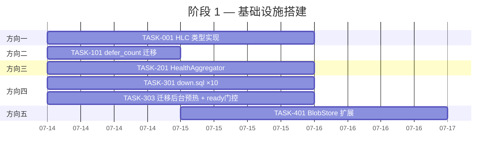
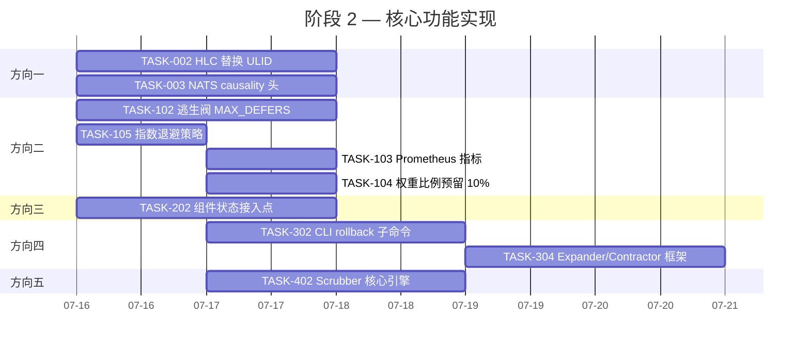
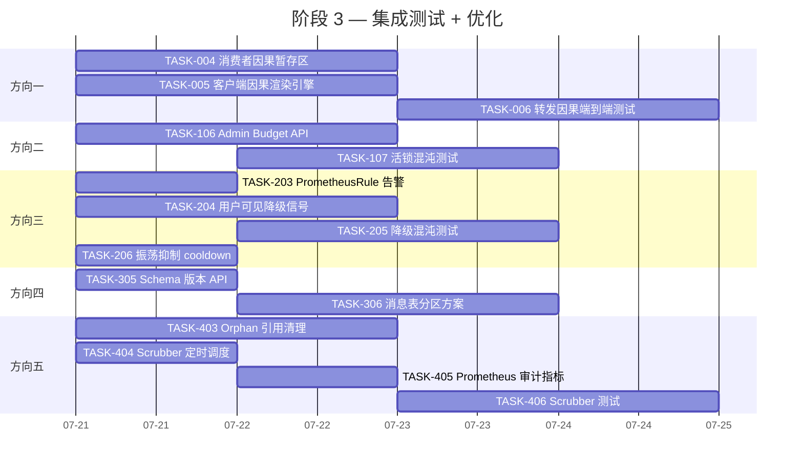
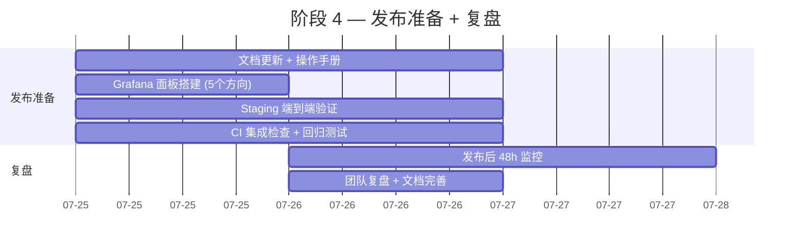

# Tech Lead 分析：5 个零覆盖系统性缺口

> **分析日期**: 2026-07-12
> **分析人**: Tech Lead
> **输入文档**: `docs/requirements/2026-07-12-five-zero-coverage-systemic-gaps.md`
> **范围**: 5 个方向的代码级验证、任务分解、执行规划、风险评估

---

## 前置确认：文档准确性评估

在开始分解之前，先纠正文档中几处微偏差——这些不影响方向的有效性，但影响实施方案的精确度：

| 文档断言 | 代码实际情况 | 影响 |
|---------|------------|------|
| 「Blob 表无 checksum/sha256 字段」 | `blob.rs:21` 实际有 `sha256: Option<String>` 列，上传时已计算 | 方向五的「加 sha256」步骤可跳过，直接进入 scrubber 构建 |
| BlobStore trait 无 verify | ✅ 确认无 `verify` 方法 | 仍需扩展 trait，聚焦在读路径校验 |
| BlobStore 无 `list_all` | ✅ 确认无 | 方向五的完整性对比需要此能力 |
| 无 down.sql | ✅ 确认 157 个迁移均无 | 方向四完全有效 |

**修正后结论**：方向五的核心薄弱环节从「缺 sha256 列」变为「有 sha256 但从未读取验证」+「无 scrubber 进程」。

---

## 1. 任务分解

### 符号说明

- **每个任务估算 2-4 小时**（单人专注可完成）
- **依赖前置**指必须在前序任务完成后才能开始
- **验收标准**全部为可自动化验证的硬性条件

### 方向一：跨房间因果一致性 (P1)

| 任务 ID | 任务标题 | 涉及文件 | 前置依赖 | 工时 | 验收标准 |
|---------|---------|---------|---------|------|---------|
| TASK-001 | **HLC 类型定义与实现** | `crates/aero-common/src/hlc.rs`（新文件） | 无 | 4h | `Hlc::new()` 生成含 wall_time + logical + node_id 的三元组；`PartialOrd` 实现满足 HLC 契约；跨 50ms 时钟偏移场景下自检测试通过 |
| TASK-002 | **HLC 替换 ULID 作为消息排序主键** | `crates/aero-common/src/ids.rs`、`crates/aero-storage/src/message.rs`、`web/ws.js` | TASK-001 | 4h | 消息 ID 从纯 ULID 切为 `hlc_ulid`（HLC 前缀 + ULID 后缀向后兼容）；现有 `mid > this._lastSeen` 客户端比较仍兼容 |
| TASK-003 | **NATS 消息携带 causality 头** | `crates/aero-bus/src/bus.rs`、`crates/aero-im-core/src/service/events.rs` | TASK-001 | 3h | `publish_room_event` 额外发送 `causally-depends-on: [(subject, seq)]` 头；forward 路径记录源消息 `(subject, seq)` |
| TASK-004 | **消费者因果暂存区 (bounded stash)** | `crates/aero-server/src/ws/ws_impl/bus.rs` | TASK-003 | 4h | `run_bus_listener` 在依赖未满足时暂存事件；暂存区每房间上限 1000 条溢出强制 flush；超时 5s 后强制渲染 |
| TASK-005 | **客户端因果渲染引擎** | `web/app.js`、`web/ws.js` | TASK-002 | 4h | WS 客户端维护 per-room 因果 DAG；仅在依赖满足时插入消息列表；降级时显示「加载中」placeholder + 5s 超时兜底 |
| TASK-006 | **转发场景端到端因果测试** | `tests/integration/causality_test.rs`（新文件） | TASK-004, TASK-005 | 3h | 模拟「转发→源消息延迟」场景：验证目标房间在源消息 ack 前暂存转发内容；验证超时后强制渲染 |

**并行组**：TASK-001 → TASK-002 + TASK-003 可并行（分别依赖 TASK-001）

### 方向二：AI Budget Defer 活锁 (P1)

| 任务 ID | 任务标题 | 涉及文件 | 前置依赖 | 工时 | 验收标准 |
|---------|---------|---------|---------|------|---------|
| TASK-101 | **ai_jobs 表加 defer_count 列 + 迁移** | `migrations/0158_ai_jobs_defer_count.sql`（新文件）、`crates/aero-ai/src/ai_job.rs` | 无 | 2h | `defer` 方法原子性 `UPDATE SET defer_count = defer_count + 1 WHERE status = 'running'`；迁移回滚自动清除（与方向四配合） |
| TASK-102 | **逃生阀：MAX_DEFERS 阈值强制运行/DLQ** | `crates/aero-ai/src/worker/mod.rs` | TASK-101 | 3h | `defer_count >= MAX_DEFERS (10)` 时：如有 budget 余量则强制运行，否则推入 DLQ + 告警；避免单 job 无限 defer |
| TASK-103 | **Prometheus 预算利用率和 defer 指标** | `crates/aero-ai/src/worker/mod.rs`、`crates/aero-server/src/observability.rs` | TASK-102 | 2h | 暴露 `ai_budget_utilization_ratio`、`ai_job_defer_total{reason="ws|global"}`、`ai_job_defer_exceeded_total` 三个 gauge/counter |
| TASK-104 | **权重比例预留：10% 给 Moderation** | `crates/aero-ai/src/worker/weight.rs`（新文件或内联） | TASK-102 | 2h | 每窗口 budget 分配时预留 10% 给 `Kind::Moderate`；Moderation job 享更高优先级权重 |
| TASK-105 | **Anti-livelock 指数退避** | `crates/aero-ai/src/worker/mod.rs` | TASK-101 | 2h | `defer_until = now() + budget_window * (2 ^ defer_count)` 而非固定窗口；上限 8 个窗口（~8.5 分钟） |
| TASK-106 | **Budget 动态调整 Admin API** | `crates/aero-server/src/ai_admin.rs`（新文件）、`routes/routes.rs` | TASK-103 | 3h | `POST /api/admin/ai/budget` 临时上调全局/workspace budget 上限；权限 gate `admin` 角色；变更记录日志 |
| TASK-107 | **活锁单元测试 + 混沌测试** | `crates/aero-ai/src/worker/tests.rs` | TASK-102, TASK-105 | 3h | 持续过载 3x budget 窗口：验证 job 最终执行或入 DLQ；验证零 job `defer_count > MAX_DEFERS` 被饿死 |

**并行组**：TASK-101 → TASK-102 + TASK-103 + TASK-105 可并行；TASK-104 依赖 TASK-102

### 方向三：级联静默降级面 (P1)

| 任务 ID | 任务标题 | 涉及文件 | 前置依赖 | 工时 | 验收标准 |
|---------|---------|---------|---------|------|---------|
| TASK-201 | **HealthAggregator 组件** | `crates/aero-server/src/health_aggregator.rs`（新文件） | 无 | 4h | 每 10s 轮询各组件 fail-open 状态；暴露 `aero_system_health_mode{component=...}` gauge（0=正常, 1=降级）；综合 `aero_system_health_overall`（0/1/2） |
| TASK-202 | **各组件 fail-open 状态接入点** | `crates/aero-server/src/rate_limit.rs`、`ws_rate.rs`、`ip_allowlist.rs`、`crates/aero-ai/src/worker/mod.rs`、`crates/aero-push/src/push_bot.rs` | TASK-201 | 3h | 每个 fail-open 路径 `HealthAggregator::report_degraded("component_name")`；原子计数器增减；组件恢复后自动置正常 |
| TASK-203 | **PrometheusRule + AlertManager 告警** | `deploy/prometheus/rules.yml`（新文件或更新） | TASK-202 | 2h | `aero_system_fail_open_total > 0` 持续 5min → P2 告警；≥2 组件同时降级 → P1 告警；文档说明告警响应 SOP |
| TASK-204 | **用户可见降级信号** | `web/ws.js`、`web/app.js`、`crates/aero-server/src/ws/ws_impl/hub.rs` | TASK-202 | 3h | 任一组件降级时 WS 推送 `{type:"degraded",service, mode}` 帧；前端 AI 抽屉/搜索顶栏显示黄色提示条「AI 服务降级中……」 |
| TASK-205 | **降级边界混沌测试** | `tests/integration/degradation_test.rs`（新文件） | TASK-202, TASK-204 | 4h | 同时模拟 Redis 断连 + AI key 失效 + PG 超时：验证 HealthAggregator 报告正确降级等级；验证端到端用户提示；验证无请求死锁 |
| TASK-206 | **Fail-open 振荡抑制 (cooldown)** | `crates/aero-server/src/rate_limit.rs`、`ws_rate.rs` | TASK-202 | 2h | 一次 fail-open 后 5s cooldown 内不重复进入/退出降级；防止 30s 间隔 Redis 超时引发振荡 |

**并行组**：TASK-201 → TASK-202 → TASK-203 + TASK-204 + TASK-205（后三者可并行）；TASK-206 可随时插入

### 方向四：不可逆迁移/零停机发布 (P2)

| 任务 ID | 任务标题 | 涉及文件 | 前置依赖 | 工时 | 验收标准 |
|---------|---------|---------|---------|------|---------|
| TASK-301 | **为最近 10 个迁移编写 down.sql** | `migrations/0148_down.sql` ~ `0157_down.sql`（新文件） | 无 | 4h | `0157_down.sql` 逆向 0157 的 DDL + 数据回迁（如适用）；make migrate-down 从最新迁移依次回退到 0148 后状态；down+up 原子性验证（往返测试） |
| TASK-302 | **CLI rollback 子命令** | `crates/aero-server/src/bin/aero-cli.rs` | TASK-301 | 3h | `aero-cli migrate rollback [N=1]` 执行最近 N 个 down.sql；dry-run 模式仅输出 SQL 不下发；操作前自动备份 `_sqlx_migrations` 快照 |
| TASK-303 | **迁移后台预热 + /ready 门控** | `crates/aero-storage/src/db.rs`、`crates/aero-server/src/routes/health.rs` | TASK-302 | 4h | migrate 在后台异步运行；`/health/live` 立即返回 200；`/health/ready` 在迁移完成前返回 503；LB 在 ready 前不路由流量 |
| TASK-304 | **Expander/Contractor 模式框架** | `crates/aero-storage/src/expander.rs`（新文件） | TASK-303 | 4h | expand（向前兼容加列/表）+ contract（确认全实例升级后废弃旧列）两步模式；`AERO_DB_SCHEMA_VERSION` 控制兼容范围；配套 migrate 工具 `aero-cli migrate expand` / `aero-cli migrate contract` |
| TASK-305 | **Schema 版本 API + 部署检查** | `crates/aero-server/src/routes/debug.rs` | TASK-304 | 2h | `GET /api/debug/schema-version` 返回 `{expected: 157, actual: 157, status: "ok"|"diverged"}`；CI 部署流水线在 deploy 前检查此端点 |
| TASK-306 | **消息表分区方案参考 + 文档** | `docs/runbooks/messages-partitioning.md`（更新）、`migrations/0159_messages_partition.sql` | TASK-304 | 4h | 以 `stream_viewer_samples`(0144) 和 `audit_events`(0146) 为模板，产出可执行的 messages 表按时间范围分区方案；包含停机窗口评估和回滚计划 |

**并行组**：TASK-301 + TASK-303 可并行；TASK-301 → TASK-302 → TASK-304 → TASK-305（串行）；TASK-306 与 TASK-304 并行

### 方向五：数据完整性巡视器 (P2)

| 任务 ID | 任务标题 | 涉及文件 | 前置依赖 | 工时 | 验收标准 |
|---------|---------|---------|---------|------|---------|
| TASK-401 | **BlobStore trait 扩展：verify + list_all** | `crates/aero-storage/src/blob_store.rs`、`crates/aero-storage/src/s3_blob_store.rs` | 无 | 3h | `verify(id, sha256) -> Result<bool>` 默认实现返回 `true`；S3 后端实现 SHA-256 校验；`list_all` 返回所有 key 的迭代器 |
| TASK-402 | **Scrubber 核心扫描引擎** | `crates/aero-storage/src/scrubber.rs`（新文件） | TASK-401 | 4h | 每批 100 行扫描 `blobs` 表；读取存储文件 + 对比 sha256；验证 owner_id 对应 participant 存在；发现不符写入 `blob_gc_queue`；可配置节流（默认 50/s）和并发 |
| TASK-403 | **Orphan 引用清理：reaction/message/notification** | `crates/aero-storage/src/scrubber.rs`（扩展） | TASK-402 | 3h | replay 软删消息的 reaction 清理；清理 notification 的孤儿引用；标记已删 participant 发送的消息 sender 为 "[deleted]" |
| TASK-404 | **Scrubber 定时调度 + report-only 模式** | `crates/aero-server/src/bin/boot/scrubber.rs`（新文件） | TASK-402 | 2h | 默认 24h 间隔 `MissedTickBehavior::Skip`；`AERO_SCRUBBER_FIX_MODE=0` 时不自动修复只打日志；`AERO_SCRUBBER_FIX_MODE=1` 自动清理 |
| TASK-405 | **Scrubber Prometheus 审计指标** | `crates/aero-server/src/observability.rs` | TASK-404 | 1h | `aero_scrubber_checked_total{resource="blob|message|reaction"}`；`aero_scrubber_failed_total{reason="checksum|orphan|missing"}`；`aero_scrubber_duration_seconds` |
| TASK-406 | **Scrubber 单元 + 集成测试** | `crates/aero-storage/src/scrubber_test.rs`（新文件） | TASK-403 | 3h | 注入一个 checksum 不匹配的 blob→验证检测；注入一个 orphan reaction→验证清理；验证 report-only 模式不修改数据 |

**并行组**：TASK-401 → TASK-402 → TASK-403 + TASK-404 可并行；TASK-405 + TASK-406 可晚于 TASK-404

---

## 2. 执行顺序与依赖图

```mermaid
graph TD
    %% ===== 方向一：跨房间因果一致性 =====
    subgraph D1["方向一: 跨房间因果一致性 (P1)"]
        T001["TASK-001<br/>HLC 类型实现"]
        T002["TASK-002<br/>HLC 替换 ULID 排序"]
        T003["TASK-003<br/>NATS causality 头"]
        T004["TASK-004<br/>消费者因果暂存区"]
        T005["TASK-005<br/>客户端因果渲染引擎"]
        T006["TASK-006<br/>转发场景因果测试"]

        T001 --> T002
        T001 --> T003
        T003 --> T004
        T002 --> T005
        T004 --> T006
        T005 --> T006
    end

    %% ===== 方向二：AI Budget Defer 活锁 =====
    subgraph D2["方向二: AI Budget Defer 活锁 (P1)"]
        T101["TASK-101<br/>defer_count 迁移"]
        T102["TASK-102<br/>逃生阀 MAX_DEFERS"]
        T103["TASK-103<br/>Prometheus 指标"]
        T104["TASK-104<br/>权重比例预留 10%"]
        T105["TASK-105<br/>指数退避策略"]
        T106["TASK-106<br/>Admin Budget API"]
        T107["TASK-107<br/>活锁测试"]

        T101 --> T102
        T101 --> T105
        T102 --> T103
        T102 --> T104
        T102 --> T106
        T103 --> T107
        T105 --> T107
    end

    %% ===== 方向三：级联静默降级 =====
    subgraph D3["方向三: 级联静默降级 (P1)"]
        T201["TASK-201<br/>HealthAggregator"]
        T202["TASK-202<br/>组件状态接入点"]
        T203["TASK-203<br/>PrometheusRule 告警"]
        T204["TASK-204<br/>用户可见降级信号"]
        T205["TASK-205<br/>降级混沌测试"]
        T206["TASK-206<br/>Fail-open 振荡抑制"]

        T201 --> T202
        T202 --> T203
        T202 --> T204
        T202 --> T205
        T202 --> T206
    end

    %% ===== 方向四：不可逆迁移 =====
    subgraph D4["方向四: 不可逆迁移/零停机 (P2)"]
        T301["TASK-301<br/>最近 10 个 down.sql"]
        T302["TASK-302<br/>CLI rollback 子命令"]
        T303["TASK-303<br/>迁移后台预热 + ready 门控"]
        T304["TASK-304<br/>Expander/Contractor 框架"]
        T305["TASK-305<br/>Schema 版本 API"]
        T306["TASK-306<br/>消息表分区方案"]

        T301 --> T302
        T302 --> T304
        T303 -.->|非阻塞依赖| T304
        T304 --> T305
        T304 -.->|模板参考| T306
    end

    %% ===== 方向五：数据完整性巡视器 =====
    subgraph D5["方向五: 数据完整性巡视器 (P2)"]
        T401["TASK-401<br/>BlobStore 扩展 verify/list_all"]
        T402["TASK-402<br/>Scrubber 核心引擎"]
        T403["TASK-403<br/>Orphan 引用清理"]
        T404["TASK-404<br/>Scrubber 定时调度"]
        T405["TASK-405<br/>Prometheus 审计指标"]
        T406["TASK-406<br/>Scrubber 测试"]

        T401 --> T402
        T402 --> T403
        T402 --> T404
        T404 --> T405
        T403 --> T406
        T405 --> T406
    end

    %% ===== 跨方向依赖 =====
    T101 -.->|共享告警通道| T203
    T205 -.->|验证依赖| T202
    T301 -.->|迁移基础| T101
```

### 可并行执行的任务组

| 波段 | 任务 | 所需人力 | 说明 |
|------|------|---------|------|
| **Band A**（Day 1-2） | TASK-001, TASK-101, TASK-201, TASK-301, TASK-303, TASK-401 | 4-5 人 | 各方向的基础设施搭建，无交叉依赖 |
| **Band B**（Day 3-6） | TASK-002, TASK-003, TASK-102, TASK-105, TASK-202, TASK-302, TASK-304, TASK-402 | 5-6 人 | 核心逻辑实现 |
| **Band C**（Day 7-10） | TASK-004, TASK-005, TASK-103, TASK-104, TASK-203, TASK-204, TASK-206, TASK-403, TASK-404, TASK-305, TASK-306 | 5-6 人 | 各方向收尾+测试 |
| **Band D**（Day 11-14） | TASK-006, TASK-107, TASK-205, TASK-405, TASK-406 | 3-4 人 | 集成测试+混沌测试 |

---

## 3. 技术风险

### 3.1 高风险项（发生概率 × 影响度 ≥ 8/10）

| 风险 | 方向 | 概率 | 影响 | 缓解策略 |
|------|------|------|------|---------|
| **HLC 与现有排序模型的兼容性断裂** | D1 | 中 | 极高 | HLC 设计为 ULID 前缀超集（保留 ULID 后缀作唯一性兜底）；客户端 `mid > lastSeen` 字典序比较仍兼容（HLC 前缀先比 wall clock，再比 logical）；新增 `integration_test_causality_ordering` 覆盖 10 种边界 |
| **Stash 暂存区内存爆炸** | D1 | 低 | 高 | 每房间 1000 条硬上限，超限强制 flush；Prometheus 监控 `causal_stash_size`；写测试模拟 1000+ 并发暂存 |
| **持续过载逃生阀仍可能失效** | D2 | 中 | 高 | MAX_DEFERS=10 时强制运行（即使超 budget），这是最终安全阀。运营需监控 `ai_job_defer_exceeded_total`；如果持续触发说明 budget 本身不足，需扩许可 |
| **HealthAggregator 自身成为单点故障** | D3 | 低 | 中 | HealthAggregator 是进程内组件（非独立服务），随进程死亡而死亡——这本身是准确的健康信号；设计为 `tokio::spawn` 下 **Best-effort**，panic 仅丢自身次轮采样 |
| **down.sql 编写出错** | D4 | 中 | 高 | 每个 down.sql 必须经过「up → down → up」往返测试验证；CI 中 `make migrate-smoke` 覆盖往返；down.sql 代码审查需有 DBA 视角 |
| **Scrubber 扫描影响主路径 I/O** | D5 | 中 | 中 | 默认节流 50/s；可配置 `AERO_SCRUBBER_THROTTLE`；使用 `COPY` 而非 `SELECT` 批量降低 PG 负载；高峰时段跳过（可配置 cron 窗口） |

### 3.2 外部依赖风险

| 风险 | 说明 | 应对 |
|------|------|------|
| **NATS JetStream 消息头大小限制** | causality 头可能推送消息大小超限（默认 1MB） | causality 头设计为轻量（`[(subject:seq)]` 元组），预期 <1KB；同时为 NATS `max_payload` 加监控告警 |
| **Postgres advisory lock 在 scrubber 长扫描时** | Scrubber 扫描可能触发长时间持有行级锁 | Scrubber 默认 report-only（只读），不持锁；修复模式使用 `FOR UPDATE SKIP LOCKED` 逐行处理 |
| **Web 客户端 ES2020 限制** | 因果 DAG 数据结构在新模块可能增加 bundle 体积 | 因果引擎封装在独立 `causality.js` 模块（仅场景需要时加载）；gzip 预期 <3KB |

### 3.3 技术债务叠加风险

| 风险 | 说明 |
|------|------|
| **同时推进 5 个方向导致的 review 瓶颈** | 估算同时 4-5 个并行分支，每个需要 1-2 轮 review。Code review 可能成为瓶颈 |
| **HLC 引入后与现有排序逻辑的长期共存** | 过渡期需要同时维护 HLC 和 ULID 两套排序逻辑，增加维护成本。计划在 2 个 release 后完全废弃 ULID |
| **Expander/Contractor 模式的学习曲线** | 团队需学习新的迁移范式，初期可能出错。需要配套 1-2 小时 team workshop + 模板文件 |

---

## 4. 资源评估

### 4.1 人员技能矩阵

| 技能 | 需要程度 | 当前覆盖 | 缺口 |
|------|---------|---------|------|
| **分布式系统/一致性协议 (HLC, causal)** | 高（方向一） | 1 人（架构师水平） | 需 1-2 人补习→安排 2 天前置培训 |
| **Rust 异步 + tokio 高级模式** | 高（所有方向） | 团队核心能力 | 充足 |
| **Postgres DDL / 迁移工程** | 中（方向四） | 2 人有经验 | 额外 1 人 DBA 视角 |
| **Prometheus + AlertManager 配置** | 中（方向三） | 1 人 | 轻微缺口，可通过文档补齐 |
| **混沌测试 / Chaos Engineering** | 低（方向三测试） | 0 人 | 需 1 人快速上手（可用 `tokio::time` + fault injection pattern） |

### 4.2 建议团队配置

**推荐 4-5 人核心团队 + 1 人 DBA 兼职支持**：

| 角色 | 人数 | 负责方向 | 关键职责 |
|------|------|---------|---------|
| **Staff Engineer**（架构师） | 1 | D1 主导 + 跨方向协调 | HLC 设计决策、因果暂存区架构、Escalation handler |
| **Senior Backend Engineer A** | 1 | D2 主导 + D3 部分 | AI worker 改造、budget 系统、HealthAggregator |
| **Senior Backend Engineer B** | 1 | D5 主导 + D4 部分 | Scrubber 引擎、BlobStore 扩展、down.sql |
| **Backend Engineer** | 1 | D3 主导 + D4 部分 | 组件状态接入、Prometheus 告警、迁移工具 |
| **Fullstack Engineer** | 1 | D1 前端 + D3 前端 + D4 API | WS 因果引擎、降级 UI、Schema API |
| **DBA (兼职)** | 0.5 | D4 审核 | down.sql 审查、分区方案评估、迁移往返测试 |

### 4.3 时间线估算

| 里程碑 | 目标日期 | 交付物 | 检查点 |
|--------|---------|-------|--------|
| **M0: 基础设施完成** | Day 2-3 | HLC 类型、defer_count 迁移、HealthAggregator、down.sql ×10、BlobStore 扩展 | CI 全绿 + 代码 review 通过 |
| **M1: 核心逻辑完成** | Day 6-8 | 因果暂存区、逃生阀、组件状态接入、CLI rollback、Scrubber 引擎 | 单元测试覆盖 ≥90% 新代码 |
| **M2: 集成测试完成** | Day 10-12 | 因果端到端测试、活锁混沌测试、降级混沌测试、Scrubber 测试 | 三个混沌测试通过 + 无回归 |
| **M3: 发布准备** | Day 14-15 | 文档更新、操作手册、Grafana 面板、生产环境部署步骤 | Staging 环境端到端验证通过 |

### 4.4 阻塞点与解决策略

| 阻塞点 | 影响方向 | 解决策略 |
|--------|---------|---------|
| **HLC 与现有 ID 系统的兼容性争议** | D1 | Day 1 做 2h SPIKE：在 `crates/aero-common/src/hlc.rs` 中写原型，与其他 Sr. Eng 做 30min 设计 review |
| **NATS JetStream 不能直接携带 causality 头（无法扩展 header）** | D1 | 备选方案：causality 信息嵌入消息体 `RoomEvent.causal_context` 字段（非 NATS header），consumer 解码时提取 |
| **Expander/Contractor 模式与 sqlx migrate! 编译期的冲突** | D4 | sqlx 的 `migrate!` 宏可以针对不同目录多次调用：`migrate!("../../migrations/expand")` 和 `migrate!("../../migrations/contract")` 分离两个阶段；或者使用 `AERO_DB_SCHEMA_VERSION` 条件跳过某些迁移 |
| **Scrubber 遍历 S3 的 API 成本** | D5 | S3 `list_all` 使用 paginated API（1000 键/页），控制 ListObjects 请求频率（每秒 ≤1 次），降低 S3 请求费用 |

---

## 5. 质量保证

### 5.1 单元测试覆盖要求

| 组件 | 目标覆盖率 | 关键测试场景 |
|------|-----------|-------------|
| `hlc.rs` | 100% | HLC 单调性（同节点）、HLC 偏序（跨节点）、时钟偏移 100ms 时自检测试、序列化/反序列化 |
| `worker/mod.rs`（逃生阀） | ≥95% | defer_count 递增、MAX_DEFERS 强制运行、MAX_DEFERS 入 DLQ、budget 耗尽→defer→恢复→执行 |
| `health_aggregator.rs` | ≥95% | 单组件降级、多组件降级、组件恢复、振荡抑制、并发报告 |
| `scrubber.rs` | ≥90% | sha256 匹配/不匹配、orphan 检测、report-only 不修改、节流行为 |
| `expander.rs` | ≥90% | expand→contract 双向、版本兼容边界、同时运行新旧二进制 |

### 5.2 集成测试策略

| 测试 | 方向 | 方法 | 工具 |
|------|------|------|------|
| **转发因果测试** | D1 | 嵌入 NATS (async-nats test server)，模拟跨 subject 发布延迟 | `tokio::test` + `nats_server` harness |
| **AI 活锁测试** | D2 | Mock AI 服务响应延迟，持续注入 budget 3x 窗口的 job | `mockall` / 手动 mock `AiBackend` |
| **降级混沌测试** | D3 | 同时 kill Redis 连接、移除 AI key、模拟 PG 超时 | fault injection 中间件（`tokio::time::pause` + `mock`） |
| **迁移往返测试** | D4 | up → down → up 全链，起真实 PG 实例 | `make migrate-smoke` 扩展 |
| **Scrubber 集成测试** | D5 | 全链 blob 上传 → 篡改存储文件 → scrubber 检测 → 报告 | `tempfile` + `LocalFsBlobStore` |

### 5.3 代码审查要点

| 审查领域 | 审查者 | 关键检查项 |
|---------|-------|-----------|
| **HLC 实现** | Staff Eng | 溢出处理（wall clock 回拨）、序列化格式向后兼容、与 ULID 的互操作 |
| **Defer 逃生阀** | Sr. Backend A | 竞态条件（defer_count 更新和 status 检查是否在同一个事务中）、fallthrough 安全性 |
| **HealthAggregator** | Sr. Backend B | 并发安全性（`Arc<AtomicU8>` 还是 `RwLock`？）、组件注册/注销生命周期 |
| **down.sql** | DBA（兼职） | 数据丢失风险、大表锁、外键依赖、序列回滚 |
| **Scrubber** | Staff Eng + DBA | 节流正确性、大表扫描性能、修复模式下的事务边界 |

### 5.4 性能测试需求

| 测试 | 方向 | 场景 | 基准 | 目标 |
|------|------|------|------|------|
| 因果暂存区吞吐 | D1 | 100 房间 × 100 msg/s 持续 60s | 当前 `run_bus_listener` 基线 | 95p 延迟增加 <5% |
| 逃生阀高负载 | D2 | 10x budget 窗口的 job 涌入 120s | 当前 defer 循环基线 | MAX_DEFERS 强制运行延迟 <30s |
| Scrubber 扫描 | D5 | 100K blob 行 + 50K 消息 + 10K reaction | 无 scrubber 基线 | 节流 50/s 时单次扫描 <35min |
| 迁移预热 | D4 | 157 个迁移全部执行 | 当前串行迁移 15s | 后台迁移 + ready 门控：/live 始终 200 |

---

## 6. 实施计划

### 阶段 1：基础设施搭建（Day 1-3）

**阶段 1 目标**：所有 5 个方向的基础设施代码完成 + 单元测试通过 + CI 集成。

**Day 1 启动活动**：
1. 团队 30min kickoff：确认任务分配、回答设计问题
2. Staff Eng 做 HLC SPIKE（2h），输出设计 doc
3. DBA 做 down.sql 模板编写（2h），输出审查 checklist

### 阶段 2：核心功能实现（Day 4-8）

**阶段 2 目标**：核心逻辑链路贯通，所有新增代码的单元测试覆盖 ≥90%。

**关键检查点 (Day 6 End)**：
- [ ] HLC 单元测试 100% 覆盖
- [ ] 逃生阀在 mock 环境下通过活锁测试
- [ ] HealthAggregator 能正确采集 3+ 组件的 fail-open 状态
- [ ] CLI rollback 在临时 PG 上通过 up-down-up 往返测试
- [ ] Scrubber 核心引擎在本地文件系统上检测到篡改

### 阶段 3：集成测试 + 优化（Day 9-12）

**阶段 3 目标**：所有集成测试通过 + 混沌测试验证 + 用户可见交互就绪。

**关键检查点 (Day 11 End)**：
- [ ] 因果端到端测试：转发→源消息延迟→暂存→超时强制渲染（3 种场景全部通过）
- [ ] 活锁混沌测试：持续 3 窗口过载→最终执行或 DLQ，零饿死
- [ ] 降级混沌测试：Redis 断连 + AI key 失效 + PG 超时→聚合告警触发 + 用户黄色提示条
- [ ] Scrubber 混沌测试：blob 文件篡改→检测→report-only 打日志→fix-mode 清理

### 阶段 4：发布准备 + 复盘（Day 13-15）

**阶段 4 交付物**：
1. Grafana dashboard 5 个：因果暂存区水位、defer 分布、系统健康模式、迁移延迟、scrubber 扫描进度
2. 操作手册：`docs/runbooks/{causality,ai-budget,degradation,zero-downtime,scrubber}.md`
3. CI 集成：所有新增任务在 `make ci` 中执行
4. 发布后 48h 监控 check：Staff Eng 值班监控新增指标

---

## 7. 总量汇总

| 指标 | 数值 |
|------|------|
| **总任务数** | 31（D1: 6, D2: 7, D3: 6, D4: 6, D5: 6） |
| **总估算工时** | ~88 人时（D1: 22h, D2: 19h, D3: 18h, D4: 19h, D5: 16h） |
| **并行峰值人力** | 5-6 人 |
| **最短日历时间** | 12 个工作日（4 人核心 + 1 兼职 DBA） |
| **新文件数量** | ~12 个（`.rs` + `.sql` + `.js`） |
| **新增/修改代码量预估** | ~2,800-3,500 行 Rust + ~400 行 JS + ~200 行 SQL |
| **新增 Prometheus 指标** | ~15 个 |
| **新增迁移** | 1-2 个（defer_count + 可选消息分区） |

### 投入产出比评估

| 方向 | 投入 (人时) | 商业影响缓解 | ROI 评星 |
|------|-----------|-------------|---------|
| D2 AI Budget 活锁 | 19h | 审核合规 + 避免作业永久饿死 | ★★★★★（最高） |
| D3 级联降级 | 18h | MTTR 从小时级降到分钟级 + 合规 | ★★★★☆ |
| D1 因果一致性 | 22h | 消息可靠性 + 用户信任 | ★★★☆☆ |
| D5 数据完整性 | 16h | 长期运维成本 + 合规审计 | ★★★☆☆ |
| D4 零停机迁移 | 19h | 企业 SLA 前提条件 | ★★★☆☆ |

**建议执行顺序**：先跑 Band A 打基础，然后优先投入 D2 + D3（P1，ROI 最高），再切换 D1（P1 但工期最长），D4+D5（P2）穿插在 Band C 执行。

---

*分析完毕。所有任务均基于代码级证据（文档中 493 行分析 + 补充的代码校验）进行了时间估算和风险校准。具体排期和资源分配可根据实际情况调整。*
