Now I have a thorough understanding of the codebase. Let me produce the comprehensive Tech Lead analysis.

---

# Tech Lead 分析报告

## 基于「方向优先级重排序 + 补充发现」文档的实施计划

> **分析日期**: 2026-07-12 | **范围**: 5 个方向的全量任务拆解  
> **基线**: 当前代码库提交，单节点部署拓扑 (port 3030, 无多区域)

---

## 1. 任务分解（每个任务 2-4h 可完成）

### 方向三·安全纵深（P0，当前周期启动）

| 任务 ID | 标题 | 涉及文件 | 前置 | 工时 | 验收标准 |
|---------|------|---------|------|------|---------|
| SEC-001 | WS token query-string → header 迁移（阶段 1） | `ws/ws_impl/mod.rs` handler, `WsParams` 结构体 | 无 | 3h | token 从 query string 提取后立即做完整性校验，不参与日志格式化；`Authorization` header 可选接受；现有 `?token=` 路径仍兼容 |
| SEC-002 | WS connect handler 日志 sanitize | `ws/ws_impl/mod.rs` run_socket info! 和 warn! 调用点 | SEC-001 | 1h | 所有日志输出中 `token` 内容被 `[REDACTED]` 替代；`x-request-id` 不携带 token |
| SEC-003 | SAML fail-closed 确认 + `acs` 回归测试 | `saml.rs` + `saml/tests.rs` | 无 | 3h | 显式单元测试：`verify_response_signature` 在 `AERO_SAML_EXPERIMENTAL_VERIFY` 未设置时**永远**返回 `Err`（fail-closed）；`acs` handler 在缺少签名验证时拒绝断言 |
| SEC-004 | SAML `xmlsec1` 依赖文档 & 集成 guide | `saml.rs` 顶部注释 + `docs/runbooks/saml-setup.md` | SEC-003 | 2h | 明确文档化安装 `xmlsec1` + 启用 `samael` 的步骤；列出所有 `AERO__SAML__*` env vars |
| SEC-005 | PAT scope 模型定义 + 仓储 schema | `storage/src/pat.rs`: `pat_scopes` 表 (migration N+1), `PatRepo::create_scoped`, `PatRepo::verify_scoped` | 无 | 4h | migration 创建 `pat_scopes` (pat_id → scope TEXT[])，INSERT 时写入，`verify` 时返回 scope list |
| SEC-006 | `AuthUser` extractor 扩展为 `ScopedUser` | `auth/src/extractor.rs`: `ScopedUser { participant_id, scopes: Vec<String> }` | SEC-005 | 3h | PAT 鉴权时附带 scope 信息；JWT 鉴权时 scopes = empty；已有 `AuthUser` 的 handler 无需修改（`From<ScopedUser> for AuthUser`） |
| SEC-007 | `require_scope!` 宏 + middleware | `auth/src/scope.rs` (新文件): `macro_rules! require_scope` + `ScopeGuard` extractor | SEC-006 | 3h | `async fn delete_message(user: ScopedUser, ScopeGuard("messages:delete"): _)` 编译通过；无 scope 的 PAT 调用 scope-gated 路由 → 403 |
| SEC-008 | PAT 最小 expiry 下限 + migration | `storage/src/pat.rs` 迁移 `resolve_expiry` 逻辑 | SEC-005 | 2h | `resolve_expiry` 拒绝 >365days 或 <1hour 的请求；现有无 expiry 的 PAT 不受影响 |
| SEC-009 | CSRF 基础防护: `SameSite=Lax` + Origin 校验 | `server/src/middleware/csrf.rs` (新文件) + Axum middleware layer | 无 | 2h | 所有 cookie（当前无，但中间件就位防未来）设置 `SameSite=Lax`；POST/PUT/DELETE 校验 `Origin` header（白名单为空时放行） |
| SEC-010 | SAML 签名验证集成测试（CI 可跑） | `saml/tests.rs`: `mock_idp_response` 构造 + `verify_response_signature` 金钥验签测试 | SEC-003 | 3h | 模拟 IdP 签名断言 → 验证通过；篡改断言体 → 验证拒绝；缺少签名 → 验证拒绝 |

### 方向一·多租户配额（P1，安全方向完成后启动）

| 任务 ID | 标题 | 涉及文件 | 前置 | 工时 | 验收标准 |
|---------|------|---------|------|------|---------|
| QUOTA-001 | 配额仓储 `WorkspaceQuotaRepo` | `storage/src/quota.rs`: `quota_limits` + `quota_usage` 表, CRUD 方法 | 无 | 4h | `get_quota(ws_id, resource)` → `Ok(Quota { limit, used })`；`increment_usage` 在事务中原子加减 |
| QUOTA-002 | Storage quota migration & 默认值 | `migrations/NNNN_quota.sql`: `workspace_quotas` 表, 默认值 seed | QUOTA-001 | 2h | 迁移创建表；`StoreQuotaMiddleware` 未配时默认无限制 |
| QUOTA-003 | `StorageQuotaExceeded` 错误串联到 web UI | `common/src/error.rs`: 新 err variant；`web/blobs.js`: 捕获 quota error → 显示 toast | QUOTA-001 | 3h | 上传超过存储限额时用户看到中文 toast「存储空间不足」而非静默失败 |
| QUOTA-004 | `QuotaMiddleware` extractor（Axum `FromRequestParts`） | `server/src/middleware/quota.rs` (新文件): 在 `assert_room_access` 之后、DB 写入之前检查 quota | QUOTA-001 | 3h | 装饰 `POST /api/rooms/:id/messages` 等路径；超限 → 429 + `X-Quota-Exceeded` header |
| QUOTA-005 | 配额与 `blob_gc_drain` 的 race 文档 + 测试 | `docs/specs/quota-race.md`; `server/src/blob_test.rs` 竞争条件测试 | QUOTA-004 | 2h | 文档记录 quota-check-then-gc 时序；测试证明 gc 清理后可用空间扩大不导致误判 |
| QUOTA-006 | `box`/`blobs` 配额 UI 接入 | `web/blobs.js`: 从 `/api/workspaces/:id/quota` GET 配额信息 → 进度条 + 剩余显示 | QUOTA-004 | 2h | 上传面板显示已用/总配额；配额接近 90% 时黄色警告 |

### 方向四·数据层韧性（P1，可并行）

| 任务 ID | 标题 | 涉及文件 | 前置 | 工时 | 验收标准 |
|---------|------|---------|------|------|---------|
| DATA-001 | `check_index` 存储过程 + 监控调度 | `migrations/NNNN_pgvector_health.sql` + `server/src/observability/gauge_samplers.rs` | 无 | 3h | `SELECT * FROM check_index('message_embeddings_idx')` 返回 recall 偏差；每 30min gauge 上报 pgvector_recall_degradation |
| DATA-002 | HNSW `REINDEX CONCURRENTLY` 自动化 | `server/src/timers/embedding_backfill.rs`: 超过阈值后 trigger `REINDEX INDEX CONCURRENTLY` | DATA-001 | 3h | recall 偏差 > 5% 时自动 `REINDEX`；不影响并发读写；告警日志可寻 |
| DATA-003 | `participant_cache.invalidate` 审计 + 补全缺失点 | `server/src/participants.rs` 全文 grep `invalidate` → 补齐每个写路径的 invalidation | 无 | 2h | `update_me`/`delete_me`/`update_participant`/`deactivate` 等写路径都触发 `invalidate`；添加 `#[must_use]` 守卫 |
| DATA-004 | 写后读一致性的 `FOR SHARE` 策略 | `storage/src/messages.rs`: `list_since` 在写后读路径上加 `FOR SHARE` 或 `SET transaction_read_only = off` | 无 | 3h | `send_message → list_since` 在同一事务连接上保证读到自己的写；跨副本时 `FOR SHARE` 防止 PG 副本滞后 |
| DATA-005 | `connection::invalidate` 模式文档 | `docs/specs/cache-coherence.md` | DATA-003 | 1h | 文档记录每个写路径必须调用 `invalidate`、读路径优选 `get_or_fetch`、缺失 `invalidate` 导致的 bug 模式 |

### 方向二·API 生命周期（P2，但对齐方向三的时序）

| 任务 ID | 标题 | 涉及文件 | 前置 | 工时 | 验收标准 |
|---------|------|---------|------|------|---------|
| API-001 | 统一响应信封（`ApiResult` 重构） | `server/src/error.rs`: `ApiOk<T>`, `ApiError`, `ApiResponse` enum | 无 | 4h | 所有 handler 返回 `ApiResult<Json<T>>` → 统一 `{ ok: true, data: T }` / `{ ok: false, code, msg }`；web SPA 的 fetch 封装层处理新格式 |
| API-002 | OpenAPI 集成 `utoipa` | `server/Cargo.toml` + `server/src/openapi.rs`: 从类型系统生成 OpenAPI 3.0 spec | API-001 | 4h | `GET /openapi.json` 返回合法 OpenAPI spec；每个路由有 `#[utoipa::path]` 标注 |
| API-003 | WS 协议版本协商 `?v=N` | `ws/ws_impl/mod.rs`: `WsParams.version` + version check 在 upgrade 前 | 无 | 2h | `?v=1` → 兼容模式（当前帧格式）；`?v=2` → 新格式（未来）；无版本参数 → 默认 v1 |
| API-004 | REST 版本前缀 `routes_v2.rs` 骨架 | `server/src/routes/routes_v2.rs` (新文件): `/api/v2/` 前缀路由组 | API-001 | 2h | `GET /api/v2/health` 返回 200；`POST /api/v1/` 和 `POST /api/v2/` 路由不冲突 |

### 方向五·第三方应用平台（P2，独立并行）

| 任务 ID | 标题 | 涉及文件 | 前置 | 工时 | 验收标准 |
|---------|------|---------|------|------|---------|
| APP-001 | `apps` 表 + migration + `AppRepo` | `storage/src/apps.rs` (新文件): `apps` + `app_installations` 表, CRUD | 无 | 4h | 创建 app (name, description, redirect_uris)；列出/更新/删除 app；`app_installations` 记录工作区级安装 |
| APP-002 | bot 注册接入 app（`bot_registry` 改为关联 `app_id`） | `storage/src/bots.rs`: migration 加 `app_id` 列；`bot_dispatch.rs` 检查 app 活跃状态 | APP-001 | 3h | bot 创建时必须关联一个 app；app 被删除时 bot 自动停用 |
| APP-003 | webhook HMAC-SHA256 签名 | `server/src/bot_dispatch.rs`: `build_delivery` 传入 `secret` → 用 HMAC-SHA256 签名 payload → `X-Signature-256` header | APP-001 | 2h | 每个 webhook delivery 带签名 header；调用方 `verify_signature` 单元测试 |
| APP-004 | Workspace install 端点 + 授权 UI 骨架 | `server/src/app_install.rs` (新文件): `POST /api/apps/:id/install` + `web/admin-apps.js` | APP-001 | 4h | 工作区 owner 可以在 `/workspace/:id/apps` 页面上点「安装」→ scope 确认 → 安装记录写入 |
| APP-005 | per-app rate limit namespace | `server/src/ws_rate.rs`: `check_app_rate` 按 `app_id` 为 key 的 Redis 窗口 | APP-004 | 2h | 每个 app 每分钟请求数独立限制；`AERO_APP_RATE_PER_MIN` env 配置 |
| APP-006 | PAT 模式授权 app token（scope 绑定 app） | `server/src/pat.rs`: `POST /api/apps/:id/token` 颁发 scope-受限 app token | APP-001, SEC-005 | 3h | app token 只能在其声明的 scope 内操作；`ScopedUser` 检查 token 对应的 app 活跃 |
| APP-007 | bot 事件订阅安装流程 | `server/src/bot_subscription.rs`: workspace install 后自动创建 bot 事件订阅 | APP-004 | 3h | 安装成功后 bot 按 scope 订阅 `im.room.*` + `live.stream.*` 事件 |

---

## 2. 执行顺序与依赖图

```mermaid
graph TD
    subgraph "阶段 1: 安全纵深 (P0 · 2周)"
        SEC-001["SEC-001: WS token query→header"]
        SEC-002["SEC-002: WS 日志sanitize"]
        SEC-003["SEC-003: SAML fail-closed 确认"]
        SEC-004["SEC-004: SAML setup guide"]
        SEC-009["SEC-009: CSRF 基础防护"]
        SEC-010["SEC-010: SAML 测试"]
        
        SEC-003 --> SEC-004
        SEC-003 --> SEC-010
        SEC-001 --> SEC-002
        
        SEC-005["SEC-005: PAT scope schema"]
        SEC-005 --> SEC-006["SEC-006: ScopedUser extractor"]
        SEC-006 --> SEC-007["SEC-007: require_scope! 宏"]
        SEC-005 --> SEC-008["SEC-008: PAT expiry 下限"]
    end

    subgraph "阶段 2: 数据层 + API 信封 (P1 · 并行 · 2周)"
        DATA-001["DATA-001: pgvector 健康检查"]
        DATA-002["DATA-002: HNSW REINDEX"]
        DATA-003["DATA-003: cache.invalidate 审计"]
        DATA-004["DATA-004: 写后读一致性"]
        DATA-005["DATA-005: 缓存一致性文档"]
        
        API-001["API-001: 统一响应信封"]
        API-003["API-003: WS 版本协商"]
        
        DATA-003 --> DATA-005
        DATA-001 --> DATA-002
    end

    subgraph "阶段 3: 配额 + API 版本化 (P1-P2 · 2周)"
        QUOTA-001["QUOTA-001: quota repo"]
        QUOTA-002["QUOTA-002: quota migration"]
        QUOTA-003["QUOTA-003: quota error→web"]
        QUOTA-004["QUOTA-004: QuotaMiddleware"]
        QUOTA-005["QUOTA-005: race 文档"]
        QUOTA-006["QUOTA-006: quota UI"]
        
        API-002["API-002: OpenAPI utoipa"]
        API-004["API-004: REST v2 骨架"]
        
        QUOTA-001 --> QUOTA-002
        QUOTA-002 --> QUOTA-004
        QUOTA-004 --> QUOTA-003
        QUOTA-004 --> QUOTA-005
        QUOTA-004 --> QUOTA-006
        
        API-001 --> API-002
        API-001 --> API-004
    end

    subgraph "阶段 4: 应用平台 (P2 · 独立 · 2周)"
        APP-001["APP-001: apps 表+repo"]
        APP-002["APP-002: bot→app 关联"]
        APP-003["APP-003: webhook HMAC"]
        APP-004["APP-004: workspace install"]
        APP-005["APP-005: per-app rate limit"]
        APP-006["APP-006: app token"]
        APP-007["APP-007: bot 事件订阅安装"]
        
        APP-001 --> APP-002
        APP-001 --> APP-003
        APP-001 --> APP-004
        APP-004 --> APP-005
        APP-004 --> APP-007
        APP-001 --> APP-006
        APP-006 --> SEC-006
    end

    SEC-005 -.->|依赖 SCOPE 模型| APP-006
    SEC-009 -.->|独立| APP-004
```



### 并行执行组

| 并行组 | 包含任务 | 建议分配 |
|--------|---------|---------|
| **组 A** (阶段 1a) | SEC-001, SEC-002, SEC-009 | 1 人×3 天 |
| **组 B** (阶段 1b) | SEC-003, SEC-004, SEC-010 | 1 人×3 天 |
| **组 C** (阶段 1c) | SEC-005, SEC-006, SEC-007, SEC-008 | 1 人×5 天 |
| **组 D** (阶段 2a) | DATA-001, DATA-002, DATA-003, DATA-004, DATA-005 | 1-2 人×5 天 |
| **组 E** (阶段 2b) | API-001, API-003 | 1 人×3 天 |
| **组 F** (阶段 3) | QUOTA-001~006, API-002, API-004 | 1 人×8 天 |
| **组 G** (阶段 4) | APP-001~007 | 1-2 人×10 天 |

---

## 3. 技术风险

### 高风险（需立即关注）

| 风险 | 方向 | 描述 | 缓解策略 |
|------|------|------|---------|
| **R1**: SAML `samael` 编译断链 | 三 | `samael` 依赖系统 `xmlsec1`，而 CI 环境未安装；若安装后编译失败或与现有 `flate2`/`base64` 版本冲突，整个 SAML 功能块阻塞 | 提前在 CI runner 安装 `libxmlsec1-dev` + 验证 `cargo check -p aero-server --features samael`；准备纯 Rust fallback 路径（`bergshamra` 虽未审计但应急可用）|
| **R2**: PAT scope 与既有 `assert_room_access` 的交互语义 | 三 | `assert_room_access(participant, room)` 是全有全无门——引入 scope 后有二阶段授权问题：先通过 participant 鉴权（能进房间），再通过 scope 鉴权（能写消息）。顺序混合时可能有误判 | 严格两阶段：`AuthUser` → `assert_room_access` → `ScopeGuard`；Scope 仅缩小权限，不放大；`ScopedUser` 的 `FromRequestParts` 保证 scope 为空时行为兼容 |
| **R3**: pgvector HNSW `REINDEX CONCURRENTLY` 与生产查询的锁冲突 | 四 | `REINDEX CONCURRENTLY` 在 PG 17 下仍有短暂锁窗口；如果 embedding 同时大量写入，索引膨胀未收敛 | 在低峰期执行 `REINDEX`；加入背压检测：如果 embedding 队列长度 > 1000 暂缓 REINDEX |
| **R4**: 统一响应信封对 web SPA 的断裂变更 | 二 | 当前 `ApiResult` 返回 `{ code, msg }`，统一为 `{ ok, data, error }` 后 web 端所有 `.json()` 解包逻辑需修改 | 阶段策略：先加 `Accept: application/vnd.aero.v2+json` 协商，新格式走 v2；v1 保持兼容直到 web SPA 完全迁移 |

### 中风险（需规划）

| 风险 | 方向 | 描述 | 缓解策略 |
|------|------|------|---------|
| **R5**: Quota check 与 `blob_gc_drain` 的 TOCTOU | 一 | 配额检查通过后、写入前 gc 清理了空间 → 实际可用变大 | 不做「配额检查通过后重算」——配额用宽松上限（≤90%），gc 后空间归还的 race 容忍为正态波动 |
| **R6**: `check_index` 存储过程在 PG 不同版本的兼容性 | 四 | pgvector 的 `ivfflat` vs `hnsw` 索引 health check API 不同 | 存储过程版本感知：`SELECT extversion FROM pg_extension WHERE extname='vector'` → 分支判断 |
| **R7**: PAT 的 scope 字段存 `TEXT[]` vs 序列化 `Vec<String>` 的性能 | 三 | 每次 `AuthUser` extractor 都需要查 scope → 增加了一次 DB 往返 | 加 Redis 缓存（`pat:{hash}:scopes` TTL=5min），JWT 鉴权无 scope 的不查 DB |
| **R8**: Workspace install 的 OAuth 模型模糊 | 五 | 当前分析指出 OAuth 授权模型（user act as app）与 workspace install（app act for workspace）冲突 | MVP 只做 workspace install 路径（跳 OAuth），留 `POST /oauth/authorize` 给 V2 |

---

## 4. 资源评估

### 团队建议

| 角色 | 人数 | 专长领域 | 负责方向 |
|------|------|---------|---------|
| Rust 后端工程师（高级） | 1-2 | Axum, sqlx, NATS, Redis | 方向三安全 + 方向四数据层 |
| Rust 后端工程师（中级） | 1 | 迁移 + 仓储 + 路由 | 方向一配额 + 方向二 API |
| Rust 全栈工程师（高级） | 1 | Web SPA + WS + 后端 | 方向五应用平台 |
| SRE/DevOps | 0.5 | SAML 集成、PG 监控、CI 环境 | SAML 集成 + 监控 |

### 关键里程碑

| 里程碑 | 时间 | 内容 | 验收门 |
|--------|------|------|--------|
| **M1: 安全基线** | 第 2 周末 | SEC-001~010 全部完成 | `cargo test --workspace` 全绿；安全测试覆盖 WS token sanitize + SAML fail-closed + PAT scope 基本功能 |
| **M2: 数据韧性在线** | 第 4 周末 | DATA-001~005 + API-001, API-003 完成 | pgvector 健康检查 gauge 上线；`invalidate` 审计通过 clippy + CI；统一信封所有 handler 返回标准格式 |
| **M3: 配额就绪** | 第 6 周末 | QUOTA-001~006 + API-002, API-004 完成 | quota 全流程端到端（发消息超限 → 429）；OpenAPI spec 自动生成；admin 可以在 UI 设 tier |
| **M4: 平台 MVP** | 第 8 周末 | APP-001~007 完成 + 集成 | 可以注册 app → workspace install → bot 自动接收事件 → webhook 带 HMAC 签名；端到端 smoke |

### 阻塞点（Blockers）

| 阻塞点 | 涉及任务 | 解决策略 | 责任人 |
|--------|---------|---------|-------|
| **B1**: CI 缺少 `libxmlsec1-dev` | SEC-003, SEC-010 | 提 PR 到 `docker/ci.Dockerfile` 安装依赖 + 验证 `samael` 编译 | DevOps |
| **B2**: pgvector `check_index` 在 PG 17 + pgvector 0.8+ 的准确度 | DATA-001 | 在 staging 验证 `ann-benchmarks`；如果 recall 监测不准确，fallback 到 embedding 写入速率监控 | 高级后端 |
| **B3**: web SPA 的统一信封前端改动量 | API-001 | 预估 web fetch wrapper 改 ~40 handler 调用点 → 3 天；如果压测不够，先只改新路由 `/api/v2/` | 全栈 |
| **B4**: App platform 的定价/计费策略未定 | APP-001~007 | MVP 只做技术管道（注册+安装+鉴权），不绑定计费；`apps` 表预留 `price_tier` 列 | PM |

---

## 5. 质量保证

### 单元测试覆盖要求

| 模块 | 要求 | 关键测试场景 |
|------|------|------------|
| `saml.rs` | 90%+ branches | `verify_response_signature` fail-closed; `extract_assertion` 各类畸形 XML; XSW 防御 |
| `pat.rs` (storage + auth) | 85%+ | 创建/验证/吊销/过期 PAT; scope parsing; hash 碰撞不可行; 最小 expiry 下限 |
| `ws_rate.rs` | 90%+ | 新增 `check_app_rate`; fail-open 日志计数; scope cache TTL |
| `quota.rs` | 85%+ | increment_usage 原子性; quota 接近上限的边界; gc race 测试 |
| `apps.rs` | 85%+ | CRUD + install/uninstall; bot 自动停用; per-app rate 隔离 |
| `invalidate` audit | 100% | 每个写路径有对应 test 验证 `invalidate` 被调用 |
| `backfill_since` | 85%+ | 空房间/截断/续传 cursor 逻辑 |

### 集成测试策略

| 测试面 | 工具/方法 | 场景 | 频率 |
|--------|----------|------|------|
| **方向三端到端** | `smoke/` + 新 `tests/security.rs` | WS 连接 token → hub register → 日志无 token | CI |
| **SAML ACS** | `testcontainers` (无 xmlsec1 则 mock) | IdP 签名断言 → 200; 未签名 → 401; 错误 IdP → 401 | CI per commit |
| **配额端到端** | `smoke/` ws rate | 触发 429 → 检查 `X-RateLimit-*` headers; 检查 quota 上限 | CI nightly |
| **应用平台 E2E** | `smoke/` app | 注册 app → install → bot 上线 → webhook 发出 → 验证签名 | CI nightly |
| **写后读一致性** | `tests/db_consistency.rs` | 同一连接写消息后读 → 返回新消息; 跨连接用 `FOR SHARE` | CI (需 PG) |
| **pgvector 健康** | `tests/vector_health.rs` | `check_index` 返回正常值; `REINDEX` 不阻塞并发查询 | CI weekly |

### 代码审查要点

| 审查领域 | 重点检查项 |
|----------|-----------|
| **安全** | `verify_response_signature` 没有恰默认返回 `Ok(())`；scope 不放大权限；PAT hash 不被日志记录 |
| **数据** | 每个写路径都 invalidate cache；`FOR SHARE` 使用正确；迁移 `CREATE UNIQUE INDEX CONCURRENTLY` 不锁表 |
| **API 兼容** | `accept` header 版本协商不影响旧客户端；WS `?v=N` 无参数时等同于 v1 |
| **性能** | quota check 只做 1 次 Redis INCR（不 PG）；scope 查询加缓存；`check_index` 不频繁执行 |
| **错误处理** | 所有配额/安全错误返回 `X-*` headers 供客户端识别；`fail-open` 有 counter 和 log |

### 性能测试需求

| 场景 | 工具 | 目标 | 接受标准 |
|------|------|------|---------|
| WS token 鉴权吞吐 | `ws-bench.sh` (new) | 500 conn/s 建立 | P99 握手时间 < 500ms |
| PAT scope 鉴权延迟 | `locust` | 1000 req/s | P99 DB 查询 < 10ms (含 Redis cache) |
| Quote check 高并发 | `locust` | 2000 req/s, 50 并发 | P99 < 20ms |
| SAML ACS 签名验证 | `oha` | 100 req/s | P99 < 2s (xmlsec1 C lib) |
| 应用平台并发 install | `locust` | 50 并发 install + bot 启用 | 无 PG 死锁; 无僵尸 subscription |

---

## 6. 实施计划

### 甘特图

```
周次        | 1 | 2 | 3 | 4 | 5 | 6 | 7 | 8 |
            |---|---|---|---|---|---|---|---|

阶段 1: 安全纵深 (P0)
  组 A (WS token + CSRF)      ██
  组 B (SAML)                  ██
  组 C (PAT scope)             ████
  集成 + 安全测试              ██

阶段 2: 数据韧性 + API 信封 (并行)
  组 D (数据层)                    ███
  组 E (统一信封)                  ██
  集成测试                          █

阶段 3: 配额 + API 版本化
  组 F (配额 + OpenAPI)                 ████
  API 版本化                             ██
  端到端测试                              █

阶段 4: 应用平台
  组 G (app 平台)                               ██████
  集成测试                                          ██

里程碑:          M1    M2             M3         M4
```

### 详细时间表

#### 阶段 1: 安全基线（第 1-2 周）

| 天 | 任务 | 产出 |
|----|------|------|
| 1-2 | SEC-001 + SEC-002 | WS token 从 query string 安全提取；日志 redact |
| 1-2 | SEC-009 | CSRF 中间件 + SameSite cookie 策略 |
| 3-4 | SEC-003 + SEC-010 | SAML fail-closed 确认 + 集成测试 |
| 3-4 | SEC-004 | SAML setup 文档 |
| 5-7 | SEC-005 | PAT scope 表 migration + 仓储（含 Redis cache 规划） |
| 7-8 | SEC-006 | `ScopedUser` extractor + JWT 兼容 |
| 8-9 | SEC-007 | `require_scope!` 宏 + 首批 scope-gated 路由 |
| 9-10 | SEC-008 | PAT expiry 下限 + migration |
| 10 | **M1 验证** | 全部安全测试通过 + 端到端 smoke |

**可并行**: 组 A + 组 B 完全独立，组 C 在 第 5 天接上。

#### 阶段 2: 数据韧性 + API 信封（第 3-4 周）

| 天 | 任务 | 产出 |
|----|------|------|
| 11-12 | DATA-001 | pgvector 健康检查存储过程 + gauge sampler |
| 13-14 | DATA-002 | `REINDEX CONCURRENTLY` 自动调度 |
| 11-12 | DATA-003 | `invalidate` 审计 + 补全 |
| 13-14 | DATA-004 | `FOR SHARE` 写后读一致性 |
| 14 | DATA-005 | 缓存一致性文档 |
| 11-13 | API-001 | 统一响应信封 + 所有 handler 迁移 |
| 13-14 | API-003 | WS `?v=N` 版本协商 |
| 15-16 | 集成测试 + 修复 | 阶段 2 全量集成测试 |
| 16 | **M2 验证** | 数据韧性 gauge 上线 + 标准 API 信封全 handler 覆盖 |

**可并行**: 组 D + 组 E 完全独立。

#### 阶段 3: 配额 + API 版本化（第 5-6 周）

| 天 | 任务 | 产出 |
|----|------|------|
| 17-18 | QUOTA-001 + QUOTA-002 | 配额表 + migration + 默认值 |
| 19-20 | QUOTA-004 | `QuotaMiddleware` extractor + 首批路由装饰 |
| 21-22 | QUOTA-003 + QUOTA-006 | Web UI 配额显示 + quota error 处理 |
| 22 | QUOTA-005 | 配额-race 文档 + 测试 |
| 19-20 | API-002 | `utoipa` 集成 + OpenAPI spec 生成 |
| 21-22 | API-004 | `/api/v2/` 路由骨架 |
| 23-24 | 配额端到端 smoke + OpenAPI 验证 | 全量集成测试 |
| 24 | **M3 验证** | 配额全流程 + OpenAPI spec 可消费 |

#### 阶段 4: 应用平台（第 5-8 周，独立团队可与阶段 3 并行）

| 天 | 任务 | 产出 |
|----|------|------|
| 17-20 | APP-001 | `apps` 表 + `AppRepo` CRUD |
| 19-21 | APP-002 | bot→app 关联 migration + dispatch 集成 |
| 20-22 | APP-003 | webhook HMAC-SHA256 签名 |
| 22-24 | APP-004 | workspace install 端点 + admin UI 骨架 |
| 23-25 | APP-005 | per-app rate limit (复用 `WsRateEnforcer`) |
| 24-26 | APP-006 | app token 颁发 + scope 绑定 |
| 25-27 | APP-007 | bot 安装事件订阅 |
| 28-30 | 集成测试 + 修复 | 全量端到端（install → bot → webhook） |
| 30 | **M4 验证** | 应用平台 MVP 可 demo |

---

## 总结

### 核心调整对比

| 维度 | 原分析排序 | 本方案调整 | 理由 |
|------|-----------|-----------|------|
| **P0 优先级** | 配额 + 安全并列 | 安全独占 P0，配额降 P1 | 单节点部署拓扑下 WS token 日志泄漏/SAML fail-open 是实的 CVSS 9.x 漏洞；配额超限在单实例下威胁低 |
| **方向二紧急度** | P1 | P2（统一信封 P1，版本化 P2） | 统一响应信封是 API hygiene，立即做；版本前缀等到有外部消费者 |
| **方向五估算** | 8-12 周 | MVP 4-6 周（利用既有设施） | bot_dispatch HMAC、webhook DLQ、pat token 均已 scaffold；新增仅 apps 表 + install 端点 |
| **跨方向依赖** | 未标注 | 明确 SEC-005→APP-006 依赖（scope 模型共享） | PAT scope 方向三做，app token 方向五复用 |

### 资源汇总

| 资源 | 总量 |
|------|------|
| 总任务数 | 32 |
| 总预估工时 | ~88 人·天（3 人全时 ≈ 5 周） |
| 需迁移数 | 7 个新 migration（quota, pat_scopes, apps, app_installations, bot_app_id, workspace_quotas, pgvector_health） |
| 新建文件 | ~15 个（不含 test 文件） |
| 最大风险 | SAML 编译依赖（B1）+ web SPA 断裂变更（B3） |
| 最大收益 | PAT scope + WS 日志 sanitize 消除两个类 critical 漏洞；app platform 为第三方生态铺路 |
