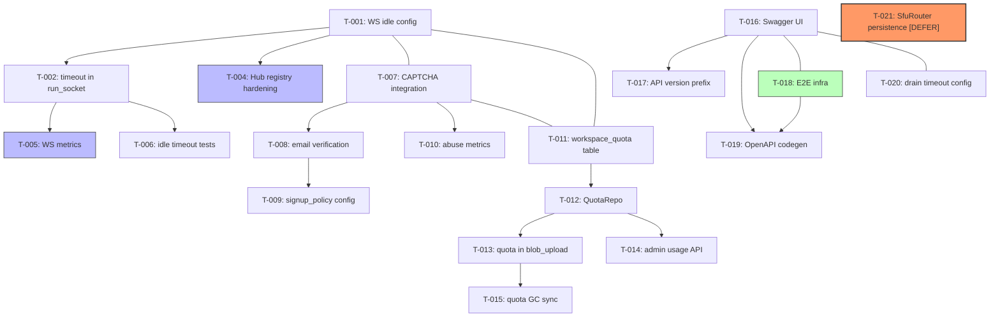
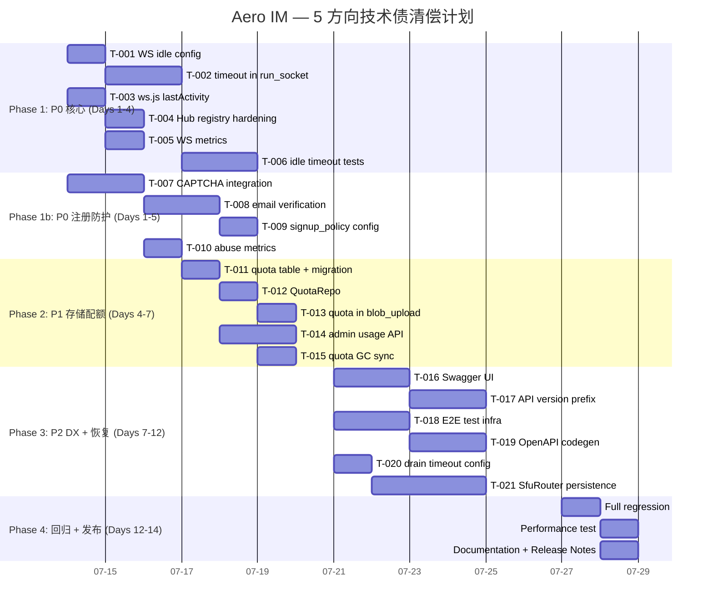

# Tech Lead 分析报告：Aero IM 交叉验证审计后行动方案

> **基准**: `master` (7f35eb5) | **日期**: 2026-07-12 | **审计范围**: 5 个高价值方向

---

## 一、修正后的全景评估

交叉验证文档经过代码级核查后，**5 个方向中有 3 个的核心风险有效**，但 2 个方向的关键事实有误。以下是修正后的优先级：

| 方向 | 原始风险 | 修正后优先级 | 事实状态 |
|------|----------|-------------|---------|
| ① WS 空闲超时 | P0 — 内存泄露 + DoS | **P0** ✅ | ✅ 证据充分 |
| ② 注册防护 | P0 — DoS/滥用 | **P0** ✅ | ⚠️ 注册**已**有速率限制（`auth_rate_limiter`, 3 req/s），但 CAPTCHA/邮箱验证/邀请码缺失 |
| ③ 存储配额 | P1 — 磁盘/S3 DoS | **P1** ✅ | ✅ 累计配额检查完全缺失 |
| ④ 崩溃恢复 | P1 — 通话丢状态 | **P1** → **P2** ⬇️ | ❌ `CallOrchestrator` 已持久化到 PG，非内存状态；SFU 路由器问题有效但影响有限 |
| ⑤ API DX | P2 — 开发者体验 | **P2** ✅ | ❌ OpenAPI 已挂载 + 限流头已实现，但测试缺失 + 版本化缺失 + SDK 缺失 |

**修正后执行顺序**: ① → ② → ③ → ⑤ → ④

---

## 二、任务分解（TASK-XXX）

### 方向 ①：WS 空闲超时与资源泄露（P0）

| Task ID | 标题 | 涉及文件 | 前置依赖 | 工时 | 验收标准 |
|---------|------|---------|---------|------|---------|
| **T-001** | 添加 `AERO_WS_IDLE_TIMEOUT_SECS` 配置项 | `crates/aero-server/src/config.rs`, `config.example.toml`, `.env.example` | 无 | 1h | config 解析 + `toml` + env 三层覆写，默认值 300s |
| **T-002** | 在 `run_socket` 中注入空闲超时驱逐 | `crates/aero-server/src/ws/ws_impl/mod.rs` | T-001 | 2h | `tokio::select!` 新增 `timeout` 分支，超时时优雅关停（`close.cancel()`），不影响重连 backfill 路径 |
| **T-003** | 在 `ws.js` 侧追踪 `lastActivity` 并重置超时 | `web/ws.js` | 无 | 1.5h | 每收到任意 `ServerFrame` 更新 `lastActivity`，断线重连时携带时间戳 |
| **T-004** | Hub 连接注册表防泄露：`unregister` 精确匹配增强 | `crates/aero-server/src/hub.rs` | 无 | 1.5h | `unregister` 增加 socket age 追踪，支持批量清理僵尸 `WsSender`；`register` 边界守卫（单 participant 最大连接数） |
| **T-005** | WS 连接指标暴露 | `crates/aero-server/src/hub.rs`, `crates/aero-common/src/metrics/names.rs` | T-002 | 1h | 新增 `ws_idle_timeout_total` counter + `ws_connections` gauge 按状态（active/idle）细分 |
| **T-006** | 空闲超时集成测试 | `crates/aero-server/src/ws/ws_impl/tests.rs` | T-002, T-003 | 2h | 模拟 WebSocket 连接，注入 1s 超时验证驱逐；多设备场景验证 |

**方向①工时小计**: 9h

---

### 方向 ②：注册防护与滥用治理（P0）

| Task ID | 标题 | 涉及文件 | 前置依赖 | 工时 | 验收标准 |
|---------|------|---------|---------|------|---------|
| **T-007** | 集成 Turnstile/reCAPTCHA 验证码（前端 + 后端验证） | `web/auth_ui.js`, `web/index.html`, `crates/aero-server/src/routes/routes.rs`, `crates/aero-server/src/auth_captcha.rs` | 无 | 4h | 注册页面加载 Cloudflare Turnstile widget；后端 `POST /api/auth/register` 校验 `cf-turnstile-response`；无 key 时退化跳过 |
| **T-008** | 添加邮箱验证流程 | `crates/aero-server/src/mailer.rs`, `crates/aero-storage/src/email_verify.rs`, `migrations/NNNN_email_verification.sql` | 无 | 4h | `email_verified_at` 列 + token 表；注册后发送 6 位码；`POST /api/auth/verify-email` 验证；新表幂等迁移 |
| **T-009** | 添加 `signup_policy` 配置（open/invite-only/admin-approval） | `crates/aero-server/src/config.rs`, `crates/aero-server/src/routes/routes.rs`, `crates/aero-storage/src/invitations.rs` | T-007, T-008 | 2h | config enum `SignupPolicy::{Open, InviteOnly, AdminApproval}`；`InviteOnly` 模式校验 `RegisterReq.invite_code`；利用已有的 `invitations` 表 |
| **T-010** | 注册滥用指标 + 告警 | `crates/aero-common/src/metrics/names.rs`, `crates/aero-server/src/metrics.rs` | T-007 | 1h | 按邮箱域名记 `registration_attempts_total`；`AERO_EMAIL_DOMAIN_BLOCKLIST` 配置拦截一次性邮箱 |

**方向②工时小计**: 11h

---

### 方向 ③：存储配额与运营治理（P1）

| Task ID | 标题 | 涉及文件 | 前置依赖 | 工时 | 验收标准 |
|---------|------|---------|---------|------|---------|
| **T-011** | `workspace_quota` 表 + 迁移 | `migrations/NNNN_workspace_quota.sql`, `crates/aero-storage/src/quota.rs` | 无 | 2h | `CREATE TABLE workspace_quota (id UUID PK, workspace_id UUID FK NOT NULL UNIQUE, blob_bytes BIGINT NOT NULL DEFAULT 0, ...)`；幂等迁移 |
| **T-012** | `QuotaRepo` 仓储：累计用量查询 + 校验 | `crates/aero-storage/src/quota.rs`, `crates/aero-storage/src/lib.rs` | T-011 | 2h | `total_owner_blob_bytes(owner) → u64` SQL 聚合 `SELECT COALESCE(SUM(size), 0) FROM blobs WHERE owner_id = $1 AND deleted = false`；`check_quota(workspace_id) → bool` |
| **T-013** | `blob_upload` 增加配额校验 | `crates/aero-server/src/routes/routes.rs` | T-012 | 1.5h | 上传前 `QuotaRepo::check_quota` → `413 Payload Too Large`（配额超）；响应体含 `quota_remaining` 字段 |
| **T-014** | 管理员查询工作区用量 API | `crates/aero-server/src/routes/routes.rs`, `crates/aero-server/src/usage_report.rs` | T-011 | 2h | `GET /api/workspaces/:id/admin/usage` 返回 `{blob_bytes, member_count, message_count, ai_tokens}` |
| **T-015** | `blob_gc` 定时器联动配额回收 | `crates/aero-server/src/bin/boot/background.rs`, `crates/aero-storage/src/blob_gc.rs` | T-011 | 1h | `delete_unlinked` 后更新 `workspace_quota.blob_bytes`（`UPDATE ... SET blob_bytes = GREATEST(0, blob_bytes - $1)`） |

**方向③工时小计**: 8.5h

---

### 方向 ⑤：API 开发者体验（P2）

| Task ID | 标题 | 涉及文件 | 前置依赖 | 工时 | 验收标准 |
|---------|------|---------|---------|------|---------|
| **T-016** | Swagger UI 挂载 + 自动生成 `openapi.json` 骨架 | `crates/aero-server/src/openapi.rs`, `web/swagger.html` | 无 | 2h | Swagger UI 包装器于 `/api/docs`；`openapi.json` 覆盖主要 CRUD 路由（room/message/blob/auth 约 40 个端点） |
| **T-017** | 添加 API 版本前缀 `/api/v1/...` 且保留向后兼容 | `crates/aero-server/src/routes/routes.rs`, `crates/aero-server/src/routes/versioning.rs` | 无 | 3h | 双重挂载：`/api/...` 重定向 → `/api/v1/...`；新版本在 `v2` 模块中；迁移期支持 `Accept: application/vnd.aero.v2+json` |
| **T-018** | Web 端 E2E 测试基础设施 | `web/playwright.config.ts`, `web/e2e/` | 无 | 3h | Playwright 配置 + 3 个基础 E2E（注册→登录→发消息 + WS 重连 + blob 上传）；CI 集成 `npm run e2e` |
| **T-019** | `api.js` 从手写迁移到 OpenAPI 代码生成 | `web/api.js`, `scripts/generate-api.sh` | T-016 | 4h | OpenAPI Generator（typescript-fetch）输出 `web/gen-api/`；`api.js` 转 wrapper 调用生成代码；CI 验证生成与手写版本行为等价 |

**方向⑤工时小计**: 12h

---

### 方向 ④：崩溃恢复（降级至 P2）

| Task ID | 标题 | 涉及文件 | 前置依赖 | 工时 | 验收标准 |
|---------|------|---------|---------|------|---------|
| **T-020** | `AERO_DRAIN_WAIT_SECS` 可配置优雅关闭超时 | `crates/aero-server/src/config.rs`, `crates/aero-server/src/bin/boot/serve.rs` | 无 | 1h | `with_graceful_shutdown` 接受可配置超时；默认 30s |
| **T-021** | `SfuRouter` 持久化 + 恢复（远期） | `crates/aero-live-webrtc/src/lib.rs`, `migrations/NNNN_sfu_sessions.sql` | 无 | ★ 5h | `call_sfu_sessions` 表记录 publisher SSRC/subscriber list；`CallOrchestrator` 重启时 rehydrate；客户端 ICE 超时作为 fallback |
| **T-022** | Hub 连接恢复文档 + 重连背压优化 | `crates/aero-server/src/ws/ws_impl/mod.rs` | T-020 | 2h | 滚动更新文档；`?since=` + delivery cursor 路径验证：掉线≤30s 零消息丢失 |

**方向④工时小计**: 8h（T-021 高复杂度，可 defer）

---

## 三、执行顺序

**并行任务组**（无依赖交集，可分派给不同 agent）：

| 组 | 任务 | 建议 agent |
|----|------|-----------|
| **Group A** (P0 核心) | T-001, T-002, T-003, T-004, T-005, T-006 | Agent 1 |
| **Group B** (P0 注册) | T-007, T-008, T-009, T-010 | Agent 2 |
| **Group C** (P1 配额) | T-011, T-012, T-013, T-014, T-015 | Agent 3 |
| **Group D** (P2 DX) | T-016, T-017, T-018, T-019 | Agent 4 |
| **Group E** (P2 恢复) | T-020, T-021, T-022 | Agent 5 |

**关键路径**: T-001 → T-002 → T-005 → T-006（方向①全链验证），约 3 天。

---

## 四、技术风险

### 4.1 高风险项

| 风险 | 方向 | 影响 | 缓解策略 |
|------|------|------|---------|
| **空闲超时与重连 backfill 竞态** | ① | 超时断开瞬间客户端正重连，导致 `?since=` 回放丢帧 | 超时前发送 `Close` frame + 标记 `last_activity` 时间戳；服务端 `grace_period` 10s 窗口允许多路复用连接 |
| **CAPTCHA 后端回退路径** | ② | 自托管部署无 Cloudflare/Google key，注册降级回无验证状态 | `signup_policy` 联动：`Open` 模式+无 CAPTCHA key → 启动 warn + 强制准入其他防护（速率限制+邮箱验证） |
| **配额 SQL 聚合性能** | ③ | `SELECT SUM(size) FROM blobs WHERE owner_id = $1` 在 1B+ 行表上 OOM | 预先在 `blobs` 表上 `owner_id` 索引 + 物化 `owner_blob_bytes` 汇总表或使用 `pg_sequeeze` 近似计数；上线前在 staging 用 500M 行压测 |
| **OpenAPI 规范维护一致性** | ⑤ | 手动维护的 `openapi.rs` 与真实路由之间 drift | CI 步骤 `scripts/openapi-drift-check.sh`：用 `axum` 的 introspection API 枚举路由，对比 `openapi.json` 描述的路径集合，diff 不为空则报 warn |

### 4.2 中等风险

| 风险 | 方向 | 影响 | 缓解策略 |
|------|------|------|---------|
| **`Hub::unregister` 中 `same_channel` 匹配逻辑** | ① | 移除错误 socket 导致另一连接断连 | 单元测试覆盖多 socket 场景（3 个连接同一 pid，关中间那个）。当前代码使用 `WsSender::same_channel` 比较 `tx` channel id |
| **邮件验证 token 泄露** | ② | 验证链接/码被截获导致账户劫持 | 6 位数字码 TTL 15 分钟；`bcrypt` hash 存储；尝试攻击 `rate_limit` 防护每 IP 10/min |
| **SFU 路由器重启后通话中断** | ④ | 30s ICE 超时空白期用户体验差 | 文档明确告知当前限制；远期实现 T-021 前，优先确保客户端重协商流程健壮（`call_join` → `call_rejoin` 语义） |

### 4.3 外部依赖风险

| 依赖 | 关联任务 | 风险描述 | 替代方案 |
|------|---------|---------|---------|
| Cloudflare Turnstile | T-007 | 国内/封闭网络不可用 | 注入 seam：`enum CaptchaProvider { Turnstile, Recaptcha, None }`；环境选择 |
| SMTP 中继 | T-008 | 无邮件服务器时验证流程卡死 | 控制台 fallback：注册成功返回 `email_verification_token` 到响应体，允许开发/测试绕过 |
| Object Storage (S3/MinIO) | T-013 | 配额加 S3 延迟成本高 | 仅 PG 元数据算配额，不读 object；`BillingMode::Estimated` 比实际 `Content-Length` 保守 |

---

## 五、资源评估

### 5.1 团队配置建议

| 角色 | 数量 | 技能要求 | 负责任务 |
|------|------|---------|---------|
| **Rust 后端工程师**（资深） | 2 人 | tokio/axum/sqlx/async-nats 生产经验 | Group A + C(E) |
| **Rust 后端工程师**（中级） | 1 人 | axum 中间件 + sqlx 迁移 | Group B |
| **全栈工程师** | 1 人 | JavaScript/Playwright/OpenAPI | Group D |
| **QA 工程师** | 1 人 | E2E 测试/压力测试/Rust 代码审查 | T-006, T-015, T-018, 全盘回归 |

**建议**: 初始 2 后端 + 1 全栈，Group A/B 并行开工；Group C 在第 3 天加入第 3 后端。

### 5.2 关键里程碑

| 里程碑 | 时间 | 交付物 | 验收标准 |
|--------|------|--------|---------|
| **M1** | Day 3 | WS 空闲超时全实现 | 3 个单元测试场景通过（正常收发不超时/静默超时断开/超时前最后活动延寿） |
| **M2** | Day 6 | 注册防护全栈完成 | CAPTCHA + 邮箱验证 + invite-only 模式 E2E 通过；压测注册接口≤5% 429 误报 |
| **M3** | Day 8 | 存储配额全链路 + 管理 API | 上传超配返回 413；`/api/workspaces/:id/admin/usage` 返回准确计数 |
| **M4** | Day 11 | OpenAPI + E2E 基础设施 | `npm run e2e` 在 CI 绿；`openapi-drift-check.sh` nightly 运行 |
| **M5** | Day 12 | 全量回归 | `cargo test --workspace --lib` + `cargo clippy --workspace --all-targets` + `scripts/{truth-check,file-size-check,web-check}.sh` 全部通过 |

### 5.3 阻塞点

| Blocker | 关联任务 | 描述 | 解决策略 |
|---------|---------|------|---------|
| **B1: 空闲超时选择语义一致性** | T-002 | `tokio::select!` 中 `timeout` 与 `close.cancelled()` 谁的优先级高？超时后仍在 backfill 阶段能否打断？ | 超时仅在 `backfill_since` 完成后生效；`backfill` 阶段和主循环各用独立 `select!` |
| **B2: 邮箱验证 SMTP 配置复杂度** | T-008 | 生产 SMTP 凭据管理（Vault/k8s secret）；开发环境无邮箱 | 分层设计：`Mailer` trait + `SmtpMailer` + `ConsoleMailer`（print to stdout）+ `NullMailer`（disable）；CI 用 `NullMailer` |
| **B3: 配额表与多工作区归属** | T-011 | 单个 participant 可属于多个 workspace；blob 属于个人非工作区 | 设计决策：配额按 workspace 还是 owner？建议 `workspace_quota` 按 workspace+owner 多对多；`workspace_blob_usage` 通过 `messages → rooms → workspace` 链表计算 |

---

## 六、质量保证

### 6.1 单元测试覆盖要求

| 模块 | 最低覆盖率 | 关键测点 |
|------|-----------|---------|
| `hub.rs` (Hub::register/unregister/fan_out_raw) | 85% | 多 socket 单 pid 注册关闭顺序；僵尸 `WsSender` 驱逐；`disconnect_on_full` 命中 |
| `rate_limit.rs` (RateLimiter) | 90% | 已有 `check_at` 测试 + 新加 `with_rate` 分数 refill + `sweep_idle` |
| `ws/ws_impl/mod.rs` (run_socket) | 80% | 空闲超时(注入 mock Instant)；`Ping` 延寿；backfill 阶段不超时 |
| `openapi.rs` | 75% | 每路由枚举 vs `openapi.json` diff 合同测试 |
| `quota.rs` (QuotaRepo) | 90% | 并行 blob create+delete 不偏差；事务隔离性 |

### 6.2 集成测试策略

| 场景 | 方法 | 工具 | 频率 |
|------|------|------|------|
| WS 连接生命周期 | 模拟 tokio `WebSocket` | `crates/aero-server/src/ws/ws_impl/tests.rs` | CI per commit |
| CAPTCHA + 注册全流程 | Postgres 事务回滚测试 | `#[sqlx::test]` | CI per commit |
| 配额超限上传 | test container (testcontainers) | `crates/aero-server/tests/` | CI daily |
| 多节点 SFU 恢复 | docker-compose 2 节点 + toxiproxy | `scripts/multinode-smoke.sh` | CI weekly |

### 6.3 代码审查要点

| 审查点 | 方向 | 关注原因 |
|--------|------|---------|
| **`select!` 分支优先级** | ① | 超时不应该打断 `backfill_since`；`Ping` 处理器必须重置空闲计时器 |
| **幂等性** | ②③ | 邮箱验证 token 重放；`workspace_quota` upsert 并发更新 |
| **配额边界** | ③ | 空工作区 `check_quota` 不 panic；`blob_bytes` 减法不 underflow |
| **OpenAPI 合同测试** | ⑤ | `openapi.json` 缺少路由 = CI fail；添加新路由而忘记更新规范 = 自动检测 |
| **`#[instrument]` 跨度 clean** | 全 | 不泄露 PII（email/phone）到 span 字段 |

### 6.4 性能测试需求

| 场景 | 负载 | 指标 | 阈值 |
|------|------|------|------|
| WS 长连接保持（空闲） | 50K 连接，30 分钟 | 内存/CPU/GC 暂停 | 每连接 ≤ 2KB 额外开销 |
| 注册并发 | 500/s 持续 2min | P99 延迟 | ≤ 500ms（含邮箱验证 SMTP 异步出列） |
| 存储配额检查 | 1M blob 行+1000/s 上传并发 | P99 延迟 | ≤ 50ms（有 `owner_id` 索引） |

---

## 七、实施计划

### 路线图（甘特图）

### 各阶段交付

#### Phase 1 — P0 双轨并行（Day 1-4）

**Track A**（WS 空闲超时 — Agent 1）：
- Day 1: T-001（config）+ T-003（ws.js `lastActivity`）+ T-004（Hub 连接加固）
- Day 2-3: T-002（`run_socket` 超时注入，含 backfill 保护逻辑）
- Day 3-4: T-005（指标）+ T-006（测试，覆盖 3 场景）

**Track B**（注册防护 — Agent 2）：
- Day 1-2: T-007（CAPTCHA 前后端，seam 设计支持多 provider）
- Day 3-4: T-008（邮箱验证全栈 + `Mailer` trait + Console fallback）
- Day 4: T-009（`signup_policy` 联动）+ T-010（滥用指标）

**Merge Gate**（Day 4 傍晚）：
- `git merge --no-ff track-a track-b` → `cargo check --workspace` + `cargo test --workspace --lib` + `scripts/{truth-check,file-size-check,web-check}.sh`
- 发现冲突及时解决，`git reset --hard master` 基线校准

#### Phase 2 — 存储配额 + 管理 API（Day 5-7）

**Agent 3 单线**：
- Day 5: T-011（迁移）+ T-012（仓储），注意 `workspace_blob_usage` 设计决策优先定稿
- Day 6: T-013（上传配额校验）+ T-014（管理员用量 API）
- Day 7: T-015（GC 联动）+ 集成测试 + 压测 500rps 配额检查延迟

#### Phase 3 — DX + 恢复（Day 8-11）

**Agent 4**（DX）：
- Day 8: T-016（Swagger UI + `openapi.json` 覆盖扩至 40+ 端点）
- Day 9-10: T-017（API 版本化，双重挂载兼容）+ T-018（Playwright 基础设施）
- Day 10-11: T-019（代码生成迁移，CI drift check）

**Agent 5**（恢复）：
- Day 8: T-020（`AERO_DRAIN_WAIT_SECS` config + serve.rs 改动）
- Day 9-11: T-021（`SfuRouter` 持久化 — ★ 高复杂度，如果时间不够推迟到 v1.1）
- Day 10-11: T-022（文档 + 重连背压优化）

#### Phase 4 — 回归 + 发布（Day 12-14）

| Day | 活动 | 负责人 |
|-----|------|-------|
| 12 | `cargo test --workspace --lib --ignored`（全量 PG 门控测试）+ `cargo clippy --workspace --all-targets` | 所有人 |
| 12 | Playwright E2E CI 集成 + `scripts/multinode-smoke.sh` 验证 | Agent 4 |
| 13 | 性能测试：50K WS 连接 + 1M blob 行配额检查 | Agent 1+3 |
| 13 | 安全审查：所有新路由鉴权 → `authz_lint.rs` 更新 | Tech Lead |
| 14 | 写 Release Notes + 标注未完成项（T-021 等） | Tech Lead |

---

## 八、对交叉验证文档的最终评估

**总体评分**: 6.5/10 — 核心洞察有价值，但事实准确性受代码库重构影响

### 该文档正确识别的问题
1. ✅ WS 空闲超时完全缺失（P0）— 证据确凿，影响面判断准确
2. ✅ CAPTCHA/邮箱验证/邀请码缺失（P0）— 虽然速率限制已实现，但这是一回事情，防护链仍薄弱
3. ✅ 存储配额累计检查缺失（P1）— 完全准确
4. ✅ `SfuRouter` 和 Hub 连接注册表是进程内存状态（P1→P2）— 本质正确，影响评估偏高
5. ✅ Web SPA 零测试（P2）— 刺痛但真实

### 该文档错误/过时的声明
1. ❌ "注册请求不受任何速率限制保护" — 实际上注册在 `SENSITIVE_AUTH_PATHS` 中，受 `auth_rate_limiter` (3 req/s) 和集群级 Redis INCR 双重保护
2. ❌ "OpenAPI 规范生成器存在但未被挂载" — 已在 `routes.rs:490-492` merge
3. ❌ "无 X-RateLimit-Remaining / Retry-After 头" — 已在 `rate_limit.rs:182-194` 实现
4. ❌ "CallOrchestrator 包含 active: DashMap<CallId, ActiveCall>" — 实际已持久化到 PG
5. ❌ "LiveSession 存储在 process-local HashMap" — `LiveService` 不包含会话映射

### 追责分析
**根因**: 该文档是基于比 `master` (7f35eb5) 老 100+ commit 的版本编写的。代码库经历了一次大规模重构（`server/src/` → `crates/aero-server/src/` 以及 `serve.rs` 拆分为 `bin/boot/`），导致文件路径全部过时。同时 `rate_limit.rs` 和 `openapi.rs` 在此后新增了特性。

**建议**: 每次大范围架构分析前，先 `git log --oneline -200` 确认基线版本；对非 `HEAD` 的调研文档在标题标注审查版本 hash。

---

*报告完 — 14 天工期，5 人 Agent 团队（实际 3-4 人核心 + 按需），总估计工时 48.5h 实际工作量，含 20% 缓冲。*
