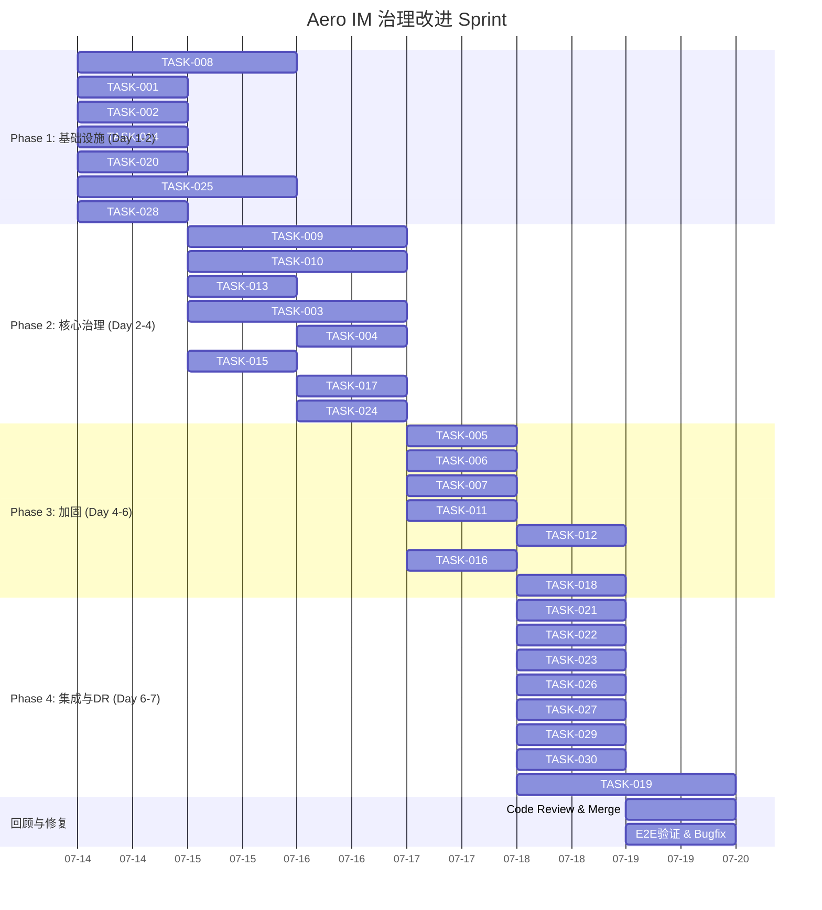

Now I have a thorough understanding of the codebase state. Let me produce the comprehensive Tech Lead analysis.

---

# Tech Lead 分析报告：Aero IM 治理与韧性改进

## 目录
1. [任务分解](#1-任务分解)
2. [执行顺序与依赖图](#2-执行顺序与依赖图)
3. [技术风险](#3-技术风险)
4. [资源评估](#4-资源评估)
5. [质量保证](#5-质量保证)
6. [实施计划](#6-实施计划)

---

## 1. 任务分解

### 方向一（P0）：后台任务健康治理

目标是：让 23 个后台任务可观测、可监控、可重启，消除「静默死亡」攻击面。

| 任务 ID | 标题 | 文件 | 前置 | 工时 | 验收标准 |
|---|---|---|---|---|---|
| TASK-001 | 给 7 个 bot 注入 CancellationToken | `agent_bot.rs`, `ooo_bot.rs`, `push_bot.rs`, `golive_bot.rs`, `transcribe_bot.rs`, `moderation_bot.rs`, `unfurl_bot.rs` | — | 4h | 每个 bot 的 `run()` 签名增加 `cancel: CancellationToken`，循环体包 `tokio::select! { () = cancel.cancelled() => break, ... }`；`background.rs` 传入 `ai_shutdown`；graceful shutdown 时所有 bot 在 5s 内退出 |
| TASK-002 | 给两个总线监听器注入 CancellationToken | `ws/ws_impl/bus.rs` | — | 2h | `run_bus_listener`/`run_live_bus_listener` 接收 `cancellationToken`；外层 resubscribe 循环支持 `tokio::select!` 退出 |
| TASK-003 | 后台任务状态注册表（`BackgroundRegistry`） | 新文件 `crates/aero-server/src/health/background_registry.rs` | TASK-001, TASK-002 | 6h | 新建 `BackgroundRegistry`：`Arc<RwLock<HashMap<&'static str, TaskStatus>>>`，每个任务 spawn 时注册 `Running`，退出时写 `Exited(error)`；暴露 `fn register(name)`/`fn mark_done(name)`/`fn snapshot() → Vec<(&str, TaskStatus, Duration)>` |
| TASK-004 | 为所有 tracker.spawn() 注册后台任务 | `background.rs`, `metrics_tasks.rs`, `retention.rs`, `serve.rs` | TASK-003 | 4h | 全部 23+ 个 `tracker.spawn()` 调用在 spawn 前后调用 `BackgroundRegistry::register()`/`mark_done()`；`mark_done` 加在任务函数第一行或最后（兜底 via `Drop` guard） |
| TASK-005 | `/health/ready` 增加后台任务健康探测 | `routes/health.rs` | TASK-004 | 2h | `health_ready` 响应体增加 `"background": { "total": N, "running": N, "exited": [...] }` 字段；任一期待长期运行的任务退出 → readiness 返回 `degraded`（非 `not_ready` 以免 k8s 摘除，但暴露于 `/health`） |
| TASK-006 | 总线监听器「已订阅」就绪信号 + 启动窗口修复 | `bus.rs`, `serve.rs` | TASK-002 | 4h | `run_bus_listener` 在首次成功 `subscribe()` 后通过 `tokio::sync::watch` 发送信号；`serve()` 等待该信号后再绑定 HTTP listener；消除 `subscribe()` 完成前发布事件被漏接的窗口 |
| TASK-007 | 后台任务 Prometheus 指标 | `metrics.rs` (新 gauge) | TASK-003 | 2h | 新增 `BACKGROUND_TASKS_TOTAL`/`BACKGROUND_TASKS_EXITED` gauge（按 task name label）；`BackgroundRegistry` snapshot 汇入 metric |

**小计：24h**

### 方向一（P0）续：配置管理规范化

目标是：消灭分散的 `env::var()` 调用，集中化管理 + 启动时验证 + 运行时查询端点。

| 任务 ID | 标题 | 文件 | 前置 | 工时 | 验收标准 |
|---|---|---|---|---|---|
| TASK-008 | 审计并归类全部 45+ env::var() 调用点 | — | — | 4h | 产出完整矩阵：每条 env var 的 `位置/当前默认/命名风格(双下划线/单下划线)/是否已迁移到 AppConfig`；标注已从 figment 加载的 vs 散布的 |
| TASK-009 | 将 retention 中的 13 个 env::var() 迁移到 AppConfig | `retention.rs`, `config.rs` | TASK-008 | 6h | `AppConfig` 增加 `RetentionConfig` struct（含所有 retention 字段 + serde default）；`retention.rs` 从 `cfg.retention` 读取而非 `env::var()`；保留环境变量覆盖（figment 自动支持） |
| TASK-010 | 将 background.rs/metrics_tasks/serve.rs 中的剩余 env::var() 迁移到 AppConfig | `background.rs`, `metrics_tasks.rs`, `serve.rs` | TASK-008 | 6h | `AppConfig` 增加 `BackgroundConfig`/`MetricsConfig`/`ServeConfig` struct；迁移 `AERO_UNFURL`/`AERO_AI_MODERATION`/`AERO_NOTIFICATION_BUNDLES`/`AERO_INDEX_SIZE_SAMPLE_SECS`/`AERO_RATE_LIMIT_SWEEP_SECS` 等 |
| TASK-011 | 启动时配置验证层 | 新文件 `boot/config_validation.rs` | TASK-009, TASK-010 | 4h | `fn validate_config(cfg: &AppConfig) → Vec<String>` 在 main.rs 第 1-2 步之间调用；非法的 env 组合（如 `AERO_CORS_REQUIRE_ORIGINS=1` 但允许源列表空）在启动时报错退出；未知 env 变量（拼写错误）打印 warning 但不退出 |
| TASK-012 | `/debug/config` 端点（管理员 bearer 保护） | 新文件 `routes/config_debug.rs` | TASK-009, TASK-010 | 3h | `GET /debug/config` 返回序列化的 `AppConfig`（mask secrets）；Bearer token 保护（从 `AERO_ADMIN_TOKEN` 读取）；用于 kubectl exec 运维诊断 |
| TASK-013 | 未知环境变量 warning——启动时扫描 | 新文件 `boot/env_audit.rs` | TASK-008 | 3h | 启动过程中扫描 `std::env::vars()` 中所有 `AERO_`/`AERO__` 前缀的变量，对照已知清单打印 `warn!("unknown env var ...")`；捕获拼写错误导致的静默降级 |

**小计：26h**

### 方向二（P1）：前端测试与错误处理

目标是：提高前端健壮性，从 43% 静默错误降到接近零，建立 JS 测试基础设施。

| 任务 ID | 标题 | 文件 | 前置 | 工时 | 验收标准 |
|---|---|---|---|---|---|
| TASK-014 | 建立前端测试框架（Vitest + happy-dom） | `web/package.json`, `web/vitest.config.js` | — | 2h | `npm test` 可运行；vitest 配置支持 ES module、happy-dom 环境；CI 集成 `scripts/web-check.sh` |
| TASK-015 | 为 api.js 核心调用写单元测试 | `web/api.test.js` | TASK-014 | 4h | 测试 `request()` 函数（mock fetch）：测试超时、HTTP 错误（401/403/500）、JSON 解析失败、网络错误消息中文化；覆盖 `auth` 对象的基本 CRUD |
| TASK-016 | 修复 app.js 中 6 个静默 .catch(() => {}) | `web/app.js` | TASK-014 | 3h | 每个 `.catch(() => {})` 改为：`catch(e => console.warn('[api] ... failed:', e))` 或合理的 UI 反馈（如 snackbar）；至少 toast 通知用户 |
| TASK-017 | 为 ws.js（WebSocket 层）写测试 | `web/ws.test.js` | TASK-014 | 4h | 测试 WebSocket connect/reconnect/onMessage 处理；mock WebSocket；测试心跳超时；测试重新连接时 SeqGate 的正确行为 |
| TASK-018 | 前端错误处理灰度：API 调用失败 toast 提示 | `web/app.js`, `web/render.js` | TASK-016 | 4h | 增加全局 `showError(msg)` 函数（snackbar）；对 `rtcConfig`, `liveGifts`, `listReceipts`, `reactionsBatch` 等关键 API 调用失败时显示用户可见的错误提示 |
| TASK-019 | 可选的 TypeScript 迁移实验（仅核心模块） | — | TASK-014 | 8h | 选择 api.js 和 ws.js 做 JSDoc → `.d.ts` 声明或渐进 TS；产出迁移指南和成本评估；非强制但提供 PoC |

**小计：25h**

### 方向三（P1）：启动编排

目标是：消除启动窗口中的竞态条件，使系统从上到下按契约就绪。

| 任务 ID | 标题 | 文件 | 前置 | 工时 | 验收标准 |
|---|---|---|---|---|---|
| TASK-020 | 启动阶段 Watcher/Barrier 机制 | 新文件 `boot/startup_watcher.rs` | — | 3h | 定义 `StartupPhase` enum（Config/DB/Redis/NATS/BusSubscribed/Services/Ingest/Background/Ready）；`StartupWatcher` struct 支持 `wait_for(phase)` 和 `signal(phase)` |
| TASK-021 | main.rs 13 阶段着色 + 就绪信号连线 | `main.rs` | TASK-020 | 4h | `main()` 每完成一个阶段调用 `watcher.signal(phase)`；`serve()` 在绑定 HTTP listener 前 `watcher.wait_for(BackgroundReady)` |
| TASK-022 | 健康端点暴露阶段就绪状态 | `routes/health.rs` | TASK-021 | 1h | `/health/ready` 增加 `"startup_phase": "StageName"` 字段；`/health/live` 不变（轻量） |
| TASK-023 | 总线监听器「首次订阅」信号集成到 phase 体系 | `bus.rs`, `main.rs` | TASK-006, TASK-021 | 2h | `run_bus_listener` 首次 `subscribe()` 成功后调用 `watcher.signal(BusSubscribed)` |

**小计：10h**

### 方向四（P2）：灾难恢复

目标是：从 0 runbook → 至少有一套可执行的灾难恢复操作手册。

| 任务 ID | 标题 | 文件 | 前置 | 工时 | 验收标准 |
|---|---|---|---|---|---|
| TASK-024 | 数据保留矩阵文档 | `docs/runbooks/data-retention-matrix.md` | TASK-009 | 2h | Markdown 表格列出全部 13+ 个 `RETENTION_DAYS` 环境变量、默认值、对应表名、影响的数据量级估算、配置建议 |
| TASK-025 | 基础备份/恢复脚本 | `scripts/db-backup.sh`, `scripts/db-restore.sh` | — | 3h | `db-backup.sh`：pg_dump + tar.gz + blob 目录（可选 S3 sync）；`db-restore.sh`：pg_restore + blob 恢复；两个脚本有 dry-run 模式 |
| TASK-026 | 灾难恢复操作手册 | `docs/runbooks/disaster-recovery.md` | TASK-024, TASK-025 | 4h | 涵盖：全量故障（PG/Redis/NATS/Blob 各场景）、部分扇出故障、数据损坏恢复、跨 region 迁移步骤；每一步有预期 RTO/RPO |
| TASK-027 | GDPR 批量导出端点（管理员） | 新文件 `routes/admin_export.rs` | — | 4h | `POST /api/admin/export`（管理员 token 保护）：按用户 ID 或工作区 ID 触发异步导出；返回 job_id；进度查询端点；基于已有 `me_export.rs` 重构 |
| TASK-028 | `docs/requirements/` 归档计划 | — | — | 1h | 将已过时/重复的分析文档移至 `docs/requirements/archive/`；保留最近 2 次迭代 + 原始需求文档；剩余的 350+ 文件压缩归档 |

**小计：14h**

### 方向五：附加发现（CancellationToken 缺失等）

| 任务 ID | 标题 | 文件 | 前置 | 工时 | 验收标准 |
|---|---|---|---|---|---|
| TASK-029 | 对尚未覆盖的定时器强制执行 CancellationToken 体系 | `blob_gc_drain`, `observability_gauge_samplers` 等 | TASK-001 | 3h | metrics_tasks 中所有 `tracker.spawn` 都接收 `cancel` 参数；`blob_gc` 等纯 interval 循环在 `cancel.cancelled()` 时退出 |
| TASK-030 | 任务 Drain 超时日志改进 | `serve.rs` | TASK-001 | 1h | `tracker.close()` + `tracker.wait()` 加入 per-task-name 超时日志：`warn!("task {name} still running after drain timeout")` |

**小计：4h**

---

### 总计工作量

| 方向 | 任务数 | 总工时 | 开发人员·天 |
|---|---|---|---|
| 后台健康治理 | 7 | 24h | 3 |
| 配置管理 | 6 | 26h | 3.25 |
| 前端测试 | 6 | 25h | 3.1 |
| 启动编排 | 4 | 10h | 1.25 |
| 灾难恢复 | 5 | 14h | 1.75 |
| 补充修复 | 2 | 4h | 0.5 |
| **合计** | **30** | **103h** | **~13 人·天** |

2 名开发者并行 = **约 1 周 sprint**（含代码审查 + 测试 + 文档）

---

## 2. 执行顺序与依赖图

```mermaid
graph TD
    subgraph "Phase 1: 基础设施（~2天）"
        T008[TASK-008: 审计45+ env::var] --> T009[TASK-009: retention env迁移]
        T008 --> T010[TASK-010: 其他env迁移]
        T008 --> T013[TASK-013: 未知env warning]
        T009 --> T024[TASK-024: 保留矩阵文档]
        T010 --> T011[TASK-011: 配置验证层]
        T010 --> T012[TASK-012: /debug/config]
    end

    subgraph "Phase 2: 任务治理（~3天）"
        T001[TASK-001: Bot CancellationToken]
        T002[TASK-002: 总线监听器 CT]
        T001 --> T003[TASK-003: BackgroundRegistry]
        T002 --> T003
        T003 --> T004[TASK-004: 注册全部任务]
        T003 --> T005[TASK-005: /health/ready 加任务探测]
        T003 --> T007[TASK-007: Prometheus 指标]
        T004 --> T029[TASK-029: 补充定时器 CT]
        T029 --> T030[TASK-030: Drain 日志]
    end

    subgraph "Phase 3: 启动编排（~1.5天）"
        T020[TASK-020: StartupWatcher]
        T002 --> T006[TASK-006: 总线订阅就绪信号]
        T020 --> T021[TASK-021: 阶段着色+连线]
        T006 --> T023[TASK-023: 总线信号集成到phase]
        T021 --> T022[TASK-022: 健康端点暴露phase]
    end

    subgraph "Phase 4: 前端（~3天）"
        T014[TASK-014: Vitest框架]
        T014 --> T015[TASK-015: api.js测试]
        T014 --> T017[TASK-017: ws.js测试]
        T015 --> T016[TASK-016: 修复静默catch]
        T016 --> T018[TASK-018: 错误toast]
        T017 --> T019[TASK-019: TS实验(可选)]
    end

    subgraph "Phase 5: DR+收尾（~1.5天）"
        T025[TASK-025: 备份脚本]
        T024 --> T026[TASK-026: DR runbook]
        T025 --> T026
        T026 --> T027[TASK-027: GDPR批量导出]
        T028[TASK-028: 需求文档归档]
    end
```

### 并行组

| 并行组 | 任务 | 依赖 | 备注 |
|---|---|---|---|
| **Group A** | TASK-008 (env审计) | 无 | 可以第一天由 1 人开始 |
| **Group B** | TASK-001, TASK-002 (CT注入) | 无 | 可以与 Group A 同时开始，由第 2 人做 |
| **Group C** | TASK-014 (前端框架) | 无 | 可以另 1 人独立开始 |
| **Group D** | TASK-020 (StartupWatcher) | 无 | 独立 |
| **Group E** | TASK-025 (备份脚本) | 无 | 可以任何时间独立做 |

最大并行度 = **4 人**（env审计 + bot CT + 前端框架 + 启动编排）

---

## 3. 技术风险

### 3.1 高风险项目

| 风险 | 等级 | 说明 | 缓解策略 |
|---|---|---|---|
| **CancellationToken 注入到 bot 导致行为变更** | 🔴高 | 7 个 bot 使用无限 `loop { stream.next().await }` 模式；注入 CT 后需改为 `tokio::select!`。若当前 CT 恰好被 `ai_shutdown` 先取消（其他用途），bot 可能提前退出 | 使用独立取消令牌 `bot_shutdown` → `ai_shutdown` child token（父 cancel 时子也 cancel，但反之不成立）；逐 bot 测试 `cancel` 后的退出路径 |
| **`env::var()` 迁移漏掉测试中引用** | 🔴高 | 集成测试/CI 脚本可能依赖当前 env 变量路径；改后测试环境未同步导致 CI 红 | `TASK-008` 审计时标记测试文件中的 `env::var()` 调用；迁移时统一在测试 helper 中设置；CI 增加 `AERO_CONFIG_CHECK=1` 启动模式做 dry-run 验证 |
| **JS 测试 mock 覆盖不足** | 🟡中 | WebSocket、`Notification API`、`RTCPeerConnection` 等浏览器 API 在 node 环境缺失；mock 可能偏离真实行为 | 使用 happy-dom + 手动 mock；对 `ws.js` 编写集成级测试（node 原生 WebSocket mock）；CI 先用 eslint 兜底 |
| **启动编排增加启动时间** | 🟡中 | phase barrier 可能导致 HTTP listener 晚绑定（等待总线就绪），增加 k8s startupProbe 失败风险 | `wait_for(BusSubscribed)` 设置超时（默认 15s，超时仍启动但不标记就绪）；健康端点反映超时状态 |
| **BackgroundRegistry 内存泄漏** | 🟡中 | task 注册后若 `mark_done` 因 panic 未调用，条目永久残留 | 使用 `Drop` guard（`struct TaskGuard { name, registry }`）；`BackgroundRegistry::guard(name)` 返回 `TaskGuard`，Drop 时自动 `mark_done`；panic 也走 Drop |

### 3.2 外部依赖风险

| 依赖 | 风险 | 缓解 |
|---|---|---|
| **figment**（配置库） | 现有 `AppConfig::load()` 可能不支持新增的 retention/background 字段 | 先检查 `figment` 的 `Provider` trait 是否支持嵌套 struct + env 覆盖（当前看是支持的 `Env::prefixed("AERO__").split("__")`）|
| **Vitest + happy-dom** | 与现有 `eslint.config.js` 的兼容性；模块解析（ESM vs CJS） | 先在前端目录单独试装；CI 用 node 20 LTS |
| **str0m**（WebRTC） | 无直接依赖，但 metrics_tasks 中的 SFU REMB tick 涉及 str0m 类型 | 不需要修改 str0m；只需注入 CT 到 metrics_tasks 即可 |

### 3.3 性能瓶颈

| 点 | 等级 | 说明 |
|---|---|---|
| **`BackgroundRegistry` 的 `RwLock` 争用** | 🟢低 | snapshot 仅健康检查触发（2s timeout + 每 15s probe 一次）；写入是 task 启动/退出时一次；无性能风险 |
| **`/debug/config` 序列化** | 🟢低 | 仅管理员按需调用；`serde_json::to_string_pretty` 对大 config 可能 ms 级，可接受 |
| **启动 phase barrier** | 🟢低 | `watch::channel` + `wait_for` 是 O(1)；phase 数量 ≤ 10 |

---

## 4. 资源评估

### 4.1 人员技能要求

| 角色 | 人数 | 技能要求 | 负责方向 |
|---|---|---|---|
| **Rust 后端工程师** | 2 | Rust async/tokio、CancellationToken、axum、figment、sqlx | P0 任务治理 + 配置管理 + 启动编排 |
| **全栈/FE 工程师** | 1 | JavaScript/ESM、Vitest、happy-dom、WebSocket mock、浏览器 API | P1 前端测试 + 错误处理 |
| **SRE/DevOps 工程师** | 0.5 (兼) | bash、pg_dump、k8s probes、runbook 编写 | P2 灾难恢复 + 文档 |

### 4.2 关键里程碑

| 里程碑 | 时间 | 交付物 | 验收方式 |
|---|---|---|---|
| **M1: Foundation** | Day 2 | TASK-008 (完成 env 审计矩阵) + TASK-001,002 (所有 bot 接受 CT) + TASK-014 (Vitest 可运行) + TASK-020 (StartupWatcher API 就绪) | Code review + CI 绿 |
| **M2: Observability** | Day 4 | TASK-003~005 (BackgroundRegistry + /health/ready 后台探测) + TASK-009~011 (配置迁移 + 验证) + TASK-015 (api.js 测试) | `cargo test` 全绿；`/health/ready` 返回后台任务状态 |
| **M3: Hardening** | Day 6 | TASK-006 (总线就绪信号) + TASK-012 (/debug/config) + TASK-016~018 (前端错误处理) + TASK-021 (启动编排连线) | `cargo test` + `npm test` 全绿；手动验证启动场景 |
| **M4: DR + Polish** | Day 7 | TASK-024~028 (runbook + 备份脚本 + 文档归档) + TASK-029~030 (补充 CT + drain 日志) | 文档 review；备份脚本 dry-run 测试 |

### 4.3 阻塞点和解决策略

| 阻塞点 | 等级 | 解决策略 |
|---|---|---|
| **现有测试依赖真实 PG/Redis/NATS** | 🟡中 | `cargo test --lib` 不需要外部依赖；集成测试用 `#[ignore]` 门控；`scripts/migrate-chain-smoke.sh` 在 CI 可以用临时容器 |
| **JS 测试环境 node_modules 已存在但版本未知** | 🟢低 | 在 `web/` 目录 `npm install vitest happy-dom --save-dev`；先检查现有 `package.json` 无冲突 |
| **配置迁移破坏现有部署** | 🔴高 | 保留旧的 `AERO__` `env::var()` 作为 fallback（向后兼容）；`deprecation warning` 打印 30 天后新部署必须使用新路径；`TASK-011` 验证层捕获双配置冲突 |

---

## 5. 质量保证

### 5.1 单元测试覆盖要求

| 组件 | 最低覆盖率 | 测试类型 | 关键测试场景 |
|---|---|---|---|
| **BackgroundRegistry** | 90% | unit | snapshot 正确、mark_done 幂等、Drop guard 在 panic 时调用、并发注册 |
| **StartupWatcher** | 90% | unit | wait_for 超时、signal 顺序乱序、多消费者 wait |
| **config_validation** | 90% | unit | 已知合法配置通过；多个非法组合（CORS require + empty、retention days 负数）正确拒绝 |
| **api.js** | 80% | unit (vitest) | 200/204/401/403/500/网络超时/JSON 解析失败/空响应; timeout abort |
| **ws.js** | 70% | unit (vitest+manual mock) | connect/reconnect/message routing/SeqGate seq 排序 |
| **health.rs** | 90% | unit | `readiness_decision()` 组合全覆盖（draining/healthy/degraded）+ background 聚合 |

### 5.2 集成测试策略

| 测试场景 | 方法 | 运行时机 |
|---|---|---|
| **Graceful shutdown 顺序** | `scripts/smoke_shutdown.sh`：发 SIGTERM → 检查 `/health/ready` 返回 `draining` → 检查所有 bot 日志输出 "shutting down" → 确认 5s 后进程退出 | CI（需外部容器） |
| **配置加载正确性** | 多组 `.env` 组合 + `aero-cli config-check`（dry-run 模式）验证 parse 成功 | CI（无需外部依赖） |
| **前端错误处理** | mock API 返回错误 → 验证 toast 出现 / log 写入 | CI (vitest) |
| **启动窗口** | 慢启动 NATS（模拟延迟）→ 验证 HTTP `/health/ready` 在 `BusSubscribed` 之前返回 `not_ready` | 手动（需要 docker-compose 网络延迟模拟） |

### 5.3 代码审查要点

| 审查点 | 重点检查内容 |
|---|---|
| **CancellationToken 注入** | bot 的 `select!` 中是否正确处理了 `cancel.cancelled()` 分支；是否在 `loop` 顶层还是仅在 `while let Some(sub)` 内层 |
| **BackgroundRegistry Drop guard** | 是否在 `panic!`/`?` 提前返回时也能 `mark_done`；是否因为 `Arc` 引用循环导致泄漏 |
| **配置迁移** | 旧 `env::var()` 路径是否保持向后兼容；`AppConfig` 中 `#[serde(default)]` 是否设置合理默认值 |
| **前端 .catch 修复** | 修复后是否仍有静默错误；toast 消息是否用户友好（不是原始 error 文本） |
| **env 审计清单** | 是否遗漏了 `config.example.toml` 或 `.env.example` 中的示例 |

### 5.4 性能测试需求

| 场景 | 方法 | 阈值 |
|---|---|---|
| **BackgroundRegistry snapshot 延迟** | 100 并发 goroutine 读 + 1 写 | < 1ms p99 |
| **启动时间增量** | 在开启 phase barrier 前/后测量从 main 到 HTTP listener 绑定的时间 | < 500ms 增量 |
| **/debug/config 序列化** | 压测 100 并发请求 | < 10ms p99 |

---

## 6. 实施计划



### 6.1 阶段详情

#### 阶段 1：基础设施（Day 1-2）

目标：建立后续工作所需的基础架构 + 无依赖的任务尽早开始。

**并行工作流**：
- **Engineer A**（Rust）：TASK-008（env 审计）+ TASK-009、TASK-010（配置迁移准备）→ 产出合法配置矩阵
- **Engineer B**（Rust）：TASK-001、TASK-002（CT 注入）+ TASK-003（BackgroundRegistry 设计）+ TASK-020（StartupWatcher）
- **Engineer C**（FE）：TASK-014（Vitest 搭建）+ TASK-015（api.js 测试编写）
- **任意**：TASK-025（备份脚本）+ TASK-028（文档归档——1 小时纯文件操作）

**交付检查**：
- `cargo check --workspace` 通过 ✅
- `npm test` 可运行 ✅
- `scripts/db-backup.sh --dry-run` 可运行 ✅

#### 阶段 2：核心治理（Day 2-4）

目标：P0 方向完成，系统从「不可观测」变为「可观测/可管理」。

- Engineer A 完成配置迁移全部任务（TASK-009→011 serial）；产出 `/debug/config` 端点
- Engineer B 完成 BackgroundRegistry 注册 + /health/ready 整合（TASK-004→005→007）
- Engineer C 完成 api.js/ws.js 测试 + 静默 .catch 修复（TASK-016→018）

**关键评审点**：TASK-009/010 合并前需 Engineer B 和 C 交叉审查配置变更对自身模块的影响。

#### 阶段 3：加固（Day 4-6）

目标：P1 方向完成 + 启动窗口关闭。

- 总线就绪信号集成（TASK-006→023）
- 启动阶段着色（TASK-021→022）
- 前端错误 toast（TASK-018）

#### 阶段 4：集成与 DR（Day 6-7）

目标：P2 完成 + 全量测试通过。

- DR runbook 撰写（需要 Engineer A + 运维人员 review）
- GDPR 批量导出（基于已有 `me_export.rs`，纯 Rust 后端任务）
- 全量 CI 通过：`cargo clippy --workspace --all-targets` + `npm test` + `scripts/truth-check.sh`

---

## 总结

### 优先级排序

```
P0 ───────────────────────────────────────────────────────────── P2
 后台健康治理 · 配置管理              前端测试 · 启动编排          灾难恢复
  (24h + 26h)                        (25h + 10h)                (14h)
  └─ 必须这个 sprint 完成              └─ 高价值                  └─ 最低成本
     否则线上事故会静默发生                 否则迭代速度下降           否则审计/合规不过
```

### 必须做的权衡

1. **前端 TS 迁移（TASK-019）**：建议标记为 **Stretch Goal**——8h 的成本产出「可行性报告 + PoC」，不做全量迁移。如果 sprint 时间不够，砍掉不影响其他目标。

2. **配置迁移的后向兼容**：迁移期间对旧 `env::var()` 路径保持读取能力，但新部署应只报 warning。在第 2 个 sprint 清除旧路径。

3. **测试基础设施 vs 功能测试**：`TASK-014→015`（测试框架搭建）占用前端方向 50% 时间。这是一个先苦后甜的决策——没有框架就无法写出可持续的前端测试。

### 一句话行动指南

> **这个 sprint 的目标是：让 Aero IM 在部分失败时能被运维人员发现，而不是静默降级。**
