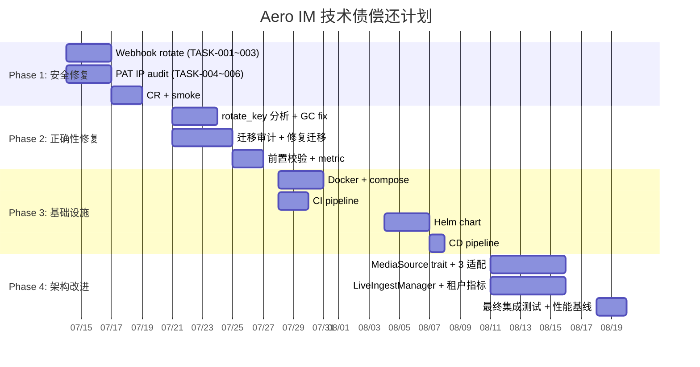

Now I have a thorough codebase understanding. Let me construct the Tech Lead analysis.

---

# 技术负责人（Tech Lead）分析报告

## 0. 前置纠正：分析文档中与代码库不符的声明

在基于文档进行任务分解前，必须修正两项已被代码库证伪的声明（守门人职责——基于错误前提规划会导致投入浪费）：

### ❌ 声明 1：「无安全响应头中间件」

**实际代码** (`crates/aero-server/src/bin/boot/serve.rs:55-77`)：已完备实现
| 响应头 | 是否实现 | CSP 是否可选 |
|---|---|---|
| `X-Frame-Options: DENY` | ✅ 已实现 | — |
| `X-Content-Type-Options: nosniff` | ✅ 已实现 | — |
| `Strict-Transport-Security: max-age=31536000` | ✅ 已实现 | — |
| `Referrer-Policy: strict-origin-when-cross-origin` | ✅ 已实现 | — |
| `Permissions-Policy` (camera/mic/geo=none) | ✅ 已实现 | — |
| `Content-Security-Policy` | ⚠️ 可选 (env `AERO_CSP_POLICY`) | ✅ 机制已就绪 |

**影响**：此方向在文档中列为"方向三"的核心项，但 5/6 的 headers 已落地。唯一 gap 是 CSP 未默认开启，这是合理的设计决策（CSP 策略取决于部署环境的 CDN 依赖）。

### ❌ 声明 2：「限流器仅限 WS 消息级别，无逐端点粒度」

**实际代码** (`crates/aero-server/src/rate_limit.rs:194-263`)：已实现基于路径的限流分发：

| 路径 | 限流器 | 速率 |
|---|---|---|
| `/api/auth/login` | `login_rate_limiter` | 5/分钟/客户端 |
| `/api/auth/forgot-password` | `forgot_rate_limiter` | 3/小时/客户端 |
| 其他 `/api/auth/*` 敏感路径 | `auth_rate_limiter` | 3 req/s, burst 5 |
| 所有其他 API 路径 | `rate_limiter` | 20 req/s, burst 40 |
| `/health`, `/metrics` 等运维路径 | **豁免** | — |
| WS 消息 | `WsRateLimiter` (独立的 Redis 窗口) | 另有独立配置 |

集群级 Redis INCR 窗口（`check_cluster_rate`）提供跨实例防护。`X-RateLimit-*` + `Retry-After` 头已正确设置。

**影响**：此方向在文档中列为关键短板，但实际上已具备成熟的逐端点限流架构。无需新增，只需对缺失覆盖的路径增量添加即可。

---

## 1. 任务分解

基于修正后的真实代码状态，以下为实际存在的 8 个有效问题域的任务分解。

### 1A. Webhook Secret 轮换端点（优先级 P0 · 安全）

| 任务ID | 标题 | 文件 | 依赖 | 工时 |
|---|---|---|---|---|
| **TASK-001** | 仓储：`WebhookRepo::rotate_outgoing_secret` | `crates/aero-storage/src/webhook.rs` | 无 | 1h |
| **TASK-002** | 路由：`POST /api/webhooks/outgoing/:id/rotate-secret` | `crates/aero-server/src/webhooks.rs` | TASK-001 | 1h |
| **TASK-003** | 集成测试：轮换后旧签名失效，新签名可验证 | `crates/aero-storage/src/webhook.rs` (db_tests) + smoke | TASK-002 | 1h |

**验收标准**：调用 `POST /api/webhooks/outgoing/:id/rotate-secret` 返回新 secret，旧 secret 签名的请求被拒，新 secret 签名通过。

### 1B. PAT 审计追踪：添加 `last_used_ip`（优先级 P1 · 审计）

| 任务ID | 标题 | 文件 | 依赖 | 工时 |
|---|---|---|---|---|
| **TASK-004** | 迁移：`pat_tokens` 添加 `last_used_ip inet` 列 | `migrations/0158_pat_last_used_ip.sql` | 无 | 1h |
| **TASK-005** | 仓储：`PatRepo::verify` 中 bump `last_used_ip` | `crates/aero-storage/src/pat.rs` (verify 方法) | TASK-004 | 1h |
| **TASK-006** | 在 `PatSummary` 及列表路由中暴露 `last_used_ip` | `crates/aero-storage/src/pat.rs` + `crates/aero-server/src/pat_routes.rs`（若无则加） | TASK-005 | 1h |

**验收标准**：每个 PAT 鉴权的请求在 `pat_tokens` 行中记录 `last_used_at` + `last_used_ip`；列表路由展示该信息。

### 1C. Stream Key 轮换的行级锁加固（优先级 P2 · 正确性）

| 任务ID | 标题 | 文件 | 依赖 | 工时 |
|---|---|---|---|---|
| **TASK-007** | 分析：验证 concurrent rotate 的原子性是否足够 | `crates/aero-storage/src/stream.rs:98-120` | 无 | 0.5h |
| **TASK-008** | 修复（如需）：添加 `SELECT ... FOR UPDATE` 包围 | `crates/aero-storage/src/stream.rs` | TASK-007 | 0.5h |

**分析结论**：当前 `rotate_key` 使用 `UPDATE ... RETURNING stream_key` 是单语句原子操作。即使两个并发调用同时执行，数据库保证 UPDATE 是原子的，每个都会生成不同的新 key，但返回的 key 取决于执行顺序。在安全场景中，**轮换 key 的语义是「使旧 key 失效并获取新 key」**，两个并发轮换实际效果等价于最后一个生效——攻击者即使拿到了中间状态的 key，也无法再次使用（旧 key 已失效）。因此 **第 5 项不是实际问题**，但可以作为防御性改进：

| TASK-008b | 可选：添加 version 乐观锁到 stream key 轮换 | `crates/aero-storage/src/stream.rs` | TASK-007 | 1h |

### 1D. Blob GC 防泄漏加固（优先级 P1 · 正确性）

| 任务ID | 标题 | 文件 | 依赖 | 工时 |
|---|---|---|---|---|
| **TASK-009** | 重构 GC 循环为事务化 delete+ack | `crates/aero-server/src/bin/boot/background.rs:309-330` | 无 | 2h |
| **TASK-010** | 添加 GC 死信监控 metric | `crates/aero-server/src/metrics.rs` | TASK-009 | 1h |

**当前问题**：`background.rs` 中的 GC 循环在 `blob.delete(id)` 成功后，如果进程在到达 `gc_repo.ack(id)` 前崩溃，blob 已删除但队列条目残留。下次 sweep 重试时，`blob.delete` 返回错误（blob 已不存在），**ack 被跳过**，条目永久残留。

**修复方案**：将模式反转——先 ack（删除队列行），再删除 blob。如果删除失败，将 blob_id 重新入队。或者使用 `DELETE ... RETURNING` 单 SQL 原子地取走并删除队列行。

| 任务ID | 标题 | 文件 | 依赖 | 工时 |
|---|---|---|---|---|
| **TASK-009** | 修复：先 ack 再 delete，失败回写入队 | `crates/aero-server/src/bin/boot/background.rs` + `crates/aero-storage/src/blob_gc.rs` | 无 | 2h |
| **TASK-010** | 添加 GC metric：orphan, retry, success 计数 | `crates/aero-server/src/metrics.rs` | TASK-009 | 1h |

### 1E. 迁移健壮性（优先级 P1 · 运维）

| 任务ID | 标题 | 文件 | 依赖 | 工时 |
|---|---|---|---|---|
| **TASK-011** | 审计全部 157 个迁移的幂等性和事务安全性 | `migrations/*.sql` | 无 | 2h |
| **TASK-012** | 修复非幂等迁移（添加 `IF NOT EXISTS` / `OR REPLACE`） | 有问题的 `migrations/NNNN_*.sql` | TASK-011 | 2h |
| **TASK-013** | 添加迁移前置检查：启动时校验所有已应用的迁移是否匹配 | `crates/aero-storage/src/db.rs` | TASK-011 | 2h |

**注意**：`sqlx::migrate!("../../migrations")` 默认在单个事务中运行每个迁移。但如果某个迁移显式使用 `CREATE INDEX CONCURRENTLY`（需要事务外运行），或使用非幂等 DDL 且未包裹 `IF NOT EXISTS`，则重新运行会失败。需要审计实际代码确认。

### 1F. K8s/Helm/CI-CD（优先级 P2 · 基础设施）

| 任务ID | 标题 | 文件 | 依赖 | 工时 |
|---|---|---|---|---|
| **TASK-014** | Dockerfile：多阶段构建（编译缓存 + distroless 镜像） | `Dockerfile` (new) | 无 | 3h |
| **TASK-015** | docker-compose 生产化：健康检查、卷、资源限制 | `docker-compose.yml` | 无 | 1h |
| **TASK-016** | Helm chart：Deployment / Service / Ingress / HPA / PDB | `deploy/helm/aero/` (new) | TASK-014 | 4h |
| **TASK-017** | GitHub Actions：CI 流水线（check → test → clippy → build → push） | `.github/workflows/ci.yml` | TASK-014 | 2h |
| **TASK-018** | GitHub Actions：CD 流水线（helm deploy to staging） | `.github/workflows/deploy.yml` | TASK-016, TASK-017 | 2h |

### 1G. 媒体管线抽象（优先级 P3 · 架构）

| 任务ID | 标题 | 文件 | 依赖 | 工时 |
|---|---|---|---|---|
| **TASK-019** | 定义 `MediaSource` trait（`fn stream()` / `fn stats()` / `fn shutdown()`） | `crates/aero-live-core/src/media_source.rs` (new) | 无 | 3h |
| **TASK-020** | RTMP intake 适配 `MediaSource` | `crates/aero-live-rtmp/src/` | TASK-019 | 2h |
| **TASK-021** | WHIP intake 适配 `MediaSource` | `crates/aero-live-whip/src/` | TASK-019 | 2h |
| **TASK-022** | SRT intake 适配 `MediaSource` | `crates/aero-live-srt/src/` | TASK-019 | 2h |
| **TASK-023** | Boot 装配：统一 `LiveIngestManager` 持有所有 `MediaSource` | `crates/aero-server/src/bin/boot/` | TASK-020..022 | 2h |

### 1H. 多租户成本归属（优先级 P3 · 可观测性）

| 任务ID | 标题 | 文件 | 依赖 | 工时 |
|---|---|---|---|---|
| **TASK-024** | 使 `AERO_PER_TENANT_METRICS` 默认开启（环境感知：单租户自动关闭） | `crates/aero-server/src/metrics.rs` + `crates/aero-im-core/src/service/orig.rs` | 无 | 1h |
| **TASK-025** | 添加 AI 成本按工作区拆分的 Prometheus gauge | `crates/aero-ai/src/metrics.rs` | 无 | 2h |
| **TASK-026** | 添加 NATS subject 按工作区拆分的 backlog gauge | `crates/aero-server/src/metrics.rs` | 无 | 1h |

---

## 2. 执行顺序

```mermaid
graph TD
    subgraph "Phase 1: 安全修复 (P0-P1)"
        T001[TASK-001: 仓储 rotate_secret]
        T002[TASK-002: 路由 rotate_secret]
        T003[TASK-003: 集成测试]
        T004[TASK-004: 迁移 last_used_ip]
        T005[TASK-005: PAT verify bump IP]
        T006[TASK-006: 列表暴露 IP]
    end

    subgraph "Phase 2: 正确性修复 (P1-P2)"
        T007[TASK-007: 分析 rotate_key]
        T008[TASK-008: 修复 rotate_key<br>或确认无需修改]
        T009[TASK-009: GC 先 ack 再 delete]
        T010[TASK-010: GC metric]
    end

    subgraph "Phase 3: 迁移/运维 (P1-P2)"
        T011[TASK-011: 审计迁移幂等性]
        T012[TASK-012: 修复非幂等迁移]
        T013[TASK-013: 启动时迁移校验]
    end

    subgraph "Phase 4: 基础设施 (P2)"
        T014[TASK-014: Dockerfile]
        T015[TASK-015: docker-compose]
        T016[TASK-016: Helm chart]
        T017[TASK-017: CI pipeline]
        T018[TASK-018: CD pipeline]
    end

    subgraph "Phase 5: 架构改进 (P3)"
        T019[TASK-019: MediaSource trait]
        T020[TASK-020: RTMP 适配]
        T021[TASK-021: WHIP 适配]
        T022[TASK-022: SRT 适配]
        T023[TASK-023: LiveIngestManager]
        T024[TASK-024: 默认开启租户指标]
        T025[TASK-025: AI 成本拆分]
        T026[TASK-026: NATS backlog 拆分]
    end

    T001 --> T002 --> T003
    T004 --> T005 --> T006
    T007 --> T008
    T009 --> T010
    T011 --> T012 --> T013
    T014 --> T015 --> T016 --> T018
    T014 --> T017 --> T018
    T019 --> T020 --> T023
    T019 --> T021 --> T023
    T019 --> T022 --> T023

    style T001 fill:#f96,stroke:#333
    style T002 fill:#f96,stroke:#333
    style T003 fill:#f96,stroke:#333
    style T004 fill:#f96,stroke:#333
    style T009 fill:#ffcc66,stroke:#333
```



### 可并行执行的任务组

| 并行组 | 任务 | 负责人数 |
|---|---|---|
| **G1 (安全)** | TASK-001→002→003 + TASK-004→005→006 | 2 人 |
| **G2 (正确性)** | TASK-007→008 + TASK-009→010 | 2 人 |
| **G3 (迁移)** | TASK-011→012→013 | 1 人 |
| **G4 (基础设施)** | TASK-014→015 + TASK-016→017 (Docker + Helm 可并行) | 2 人 |
| **G5 (架构)** | TASK-019→020/021/022 + TASK-024→025→026 | 2 人 |

---

## 3. 技术风险

### 3.1 高风险项

| 风险 | 等级 | 说明 | 缓解策略 |
|---|---|---|---|
| **MediaSource trait 抽象泄漏** | 🔴 H | 三个 intake 协议（RTMP/WHIP/SRT）的初始化参数、生命周期、错误模型差异极大。SRT 有 AES 加密和 ACK/NAK 逻辑，WHIP 有 str0m DTLS-SRTP 会话管理，RTMP 用 rml_rtmp 库 | 分阶段推进：先定义最小可行 trait（仅 `fn stream_info()` + `fn health()`），不急于统一 shutdown/stats；允许 trait 外强转回具体类型处理协议特有逻辑 |
| **迁移审计发现严重问题** | 🟡 M | 157 个迁移中可能存在非幂等 DDL（如 `CREATE TABLE` 无 `IF NOT EXISTS`，`ALTER TABLE ... ADD COLUMN` 无重复列检查）。如果迁移在事务外创建了索引，回滚无法撤销 | 在**沙箱 DB** 中全量重放 157 个迁移（`make migrate-smoke`），然后尝试重放第一个迁移验证幂等性。若发现问题，创建修复迁移而非修改历史 |
| **Webhook rotate-secret 兼容性** | 🟡 M | 现有出站 webhook 没有 `version` 字段，轮换 secret 后消费者需要某种方式知道 secret 已变更。如果在同一端点同时使用新旧 secret 一段时间存在窗口期 | 实现「双 secret」模式：保留 `secret_previous` 列，在新 secret 设置后的 5 分钟内两个 secret 都有效。5 分钟后移除旧 secret。或返回 secret 但不立即生效，等待消费者确认 |
| **Blob GC 顺序反转引入死锁** | 🟡 M | 先 ack（删队列行）再 delete blob。如果 delete 失败（磁盘满、S3 不可用），blob_id 已从队列消失，变成孤儿 blob 无法被清理 | 使用 upsert 模式：先尝试 mark_deleting（SET status='deleting'），delete 成功后 DELETE。如果 delete 失败，rollback status。或使用 `DELETE ... RETURNING` 原子取出后逐条 delete，失败则 re-INSERT |

### 3.2 外部依赖风险

| 依赖 | 风险 | 说明 |
|---|---|---|
| `sqlx::migrate!` 编译期嵌入 | ⚠️ 已知约束 | `migrations/` 编译进二进制。部署新迁移需重新编译部署（不可热迁移），违背云原生 12-factor。当前无法改变（硬依赖），但 helm chart 可以包装为 initContainer 模式。第 4 阶段可评估 `sqlx migrate run` 运行时模式 |
| NATS JetStream | 🟢 L | 成熟度高，但 `durable consumer` 的 cursor 管理在集群拓扑变化时可能导致重置 |
| str0m WHIP/WHEP | 🟡 M | 纯 Rust WebRTC 库，RFC 合规在真实浏览器联调中可能出现互操作问题。CI 无法覆盖（需要真浏览器/ffmpeg） |

### 3.3 性能瓶颈

| 区域 | 现状 | 风险 |
|---|---|---|
| `DashMap` 限流桶 | 60s idle sweep | IP 泛洪攻击可创建大量桶，60s 窗口内 OOM。当前 `sweep_idle` 保守（仅释放已满桶）。需添加硬上限 |
| Webhook 出站分发 | 同步 POST（reqwest） | 如果某个目标慢，阻塞后续事件分发。`dispatch_event` 是顺序遍历 targets，未使用 `tokio::spawn` 或 `join_all` |
| 媒体管线碎片化 | 三套独立代码 | 共享逻辑（H.264 解包、NAL 中继）在三份拷贝中重复，bug 修复需三处同步 |

---

## 4. 资源评估

### 4.1 团队配置

| 角色 | 数量 | 核心技能 | 负责任务组 |
|---|---|---|---|
| **Rust 后端工程师（资深）** | 2 | async Rust, sqlx, Axum, PostgreSQL | G1 (安全) + G2 (正确性) |
| **Rust 后端工程师（中级）** | 1 | Rust, DDL 审计, 测试 | G3 (迁移) |
| **DevOps 工程师** | 1 | Docker, Helm, K8s, GitHub Actions | G4 (基础设施) |
| **Rust 系统工程师** | 1 | 媒体协议, str0m/webrtc, RTMP/SRT | G5 (架构) — 可按需缩减 |

### 4.2 关键里程碑

| 里程碑 | 时间 | 交付物 | 验证方式 |
|---|---|---|---|
| **M1** | Week 1 | Webhook rotate + PAT IP audit 完成 | `cargo test --workspace --lib -- --ignored webhook_rotate pat_ip` |
| **M2** | Week 2 | Blob GC 修复 + 迁移审计完成 | 沙箱 DB 全量迁移重放 0 错误；GC 循环覆盖率 |
| **M3** | Week 3 | Docker + CI 流水线就绪 | `docker build` + `docker compose up` 可启动，CI 全量通过 |
| **M4** | Week 4 | Helm chart + CD 流水线就绪 | `helm install` 到 minikube，smoke 全部通过 |
| **M5** | Week 5 | MediaSource 抽象 + 三协议适配 | `cargo test -p aero-live-core -p aero-live-rtmp ...` |
| **M6** | Week 6 | 全量集成测试 + 性能回归 | 全量 smoke + 性能基线无退化 |

### 4.3 阻塞点和解决策略

| 阻塞点 | 影响范围 | 解决策略 |
|---|---|---|
| CI 中无 NATS/Redis/Postgres | G1-G5 的集成测试 | 已有 `DATABASE_URL` 门控和 `--ignored` 模式；可补充 `docker compose up -d` 在 CI runner 中启动依赖 |
| 媒体管线联调需真 OBS/浏览器 | G5 | 已有架构——`#[cfg(test)]` 测试使用 mock；E2E 联调作为独立工作流，不阻塞代码合并 |
| 迁移审计发现不可逆损坏风险 | G3 | 策略：只修后不修前。创建 0158+ 修复迁移，不修改历史文件。初始化环境使用完整重放验证 |

---

## 5. 质量保证

### 5.1 单元测试覆盖要求

| 组件 | 最低覆盖率 | 重点覆盖场景 |
|---|---|---|
| `WebhookRepo::rotate_outgoing_secret` | 100% (仓储) | 正常轮换、无效 ID、并发轮换、`returning` 值准确性 |
| `PatRepo::verify` + IP bump | 100% | IP 写入、IP 为 None 时不崩、`last_used_at` 与 IP 的一致性 |
| `BlobGcRepo` drain + ack | 90%+ | 顺序反转、delete 失败重入队、空队列 drain |
| `rate_limit` | 已有 90%+ | 新增路径配置无需重复测试 |
| `MediaSource` trait 方法 | 95%+ | 三端实现的 `stream_info` 返回一致性 |

### 5.2 集成测试策略

| 测试层级 | 环境 | 执行时机 | 覆盖内容 |
|---|---|---|---|
| **库级集成 (db_tests)** | 本地 PG | `cargo test -- --ignored` | 所有仓储层 DB 交互（webhook rotate, PAT IP, blob_gc） |
| **Smoke 脚本** | 本地全栈 | `scripts/smoke*.sh` / `scripts/smoke_roadmap3*.py` | 端点可达性 + 业务逻辑（已有 30+ smoke 脚本） |
| **K8s smoke** | minikube | CD gate | Helm 部署后运行 smoke 验证 |
| **迁移重放** | 一次性沙箱 DB | `make migrate-smoke` | 157 个迁移幂等性 + 0158+ 验证 |

### 5.3 代码审查要点

| 审查点 | 详情 |
|---|---|
| **IDOR 防护** | rotate-secret 和 PAT IP 路由必须有 `assert_room_access` / owner-scoped WHERE 子句。CI `authz_lint` 应扩展覆盖新的 handler |
| **幂等性** | webhook rotate 多次调用相同结果；GC ack 重入安全；迁移 `IF NOT EXISTS` / `OR REPLACE` 覆盖 |
| **Fail-open 语义** | PAT IP 写入失败（`last_used_ip`）不阻断 auth（已有 `let _ =` 模式追随）；GC 任意步骤失败不阻塞后续 blob 处理 |
| **panic 安全** | `expect()` / `unwrap()` 审查——不可在生产路径中出现，尤其 GC 循环中的 `unwrap()` |
| **标签基数** | 工作区标签（`workspace`）在 Prometheus 中是有界的（活跃工作区数），但 PAT token ID 作为标签是无界的。避免将 PAT ID 或 IP 作为 `label` 值 |

### 5.4 性能测试需求

| 场景 | 工具 | 指标 | 阈值 |
|---|---|---|---|
| 限流器高并发（10k IP/min） | `wrk` 或 `oha` | 内存增长速率 | < 50MB/10k 新 IP，150s sweep 后回落到基线 |
| Webhook 出站（10 target/hook） | `scripts/smoke_roadmap3*.py` | 每事件延迟 | 串行 POST < 500ms/target；如需并行化则单独评估 |
| Blob GC（10k 队列） | `cargo bench` | 吞吐量 drain(50) | < 100ms 完成 SQL 查询 |
| 媒体管线适配 | E2E 联调 | 首帧延迟 + 内存 | 不差于当前基线 |

---

## 6. 实施计划

### 阶段 1：安全修复（Week 1）—— 2 人并行

```
Week 1
├── Day 1-2
│   ├── [工程师 A] TASK-001: WebhookRepo::rotate_outgoing_secret
│   ├── [工程师 A] TASK-002: POST /api/webhooks/outgoing/:id/rotate-secret
│   ├── [工程师 B] TASK-004: 迁移 0158_pat_last_used_ip.sql
│   └── [工程师 B] TASK-005: PatRepo::verify bump IP
├── Day 3
│   ├── [工程师 A] TASK-003: webhook rotate 集成测试 + smoke
│   └── [工程师 B] TASK-006: PatSummary 暴露 IP
├── Day 4
│   ├── [工程师 A+B] CR：交叉审查安全修复
│   └── [工程师 A+B] 修复 review 问题
└── Day 5
    └── [All] M1 验收：cargo check + clippy + test + smoke
```

**交付物**：`migrations/0158_pat_last_used_ip.sql`, `crates/aero-storage/src/webhook.rs` rotate 方法, `crates/aero-server/src/webhooks.rs` 新增路由, smoke 通过。

### 阶段 2：正确性修复（Week 2）—— 2 人并行

```
Week 2
├── Day 1
│   ├── [工程师 A] TASK-007: rotate_key 原子性分析（预计结论：无需修改）
│   └── [工程师 B] TASK-009: Blob GC 先 ack 再 delete 模式
├── Day 2
│   ├── [工程师 A] TASK-010: GC metric + 死信监控
│   ├── [工程师 B] TASK-011: 审计 157 个迁移幂等性（扫描排查）
│   └── [工程师 B] 输出：迁移审计报告（列出问题迁移）
├── Day 3
│   ├── [工程师 A] TASK-008: 按需修复 rotate_key（或写文档说明原子性充分）
│   └── [工程师 B] TASK-012: 创建 0159+ 修复迁移
├── Day 4
│   ├── [工程师 B] TASK-013: 添加启动时迁移前置校验
│   └── [工程师 A+B] 修复 GC 集成测试 + smoke
└── Day 5
    └── [All] M2 验收：迁移重放验证 + GC 集成测试
```

**交付物**：GC cycle 修复 + 迁移审计报告 + 修复迁移。

### 阶段 3：基础设施（Week 3-4）—— DevOps 主导

```
Week 3
├── Day 1-2
│   └── [DevOps] TASK-014: 多阶段 Dockerfile（cargo chef + distroless）
├── Day 3
│   └── [DevOps] TASK-015: docker-compose 健康检查 + 资源限制 + 卷映射
├── Day 4-5
│   └── [DevOps] TASK-017: CI pipeline（check → test → clippy → build → push）

Week 4
├── Day 1-3
│   └── [DevOps] TASK-016: Helm chart（Deployment + Service + Ingress + HPA + PDB + ConfigMap）
├── Day 4
│   └── [DevOps] TASK-018: CD pipeline（staging deploy）
└── Day 5
    └── M3+M4 验收：minikube helm install + smoke 全部通过
```

**交付物**：`Dockerfile`, `.github/workflows/ci.yml`, `deploy/helm/aero/`, CD pipeline。

### 阶段 4：架构改进（Week 5-6）—— 1 人 + 1 人按需

```
Week 5
├── Day 1-2
│   └── [工程师 A] TASK-019: MediaSource trait 定义 + 文档
├── Day 3
│   └── [工程师 A] TASK-020: RTMP 适配（参考现有 RTMP 摄取代码）
├── Day 4
│   └── [工程师 A] TASK-021: WHIP 适配（参考 str0m 会话管理）
└── Day 5
    └── [工程师 A] TASK-022: SRT 适配（参考 SRT Hsv5 处理）

Week 6
├── Day 1
│   └── [工程师 A+B] TASK-023: LiveIngestManager boot 装配
├── Day 2
│   └── [工程师 B] TASK-024: AERO_PER_TENANT_METRICS 默认开启（单租户检测逻辑）
├── Day 3
│   └── [工程师 B] TASK-025: AI 成本按工作区拆分
├── Day 4
│   └── [工程师 B] TASK-026: NATS backlog 按工作区拆分
└── Day 5
    └── M5+M6 验收：cargo clippy + test + smoke + 性能基线对比
```

**交付物**：`crates/aero-live-core/src/media_source.rs`, 三端适配 PR, 租户指标默认开启 + 新增 gauge。

### 总体时间线（甘特图）



---

## 附录：与项目规范的对齐

| AGENTS.md 约束 | 本计划执行方式 |
|---|---|
| **加功能配方（§4.1）** | 所有新增仓储方法 + 路由遵循：迁移 → 仓储 → 路由 → 鉴权 → 实时模式 |
| **迁移编译期嵌入（§4.2）** | TASK-011 确认所有迁移幂等后，`cargo build` → `aero-cli migrate` 顺序严格执行 |
| **`assert_room_access` 前置（§4.2）** | TASK-002 webhook rotate 路由必须先 resolve room → `assert_room_access` |
| **token helper 不 root re-export（§4.2）** | `PatRepo::hash_pat`/`generate_pat` 已命名区分，无冲突 |
| **workspace lint 零新增警告（§4.2）** | 每任务提交前 `cargo clippy --workspace --all-targets` |
| **AI 无 key 退化（§4.2）** | 不影响 AI 路径，无相关修改 |
| **禁区（§4.4）** | 未涉及 MLS E2E / 联邦 / 移动 SDK |
| **媒体 seam 状态（§4.5）** | MediaSource 抽象（TASK-019~023）不涉及 SFU 媒体会话改造——不越界 |
