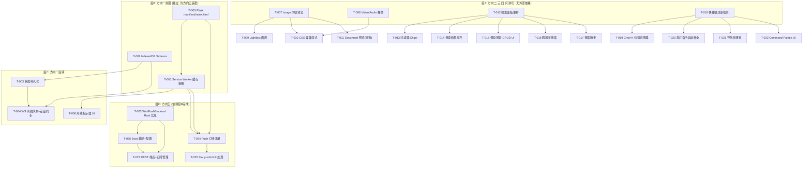
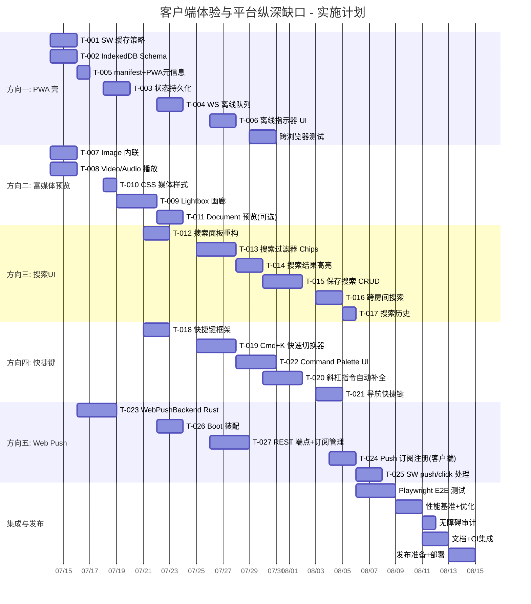

# Tech Lead 分析：客户端体验与平台纵深缺口

> **分析基准**: `docs/requirements/2026-07-11-client-experience-platform-gaps.md`  
> **日期**: 2026-07-12  
> **总览**: 5 个方向（2×P1 客户端架构, 1×P1 产品, 2×P2 产品/生产力），无服务端架构侵入

---

## 1. 任务分解

### 方向一（P1）：PWA 应用壳 / 离线能力

| ID | 任务 | 涉及文件 | 前置 | 工时 |
|----|------|---------|------|------|
| T-001 | **Service Worker 静态缓存策略**：注册 SW、预缓存核心资源（app.js/api.js/render.js/style.css）、runtime-cache 策略（Stale-While-Revalidate for API, Cache-First for static） | `web/sw.js`（新）, `web/index.html` | — | 3h |
| T-002 | **IndexedDB Schema + 封装层**：设计 stores（messages/rooms/participants/drafts/syncCursor）、实现 `db.js` 模块提供 Promise-based CRUD + 批量查询 | `web/db.js`（新） | — | 4h |
| T-003 | **消息/房间/参与者状态持久化**：`context.js` 的 state 写入 IndexedDB（每次 mutations 后 debounce → `db.put`），应用启动时从 IndexedDB 加载初始化 | `web/context.js`, `web/app.js` | T-002 | 4h |
| T-004 | **WS 断线队列 + 状态差量同步**：`pendingByTempId` → IndexedDB（未发送消息不丢）、重连后 `since=<cursor>` 追差量 | `web/ws.js`, `web/context.js` | T-002, T-003 | 4h |
| T-005 | **PWA 元信息完善 + manifest.json**：start_url、icons 多尺寸（192/512）、theme_color、display=standalone、lang | `web/manifest.json`, `web/index.html` | T-001 | 2h |
| T-006 | **离线指示器 UI + 优雅降级**：WS 断开时顶部 banner 显示"已断开·尝试重连"，禁用发送按钮但保留本地草稿，恢复后自动清除 | `web/app.js`, `web/style.css` | T-001 | 3h |

### 方向二（P1）：富媒体内联预览

| ID | 任务 | 涉及文件 | 前置 | 工时 |
|----|------|---------|------|------|
| T-007 | **Image 内联渲染**：`appendBlock` 的 `'file'/kind==='image'` 分支输出 `` 标签（lazy loading + max-width:100% + border-radius），并实现 `/api/blobs/:id?thumb=256` 调用以缩略图加速 | `web/render.js`, `web/api.js` | — | 4h |
| T-008 | **Video/Audio 内联播放**：`'file'/kind==='video'|'audio'` 分支输出 `<video>`/`<audio>` 控件，含 poster 占位 + 字幕轨道支持 | `web/render.js` | — | 3h |
| T-009 | **Lightbox 全屏画廊（gallery.js）**：点击图片→遮罩覆盖→全分辨率加载→左右键盘/触摸导航→计数"3/8"→ESC/点击关闭。支持单图片和消息中多图片消息的序列遍历 | `web/gallery.js`（新）, `web/render.js`, `web/style.css` | T-007 | 4h |
| T-010 | **CSS 媒体预览样式**：图片 max-width、视频容器 aspect-ratio、audio 迷你播放器、attachment 卡片微调、gallery 遮罩动画 | `web/style.css` | T-007, T-008 | 2h |
| T-011 | **Document 预览（可选 MVP）**：PDF → `<iframe>` 内嵌 / Google Docs Viewer / 原生 `pdf.js` 轻集成；Office 直接走下载 | `web/render.js` | T-007 | 3h |

### 方向三（P2）：全功能搜索 UI

| ID | 任务 | 涉及文件 | 前置 | 工时 |
|----|------|---------|------|------|
| T-012 | **搜索面板重构**：从单输入框→Split Panel（左过滤区 + 右结果区），搜索结果渲染改用 `Message` 组件（与主聊天流共用），实现无限滚动翻页 | `web/search.js`, `web/style.css` | — | 4h |
| T-013 | **搜索过滤器 Chips**：`mode` 选择器（FTS/Vector/Hybrid/Auto dropdown）、`from:` 人员选择器（插 chips + 自动补全）、`in:` 房间选择器（插 chips）、日期范围选择器 | `web/search.js` | T-012 | 4h |
| T-014 | **搜索结果高亮**：在渲染搜索结果的 `appendBlock` 中，对匹配的 query 词用 `<mark>` 包裹（大小写/Unicode 归一化匹配），支持从聊天流跳转到搜索结果定位 | `web/render.js`, `web/search.js` | T-012 | 3h |
| T-015 | **保存搜索 CRUD UI**：`web/saved_searches.js` 独立页面/侧栏——列表查看、创建（基于当前搜索条件）、编辑（更改名称/条件）、删除、通知开关 toggle。对接 `/api/saved-searches` 端点 | `web/saved_searches.js`（新）, `web/api.js`, `web/style.css` | T-012 | 4h |
| T-016 | **跨房间搜索 UI 支持**：搜索输入框旁添加 scope 切换（当前房间 / 所有可见房间），调用 `api.search({query, scope:'all', ...})` 并展示 `room_name` 列，结果按房间分组 | `web/search.js`, `web/api.js` | T-012 | 3h |
| T-017 | **搜索历史 + 快速搜索**：在搜索面板顶部展示最近 5 条历史（localStorage），支持一键重新搜索；输入框 `autofocus` + 动态建议 | `web/search.js` | T-012 | 2h |

### 方向四（P2）：键盘快捷键 / Command Palette

| ID | 任务 | 涉及文件 | 前置 | 工时 |
|----|------|---------|------|------|
| T-018 | **快捷键注册框架**：`shortcuts.js`——Context-aware 快捷键注册器（global/composer/modal 三层）、keybinding 组合解析、冲突检测、`?` 展示快捷键参照页 | `web/shortcuts.js`（新） | — | 4h |
| T-019 | **Cmd+K 快速切换器**：模糊搜索房间/参与者/消息、键盘导航（↑↓→选中→Enter 切换）、异步查询参与者 | `web/shortcuts.js`, `web/style.css` | T-018 | 4h |
| T-020 | **斜杠指令自动补全**：`app.js` composer `keydown` 检测 `/` → 浮现下拉列表（`/remind` `/giphy` `/poll` `/me` `/shrug` `/collapse`），TAB/Enter 补全带参数 | `web/commands.js`（新）, `web/app.js`, `web/style.css` | T-018 | 4h |
| T-021 | **导航快捷键**：`j/k` 消息间移动（高亮当前消息 + ScrollIntoView）、`Cmd+Up/Down` 切换最近房、`Cmd+Shift+[U]` 标记全部已读、`g d` / `g m` 跳转房间 | `web/shortcuts.js`, `web/app.js` | T-018 | 3h |
| T-022 | **Command Palette UI 组件**：Cmd+Shift+K/Cmd+/ 触发→居中模态框→搜索指令/功能（切换房、设置、帮助、斜杠指令列表）→Enter 执行 →动画关闭。对标 Spotlight/Raycast | `web/shortcuts.js`, `web/style.css` | T-018 | 4h |

### 方向五（P1）：Web Push 浏览器推送

| ID | 任务 | 涉及文件 | 前置 | 工时 |
|----|------|---------|------|------|
| T-023 | **WebPushBackend Rust 实现**：`PushBackend` trait impl——VAPID 密钥生成/存储、RFC 8030 HTTP POST、Subscription 序列化、错误处理（410→unsubscribe），添加 `web-push` crate 依赖 | `crates/aero-push/src/lib.rs`, `crates/aero-push/Cargo.toml` | — | 6h |
| T-024 | **客户端 Push 订阅注册**：`navigator.serviceWorker.ready` → `pushManager.subscribe({userVisibleOnly:true, applicationServerKey})` → 发送 subscription 到 `POST /api/push/web-subscribe` | `web/push-sub.js`（新）, `web/app.js` | T-001, T-005 | 3h |
| T-025 | **Service Worker Push 事件处理**：`self.addEventListener('push')` 解析 payload → 弹 Notification（title + body + icon + data.deep_link）、`notificationclick` → `clients.openWindow` + `focus` | `web/sw.js`（在 T-001 的基础上扩展） | T-001, T-024 | 3h |
| T-026 | **服务端 Boot 装配 + 配置**：`build_push_gateways` 扩展——读取 `AERO_WEB_PUSH_VAPID_*` 环境变量/VAPID 密钥自动生成、`WebPushBackend` 初始化、在 `push_bot.rs` 注册到 gateway 列表 | `crates/aero-server/src/bin/boot/persistence.rs`, `crates/aero-server/src/push_bot.rs` | T-023 | 3h |
| T-027 | **REST 端点 + 订阅管理仓储**：`POST /api/push/web-subscribe`（AuthUser guard + 设备类型=`web`）、`DELETE /api/push/web-subscribe/:id`、Web push token 过期自动清理（push 返回 410 GONE 时） | `crates/aero-server/src/push_bot.rs`（扩展）, `crates/aero-server/src/routes/routes.rs` | T-023 | 4h |

---

## 2. 任务依赖图



### 可并行执行的组

| 组 | 任务集 | 并行性说明 |
|----|--------|-----------|
| **G1（方向二/三/四）** | T-007~T-022（除 T-009/T-010/T-011 外） | **完全并行**——三者互不依赖，纯前端，可由 2-3 人同步推进 |
| **G2（方向一前期）** | T-001 + T-002 + T-005 | 彼此无依赖，可并行（SW / IndexedDB / manifest） |
| **G3（方向一后期）** | T-003→T-004 / T-006 | 依赖 T-001/T-002 完成 |
| **G4（方向五）** | T-023（Rust）可先行，T-024~T-025 需 T-001 就绪，T-026~T-027 需 T-023 | 部分依赖方向一 |

---

## 3. 技术风险

### 3.1 高影响风险（Top 3）

| # | 风险 | 方向 | 概率 | 影响 | 缓解策略 |
|---|------|------|------|------|---------|
| R1 | **IndexedDB 存储配额限制 + 消息量膨胀** | 方向一 | 中 | 高 | 设置 LRU 驱逐策略（每个房间保留最近 500 条，超出则删除最旧）；IndexedDB 使用量仪表盘（`navigator.storage.estimate()`）；`db.js` 的 bulk 写入用事务限制每次 ≤100 条 |
| R2 | **Service Worker 注册时机和更新策略** | 方向一/五 | 低 | 高 | SW 更新 → `skipWaiting` + `clients.claim` 强制刷新；避免缓存陈旧 API 响应（API 路由用 `network-first` 或 `stale-while-revalidate`）；注册失败降级到无 SW 模式（方向五不能工作但方向一不崩溃） |
| R3 | **Web Push 的 VAPID 密钥管理和浏览器兼容性** | 方向五 | 中 | 中 | 密钥自动生成（首次启动时写入配置目录）+ 用户可覆写；`web-push` Rust crate 兼容性校验（Firefox 76+ / Chrome 78+ / Edge 79+ / Safari 16+ fallback）；iOS 不支持 Web Push 需在 UI 明确提示 |

### 3.2 中等风险

| # | 风险 | 方向 | 缓解 |
|---|------|------|------|
| R4 | **断线重连→IndexedDB 数据冲突**（消息 seq 重复/编辑覆盖旧版） | 方向一 | `ws._lastSeen` 单调递增 seq；IndexedDB 按 `(room_id, seq)` 复合主键 upsert；编辑消息以 `edited_at` 时间戳判定最新 |
| R5 | **Lightbox 画廊 DOM 性能**（一次几十张图片→DOM 节点爆炸） | 方向二 | 懒加载模式：只渲染当前 + 前后各 1 张图片的 ``；其余用占位 div；关闭 gallery 时 cleanup DOM |
| R6 | **搜索 UI 跨房间→权限暴露**（用户搜到不该看到的房间消息） | 方向三 | 服务端 `search.rs` 已有 `assert_room_access` 过滤器（participant→room_ids→WHERE）；客户端只展示服务端返回的结果，不额外广播 `room_ids`。审核：在 `search_advanced` 的测试中增加跨房间搜权限验证 |
| R7 | **批量键盘快捷键与输入框/模态框冲突**（在 composer 按 j/k 发导航而非插入字符） | 方向四 | Context-aware 层级：`composer` 层（仅 `/` 和 `Enter` 相关）→ `modal` 层（仅 Escape + 方向键）→ `global` 层（其他）；输入框 `contentEditable` 的 `isContentEditable` 检查跳过高优先级层 |
| R8 | **`web-push` crate 维护状态/依赖安全性** | 方向五 | 预研备选方案：自实现 VAPID+RFC8030（仅 HTTP POST + JWT ES256，约 200 行）；`web-push` 作为默认，如果编译/安全告警则切换自实现。最终大约 300-400 行纯 Rust |

### 3.3 非功能风险

| 风险 | 说明 | 缓解 |
|------|------|------|
| **SW 启动时同步 IndexedDB + API 的顺序** | 浏览器 Service Worker 初始化可能在 DOM 加载前运行，IP 缓存未命中时阻塞首屏 | SW `install` 阶段只缓存静态资源；IndexedDB 在 `DOMContentLoaded` 后异步打开，先显示"加载中"骨架屏 |
| **CSP 限制（Content-Security-Policy）** | Worker 内 `eval`/`new Function` 或内联脚本可能被 CSP 阻止 | 确认 index.html 中的脚本都不是内联；SW 不 eval；Web Push `applicationServerKey` 用 base64 URL-safe 传递 |
| **多 tab 页场景** | 同源多标签页：每个都注册 SW + 独立 IndexedDB 连接 | IndexedDB 同源共享（一个 tab 写入→另一个 tab 通过 `versionchange` 事件收到通知）；Web Push 的 notification 仅弹一个 tab；ES modules SW 通过 `clients.matchAll` 避免重复 toast |

---

## 4. 资源评估

### 4.1 团队组成

| 角色 | 数量 | 职责 | 覆盖方向 |
|------|------|------|---------|
| **高级前端工程师（A）** | 1 | PWA 壳 + IndexedDB + Web Push 客户端 | 方向一、五（客户端侧） |
| **前端工程师（B）** | 1 | 富媒体预览 + Lightbox + 搜索 UI | 方向二、三 |
| **前端工程师（C）** | 1 | 快捷键框架 + Command Palette + 指令补全 | 方向四 |
| **后端工程师（D）** | 0.5 | Web Push 后端（WebPushBackend + 配置 + 仓储） | 方向五（服务端侧） |

> **注**：工程师 B 和 C 可合并为一人（串行推进方向二→方向四），但并行可节省 2 周工时。工程师 D 为兼职（方向五的后端部分总量约 15h 纯 Rust，非全日占满）。

### 4.2 关键里程碑

| 里程碑 | 时间 | 交付物 | 验收标准 |
|--------|------|--------|---------|
| **M1·PWA 最小可行** | W2 末 | SW 注册成功、IndexedDB 读写通过、消息在刷新后保持不变 | Chrome DevTools → Application → Service Workers 显示"activated"；刷新后房间列表和最后 50 条消息渲染；离线时 SPA 不白屏 |
| **M2·媒体预览可用** | W3 末 | 图片内联 + Lightbox 正常；视频内联播放 + 音频 | Web 端发送图片消息→聊天流显示缩略图→点击遮罩→全屏左右浏览；视频 `<video>` 控件正常播放 |
| **M3·搜索面板上线** | W4 末 | 多面板搜索 UI + 过滤器 + 高亮 + 保存搜索 CRUD | E2E：输入关键词→切换 filters→搜索结果高亮→保存条件→第二天回来看到保存的搜索 |
| **M4·快捷键 MVP** | W3 末 | Cmd+K 工作、斜杠指令补全通用、j/k 导航 | 键盘操作：Cmd+K→搜索房间→Enter 进入；composer 输入 `/`→看到指令列表→Tab 补全 |
| **M5·Web Push 完成** | W6 末 | 浏览器收到后台推送、点击跳转到对应消息、订阅管理正常 | 标签页关闭后→服务端发消息→3 秒内桌面弹窗→点击→SPA 打开并定位到消息 |

### 4.3 阻塞点（Blockers）及应对

| 阻塞点 | 影响方向 | 条件 | 解决策略 |
|--------|---------|------|---------|
| **HTTP（非 HTTPS）下 SW 注册失败** | 一、五 | 开发环境中用 `localhost`（SW 允许）、staging/prod 必须 HTTPS | 开发时 `localhost` 豁免；staging 配置 Let's Encrypt 或反向代理 TLS termination |
| **`web-push` crate 编译失败/依赖风险** | 五 | 锁版本在 `Cargo.lock` 中但上游 breakage | 备选：自实现 VAPID+HTTP POST（2 天工时）；预研备案确认 rust-http-client + openssl 的可行性 |
| **Push 订阅权限被浏览器拒绝** | 五 | 用户点击"阻止通知"→`pushManager.subscribe` 返回 `PermissionDeniedError` | 优雅降级：在 UI 中显示"未获得推送权限"提示+操作指引（点击地址栏图标→允许通知） |
| **Safari 浏览器兼容性** | 一、五 | Safari <16.4 不支持 SW+Push；IE 完全不支持 | 功能检测：`'serviceWorker' in navigator && 'PushManager' in window` → 不支持则静默降级 |

---

## 5. 质量保证

### 5.1 单元测试覆盖

| 模块 | 覆盖要求 | 关键用例 |
|------|---------|---------|
| `web/db.js` | ≥90% | `put/get/delete/bulkGet` 正常路径；`put` 到已满 store 的异常；事务 rollback 不破坏一致性 |
| `web/ws.js`（扩展后） | ≥85% | 离线时 `send()` 放入 pending 队列；重连后 flush pending 并比对 cursor；IndexedDB upsert 去重 |
| `web/gallery.js` | ≥80% | 单图/多图加载；键盘左右导航；边界（第一张/最后一张）；close 回调 |
| `web/shortcuts.js` | ≥90% | 各层（composer/modal/global）快捷键优先级；冲突检测；`isEditable` 判断 |
| `web/commands.js` | ≥85% | `/` 检测触发；多指令过滤；Tab/Enter 选择；无匹配时的提示 |
| `crates/aero-push/src/web_push.rs` | ≥90% | VAPID 签名生成校验（ES256 JWT）；RFC 8030 HTTP 请求构造；410 错误→unsubscribe 回调 |
| `crates/aero-server/src/push_bot.rs`（扩展） | ≥85% | `push_to_participant` 多后端遍历（fcm+apns+web）；单后端失败不影响其他 |

**测试策略说明**：

- **IndexedDB 测试**：用 fake-indexeddb（`npm install fake-indexeddb`）或纯环境 `require('fake-indexeddb/auto')`，不依赖真实浏览器
- **Service Worker 测试**：用 `service-worker-mock` npm 包模拟 SW 事件（install/activate/fetch/push）
- **Rust 后端**：用 `#[cfg(test)]` + mock `PushBackend` trait（已有 `FakeGateway` 模式可复用）

### 5.2 集成测试策略

| 场景 | 方法 | 覆盖方向 |
|------|------|---------|
| **离线→在线→消息渲染** | Puppeteer/Playwright：断开网络→读取缓存消息→恢复网络→追差量 | 方向一 |
| **图片上传→预览→Lightbox** | Playwright：上传图片→等待缩略图渲染→点击→Lightbox 出现→左右切换 | 方向二 |
| **跨房间搜索→权限过滤** | 多用户 Playwright：UserA 共享房间 + UserB 独占房间→UserB 搜索→确认不出现 UserA 房间结果 | 方向三 |
| **Cmd+K→房间切换** | Playwright：Cmd+K → 搜索房名→Enter→聊天流切换到目标房间 | 方向四 |
| **Web Push 端到端** | 需要真实浏览器 context + push service（Chrome's FCM）：注册 SW→subscribe→server push→notification 弹出→click→跳转 | 方向五 |

**重点关注**：
- 方向三的搜索权限：必须通过 CI 中 Playwright 测试验证跨房间搜索结果不泄漏
- 方向五的端到端：本地可通过 `chrome://inspect` → Service Workers → Push 模拟器测试，CI 中用 `web-push` 的 testing helper 模拟

### 5.3 代码审查要点

| 方向 | 审查要点 |
|------|---------|
| **方向一** | SW `fetch` 事件中的缓存策略是否误缓存了私密消息 API（`/api/messages/` 应用 `network-only`）；IndexedDB 数据是否明文存储 PII（消息内容 yes，但符合 CSP 预期，不是安全漏洞）；`onunload` 时 `db.sync()` 的竞态条件 |
| **方向二** | `` 的 `src` 是否做 XSS 过滤（`blob_id` 为 UUID，安全）；`content-type sniff` 浏览器端是否信任 server Content-Type；Gallery 中 `object-fit` 是否保持 aspect ratio |
| **方向三** | query 是否直接拼接到 DOM（`<mark>` 标签包裹——HTML 编码问题）；`saved_searches` 的 `query` 字段 JSON 注入防护（服务端已做，客户端检查）；搜索结果渲染复用 `render.js` 组件时 SEO 无影响 |
| **方向四** | `preventDefault()` 是否正确阻止浏览器默认行为（Cmd+W 关闭标签页被拦截？）；`keydown` vs `keyup` 对 Mac vs Win 的 MetaKey 差异处理；Command Palette 搜索是否有限流（避免每次按键发 API 请求） |
| **方向五** | VAPID private key 存储位置（文件系统？环境变量？Secret Manager？）；`web-push` 依赖的安全性审计；unsubscribe 清理的完整路径；Push payload 加密（可选，RFC 8291） |

### 5.4 性能测试需求

| 场景 | 指标 | 目标 | 方法 |
|------|------|------|------|
| **IndexedDB 批量写入** | 100 条消息写入时间 | ≤50ms | Performance API 标记 `db.js` 的事务耗时 |
| **IndexedDB 启动加载** | 5000 条消息 + 100 房间加载时间 | ≤300ms | 首次 `DOMContentLoaded` 到 `state.loaded=true` 的间隔 |
| **Lightbox 图片加载** | 全分辨率图片显示时间 | ≤1.5s（3G） | 懒加载+缩略图预加载 → Blob URL 切换 |
| **搜索面板交互** | 输入→结果渲染时间 | ≤500ms（3000 条结果中搜索） | 输入防抖（300ms）+ 服务器端分页限制 `limit:50` |
| **Web Push 延迟** | 消息发起到桌面通知到达 | ≤3s P95 | 生产环境 APM 追踪 push 消息的 NATS→push_bot→HTTP 时序 |
| **SW 缓存命中率** | 静态资源命中率 | ≥95% | DevTools → Application → Cache Storage 统计 |

---

## 6. 实施计划

### 6.1 阶段划分时间线

```
Week 1  | Week 2  | Week 3  | Week 4  | Week 5  | Week 6  | Week 7  | Week 8
        |         |         |         |         |         |         |
[ 阶段一: 基础设施 ]   [ 阶段二: 核心功能实现 ]    [三:集成]   [四:发布]
```

### 阶段一：基础设施搭建（Week 1–2）

| 时间 | 工程师 A（前端高级） | 工程师 B/C（前端） | 工程师 D（后端·兼职） |
|------|---------------------|-------------------|----------------------|
| **Day 1-3** | T-001 SW 静态缓存策略 + T-005 manifest/PWA 元信息 | T-007 Image 内联预览 | — |
| **Day 4-7** | T-002 IndexedDB Schema + db.js | T-008 Video/Audio 内联播放 | T-023 WebPushBackend Rust 实现 |
| **Day 8-10** | T-003 状态持久化 | T-010 CSS 媒体样式 + T-009 Lightbox 基础 | T-023 继续 + 单测 |

**阶段一交付**：
- ✅ SW 注册成功，静态资源离线可访问（manifest 完善）
- ✅ IndexedDB 可读写，消息/房间/参与者持久化框架存在
- ✅ 图片在聊天流中内联渲染
- ✅ WebPushBackend 通过单元测试

### 阶段二：核心功能实现（Week 2–5）

| 时间 | 工程师 A | 工程师 B | 工程师 C | 工程师 D |
|------|---------|---------|---------|---------|
| **W2D4-W3D3** | T-004 WS 离线队列 | T-009 Lightbox 完成 + T-011 Document 预览 | T-018 快捷键注册框架 | — |
| **W3D4-W4D3** | T-006 离线指示器 UI | T-012 搜索面板重构 | T-019 Cmd+K + T-022 Command Palette | T-026 Boot 装配 |
| **W4D4-W5D3** | 方向一 bugfix + 跨浏览器测试 | T-013 搜索 Chips + T-014 高亮 | T-020 斜杠指令 + T-021 导航键 | T-027 REST 端点 |

**阶段二交付**：
- ✅ 离线恢复后消息一致（cursor 差量同步不丢）
- ✅ 离线指示器 + 发送禁用工作
- ✅ Lightbox 画廊：多图左右导航 + 键盘 ESC/方向键
- ✅ 搜索面板：mode 切换 + 过滤器 chips + 结果高亮
- ✅ Cmd+K 快速切换器 + Command Palette 弹出
- ✅ 斜杠指令下拉补全
- ✅ WebPushBackend 已完成 + 已在 push_bot 注册
- ✅ POST/DELETE `/api/push/web-subscribe` 可正常使用

### 阶段三：集成测试与优化（Week 5–7）

| 时间 | 全团队 |
|------|-------|
| **W5D4-W6D2** | T-015 保存搜索 CRUD UI + T-016 跨房间搜索 + T-017 搜索历史 |
| **W6D3-W7D1** | T-024 Push 订阅注册 + T-025 SW push handler + 集成测试 |
| **W7D2-W7D5** | Playwright 端到端测试：离线→在线→全方向覆盖；性能基准测试（IndexedDB 加载 5000 消息、Lightbox 全屏、Push 延迟） |

**阶段三交付**：
- ✅ 保存搜索 CRUD：创建/编辑/删除/通知开关
- ✅ 跨房间搜索运行正常 + 权限不泄漏
- ✅ Web Push 端到端：关掉标签页→收到推送→点击跳转消息
- ✅ Playwright E2E 测试集覆盖率 >60%
- ✅ Lighthouse PWA 审计分数 ≥90
- ✅ 性能指标达标（§5.4）

### 阶段四：发布准备（Week 7–8）

| 任务 | 负责人 | 工时 | 验收 |
|------|--------|------|------|
| 键盘导航+无障碍审计（a11y） | 工程师 C | 8h | NVDA/VoiceOver 键盘导航可操作所有功能 |
| Safari/Chrome/Firefox 交叉测试 | 工程师 A+B | 12h | 三个主浏览器无功能性回归（Safari 降级方案已验证） |
| GitHub Actions CI flow 集成 | 工程师 D | 6h | Playwright 测试纳入 CI; IndexedDB mock 测试通过 |
| 文档更新（`docs/client/`） | 工程师 A | 4h | README 中新功能说明 + 快捷键参照表 + 推送设置说明 |
| 性能回归压测 | 全员 | 8h | 200 条/秒消息压力下 SW+IndexedDB 不崩溃 |
| 部署 checklist 确认 | 工程师 D | 2h | 生产环境 HTTPS 确认；VAPID 密钥安全存储；SW scope 配置 |

### 6.2 甘特图（Mermaid）



---

## 附：总结与建议

### 执行优先级建议

```
P1 ────────────────────────────────────────────────
  方向二·富媒体内联预览    ← 用户最直接的感知提升（每天都被下载链接刺痛）
  方向一·PWA 应用壳        ← 离线体验的基础，也是方向五的前提
  
P2 ────────────────────────────────────────────────
  方向四·键盘快捷键         ← 效率提升最快（Cmd+K 启动成本最低，受益面最广）
  方向三·全功能搜索        ← 利用已有服务端能力，但客户端界面工作量最大
  方向五·Web Push 推送      ← 依赖方向一，建议作为收尾
```

### 关键决策点

1. **方向二优先还是方向一优先？** → 建议方向二的 Image 内联（T-007）和方向一的 SW（T-001）**第一天同时启动**。T-007 只需 2 天（无依赖），T-001 需 2 天（无依赖）。二者不冲突。

2. **方向五的 Rust 端和 JS 端谁先做？** → Rust 端（T-023）从头到尾需要 3 天，可安排 W1 就开工（工程师 D 兼职），与方向一中期并行。JS 端（T-024/T-025）必须等 T-001 完成，放到 W5 开始。

3. **搜索 UI 和快捷键谁先上线？** → 快捷键（T-018/T-019）只需 4 天就能让用户受益，搜索 UI（T-012~T-017）约需 2 周。建议快捷键先发小版本（W3 末），搜索 UI 后发大版本（W5 末）。

### 不做的范围（Explicit Out-of-Scope）

- ❌ 消息端到端加密的本地存储（IndexedDB 明文存储消息内容，安全边界在服务端 TLS 传输层）
- ❌ iOS/macOS 原生 PWA 支持（`display=standalone` 已覆盖，不额外打包）
- ❌ Offline-first 架构（当前仅 cache-read + 离线写 pending，不做 CRDT/OT 离线编辑）
- ❌ Web Push 的 payload 加密（RFC 8291 可选，初期用明文 payload + HTTPS 传输）
- ❌ Service Worker 与 IndexedDB 的消息同步后台 Task（当前仅前台同步，不做 Background Sync API）
