Now I have a thorough understanding of the codebase. Here is the comprehensive Tech Lead analysis.

---

# Tech Lead Analysis: 5 Production Gaps — Implementation Plan

## Summary of Findings

After reviewing the codebase scan document, cross-referencing against actual source code (`mailer.rs`, `notification_prefs.rs`, `routes.rs`, `web/app.js`, `auth/service.rs`), I confirm **all 5 gaps are real, well-evidenced, and properly scoped**. The document is unusually precise — every grep count matched reality, and the severity rankings are correct.

I will now decompose each direction into executable tasks, map dependencies, and produce an implementation plan.

---

## 1. Task Decomposition

### Direction 1: Email Infrastructure Maturity (P1)

| Task ID | Title | Files | Deps | Est. (h) | Acceptance Criteria |
|---------|-------|-------|------|----------|-------------------|
| **TASK-001** | Introduce HTML template engine for emails | `Cargo.toml` (add `tinytemplate` dep), `crates/aero-server/src/mailer.rs`, `crates/aero-server/templates/email/` (dir) | None | 2 | `Mailer` has a `render_template(name, ctx)` method that reads `.html` files from `templates/email/` and renders with context; compile-fail tests confirm `templates/` is embeddable |
| **TASK-002** | Refactor `send_password_reset` and `send_invitation` to use HTML templates | `crates/aero-server/src/mailer.rs`, `crates/aero-server/templates/email/reset.html`, `crates/aero-server/templates/email/invite.html` | TASK-001 | 2 | Both methods produce HTML multipart emails with CTA buttons; plain-text fallback included; existing `send_password_reset` callers unchanged |
| **TASK-003** | Add DKIM signing support | `crates/aero-common/src/config.rs` (add `dkim_selector`, `dkim_private_key_path` fields), `crates/aero-server/src/mailer.rs` (wire DKIM in `build_mailer`) | TASK-001 | 3 | `EmailConfig` parses new fields; `build_mailer` attaches DKIM signer when key present; `lettre` DKIM integration test in CI |
| **TASK-004** | Implement async `MailQueue` with `tokio::mpsc` | `crates/aero-server/src/mail_queue.rs` (new), `crates/aero-server/src/mailer.rs` (add `Mailer::send_queue` method), `crates/aero-server/src/bin/boot/mail.rs` (spawn drain loop) | TASK-001 | 4 | Queue accepts `MailJob { to, template, data }`; background drain loop sends ≤50 batch every 500ms; bounded channel (1024); no request handler blocks on SMTP |
| **TASK-005** | Add retry + dead letter handling for email failures | `crates/aero-server/src/mail_queue.rs` (extend drain), `crates/aero-storage/src/` (add `email_dlq` table migration) | TASK-004 | 3 | Failed sends retried up to 3 times with exponential backoff; permanent failures written to `email_dlq` with error reason; Prometheus counter `email_dlq_total` |
| **TASK-006** | Add per-workspace email branding | `crates/aero-storage/src/x_repo.rs` (workspace config migration: `email_from_name`, `email_logo_url`), `crates/aero-server/src/mailer.rs` (accept optional workspace config), `crates/aero-server/src/mail_queue.rs` (pass workspace context) | TASK-004, TASK-001 | 3 | Workspace admin panel shows branding fields; outgoing invitation/reset emails show workspace name/logo; fallback to global config |

**Total Direction 1: 17h**

---

### Direction 2: Load & Performance Testing Infrastructure (P1)

| Task ID | Title | Files | Deps | Est. (h) | Acceptance Criteria |
|---------|-------|-------|------|----------|-------------------|
| **TASK-020** | Create `cargo bench` benchmark for message send throughput | `benches/message_throughput.rs` (new top-level bench), `Cargo.toml` (`[[bench]]` entry) | None | 3 | Bench measures full-path message send (DB insert stub + NATS publish mock + Hub fan-out); p50/p99 latency; baseline recorded in `benches/baseline.json` |
| **TASK-021** | Create `cargo bench` for RAG search (FTS + vector + merge) | `benches/rag_search.rs` (new) | None | 2 | Bench measures FTS-only, vector-only, and hybrid merge at 1K/10K/100K doc corpus sizes |
| **TASK-022** | Create `cargo bench` for WS frame encode/decode | `benches/ws_frame_codec.rs` (new) | None | 2 | Bench measures `ClientFrame` → JSON → `ServerFrame` round-trip for all 30+ frame types |
| **TASK-023** | Wire CI performance regression detection | `.github/workflows/bench.yml` (new), `scripts/bench-compare.sh` (new) | TASK-020, TASK-021, TASK-022 | 3 | CI runs benchmarks on every PR; compares against `main` branch baseline; fails if >5% regression on any key metric |
| **TASK-024** | Write k6 WebSocket connection load test | `tests/load/k6/ws_connections.js` | None | 3 | k6 script connects 5000 concurrent WS clients; measures connection time, disconnect/reconnect behaviour; runs in <5 min |
| **TASK-025** | Write k6 message send load test | `tests/load/k6/message_send.js` | None | 3 | k6 script simulates 100→1000 concurrent users sending messages; measures p50/p99 delivery latency, throughput, error rate |
| **TASK-026** | Write k6 mixed-load scenario | `tests/load/k6/mixed_load.js` | TASK-024, TASK-025 | 3 | Combined scenario: 70% messages, 20% search, 10% AI ask; ramp-up over 10 min; validates system doesn't degrade under mixed load |
| **TASK-027** | Implement WS frame fuzz testing | `crates/aero-server/tests/fuzz/ws_fuzz.rs` (new), `Cargo.toml` (dev dep `fuzzcheck`) | None | 4 | Fuzz harness generates random `ClientFrame` JSON; verifies no panic; verifies response is valid `ServerFrame` or error; runs 100K iterations in CI |
| **TASK-028** | Add API contract snapshot tests with `insta` | `crates/aero-server/tests/api_snapshots/` (dir), each route gets a `{method}_{path}.snap` | None | 4 | `insta` snapshot for each of ~156 routes; CI enforces snapshot update on API contract change; diff visible in PR |

**Total Direction 2: 27h**

---

### Direction 3: Web SPA Deep Linking (P2)

| Task ID | Title | Files | Deps | Est. (h) | Acceptance Criteria |
|---------|-------|-------|------|----------|-------------------|
| **TASK-040** | Implement hash-based client routing | `web/app.js` (add `router` module), `web/router.js` (new) | None | 3 | `#/room/{id}` loads room directly; `#/thread/{root_id}` opens thread; `#/live/{stream_id}` opens stream viewer; routes parse and dispatch to existing handlers |
| **TASK-041** | Wire `hashchange` event to route handler | `web/app.js` (add `window.addEventListener('hashchange', ...)`) | TASK-040 | 1 | Browser back/forward navigates between rooms; URL in address bar updates; sharing URL works |
| **TASK-042** | Add "copy message link" button | `web/render.js` (add link icon on message hover), `web/app.js` (add `navigator.clipboard.writeText` handler) | TASK-040 | 2 | Each message has a share icon; clicking copies `{origin}/#/room/{room_id}?msg={msg_id}` to clipboard; toast confirms copy |
| **TASK-043** | Integrate `history.pushState` for smooth navigation | `web/app.js` (add `pushState` in `switchRoom`, `popstate` handler) | TASK-040, TASK-041 | 2 | Room switches use `history.pushState`; `popstate` event triggers clean room load without full refresh |
| **TASK-044** | Implement session state persistence | `web/app.js` (add `sessionStorage` save/restore in switchRoom/init) | TASK-040 | 2 | Page refresh restores last room, scroll position within 200px, expanded threads list; `sessionStorage` used for ephemeral session, `localStorage` for preferences |
| **TASK-045** | Add draft auto-save for composer | `web/app.js` (add debounced `input` listener to composer), `web/render.js` (restore draft on room switch) | TASK-044 | 2 | Typing in composer saves to `localStorage` every 500ms; switching away and back restores draft text; clearing composer deletes saved draft |

**Total Direction 3: 12h**

---

### Direction 4: Registration Identity Verification (P1 — depends on Direction 1)

| Task ID | Title | Files | Deps | Est. (h) | Acceptance Criteria |
|---------|-------|-------|------|----------|-------------------|
| **TASK-060** | Create `email_verifications` table + migration | `migrations/0158_email_verifications.sql` (new) | None | 1.5 | Table: `email TEXT UNIQUE NOT NULL`, `token_hash TEXT NOT NULL`, `expires_at TIMESTAMPTZ NOT NULL`, `verified_at TIMESTAMPTZ`; migration is idempotent |
| **TASK-061** | Add `email_verified_at` column to `participants` table | `migrations/0159_participants_email_verified.sql` (new) | TASK-060 | 1 | `ALTER TABLE participants ADD COLUMN email_verified_at TIMESTAMPTZ`; backfill as NULL = unverified |
| **TASK-062** | Implement `send_verification` endpoint | `crates/aero-server/src/routes/verify.rs` (new), `crates/aero-auth/src/service.rs` (add `send_verification_email`), `crates/aero-storage/src/email_verification_repo.rs` (new) | TASK-001, TASK-004 (MailQueue), TASK-060 | 3 | `POST /api/auth/send-verification` creates token, sends HTML email with link; 60s cooldown per email (in-memory cache); returns 204 |
| **TASK-063** | Implement `verify_email` endpoint | `crates/aero-server/src/routes/verify.rs`, `crates/aero-auth/src/service.rs` (add `verify_email`) | TASK-062 | 2 | `POST /api/auth/verify-email { token }` validates hash, sets `verified_at` and `email_verified_at`; token single-use; returns 200 |
| **TASK-064** | Add per-IP registration rate limiting | `crates/aero-server/src/routes/routes.rs` (wrap `auth_register`), `crates/aero-server/src/rate_limit.rs` (extend) | None | 2 | Redis-based token bucket: 5 registrations per IP per 24h; `429 Too Many Requests` with `Retry-After` header; skip limit for whitelisted IPs (configurable) |
| **TASK-065** | Add `AERO_REQUIRE_EMAIL_VERIFICATION` config + middleware gate | `crates/aero-common/src/config.rs` (add field), `crates/aero-server/src/middleware.rs` (add gate), `crates/aero-auth/src/service.rs` (check in register return) | TASK-061, TASK-063 | 3 | Env var optional (default `false` for backward compat); when `true`, unverified participants get 403 on any mutation endpoint; gate is bypassable for OIDC/SCIM-provisioned users |
| **TASK-066** | Add stale unverified account cleanup timer | `crates/aero-server/src/bin/boot/sweepers.rs` (extend), `crates/aero-storage/src/email_verification_repo.rs` (add `sweep_stale`) | TASK-060 | 2 | Timer runs every 6h; soft-deletes participants created >7 days ago with `email_verified_at IS NULL`; releases email for re-registration |
| **TASK-067** | Add registration metrics | `crates/aero-server/src/routes/routes.rs` (add metric counters) | TASK-064 | 1 | Prometheus counters: `registrations_total{status="succeeded|failed|rate_limited"}`; `email_verifications_total{status="sent|verified|expired"}` |

**Total Direction 4: 15.5h**

---

### Direction 5: Email Notification Channel (P2 — depends on Direction 1)

| Task ID | Title | Files | Deps | Est. (h) | Acceptance Criteria |
|---------|-------|-------|------|----------|-------------------|
| **TASK-080** | Extend notification prefs with email fields | `migrations/0160_notif_prefs_email.sql` (new), `crates/aero-storage/src/notification_prefs.rs` (add email fields + repo methods) | None | 3 | New columns on `dnd_settings`: `email_on_mention BOOLEAN DEFAULT true`, `email_on_dm BOOLEAN DEFAULT true`, `email_digest TEXT CHECK IN ('never','instant','daily','weekly') DEFAULT 'never'`, `email_on_golive BOOLEAN DEFAULT false`; repo methods to get/set |
| **TASK-081** | Add `POST /api/me/notif-prefs` endpoint | `crates/aero-server/src/routes/me.rs` (extend) | TASK-080 | 1.5 | `PATCH /api/me/notif-prefs` accepts `{ email_on_mention: bool, email_digest: "...", ... }`; returns updated prefs; validates enum values |
| **TASK-082** | Implement email digest scheduler | `crates/aero-server/src/bin/boot/digest_dispatcher.rs` (new), `crates/aero-storage/src/notification_prefs.rs` (add `list_users_with_digest(digest_type)`) | TASK-080, TASK-004 (MailQueue) | 4 | Timer runs daily at configurable hour (default 08:00) for `daily` users, weekly (Monday) for `weekly` users; aggregates unread messages per room (capped at 50/room, 200 total); compiles HTML digest email; enqueues via MailQueue |
| **TASK-083** | Implement offline email fallback in push_bot | `crates/aero-server/src/push_bot.rs` (extend fan-out logic) | TASK-080, TASK-004 | 3 | During `Notify` event processing: if user has no online WS connection AND (FCM/APNs returns unavailable OR no push tokens), then enqueue email notification; respects `email_on_mention`/`email_on_dm` prefs; does NOT duplicate mobile push |
| **TASK-084** | Create HTML email notification templates | `crates/aero-server/templates/email/mention.html`, `digest.html`, `golive.html` | TASK-001 | 2 | Each template has: brand header, CTA button, preview text, unsubscribe link placeholder; `mention.html` shows message preview + sender; `digest.html` shows room-by-room summary with unread count |
| **TASK-085** | Wire bot events to MailQueue | `crates/aero-server/src/push_bot.rs` (add email path), `crates/aero-server/src/golive_bot.rs` (add email path) | TASK-004, TASK-084 | 2 | `push_bot` enqueues email for offline @mentions; `golive_bot` enqueues email for stream followers with `email_on_golive=true`; all email goes through MailQueue |

**Total Direction 5: 15.5h**

---

## 2. Task Dependency Graph

```mermaid
graph TD
    %% Direction 1: Email Infrastructure
    D1_T1[TASK-001: HTML Template Engine]
    D1_T2[TASK-002: Refactor existing emails]
    D1_T3[TASK-003: DKIM Support]
    D1_T4[TASK-004: MailQueue]
    D1_T5[TASK-005: Retry + DLQ]
    D1_T6[TASK-006: Per-workspace branding]

    D1_T1 --> D1_T2
    D1_T1 --> D1_T4
    D1_T1 --> D1_T3
    D1_T4 --> D1_T5
    D1_T4 --> D1_T6

    %% Direction 2: Testing (no internal deps except CI wiring)
    D2_T20[TASK-020: Message throughput bench]
    D2_T21[TASK-021: RAG search bench]
    D2_T22[TASK-022: WS frame codec bench]
    D2_T23[TASK-023: CI regression detection]
    D2_T24[TASK-024: k6 WS connections]
    D2_T25[TASK-025: k6 message send]
    D2_T26[TASK-026: k6 mixed load]
    D2_T27[TASK-027: WS fuzz testing]
    D2_T28[TASK-028: API contract snapshots]

    D2_T20 --> D2_T23
    D2_T21 --> D2_T23
    D2_T22 --> D2_T23
    D2_T24 ---> D2_T26
    D2_T25 ---> D2_T26

    %% Direction 3: Web Deep Linking (linear chain)
    D3_T40[TASK-040: Hash routing core]
    D3_T41[TASK-041: hashchange handler]
    D3_T42[TASK-042: Copy message link]
    D3_T43[TASK-043: history.pushState]
    D3_T44[TASK-044: Session persistence]
    D3_T45[TASK-045: Draft auto-save]

    D3_T40 --> D3_T41
    D3_T40 --> D3_T42
    D3_T40 --> D3_T43
    D3_T41 --> D3_T43
    D3_T44 --> D3_T45

    %% Direction 4: Registration Verification
    D4_T60[TASK-060: email_verifications table]
    D4_T61[TASK-061: email_verified_at column]
    D4_T62[TASK-062: send_verification endpoint]
    D4_T63[TASK-063: verify_email endpoint]
    D4_T64[TASK-064: Registration rate limit]
    D4_T65[TASK-065: REQUIRED_EMAIL_VERIFICATION gate]
    D4_T66[TASK-066: Stale account cleanup]
    D4_T67[TASK-067: Registration metrics]

    D4_T60 --> D4_T61
    D4_T60 --> D4_T62
    D4_T61 --> D4_T65
    D4_T62 --> D4_T63
    D4_T62 --> D4_T65
    D4_T64 --> D4_T67

    %% Direction 5: Email Notifications
    D5_T80[TASK-080: Extend notif_prefs]
    D5_T81[TASK-081: Notif-prefs endpoint]
    D5_T82[TASK-082: Email digest scheduler]
    D5_T83[TASK-083: Offline email fallback]
    D5_T84[TASK-084: Email templates]
    D5_T85[TASK-085: Wire bots to MailQueue]

    D5_T80 --> D5_T81
    D5_T80 --> D5_T82
    D5_T80 --> D5_T83
    D5_T84 --> D5_T82
    D5_T84 --> D5_T83
    D5_T84 --> D5_T85

    %% Cross-direction dependencies
    D1_T1 -.->|dependency| D4_T62
    D1_T4 -.->|dependency| D4_T62
    D1_T1 -.->|dependency| D5_T84
    D1_T4 -.->|dependency| D5_T82
    D1_T4 -.->|dependency| D5_T83
    D1_T4 -.->|dependency| D5_T85

    %% Parallel groups (styled)
    subgraph Parallel_Group_A["Phase 1 - Parallel Group"]
        D2_T20
        D2_T21
        D2_T22
        D2_T24
        D2_T25
        D2_T27
        D2_T28
    end

    subgraph Parallel_Group_B["Independent - any phase"]
        D3_T40
        D3_T41
        D3_T42
        D3_T43
        D3_T44
        D3_T45
    end
```



**Parallel execution groups:**

| Group | Tasks | Notes |
|-------|-------|-------|
| **A (Infra + Testing)** | TASK-001..003, TASK-020..028 (all of Dir 2) | Testing is fully independent; email template engine + DKIM is low-risk |
| **B (Web Frontend)** | TASK-040..045 (all of Dir 3) | Pure JS, zero backend changes; can proceed at any time |
| **C (Email Queue)** | TASK-004..006 | Blocked on TASK-001; critical path for Dir 4 & 5 |
| **D (Verification)** | TASK-060..067 | Blocked on TASK-004 (MailQueue); start after C |
| **E (Email Notif)** | TASK-080..085 | Blocked on TASK-004 + TASK-001; start after C |

---

## 3. Technical Risk Assessment

### 3.1 Technology Risks

| Risk | Direction(s) | Severity | Mitigation |
|------|-------------|----------|------------|
| **lettre DKIM support maturity** | Dir 1 (TASK-003) | Medium | `lettre` 0.11+ has `DkimSigner`; verify compatibility with MSRV 1.80 months before PR; fallback: no DKIM is acceptable for v1, document as known limitation |
| **`tinytemplate` vs `handlebars` for templates** | Dir 1 (TASK-001) | Low | Both work. Prefer `tinytemplate` for minimum deps (3 transitive crates vs 15). If we need control flow in templates, use `handlebars`. Decision point: before TASK-001 |
| **k6 WebSocket protocol differences** | Dir 2 (TASK-024) | Medium | k6 WS support is experimental in v0.52+; test compatibility early; fallback: `wrk` + custom WS script or Python `websockets` + `locust` |
| **Fuzzcheck vs custom fuzzer for WS frames** | Dir 2 (TASK-027) | Medium | `fuzzcheck` latest release may lag Rust editions; prototype first; fallback: hand-written property-based test with `proptest` |
| **Hash routing vs URL path routing** | Dir 3 (TASK-040) | Low | Hash routing chosen for zero backend changes (SPA is served as static file). Ensure SEO is not a concern (product decision: public pages not yet in scope) |
| **`AERO_REQUIRE_EMAIL_VERIFICATION` migration from `false` to `true`** | Dir 4 (TASK-065) | **High** | Existing deployments with 0 unverified users are fine. But if customers have had the system running for months with unverified users, flipping this on will lock those users out. **Must**: (a) default `false`, (b) document migration steps, (c) provide `POST /api/admin/verify-all-users` admin endpoint |
| **Email digest scheduler scalability** | Dir 5 (TASK-082) | Medium | Scanning every participant's unread messages daily is an O(N) operation at minimum. At 10K users, this is fine; at 100K, we need incremental last-seen tracking. For v1, cap daily digest generation at 10K users/tick; add observability |
| **`push_bot` offline detection coupling** | Dir 5 (TASK-083) | Medium | WebSocket presence is process-in-memory; a multi-instance deployment may not have consistent view of offline status. Solution: use Redis presence (`live_presence.rs`) as the source of truth for "user is offline", not Hub's in-memory connections |
| **Mermaid diagram rendering in markdown** | Documentation | Low | Ensure diagrams render correctly in the target documentation tool; provide alt-text fallback |

### 3.2 External Service Dependencies

| Dependency | Used By | Risk |
|------------|---------|------|
| SMTP relay | TASK-001..006, 060..067, 080..085 | **Critical path**; configurable but no mock in dev mode |
| Redis | TASK-064 (rate limiting), TASK-082 (digest state) | Already present in codebase; low risk |
| FCM/APNs | TASK-083 (push fallback) | Already present; low risk |
| `lettre` crate | All email tasks | Stable; low risk |
| `tinytemplate` / `handlebars` | TASK-001 | Low risk; well-maintained |
| `insta` | TASK-028 | Stable; already used in Rust ecosystem |
| k6 | TASK-024..026 | External binary; CI must install it |

### 3.3 Performance Risks

| Risk | Detail | Mitigation |
|------|--------|------------|
| **MailQueue drain latency** | Sending 50 emails batch could take 5-15 seconds if SMTP is slow | TASK-023 benchmarks will cover this; start with concurrency ≤3 SMTP connections |
| **Digest aggregation for large rooms** | Room with 10K unread messages → digest could be massive | Cap: max 50 unread per room, 200 total across all rooms; truncate message previews at 200 chars |
| **Registration rate limit Redis trips** | Every registration → Redis INCR → adds ~2ms | Acceptable; 5/day limit means far fewer calls than `every` request paths |
| **Fuzz testing CI time** | 100K fuzz iterations could take 60-90s | Run as separate CI job, NOT blocking PR merge; nightly only |

---

## 4. Resource Assessment

### 4.1 Skills Required

| Role | Quantity | Skills |
|------|----------|--------|
| **Senior Rust Backend Engineer** | 2 | Tokio, sqlx, async patterns, SMTP/email knowledge |
| **Frontend/Web Engineer** | 1 | Vanilla JS, DOM API, `history.pushState`, `navigator.clipboard`, `sessionStorage` |
| **DevOps/Test Engineer** | 1 (shared) | k6 scripting, CI pipeline (GitHub Actions), `cargo bench`, Prometheus metrics |
| **Tech Lead oversight** | 0.2 FTE | Architecture review, cross-task coordination, PR approvals |

### 4.2 Timeline

Total estimated effort: **87h** (across all 5 directions)

**Key milestones:**

| Milestone | Week | Deliverable |
|-----------|------|-------------|
| **M1** | W1 end | All benchmarks + k6 scripts + fuzz tests running in CI (Direction 2 completed) |
| **M2** | W2 end | MailQueue + DKIM + templates live in staging (Direction 1 core completed) |
| **M3** | W2 end | Web deep linking deployed to staging (Direction 3 completed) |
| **M4** | W3 end | Email verification flow live + registration rate limiting (Direction 4 completed) |
| **M5** | W4 end | Email notification prefs + digest scheduler + offline fallback (Direction 5 completed) |
| **M6** | W4.5 end | All acceptance tests passing, production smoke test green |

### 4.3 Blockers and Resolution Strategies

| Blocker | Affects | Resolution |
|---------|---------|------------|
| **lettre DKIM API unknown** | TASK-003 | Allocate 4h spike before TASK-003 starts; if poor, postpone DKIM to v2 |
| **k6 WebSocket API compatibility** | TASK-024 | Prototype in first 3 days of sprint; if blocked, switch to `locust` + `websockets` lib |
| **Multi-instance offline detection** | TASK-083 | Must use Redis presence (already exists in codebase — `live_presence.rs`). Hook into existing `ParticipantPresenceRepo` |
| **Existing unverified users when enabling verification gate** | TASK-065 | Add admin endpoint + migration doc; gate defaults to `false` |

---

## 5. Quality Assurance

### 5.1 Unit Test Coverage Requirements

| Task | Coverage Target | Key Tests |
|------|----------------|-----------|
| TASK-001 (template engine) | 90%+ | Template rendering with valid/invalid context; missing template error; XSS escaping check |
| TASK-004 (MailQueue) | 85%+ | Queue push/pop; bounded channel overflow; drain loop graceful shutdown; batch size respect |
| TASK-005 (retry + DLQ) | 90%+ | Retry count increment; exponential backoff; permanent failure → DLQ; DLQ bypass on transient |
| TASK-060..061 (migrations) | N/A (SQL) | Manual verify: `CREATE TABLE IF NOT EXISTS` idempotency; unique constraint on email |
| TASK-062..063 (verification) | 85%+ | Token generation; hash verification; cooldown check; double-verify rejection; expired token |
| TASK-064 (rate limiting) | 90%+ | Bucket consume; refill; under/over limit; 24h window reset |
| TASK-080..081 (prefs) | 85%+ | Schema validation (CHECK constraint on digest type); round-trip set/get; defaults |
| TASK-082 (digest) | 80%+ | Empty digest; single message digest; capped room digest; email body correctness |
| TASK-083 (offline fallback) | 80%+ | WS connected → skip; WS disconnected + push available → skip; WS disconnected + push unavailable → enqueue; prefs check for `email_on_mention=false` |

### 5.2 Integration Test Strategy

| Test Type | Tools | What It Covers |
|-----------|-------|----------------|
| **API contract snapshots** | `insta` (TASK-028) | All ~156 routes: request/response shape never changes unexpectedly |
| **End-to-end email verification** | `POST /api/auth/register` → check `token_hash` in DB → `POST /api/auth/verify-email` → confirm `email_verified_at` set | TASK-062 + TASK-063 integration |
| **MailQueue end-to-end** | Mock SMTP server (`mailcatcher` / `fake-smtp-server` in Docker) | TASK-004: enqueue → drain → SMTP receives correct email |
| **k6 load (nightly)** | k6 (TASK-024..026) | Regression detection on every nightly build |
| **WS fuzz (nightly)** | Custom harness (TASK-027) | Protocol resilience |

### 5.3 Code Review Checklist

For every PR touching these tasks, reviewers must verify:

- [ ] **Migration idempotency**: `CREATE TABLE IF NOT EXISTS`, `ALTER TABLE ... IF NOT EXISTS` / `ALTER TABLE ... IF EXISTS` pattern
- [ ] **Email template HTML safety**: All user-provided content is `html_escape`'d — no XSS vector in rendered email
- [ ] **Token hash**: Verification tokens are always stored as secure hash (SHA-256 minimum), never plaintext
- [ ] **Rate limit bypass safety**: `429` responses include `Retry-After` header; all handlers respect the gate
- [ ] **Fail-open posture**: Email delivery failure never fails the HTTP request (match existing pattern in `mailer.rs`)
- [ ] **No new `panic!` in WS handlers**: Fuzz testing will catch these, but review should proactively identify
- [ ] **Config env vars use `AERO__` double-underscore prefix**: Exception: `AERO_REQUIRE_EMAIL_VERIFICATION` (single underscore per precedent with `AERO_RATE_LIMIT_PER_SEC`)
- [ ] **`insta` snapshot updates are intentional**: Review the diff in `.snap` files as carefully as code changes

### 5.4 Performance Test Requirements

| Scenario | Threshold | Test |
|----------|-----------|------|
| Message send (100 concurrency) | p99 < 200ms | k6 (TASK-025) |
| WS connect (5000 concurrent) | all connected within 30s | k6 (TASK-024) |
| MailQueue drain (50 emails) | < 15s with 3 concurrent SMTP connections | Unit test + bench |
| Registration rate limit check | < 5ms overhead on auth_register | `cargo bench` (TASK-020) |
| Email verification token hash | < 10ms | Unit test |
| RAG search (10K docs) | p99 < 500ms | `cargo bench` (TASK-021) |

---

## 6. Implementation Plan

### Phase 1: Foundation (Week 1, Days 1-5)

```
| Day | Backend (Engineer A)        | Backend (Engineer B)        | Frontend (Engineer C)       |
|-----|-----------------------------|-----------------------------|-----------------------------|
| 1   | TASK-001: Template engine   | TASK-020: Message bench     | TASK-040: Hash routing core |
| 2   | TASK-002: Refactor emails   | TASK-021: RAG bench         | TASK-041: hashchange        |
| 3   | TASK-003: DKIM              | TASK-022: WS codec bench    | TASK-042: Copy message link |
| 4   | TASK-004: MailQueue         | TASK-024: k6 WS test        | TASK-043: pushState         |
| 5   | TASK-005: Retry + DLQ       | TASK-025: k6 message send   | TASK-044: Session state     |
```

**Phase 1 deliverables:**
- 3 benchmark suites running in CI
- 2 k6 load test scripts (WS + message)
- MailQueue with retry + DLQ in staging
- All existing emails now use HTML templates
- Web SPA has hash-based routing + copy-link

### Phase 2: Core Implementation (Week 2, Days 6-10)

```
| Day | Backend (Engineer A)        | Backend (Engineer B)        | Frontend (Engineer C)       |
|-----|-----------------------------|-----------------------------|-----------------------------|
| 6   | TASK-060: verifications tbl | TASK-026: k6 mixed load     | TASK-045: Draft auto-save   |
| 7   | TASK-061: email_verified_at | TASK-027: WS fuzz testing   |                             |
| 8   | TASK-064: Registration rate | TASK-023: CI regression     | Merge + test D3             |
| 9   | TASK-062: send_verification | TASK-028: API snapshots     |                             |
| 10  | TASK-063: verify_email      | Merge + test D2             |                             |
```

**Phase 2 deliverables:**
- Email verification flow complete (send + verify) in staging
- Registration rate limiting active (5 per IP per 24h)
- All 3 k6 scripts + CI regression detection running
- WS fuzzer passes 100K iterations
- 156 API routes under snapshot coverage
- Web SPA has draft auto-save + session restore

### Phase 3: Integration & Polish (Week 3, Days 11-15)

```
| Day | Backend (Engineer A)        | Backend (Engineer B)        | Frontend (Engineer C)       |
|-----|-----------------------------|-----------------------------|-----------------------------|
| 11  | TASK-065: Verification gate | TASK-080: notif_prefs email | D3 polish: edge cases       |
| 12  | TASK-066: Stale sweep timer | TASK-081: notif-prefs API   |                             |
| 13  | TASK-067: Metrics           | TASK-084: Email templates   |                             |
| 14  | TASK-006: Workspace brand   | TASK-082: Digest scheduler  |                             |
| 15  | E2E test: register→verify→use | TASK-083: Offline fallback |                             |
```

**Phase 3 deliverables:**
- `AERO_REQUIRE_EMAIL_VERIFICATION` gate working (defaults off)
- Stale unverified account sweeper running
- Registration metrics in Prometheus
- Per-workspace email branding
- Email notification prefs with API
- Daily/weekly digest scheduler running
- Offline email fallback in push_bot

### Phase 4: Hardening & Release (Days 16-19)

| Day | Activity |
|-----|----------|
| 16  | TASK-085: Wire golive_bot + push_bot to MailQueue |
| 17  | Full integration test pass: `cargo test --workspace --lib` + `-- --ignored` |
| 18  | Load testing: run all 3 k6 scenarios at 2x expected peak |
| 19  | Production smoke test (`scripts/smoke.sh`) + documentation + rollback plan |

**Phase 4 deliverables:**
- All 5 directions integrated and tested
- Full CI pipeline green
- k6 load test report with baseline numbers
- Production deployment checklist + rollback instructions

### Total Timeline: 19 working days (~4 weeks)

---

## Summary: Executive Callouts

### What to start first (this week):
1. **TASK-020/021/022 (benchmarks)** — Zero code risk, immediately useful, baseline for all future performance work.
2. **TASK-001 (template engine)** — Critical path for directions 4 and 5; must be done early to unblock.
3. **TASK-040 (hash routing)** — Independent, pure frontend, high user impact for low cost.

### What to de-risk immediately:
1. **lettre DKIM API compatibility** — Allocate a 2h spike before TASK-003 starts.
2. **k6 WebSocket support** — Prototype a 10-line WS script in the first 2 days.
3. **Multi-instance offline detection** — Confirm Redis `ParticipantPresenceRepo` is ready for push_bot fallback reads.

### What NOT to do:
1. **Don't add `AERO_REQUIRE_EMAIL_VERIFICATION=true` by default** — This is a breaking change for existing deployments. Ship it `false` by default, document the migration path, add admin tooling.
2. **Don't build a full email template design system** — Start with 5 templates (reset, invite, verify, mention, digest). A design system can come later.
3. **Don't try to integrate all 5 directions in one deployment** — Direction 2 (testing) and Direction 3 (deep linking) can ship independently as soon as they pass review. The email-related work (Dir 1+4+5) should ship together.

### Estimated resource burn:
| Direction | Hours | Engineer-Days |
|-----------|-------|--------------|
| Dir 1 (Email Infra) | 17 | 2.1 |
| Dir 2 (Testing) | 27 | 3.4 |
| Dir 3 (Deep Links) | 12 | 1.5 |
| Dir 4 (Verification) | 15.5 | 1.9 |
| Dir 5 (Email Notif) | 15.5 | 1.9 |
| **Total** | **87h** | **10.9** |

With 2.5 engineers (2 backend + 0.5 frontend), this is a **4-week program** inclusive of buffer.
