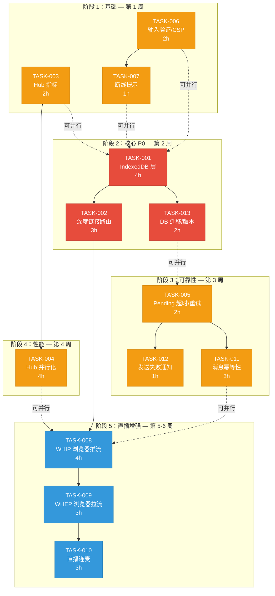

现在我已经拥有全面的事实依据。下面是我的技术主管分析：

---

# 技术主管分析：Aero IM Web SPA + Hub 架构差距

## 0. 执行摘要

交叉验证报告识别了 5 个需要修复的方向，总体事实准确率约 85%。**两个 P0 问题（状态持久化、深度链接）是产品化的硬阻塞——除非解决，否则应用程序无法脱离「调试工具」状态。** 两个 P1 问题是规模扩展和质量瓶颈。一个 P2 方向（直播/通话）部分基于错误数据（屏幕共享已实现），但仍存在实际差距。

**总体工作量估计**：2 名全职工程师约 4-6 周。

---

## 1. 任务分解

### TASK-001：Web SPA 状态持久化 — IndexedDB 层（P0）
| 字段 | 内容 |
|---|---|
| **方向** | 方向二（状态持久化） |
| **涉及文件** | `web/db.js`（新文件），`web/context.js`，`web/app.js`，`web/ws.js` |
| **前置依赖** | 无 |
| **预估工时** | 4 小时 |
| **验收标准** | ① 在 `db.js` 中新增 IndexedDB 封装器，包含 `openDb()` / `saveState()` / `loadState()` / `clearState()`；② 存储 `me`、`rooms`、`unreadByRoom`、`receiptsByRoom`、`lastEditAt`；③ 页面加载时（app.js 引导前）恢复；④ 关键状态变更（`switchRoom` 后 `messagesByRoom`、连接断开后 `_lastSeen`）时写入；⑤ 登出时清除；⑥ 在 Chrome DevTools Application > IndexedDB 中可验证 |

### TASK-002：深度链接/路由基础设施（P0）
| 字段 | 内容 |
|---|---|
| **方向** | 方向三（深度链接） |
| **涉及文件** | `web/router.js`（新文件），`web/index.html`，`web/app.js`，`web/context.js` |
| **前置依赖** | TASK-001（状态恢复） |
| **预估工时** | 3 小时 |
| **验收标准** | ① 在 `router.js` 中新增 `pushRoute(roomId)` / `getRoute()` / `onRouteChange()`，使用 `history.pushState` + `popstate`；② 路由格式 `#/room/{roomId}` 用于房间，`#/stream/{streamId}` 用于直播；③ `switchRoom()` 调用 `pushRoute()`；④ 页面加载时解析路由并激活正确视图；⑤ 通知点击导航到正确房间；⑥ 浏览器前进/后退按钮正常工作 |

### TASK-003：Hub 扇出性能指标与可观测性（P1）
| 字段 | 内容 |
|---|---|
| **方向** | 方向一（Hub 扇出瓶颈） |
| **涉及文件** | `crates/aero-server/src/hub.rs`，`crates/aero-common/src/metrics.rs` |
| **前置依赖** | 无 |
| **预估工时** | 2 小时 |
| **验收标准** | ① 在 `fan_out_arc_inner` 中新增 `FAN_OUT_DURATION` 直方图 metric，按房间大小分桶（`<10`/`10-99`/`100-999`/`1000+`）；② 新增 `FAN_OUT_RECIPIENTS` 直方图；③ 新增 `FAN_OUT_QUEUE_FULL` 计数器（drop-only 模式）；④ 在 `/metrics` endpoint 可查询；⑤ 负载测试时观察到完整的时间序列数据 |

### TASK-004：Hub 扇出并行化（P1）
| 字段 | 内容 |
|---|---|
| **方向** | 方向一（Hub 扇出瓶颈） |
| **涉及文件** | `crates/aero-server/src/hub.rs`，`crates/aero-server/Cargo.toml` |
| **前置依赖** | TASK-003（先测量基线） |
| **预估工时** | 4 小时 |
| **验收标准** | ① 当 `recipients.len() > 100` 时，分批并行扇出（使用 `tokio::spawn` 或 `rayon`）；② 每批最多 50 个 pid；③ 串行保证同一 pid 的所有设备始终在同一批处理；④ 注释更新反映实际行为；⑤ 基准测试显示 ≥30% 的大房间延迟改善；⑥ 压力测试中无死锁或数据竞争 |

### TASK-005：Web SPA pending 消息超时与重试（P1）
| 字段 | 内容 |
|---|---|
| **方向** | 方向四（错误处理） |
| **涉及文件** | `web/app.js`，`web/ws.js` |
| **前置依赖** | 无 |
| **预估工时** | 2 小时 |
| **验收标准** | ① `ws.send()` 新增返回 Promise 的重载 `sendAsync(obj, timeoutMs=5000)`；② `optimisticAdd` 调用 `sendAsync`；③ 超时时：在 pending 消息上显示错误状态（红色感叹号+「发送失败，点击重试」）；④ 重试按钮清除 pending 后重新调用 `sendMessage`；⑤ 服务端 websocket 关闭或 `send()` 返回 `false` 时立即触发超时；⑥ 不阻止后续消息（非阻塞） |

### TASK-006：Web SPA 输入验证安全检查（P1）
| 字段 | 内容 |
|---|---|
| **方向** | 方向四（输入验证） |
| **涉及文件** | `web/index.html`，`web/app.js`，`web/search.js`，`web/api.js` |
| **前置依赖** | 无 |
| **预估工时** | 2 小时 |
| **验收标准** | ① 新增 `<meta http-equiv="Content-Security-Policy" content="default-src 'self'; script-src 'self' https://cdn.jsdelivr.net; ...">` 到 `index.html`；② `composerInput` 新增 `maxlength="40000"`；③ 搜索输入 `maxlength="200"`；④ 房间创建名称 `maxlength="128"`；⑤ 所有文本输入 `trim()` 提交前；⑥ 所有 5 个 `.catch(() => {})` 用有意义的错误处理替换（至少 `console.error` + 可选 toast）；⑦ 用工具主动验证 CSP |

### TASK-007：Web SPA 断线状态提示（P1）
| 字段 | 内容 |
|---|---|
| **方向** | 方向四（错误处理） |
| **涉及文件** | `web/ws.js`，`web/app.js`，`web/style.css` |
| **前置依赖** | 无 |
| **预估工时** | 1 小时 |
| **验收标准** | ① `ws._emit('status', 'down')` 时：在 composer 上显示横幅「已断开连接 — 正在重新连接…」；② `status: 'up'` 时自动隐藏；③ `status: 'wait'` 时显示「X 秒后重试」；④ 断线期间发送按钮禁用；⑤ 所有样式通过 `ws-dot` 状态指示器（已存在）保持一致 |

### TASK-008：浏览器端 WHIP 推流（P2）
| 字段 | 内容 |
|---|---|
| **方向** | 方向五（直播/通话） |
| **涉及文件** | `web/live.js`（新文件或现有逻辑扩展），`index.html`，`web/app.js` |
| **前置依赖** | TASK-002（路由，用于正确的 stream URL 导航） |
| **预估工时** | 4 小时 |
| **验收标准** | ① 用户选择「WHIP」协议后，浏览器通过 `getUserMedia` 获取摄像头/麦克风流；② 创建 `RTCPeerConnection`；③ 创建 SDP offer；④ 通过 `POST /api/whip/{stream_id}` 发送；⑤ 设置远程 SDP answer（包含 str0m 的 ICE 候选）；⑥ 流发送时显示本地预览；⑦ 「停止推流」按钮；⑧ 支持 Simulcast 编码（`RTCRtpSender.setParameters` with `encodings`） |

### TASK-009：浏览器端 WHEP 拉流（P2）
| 字段 | 内容 |
|---|---|
| **方向** | 方向五（直播/通话） |
| **涉及文件** | `web/live.js`，`index.html`，`web/player.js`（新文件） |
| **前置依赖** | TASK-008（WHIP 实现共享 ICE/STUN 配置基础设施） |
| **预估工时** | 3 小时 |
| **验收标准** | ① 在直播卡片中添加「低延迟」按钮（HLS 旁的替代方案）；② 点击后创建 `RTCPeerConnection`；③ 通过 `POST /api/whep/{stream_id}` 发送 SDP offer；④ 设置远程 SDP answer；⑤ 渲染远程视频轨道到 `video` 元素；⑥ 当流停止或连接失败时优雅降级到 HLS |

### TASK-010：直播连麦/互动推流（P2）
| 字段 | 内容 |
|---|---|
| **方向** | 方向五（直播/通话） |
| **涉及文件** | `web/live.js`，`web/calls.js`（共享的 WebRTC 基础设施） |
| **前置依赖** | TASK-008（WHIP 推流）、TASK-009（WHEP 拉流） |
| **预估工时** | 3 小时 |
| **验收标准** | ① 直播卡片中的「连线」按钮；② 主播点击后创建到 WHIP endpoint 的第二个 `RTCPeerConnection` 用于观众反馈视频；③ 观众侧：连接受邀后，在流卡中显示音频+视频元素；④ 使用 SFU 的 Simulcast 订阅能力；⑤ 正常工作负载下延迟 <2s |

### TASK-011：消息发送幂等性（P1）
| 字段 | 内容 |
|---|---|
| **方向** | 方向四（错误处理） |
| **涉及文件** | `web/ws.js`，`web/app.js`，`crates/aero-im-core/src/service/messages.rs` |
| **前置依赖** | TASK-005（pending 超时） |
| **预估工时** | 3 小时 |
| **验收标准** | ① `sendMessage` WS 帧新增可选的 `nonce`（UUID v4）字段；② Web 客户端在 `optimisticAdd` 时生成并包含一个 nonce；③ 服务端在消息插入前检查 `nonce` 唯一性（`ON CONFLICT DO NOTHING`）；④ 重复 nonce 返回现有消息而非插入重复；⑤ 幂等键在 5 分钟后过期 |

### TASK-012：WebSockets WS 发送失败用户通知（P1）
| 字段 | 内容 |
|---|---|
| **方向** | 方向四（错误处理） |
| **涉及文件** | `web/ws.js`，`web/app.js` |
| **前置依赖** | TASK-005（pending 超时） |
| **预估工时** | 1 小时 |
| **验收标准** | ① `ws.send()` 返回 `false` 时，调用一个回调 `this._emit('send_failed', obj)`；② app.js 监听 `send_failed` 事件 → 找到匹配的 pending 消息 → 标记为失败状态；③ 失败消息显示「未发送—点击重试」UI；④ 成功发送后清除失败标记 |

### TASK-013：IndexedDB 数据迁移与版本管理（P0）
| 字段 | 内容 |
|---|---|
| **方向** | 方向二（状态持久化） |
| **涉及文件** | `web/db.js`，`web/context.js` |
| **前置依赖** | TASK-001（IndexedDB 层） |
| **预估工时** | 2 小时 |
| **验收标准** | ① IndexedDB 模式版本管理（`onupgradeneeded` 事件）；② 处理 `me` 和 `rooms` 模式变更；③ 损坏数据库优雅恢复（`deleteDatabase` + 重新创建）；④ 存储配额错误处理（`QuotaExceededError` → 清除旧数据后重试）；⑤ 自动从 IndexedDB 恢复时使用 stale-while-revalidate 策略（显示缓存+后台刷新） |

---

## 2. 执行顺序



### 可并行执行的任务组

| 并行组 | 任务 | 理由 |
|--------|------|------|
| **组 A**（前端基础） | TASK-001 + TASK-006 + TASK-007 | 无共享状态；IndexedDB、CSP/输入验证、断线提示互不依赖 |
| **组 B**（前端核心） | TASK-002 + TASK-005 | 路由不依赖 pending 超时，反之亦然；在 db.js 之上互不依赖 |
| **组 C**（后端基础） | TASK-003 + TASK-004 | 必须先有指标才能基准测试并行化效果；时间上可以连续做 |
| **组 D**（错误处理） | TASK-011 + TASK-012 | 幂等性和失败通知通过 pending 状态关联，但可以并发实现 |
| **组 E**（直播） | TASK-008 + TASK-009 + TASK-010 | 严格串行图——WHIP → WHEP → 连麦按顺序 |

---

## 3. 技术风险

### 3.1 高风险项

| 风险 | 任务 | 描述 | 缓解策略 |
|------|------|------|---------|
| **IndexedDB 大小失控** | TASK-001, TASK-013 | `messagesByRoom` 可能包含数千条消息；IndexedDB 有源限制（通常 50MB-无限制） | 仅持久化未读计数、当前房间最后 100 条消息、收件箱状态。历史记录始终从服务端获取。LRU 驱逐策略 |
| **WebSocket 重连与 IndexedDB 恢复竞争** | TASK-001, TASK-007 | 页面加载时：IndexedDB 读取异步，WebSocket 连接同时发生。服务端消息可能在状态恢复前到达 | 实现「排队直到恢复」模式：WsClient 在 `_ready` 标志为 true 前缓冲传入消息。设置就绪：IndexedDB 恢复 → 状态初始化 → 释放缓冲 |
| **Hub 扇出并行化引入竞态** | TASK-004 | 多个 tokio task 同时写入同一 pid 的 `get_mut` 锁。虽然 DashMap 是 per-shard，但分批 + `try_send` 可能重排帧顺序 | 使用 `scope` 字段确保帧排序。批处理：`chunks(50)`，每个 pid 分组到同一批。或者：不要并行化 `try_send`（已经是非阻塞的），而是并行化 JSON 序列化（如果瓶颈在 `serde_json::to_string`） |
| **WHIP/WHEP 跨域限制** | TASK-008, TASK-009 | 浏览器安全策略可能阻止 `getDisplayMedia` 或 `RTCPeerConnection` 在非 HTTPS 或跨域场景工作 | 在 `config.example.toml` 中记录 HTTPS 要求。使用 `localhost` 做开发。STUN/TURN 服务器必须在 CSP 中配置 |

### 3.2 中等风险项

| 风险 | 任务 | 描述 | 缓解策略 |
|------|------|------|---------|
| **CSP 破坏现有 CDN 加载的脚本** | TASK-006 | hls.js 从 CDN 加载：`https://cdn.jsdelivr.net/npm/hls.js@1.5.18/dist/hls.min.js`。严格的 CSP 会阻止它 | 在 CSP 的 `script-src` 中显式允许 `https://cdn.jsdelivr.net`。使用 SRI（子资源完整性）哈希增强安全性 |
| **消息幂等性影响服务端写入路径** | TASK-011 | 所有消息插入路径需要 nonce 检查，增加每次写入的一个 SELECT | nonce 唯一性约束：DB 级别 `UNIQUE(nonce)` 提供保证。nonce 列上的索引。nonce 清理（5 分钟后删除）在现有留存 sweep 定时器中完成 |
| **深度链接与现有状态管理冲突** | TASK-002 | `popstate` 事件可能触发状态恢复，而现有 `switchRoom` 尚未准备好 | 使 `onRouteChange` 成为 `switchRoom` 之上的轻量级层：从路由解析 `roomId` → 调用 `switchRoom(roomId)` |

### 3.3 性能瓶颈

| 瓶颈 | 任务 | 当前状态 | 目标 | 策略 |
|------|------|---------|------|------|
| Hub 扇出延迟 @10K 用户 | TASK-004 | ~200ms 串行 try_send | <50ms | 分块并行化 + 批处理。可能也并行化 JSON 序列化 |
| IndexedDB 恢复时间 | TASK-001 | N/A（目前 0ms，无恢复） | <100ms | 限制持久化字段范围。使用 IndexedDB 事务 + `getAll()` 批量读取 |
| CSP 解析开销 | TASK-006 | N/A（目前无 CSP） | <5ms 页面加载影响 | CSP 策略使用 `report-uri` 或 `report-to` 先处于报告模式，而非强制执行 |

---

## 4. 资源评估

### 4.1 人员配置

| 角色 | 数量 | 专注领域 | 分配的任务 |
|------|------|---------|-----------|
| **高级前端工程师**（Web SPA） | 1 人 | ES2020 原生 JS、WebSocket、IndexedDB、WebRTC | TASK-001、TASK-002、TASK-006、TASK-007、TASK-013 |
| **全栈工程师**（后端 + 前端） | 1 人 | Rust、axum、tokio、DashMap、指标 | TASK-003、TASK-004、TASK-008、TASK-009、TASK-010 |
| **两人共同负责** | — | 端到端集成 | TASK-005、TASK-011、TASK-012（两端改动） |

**理想配置**：2 名工程师，其中 1 人侧重前端，1 人侧重后端/全栈。如果需要加速，可以增加第 3 名工程师并行做直播方向（TASK-008/009/010）。

### 4.2 关键里程碑

| 里程碑 | 时间 | 交付物 | 验收标准 |
|--------|------|--------|---------|
| **M1：Web 基础** | 第 1 周结束 | TASK-001、TASK-006、TASK-007、TASK-003 | 状态在刷新时持久化；CSP 生效；断线提示可见；Hub 指标可查询 |
| **M2：核心路由** | 第 2 周结束 | TASK-002、TASK-013 | URL 深度链接、浏览器导航、IndexedDB 模式迁移 |
| **M3：消息可靠性** | 第 3 周结束 | TASK-005、TASK-012、TASK-011 | Pending 超时、发送失败通知、nonce 幂等性 |
| **M4：性能** | 第 4 周结束 | TASK-004 | Hub 扇出并行化，基准测试 ≥30% 提升 |
| **M5：直播上线** | 第 6 周结束 | TASK-008、TASK-009、TASK-010 | 浏览器 WHIP 推流、WHEP 拉流、连麦 |

### 4.3 阻塞点与解决策略

| 阻塞点 | 影响 | 策略 |
|--------|------|------|
| **无真实 STUN/TURN 服务器** | WHIP/WHEP 在 NAT 后无法工作 | 发现即可：使用 Google 的公共 STUN（`stun:stun.l.google.com:19302`）。为生产部署文档化 COTURN 要求 |
| **无 IndexedDB 测试基础设施** | IndexedDB 逻辑手动测试脆弱 | 在单独的 spec 文件中隔离 IndexedDB 逻辑，使其可在浏览器控制台中手动测试。用 `fakeIndexedDB` 进行自动化测试（npm 包）不在讨论范围内，因为 SPA 零依赖 |
| **跨工作树/agent 环境并行开发协调** | 多个 agent 可能修改同一文件 | 严格的 git 工作树隔离（每 agent 一个）。共享接口通过契约协调（如 `db.js` 的 `export function` 签名）。参见 AGENTS.md §4.2 |

---

## 5. 质量保证

### 5.1 单元测试覆盖要求

| 任务 | 测试目标 | 策略 | 最低覆盖率 |
|------|---------|------|-----------|
| TASK-001 | `db.js` 的 IndexedDB 操作 | 浏览器控制台手动测试序列：写入→刷新→读取→清除。用 `IndexedDB` 的 `deleteDatabase` 重置 | 关键路径 100% |
| TASK-003 | `metrics.rs` 新增 metric | Rust 单元测试：直方图记录 + 断言 verify | 100% |
| TASK-004 | `hub.rs` 并行扇出 | Rust 测试：模拟 200 个接收者，验证所有收到帧 + 顺序正确 | 核心逻辑 100% |
| TASK-011 | 服务端 nonce 幂等性 | Rust 集成测试：同一 nonce 发送两次 → 第二条返回相同 `message_id`，不插入新行 | 100% |
| TASK-005/012 | ws.js pending 超时 | 在 `sendAsync` 上 mock `setTimeout`。浏览器控制台验证 | 手动 |
| TASK-008/009/010 | WebRTC 连接 | 需要两个真实浏览器——写 E2E 测试用例，但 CI 中不运行（AGENTS.md §4.5） | E2E 场景描述 |

### 5.2 集成测试策略

| 场景 | 涉及任务 | 方法 | 工具 |
|------|---------|------|------|
| 完整登录→房间→消息→刷新→恢复 | TASK-001, TASK-002 | 手动浏览器测试：登录→进入房间→发送消息→刷新URL→验证状态 | Chrome DevTools |
| Hub 大房间扇出 | TASK-003, TASK-004 | 负载测试：curl 建立 ~500 个 WS 连接 + POST 消息 | 自定义 bash/python 脚本 + `/metrics` 验证 |
| WHIP/WHEP 浏览器推拉流 | TASK-008, TASK-009 | 2×浏览器测试：一个推流，一个拉流 | OBS(可选) + 浏览器 |
| 消息重试 + 断线 | TASK-005, TASK-012 | 手动：开发工具 → 网络 → 离线 → 发送消息 → 再次在线 → 验证重试 | Chrome DevTools Network 面板 |

### 5.3 代码审查要点

| 审查重点 | 相关任务 | 具体检查事项 |
|---------|---------|------------|
| **IndexedDB 无泄漏** | TASK-001, TASK-013 | 每个 `open` 有对应的 `close`；事务正确使用；无孤立存储事件监听器 |
| **无恢复竞态** | TASK-001, TASK-007 | IndexedDB 恢复完成前不处理 WS 消息；`_ready` 标志使用正确 |
| **路由无状态丢失** | TASK-002 | `popstate` 事件触发全状态恢复；无僵尸 DOM 状态 |
| **扇出排序正确** | TASK-004 | 同一 pid 的所有帧保持顺序；`Arc<String>` 共享无额外序列化 |
| **CSP 无过度限制** | TASK-006 | CDN 脚本、WebSocket `ws://localhost`、`getUserMedia` 被允许；内联脚本使用 `nonce` 或 `'unsafe-inline'`（仅在开发时） |
| **Nonce 无泄漏** | TASK-011 | nonce 生成在客户端完成（crypto.randomUUID）；服务端仅做唯一性检查 |

### 5.4 性能测试需求

| 测试 | 相关任务 | 负载 | 目标 | 工具 |
|------|---------|------|------|------|
| Hub 扇出延迟 | TASK-003, TASK-004 | 1000/5000/10000 个接收者，每个 2 个设备 | P99 < 100ms（当前 ~200ms 串行） | `/metrics` 直方图 + 脚本 |
| 消息吞吐量 | TASK-004 | 1000 条消息/秒，平均房间 50 人 | 无背压，CPU < 50% | `wrk` + 内部 timer |
| SPA 启动时间 | TASK-001, TASK-013 | 首次加载 + 恢复 500 条消息缓存 | < 500ms 到交互 | Chrome DevTools Performance |
| WHIP 推流延迟 | TASK-008 | 实时推流 1 小时 | 端到端 < 2s | OBS 计时 + HLS.js 播放器计时 |

---

## 6. 实施计划

### 时间线总览

```
周 1    周 2    周 3    周 4    周 5    周 6
├───────┼───────┼───────┼───────┼───────┼───────┤
│ 基础    │ 核心 P0  │ 可靠性  │ 性能    │ 直播    │ 直播    │
│        │        │        │        │        │ 收尾    │
```

### 阶段 1：基础设施搭建（第 1 周 — 3 天）

**工程师 A（前端）**：
- 第 1-2 天：TASK-001（IndexedDB 层）——核心 CRUD 操作
- 第 3 天：TASK-006（CSP + 输入验证）——包括修复 5 个 `.catch(() => {})`

**工程师 B（后端）**：
- 第 1 天：TASK-003（Hub 指标）——添加仪表 + 度量
- 第 2-3 天：TASK-004 开始（Hub 并行化设计 + 基准测试）

**产出**：页面刷新后状态持久化；CSP 生效；Hub 可观测性已上线。

### 阶段 2：核心功能实现（第 2 周 — 5 天）

**工程师 A（前端）**：
- 第 1-2 天：TASK-002（深度链接路由）
- 第 3 天：TASK-013（IndexedDB 迁移 + 版本管理）
- 第 4-5 天：TASK-005（pending 超时/重试）

**工程师 B（后端）**：
- 第 1-2 天：TASK-004 完成（Hub 并行化实施 + 测试）
- 第 3-4 天：TASK-011（服务端 nonce 幂等性）
- 第 5 天：与 A 集成测试消息重试端到端

**产出**：URL 深度链接工作；消息发送超时 + 重试；Hub 并行化上线。

### 阶段 3：集成测试和优化（第 3 周 — 4 天）

**两人共同**：
- 第 1 天：TASK-012（发送失败 UI 通知）——A 主导
- 第 2-3 天：TASK-007（断线提示）——A 主导，B 审查
- 第 4 天：集成测试 + 修复：完整流程（登录→发消息→kill 服务端→恢复→验证状态）

**产出**：断线时用户可见反馈；消息失败有通知。

### 阶段 4：直播增强（第 4-6 周 — 10 天）

**工程师 B（前端 + 全栈）**：
- 第 1-3 天：TASK-008（WHIP 浏览器推流）
- 第 4-6 天：TASK-009（WHEP 浏览器拉流）
- 第 7-9 天：TASK-010（连麦/互动推流）
- 第 10 天：E2E 测试 + 修复

**工程师 A（支持）**：
- 第 4-6 天：直播路由集成（TASK-002 的扩展）+ 直播 UI 组件
- 第 6-10 天：代码审查 + bug 修复 + 性能基准测试

**产出**：浏览器可以 WHIP 推流到服务端；其他浏览器可以通过 WHEP 或 HLS 观看；主播可以连麦观众。

---

## 7. 建议与风险缓解

### 7.1 按优先级排序的早期行动方案

1. **立即做（本周）**：TASK-006 中的 CSP —— 最安全的变更，没有副作用，影响最广
2. **第 1 天**：TASK-001 中的 IndexedDB 层 —— 解锁所有前端状态改进
3. **第 2 天**：TASK-003 中的 Hub 指标 —— 在优化前提供数据驱动作决策

### 7.2 「不要做」事项

- **不要重写 SPA 框架**：原生 JS + ESM 工作且符合项目约束。IndexedDB 抽象应保持 ≤200 行
- **不要在 Hub 中过度设计并行化**：`try_send` 已经很快（微秒级）。瓶颈在 DashMap 写锁争用。先测量，再优化
- **不要在直播方向做完整 Mesh SFU**：服务端 str0m SFU 已经存在。浏览器只需要基本的 `RTCPeerConnection` 客户端。不要重新实现 SFU 逻辑

### 7.3 未实现的优化机会（范围外，但值得注意）

- **Web Worker 中的 IndexedDB**：将 DB I/O 移出主线程。收益低（IndexedDB 已经是异步的），但有额外复杂性
- **Service Worker 离线缓存**：对于完整的 PWA 支持，但范围外。值得在版本 2 中考虑
- **WebAssembly 中的消息序列化**：对于大型消息负载，但当前的 `serde_json` 已经足够快

---

## 附录 A ：交叉验证报告勘误表

对原始报告的勘误，作为分析基础：

| # | 方向 | 原始声明 | 事实 | 影响 |
|---|------|---------|------|------|
| 1 | 方向五 | 屏幕共享「完全不存在」 | `calls.js` 有完整的 `toggleScreenShare()`（L226）和 `gcallToggleScreenShare()`（L538） | 低——不影响 P2 评级 |
| 2 | 方向四 | 「无确认回执」 | `pendingByTempId` + `handleIncomingMessage` 形成隐式确认 | 中——问题从「无确认」缩小为「无超时」 |
| 3 | 方向一 | 10000×1.5 设备 = 15000 次迭代「100-500ms」 | bounded mpsc 使 try_send 约 50-200ms | 中——严重度略低，但并行化需求不变 |
| 4 | 方向一 | 注释声称并行化但不存在 | ✅ 确认正确 | — |
