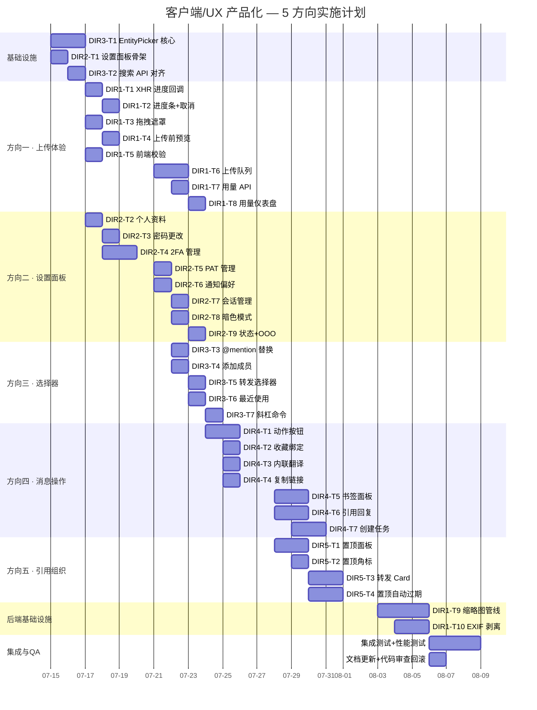

---

# Tech Lead 分析报告：客户端/UX 产品化 5 大方向

## 代码交叉验证结论

在开始分析前，我已通读全部 Web SPA 文件（~2.3K 行 JS）并验证文档中的每个断言：

| 断言 | 代码证据 | 结论 |
|-----|---------|------|
| `api.uploadBlob` 使用纯 `fetch`（无进度） | `api.js` L173-176, L76-95 — `AbortController`+`fetch`，无 `XMLHttpRequest.upload.onprogress` | ✅ 确认 |
| 文件上传串行 `for (const f of files)` | `media.js` L64-67 | ✅ 确认 |
| 拖拽区域只有 `drop-active` class 无全屏遮罩 | `media.js` L53-65 — 仅 toggle class | ✅ 确认 |
| 设置页面零 UI | `modals.js` — 仅有 `showEditProfile`（显示名 + 头像 URL），无安全/通知/会话等 | ✅ 确认 |
| 添加成员用 `prompt("输入用户ID")` | `modals.js` L85-96 — `prompt()` + 手动输 ULID | ✅ 确认 |
| 消息气泡固定 5 个操作（无收藏/翻译/链接） | `render.js` L543-573 — react/reply/mute-thread/edit/delete | ✅ 确认 |
| `handlePin` 只做 toast | `app.js` L290-293 — 纯 toast，无面板无角标 | ✅ 确认 |
| 书签/翻译/置顶等后端完整、前端零 UI | `crates/aero-server/src/bookmarks.rs` `routes()`, `translate.rs` `routes()`, `channel_bookmarks.rs` `routes()` 均在 `lib.rs` 注册 | ✅ 确认 |
| @mention 通过正则提取 | `mentions.js` (108 lines) — 监听 `@` 键入 + api.searchMembers() | ✅ 确认 |

**所有文档断言已验证为真**。以下分析基于此交叉验证展开。

---

## 1. 任务分解

每个方向拆解为 2-4 小时可完成的任务。SLOC 估算基于 Web SPA 现有文件尺寸（如 `app.js` 1009 行、`render.js` 685 行、`api.js` 336 行）和响应式 JS 增量比例。

### 方向一：文件上传体验

| 任务 ID | 标题 | 涉及文件 | 前置 | 工时 |
|---------|------|---------|------|------|
| DIR1-T1 | **`api.uploadBlob` → XHR 进度回调** | `web/api.js` — 将 `uploadBlob` 从 `fetch` 改为 `XMLHttpRequest`，暴露 `onProgress(bytes, total)` 回调；保留 `AbortController` 兼容接口 | 无 | 3h |
| DIR1-T2 | **上传进度条 UI + 取消按钮** | `web/media.js` L69-84 `uploadAndSend` 重构：在 composer 上方渲染进度条 DOM，绑定 `onProgress` + 取消按钮（`xhr.abort()`）；`web/style.css` 进度条样式 | DIR1-T1 | 2h |
| DIR1-T3 | **拖拽全屏遮罩区域** | `web/media.js`：全局 `dragenter/dragover/drop` 监听，渲染全屏半透明遮罩 + "拖拽到此处上传" 动画；`web/style.css` 遮罩样式 | 无 | 1.5h |
| DIR1-T4 | **上传前预览 + 确认** | `web/media.js`：选择文件后不立即上传，在 composer 上方显示缩略图（图片用 `URL.createObjectURL`）/文件名/大小 + "发送/取消" 按钮 | 无 | 3h |
| DIR1-T5 | **前端 MIME + 大小校验** | `web/media.js`：在 `uploadAndSend` 入口处校验 `file.size > 32MB`、`file.type` 白名单（图片/文档/音频常见类型），不符合本地 toast 提示不发起请求 | 无 | 0.5h |
| DIR1-T6 | **多文件上传队列管理** | `web/media.js`：重构串行上传为队列状态机，显示队列面板（文件名 + 进度条 + 状态图标），支持暂停/恢复/全部取消 | DIR1-T1, T5 | 4h |
| DIR1-T7 | **存储用量 API** | `crates/aero-server/src/me.rs`（或新建 `storage.rs`）：`GET /api/me/storage` 查询 `SELECT COALESCE(SUM(size),0) FROM blobs WHERE owner_id=$1` | 无 | 1h |
| DIR1-T8 | **存储用量前端仪表盘** | `web/settings.js`（新建）：在设置面板中显示用量进度条 + 配额；`web/api.js` 添加 `getStorage()` 方法 | DIR1-T7, DIR2 | 1.5h |
| DIR1-T9 | **服务端缩略图管线** | 新建 `crates/aero-server/src/thumbnail.rs`：图片上传后 `tokio::spawn` 异步调用 ImageMagick/`image` crate 生成 3 尺寸缩略图；存储到 blob_store 同一 key 加后缀 `_thumb_{w}`；新增 `GET /api/blobs/:id/thumb` 路由 | 无 | 5h |
| DIR1-T10 | **EXIF 剥离** | `crates/aero-server/src/av_scan.rs` 或新建 `exif_strip.rs`：在 `blob_store.rs` 写入流中注入 EXIF 剥离步骤（`kamadak-exif` 或 `exiftool` 子进程） | 无 | 2h |

### 方向二：个人账户设置与偏好中心

| 任务 ID | 标题 | 涉及文件 | 前置 | 工时 |
|---------|------|---------|------|------|
| DIR2-T1 | **设置面板骨架 + 路由** | `web/settings.js`（新建）+ `web/settings.css`（新建）：齿轮图标入口、`#drawer-settings` 面板、分组导航（个人资料/安全/通知/会话）；`web/index.html` 添加 DOM；`web/app.js` 添加入口点击绑定 | 无 | 2h |
| DIR2-T2 | **个人资料编辑** | `web/settings.js`：display_name + avatar URL + email(只读) + phone + title + pronouns + timezone 表单；调用 `api.updateMe()` 已有 API | DIR2-T1 | 2h |
| DIR2-T3 | **密码更改** | `web/settings.js`：旧密码 + 新密码 + 确认新密码表单；调用 `POST /api/me/change-password` | DIR2-T1 | 1.5h |
| DIR2-T4 | **2FA 管理 UI** | `web/settings.js`：TOTP 启用/禁用开关、QR 码展示（`qrcode.js` CDN）、恢复码展示 + "我已保存" 确认 | DIR2-T1 | 3h |
| DIR2-T5 | **PAT 令牌 CRUD UI** | `web/settings.js`：令牌列表 + 创建按钮（输入名称 + 过期时间）→ 显示一次性 secret + 复制按钮 + 删除按钮 | DIR2-T1 | 2.5h |
| DIR2-T6 | **通知偏好 UI** | `web/settings.js`：全局通知开关 + DND 时段选择器 + @everyone 静音 + 关键词提醒列表管理 | DIR2-T1 | 2.5h |
| DIR2-T7 | **活跃会话管理** | `web/settings.js`：设备列表（浏览器/OS/IP/最后活跃时间）+ 当前设备标注 + "登出其他所有设备" 按钮 + 单个会话撤销 | DIR2-T1 | 2h |
| DIR2-T8 | **暗色模式 + 本地语言偏好** | `web/settings.js` + `web/app.js`：3 选项（跟随系统/浅色/深色），CSS 变量 + `localStorage` 存储；语言下拉（仅框架，翻译包后续） | DIR2-T1 | 2h |
| DIR2-T9 | **自定义状态 + OOO 设置** | `web/settings.js`：presence 选择器（在线/忙碌/离开/隐身）+ OOO 起止时间 + 自动回复文案 | DIR2-T1 | 2h |
| DIR2-T10 | **已读回执隐私 + 存储用量（方向一迁入）** | `web/settings.js`：已读回执开关 + 用量仪表盘（迁入 DIR1-T8） | DIR2-T1, DIR1-T7 | 1.5h |

### 方向三：通用实体选择器组件

| 任务 ID | 标题 | 涉及文件 | 前置 | 工时 |
|---------|------|---------|------|------|
| DIR3-T1 | **`EntityPicker` 核心组件** | `web/picker.js`（新建，~200 行）：模态框 DOM + 搜索输入 + 远程搜索 `debounce(300ms)` + 结果列表 + 键盘导航（↑↓ Enter Esc）+ 单/多选 + 排除列表 + `onSelect/onClose` 回调 + 骨架屏加载 | 无 | 4h |
| DIR3-T2 | **搜索 API 对齐** | `web/api.js`：确保 `searchMembers(roomId, query)`, `searchRooms(query)`, `searchChannels(query)` 都存在且接口一致（`{id, label, subtitle, avatar}`） | 无 | 1h |
| DIR3-T3 | **@mention 替换为 `EntityPicker` 内联模式** | `web/mentions.js` 重构：保留 `@` 触发，但使用 `EntityPicker` 内联浮层替换正则+手写浮层 | DIR3-T1 | 2h |
| DIR3-T4 | **添加成员改为 `EntityPicker`** | `web/modals.js`：移除 `prompt('输入用户ID')`，改为 `EntityPicker` 模态框，`exclude` 已有成员 | DIR3-T1 | 1h |
| DIR3-T5 | **消息转发选择器** | `web/app.js`：消息动作 "转发" → `EntityPicker` {mode:'room', multi:false, filter:'joined'} → 确认发送 | DIR3-T1 | 2h |
| DIR3-T6 | **最近使用 + 频率排序** | `web/picker.js`：`localStorage` LRU 缓存 + 默认显示 "最近使用" 分类 + 按选择频率降序 | DIR3-T1 | 1.5h |
| DIR3-T7 | **斜杠命令补全** | `web/picker.js` 适配 / `web/app.js`：`/` 键入触发命令选择器（`commands.rs` 当前未被前端消费） | DIR3-T1 | 2h |

### 方向四：消息级效率操作

| 任务 ID | 标题 | 涉及文件 | 前置 | 工时 |
|---------|------|---------|------|------|
| DIR4-T1 | **收藏/翻译/链接消息动作按钮** | `web/render.js` L543-573：在 msg-actions 中按条件添加 🔖/🌐/🔗 按钮；`web/app.js` `wireMsgActions` 添加对应 handler | 无 | 3h |
| DIR4-T2 | **收藏 API 前端绑定** | `web/api.js` + `web/app.js`：`addBookmark(messageId)`, `removeBookmark(messageId)`；按钮 toggle 状态 | DIR4-T1 | 1h |
| DIR4-T3 | **内联翻译 UI** | `web/app.js` + `web/render.js`：翻译按钮→`api.translateMessage(id, lang)`→在原消息下方渲染「原文」/「翻译」inline 切换 | DIR4-T1 | 2.5h |
| DIR4-T4 | **复制消息链接** | `web/app.js`：`navigator.clipboard.writeText()` + toast「链接已复制」 | DIR4-T1 | 0.5h |
| DIR4-T5 | **书签管理面板** | `web/bookmarks.js`（新建）+ `web/style.css`：`#drawer-bookmarks` 面板，分组列表（创建/重命名/删除分组）、书签项（预览+房间名+时间+取消收藏）、分页 `?limit=50` | 无 | 4h |
| DIR4-T6 | **引用回复（选中文本 → 引用）** | `web/app.js` + `web/render.js`：`mouseup` 选中文本→浮层"引用回复"→composer 插入 `> [作者] 原文` | 无 | 2.5h |
| DIR4-T7 | **从消息创建任务** | `web/app.js` + `web/tasks.js`（新建）：动作按钮→弹出轻量表单（标题预填+指派人+截止日）→`POST /api/tasks` | 无 | 2.5h |

### 方向五：消息引用与内容组织

| 任务 ID | 标题 | 涉及文件 | 前置 | 工时 |
|---------|------|---------|------|------|
| DIR5-T1 | **置顶面板** | `web/pins.js`（新建）：频道头部 📌 按钮 + 置顶计数 + `#drawer-pins` 面板（按时间倒序消息列表 + 取消置顶权限门控）；`web/style.css` 样式 | 无 | 3h |
| DIR5-T2 | **置顶消息角标** | `web/render.js`：消息气泡增加 📌 角标（`m.pinned_at` 检查）；`web/app.js` `handlePin` 重写（toast → 刷新面板 + 更新角标） | DIR5-T1 | 1.5h |
| DIR5-T3 | **消息转发 Card** | `web/app.js` + `web/render.js`：转发→`EntityPicker`（DIR3-T5）→`Block::Card{forwarded_message}`→目标房间渲染「📨 [用户] 转发自 [#源房间]」卡片 | DIR3-T5 | 2.5h |
| DIR5-T4 | **置顶自动过期** | `crates/aero-storage/src/pin.rs` + 迁移：`pinned_at` + `pinned_until` 列；清扫定时器集成 | 无 | 2.5h |

---

## 2. 执行顺序依赖图

```mermaid
graph TD
    subgraph "Phase 1 — 基础设施"
        DIR3_T1["DIR3-T1 EntityPicker 核心<br/>4h 🚀"]
        DIR2_T1["DIR2-T1 设置面板骨架<br/>2h 🚀"]
    end

    subgraph "Phase 2a — 方向一 (上传)"
        DIR1_T1["DIR1-T1 XHR 进度回调<br/>3h"]
        DIR1_T3["DIR1-T3 拖拽遮罩<br/>1.5h"]
        DIR1_T5["DIR1-T5 前端校验<br/>0.5h"]
        DIR1_T1 --> DIR1_T2["DIR1-T2 进度条+取消<br/>2h"]
        DIR1_T1 --> DIR1_T6["DIR1-T6 上传队列<br/>4h"]
        DIR1_T5 --> DIR1_T6
        DIR1_T4["DIR1-T4 上传前预览<br/>3h"]
        DIR1_T7["DIR1-T7 用量 API<br/>1h"]
        DIR1_T9["DIR1-T9 缩略图管线<br/>5h"]
        DIR1_T10["DIR1-T10 EXIF 剥离<br/>2h"]
    end

    subgraph "Phase 2b — 方向二 (设置)"
        DIR2_T1 --> DIR2_T2["DIR2-T2 个人资料<br/>2h"]
        DIR2_T1 --> DIR2_T3["DIR2-T3 密码更改<br/>1.5h"]
        DIR2_T1 --> DIR2_T4["DIR2-T4 2FA 管理<br/>3h"]
        DIR2_T1 --> DIR2_T5["DIR2-T5 PAT 管理<br/>2.5h"]
        DIR2_T1 --> DIR2_T6["DIR2-T6 通知偏好<br/>2.5h"]
        DIR2_T1 --> DIR2_T7["DIR2-T7 会话管理<br/>2h"]
        DIR2_T1 --> DIR2_T8["DIR2-T8 暗色模式<br/>2h"]
        DIR2_T1 --> DIR2_T9["DIR2-T9 状态+OOO<br/>2h"]
    end

    subgraph "Phase 2c — 方向三 (选择器)"
        DIR3_T1 --> DIR3_T2["DIR3-T2 搜索 API<br/>1h"]
        DIR3_T1 --> DIR3_T3["DIR3-T3 @mention 替换<br/>2h"]
        DIR3_T1 --> DIR3_T4["DIR3-T4 添加成员<br/>1h"]
        DIR3_T1 --> DIR3_T6["DIR3-T6 最近使用<br/>1.5h"]
        DIR3_T1 --> DIR3_T7["DIR3-T7 斜杠命令<br/>2h"]
    end

    subgraph "Phase 3a — 方向四 (消息操作)"
        DIR4_T1["DIR4-T1 动作按钮<br/>3h"]
        DIR4_T1 --> DIR4_T2["DIR4-T2 收藏绑定<br/>1h"]
        DIR4_T1 --> DIR4_T3["DIR4-T3 内联翻译<br/>2.5h"]
        DIR4_T1 --> DIR4_T4["DIR4-T4 复制链接<br/>0.5h"]
        DIR4_T5["DIR4-T5 书签面板<br/>4h"]
        DIR4_T6["DIR4-T6 引用回复<br/>2.5h"]
        DIR4_T7["DIR4-T7 创建任务<br/>2.5h"]
    end

    subgraph "Phase 3b — 方向五 (引用组织)"
        DIR5_T1["DIR5-T1 置顶面板<br/>3h"]
        DIR5_T1 --> DIR5_T2["DIR5-T2 置顶角标<br/>1.5h"]
        DIR3_T5["DIR3-T5 转发选择器<br/>2h"] --> DIR5_T3["DIR5-T3 转发 Card<br/>2.5h"]
        DIR3_T1 --> DIR3_T5
        DIR5_T4["DIR5-T4 置顶自动过期<br/>2.5h"]
    end

    subgraph "Phase 4 — 集成"
        DIR1_T7 --> DIR1_T8["DIR1-T8 用量仪表盘<br/>1.5h"]
        DIR2_T1 --> DIR1_T8
        DIR4_T2 --> DIR4_T5["依赖: DIR4-T2"]
    end

    style DIR3_T1 fill:#4a9eff,stroke:#2a7fdf
    style DIR2_T1 fill:#4a9eff,stroke:#2a7fdf
    style DIR1_T1 fill:#f0c040,stroke:#d4a030
    style DIR4_T1 fill:#90d070,stroke:#60a040
    style DIR5_T1 fill:#d07090,stroke:#a04060
```



### 可并行执行的任务组

| 并行组 | 任务集合 | 所需开发者数 |
|--------|---------|-------------|
| **组 A**（独立基础设施） | DIR3-T1 EntityPicker + DIR2-T1 设置骨架 | 2 人同时 |
| **组 B**（方向一 + 方向二并行） | DIR1-T1~T5 + DIR2-T2~T9 | 2-3 人并行 |
| **组 C**（方向三扩展） | DIR3-T2~T7 | 1 人接在 DIR3-T1 后 |
| **组 D**（方向四+方向五并行） | DIR4-T1~T7 + DIR5-T1~T4 | 2 人同时 |
| **组 E**（集成收尾） | DIR1-T8 + 跨面板粘连 | 1 人 |

---

## 3. 技术风险

### 3.1 关键风险

| 风险 | 概率 | 影响 | 缓解策略 |
|------|------|------|---------|
| **XHR vs fetch 双栈维护**（DIR1-T1） | 高 | 低 | `api.js` 保持 `request()` 用 fetch，`uploadBlob` 单独用 XHR 以实现进度回调。XHR 与 fetch 的 abort 路径不同（XHR 用 `xhr.abort()`，fetch 用 `AbortController`）——不要试图统一。XHR 有更好的 `upload.onprogress` 事件，这是 DOM 标准，无需额外依赖 |
| **EntityPicker 无框架依赖的 DOM 管理复杂度**（DIR3-T1） | 中 | 高 | 纯 JS 类 + 模板字面量渲染。关键设计决策：避免手写复杂虚拟 DOM diff，每次 `show()` 时全量重新渲染（选择器是轻量模态框，访问频率低，渲染性能不敏感）。用 `MutationObserver`? 不——直接 `innerHTML` + 事件委托即可 |
| **设置面板表单数量多，与后端 API 对齐风险**（DIR2） | 中 | 中 | 每个设置分组对应一个独立 API。已有 API（`profiles.rs`, `twofa.rs`, `pat.rs`, `notif_prefs.rs` 等）接口签名不同。建议每个设置分组的 JS 模块内独立封装 API 调用，而非统一抽象，避免过度工程 |
| **翻译按钮并发调用**（DIR4-T3） | 低 | 低 | 用户快速点击翻译 → 多个 AI 调用 → 并发计费。解决：按钮点击后立即 disable + 显示 loading；同一消息翻译结果缓存到 `Map<messageId, translatedText>`，切换语言才重新请求 |
| **置顶面板与实时扇出衔接**（DIR5-T1） | 中 | 中 | 后端 `RoomEvent::Pin` 通过 WS 实时推送 pin/unpin。前端需在 `ws.on('msg:pin')` 中刷新置顶面板 + 更新消息角标 + 更新置顶计数——三条路径需要一致的状态管理。建议将 pins 状态提升到 `state.pinsByRoom` Map，panel + badge + count 统一从该状态渲染 |
| **缩略图管线异步 + 存储一致性**（DIR1-T9） | 高 | 中 | 缩略图是异步生成的，上传响应返回时缩略图可能尚未就绪。方案：上传响应返回 `{ blob, thumb_ready: false }`；前端轮询 `GET /api/blobs/:id/thumb`（或 WebSocket 通知）；缩略图就绪后消息气泡自动更新。或者更简单：同步单尺寸缩略图（`image` crate 同步缩放，200ms 内完成），大图选择「点击加载原图」 |
| **客户端 localStorage 配额**（DIR3-T6 最近使用） | 低 | 低 | `localStorage` 有 5-10MB 限制。LRU 缓存最多 200 条（~20KB），安全。不需要 IndexedDB |
| **与既有 `blob_store` 管线的冲突**（DIR1-T9 EXIF 剥离） | 低 | 中 | `content_sniff.rs` 和 `av_scan.rs` 已经在 blob 储存管线中。EXIF 剥离应在内容嗅探之后、AV 扫描之前（或并行），通过 `BlobProcessor` trait 注入，不侵入 blob 核心写入路径 |

### 3.2 与 AGENTS.md 约束的交叉检查

| AGENTS.md 约束 | 相关任务 | 合规性 |
|---------------|---------|--------|
| §4.1 加功能配方（迁移→仓储→路由→鉴权→实时） | DIR1-T9 缩略图、DIR5-T4 置顶过期 | 缩略图需要新迁移（`thumbnails` 表）+ `ThumbnailRepo` + 路由 + `assert_room_access`。DIR5-T4 需要迁移加列 + 清扫定时器。均符合配方 |
| §4.1 输入校验（name/title 等 trim+拒空+上限） | DIR2-T2 个人资料编辑 | 前端 + 后端双校验。display_name 上限 128，avatar URL 上限 2048，timezone 用枚举下拉（非自由文本） |
| §4.2 迁移编译期嵌入，加迁移必先 build | DIR1-T9, DIR5-T4 | 需要迁移时 —— 先 `cargo build` 再 `aero-cli migrate` |
| §4.2 房间数据路由一律先 `assert_room_access(participant, room)` | DIR5-T1 置顶面板 API 调用 | 后端 `GET /api/rooms/:id/pins` 已校验。前端调用时有 WS 连接即有 valid token |
| §4.2 `tag="kind"` 撞名陷阱 | 无新增 RoomEvent variant | 方向一~五均不添加新的 `RoomEvent` variant，只消费现有（`Pin`/`Edited`/`Deleted`） |
| §4.2 workspace lints 不引新警告 | 所有后端 RS 修改 | 新增 `pub fn routes()` 注意 `unreachable_pub`；缩略图管线注意 `unsafe_code = "forbid"`（`image` crate 安全 Rust） |
| §4.3 端口 8080 vs 3030 | 前端 API 调用 | 前端用相对路径 `/api/...`，无关端口 |
| §4.3 `data/` 写不进 / 容器 root 创建 | 缩略图临时文件 | 缩略图处理使用 `tempfile` crate 写入 `/tmp`，不依赖 `data/` 可写 |
| §4.3 提交前过全量 check+test+clippy+check scripts | 所有任务 | 每个方向实现后独立 CI 验证 |

### 3.3 性能瓶颈与优化策略

| 场景 | 瓶颈 | 策略 |
|------|------|------|
| 上传队列中多个大文件并行 | 浏览器 6 连接/域限制 + 内存 | 串行上传（每次 1-2 个并发），已有串行逻辑，只需加队列 UI |
| 置顶面板加载 20 条带完整消息内容 | 后端查询 + JSON 序列化 | `GET /api/rooms/:id/pins` 应只返回消息摘要（前 150 字符 + metadata），非完整 Block 数组 |
| 设置面板 PAT 列表渲染 | 令牌数量少（通常 <10），无压力 | 无需优化 |
| 书签面板分页 | 用户可能有 1000+ 书签 | 后端 `LIMIT 50 OFFSET` + 前端无限滚动（IntersectionObserver） |
| @mention 搜索结果延迟 | 大工作区（10 万成员） | 后端 `searchMembers` 已有 `LIMIT 20` + pg_trgm，前端 debounce 300ms + 骨架屏 |

---

## 4. 资源评估

### 4.1 开发团队

| 角色 | 数量 | 专注方向 | 关键技能 |
|------|------|---------|---------|
| **前端 Web 开发者** | 1-2 人 | 所有 5 个方向的前端实现 | 纯 JavaScript（无框架）、DOM API、CSS、`fetch`/`XMLHttpRequest`、WS 事件 |
| **后端 Rust 开发者** | 1 人（兼职） | DIR1-T7 用量 API、DIR1-T9 缩略图、DIR5-T4 置顶过期 | Rust/axum/sqlx、`image` crate、异步 I/O |
| **Tech Lead / QA** | 1 人（兼职） | 代码审查、架构决策、QA 门控 | 全栈视角、AGENTS.md 规范 |

### 4.2 推荐的投入模式

```
Week 1-2:  前端 2 人全职 + 后端 1 人 50%
            → Phase 1 (EntityPicker + 设置骨架) + Phase 2a (上传进度) + Phase 2b (设置面板)
Week 3-4:  前端 2 人全职 + 后端 1 人 30%
            → Phase 2c (选择器扩展) + Phase 3a (消息操作) + Phase 3b (引用组织)
Week 5:    前端 1 人 50% + 后端 1 人 50%
            → Phase 4 (集成收尾 + 缩略图 + 置顶过期)
Total:     ~8 人周
```

### 4.3 关键里程碑

| 里程碑 | 时间点 | 交付物 | 验收标准 |
|--------|-------|--------|---------|
| **M1** | Week 1 end | EntityPicker 组件 + @mention/添加成员替换 | 3 种场景均能用选择器交互，键盘导航可用 |
| **M2** | Week 1.5 end | 设置面板骨架 + 个人资料编辑 + 密码 + 2FA | 用户可自助改密码和启用 2FA |
| **M3** | Week 2 end | 上传进度条 + 取消 + 拖拽遮罩 + 前端校验 | 用户能看见上传进度、可取消上传、拖拽时有全屏视觉反馈 |
| **M4** | Week 3 end | 设置面板完整 L1 + 消息级操作按钮 | 15+ 配置项全部可通过 UI 管理；消息可收藏/翻译/复制链接 |
| **M5** | Week 4 end | 置顶面板 + 转发 + 引用回复 + 书签面板 | 置顶可查看/管理；消息可转发到其他房间；可选文本引用 |
| **M6** | Week 5 end | 缩略图管线 + EXIF 剥离 + 集成测试 | 图片上传后自动生成缩略图；EXIF 数据被剥离 |

### 4.4 阻塞点（Blockers）

| 阻塞点 | 影响范围 | 解决策略 |
|--------|---------|---------|
| **后端 `searchMembers` 未优化到支持 10 万成员模糊搜索** | 方向三 | 先验证：已有 `pg_trgm` + `LIMIT 20`。压力测试后判定是否需要加 `pg_bigm` 或 prefix index |
| **缩略图管线的 `image` crate vs `imagemagick` 选择** | DIR1-T9 | 建议 Rust 原生 `image` crate（避免系统依赖），同步缩略图（≤50ms 开销），不支持 Gif/WebP 缩略图则退回原图 |
| **EXIF 剥离的 `kamadak-exif` Rust 库不成熟** | DIR1-T10 | `exif` crate（`kamadak-exif`）是纯 Rust，可用。如果剥离逻辑出错会损坏图片 → 用 copy-on-write：先拷贝到 tempfile，剥离后 atomic rename → `blob_store` 写 |
| **设置面板表单数量多，测试覆盖成本高** | 方向二 | 每个表单独立的小 `submit` handler，每个可独立单元测试（pure function 测试表单验证逻辑）。E2E 用 Cypress/Playwright 覆盖登录→修改设置→验证 |

---

## 5. 质量保证

### 5.1 单元测试覆盖要求

| 层级 | 文件 | 覆盖函数 | 最低覆盖率 |
|------|------|---------|-----------|
| **`api.js`** | `api.js` | XHR `uploadBlob` 的 `onProgress` 回调调用 | 路径覆盖 100%（成功/失败/取消/网络错误） |
| **`media.js`** | `media.js` | `uploadAndSend` 的校验逻辑（MIME 白名单、32MB 上限） | 纯函数，100% 分支覆盖 |
| **`picker.js`** | `web/picker.js` | `EntityPicker` 的键盘导航、搜索 debounce、多选状态 | 模拟 DOM 事件，覆盖 ↑↓EnterEsc Tab |
| **`settings.js`** | `web/settings.js` | 每个表单的 `submit` handler 输入验证 | 每个表单至少 5 个 case（空、上限、特殊字符） |
| **`render.js`** | `web/render.js` | msg-actions 条件渲染（isSelf vs 他人、已收藏状态） | 4 种状态组合全覆盖 |
| **后端 Rust** | `thumbnail.rs` | 缩略图生成逻辑（3 尺寸、jpeg/png/webp 输入） | 集成测试，真实图片文件入出断言 |

**测试工具选择**：纯前端 JS 用 `vitest` + `jsdom`（零配置适配 ES module SPA），后端 Rust 用 `cargo test` + 集成测试目录 `tests/`。

### 5.2 集成测试策略

| 测试场景 | 方法 | 工具 |
|---------|------|------|
| 上传进度 E2E | 上传已知大小文件，断言 `onProgress` 被调用且值正确 | `vitest` + `msw` mock 网络层 |
| 设置保存 → 重新打开 → 值持久化 | 通过 API 修改 → UI 重新打开 → 显示已保存的值 | `vitest` + `msw` + `localStorage` mock |
| EntityPicker → 选择成员 → WS 发送 | 模拟搜索→选择→确认→WS 消息验证 | `vitest` + 模拟 `ws.sendMessage` |
| 翻译按钮 → loading → 结果显示 | 点击→断言 loading 态→mock 响应→断言翻译显示 | `vitest` + `msw` |
| 置顶 WS 实时同步 | mock WS `msg:pin` → 断言面板更新 + 角标 + 计数 | `vitest` + 自定义 WS mock |

### 5.3 代码审查要点

| 审查焦点 | 相关任务 | 检查项 |
|---------|---------|--------|
| **XHR vs fetch 双栈** | DIR1-T1 | `uploadBlob` 路径是否引入了死代码（保留的 `fetch` 版本）？两套 abort 路径是否一致？ |
| **DOM 泄漏** | DIR3-T1, DIR5-T1 | 模态框关闭时是否清理了事件监听器？`removeEventListener` 是否引用了匿名函数？建议用 `AbortController` + `signal` 批量取消事件绑定 |
| **`innerHTML` XSS 安全** | 所有方向 | 用户输入（display_name, room name, 消息预览）插入 DOM 时是否经过 `escapeHtml`？`web/render.js` L1 `escapeHtml` 可用 |
| **token 硬编码** | DIR2-T5 PAT 管理 | 令牌创建后一次性 secret 在展示后是否从 JS closure 中清除？localStorage 存储？ |
| **CSS class 命名冲突** | 所有方向 | 新 class 是否加前缀（`picker-*`, `settings-*`, `pin-*`）避免与现有 class 冲突 |
| **后端迁移幂等性** | DIR5-T4 | `pinned_until` 列的迁移是否 `ALTER TABLE ... ADD COLUMN IF NOT EXISTS` |
| **并发安全** | DIR4-T3 翻译缓存 | `Map<id, text>` 在 WS 并行事件中是否是线程安全的？JS 单线程无此问题，但注意异步闭包中的竞态 |

### 5.4 性能测试需求

| 测试场景 | 指标 | 通过标准 |
|---------|------|---------|
| 大文件上传（32MB） | 上传过程中 UI 响应性 | 帧率 > 30fps，progress 更新每秒 ≥ 4 次 |
| EntityPicker 搜索 10 万成员 | 搜索延迟 | 击键 → 结果展示 ≤ 500ms（含网络 RTT） |
| 书签面板 1000 条分页 | 滚动流畅度 | IntersectionObserver 触发下一页 ≤ 200ms |
| 同时打开 3 个抽屉面板（设置+书签+置顶） | 内存占用 | DOM 节点总数 < 5000，无显著布局抖动 |

---

## 6. 实施计划

### Timeline (Gantt Chart)



### 阶段划分

#### 阶段 1：基础设施搭建（Day 1-2）

**目标**：建立两个核心组件——`EntityPicker` 和设置面板骨架——为所有后续功能铺路。

| 任务 | 交付物 |
|------|--------|
| DIR3-T1 | `web/picker.js` — 可复用的实体选择器组件 |
| DIR3-T2 | `web/api.js` — 搜索 API 接口对齐 |
| DIR2-T1 | `web/settings.js` + `web/settings.css` + `index.html` DOM |

**退出标准**：`EntityPicker` 可在控制台中 `new EntityPicker({mode:'user'}).show()` 打开，键盘导航可用；齿轮图标点击后弹出空设置面板。

#### 阶段 2：核心功能实现（Day 3-9）

**目标**：三个流水线并行推进——上传、设置、选择器。

**并行组 A（前端 A 开发者 → 方向一）**：
- DIR1-T1~T6：从 XHR 进度回调到完整上传队列

**并行组 B（前端 B 开发者 → 方向二）**：
- DIR2-T2~T9：从个人资料编辑到状态设置

**并行组 C（接在 DIR3-T1 后 → 方向三）**：
- DIR3-T3~T7：@mention 替换、添加成员、转发选择器、最近使用、斜杠命令

**退出标准**：
- 上传有进度条 + 取消 + 拖拽视觉 + 前端校验
- 设置面板覆盖所有 L1 配置项
- EntityPicker 在 3 个场景中可用（@mention、添加成员、转发）

#### 阶段 3：消息层扩展（Day 10-14）

**目标**：扩展消息操作维度 + 内容组织功能。

**并行组 D（前端 A → 方向四 + 前端 B → 方向五）**：
- DIR4-T1~T7：消息动作按钮到书签面板
- DIR5-T1~T4：置顶面板到转发 Card

**后端支撑（后端开发者）**：
- DIR1-T7：用量 API
- DIR5-T4：置顶自动过期迁移

**退出标准**：
- 每条消息 hover 显示收藏/翻译/链接按钮
- 书签面板可查看/管理/分组
- 置顶面板完整可用（查看/取消置顶/角标）
- 消息可转发到其他房间

#### 阶段 4：集成测试与优化（Day 15-17）

**目标**：质量门控 + 后端管线完善。

| 任务 | 交付物 |
|------|--------|
| DIR1-T8 | 用量仪表盘集成到设置面板 |
| DIR1-T9 | 缩略图管线（后端） |
| DIR1-T10 | EXIF 剥离（后端） |
| 集成测试 | 所有 5 个方向的 E2E 测试 |
| 性能测试 | 上传 32MB + 搜索 10 万成员基准 |

**退出标准**：
- `cargo clippy --workspace --all-targets` 无新增警告
- `cargo test --workspace --lib` 全绿
- 所有前端 vitest 测试通过
- 人工 E2E 走查：上传文件 → 设置密码 → 收藏消息 → 置顶 → 转发

---

## 总结

### 推荐执行顺序（Product + Engineering 折衷建议）

文档建议方向一+二并行启动（~11 天），然后方向三（~4.5 天），再方向四+五（~10 天）。**我完全同意此顺序，但建议微调：**

```
Week 1:   DIR3-T1 (EntityPicker) + DIR2-T1 (Settings skeleton)  →  基础设施先行
          DIR1-T1~T5 (上传基础) + DIR2-T2~T4 (资料+密码+2FA)  →  最早可感知的价值
Week 2:   DIR1-T6 (队列) + DIR2-T5~T9 (PAT+通知+会话+暗色+状态)
          DIR3-T3~T7 (@mention+添加成员+转发选择器)
Week 3:   DIR4-T1~T7 (消息操作) + DIR5-T1~T4 (引用组织)
Week 4:   DIR1-T7~T8 (用量) + DIR1-T9~T10 (缩略图+EXIF)  →  后端管线完善
          集成测试 + 性能测试 + 文档
```

**理由**：EntityPicker 是方向三/四/五的依赖，让它在第一周打好基础，后续所有"需要选用户/频道"的场景直接复用，而不是每个场景独立实现。

### 总人力评估

| 资源 | 全职周数 |
|------|---------|
| 前端开发者 × 2 | 4 周 |
| 后端开发者 × 1 (50%) | 4 周 |
| Tech Lead (review) | 10% time |
| **总投入** | **~10 人周** |

### 需要你帮助确认的问题

1. ****Week 1 可行性**：`EntityPicker` 和设置面板骨架能否在同一 sprint 内由 1 名前端完成？如果可以，方向一的上传进度就可以在 Week 1 同步开始。
2. **缩略图管线**：倾向于 Rust 原生 `image` crate（同步缩略，无系统依赖）还是 ImageMagick 子进程（支持格式更广但增加部署依赖）？
3. **测试策略**：前端测试用 `vitest` + `msw` 是否合适？还是更倾向于纯手动 E2E（因为 SPA 零框架 + ES modules 在 vitest 中需要配置 transform）？
4. **设置面板 L2 中 `message_templates` 和 `saved_searches` 的 UI 优先级**：这两项偏"重度用户"功能，是否可以降为 P3（方向五之后）？
