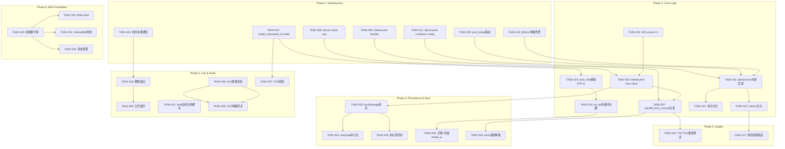
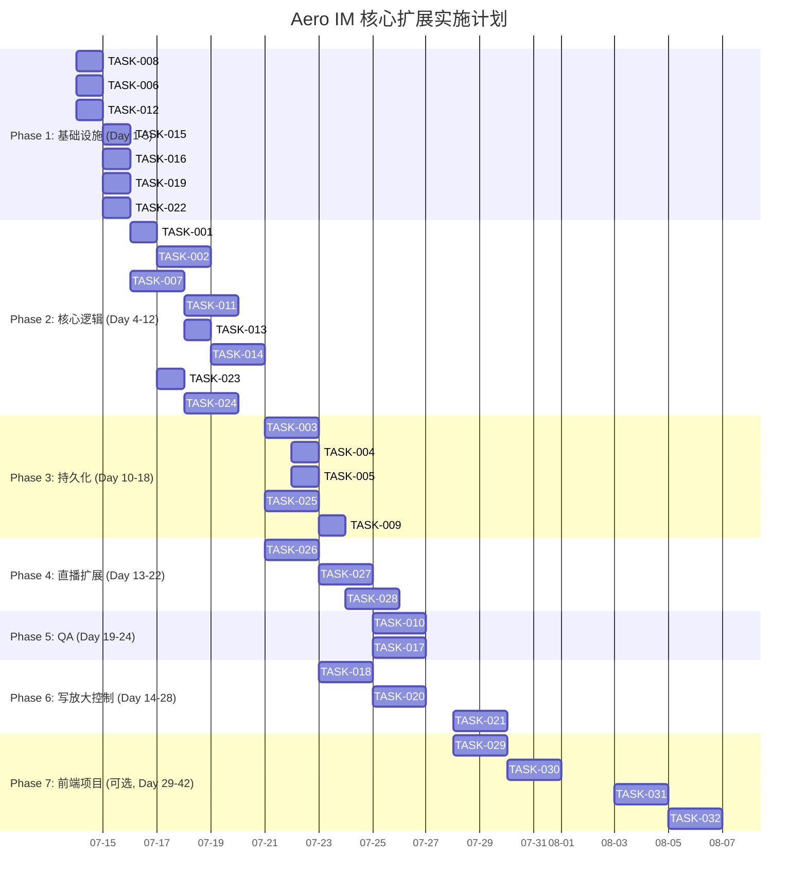

好的，我先读全了 AGENTS.md 和相关源码，现在基于 `2026-07-12-core-expansion-direction-analysis.md` 做一份完整的 Tech Lead 分析。

---

# Tech Lead 分析：核心扩展方向实施计划

> 基线：`2026-07-12-core-expansion-direction-analysis.md` 五个方向
> 扫描范围：15 crate，157 迁移，全后端 + Web 前端

---

## 1. 任务分解

将五个方向拆解为 2–4h 的可执行任务，总计 **32 个任务**。

### 1.1 方向三：重连 TOCTOU + Delivery Cursor 全线接入（第一期优先）

| 任务 ID | 标题 | 涉及文件 | 前置 | 工时 |
|---|---|---|---|---|
| TASK-001 | **WS 客户端：传 `cursors=1` 替代 `since`** | `web/ws.js` — `connect()` 在无 `since` 时传 `cursors=1` | 无 | 2h |
| TASK-002 | **WS 客户端：`DeliveryAck` 消息发送** | `web/ws.js` — 收到 `Message` 帧后立即向服务端发 `DeliveryAck {room_id, message_id, seq}` | TASK-001 | 3h |
| TASK-003 | **WS 客户端：持久化游标到 localStorage** | `web/ws.js` + `web/storage.js`(新) — 每次 ACK 后将每房间 `cursor` 写 `localStorage`，重连时恢复 | TASK-002 | 3h |
| TASK-004 | **WS 客户端：`SeqGate` 跨刷新持久化** | `web/ws.js` — `SeqGate` 的 `_lastSeen` 从 localStorage 恢复 | TASK-003 | 2h |
| TASK-005 | **WS 客户端：多标签页游标同步（StorageEvent）** | `web/ws.js` — 监听 `window.storage` 事件，另一标签页 ACK 后同步 | TASK-003 | 2h |
| TASK-006 | **服务端：`DeliveryAck` handler 调用 `DeliveryCursorRepo::advance`** | `crates/aero-server/src/ws/ws_impl/frame.rs` — `handle_text` 路由 `DeliveryAck` → 调用 `state.delivery_cursors.advance` | 无 | 2h |
| TASK-007 | **服务端：`backfill_from_cursors` 接入 `delivery_cursors`** | `crates/aero-server/src/ws/ws_impl/mod.rs` — 已实现但需完善：加入 TOCTOU 窗口保护的 `delivery_id` 去重 | TASK-006 | 3h |
| TASK-008 | **服务端：live Hub 扇出时写入 `seq` 到消息帧** | `crates/aero-server/src/ws/ws_impl/bus.rs` — `fan_out_raw` 处理消息帧时附加 per-subject `seq` | 无 | 2h |
| TASK-009 | **服务端：`?since=` 退场，单游标回填降级逻辑** | `crates/aero-server/src/ws/ws_impl/mod.rs` — `WsParams` 中 `since` 存在时降级警告，优先走 `cursors` | TASK-007 | 2h |
| TASK-010 | **集成测试：TOCTOU 窗口 + delivery_cursor 去重场景** | `crates/aero-server/tests/`(新) — 模拟断连 → M1 发布 → 重连 → M2 发布 → 确认都不丢 | TASK-007, TASK-008 | 4h |

**小计：方向三 = 10 任务，25h**

### 1.2 方向四：通知风暴防护（第一期优先）

| 任务 ID | 标题 | 涉及文件 | 前置 | 工时 |
|---|---|---|---|---|
| TASK-011 | **`@everyone` 冷却 — 房间级 RateLimiter** | `crates/aero-im-core/src/service/orig.rs` — `dispatch_notifications` 中 `@everyone` 前检查 per-room 冷却（复用 `RateLimiter` 结构：pseudo-\`RateLimiter\` 以 `("everyone_cooldown", room_id)` 为 key） | 无 | 3h |
| TASK-012 | **`@everyone` 冷却配置项 + env gate** | `crates/aero-server/src/config.rs` — `everyone_cooldown_secs`(默认 60)；`state.rs` 注入 | TASK-011 | 2h |
| TASK-013 | **`@everyone` metrics 打点** | `crates/aero-common/src/metrics/` — 新 counter `notifications_everyone_total`，区分正常/节流 | TASK-011 | 2h |
| TASK-014 | **`@everyone` 审计日志行** | `crates/aero-im-core/src/service/orig.rs` — `@everyone` 触发时写 audit 表（participant, room, timestamp） | TASK-011 | 3h |
| TASK-015 | **通知路由 `post_policy` 联动** | `crates/aero-im-core/src/service/orig.rs` — `dispatch_notifications` 在 `@everyone` 时检查消息发送者的 role permission + `post_policy`（migration 0030） | 无 | 3h |
| TASK-016 | **`@here` 降级告警** | `crates/aero-im-core/src/service/orig.rs` — `here_recipients` 在 Redis 故障回退到全成员时 emit `warn!` + metrics counter | 无 | 2h |
| TASK-017 | **集成测试：通知风暴场景** | `crates/aero-server/tests/` — mock：10 次 @everyone 在 1s 内，确认只有第 1 次通知 100k，后 9 次冷却跳过 | TASK-011~TASK-016 | 4h |

**小计：方向四 = 7 任务，19h**

### 1.3 方向一：写放大控制（第二期）

| 任务 ID | 标题 | 涉及文件 | 前置 | 工时 |
|---|---|---|---|---|
| TASK-018 | **懒惰扇出：离线成员不展开** | `crates/aero-server/src/ws/ws_impl/bus.rs` — `handle_room_event_sub` 中，只对 `hub.online_in_room()` 展开；离线成员走 NATS durable consumer | TASK-007 | 4h |
| TASK-019 | **纯文本消息跳通知** | `crates/aero-im-core/src/service/orig.rs` — `dispatch_notifications` 入口：消息无 `@`/无回复时直接 return | 无 | 2h |
| TASK-020 | **`backfill_room_ids` 分页展开** | `crates/aero-server/src/ws/ws_impl/mod.rs` — 超大房间在线成员低于阈值时，只回填在线成员消息 | TASK-018 | 3h |
| TASK-021 | **`Hub::fan_out_raw` 在线名单缓存预热** | `crates/aero-server/src/hub.rs` — 缓存 `online_in_room` 结果，减少 RWLock 竞争 | 无 | 3h |

**小计：方向一 = 4 任务，12h**

### 1.4 方向五：弹幕时序对齐（第二期）

| 任务 ID | 标题 | 涉及文件 | 前置 | 工时 |
|---|---|---|---|---|
| TASK-022 | **`StreamChatLine` / `StreamGiftLine` 增加 `media_timestamp_ms`** | `crates/aero-common/src/live.rs` — 追加 `Option<i64>` 字段，serde default | 无 | 2h |
| TASK-023 | **`post_chat` 接收 RTP timestamp** | `crates/aero-server/src/live.rs` — `post_chat` 从 WS 帧解析可选的 `media_timestamp` | TASK-022 | 2h |
| TASK-024 | **`WhipSession::on_rtp` 传递 RTP 时间戳到弹幕系统** | `crates/aero-live-whip/src/session.rs` — `on_rtp` 提取 `rtp.header.timestamp`，通过 channel 送给 live service | TASK-023 + 方向五源码 | 4h |
| TASK-025 | **存储 `stream_chat.media_timestamp` + 迁移** | `crates/aero-storage/src/stream_chat.rs`(新/改) — 新列 `media_timestamp_ms BIGINT`；migration NNNN | TASK-022 | 3h |
| TASK-026 | **WS 客户端：HLS 播放位置驱动弹幕渲染** | `web/live.js` — hls.js `attachMedia` → `currentTime` 事件驱动弹幕队列渲染 | TASK-022 | 4h |
| TASK-027 | **PCR 回绕处理：`(base_wall_clock, rtp_timestamp)` 元组** | `crates/aero-live-hls/src/ts.rs` + `crates/aero-common/src/live.rs` — 回绕检测：`rtp_timestamp < last_rtp_timestamp - threshold` 时重置 base | TASK-022 | 3h |
| TASK-028 | **VOD 回放时弹幕同步** | `web/live.js` + `crates/aero-server/src/live.rs` — `?since=` 回放时 media_timestamp 偏移计算 | TASK-026 | 3h |

**小计：方向五 = 7 任务，21h**

### 1.5 方向二：Web 前端生产化（独立项目 / 第三期）

| 任务 ID | 标题 | 涉及文件 | 前置 | 工时 |
|---|---|---|---|---|
| TASK-029 | **Web 框架选型 + 项目脚手架** | 新仓库/新目录 `web-client/` — Svelte 5 / React 19 选型，Vite + TypeScript | 无 | 4h |
| TASK-030 | **PWA manifest + Service Worker shell** | `web-client/public/manifest.json`, `sw.js` | TASK-029 | 3h |
| TASK-031 | **IndexedDB 离线消息队列** | `web-client/src/store/offline.ts` — 离线时写 IndexedDB，恢复时 flush | TASK-029 | 4h |
| TASK-032 | **状态管理 + WS 连接层** | `web-client/src/store/ws.ts` — 状态管理库 + WS 重连逻辑 + `SeqGate` 持久化 | TASK-029 | 4h |

**小计：方向二 = 4 任务(前期)，15h**

---

## 2. 执行顺序



### 并行执行组

| 组 | 任务 | 所需角色 |
|---|---|---|
| **Group A**（方向三井喷） | TASK-001, TASK-002, TASK-006, TASK-008 | 2 后端 + 1 前端 |
| **Group B**（通知防护） | TASK-011, TASK-012, TASK-015, TASK-016 | 2 后端 |
| **Group C**（基础设施） | TASK-019, TASK-022 | 1 后端 |
| **Group D**（Web 前期） | TASK-029 | 1 前端（独立） |
| **Group E**（持久化与测试） | TASK-003, TASK-004, TASK-005, TASK-025 | 1 后端 + 1 前端 |
| **Group F**（直播） | TASK-023, TASK-024, TASK-026, TASK-027 | 1 后端 + 1 前端 |
| **Group G**（集成测试） | TASK-010, TASK-017 | 1 后端 |
| **Group H**（二期扩展） | TASK-018, TASK-020, TASK-021, TASK-028 | 1-2 后端 + 1 前端 |
| **Group I**（Web 一期） | TASK-029, TASK-030, TASK-031, TASK-032 | 1-2 前端 |

---

## 3. 技术风险

### 3.1 高风险（需尽早验证）

| # | 风险 | 方向 | 影响 | 缓解策略 |
|---|---|---|---|---|
| **R1** | `DeliveryCursor` 存储写压力：每条消息所有在线成员写一次 DB。10w 房间 ×1msg/s = 10w/s INSERT | 三 | PostgreSQL 写 TPS 瓶颈、连接池耗尽 | 引入写合并：`advance` 在内存 batch 50ms 周期 flush（类似 `INSERT INTO ... ON CONFLICT` 批量），或使用 Redis 作热层缓存 cursor → 异步刷 PG |
| **R2** | `SeqGate` 客户端去重 + `backfill_from_cursors` 双路径重复投递 | 三 | 用户看到重复消息，信任崩塌 | **关键缓解**：客户端 `SeqGate` 必须基于 `(room_id, seq)` 去重（目前仅基于 `message_id`）。TASK-008 须在消息帧中携带 `seq`，`SeqGate` 用 Map<(room_id, seq)> 去重。TASK-010 模拟此场景 |
| **R3** | `@everyone` 冷却的门控绕过：`@channel` 和 `@all` 是同义词不同 token | 四 | `@channel` 仍可风暴 | TASK-011 冷却检查必须覆盖 `is_broadcast_token()` 所有变体（`channel`/`everyone`/`all`），而非仅 `@everyone` 字面量 |
| **R4** | RTMP/SRT 推流不存在 RTP 时间戳概念 | 五 | 弹幕无法对齐媒体 | TASK-024 只覆盖 WHIP。RTMP/SRT 需要各自推流入口处的 wall-clock → 分片索引映射。RTMP `aero-live-rtmp` 需在 `FlvToTsConverter` 处额外记录 `(wall_clock, ts_pcr)` 映射表，存入 `stream_chat.media_timestamp_ms` |
| **R5** | PCR 回绕检测在编码参数变更时的假阳性 | 五 | 弹幕在分辨率切换时跳跃 | 回绕检测阈值须动态调整：RTP timestamp 在 Simulcast 层切换时可能跳变 > 1s。需要 `base_rtp_timestamp` 在 detect 到 `(current - last) > 2^31` 时重置，而非简单 `threshold` |
| **R6** | 前端 `DeliveryAck` 与 `MarkRead` 的语义重叠 | 三 | 开发者困惑，两种游标混淆 | 文档 + 类型系统区分：`DeliveryAck` = 已收到已持久化（驱动重连回填），`MarkRead` = 已读（驱动未读计数）。代码中 `DeliveryAck` handler 不应更新 `read_receipts` |

### 3.2 中风险

| # | 风险 | 解 |
|---|---|---|
| R7 | `backfill_from_cursors` 在超大房间（10 万消息）且 `delivery_cursor` 缺失时，一次性回填 200 条仍太多 | `BACKFILL_PER_ROOM_LIMIT` 已设 200 为上限，`truncated` 信号让客户端 REST 分页补齐。如果 200 仍过多，可考虑首次连接给 50 + 后台渐进拉取 |
| R8 | 客户端 localStorage 写频繁：每条消息一次 `DeliveryAck` 写 localStorage | localStorage 是同步 API，高频写阻塞主线程。缓解：TASK-003 写入前 debounce 500ms，只写最新游标 |
| R9 | 多标签页 `StorageEvent` 同步后，`SeqGate` 的 `_lastSeen` 被另一标签拉高，导致本标签页去重失败 | `SeqGate` 去重基于 `seq`，游标只用于重连回填，不影响运行时去重。多标签页独立 WS 连接各自 `SeqGate`，互不干扰 |

### 3.3 低风险但需注意

| # | 注意点 |
|---|---|
| R10 | `DeliveryCursorRepo::advance` 当前用 `WHERE EXCLUDED.last_seq > delivery_cursors.last_seq`，这是 PG `ON CONFLICT DO UPDATE` 的子句。测试已验证单调性。但大规模并发下死锁可能（`participant_id, room_id` 行锁争用）。缓解：PK 是 `(participant_id, room_id)`，天然消歧，不会死锁 |
| R11 | 前端 hls.js CDN 加载失败无重试——已有的问题，方向二修复。当前方向五 TASK-026 可以先用 `navigator.onLine` 做一次 fallback 检查 |

---

## 4. 资源评估

### 4.1 人员技能矩阵

| 角色 | 数量 | 技能要求 | 负责方向 |
|---|---|---|---|
| **Rust 后端工程师 A**（核心 IM） | 1 | async-tokio, sqlx, WebSocket 协议, NATS JetStream | 方向三（server 侧）+ 方向四 |
| **Rust 后端工程师 B**（流媒体） | 1 | str0m/WebRTC, HLS/MPEG-TS, RTP 时序 | 方向五 + 方向一 |
| **前端工程师** | 1 | TypeScript, WebSocket, hls.js, IndexedDB, Svelte/React | 方向二 + 方向三（client 侧） |
| **QA 工程师** | 0.5 | Rust 集成测试, 端到端测试, 性能基准 | TASK-010, TASK-017 + 全流程验证 |

> 如果只有 2 人，建议方向三 + 方向四（5 周）→ 方向五（3 周）→ 方向一（2 周），前端独立推进。

### 4.2 关键里程碑

| 里程碑 | 时间 | 交付物 |
|---|---|---|
| **M1** | Phase 1 结束（Day 5） | 所有基础设施任务完成：消息帧带 seq，DeliveryAck handler 就位，冷却配置可用，media_timestamp 字段定义完成 |
| **M2** | Phase 2 结束（Day 12） | WS 客户端发送 DeliveryAck，服务端 backfill_from_cursors 完善，@everyone 冷却生效，RTP 时间戳注入弹幕路径 |
| **M3** | Phase 3 结束（Day 18） | 游标跨页面持久化，多标签同步，`?since=` 退场（降级），media_timestamp 迁移落地 |
| **M4**（QA Gate） | Phase 5 结束（Day 22） | TOCTOU 测试通过，通知风暴测试通过，`cargo test --workspace --lib` + `--ignored` 全绿 |
| **M5** | Phase 4 结束（Day 28） | 懒惰扇出 + 分页展开生效，HLS 弹幕渲染 + PCR 回绕处理，VOD 回放弹幕同步 |
| **M6**（可选） | Phase 6 结束（Day 38） | 前端脚手架搭建完成，PWA shell，离线队列，状态管理集成 |

### 4.3 阻塞点与解决策略

| 阻塞点 | 影响 | 解决 |
|---|---|---|
| **B1**: `DeliveryAck` 每秒 10 万次 DB 写入（10 万人在线 * 1 msg/s） | 方向三不可用 | **改用 Redis hash + 后台 batch flush 到 PG**。`DeliveryCursorRepo` 增加 `AsyncAdvancer` 层：内存 `DashMap<(pid, rid), (seq, mid)>` 每 50ms drain → `UNION` INSERT |
| **B2**: 方向二 Web 前端选型分歧 | 方向二无法启动 | **绑定 Svelte 5**（包体小、学习曲线低、与现有 vanilla JS 风格接近）。如果在 2h 内无法决策，推 React 19（生态最成熟） |
| **B3**: WHIP 推流 RTP 时间戳在 `str0m` `Media` 帧抽象后丢失 | 方向五 WHIP 路径阻塞 | 检查 `str0m` 的 `RtpHeader` 是否暴露到 `on_rtp` 回调。如果 `WhipSession` 的 `on_rtp` 只拿到 `Media`（`Bytes` + it `Trait`），需要降级到 str0m 的 `rtp` 模块直接解析 RTP header |
| **B4**: 当前 Hub `online_in_room` 的 O(N) 遍历 | 方向一不可上线 | TASK-021 加 `DashMap<RoomId, HashSet<Pid>>` 缓冲（`rooms_of` 的反向索引已存在），`fan_out_raw` 读缓存。但仍需注意 `connections` 变更时缓存更新一致性 |

---

## 5. 质量保证

### 5.1 单元测试覆盖（全部纯逻辑，无 I/O）

| 模块 | 测试要点 | 最低覆盖 |
|---|---|---|
| `parse_resume_cursor` | 合法 ULID / 非法字符串 / None | 4 用例（已有 `truncation_cursor` 测试模式） |
| `truncation_cursor` | 已覆盖。追加 `cursors` 为空场景 | 1 用例 |
| `DelayLimiter` 冷却逻辑（TASK-011 新增） | 首次允许 / 60s 内拒绝 / 60s 后恢复 | 3 用例 |
| `is_broadcast_token` 全 variant | `channel`/`everyone`/`all`/`here` + 非广播 | 5 用例 |
| `DeliveryCursorRepo::advance` 单调性 | 已有 PG 门控测试。追加：并发写入场景（timed) | 1 用例（忽略） |
| `StreamChatLine` 反序列化兼容 | 新旧格式互转（有/无 `media_timestamp_ms`） | 2 用例 |
| PCR 回绕检测 | 正常递进 / 回绕点 / 编码参数跳变 | 5 用例 |

### 5.2 集成测试策略（需 Postgres + Redis + NATS）

| 场景 | 涉及任务 | 方法 |
|---|---|---|
| **TOCTOU 窗口测试** | TASK-010 | 启动两个 server 实例 + NATS + 1 模拟客户端：断连 → M1 从实例 A 发出 → 重连到实例 B → M2 从实例 A 发出 → 确认 M1 和 M2 都收到 |
| **@everyone 冷却测试** | TASK-017 | mock `AppState` + 注入 `FakeRateLimiter`：10 次 @everyone → assert 只有 1 次通知 |
| **DeliveryAck 幂等性** | TASK-006 | 连续两次发送相同 `DeliveryAck` → 游标只前进一次 |
| **跨设备游标合并** | TASK-007 | 设备 A ACK seq=10，设备 B ACK seq=5 → 游标=10；设备 B ACK seq=15 → 游标=15 |
| **HLS 弹幕偏移** | TASK-026 | mock `hls.js` 的 `currentTime` → 确认弹幕队列按偏移出队 |
| **PCR 回绕** | TASK-027 | 模拟 RTP timestamp 绕 2^32 回 0 → 确认 `media_timestamp` 连续递增 |

### 5.3 代码审查要点

| 审查点 | 任务 | 重点关注 |
|---|---|---|
| `SeqGate` 去重键 | TASK-004 | 改为 `Map<(room_id, seq)>` 而非 `Map<message_id>`，避免跨房间碰撞 |
| `DeliveryAck` 不更新 `read_receipts` | TASK-006 | handler 中**没有**调用 `ReceiptRepo::advance` |
| `@everyone` 冷却 key 范围 | TASK-011 | key 是 `(room_id)` 还是 `(workspace_id, room_id)`？冷却是 per-room，避免不同频道相互影响 |
| `backfill_from_cursors` 跃迁检查 | TASK-007 | 游标消息已被硬删（ephemeral sweep）时，`list_since` 返回空，但后序消息仍存在→ Cursor 回退到 `last_delivered_message_id` 之前的最新 created_at |
| 迁移幂等性 | TASK-025 | `CREATE TABLE IF NOT EXISTS` + `ALTER TABLE ... ADD COLUMN IF NOT EXISTS` |
| 前端 `StorageEvent` 防循环 | TASK-005 | 写 localStorage 时标记 `_syncSource=true`，防止 `StorageEvent` 自触发 |

### 5.4 性能测试需求

| 场景 | 标的 | 方法 | 接受标准 |
|---|---|---|---|
| `DeliveryAck` DB 写入 QPS | TASK-006 / B1 | 100 并发模拟客户端 × 1msg/s = 100/s 写入 | `p99 < 5ms`，无连接池耗尽 |
| `@everyone` 100k 成员冷却后跳过 | TASK-011 | 100k 成员房间 × 1 @everyone/s × 60s | CPU 增量 < 5%，通知行 INSERT 0 |
| Hub 扇出 10k 在线连接 | TASK-018/TASK-021 | 10k 并发 WS 连接，1 msg/s | 消息延迟 p99 < 200ms，无 OOM |
| HLS + 弹幕 10k 观众 | TASK-026 | 10k WS 连接 + HLS 分片并行请求 | 弹幕端到端延迟 < 2s |

---

## 6. 实施计划

### 甘特图（3 并行人，2 周一期）



### 阶段概要

| 阶段 | 时间跨度 | 并行团队 | 产出 |
|---|---|---|---|
| **Phase 1: Infrastructure** | Day 1-5 | 后端 ×2 | 消息帧带 seq、DeliveryAck handler、配置注入、media_timestamp 字段定义 |
| **Phase 2: Core Logic** | Day 4-12 | 后端 ×2 + 前端 ×1 | WS 双向 DeliveryAck、@everyone 冷却生效、RTP 时间戳注入弹幕 |
| **Phase 3: Persistence** | Day 10-18 | 后端 ×1 + 前端 ×1 | 游标 localStorage 持久化、多标签同步、migration 落地、?since= 退场 |
| **Phase 4: Live Timing** | Day 13-22 | 后端 ×1 + 前端 ×1 | HLS + 弹幕同步、PCR 回绕、VOD 回放 |
| **Phase 5: Quality Gate** | Day 19-24 | 后端 ×1 | TOCTOU + @everyone 集成测试全绿；性能基准通过 |
| **Phase 6: Write Amp** | Day 14-28 | 后端 ×1 | 懒惰扇出、分页展开、Hub 缓存预热 |
| **Phase 7: Web Project** | Day 29-42 | 前端 ×1 | 新 SPA 脚手架、PWA、离线队列（非阻塞） |

### 提交通关条件（Checklist）

**Day 12 通关条件（Phase 2 结束）**：
- [ ] `cargo check --workspace` 干净
- [ ] `cargo clippy --workspace --all-targets` 无新增警告
- [ ] `cargo test --workspace --lib` + `-- --ignored` 全绿
- [ ] 方向三：客户端 `cursors=1` 可在 DevTools network 中观察到 `?cursors=1`
- [ ] 方向三：`DeliveryAck` 发送后 PG `delivery_cursors` 表有对应行
- [ ] 方向四：连续两次 `@everyone`，第二次返回 `RateLimited`（HTTP 429 / WS Error）
- [ ] 方向五：`StreamChatLine` JSON 序列化包含 `"media_timestamp_ms": null`（向后兼容）

**Day 28 通关条件（全部完成）**：
- [ ] `scripts/truth-check.sh` 0 违规
- [ ] `scripts/file-size-check.sh` 全部文件 < 阈值
- [ ] `scripts/web-check.sh` 前端静态检查通过
- [ ] 方向三：手动模拟 - 断连 10s → 重连 → 确认无丢无重
- [ ] 方向四：100k 成员房间 @everyone 1 秒 10 次 → 通知 INSERT 只有 1 波
- [ ] 方向五：WHIP 推流后弹幕的 `media_timestamp_ms` 随 RTP timestamp 递增，无回绕毛刺

---

## 附：第一阶段（Phase 1-2）详细任务卡

### TASK-006: DeliveryAck handler

```
文件: crates/aero-server/src/ws/ws_impl/frame.rs
动作: 
  1. match ClientFrame::DeliveryAck { room_id, message_id, seq }
  2. let repo = &state.delivery_cursors;
  3. repo.advance(pid, room_id, message_id, seq).await;
  4. 结果只 debug log，不回复客户端（避免 ACK 之 ACK 循环）
  5. 失败 warn 不 abort
验收: 发 DeliveryAck → DB 有行；发旧 seq → ignored
```

### TASK-011: @everyone 冷却

```
文件: crates/aero-im-core/src/service/orig.rs
动作:
  1. dispatch_notifications 中 @everyone/@channel/@all 分支前
  2. 检查 per-room 冷却: let cooldown_key = ("everyone_cooldown", room_id)
  3. 使用 DashMap<RoomCooldownKey, Instant> 做进程级冷却（与 RateLimiter 模式相同）
  4. 如果上次 @everyone < 60s，直接 return（跳过通知）
  5. 成功通过后更新冷却时间戳
  6. 计数到 metrics: notifications_everyone_total{allowed, throttled}
验收: 连续两次 @everyone → metrics 显示 1 allowed + 1 throttled
```

### TASK-024: WHIP on_rtp 传递 RTP 时间戳

```
文件: crates/aero-live-whip/src/session.rs
动作:
  1. 在 WhipSession 中持有 mpsc::Sender<(u32 /* rtp_ts */, ...)> 到 live service
  2. on_rtp 回调中提取 rtp.header.timestamp
  3. 发送给 live service
  4. live service 在 post_chat 时将 rtp_ts 写入 StreamChatLine.media_timestamp_ms
验收: WHIP 推流时 post_chat 消息带有非零 media_timestamp_ms
```

---

**核心建议汇总**：
1. **第一期锁定方向三 + 方向四**——它们技术风险低、不依赖 Web 重写、消除最大生产隐患
2. **R1（写合并）必须在 Phase 1 解决**，否则方向三不可上线
3. **TASK-008 + TASK-004 联合决定去重正确性**——`SeqGate` 必须改为 `(room_id, seq)` 键，否则双路径重复投递会漏过去
4. **方向五 RTMP/SRT 的 RTP 缺失**是已知 gap，TASK-024 只覆盖 WHIP。RTMP/SRT 需额外走 `(wall_clock, pcr)` 映射表——这可以拆为独立任务延后
5. **方向二推荐 Svelte 5**，最小化与现有 ~5,900 行 vanilla JS 的冲突，且包体 ~5KB gzip，适合 PWA 首屏
