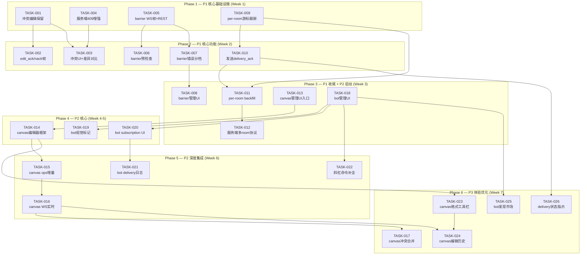
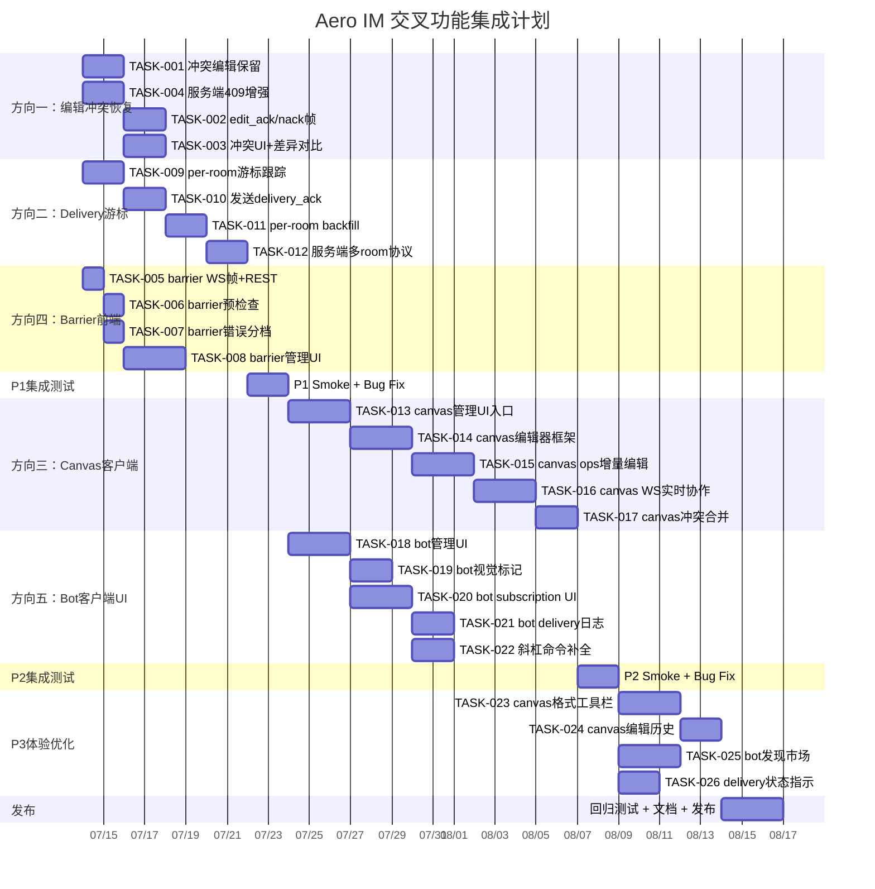

Now I have a thorough understanding of the codebase. Let me produce the analysis.

---

# Tech Lead 分析报告：Aero IM 交叉功能集成缺口补缝

## 总览

验证报告确认了 5 个方向的服务端实现基本完整，但 Web 前端存在系统性集成缺口。以下分析将这 5 个缺口拆解为可执行任务，给出依赖关系、风险识别和实施计划。

---

## 1. 任务分解

### P1 优先级（直接影响核心 IM 可用性）

#### 方向一：Message 版本乐观锁 → 客户端冲突恢复（P1）

| 任务 ID | 任务标题 | 涉及文件 | 前置依赖 | 预估工时 | 验收标准 |
|---|---|---|---|---|---|
| TASK-001 | 客户端 `editMessage` 返回 409 时保留编辑内容 | `web/app.js` (beginEditMessage) | 无 | 2h | 409 时弹出恢复对话框，内容不丢失；用户可选择重试/放弃/复制 |
| TASK-002 | 添加 `edit_ack`/`edit_nack` WS 帧类型和客户端处理 | `ws/ws_impl/mod.rs`, `web/ws.js` | TASK-001 | 2h | 服务端编辑成功/失败后发对应帧；客户端据此更新 UI 或触发恢复 |
| TASK-003 | 冲突 UI：可视化版本冲突提示 + 差异对比 | `web/app.js`, `web/render.js` | TASK-001 | 3h | 冲突时弹出「您的版本 vs 当前版本」对比；用户可合并或重编 |
| TASK-004 | 服务端 `Conflict` 错误增加 `current_version` 和 `current_blocks` 字段 | `im-core/service/messages.rs`, `common/src/error.rs` | TASK-003 | 2h | 409 响应 JSON 包含 `server_version` 和 `server_blocks`，客户端可渲染差异 |

#### 方向四：信息隔离墙 → 前端反馈（P1）

| 任务 ID | 任务标题 | 涉及文件 | 前置依赖 | 预估工时 | 验收标准 |
|---|---|---|---|---|---|
| TASK-005 | 新增 WS `barrier_blocked` ServerFrame + REST `/api/me/barriers` | `ws/ws_impl/mod.rs`, `server/info_barriers.rs` | 无 | 2h | 被 barrier 阻止的操作返回可区分的错误类型；客户端收到 `barrier_blocked` 事件 |
| TASK-006 | DM 创建页 barrier 预检查 | `web/app.js`, `web/modals.js` | TASK-005 | 2h | 输入目标用户时，前端调用 `GET /api/barriers/check?target=...`；命中即显示「无法创建：信息隔离墙已启用」 |
| TASK-007 | Barrier 错误 UI 分档 + 用户提示 | `web/api.js`, `web/app.js` (toast) | TASK-005 | 1h | API 错误分档，barrier 403 显示特定提示而非泛化 toast |
| TASK-008 | Barrier 管理 UI（列表/创建/删除） | `web/modals.js`, `web/app.js`, `web/chrome.js` | TASK-007 | 4h | 管理工作区设置页面可查看/新建/删除信息隔离墙规则 |

#### 方向二：Delivery 游标 → 客户端集成（P1）

| 任务 ID | 任务标题 | 涉及文件 | 前置依赖 | 预估工时 | 验收标准 |
|---|---|---|---|---|---|
| TASK-009 | 客户端 `WsConnection` 添加 per-room delivery 游标跟踪 | `web/ws.js` | 无 | 3h | 每个 room 维护独立 `_lastSeenRoom` map；收到 message 帧时更新对应 room 游标 |
| TASK-010 | 客户端定期/按事件发送 `delivery_ack` WS 帧 | `web/ws.js` | TASK-009 | 2h | 收到消息后（带防抖 500ms）发送 `DeliveryAck { room_id, message_id, seq }` 帧 |
| TASK-011 | 重连 `backfill_from_cursors` 改用 per-room 游标而非全局 `_lastSeen` | `web/ws.js` (connect/_open) | TASK-009, TASK-010 | 3h | 重连时对每个有游标的 room 携带 `?since=<room_id>:<seq>`；服务端 per-room 回填 |
| TASK-012 | 服务端支持多 room `?since=` 协议 | `ws/ws_impl/mod.rs` backfill | TASK-011 | 2h | 连接 URL 支持 `?since=r1:s1,r2:s2,...`；服务端按 room 逐一回填 |

### P2 优先级（影响深度协作功能）

#### 方向三：Canvas ops 客户端 → OT 编辑器（P2）

| 任务 ID | 任务标题 | 涉及文件 | 前置依赖 | 预估工时 | 验收标准 |
|---|---|---|---|---|---|
| TASK-013 | Canvas 管理 UI 入口 + 列表/创建/删除 | `web/app.js`, `web/modals.js`, `web/chrome.js`, `web/api.js` | 无 | 4h | 频道设置或消息输入栏上方有「画布」入口；弹出画布列表，可新建/删除 |
| TASK-014 | Canvas 编辑器基本框架（纯文本/块编辑器） | `web/canvas.js`（新文件） | TASK-013 | 4h | 可加载 canvas blocks JSON、编辑文本块、保存（全量 PUT） |
| TASK-015 | Canvas op log 增量编辑（OT 基础设施客户端） | `web/canvas.js` | TASK-014 | 4h | 编辑时发送 `POST /api/canvases/:cid/ops` 增量 op；收到冲突 409 时拉最新版本 |
| TASK-016 | Canvas 实时协作：WS 广播 canvas 变更事件 | `ws/ws_impl/mod.rs` (ClientFrame/ServerFrame), `web/canvas.js`, `web/ws.js` | TASK-015 | 4h | 添加 `CanvasOp` RoomEvent variant；编辑时 WS 扇出；客户端合并远端 op |
| TASK-017 | Canvas 冲突可视化 + 手动合并 | `web/canvas.js` | TASK-016 | 3h | 乐观锁 409 时弹出 diff 视图（JSON blocks diff），用户可确认覆盖或取消 |

#### 方向五：Bot 平台 → 客户端 UI（P2）

| 任务 ID | 任务标题 | 涉及文件 | 前置依赖 | 预估工时 | 验收标准 |
|---|---|---|---|---|---|
| TASK-018 | Bot 管理 UI（创建/配置/删除） | `web/app.js`, `web/modals.js`, `web/api.js` | 无 | 4h | 工作区设置页面有「Bot」管理；可创建 bot、配置名称/头像/订阅事件 |
| TASK-019 | Bot 参与者视觉标记 | `web/render.js` | TASK-018 | 2h | Bot 发送的消息显示「🤖 Bot」或特殊头像标记；bot 列表可见 |
| TASK-020 | Bot subscription 管理 UI（配置 webhook URL + 订阅事件） | `web/modals.js`, `web/api.js`, `web/app.js` | TASK-018 | 3h | 编辑 bot 时可添加/删除事件订阅（message_created, member_joined 等）、设置 webhook URL |
| TASK-021 | Bot delivery 日志可视化 | `web/modals.js`, `web/app.js` | TASK-020 | 3h | Bot 详情页展示 delivery 日志列表（时间、事件类型、HTTP 状态、重试次数） |
| TASK-022 | 斜杠命令自动补全 | `web/mentions.js`, `web/app.js` | TASK-018 | 3h | 输入 `/` 时弹出 bot 命令列表（对接 `GET /api/bots/:id/commands`） |

### P3 优先级（体验优化）

| 任务 ID | 任务标题 | 涉及文件 | 前置依赖 | 预估工时 | 验收标准 |
|---|---|---|---|---|---|
| TASK-023 | Canvas 编辑器改进：块类型选择 + 格式工具栏 | `web/canvas.js` | TASK-014 | 4h | 支持 header/bullet/checklist/code 等块类型；基本格式工具栏 |
| TASK-024 | Canvas op 编辑历史回滚 | `web/canvas.js`, `server/canvas.rs` | TASK-016 | 3h | 可查看 canvas 编辑历史（`GET /api/canvases/:cid/ops?since=0`）并回滚到特定版本 |
| TASK-025 | Bot 发现市场 / bot 商店 | `web/modals.js`, `web/chrome.js`, `web/app.js` | TASK-018 | 4h | 工作区可浏览已安装 bot 列表，管理员可一键安装预配置 bot |
| TASK-026 | Delivery ack 状态指示器 | `web/app.js`, `web/render.js` | TASK-010 | 2h | 消息下方显示 ✓（已投递）/ ✓✓（已读）/ ⏳（发送中） |

---

## 2. 执行顺序与依赖图



### 可并行执行的任务组

| 并行组 | 任务 | 负责方向 | 说明 |
|---|---|---|---|
| **组 A** | TASK-001, TASK-004 | 方向一基础设施 | 纯服务端改造 + 客户端编辑保留机制 |
| **组 B** | TASK-005 | 方向四基础设施 | 新增 WS 帧和 REST 端点 |
| **组 C** | TASK-009 | 方向二基础设施 | 客户端 per-room 游标数据模型 |
| **组 D** | TASK-013, TASK-018 | 方向三/五入口 | UI 入口框架，无服务端依赖 |
| **组 E** | TASK-002, TASK-006, TASK-010 | 方向一/四/二核心 | 各自方向的核心客户端集成 |
| **组 F** | TASK-014, TASK-019, TASK-020 | 方向三/五核心 | 编辑器/标记/订阅管理 |

---

## 3. 技术风险

### 3.1 方向一：编辑冲突恢复

| 风险 | 等级 | 说明 | 缓解策略 |
|---|---|---|---|
| 冲突 UI 设计复杂度 | **中** | 文字编辑冲突 diff 展示需要合理的合并 UX（类似 Google Docs 冲突解决或 Git 合并） | P0 版本仅需保留原始编辑内容 + 提示手动合并；后续版本再实现三方 diff |
| 服务端 409 增强向后兼容 | **低** | 现有客户端忽略 `current_blocks` 字段，新增字段不会 break 旧客户端 | `current_blocks` 仅在 409 时返回，serde 用 `#[serde(default)]` 保证旧客户端兼容 |
| 多次并发编辑的连续冲突 | **低** | 用户重试后立刻再次冲突 | 指数退避 + 自动重试（max 3 次），之后降级为手动合并 |

### 3.2 方向二：Delivery 游标集成

| 风险 | 等级 | 说明 | 缓解策略 |
|---|---|---|---|
| per-room backfill 协议设计 | **中** | 多 room `?since=` 逗号分隔格式需要服务端/客户端协商 | 原型使用 `?since_<room_id>=<seq>` 查询参数；后续标准化为逗号分隔格式 |
| 游标存储开销 | **低** | 用户加入大量 room 时，per-room 游标内存占用增长 | 上限 500 个 room，超限淘汰最久未活跃 room 的游标 |
| delivery_ack 在大量消息下的性能 | **低** | 每条消息都发 ack 帧会造成 WS 流量增加 | 500ms 防抖 + 批量 ack（累计到最后一个已读消息 id） |

### 3.3 方向三：Canvas Ops 客户端

| 风险 | 等级 | 说明 | 缓解策略 |
|---|---|---|---|
| 无 OT/CRDT 的协作冲突 | **高** | 服务端只有 op log 无 OT 变换函数；多人同时编辑必然会冲突 | 初始版本采用「悲观锁 + 全量 PUT」模式（谁保存最后谁胜出）；op log 作为审计/历史回滚用途。P2 再引入操作变换 |
| Canvas blocks JSON 结构的复杂性 | **中** | blocks 是任意 JSON 数组，客户端需要支持渲染/编辑多种 block 类型 | P0 仅支持 text/header/image 三种基础 block 类型；剩余的通过 json 编辑器 fallback |
| 实时协作编辑的 WS 广播冲突 | **中** | WS 广播 ops 但缺乏 `op_transform` 函数协调操作顺序 | 使用服务端 seq 作为全局序，客户端收到 op 后尝试应用（last-write-wins），失败则 409 重构 |

### 3.4 方向四：信息隔离墙前端

| 风险 | 等级 | 说明 | 缓解策略 |
|---|---|---|---|
| barrier 状态的变化需要实时刷新 | **中** | 管理员新增 barrier 后，已登录用户的预检查结果失效 | WS 广播 `barrier_updated` 事件，客户端清除本地缓存 |
| DM 创建预检查的竞态 | **低** | 预检查通过后、实际创建前 barrier 规则变化 | 最终仍以服务端返回为准；预检查仅做 UX 优化 |

### 3.5 方向五：Bot 平台 UI

| 风险 | 等级 | 说明 | 缓解策略 |
|---|---|---|---|
| Bot subscription 事件类型需对齐 | **中** | 客户端需要知道服务端支持哪些事件类型（`message_created`, `member_joined` 等） | 新增 `GET /api/bots/event-types` REST 端点返回枚举列表；客户端动态渲染下拉框 |
| Webhook 端点安全 | **低** | 用户输入的 webhook URL 可能存在 SSRF 风险 | 客户端仅做格式校验；服务端已有 webhook URL 白名单/黑名单机制 |
| Bot 命令体系不存在 | **高** | 当前 bot 平台没有斜杠命令注册机制 | P0 的 bot UI 仅实现管理/订阅/日志查看；斜杠命令需要新增 `GET /api/bots/:id/commands` 端点 + 服务端 `SlashCommand` 表 |

### 风险优先级矩阵

```
高 │  方向三 OT/CRDT 协作  方向五命令体系
   │  │                     │
中 │  │  方向一冲突UI设计  方向五事件类型对齐
   │  │  方向二backfill协议 │
   │  └───方向四 barrier实时─┘
低 │  方向二游标存储       方向三blocks复杂度
   │  方向四预检查竞态     方向五webhook安全
   └───────────────────────────────────>
       低        中        高     影响
```

---

## 4. 资源评估

### 4.1 开发人员配置

| 角色 | 技能要求 | 数量 | 覆盖方向 |
|---|---|---|---|
| **前端工程师** | JavaScript/ES2020, WebSocket, DOM 操作, SPA 架构 | 2 人 | 所有方向客户端 UI |
| **全栈工程师** | Rust, Axum, sqlx, WebSocket 协议, Postgres | 1 人 | 服务端增强（方向二/三协议扩展、方向一 409 增强） |
| **Tech Lead / 架构师** | 协议设计, OT/CRDT 评审, 性能评估 | 1 人(兼职) | 跨方向协调、技术方案评审 |

**推荐团队规模**：3 人全职（2 FE + 1 全栈）+ 1 人兼职架构/QA，预计 7 周完成 P1+P2。

### 4.2 关键里程碑

| 里程碑 | 时间 | 交付物 | 验收标准 |
|---|---|---|---|
| **M1: P1 可用** | Week 2 末 | 方向一冲突恢复 + 方向二 per-room backfill + 方向四 barrier 错误分档 | 编辑冲突不丢内容；重连恢复精确到每个 room；barrier 403 显示专用提示 |
| **M2: P1 完整** | Week 3 末 | barrier 管理 UI + 完整 delivery 游标体系 | 可全生命周期管理 barrier；重连回填准确无误 |
| **M3: P2 入口** | Week 4 末 | canvas 列表/编辑器框架 + bot 创建/标记 | 可在频道中创建和编辑画布；bot 参与方可被识别 |
| **M4: P2 完整** | Week 6 末 | canvas 协作 + bot subscription 管理 | 多人可协作编辑 canvas（悲观锁模式）；可配置 bot webhook 和查看 delivery 日志 |
| **M5: 发布就绪** | Week 7 末 | 所有 P1+P2 功能集成测试通过；无 clippy 警告；web-check 通过 | `cargo check --workspace` 干净；`cargo test` 全绿；web-check 0 违规 |

### 4.3 阻塞点（Blockers）与解决策略

| 阻塞点 | 影响方向 | 说明 | 解决策略 |
|---|---|---|---|
| **无 OT 库可用** | 方向三 P2 | 纯 JS 无依赖约束，无法引入 ShareJS/Operational-Transformation 库 | 自制简化版操作变换（仅支持 text block 的 insert/delete/replace），或接受 last-write-wins |
| **WebSocket 帧类型扩展需服务端/客户端同步** | 所有 WS 相关 | 新增 `ClientFrame`/`ServerFrame` variant 需两端同时部署 | 所有新 variant 用 `#[serde(deny_unknown_fields)]` 关闭；旧客户端忽略未知字段 |
| **backfill 协议需端到端设计** | 方向二 | `?since=` 多 room 格式未定义 | Week 1 内完成协议设计文档评审（3 页以内），对齐后实现 |
| **bot 事件类型枚举未定义** | 方向五 | 服务端 `bot_event_subscriptions.event_type` 用 string 存，无枚举 | 新增 `GET /api/bots/event-types` 返回 `["message.created","member.joined",...]` 固定列表 |

---

## 5. 质量保证

### 5.1 单元测试覆盖要求

| 模块 | 测试重点 | 最低覆盖率 | 备注 |
|---|---|---|---|
| **方向一：`im-core/service/messages.rs`** | `edit` 函数的乐观锁逻辑；`Conflict` 错误路径；`current_version`/`current_blocks` 序列化 | 90% | 新增 409 增强字段的序列化/反序列化 |
| **方向二：`delivery_cursor.rs`** | `advance` 的幂等性；`cursors_for` 返回顺序；per-room 游标隔离 | 90% | 现有仓储方法保持 |
| **方向四：`server/info_barriers.rs`** | 新增 `barrier_blocked` 帧类型；`GET /api/me/barriers` 鉴权 | 80% | 重点测试鉴权正确性 |
| **方向三：`canvas_op.rs`** | `append` 的 seq 单调递增；`ops_since` 分页正确性 | 90% | 现有测试保持 |
| **方向五：`bot_dispatch.rs`** | delivery 日志写入；HMAC 签名验证；dead letter 重试 | 85% | 不涉及前端 UI 测试 |

### 5.2 集成测试策略

| 测试类型 | 覆盖场景 | 工具 | 执行频率 |
|---|---|---|---|
| **端到端 WS 协议测试** | 编辑冲突 → WS 409 → 客户端恢复 → 成功重试 | `crates/aero-server/tests/` + WebSocket client | 每个 PR |
| **backfill 多 room 游标** | 断开连接后重连，验证 per-room 回填准确性 | Rust integration tests + 模拟 WS | Week 3 |
| **barrier 全链路** | 创建 barrier → DM 被阻止 → 前端显示专用错误 → 删除 barrier → DM 可创建 | Rust test + SPA smoke | Week 2 |
| **canvas CRUD + op log** | 创建 canvas → 追加 ops → 读取 ops → 409 乐观锁 → 客户端重试 | Rust test | Week 4 |
| **bot 完整生命周期** | 创建 bot → 订阅事件 → 发送消息 → delivery 日志 → 删除 bot | Rust test + SPA smoke | Week 5 |

### 5.3 代码审查要点

| 审查维度 | 方向 | 关键检查项 |
|---|---|---|
| **协议兼容性** | 全部 | 新增 WS 帧 variant 是否用 `#[serde(rename)]` 避免 `kind` 字段名冲突（见 AGENTS.md §4.2）|
| **幂等性** | 方向二 | `delivery_ack` 处理器是否幂等；`advance` 是否存在 `ON CONFLICT` 处理 |
| **乐观锁边界** | 方向一/三 | `expected_version` 为 `None` 时是否向后兼容（last-write-wins）；`Some` 时是否返回 409 |
| **鉴权守卫** | 方向四/五 | 新增路由是否都有 `assert_room_access(participant, room)` 或 `member_role` 守卫 |
| **输入校验** | 方向三/五 | canvas title ≤512；bot 名 ≤64；批量操作 Vec 是否有上限 |
| **CI 合规** | 全部 | 无新 clippy 警告；`file-size-check.sh` 不超标；`truth-check.sh` 无 UNWIRED 标记误报 |

### 5.4 性能测试需求

| 场景 | 指标 | 目标 | 测试方法 |
|---|---|---|---|
| **per-room backfill** | 100 rooms × 1000 messages | 页面恢复 < 3s | 用 `k6` 模拟重连场景 |
| **delivery_ack 批量处理** | 1000 ack/sec | 无 WS 延迟 > 50ms | WS 帧注入 + 服务端 trace |
| **canvas op log 并发追加** | 10 并发 × 100 ops | 无 seq 冲突 | Rust stress test |
| **bot dispatch 吞吐** | 100 bots × 100 events/sec | delivery 延迟 < 1s | NATS 注入 + mock HTTP |

---

## 6. 实施计划



### 时间线汇总

| 阶段 | 时间范围 | 天数 | 焦点 | 交付物 |
|---|---|---|---|---|
| **Phase 1：P1 核心基础设施** | Day 1-3 | 3d | 方向一/二/四 并行基础设施建设 | 服务端 409 增强，per-room 游标模型，barrier WS 帧 |
| **Phase 2：P1 核心功能** | Day 4-8 | 5d | 方向一/二/四 客户端集成 | 冲突 UI，backfill 协议，barrier 预检查 |
| **Phase 3：P1 收尾 + 测试** | Day 9-12 | 4d | 方向四管理 UI + 全链路集成测试 | barrier 管理，per-room backfill，P1 smoke 通过 |
| **Phase 4：P2 入口** | Day 13-18 | 6d | 方向三/五 入口 UI | canvas 列表/编辑器框架，bot 创建/视觉标记 |
| **Phase 5：P2 深度集成** | Day 19-24 | 6d | 方向三/五 核心功能 | canvas ops 增量，bot subscription/delivery 日志 |
| **Phase 6：P2 集成测试** | Day 25-26 | 2d | P2 全链路测试 | canvas 协作测试，bot 生命周期测试 |
| **Phase 7：P3 体验优化** | Day 27-31 | 5d | 方向三/二/五 体验提升 | 格式工具栏，编辑历史，bot 市场，delivery 标记 |
| **Phase 8：发布** | Day 32-34 | 3d | 回归测试 + 文档 | `cargo check` 干净，`cargo test` 全绿，web-check 通过 |

**总工期**：34 个工作日（约 7 周）

---

## 7. 补充建议

### 7.1 技术债务注意事项

1. **AGENTS.md 更新**：新增自定义 `CanvasOp` RoomEvent 后，需在 AGENTS.md 的 §3 能力索引中添加「canvas 协作」行
2. **避免 file-size-check 违规**：`web/canvas.js` 新文件控制在 800 行以内（JS 阈值 1000）；超过则拆分 `web/canvas-editor.js` 和 `web/canvas-ops.js`
3. **WebSocket 帧类型枚举**：新增 `ClientFrame::DeliveryAck` 的 `#[serde(rename = "delivery_ack")]` 保持与现有 snake_case 风格一致

### 7.2 分阶段交付价值

```
价值
↑
│  P1 (Week 1-2)     P2 (Week 4-6)       P3 (Week 7)
│  ┌──────────┐     ┌──────────────┐    ┌──────────┐
│  │ 编辑不丢  │     │ 协作canvas   │    │ 格式编辑  │
│  │ barrier提示│     │ bot平台可管理 │    │ bot市场   │
│  │ 精确重连  │     │ 实时协作     │    │ 状态指示  │
│  └──────────┘     └──────────────┘    └──────────┘
└────────────────────────────────────────────────────→
    3个P1方向          2个P2方向           体验优化
```

建议严格按照 P1 → P2 → P3 节奏交付，每个阶段结束时做一次 `cargo check --workspace && cargo test --workspace --lib` 确保主干不退化。

### 7.3 Web 端架构对齐建议

当前 `web/` 是零依赖 ES2020 SPA，无框架、无构建工具。新增的 `web/canvas.js`（预计 600-800 行）需遵循既有模式：

- 用 `export function` / `export class` 导出，不额外引入框架
- DOM 操作用 `document.createElement` / `el()` 辅助函数（见 `render.js`）
- 网络调用用 `api.js` 的 `request()` 函数
- WS 事件监听用 `ws.on('msg:...', handler)` 注册
- ESLint 配置继承 `web/eslint.config.js`

若 canvas 编辑器复杂度超出预期（>1000 行），应考虑拆分为模块文件并用 `type="module"` 的 `import` 管理依赖，而非硬塞进一个文件。
