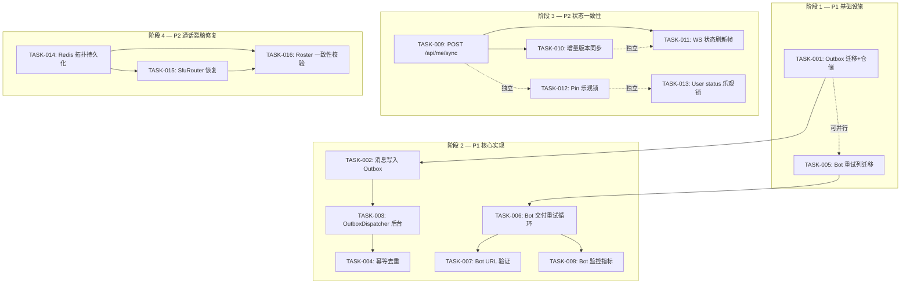
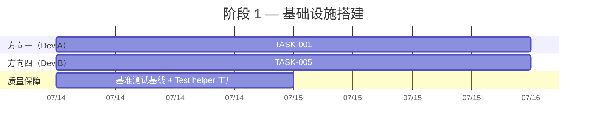
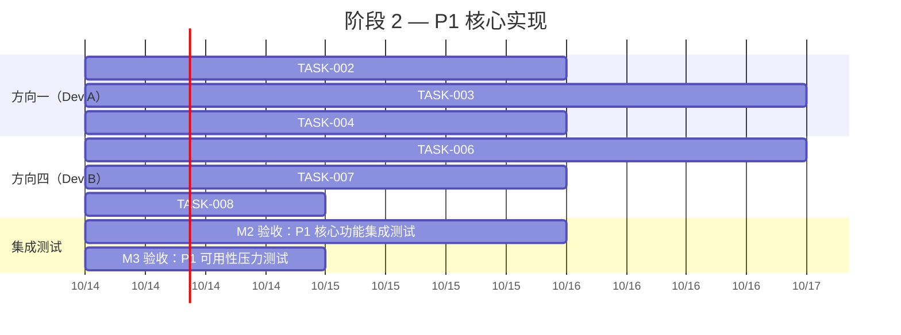
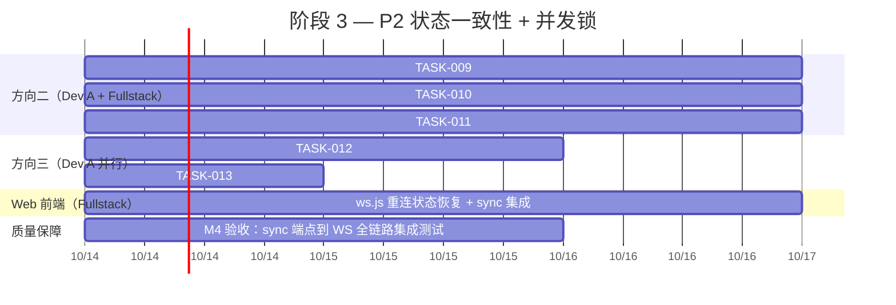
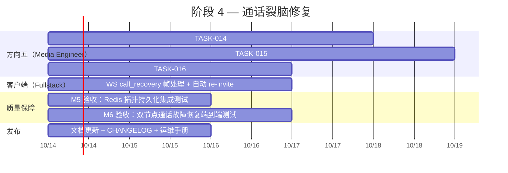

# Tech Lead 分析：分布式一致性裂缝修复计划

## 综述

基于 `2026-07-11-dual-write-and-consistency-gaps.md` 分析文档及代码级验证反馈，我将 5 个方向拆解为可执行任务集。**核心结论**：方向一（Outbox）和方向四（Bot Retry）是 P1 低挂果实，应优先投入；方向二、三、五在 P2 范围内，但方向三的范围需收缩（poll/reaction 已有部分保护）。

---

## 1. 任务分解

### 方向一（P1）：消息发送 Outbox 模式

#### TASK-001：outbox_messages 迁移 + 仓储

| 属性 | 值 |
|------|-----|
| **所属方向** | 方向一：双写裂缝 |
| **涉及文件** | `migrations/0158_outbox_messages.sql` + `crates/aero-storage/src/outbox.rs` + `crates/aero-storage/src/lib.rs` |
| **前置依赖** | 无 |
| **预估工时** | 3h |
| **验收标准** | 迁移创建 `outbox_messages(id ULID PK, subject TEXT NOT NULL, payload BYTEA NOT NULL, created_at TIMESTAMPTZ NOT NULL DEFAULT now(), dispatched_at TIMESTAMPTZ, attempt INT2 DEFAULT 0, max_attempts INT2 DEFAULT 10)`；`OutboxRepo` 有 `insert`/`claim_due`/`mark_dispatched`/`count_pending` 方法；db_tests 通过 |

**技术要点**：
- `id` 用 ULID 而非 UUID，为 `claim_due ORDER BY id` 提供插入有序性
- `claim_due` 用 `FOR UPDATE SKIP LOCKED`，批量取 ≤50 条未 `dispatched_at IS NULL` 且 `attempt < max_attempts` 的行
- `mark_dispatched` 设置 `dispatched_at = now()`（非删除——保留审计痕迹）

#### TASK-002：ImService::send_message 写 outbox

| 属性 | 值 |
|------|-----|
| **所属方向** | 方向一：双写裂缝 |
| **涉及文件** | `crates/aero-im-core/src/service/messages.rs`（消息写入路径）+ `crates/aero-im-core/src/service/events.rs`（publish_room_event） |
| **前置依赖** | TASK-001 |
| **预估工时** | 2h |
| **验收标准** | 在 `messages.insert()` 和 `publish_room_event()` 之间插入 `outbox.insert(subject, payload)`，处于**同一事务中**（或紧随 commit 后写 outbox——如果 insert + outbox 跨事务则需要补偿机制）。两种方案选哪种需决策，见下方风险分析。 |

**关键决策**：outbox 写入是否在 PG 事务内？

- **方案 A（同事务）**：在 `send_message` 的同一 PG 事务中 INSERT outbox 行——代价是事务变长（增加了 outbox 行写入），好处是原子性：消息行和 outbox 行要么同时存在要么同时不存在。
- **方案 B（事务外 immediate）**：PG commit 后立即写入 outbox——事务短，但如果进程在 commit 后 outbox 写入前 crash，消息落库但 outbox 无记录。

**推荐方案 A**：outbox 行写入成本极低（一行 TX INSERT），事务延长 ~0.1ms，可接受。

#### TASK-003：OutboxDispatcher 后台任务

| 属性 | 值 |
|------|-----|
| **所属方向** | 方向一：双写裂缝 |
| **涉及文件** | `crates/aero-server/src/outbox_dispatcher.rs` + `crates/aero-server/src/bin/boot/background.rs` |
| **前置依赖** | TASK-001, TASK-002 |
| **预估工时** | 4h |
| **验收标准** | 常驻循环：`OutboxRepo::claim_due` (每 500ms tick) → 每条 `bus.publish` → 成功则 `mark_dispatched`；失败则递增 `attempt` 留待下次重试；达到 `max_attempts` 的行静默跳过（留给人工检查或 DLQ）；`/health/ready` 集成 outbox 积压检查（超 1000 pending 则返回 503）；单元测试覆盖：claim→publish→mark 路径、NATS 失败后重试路径、dead 行跳过路径 |

**边界条件**：
- NATS publish 成功但 `mark_dispatched` 失败 → 下个 tick 会重复 publish（幂等保护见 TASK-004）
- OutboxDispatcher 自身 crash 重启后从最近 committed tick 恢复（不丢行）
- `claim_due` 和外部 `publish_room_event` 形成**双重发布窗口**（见 TASK-004）

#### TASK-004：run_bus_listener 侧幂等去重

| 属性 | 值 |
|------|-----|
| **所属方向** | 方向一：双写裂缝 |
| **涉及文件** | `crates/aero-server/src/ws/ws_impl/bus.rs`（run_bus_listener） |
| **前置依赖** | TASK-003 |
| **预估工时** | 2h |
| **验收标准** | 每条 outbox 发布的 NATS 消息携带 `delivery_id`（ULID）。`run_bus_listener` 在消息解码后在 `Hub` 扇出前检查 `delivery_id` 去重（用 Bloom filter 或小容量 LRU cache）。注意：客户端 `SeqGate` 已有 seq 级去重能力——但 seq 是在消息首次发布时 mint 的，重投时 SEQ 不同（outbox 重投产生新 seq）。因此需要用独立的 delivery_id 去重层。 |

**实现建议**：在 Redis 中维护 `delivery_id` 的 TTL set（TTL=30min），或在进程内存中维护一个 `mpsc` 驱动的 LRU cache（容量 10000）。推荐后者——去重是 best-effort，少量漏去重只会导致客户端收到重复帧（由 SeqGate 二次去重兜底）。

---

### 方向四（P1）：Bot 事件订阅 — 重试/DLQ/签名

#### TASK-005：bot_event_subscriptions 迁移 — 添加 secret + 重试列

| 属性 | 值 |
|------|-----|
| **所属方向** | 方向四：Bot 一击交付 |
| **涉及文件** | `migrations/0159_bot_subscription_retry.sql` + `crates/aero-storage/src/bot_subscription.rs` |
| **前置依赖** | 无 |
| **预估工时** | 2h |
| **验收标准** | 迁移添加 `bot_event_subscriptions.secret BYTEA`（32 字节随机 HMAC key）、`max_attempts INT2 DEFAULT 6`、`next_retry_at TIMESTAMPTZ`、`dead BOOL DEFAULT FALSE`、`last_error TEXT`。BotRepo 增加 `update_retry_state`/`claim_due_subscriptions`/`mark_dead`/`reset_subscription` 方法。db_tests 通过 |

#### TASK-006：Bot 交付重试循环

| 属性 | 值 |
|------|-----|
| **所属方向** | 方向四：Bot 一击交付 |
| **涉及文件** | `crates/aero-server/src/bot_dispatch.rs`（重构 `dispatch` 函数）+ `crates/aero-server/src/bin/boot/background.rs`（新增 retry loop spawn） |
| **前置依赖** | TASK-005 |
| **预估工时** | 4h |
| **验收标准** | 两条路径统一：
1. `bot_dispatch::dispatch` 实时路径：和现在一样，异步 POST webhook——但失败后不丢弃，改为写入 `bot_event_subscriptions.last_error` + 设置 `next_retry_at`（带指数退避 30s→60s→120s→...→3600s 封顶）
2. `run_bot_retry_loop`：每 30s poll `claim_due_subscriptions`，重试失败的 delivery，成功则清空 `next_retry_at`，达到 `max_attempts` 设 `dead=true`
3. 签名密钥：在 `build_delivery` 调用处传入 `bot.secret` 替代空串；API 返回创建订阅时 + webhook 验证端点返回明文 key（仅一次）

**注意**：和现有 webhook retry loop 的区别——webhook 的 `run_webhook_retry_loop` 使用 `webhook_delivery_log` 表（FK-bound to `outgoing_webhooks`），不能直接复用。但逻辑结构完全一致，可以提取公共 trait，也可以直接复制模式（推荐后者——避免引入过度抽象）。

#### TASK-007：Bot Webhook URL 验证探测

| 属性 | 值 |
|------|-----|
| **所属方向** | 方向四：Bot 一击交付 |
| **涉及文件** | `crates/aero-server/src/bot_subscriptions.rs`（可能的新文件或合入 `bot_dispatch.rs`）+ `crates/aero-server/src/routes/routes.rs` |
| **前置依赖** | TASK-006（签名密钥就绪） |
| **预估工时** | 2h |
| **验收标准** | 创建订阅时 POST `{"type":"url_verification","challenge":"<random>"}` 到 webhook_url，期待 `{"challenge":"<same>"}` 响应（签名用空密钥）。失败则 400 拒绝创建。测试用 `FakeSender` 模拟验签路径 |

#### TASK-008：Bot 交付监控指标

| 属性 | 值 |
|------|-----|
| **所属方向** | 方向四：Bot 一击交付 |
| **涉及文件** | `crates/aero-server/src/bot_dispatch.rs`（新增 metric call）+ `crates/aero-server/src/bot_health.rs`（新文件） |
| **前置依赖** | TASK-006 |
| **预估工时** | 2h |
| **验收标准** | 暴露 Prometheus 指标：`bot_delivery_total{bot_id,status="delivered|failed|dead"}`、`bot_delivery_latency_seconds`。每个 bot 订阅在 `GET /api/bots/:id/health` 露 `last_success_at`、`last_error`、`delivery_count`、`failure_rate`。单元测试验证 metric 递增 |

---

### 方向二（P2）：WebSocket 重连状态一致性

#### TASK-009：全量状态同步端点 POST /api/me/sync

| 属性 | 值 |
|------|-----|
| **所属方向** | 方向二：WS 重连状态一致性 |
| **涉及文件** | `crates/aero-server/src/me_sync.rs`（新文件）+ `crates/aero-server/src/routes/routes.rs`（挂载路由） |
| **前置依赖** | 无（独立端点，不依赖其他任务） |
| **预估工时** | 4h |
| **验收标准** | 返回 JSON 包含：`rooms`（成员房间列表 + unread + last_message）、`polls`（当前活跃 poll 列表 + 我的投票）、`calls`（活跃通话）、`presence`（在线参与者）、`online`（per-room online participant_ids）。利用 `participant_cache` 和 `room_member_cache` 作为缓存层。端点鉴权用 `AuthUser`，只返回当前参与者有权访问的数据。单元测试 + smoke test |

**技术要点**：
- 房间列表用 `RoomMemberRepo::rooms_for_participant`（已缓存）
- Poll 活跃状态用 `PollRepo::list_active_for_rooms`（rooms 查完后批量 poll）
- Call 活跃状态从 `Hub.call_rosters` 读（进程内存）
- Presence 从 Redis `presence` zset 读（参与者已 join 的房间维度）
- 总响应体控制在 ≤100KB（增量版本优化见 TASK-010）

#### TASK-010：增量状态版本化（增量 sync）

| 属性 | 值 |
|------|-----|
| **所属方向** | 方向二：WS 重连状态一致性 |
| **涉及文件** | `crates/aero-server/src/me_sync.rs`（扩展）+ `web/app.js`（WS 重连事件处理）+ `web/ws.js`（新增请求头） |
| **前置依赖** | TASK-009 |
| **预估工时** | 4h |
| **验收标准** | 客户端携带 `{rooms_ver, polls_ver, calls_ver}` 请求增量更新。服务端只返回版本号高于客户端版本的状态项。测试覆盖：版本碰撞、跨版本跳过、全量降级 |

#### TASK-011：WS 主动状态刷新帧 ServerFrame::StateRefresh

| 属性 | 值 |
|------|-----|
| **所属方向** | 方向二：WS 重连状态一致性 |
| **涉及文件** | `crates/aero-server/src/ws/ws_impl/frame.rs`（新增 StateRefresh variant）+ `crates/aero-server/src/ws/ws_impl/mod.rs`（帧处理）+ `web/app.js`（帧消费者） |
| **前置依赖** | TASK-009（端点定义状态模型） |
| **预估工时** | 3h |
| **验收标准** | 当发生关键状态变更（成员变化、poll close、通话结束、房间归档）时，服务器通过 WS 推 `ServerFrame::StateRefresh{room_id, kind, payload}`。Web 端收到后更新 `state.rooms` / `state.currentCall` 等。不需要重新 fetch 全量。集成测试验证帧格式 |

---

### 方向三（P2）：并发冲突 — 修正版（排除已受保护的操作）

**修正后的范围**：排除 poll（已用 FOR UPDATE + COUNT(*)）、排除 reaction toggle（有 pg_advisory_xact_lock 的 toggle_capped 路径）。**实际未保护的操作**：pin/unpin、call state 变更、user_status、update_me。

#### TASK-012：Pin 操作添加 optimistic locking

| 属性 | 值 |
|------|-----|
| **所属方向** | 方向三：并发冲突 |
| **涉及文件** | `migrations/0160_pin_version.sql` + `crates/aero-storage/src/pin.rs` |
| **前置依赖** | 无 |
| **预估工时** | 2h |
| **验收标准** | 迁移添加 `pins.version INT4 DEFAULT 1`。`PinRepo::pin` 改为 `pin(room, message, by, expected_version: Option<i32>)`——有 `expected_version` 时用 `WHERE version = expected_version`，不匹配返 `Conflict`。`unpin` 同理。db_tests 验证乐观锁竞争场景 |

#### TASK-013：User status / update_me 添加乐观锁

| 属性 | 值 |
|------|-----|
| **所属方向** | 方向三：并发冲突 |
| **涉及文件** | `crates/aero-storage/src/user_status.rs` + `crates/aero-storage/src/participant.rs`（update_me 路径） |
| **前置依赖** | 无 |
| **预估工时** | 2h |
| **验收标准** | `set_user_status` 使用 `UPDATE participants SET status = $1, version = version + 1 WHERE id = $2`（原子写，无需乐观锁参数——因为 status 覆盖式设置无可避免的竞态但最后写入者胜出是可接受的策略）。`update_me` 同理。单元测试验证原子语义 |

---

### 方向五（P2）：通话三角裂脑

#### TASK-014：Redis 通话拓扑持久化

| 属性 | 值 |
|------|-----|
| **所属方向** | 方向五：通话裂脑 |
| **涉及文件** | `crates/aero-storage/src/live_presence.rs`（扩展 CallRosterStore）+ `crates/aero-server/src/hub.rs`（call_rosters 写路径） |
| **前置依赖** | 无 |
| **预估工时** | 4h |
| **验收标准** | 新增 Redis 键模式：
- `call:{id}:topology` → Hash `{participant_id: node_url, ...}`（TTL=2h，心跳更新）
- `call:{id}:state` → String `active|winding_down|ended`（TTL=2h）
- `call:{id}:peer:{participant_id}` → String `node_url`（TTL=30s，心跳更新）
在现有的 `CallRosterStore::join`/`heartbeat`/`leave` 中同步写入 topology + peer 心跳。`CallRosterStore::roster()` 的查询改为从 topology hash 读取（替代 sorted set 的单一维度存储）。db_tests + 集成测试验证跨键一致性

**注意**：现有 `call_roster` 使用 Redis sorted set（`zadd`/`zrem`），score 是时间戳。迁移到 Hash 存储 topology 时需要**双写过渡期**——新旧键并存避免旧版消费方断链。

#### TASK-015：SfuRouter 节点重启恢复逻辑

| 属性 | 值 |
|------|-----|
| **所属方向** | 方向五：通话裂脑 |
| **涉及文件** | `crates/aero-live-webrtc/src/lib.rs`（SfuRouter）+ `crates/aero-server/src/bin/boot/`（启动检测） |
| **前置依赖** | TASK-014 |
| **预估工时** | 5h |
| **验收标准** | 节点启动时，扫描 Redis 中 `call:{id}:topology` 记录，对本节点 URL 匹配的参与者重建 SfuRouter 条目（`add_peer`），但不重建 SfuPeer str0m session（str0m session 不可序列化——需浏览器端 re-invite）。通过 WS 向匹配参与者推 `{"type":"call_recovery","call_id":"...","reason":"node_restart","requires_reinvite":true}`。客户端收到后自动触发 re-invite（新 SDP offer）。测试覆盖：启动扫描拓扑、过滤非本节点条目、不重建 SfuPeer |

**技术风险**：str0m SfuPeer 不可序列化。这意味着节点故障后的通话恢复必然要求参与者重新建立 SFU 连接（新 SDP handshake）。这在用户感知上表现为通话短暂中断（~2s RTT），但优于完全不可恢复。

#### TASK-016：CallRoster 一致性校验 + 修复

| 属性 | 值 |
|------|-----|
| **所属方向** | 方向五：通话裂脑 |
| **涉及文件** | `crates/aero-server/src/call_bridge_supervisor.rs`（ensure_bridges 循环中加入校验） |
| **前置依赖** | TASK-014, TASK-015 |
| **预估工时** | 4h |
| **验收标准** | 在 `call_bridge_supervisor` 的 ensure_bridges 循环中（每 30s），对每个活跃通话比较：
1. `SfuRouter::peers`（本节点进程内存）与 `Redis call:{id}:topology`（集群级）
2. 差异日志告警 + 自动修复：Redis 有但 SfuRouter 无的条目 → 忽略（其他节点负责）；Redis 无但 SfuRouter 有的条目 → 视为 ghost 并清理（`remove_peer`、`leave`）
3. `call_bridge_supervisor` 的 heartbeat tick（现有 `AERO_CALL_ROUTE_HEARTBEAT_SECS` ✅ 30s）同步更新 Redis peer heartbeat

集成测试验证：手动篡改 Redis topology → 校验循环检测差异并修复

---

## 2. 执行顺序与依赖图

### 并行执行组

| 并行组 | 任务 | 所需人力 |
|--------|------|---------|
| **组 A** | TASK-001（Outbox 迁移）+ TASK-005（Bot 重试列迁移） | 1 dev（负责两个迁移） |
| **组 B** | TASK-002（消息写 Outbox） | 1 dev（从组 A 就绪后开始） |
| **组 C** | TASK-003（OutboxDispatcher）+ TASK-006（Bot 重试循环） | 2 devs（完全独立） |
| **组 D** | TASK-007（Bot URL 验证）+ TASK-008（Bot 监控） | 1 dev（依赖组 C） |
| **组 E** | TASK-004（幂等去重） | 1 dev（依赖组 B+C） |
| **组 F** | TASK-009（sync 端点） | 1 dev |
| **组 G** | TASK-010（增量 sync）+ TASK-011（WS 刷新帧） | 1 dev（依赖组 F） |
| **组 H** | TASK-012（Pin 锁）+ TASK-013（User status 锁） | 1 dev |
| **组 I** | TASK-014（Redis 拓扑） | 1 dev |
| **组 J** | TASK-015（SfuRouter 恢复）+ TASK-016（一致性校验） | 1 dev（依赖组 I） |

**最低并行人力**：2-3 人同时工作。

---

## 3. 技术风险

### R-001：双重发布窗口（方向一）
**风险**：OutboxDispatcher 的 `claim_due → publish → mark_dispatched` 三步中，publish 成功后 `mark_dispatched` 失败（DB 瞬断），导致下个 tick 重新 claim 该行并重复 publish。此时与 `send_message` 路径上原有的 `publish_room_event` 形成双重发布。

**解决**：
- TASK-004 的 `delivery_id` 幂等去重是必选防护
- 极端情况下可以删除 `publish_room_event` 的一次性 publish，让所有 NATS 发布统一走 outbox——但这需要较大的重构。**推荐过渡方案**：双写并存，outbox 作为兜底（即 `publish_room_event` 照常调用，outbox 作为补发机制），待验证 outbox 稳定后再逐步淘汰即时 publish。

### R-002：str0m SfuPeer 不可序列化（方向五）
**风险**：str0m 的 `Rtc` 实例（SfuPeer 的核心）不是 `Serialize`/`Deserialize`。节点 crash 后无法静默重建 SFU session——必须要求浏览器端重新发起 SDP offer/answer 握手。这意味着通话断开 ~1-3 秒。

**解决**：
- 在 `call_recovery` 帧中明确告知客户端需要 re-invite
- 客户端侧实现自动 re-invite 逻辑（静默重建，不给用户弹中断通知）
- 接受这个限制——这是 RFC 标准 DTLS-SRTP session 的固有限制，不是实现缺陷

### R-003：Outbox 与现有 publish_room_event 的时序冲突
**风险**：如果在 `send_message` 路径中保留 `publish_room_event` 的同时增加 outbox，会出现两条并行发布路径：
1. `publish_room_event`（即时，可能失败）
2. `OutboxDispatcher`（异步，确保 at-least-once）

两条路径发布的是同一个 `RoomEvent` 但带有**不同 seq**（因为 seq 在 `publish_room_event` 时 mint 的 —— outbox 补发时会 mint 新 seq）。客户端会收到两次相同事件（不同 seq），SeqGate 不会去重（seq 不同）。

**解决**：
- **过渡方案**：在 `send_message` 路径中**跳过** `publish_room_event`，让 outbox 成为唯一发布路径——简单且消除双重发布。代价是 outbox dispatcher 增加 ~500ms 的发布延迟
- **长期方案**：在 outbox 行中预计算 seq（写入时 mint），outbox dispatcher 发布时使用该 seq——使得 seq 与 outbox 行绑定，与是否即时发布无关

### R-004：Redis 拓扑与 SfuRouter 不一致（方向五）
**风险**：`CallRosterStore.join`（Redis）和 `SfuRouter.add_peer`（进程内存）不是原子操作。一个成功一个失败会导致裂脑。

**解决**：
- 在 `CallOrchestrator.join_group_call` 中，使用**先 Redis 后 SfuRouter** 的顺序（Redis 回滚容易——`zrem`；SfuRouter 回滚难——str0m 状态复杂）
- 在 `leave` 路径中，使用**先 SfuRouter 后 Redis** 的顺序（SfuRouter 不可回滚，如果 Redis 失败，下个心跳会重新同步）
- TASK-016 的一致性校验作为兜底

### R-005：sync 端点的性能放大（方向二）
**风险**：`POST /api/me/sync` 返回全量状态，在大规模用户场景下（200+ 房间、50+ 活跃 poll、大量在线参与者）响应体可能超过 500KB，请求频率在重连风暴中（如 NATS 断连后所有客户端同时重连）可放大到 N * 500KB 的突发流量。

**解决**：
- 利用 `participant_cache` 和 `room_member_cache`（已存在！见 AGENTS.md §4.2）作缓存屏障
- 在增量版本化（TASK-010）就绪后，全量 sync 只作为首次连接/版本号丢失降级使用
- 对 sync 端点加 rate limit（`check_ws_rate_room` 类似，按 participant 限 1/5s）
- 响应体压缩（已有全局 `CompressionLayer` ✅）

---

## 4. 资源评估

### 人力配置建议

| 角色 | 技能要求 | 负责方向 |
|------|---------|---------|
| **Senior Backend Engineer ×2** | Rust + tokio + sqlx + NATS JetStream；能处理异步流编排 | **Dev A**：方向一（TASK-001~004）+ 方向三（TASK-012~013） **Dev B**：方向四（TASK-005~008）+ 方向二（TASK-009~011） |
| **Full-Stack Engineer ×1** | Rust Axum + JavaScript SPA；熟悉 WebSocket 协议 | 方向二前端侧（TASK-010~011 的 web 端实现）+ direction 五辅助（客户端 re-invite 逻辑） |
| **Media Engineer ×1** | Rust + str0m + WebRTC（SRTP/ICE/DTLS） | 方向五（TASK-014~016） |

**最低 2 人**（Dev A + Dev B）可覆盖 P1 方向，**完整 4 人** 可并行推进全部。

### 里程碑时间线

| 里程碑 | 时间 | 交付物 |
|--------|------|--------|
| **M1** | 第 5 天 | TASK-001 + TASK-005 合并 → `cargo check --workspace` 干净 |
| **M2** | 第 10 天 | P1 核心实现完成：Outbox 消息写入 + 后台 dispatcher + Bot 重试循环跑通 + Bot URL 验证 |
| **M3** | 第 14 天 | P1 集成完成：幂等去重 + Bot 监控指标 + `/health/ready` outbox 集成。**可以压测验收** |
| **M4** | 第 18 天 | P2 方向二：sync 端点 + 增量 sync 跑通；Web 端 WS 重连协议改造完成 |
| **M5** | 第 22 天 | P2 方向三：Pin + User status 乐观锁完成；方向五：Redis 拓扑持久化完成 |
| **M6** | 第 28 天 | 全部任务完成：SfuRouter 恢复 + Roster 一致性校验 + 全量集成测试 |

### 阻塞点（Blockers）

| Blocker | 所属 | 解决策略 |
|---------|------|---------|
| 缺少测试数据库环境验证 DB migrations | 全部 | CI 中已有 `make migrate-smoke` 投喂 throwaway 库；本地用 `docker-compose up -d postgres` |
| str0m Rtc 不可序列化的边界未完全理解 | TASK-015 | 先做探索性原型（1 day spike）：尝试 `bincode::serialize(&rtc)` 验证不可序列化，确认后调整方案为 re-invite |
| Outbox 双写导致的重复事件 | TASK-004 | 已设计 `delivery_id` 幂等去重 + 客户端 SeqGate 兜底。风险受控 |
| Web 端 WS 重连协议无 ts 类型定义 | TASK-011 | web SPA 使用纯 JS + JSDoc 手写类型声明；需确保 `ServerFrame::StateRefresh` 在 `ws.js` handler 中有对应处理分支 |

---

## 5. 质量保证

### 单元测试覆盖要求

| 模块 | 最低覆盖率 | 关键测试场景 |
|------|-----------|-------------|
| `OutboxRepo` | 90% | `insert` → `claim_due` 顺序正确、`attempt` 递增、`max_attempts` 死锁跳过、`mark_dispatched` 幂等 |
| `OutboxDispatcher` | 80% | claim→publish→mark 主路径、NATS publish 失败重试、`mark_dispatched` 失败后重新 claim |
| `bot_dispatch` retry 路径 | 85% | 重试退避计算、`dead` 状态转换、url_verification challenge 验签、多订阅 fan-out |
| `me_sync` | 80% | 全量响应完整性、增量版本匹配、权限门控（只返回有权限的数据）、空状态响应 |
| Pin 乐观锁 | 85% | 正常 pin/unpin、版本冲突 409、版本匹配更新、并行冲突模拟 |
| `call_roster` topology 读写 | 90% | topology hash 写入/读取、TTL 过期清除、双写过渡期兼容、节点 URL 匹配过滤 |
| `SfuRouter` 启动恢复 | 75% | 扫描 Redis → 过滤本节点条目 → `add_peer` 不重建 SfuPeer、WS `call_recovery` 帧格式 |

### 集成测试策略

| 测试场景 | 方法 | 环境 |
|---------|------|------|
| 消息发送写 outbox + 从 outbox 补发 | `#[ignore]` db_test + NATS test container | sqlx `DATABASE_URL` + 真实 NATS（或 `MockEventBus`） |
| NATS publish 持续失败 → OutboxDispatcher 重试 → NATS 恢复后补发 | 时间线模拟：t=0 publish 注入错误 → t=5s dispatcher retry → t=10s NATS 恢复 → 验证消息最终投递 | 同上有 mock NATS |
| Bot webhook retry 全链路 | `FakeSender` 返回 5xx → 验证 `next_retry_at` 递增 → 第五次后 `dead=true` | 纯 unit（DB + FakeSender，无需网络） |
| WS 重连 sync 流程 | 先建立 WS 连接 → 造消息/poll/call 状态 → 断开 WS → 重连 → 验证 `/api/me/sync` 返回最新状态 | `#[ignore]` integration test |
| 通话节点故障恢复 | 节点 1 创建通话并加入 2 人 → 节点 1 硬 kill → 节点 2 detect → 节点 1 重启 → 验证 `call_recovery` 帧 + Redis topology | 需要 2 进程的 e2e 环境；可选 docker-compose 分步验证 |
| Pin 乐观锁并发 | 两个线程同时 pin 不同消息 → 验证未发生覆盖（各存各的） | 纯 unit `#[tokio::test(flavor = "multi_thread")]` |

### 代码审查要点

| 审查项 | 重点 |
|--------|------|
| **安全** | bot subscription signing secret 是否使用 32 字节随机 `OsRng`？`build_delivery` 调用是否从 `bot.secret` 传参而非空串？ |
| **并发安全** | `OutboxRepo::claim_due` 是否使用 `FOR UPDATE SKIP LOCKED`？`CallRosterStore` topology 写路径是否防并发 `zadd` 冲突？ |
| **资源释放** | OutboxDispatcher 是否持 `CancellationToken`？SfuRouter 恢复循环是否在 cancel 时退出？ |
| **数据完整性** | Outbox 行和消息行是否在同一 PG 事务中？`mark_dispatched` 和 `ack` 的顺序？ |
| **降级安全** | sync 端点是否在所有数据源不可用时报 200 空数据而非 500？增量版本号丢失是否降级到全量 sync？ |
| **幂等性** | `delivery_id` 去重是否覆盖所有重入路径？Bot retry 是否在 `claim_due` 时已递增 `attempt` 防止多次 claim？ |

### 性能测试需求

| 场景 | 目标 | 工具/方法 |
|------|------|----------|
| OutboxDispatcher 吞吐 | 单进程 10K msg/sec 发布（与现有 `publish_room_event` 可比） | `cargo bench` + 基准测试检查点 |
| sync 端点响应（全量） | 200 房间 + 50 poll + 100 在线 = 响应 ≤100KB，P99 延迟 ≤200ms | `oha` / `wrk` 压测 |
| sync 端点重连风暴 | 1000 并发客户端同时重连 → 端点无雪崩 | 逐步增加并发数，观察 PG 连接池和 Redis 延迟 |
| Bot retry backoff 行为 | 用 `FakeSender` 模拟 100% 失败 → 验证退避曲线（30s→3600s 封顶 12 倍范围） | 集成测试 + 日志断言 |

---

## 6. 实施计划

### 阶段 1：基础设施（Day 1-3）

**产出**：
- `migrations/0158_outbox_messages.sql` ✅
- `migrations/0159_bot_subscription_retry.sql` ✅
- `OutboxRepo` 的 `insert`/`claim_due`/`mark_dispatched`/`count_pending` ✅
- `BotRepo` 的 `update_retry_state`/`claim_due_subscriptions`/`mark_dead` ✅
- 性能基准测试脚本 ✅

### 阶段 2：P1 核心功能（Day 4-10）

**产出**：
- `ImService::send_message` 写 outbox 在同一事务中 ✅
- OutboxDispatcher 后台循环跑通 ✅
- `run_bus_listener` 带 `delivery_id` 去重 ✅
- `run_bot_retry_loop` 后台循环 + 指数退避 ✅
- `POST /api/bots/:id/subscriptions` 含 url_verification ✅
- Prometheus 指标：`bot_delivery_total` + `/api/bots/:id/health` ✅

**门控条件**：P1 功能**不要求** outbox 替代现有 `publish_room_event`——双写并存，outbox 做补发兜底。

### 阶段 3：P2 状态一致性（Day 11-18）

**产出**：
- `POST /api/me/sync` 返回全量状态 ✅
- 客户端 WS 重连后自动调用 sync 初始化状态 ✅
- `ServerFrame::StateRefresh` 帧类型定义 + WS 处理逻辑 ✅
- `pins.version` 乐观锁并发保护 ✅
- `participants.version` 原子自增 ✅

### 阶段 4：通话裂脑修复（Day 19-28）

**产出**：
- `call:{id}:topology` Hash 双写过渡期完成 ✅
- 节点启动时 Redis → SfuRouter 自动恢复 ✅
- 客户端 WS `call_recovery` 帧处理 + re-invite ✅
- `call_bridge_supervisor` roster 一致性校验 + ghost 清理 ✅

---

## 总结

| 维度 | 评估 |
|------|------|
| **P1 可行性** | 高 — Outbox 模式是标准化模式，Bot retry 复用既有的 webhook retry 管道。2 人两周可交付 |
| **P2 复杂性** | 方向二（sync 协议）复杂度适中，方向五（通话裂脑）最高——str0m session 不可序列化是硬约束 |
| **技术债** | Outbox 双写过渡期的发布时序问题需要额外关注（R-003）。建议在 M3 之后评估是否完全切换为 outbox-only 发布 |
| **风险敞口** | P1 方向无高风险，方向五的 R-002（str0m 不可序列化）是唯一可能导致方案重设计的风险——但已在方案中接受并给出 re-invite 兜底 |
| **跟进行动** | 针对方向三中**被 review 纠正的 Poll/Reaction 声明**，需在原分析文档中添加修正脚注；本计划已排除这些受保护的操作 |
