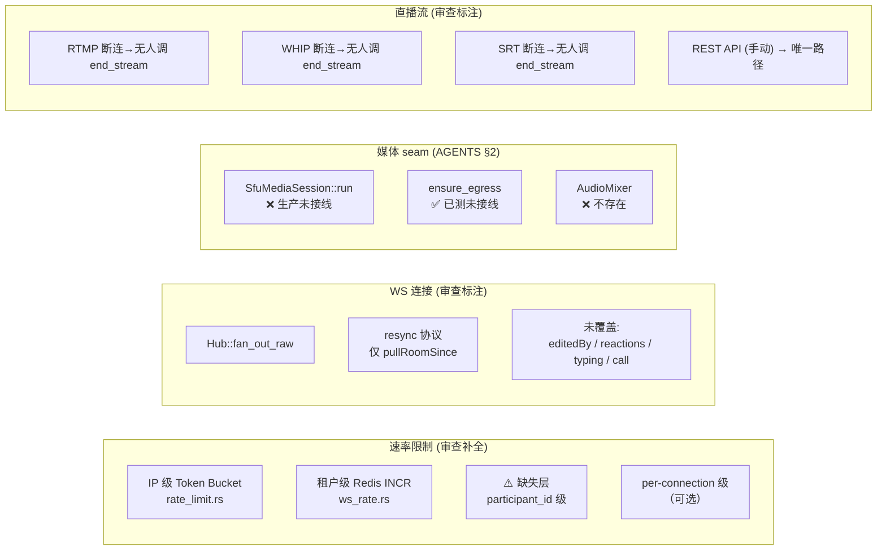

# 架构深度分析报告

> 基于 Aero IM 项目现场审查结论，聚焦架构层面的评估与演进建议。
> 上下文锚点：`AGENTS.md`、`ws_rate.rs`、`hub.rs`、`calls.js`、`sfu_media.rs`、`call_bridge_supervisor.rs`。

---

## 1. 架构评估

### 1.1 当前架构的优势

| 维度 | 评价 | 证据 |
|------|------|------|
| **事件溯源骨架** | NATS JetStream 作为跨实例事实源是正确选择——durable consumer 提供 at-least-once 保证，ephemeral consumer 容忍丢数据的场景（直播弹幕）用两种 consumer 类型自然隔离 | `bus.rs` 双 listener 设计 |
| **crate 分层** | 依赖自下而上单向、无环。`aero-common` 叶子化隔离核心模型，`aero-bus`/`aero-storage` 独立可替换 | `Cargo.toml` 拓扑 |
| **Hub 扇出模型** | 级联背压（NATS→bounded mpsc→WebSocket），单进程内不做跨进程扇出，水平扩展只需开实例 | `hub.rs` `fan_out_raw` |
| **Redis 集群状态** | 用 sorted-set + TTL 做 presence/viewer/roster —— 比 in-process 更可靠（实例重启不丢），比 NATS KV 更适合排序/范围查询场景 | `live_presence.rs`、`CallRosterStore` |
| **Agent/Bot 模式** | 总线驱动的 sidecar bot 架构天然支持功能异步扩展，每 bot 独立 consumer group 或 queue group，互不阻塞 | 8 个 bot（agent/ooo/unfurl/transcribe/golive/push/moderation + AiWorker） |

### 1.2 关键架构债务

#### ① **限流层缺失 participant 维度（P0 债务）**

审查确认：当前三层限流是 **IP 级 → workspace 级**，中间缺少 **participant_id 级**。这不是"per-connection 配额被绕过"，而是**根本没有单用户速率门控**。

```
现状：
  HTTP 全局 (20 req/s per IP)
    → 租户级 (per workspace, Redis INCR)
      → (空档) ← 同一用户 N 个 WS 连接可以 N× 放大

应有：
  HTTP 全局 (20 req/s per IP)
    → 租户级 (per workspace, Redis INCR)
      → participant 级 (per user_id, token bucket, 独立于连接数)
        → per-connection 级 (可选, 防止单连接洪泛)
```

影响面：**每个多标签页用户都可以在 WS 上产生 N× 基准速率的消息**。如果 workspace 级限流是 1200/min 聚合型，10 个连接的用户能打 1200/min 的单人消息。

#### ② **SFU 媒体面为 seam（P1 债务）**

`AGENTS.md` §2 明确标注：`sfu_media.rs` 的 `run()` **生产无实例化**，`call_bridge_supervisor.rs` 的 `ensure_egress` **已建+单测但生产未接线**。这不是小缝——整个通话架构的未来演进路径（从 P2P mesh 到 SFU 转发）依赖此组件上线。

更关键的是：**当前 P2P mesh 模式下的音频优化（如 VAD 过滤）在 SFU 上线后可能需要重做**。这意味着方向四的任何短期方案都需要考虑 SFU 迁移后的兼容性。

#### ③ **WS 连接状态恢复协议不足（P1 债务）**

当前 `resync` 机制仅有 `pullRoomSince` 一个动作（`hub.rs:44`），丢失场景覆盖不完整：
- 方向二中已列出的：`reactions`、`editedBy`、`typing`、`read receipts`、`call state`
- 审查补充遗漏：**`state.editedBy` / 编辑者可见性** 在丢帧期间不可恢复

深层问题：**没有"连接会话"的概念**——每次重连都是"拉取自某个 cursor 的全部消息"，而非"恢复某次会话的完整状态机"。这导致：
1. 大房间每次 resync O(room_size) 全量拉取
2. 非消息状态（reactions / typing / call）依赖 UI 侧兜底刷新
3. 没有增量同步能力

#### ④ **直播推流生命周期管理缺失统一的信号路径（P1 债务）**

三种摄入协议各自独立处理断开：

| 协议 | 检测方式 | 当前后果 |
|------|---------|---------|
| RTMP | `rml_rtmp` 连接断开 | 无人调 `end_stream` |
| WHIP | `WhipSession::run` 返回 `Ok(())` | 无人调 `end_stream` |
| SRT | `SrtIngest::pump` 退出 | 无人调 `end_stream` |
| REST（唯一现有路径） | `POST /api/streams/:id/end` | 依赖推流者手动调用 |

这是一个**跨协议的统一抽象缺失**：LiveIngest trait 定义了摄入接口，但没有对应的"断开回调"或"生命周期钩子"。审查提出的"兜底超时"方案（修复方向 4）确实最实用——但架构层面更优解是让 `LiveIngest` 在 `pump()` 退出时自动触发 `end_stream`，而非依赖定时器。

---

### 1.3 架构拓扑图（修正版）

基于审查发现，修正 DAG 中的关键缺口：



---

## 2. 高价值架构扩展方向

### 方向 A：Participant 级速率限制 + 统一限流框架

**为什么需要**：审查确认当前限流在 participant 维度缺位，这是安全架构的显性缺陷。多连接攻击向量已可被利用。

**核心挑战**：
- **在 WS 路径中提取 participant_id**：WS 握手时已完成 JWT 鉴权，但 `ws_rate.rs` 当前只认 workspace_id。需要在 WS 建立时绑定 `(connection_id, participant_id)` 映射。
- **分布式限流的一致性开销**：participant 级限流如果走 Redis（正确选择），每消息增加 1-2 RTT 延迟；如果放松到 per-connection 在内存中做（低延迟），则跨连接无法聚合。
- **异常情况**：连接断线重连后，限流状态是否需要保持？如果保持（防绕行），需要 Redis 持久化；如果不保持（重置配额），重连可绕过。

**架构变更**：

```
当前：ip → workspace
目标：ip → user → workspace → (可选)connection
       ↑ 新增层
```

建议采用 **Redis Lua + 本地 token bucket 混合**：
- 每消息先过本地内存桶（0 RTT，粗粒度 burst）
- 达到阈值后再问 Redis 滑动窗口（精确计数，防绕过）
- Lua 脚本保证原子性，`EVALSHA` 缓存脚本

**影响范围**：
- 新增模块：`server/src/rate_limit_participant.rs`（或合入 `ws_rate.rs`）
- 修改：`ws_impl/handler.rs`（每个 WS 消息处理路径挂载限流检查）
- 配置：新增 `AERO__RATE_LIMIT__PARTICIPANT_PER_SEC` / `AERO__RATE_LIMIT__PARTICIPANT_BURST`

**选项对比**：

| 方案 | 延迟 | 一致性 | 实现复杂度 |
|------|------|--------|-----------|
| **A1: 全 Redis Lua**（推荐） | +1 RTT/msg | 强一致，跨实例精确 | 中 |
| **A2: 内存桶 + 异步 Redis 同步** | 0 RTT（正常） | 最终一致，重启丢失 | 高 |
| **A3: 纯内存 per-connection** | 0 RTT | 不跨连接聚合 | 低（短期快速修复） |

**建议**：A3 作为 P0 快速修复（2-3 天），A1 作为 P1 长期方案（2 周）。

---

### 方向 B：WS 连接会话恢复协议

**为什么需要**：当前 `resync` / `pullRoomSince` 模型仅恢复消息流，不恢复非消息状态。在丢包率 1-5% 的典型互联网环境下，用户每分钟都可能遇到状态碎片。

**核心挑战**：
- **状态快照体积**：大房间（500+ 人）的 typing / reactions / call roster 全量同步可能达到数十 KB，每秒快照不可行。
- **增量协议的复杂性**：需要区分"全量同步"和"增量更新"两种模式，且客户端需要有能力合并两者。
- **向后兼容**：现有客户端不发送版本号/会话 ID，协议升级必须兼容旧客户端。

**架构变更**：

引入 **`SessionSnapshot`** 概念：

```
连接建立 → server 产生 session_id → 全量推送 snapshot
正常通信 → 增量帧更新 snapshot (version bump)
断线重连 → 客户端带 session_id 请求增量 (since_version)
           → server 回复 diff 或完整 snapshot
重连后   → 重新走全量流程 (session_id 过期)
```

**影响范围**：
- 新增：`ws/session.rs`（session 状态机）+ `Snapshot` room-level state
- 修改：`hub.rs`（将状态写入改为「写 + version incr」双动作）
- 客户端：`ws/core.js` 的 `handleResync` 需升级为增量合并
- **Redis 存储**：session snapshot 可存 Redis hash，`HGETALL` 全量 / `HDEL` 增量

**风险**：
- 引入 session 状态后，**内存占用**在大量连接场景下需要考虑（每个 room 一个 snapshot）
- 懒加载策略：只对最近 5 分钟内有人活跃的房间维护 snapshot

**建议优先级**：P1（方向 A 之后）。短期可先补充 `editedBy`、`reactions` 等缺失状态的独立 API 端点——审查已指出现有 `reactions_batch` 端点对不可见消息无效，需要改造成"按 room + cursor 拉取当前全量状态"。

---

### 方向 C：流媒体生命周期统一管理

**为什么需要**：三种摄入（RTMP/WHIP/SRT）的断连检测缺失统一抽象，目前唯一关闭路径是 REST API，这在生产环境中不可接受——主播断网后流状态永远停留在 "LIVE"。

**核心挑战**：
- **各协议断连事件形态不同**：RTMP 是 TCP FIN/RST，WHIP 是 str0m session 结束，SRT 是 UDP timeout
- **假死检测**：网络抖动后摄像头黑屏但 TCP 连接未断，需应用层 keepalive
- **与 HLS 的关系**：HLS writer finalize 是流结束的重要信号，但当前不反哺 stream status

**架构变更**：

引入 **`StreamLifecycle` trait**：

```rust
trait StreamLifecycle: Send + Sync {
    /// 流开始时的回调
    fn on_start(&self, stream_id: StreamId) -> impl Future<Output = ()>;
    /// 流结束时的回调（无论原因）
    fn on_end(&self, stream_id: StreamId, reason: EndReason) -> impl Future<Output = ()>;
    /// 健康检查（可选，用于假死检测）
    fn on_heartbeat(&self, stream_id: StreamId) -> impl Future<Output = ()>;
}
```

- RTMP 接入：`rml_rtmp` 的 `on_close` 中调用 `on_end`
- WHIP 接入：`WhipSession::run` 返回后调用 `on_end`
- SRT 接入：`SrtIngest::pump` 退出后调用 `on_end`
- 兜底超时：独立 timer 轮询 `last_heartbeat`，超时则 `on_end(Timeout)`

**不引入新依赖**：全部现有代码基础上加 trait + 实现。

**影响范围**：
- 新增：`aero-live-core/src/stream_lifecycle.rs`
- 修改：RTMP/WHIP/SRT 各自的 pump/run 退出路径
- 配置：`AERO__STREAM__IDLE_TIMEOUT_SECS`（兜底超时阈值）

**建议优先级**：P1。方向 C 与审查的修复方向 4 吻合，且技术风险低——主要是添加回调钩子，不改现有逻辑。

---

### 方向 D：音频处理阶段性策略

**为什么需要**：审查确认方向四（音频混音）的问题真实存在，但当前 SFU 未接线，P2P mesh 下服务端混音无意义。需要一个分阶段路线图。

**阶段划分**：

| 阶段 | 方案 | 适用场景 | 工程成本 | 前置条件 |
|------|------|---------|---------|---------|
| **D1: VAD 选择性转发** | RTP 级别判断 DTX/VAD，丢弃静默包 | SFU 上线前即可用，改善 20 人以下场景带宽 | ~1 周 | 无 |
| **D2: SFU 完全接线** | `SfuMediaSession::run` 生产接入 + `CallBridge` 集成 | 跨节点 SFU 运营 | ~4 周 | str0m 验证 + 端到端测试 |
| **D3: 服务端 MCU 混音** | Opus decode→PCM remix→encode（选择性/全员混） | 大型会议（50+ 人），需降低客户端解码路数 | ~4-6 周 | D2 完成后，且需 n 路 Opus decode 并行 |

**核心挑战**（D3）：
- Opus 解码延迟 ~5ms（decode）+ 混音 ~1ms + Opus 编码 ~20ms（CELT 帧对齐）= **~26ms 算法延迟最小阈值**
- 不同采样率（16kHz/48kHz）需 resampling（libspeexdsp 或 SSE 优化）
- DTX 帧（静默）需平滑过渡，不能产生 pop/click 噪音
- 立体声需降混为单声道再 remix（否则相位抵消）

**不建议自建**：Opus decode/encode 用 `opus` crate（Rust bindings to libopus），混音核心逻辑简单（加权平均 + 防溢出），不必引入外部服务。

**建议优先级**：D1(P1) → D2(P0-1) → D3(P2)。D2（SFU 接线）是 D3 的前提，D1 可以在 D2 之前落地。

---

### 方向 E：架构级可观测性与安全审计

**为什么需要**：项目已有 prometheus gauge 采样器（DB 池/WHIP/AI DLQ/NATS backlog），但缺的是 **端到端事件追踪** 和 **安全相关审计日志**。

**核心挑战**：
- 分布式追踪需要全局 `trace_id` 传播（请求→NATS→bot→WS），当前 `x-request-id` 只在 HTTP 响应头存在
- rate limit 违规和拒绝事件缺少结构化日志（当前只有 `console.warn` 级别）
- WS 丢帧无法量化（不知道用户实际经历多少状态碎片）

**建议引入**：
1. **OpenTelemetry SDK**（`opentelemetry` + `opentelemetry-otlp`）：现有 telemetry 基础设施可扩展
2. **安全审计事件类型**：限流拒绝（rate_limit_denied）、鉴权失败（auth_failed）、非法 WS 帧（invalid_frame）
3. **WS 丢帧计数器**：`hub` 侧统计 `messages_dropped`、`resyncs_triggered`，作为 Prometheus `HISTOGRAM` 发布

**架构变更**：
- 新增：`aero-common/src/telemetry/events.rs`（审计事件类型 + `emit_audit_event()`）
- 修改：rate_limit 拒绝路径、WS 鉴权失败路径、hub 丢帧路径
- 依赖：`opentelemetry` crate（`aero-common` 可选依赖，`AERO_OTLP_ENDPOINT` 启停）

**建议优先级**：P2。不影响核心功能，但长期不可或缺。

---

## 3. 接口设计建议

### 3.1 限流层接口抽象

当前限流是"if-else 链"风格，建议提取为 **`RateLimiter` trait**，支持链式组合：

```rust
#[async_trait]
trait RateLimiter {
    /// 返回 Ok(()) 或 Err(RetryAfter)
    async fn check(
        &self,
        ctx: &RateLimitContext, // 含 ip / participant_id / workspace_id / action
    ) -> Result<(), RateLimitExceeded>;
}
```

**实现链**：`IpLimiter → ParticipantLimiter → WorkspaceLimiter → ConnectionLimiter`

每层 `check()` 返回 `Err` 则短路拒绝。这样做的好处：
- 新增层只需实现 trait 并接入链
- 测试时可用 `NoopLimiter` 替换
- 配置驱动（`rate_limiter_config.rs` 决定启动哪些层）

### 3.2 流生命周期接口

抽象 `LiveIngest` 的对称接口——当前只有"开始"（`pump`/`run`），缺少"结束"回调：

```rust
#[async_trait]
trait StreamLifecycle {
    async fn notify_start(&self, id: StreamId);
    async fn notify_end(&self, id: StreamId, reason: EndReason);
    async fn notify_heartbeat(&self, id: StreamId);
}
```

**注意向后兼容**：现有 `LiveIngest` 实现只需在 pump/run 退出路径加一行 `.notify_end()`，不需要改 trait 本身。

### 3.3 连接会话接口

如果实施方向 B，WS 连接协议需要升级。关键接口设计原则：

```
Client → Server: 
  frame.type = "reconnect"
  frame.session_id = "uuid..."
  frame.last_seq = 12345

Server → Client:
  frame.type = "snapshot"
  frame.seq = 12346
  frame.since = 12345
  frame.state = { reactions: [...], typing: [...], ... }
  frame.delta = true  // true=增量 false=全量
```

**保持向后兼容**：客户端不发送 `session_id` 时，server 按现有 `pullRoomSince` 模型运行。新客户端带 `session_id` 则使用 snapshot 协议。

---

## 4. 技术选型

### 4.1 不需要新框架/基础设施

五个方向中，**没有哪个需要引入全新的基础设施**：

| 方向 | 可能需要的新依赖 | 评估 |
|------|-----------------|------|
| A (限流) | 无。Redis + Lua 已就绪 | 已有 `fred` Redis 客户端 |
| B (会话) | 无。纯协议升级 | 无需新 crate |
| C (生命周期) | 无。trait + callback | 纯 Rust 代码 |
| D (音频) | `opus` crate（非 GPL，BSD-licensed bindings）| 可选，D3 才需要；D1 仅需 RTP header 解析 |
| E (可观测) | `opentelemetry` + `opentelemetry-otlp` | 可选，轻量 |

### 4.2 opus crate 的评估标准

如果实施 D3（MCU 混音），`opus` 依赖的选择标准：

- **许可证兼容**：`opus` crate 是 MIT/Apache-2.0，libopus 是 BSD-3-Clause，均与项目兼容
- **纯 Rust vs C binding**：`opus` crate 是 C binding（`*-sys`），比纯 Rust 实现更稳定；Rust 纯实现 `audiopus` 尚在发展中
- **替代方案**：如果不想引入 C 编译依赖，可以用 `libpulse-simple-binding` 走 PulseAudio 混音（但引入更大外部依赖，不推荐）

**建议**：D3 阶段引入 `opus` crate。D1 阶段不需要。

### 4.3 OpenTelemetry 集成评估

- **已有基础**：项目已有 `aero-common/src/telemetry/` 和 prometheus gauge 采样器
- **增量成本**：加 `opentelemetry` + `opentelemetry-otlp` 两个 crate，约 50KB 编译增量
- **配置门控**：`AERO_OTLP_ENDPOINT` 缺省未设则不初始化 exporter——零开销空跑
- **风险**：OTLP exporter 可能背压（网络问题）。需用 `OTEL_BSP_SCHEDULE_DELAY` + `OTEL_BSP_MAX_EXPORT_BATCH_SIZE` 调教

---

## 5. 实施路线图

### 5.1 优先级矩阵

| 方向 | 优先级 | 理由 | 预估周期 | 前置依赖 |
|------|--------|------|---------|---------|
| **A1: per-participant 限流（短期）** | **P0** | 安全缺陷，无需 Redis Lua，per-connection 内存桶 2-3 天可上线 | ~3 天 | 无 |
| **D2: SFU 接线** | **P0-1** | 整个通话未来架构的基础，当前 seam 状态阻塞后续音频优化 | ~4 周 | str0m 端到端验证 |
| **B: 连接会话恢复** | **P1** | 提升用户体验但非安全缺陷 | ~2 周 | 无 |
| **C: 流生命周期管理** | **P1** | 直播场景可靠性缺陷 | ~1 周 | 无 |
| **A2: Redis 全分布式限流** | **P1** | A1 的长期替代方案 | ~2 周 | 无 |
| **D1: VAD 选择性转发** | **P1** | 改善带宽利用，SFU 前即可落地 | ~1 周 | 无 |
| **E: 架构可观测性** | **P2** | 长期工程改进 | ~1-2 周 | 无 |
| **D3: MCU 混音** | **P2** | 依赖 D2，且在大规模场景才必要 | ~4-6 周 | D2 |

### 5.2 阶段划分

#### 阶段 1：安全与可靠性加固（P0，~2 周）

```
Week 1:
  ├─ per-connection 内存桶限流 (A1)
  │    └─ ws_impl handler 挂载检查、配置项
  └─ 流生命周期 trait + 三种摄入接入 (C)
       └─ 兜底超时定时器

Week 2:
  └─ SFU 生产接线 (D2)
       ├─ SfuMediaSession bind/run 从 test 移至 boot
       └─ CallBridge ensure_egress 接线 + e2e 测试
```

**里程碑 M1**：安全缺陷修复 + SFU 最低可用 + 直播断连自动检测。

#### 阶段 2：体验与容量（P1，~4 周）

```
Week 3-4:
  ├─ 连接会话恢复协议设计 + 实现 (B)
  │    └─ session snapshot 增量同步
  └─ VAD 选择性转发 (D1)
       └─ RTP payload type 98 (telephone-event) / DTX 检测

Week 5-6:
  ├─ Redis 全分布式 participant 限流 (A2)
  └─ 会话恢复的 web 端适配 (B)
```

**里程碑 M2**：WS 重连后状态完整恢复 + 单用户多连接限流精确到位 + 音频带宽优化。

#### 阶段 3：性能与运维（P2，~2 周）

```
Week 7-8:
  ├─ OpenTelemetry 集成 (E)
  │    └─ 审计事件 + 分布式追踪 + WS 丢帧量化
  └─ MCU 混音设计与原型 (D3)
       └─ Opus decode→mix→encode 管线原型
```

**里程碑 M3**：全链路可观测 + MCU 混音可行性验证。

### 5.3 风险点与缓解策略

| 风险 | 概率 | 影响 | 缓解策略 |
|------|------|------|---------|
| **SFU 端到端测试发现 str0m 版本兼容问题** | 中 | 高——阻塞 D2 和整个通话演进 | 在阶段 1 前做 str0m 兼容性 POC（1 天），确认可配对真实浏览器 |
| **per-connection 限流上线后误杀正常用户** | 低 | 中 | 先以 `warn` 模式灰度（记录日志不阻断），观察误判率后切换 `deny` |
| **会话恢复协议增加 WS 帧体积** | 中 | 低 | 增量 diff 策略保证首次全量后只有小 diff；配置 snapshot TTL 控制内存 |
| **Opus decode→encode 延迟超出预期（D3）** | 中 | 中——音频质量下降 | 先做原型验证延迟预算；预留「纯 RTP 时间戳重映射」作为降级方案（不做 decode） |
| **OpenTelemetry exporter 背压阻塞主线程** | 低 | 中 | 使用 `OTEL_BSP_SCHEDULE_DELAY` + 独立 tokio task 隔离 exporter |

---

## 6. 总结：架构师的裁决

### 对原始分析的修正确认

| 审查点 | 裁决 | 架构影响 |
|--------|------|---------|
| 方向五论证路径有误（KeyedCostBudget 不存在于 ws_rate.rs） | **采纳** | 修正后论证更清晰——缺口是 participant 维度而非 connection 维度 |
| 方向四缺少工程成本标注（VAD vs MCU 双阶段） | **采纳** | 架构路线图需区分两阶段 |
| 方向二遗漏 `editedBy` | **采纳** | 补充入 session snapshot 状态清单 |
| 方法论数字偏差（155→307） | **采纳** | 不影响架构判断，但降低文档可信度 |

### 最终架构优先级建议

```
┌────────────────────────────────────┐
│  P0 (立即)                          │
│  ├── per-connection 限流 (A1)       │ ← 安全缺口，2-3 天可修
│  └── 流生命周期 callback (C)       │ ← 可靠性缺口，1 周
├────────────────────────────────────┤
│  P0-1 (短期)                        │
│  └── SFU 生产接线 (D2)             │ ← 架构 seam，4 周
├────────────────────────────────────┤
│  P1 (中期)                          │
│  ├── 分布式 participant 限流 (A2)   │
│  ├── 连接会话恢复 (B)              │
│  └── VAD 选择性转发 (D1)           │
├────────────────────────────────────┤
│  P2 (长期)                          │
│  ├── 可观测性 (E)                  │
│  └── MCU 混音 (D3)                │
└────────────────────────────────────┘
```

**核心原则**：先修安全，再解 seam，最后做体验优化。限流是防守，SFU 是进攻——两者都优先于会话恢复和音频混音。
