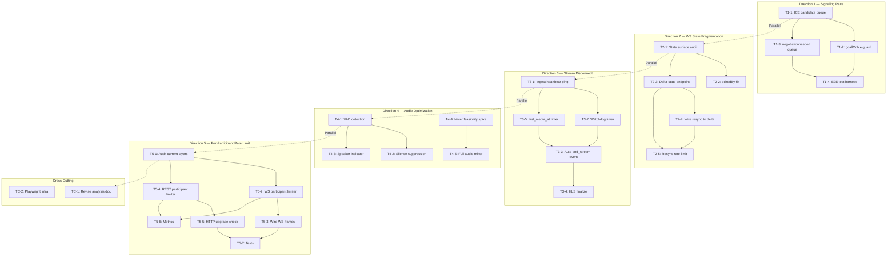
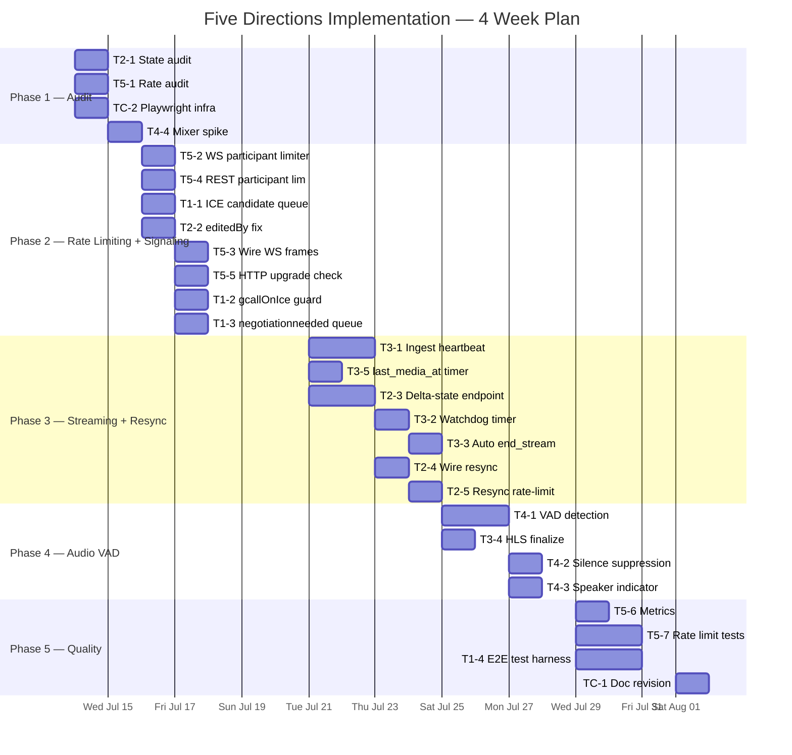

Now I have sufficient context across the codebase. Let me produce the comprehensive Tech Lead analysis.

---

# Tech Lead Analysis: Five Technical Directions for Aero IM

## 1. Task Decomposition

Each direction is broken into tasks sized 2–4 hours. Tasks are ordered by the dependency chain within each direction.

---

### Direction 1: Group Call Signaling Race Conditions

| ID | Title | Files | Dependencies | Est. | Acceptance Criteria |
|-----|-------|-------|-------------|------|-------------------|
| **T1-1** | Add ICE candidate queue with offer-drain | `web/calls.js` | None | 3h | ICE candidates received before `setRemoteDescription` are buffered and applied once signalingState is `stable` or `have-remote-offer`. Tested via manual browser pair + injected latency. |
| **T1-2** | Add `signalingState` stable check + retry in `gcallOnIce` | `web/calls.js` | T1-1 | 2h | `gcallOnIce` checks `entry.pc.signalingState` before `addIceCandidate`; if not ready, queues candidate. Queue flushed on `oniceconnectionstatechange` / `setRemoteDescription` callback. |
| **T1-3** | Fix `negotiationneeded` guard to queue re-offer | `web/calls.js` | T1-1 | 2h | When `signalingState !== 'stable'`, the `gcallRenegotiate` defers the offer to a pending queue instead of no-op dropping it. Retries after ongoing negotiation completes. |
| **T1-4** | Add E2E integration test harness for mesh call signaling | `crates/aero-server/tests/`, `playwright/` | T1-1, T1-2, T1-3 | 4h | Node.js script creates two WS connections, simulates group call offer/answer/ICE with artificial delay, verifies no `InvalidStateError` (caught). Documents the SFU migration as root fix in code comments. |

**Group A: Web signaling fixes (T1-1, T1-2, T1-3)** can be done in parallel by one frontend engineer. **T1-4** is sequential and requires infra.

---

### Direction 2: WS Frame Drop → State Fragmentation

| ID | Title | Files | Dependencies | Est. | Acceptance Criteria |
|-----|-------|-------|-------------|------|-------------------|
| **T2-1** | Audit full client state surface for resync gaps | `web/render.js`, `web/calls.js`, `web/ws.js`, `web/notifications.js` | None | 3h | Produces a documented list of all client state surfaces that can drift during a drop episode (messages, reactions, read receipts, typing, presence, editedBy, call state, streaming state). |
| **T2-2** | Add `state.editedBy` re-sync to `pullRoomSince` handler | `web/render.js`, `web/ws.js` | T2-1 | 2h | After resync, all edited messages in the re-fetched window have correct `editedBy` populated. Verifiable by injecting edited messages then triggering resync. |
| **T2-3** | Implement incremental full-state endpoint for large rooms | `crates/aero-server/src/routes/`, `crates/aero-storage/src/` | T2-1 | 4h | New REST endpoint `GET /api/rooms/:id/state?since=<seq>` returns delta of all state surfaces (not just messages) since a seq cursor. Capped at 500KB response. Includes messages, reactions, edits, typing, read receipts, polls. |
| **T2-4** | Wire resync handler to call delta-state endpoint | `web/ws.js`, `web/api.js` | T2-3 | 2h | `handleResync` now calls the delta-state endpoint after `pullRoomSince` to patch non-message state. All surfaces from T2-1 are covered. |
| **T2-5** | Add rate-limit and dedup to resync requests | `crates/aero-server/src/ws_rate.rs` + resync handler | T2-3 | 2h | Client cannot trigger resync more than once per 5 seconds per room. Resync during an active loss episode is idempotent (skipped if no gap). |

**T2-1** is a prerequisite for the rest. **T2-2** is quick and independent. **T2-3/T2-4** are the main work. **T2-5** is a safety measure.

---

### Direction 3: Live Streaming Disconnection Detection

| ID | Title | Files | Dependencies | Est. | Acceptance Criteria |
|-----|-------|-------|-------------|------|-------------------|
| **T3-1** | Add stream heartbeat ping from ingest to server | `crates/aero-live-whip/src/session.rs`, `crates/aero-live-rtmp/src/`, `crates/aero-live-srt/src/` | None | 4h | Each ingest type (WHIP/RTMP/SRT) sends periodic keep-alive pings to the server. Missed ping within configurable timeout (default 30s) triggers disconnection path. Per-ingest-type trait method. |
| **T3-2** | Implement watchdog timer per active stream | `crates/aero-server/src/live.rs`, `crates/aero-storage/src/stream_route.rs` | T3-1 | 3h | In-process `CancellationToken`-based watchdog per stream. On creation, spawns timer; on heartbeat, resets timer; on expiry, calls `end_stream`. Singleton per (stream_id, node), guarded by Redis lock. |
| **T3-3** | Emit `StreamEvent::Status { Ended }` on watchdog expiry | `crates/aero-server/src/live.rs` | T3-2 | 2h | `end_stream` is called automatically when watchdog fires. The event is published to `live.stream.{id}` NATS subject. Status is durably persisted. |
| **T3-4** | Add HLS finalize on stream end | `crates/aero-live-hls/src/`, `crates/aero-live-whip/src/hls_sink.rs` | T3-3 | 2h | When stream ends (either manual or watchdog), HLS writer finalizes manifest and flushes. UI "LIVE" tag is removed when `StreamStatus::Ended` is received. |
| **T3-5** | Add `last_media_at` tracking + stale detection timer | `crates/aero-server/src/live.rs`, migration for `streams.last_media_at` | T3-1 | 3h | Tracks the wall-clock time of the last RTP packet. A separate timer (configurable, default 120s) marks stream as ended if no media received. Complements ping-based detection for "silent freeze" case. |

**T3-1** requires changes in 3 ingest crates — this is the most spread-out task. **T3-2** and **T3-3** are server-side wiring. **T3-4** is an important UX fix. **T3-5** is a safety net on top.

---

### Direction 4: SFU Audio Optimization

| ID | Title | Files | Dependencies | Est. | Acceptance Criteria |
|-----|-------|-------|-------------|------|-------------------|
| **T4-1** | Add VAD (Voice Activity Detection) on incoming audio RTP | `crates/aero-live-webrtc/src/forward/mod.rs`, `crates/aero-live-webrtc/src/vad/` (new) | None | 4h | Uses a lightweight energy-based or WebRTC-VAD algorithm on decoded Opus frames. Output: `is_speech` boolean per RTP packet. No decode/encode — works via RTP header extensions or energy heuristics. |
| **T4-2** | Add selective forwarding: silence suppression per subscriber | `crates/aero-live-webrtc/src/forward/mod.rs` | T4-1 | 3h | `SfuForwarder::on_rtp` checks VAD. For non-speech packets, skip forwarding to subscribers who haven't explicitly opted into background audio. Configurable per-call. Default on for calls >4 participants. |
| **T4-3** | Add per-subscriber audio activity indicator (who's talking) | `crates/aero-live-webrtc/src/`, `web/calls.js`, `web/render.js` | T4-1 | 3h | VAD output is forwarded as a lightweight signal (JSON frame via WS data channel) so the UI can show "Speaker indicator" per participant. Bandwidth: ≤1 msg/sec/participant. |
| **T4-4** | Feasibility spike: Opus decode → PCM mix → Opus encode | `crates/aero-live-webrtc/src/mixer/` (new crate/subsystem) | None | 4h | A self-contained spike that benchmarks end-to-end latency of decode-mix-encode pipeline. 3 participants → 10 participants → 20 participants. Documents latency budget (target: <20ms p99), memory, CPU. Decision gate: proceed or defer. |
| **T4-5** | (Conditional) Implement server-side audio mixer | `crates/aero-live-webrtc/src/mixer/` | T4-4 (gate: must show <20ms latency) | 12h | Full Opus decode → sample-rate conversion → PCM mixing → Opus re-encode per subscribed mix. Supports N-1 mixes per call. Handles DTX (Comfort Noise Generation), volume normalization, resampling. |

**Key decision**: T4-1 through T4-3 are **short-term wins** (VAD-based silence suppression — ~2 weeks). T4-4/T4-5 are **long-term MCU** (server-side mixing — ~3-4 weeks, conditional). Recommend implementing T4-1 through T4-3 first, deferring T4-5 to post-SFU-production stabilization.

---

### Direction 5: Per-Participant Rate Limiting

| ID | Title | Files | Dependencies | Est. | Acceptance Criteria |
|-----|-------|-------|-------------|------|-------------------|
| **T5-1** | Design audit of existing rate limiting layers | `crates/aero-server/src/rate_limit.rs`, `crates/aero-storage/src/ws_rate.rs`, `crates/aero-server/src/ws/ws_impl/` | None | 2h | Documented current state: HTTP IP token bucket (rate_limit.rs), workspace Redis INCR (ws_rate.rs), AI budget (budget.rs). Identifies per-participant gap. |
| **T5-2** | Implement per-participant WS rate limiter | `crates/aero-server/src/ws_rate.rs` (new), or extend `rate_limit.rs` | T5-1 | 4h | Per `ParticipantId` token bucket with configurable rate (default 60 req/min). Shared across all WS connections of the same user. Implemented as a `DashMap<ParticipantId, Bucket>` — same pattern as existing `RateLimiter`. |
| **T5-3** | Wire per-participant limiter into WS frame processing | `crates/aero-server/src/ws/ws_impl/` | T5-2 | 2h | Every WS `send_message` frame checks per-participant bucket before processing. Returns `RateLimited` frame on exceed. Metrics: `rate_limit_participant_hits_total`. |
| **T5-4** | Add per-participant REST rate limiting | `crates/aero-server/src/rate_limit.rs` | T5-1 | 3h | Extend existing `RateLimiter` to use `ParticipantId` keys alongside IP keys. Authenticated requests get participant-level bucket with higher limit (e.g., 120 req/min) vs. anonymous IP limit. |
| **T5-5** | Add per-participant limit to WS `rate_limit.rs` for HTTP→WS upgrade path | `crates/aero-server/src/rate_limit.rs` | T5-4 | 2h | The WebSocket upgrade HTTP request is also checked against per-participant rate limit. Prevents rapid reconnect/upgrade cycling. |
| **T5-6** | Add metrics dashboard for rate limit hit rates by layer | `crates/aero-server/src/metrics.rs` or `observability.rs` | T5-2, T5-4 | 2h | Prometheus counters for each layer: `http_ip_blocked`, `ws_participant_blocked`, `ws_workspace_blocked`. Gauge for active participant buckets in memory. |
| **T5-7** | Write unit/integration tests for each layer | `crates/aero-server/src/rate_limit.rs` (db_tests), `crates/aero-server/tests/` | T5-2, T5-4 | 3h | Tests: 1) Per-participant bucket refills correctly. 2) Multiple connections share the same bucket. 3) Exceeding limit returns 429/frame. 4) Workspace limits still work when participant limits added. 5) Redis fail-open. |

**T5-1** is a fast audit. **T5-2** and **T5-4** are the two main implementation tasks (WS + HTTP). **T5-3/T5-5** wire them in. **T5-6/T5-7** round out observability and quality.

---

### Cross-Cutting Tasks

| ID | Title | Files | Dependencies | Est. | Acceptance Criteria |
|-----|-------|-------|-------------|------|-------------------|
| **TC-1** | Revise the originating analysis document | `docs/requirements/2026-07-11-analysis-*.md` | T5-1 (for corrected direction 5), all other task completion | 3h | Numbers corrected (155→307), coverage statements updated, direction 5 rewritten with correct technical basis, direction 4 split into VAD vs MCU phases, direction 2 adds editedBy gap. |
| **TC-2** | Set up Playwright E2E test framework for WebRTC + WS | `web/tests/`, `docker-compose.yml` | None | 4h | Minimal setup with Chromium playwright, mock WebRTC peer, WS client within test. Verifies signaling flow and WS reconnect logic headlessly. Base for T1-4. |

---

## 2. Execution Order — Task Dependency Graph



### Parallelization Groups

| Group | Directions | Tasks | Engineers |
|-------|-----------|-------|-----------|
| **Group A** (Web/Call) | D1 + D2 frontend | T1-1, T1-2, T1-3, T2-2 | 1 frontend |
| **Group B** (Streaming) | D3 pump + server | T3-1, T3-2, T3-5 | 1 backend (media) |
| **Group C** (Rate Limiting) | D5 audit + implementation | T5-1, T5-2, T5-4 | 1 backend (infra) |
| **Group D** (Audio/SFU) | D4 VAD + spike | T4-1, T4-4 | 1 backend (media/SFU) |
| **Group E** (Web full-state) | D2 server + web | T2-3, T2-4, T2-5 | 1 full-stack |

Groups A–E can start **concurrently** after the initial audit reads.

---

## 3. Technical Risks

### 3.1 High-Risk Items

| Risk | Direction | Impact | Mitigation |
|------|-----------|--------|------------|
| **ICE candidate ordering cannot be fully solved without SFU** | D1 | Workaround on web only; mesh inherently race-prone | Do not over-invest. Document that migration to SFU is the root fix. Limit web-side work to queue + retry (T1-1..3 ≈ 7h). |
| **Delta-state endpoint (T2-3) could be expensive for large rooms** | D2 | O(room_size) response for rooms with 10K+ messages | Design as cursor-based pagination with 500KB cap. Use `seq` index (already exists). Include only "active" state (reactions since last read, etc.). Benchmark with 10K-message fixture in tests. |
| **RTMP/SRT dependency for heartbeat (T3-1)** | D3 | rml_rtmp may not expose clean lifecycle hooks; SRT is custom handshake | For RTMP: use connection-level ping (AMSF `_checkbw`). For SRT: use custom "live" flag extension in HSv5. If hooks unavailable, fall back to T3-5 (media-heartbeat) as primary, making ping-based detection an optimization. |
| **VAD accuracy on server-opus decoded stream (T4-1)** | D4 | False positives/negatives in non-speech detection | Ship with conservative threshold (bias toward false positive = include). Add per-call config (on/off/sensitivity). Use WebRTC-VAD for initial impl — well-tested in production across millions of calls. |
| **Per-participant limiter bypass via token cycling (T5-2)** | D5 | Attacker creates many accounts | Rate limit account creation (already exists via login throttle). Per-participant limits are not a complete abuse solution—workspace-level (ws_rate.rs) is the hard ceiling. |
| **Per-participant DashMap memory growth (T5-2)** | D5 | Memory leak from stale participant entries | Same technique as existing rate_limit.rs: periodic sweep (every 60s) removes buckets that have been idle >5min. Use `Arc<DashMap>` for cheap clone. Guarantee bounded growth. |

### 3.2 External Dependencies

| Dependency | Direction | Notes |
|------------|-----------|-------|
| **rml_rtmp** (RTMP crate) | D3 | If upstream doesn't expose lifecycle callbacks, we must fork or wrap. Mitigation: T3-5 (media timer) works independently. |
| **str0m 0.19** (SFU crate) | D4 | Audio mixer requires understanding str0m's SDP/stream model. Dependency is already in tree (`Cargo.toml` in `aero-live-whip` and `-webrtc`). |
| **Chrome/Chromium** for E2E tests | D1, D2 | Playwright tests need headed browser. For CI: use `playwright-chromium` Docker image. For local: documented install steps. |
| **Opus** (libopus) | D4, D4-5 | For decode/encode pipeline: need `opus` crate (Rust bindings) or ffmpeg subprocess. Rust `opus` crate exists but may need sys dependency. |

### 3.3 Performance Considerations

| Concern | Direction | Strategy |
|---------|-----------|----------|
| WS resync causing thundering herd after server restart | D2 | 30-second jitter in reconnection backoff (already present in `BACKOFF_MS`). Delta endpoint uses `?since=` cursor, not full fetch. |
| Audio mixer latency budget | D4 | Target ≤20ms p99 end-to-end. If exceeded, gate T4-5. Use single-thread per mix group (no lock contention). |
| Per-participant rate limit checks on every WS frame | D5 | `try_send`-style: check tokens in current-thread before processing. No DB/Redis call. Arc<DashMap> with 1µs lookup. No measurable perf impact. |
| Multiple WS connections per participant → aggregate rate | D5 | All connections share the same `ParticipantId` key. The DashMap entry is shared. No extra cost per connection. |

---

## 4. Resource Assessment

### 4.1 Recommended Team

| Role | Count | Primary Work |
|------|-------|-------------|
| **Frontend engineer** (WebRTC/JS) | 1 | D1 (signaling fixes), D4 (speaker indicator web), D2 (resync UI) |
| **Backend engineer** (media/Rust) | 1 | D3 (stream disconnect), D4 (VAD + spike), cross-cutting SFU knowledge |
| **Backend engineer** (infra/API) | 1 | D5 (rate limiting), D2 (delta-state endpoint), metrics |
| **QA engineer** | 0.5 | T1-4 (E2E), TC-2 (Playwright infra), performance benchmarks |
| **Tech Lead** | 0.25 | TC-1 (doc revision), architecture decisions, code reviews |

**Total**: ~3.75 FTE, or 3 full-time + part-time TL.

### 4.2 Milestones

| Milestone | Timeline | What's Delivered |
|-----------|----------|-----------------|
| **M0: Audit & Planning** | Week 1 | T2-1 (state surface audit), T5-1 (rate limit audit), TC-2 (Playwright infra). Revised schedule confirmed. |
| **M1: Rate Limiting + Signaling Fix** | Week 2 | T5-2, T5-4, T5-3, T5-5 (rate limiting done). T1-1, T1-2, T1-3 (signaling done). T2-2 (editedBy fix). |
| **M2: Streaming Detection + State Resync** | Week 3 | T3-1, T3-2, T3-5 (disconnect detection). T2-3 (delta endpoint). |
| **M3: VAD + Web Integration** | Week 4 | T4-1 (VAD), T4-2 (silence suppression), T4-3 (speaker indicator), T3-3, T3-4 (HLS finalize), T2-4 (resync wiring). |
| **M4: Quality + Metrics + Deploy** | Week 5 | T5-6 (metrics), T5-7 (tests), T1-4 (E2E tests), T2-5 (resync rate limit), T4-4 (mixer spike), TC-1 (doc revision). |

Total: **5 weeks** to complete all core work.

### 4.3 Blockers

| Blocker | Direction | Resolution Strategy |
|---------|-----------|---------------------|
| **rml_rtmp no lifecycle hook** | D3 | Raise priority of T3-5 (media timer fallback). If not found, fast-fail within 2h of investigation and pivot. |
| **str0m 0.19 API breakage** | D4 | Already in tree and building. Pin version in `Cargo.toml`. For mixer spike, work at RTP layer (not str0m API). |
| **No WebRTC peer in CI** | D1, T1-4 | Use `pion/webrtc` (Go) as a headless peer for signaling test. Integrate via Docker sidecar. Alternatively, mock the RTCPeerConnection in Playwright. |

---

## 5. Quality Assurance

### 5.1 Unit Test Coverage

| Module | Target Coverage | Key Test Cases |
|--------|----------------|----------------|
| `rate_limit.rs` (extended) | ≥90% | Per-participant bucket refill, IP + participant combined, sweep idle removal, edge: overflow/fp precision |
| `ws_rate.rs` (existing) | ≥85% | Existing workspace-level + new per-participant layer, fail-open on Redis error |
| `hub.rs` (resync) | Already at 85% | Add test for `state.editedBy` in loss episode resync path |
| `forward/mod.rs` (VAD) | ≥80% | VAD decisions for silence/speech, silence suppression drop rate, RTCP feedback unchanged |
| `live.rs` (watchdog) | ≥90% | Timer fires → `end_stream`, heartbeat resets timer, multiple streams independent |
| `SfuForwarder::on_rtp` (VAD gate) | ≥80% | Silence packets not forwarded when >4 participants, speech packets always forwarded |
| Each ingest heartbeat | ≥70% | Ping sent, ping missed → timeout, reconnection re-sends ping |

### 5.2 Integration Test Strategy

| Test Suite | Scope | Infrastructure |
|------------|-------|----------------|
| **D1: Signaling E2E** | WS + WebRTC ICE flow with artificial NATS delay | Playwright + Chromium + fake webrtc peer (pion or mock) |
| **D2: Resync verification** | Inject drop episode, verify client state matches server after resync | Playwright test that monitors `handleResync` call count + client render state |
| **D3: Disconnection detection** | Start stream via WHIP API, kill connection, verify watchdog fires and stream is `Ended` | Full stack: axum test harness + fake UDP ingest + NATS bus check |
| **D4: VAD throughput** | Feed 10 min of mixed audio, measure latency p50/p95/p99 | Benchmark in test binary (no HTTP), report to stdout |
| **D5: Rate limit layers** | Create 3 WS connections as same user, send faster than limit, verify 429s after aggregate limit | Full stack: axum test client + WS upgrade |
| **Cross: Existing tests not broken** | Full `cargo test --workspace --lib` green | CI gate, no regression |

### 5.3 Code Review Focus Points

| Area | Reviewer | Key Questions |
|------|----------|--------------|
| **ICE queue logic** (calls.js) | Frontend TL | Is queue drained in all paths? Error handling on `addIceCandidate` after connection closed? Memory bound on queue? |
| **Delta-state endpoint** | Backend TL | SQL query plan for cursor-based messages? Do we need a composite index on `(room_id, seq)`? Does it work for rooms the user left? |
| **Ingest heartbeat trait** | Media TL | Trait design: is the ping semantics abstract enough for all 3 ingest types? Is the timeout configurable per-stream? |
| **VAD integration** | Media TL | Threading model for VAD on inbound RTP? Does it block the forwarder hot path? Fallback when VAD computation lags? |
| **Per-participant bucket** | Backend + Security | Can participant ID be spoofed? Should unauthenticated connections get a lower limit? Is the DashMap bounded? |

### 5.4 Performance Tests

| Test | Scenario | Success Criteria |
|------|----------|-----------------|
| WS frame rate with per-participant limit | 10 simultaneous connections, max allowed rate | P99 latency ≤5ms per frame check, DashMap not a bottleneck |
| Watchdog timer overhead | 1000 concurrent streams with watchdog timers | Total memory ≤10MB overhead, CPU ≤0.1% idle |
| VAD latency | 10 concurrent audio publishers in one call | VAD decision per packet ≤500µs p99 |
| Delta-state endpoint | Room with 10K messages, 500 reactions, cursor at seq=5000 | Response ≤200ms, size ≤200KB |

---

## 6. Implementation Plan

### Phase 1: Foundation & Audit (Days 1–3)

```
Day 1    Day 2    Day 3
├────────┼────────┼────────┤
T2-1  ████████▓░░░░░░░░░░   State surface audit (3h)
T5-1  ██████▓░░░░░░░░░░░░   Rate limit audit (2h)
TC-2  ████████▓░░░░░░░░░░   Playwright infra (4h)
T4-4  ░░░░░░░░████████████   Mixer feasibility spike (4h)
```

**Deliverables**: Audit documents, Playwright test skeleton, mixer latency data.

### Phase 2: Rate Limiting + Signaling (Days 4–12)

```
Day 4    Day 6    Day 8    Day 10   Day 12
├────────┼────────┼────────┼────────┼────────┤
T5-2  ████████▓░░░░░░░░░░░░░░░░░░   WS participant limiter (4h)
T5-4  ████████▓░░░░░░░░░░░░░░░░░░   REST participant limiter (3h)
T5-3  ░░░░░░████▓░░░░░░░░░░░░░░░░   Wire WS frames (2h)
T5-5  ░░░░░░████▓░░░░░░░░░░░░░░░░   HTTP upgrade check (2h)
T1-1  ████████▓░░░░░░░░░░░░░░░░░░   ICE candidate queue (3h)
T1-2  ░░░░░░░░████▓░░░░░░░░░░░░░░   gcallOnIce guard (2h)
T1-3  ░░░░░░░░████▓░░░░░░░░░░░░░░   negotiationneeded queue (2h)
T2-2  ████████████▓░░░░░░░░░░░░░░   editedBy fix (2h)
```

**Key checkpoint** (Day 8): Rate limiting layers operational in staging. ICE queue tested.

### Phase 3: Streaming Detection + State Resync (Days 9–18)

```
Day 9    Day 11   Day 13   Day 15   Day 18
├────────┼────────┼────────┼────────┼────────┤
T3-1  ████████████████████▓░░░░░░   Ingest heartbeat (4h)
T3-5  ████████████▓░░░░░░░░░░░░░░   last_media_at timer (3h)
T3-2  ░░░░░░████████████▓░░░░░░░░   Watchdog timer (3h)
T3-3  ░░░░░░░░░░░░███████▓░░░░░░░   Auto end_stream (2h)
T2-3  ████████████████████████████   Delta-state endpoint (4h)
T2-4  ░░░░░░░░░░░░░░░░░░████████▓   Wire resync (2h)
T2-5  ░░░░░░░░░░░░░░░░░░░░░░████▓   Resync rate-limit (2h)
```

**Key checkpoint** (Day 15): Stream auto-detection end-to-end working. Delta endpoint responding correctly.

### Phase 4: Audio VAD + Integration (Days 15–22)

```
Day 15   Day 17   Day 19   Day 22
├────────┼────────┼────────┼────────┤
T4-1  ████████████████████▓░░░░░░   VAD detection (4h)
T4-2  ░░░░░░░░░░████████████▓░░░░   Silence suppression (3h)
T4-3  ░░░░░░░░░░░░░░░░██████████   Speaker indicator (3h)
T3-4  ░░░░░░░░░░░░░░░░███████▓░░░   HLS finalize (2h)
```

**Key checkpoint** (Day 22): VAD + silence suppression operational. Speaker indicator showing in UI.

### Phase 5: Quality, Documentation & Delivery (Days 19–28)

```
Day 19   Day 21   Day 23   Day 25   Day 28
├────────┼────────┼────────┼────────┼────────┤
T5-6  ████████▓░░░░░░░░░░░░░░░░░░   Metrics (2h)
T5-7  ████████████████▓░░░░░░░░░░   Rate limit tests (3h)
T1-4  ░░░░░░░░████████████████▓░░   E2E test harness (4h)
TC-1  ░░░░░░░░░░░░░░░░░░████████   Doc revision (3h)
```

**Key checkpoint** (Day 28): All tests green, metrics dashboards live, document revised.

### Gantt Summary



### Staffing Recommendation

| Week | Frontend | Backend (Media) | Backend (Infra) | Tech Lead |
|------|----------|-----------------|-----------------|-----------|
| **W1** (Jul 14–18) | T1-1, T2-2, TC-2 | T4-4 spike, T3-1 start | T5-1, T5-2, T5-4 | Reviews, TC-1 draft |
| **W2** (Jul 21–25) | T1-2, T1-3, T1-4 | T3-1 finish, T3-5, T3-2 | T5-3, T5-5, T2-3 start | Architecture reviews |
| **W3** (Jul 28–Aug 1) | T4-3, T2-4 | T3-3, T3-4, T4-1 | T2-3 finish, T2-5, T5-6 | All-directional code reviews |
| **W4** (Aug 4–8) | T1-4 E2E polish | T4-2, T4-4 analysis | T5-7, TC-1 finalize | Sign-off, perf benchmarks |

---

## Summary of Recommendations

| Priority | Direction | Why | Dependencies |
|----------|-----------|-----|-------------|
| **P0 — Ship blocker** | D5 (rate limiting) | Security gap: unlimited requests per user | None, can start immediately |
| **P0 — Ship blocker** | D3 (disconnect detection) | User-facing: stuck "LIVE" tag, no auto-end | T3-1 (ingest hooks) |
| **P1 — High user impact** | D1 (signaling race) | Group calls unreliable under latency | None, purely web-side fix |
| **P1 — High user impact** | D2 (state fragmentation) | Users see stale state after reconnect | T2-3 (delta endpoint) is the heavy lift |
| **P2 — Enhancement** | D4 (VAD/audio) | Bandwidth optimization for >4 person calls | T4-1 (VAD), T4-4 (spike before MCU) |

**Short-term (Weeks 1–2)**: Deploy D5 + D3 fixes. These are the highest-impact, most independently verifiable.

**Medium-term (Weeks 2–3)**: D1 (signaling queuing) + D2 (partial: editedBy + audit). Quick web-side wins.

**Long-term (Weeks 3–4)**: D2 delta-state endpoint + D4 VAD. The heavier lifts that require careful design review.

**Deferred**: Full MCU audio mixer (T4-5) — conditionally proceed only if T4-4 spike shows <20ms latency, and only after SFU is production-wired (currently a seam per AGENTS.md).
