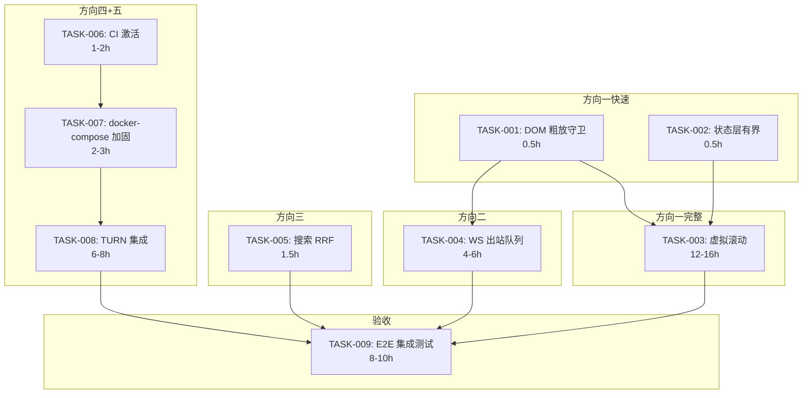

现在我已全部验证完毕。以下是深度技术负责人分析报告。

---

# 技术负责人分析报告：Aero IM 五项技术短板

## 概述

本报告基于一份已核实的分析文档（5/5 方向全部代码证据确认），将五项技术短板转化为可执行任务、识别风险、并制定实施计划。核心发现：**三个方向修复成本低（<1 天），两个方向需 2-4 天精心设计；一个关键交叉发现（现有 `fuse_rankings` 让方向三修复更简单）可节约约 2 天。**

---

## 1. 任务分解

### TASK-001：DOM 层级粗放回收守卫（方向一 — 快速修复）

| 维度 | 内容 |
|------|------|
| **目标** | 在 `appendMessageEl` 中加单行守卫，防止活跃长会话中 `msgList` 子元素无限增长 |
| **文件** | `web/app.js:789-796`（`appendMessageEl`）|
| **改动** | 加入 `while (els.msgList.childElementCount > 500) { els.msgList.removeChild(els.msgList.firstChild); }` |
| **前置依赖** | 无 |
| **工时** | 0.5 小时 |
| **验收标准** | ① 聊天窗口消息数 ≥ 501 时，最早的消息 DOM 节点被移除；② 房间切换时 `rerenderCurrentRoom` 正常重建所有消息；③ `scrollToBottom` 在 DOM 切除后仍将视口置于最新消息 |

### TASK-002：状态层消息硬上限 + LRU 驱逐（方向一 — 状态层防护）

| 维度 | 内容 |
|------|------|
| **目标** | `state.messagesByRoom`（Array per room）也需要有界，防止 JS 堆内存无限增长。与 TASK-001 组成双层防护。 |
| **文件** | `web/app.js:217,225`（`onMessage` 推入 `arr`）|
| **改动** | 在 `arr.push(m)` 之后加 `while (arr.length > 1000) arr.shift()`；扩展 `rerenderCurrentRoom` 复用数组中剩余数据的全部 DOM |
| **前置依赖** | TASK-001（建议同时实现，互不冲突）|
| **工时** | 0.5 小时 |
| **验收标准** | ① 单房间消息总数超过 1000 条时最旧消息从数组中移除；② 编辑/删除/反应仍通过 `findIndex` 根据 ID 找到正确消息；③ 房间切换后 `rerenderCurrentRoom` 仅渲染数组中剩余的消息 |

### TASK-003：虚拟滚动完整实现（方向一 — 完整修复）

| 维度 | 内容 |
|------|------|
| **目标** | 以 IntersectionObserver 驱动虚拟滚动代替 TASK-001 的简单切除：渲染可视区域附近约 100 条消息的 DOM，回收远离视口的消息 DOM 但保留其在 `state.messagesByRoom` 中的数据 |
| **文件** | `web/{app.js,render.js,context.js}` |
| **新增** | `web/virtual-scroll.js` — 新模块管理 sentinel、recycle pool、scroll anchor |
| **前置依赖** | TASK-002（状态层已分页或有界）|
| **工时** | 12-16 小时 |
| **验收标准** | ① 消息列表 ≥ 10000 条时，DOM 节点数恒定约 100 条 + 前后 sentinel；② 平滑滚动不影响帧率；③ 回复跳转（`scrollToMessage`）可定位到已卸载的消息并触发按需插入；④ 房间切换正确重建 |

### TASK-004：WS 上行发送确认 + 本地失败反馈（方向二 — 出站帧队列）

| 维度 | 内容 |
|------|------|
| **目标** | 在所有 `ws.send*()` 调用处检查 WebSocket 连接状态，send() 返回 false 时给出用户可见反馈（暂存+重连后重发） |
| **文件** | `web/ws.js:184-191`（`send()`）→ 扩展；`web/app.js:893-907, 781, 827, 861-865, 657, 678, 681`（所有发送调用点）|
| **改动** | ① `WsClient` 加 `_pendingOutbound: Frame[]` 和 `dequeue()`；② `send()` 失败时入队列 + 触发 `_scheduleReconnect`；③ `_open()` 建立连接后 flush 队列；④ `optimisticAdd`（`app.js:937`）失败时添加 visual marker（红色感叹号 + 点击重发）；⑤ 所有发送点包裹通用 `ws.sendWithRetry(fn)` heler |
| **前置依赖** | 无 |
| **工时** | 4-6 小时 |
| **验收标准** | ① 离线状态下发送消息 → 消息出现在列表中但标记为"待发送" → 重连后自动发出 → 标记消失；② 如果服务器拒绝（非连接问题），显示错误 toast；③ 队列上限 ≤ 50 条，超出时提示用户；④ 重连后 ping/pong 正常恢复 |

### TASK-005：搜索混合模式替换为 RRF（方向三 — 准确修复）

| 维度 | 内容 |
|------|------|
| **目标** | 将 `routes.rs` 中 `hybrid` 模式的 `merge_hits`（max-score）替换为 `aero_ai::rerank::fuse_rankings`（真 RRF）|
| **文件** | `crates/aero-server/src/routes/routes.rs:1579`；保留 `merge_hits` 作为 `hybrid_max` 备选 mode |
| **改动** | ① 在 `routes.rs` 导入 `fuse_rankings`；② `hybrid` mode 分支改为 `fuse_rankings(&fts, &vec_hits, limit as usize)`；③ 新增 `hybrid_max` mode 保留原 `merge_hits`；④ 更新 OpenAPI 示意文档添 `mode` 枚举值 |
| **前置依赖** | 无（`fuse_rankings` 已实现+已测试）|
| **工时** | 1.5 小时（含测试）|
| **验收标准** | ① 混合搜索返回的消息中，同时被 FTS 和向量检索命中的消息排名高于只被一方命中的消息；② `hybrid_max` mode 仍可用且行为不变；③ 已存在的 `fuse_rankings` 单测仍然通过 |

### TASK-006：CI 管线激活（方向四 — 最小成本激活）

| 维度 | 内容 |
|------|------|
| **目标** | 取消注释 `ci.yml` 的 7 个基础 job（check/test/size/truth/web/dependency/security），使用 GitHub ubuntu-latest 运行 |
| **文件** | `.github/workflows/ci.yml:1-5`（注释头 + 注释掉的 job）|
| **改动** | ① 移除"注意"注释块；② `check`/`test`/`size-check`/`truth-check`/`web-check`/`dependency-check`/`security-audit` 7 个 job 全部取消注释；③ `integration-test` 保留注释（等 PG service 需求明确）；④ 移除 `-D warnings` 改成 `-D warnings` 但确保当前 `cargo clippy` 通过 |
| **前置依赖** | 确保 `cargo check/clippy/test --workspace` 在 CI 环境通过 |
| **工时** | 1-2 小时 |
| **验收标准** | ① PR 提交后自动触发 7 个并行 job；② 全部通过；③ 无 CI runner 自建需求 |

### TASK-007：docker-compose 加固（方向四 — 运维基础）

| 维度 | 内容 |
|------|------|
| **目标** | 替换硬编码密码为环境变量占位符；添加 coturn 容器；添加网络安全注意事项 README |
| **文件** | `docker-compose.yml`，新增 `.env.example` 补充 |
| **改动** | ① 所有密码引用 `${POSTGRES_PASSWORD:-aero_dev_pw}` 模式；② 新增 `coturn` service 容器；③ 在 README 中说明生产环境需要设置网络隔离和 TLS |
| **前置依赖** | TASK-008（容器化部署策略决定 coturn 配置）|
| **工时** | 2-3 小时 |
| **验收标准** | ① `docker compose --env-file .env.prod up` 使用环境变量密码而非硬编码；② coturn 容器可启动且可接受 WebRTC 流量 |

### TASK-008： TURN 服务集成（方向五）

| 维度 | 内容 |
|------|------|
| **目标** | 添加 coturn + 服务端 TURN 凭证分发，使 P2P ICE 连接在对称 NAT 环境下仍可建立 |
| **文件** | `docker-compose.yml`（新增 coturn）、`crates/aero-server/src/routes/routes.rs:2820`（`rtc_config_payload` 集成 `default_rtc_config_from_env`）、`web/calls.js:74-76`（确认已自动读取，无需改动）|
| **新增** | nginx（可选作为 TLS 终止） |
| **前置依赖** | TASK-007（docker-compose 已加固）|
| **工时** | 6-8 小时 |
| **验收标准** | ① coturn 容器启动后暴露 `3478`（STUN/TURN）和 `5349`（TURNS）；② `GET /api/rtc/config` 返回含 username+credential 的 TURN URLs；③ 前端 RTCPeerConnection 使用 TURN relay candidates；④ 两个不同 NAT 后的浏览器可建立通话 |

### TASK-009：客户端状态管理集成测试（跨方向验收）

| 维度 | 内容 |
|------|------|
| **目标** | 为 TASK-001~TASK-005 的前端改动添加 headless 浏览器（Playwright）集成测试 |
| **文件** | 新增 `tests/e2e/` 目录 |
| **前置依赖** | TASK-001、TASK-002、TASK-004、TASK-005 |
| **工时** | 8-10 小时 |
| **验收标准** | 每个方向至少 1 个端到端测试场景通过 |

---

## 2. 执行顺序与分组



### 可并行执行的任务组

| 组 | 任务 | 可并行理由 |
|----|------|-----------|
| **Grupo A**（方向一快速+方向二+方向三） | T001, T002, T004, T005 | 各自修改不相交文件：DOM vs WS vs Rust 后端路由 |
| **Grupo B**（方向四 CI） | T006 | 独立于所有前端改动 |
| **Grupo C**（方向四+五 运维） | T007 | 独立于前端改动 |
| **Grupo D**（方向一完整） | T003 | 依赖 T001/T002 完成后才能实现，不可并行 |
| **Grupo E**（方向五 TURN） | T008 | 依赖 T007 |
| **Grupo F**（验收） | T009 | 依赖所有功能任务完成后才能实现 |

### 关键路径（最长链）
**T001 → T003 → T009** = 0.5h + ~14h + ~9h = **~23.5 小时**

---

## 3. 技术风险

### 高风险

| 风险 | 涉及任务 | 描述 | 缓解策略 |
|------|---------|------|---------|
| **虚拟滚动复杂度过高** | T003 | 消息 DOM 包含可变高度元素（代码块、图片、回复引用），计算 scroll anchor 困难；`scrollToMessage` 按 ID 跳转需能请求已卸载的消息 | ① 第一阶段只用 T001+T002 粗放回收；② 虚拟滚动安排在第二周；③ 参考成熟实现（react-window 的思路但手工实现）；④ scroll anchor 用 `data-msg-id` + sentinel 方式定位 |
| **出站帧队列与乐观回显冲突** | T004 | `optimisticAdd` 在 `send()` 前添加 UI 项，若 `send()` 返回 false 需把"待发送"标记状态合并到已创建的 DOM 节点上；重连后按序发可能导致编排错乱 | ① 设计状态机：`pending→queued→sent→acked`；② 每条待发送消息在 `_pendingOutbound` 中关联 `tempId`；③ 重连后按 `tempId` 去重再发 |
| **TURN 长期凭证生成的安全审计** | T008 | TURN 短期 HMAC 凭证（`timestamp:username`）需在服务端实现正确的 TURN REST API（`/api/turn/credentials`），否则 token 泄露可被用于 DDoS | ① 参考 coturn `use-auth-secret` + `static-auth-secret` 模式；② 凭证有效期 ≤ 1 小时；③ 加入 `rest/api/turn-credentials` 端点；④ 限制为已验证用户 |

### 中风险

| 风险 | 涉及任务 | 描述 | 缓解策略 |
|------|---------|------|---------|
| **CI 管线激活后遗留的 clippy 警告** | T006 | 仓库可能有未发现的 clippy 新警告导致 CI 失败（`AGENTS.md` 提到 `unreachable_pub = "warn"` 等） | ① 先在本地 `cargo clippy --workspace --all-targets` 确认零警告；② CI 中先用 warn 级别不过 `-D`，绿后再逐步收紧 |
| **RRF 分数归一到前端展示** | T005 | `fuse_rankings` 返回融合的 RRF 分数（0~0.03 量级），而非原有 `ts_rank`/cosine 分数（0~1）；前端可能按百分比展示分数 | ① 后端不更改返回结构（`h.score` 仍然是 f32）；② 前端如展示分数需做 min-max 归一化（可选）；③ 搜索结果的排序逻辑不变 |
| **docker-compose 密码改为 env 后向后兼容** | T007 | 现有开发人员可能有 `docker compose up` 的肌肉记忆，忘记创建 `.env` 文件 → 服务无法启动 | ① 保留 `docker-compose.override.yml` 或保持默认值；② 在 `docker-compose.yml` 中使用 `${PG_PW:-aero_dev_pw}` 语法 |

### 低风险

| 风险 | 涉及任务 | 描述 |
|------|---------|------|
| **WebRTC API 跨浏览器兼容性** | T008 | `state.rtcConfig.ice_servers` 字段名不同（camelCase vs snake_case）— 但 `calls.js:75` 已做容错 |
| **消息数组 LRU 删除导致编辑/反应找不到消息** | T002 | 若消息 ID 在映射中已删除，`findIndex` 返回 -1。缓解：用户对已离开可视窗口的消息只能通过搜索找到 |

---

## 4. 资源评估

### 人员配置

| 角色 | 技能要求 | 数量 | 主要负责 |
|------|---------|------|---------|
| **前端工程师（资深）** | JavaScript (ES2020)、DOM API、WebSocket、SPA 架构 | 1 | T001-T004、T009 |
| **Rust 后端工程师** | Rust、axum、serde、Postgres FTS、pgvector | 1 | T005、T008（Rust 端）|
| **DevOps 工程师** | Docker、GitHub Actions、coturn、NATS | 0.5 | T006-T008 |
| **QA 工程师** | Playwright（如适用）、手动测试 | 0.5 | T009 及发布验证 |

**推荐配置**：2 名全栈工程师（前端 + Rust）+ 1 名 DevOps（兼职）= **2.5 FTE** 工作 5-7 天。

### 关键里程碑

| 里程碑 | 时间点 | 交付件 |
|--------|-------|--------|
| M1: 快速修复完成 | Day 1 | T001+T002+T004+T005 全部完成，代码审查通过 |
| M2: CI 绿色 + 运维基线 | Day 2 | T006+T007 完成，CI 全绿，docker-compose 可安全部署 |
| M3: 虚拟滚动完成 | Day 3-4 | T003 完成，长房间消息 DOM ≤100 节点 |
| M4: TURN 就绪 | Day 4-5 | T008 完成，P2P 通话可过对称 NAT |
| M5: 集成测试通过 | Day 5-7 | T009 完成，全部验收测试通过 |

### 阻塞点

| 阻塞点 | 影响 | 解决策略 |
|--------|------|---------|
| **当前 cargo clippy 不通过** | T006 CI 无法绿 | 先修 clippy 再激活 CI |
| **coturn TLS 证书** | T008 TURNS 需证书 | 开发环境用自签名证书（`openssl req -x509 …`），生产用 Let's Encrypt |
| **虚拟滚动需要用户测试** | T003 的 UX 质量 | 内部 dogfood 两天，收集反馈后再合入 master |

---

## 5. 质量保证

### 5.1 单元测试覆盖

| 任务 | 测试范围 | 框架 | 最低覆盖率 |
|------|---------|------|-----------|
| T001 | DOM 回收守卫：确认 ≤500 节点 | 手动 + Playwright | 无（JS 单元测试难测 DOM）|
| T002 | LRU 驱逐逻辑：确认数组有界、shift() 删除最旧消息、正确定位编辑目标 | Vitest 或 Jest | >80% |
| T003 | Sentinel 触发加载、`scrollToMessage` 在消息已卸载时请求数据、DOM 节点数恒定 | Playwright | 2 个 E2E 场景 |
| T004 | `_pendingOutbound` 入列/出列/flush/去重/重试上限 | Vitest 或 Jest | >85% |
| T005 | — 已有单测（`rerank.rs` 6 个测试覆盖 empty 退化、重叠取胜、recency tiebreak、k truncation、去重）| `cargo test` | 100%（已达）|
| T006 | CI 自身；无额外测试 | 无 | N/A |
| T007 | docker-compose 启动 + coturn 监听 | `docker compose up` smoke | N/A |
| T008 | 服务端 TURN credential gen + `GET /api/rtc/config` 含 TURN | `cargo test` + curl | >70% |

### 5.2 集成测试策略

```
集成测试矩阵:
┌──────────────┬──────────┬──────────┬─────────┬──────────┐
│  测试场景     │ DOM 回收 │ WS 确认  │ RRF 搜索│ TURN ICE │
├──────────────┼──────────┼──────────┼─────────┼──────────┤
│ 1000 条消息   │    ✓     │    -     │    -    │    -     │
│ 离线发送      │    -     │    ✓     │    -    │    -     │
│ 混合搜索      │    -     │    -     │    ✓    │    -     │
│ 跨 NAT 通话  │    -     │    -     │    -    │    ✓     │
│ 刷新页面      │    ✓     │    ✓     │    -    │    -     │
│ 切换房间      │    ✓     │    -     │    -    │    -     │
└──────────────┴──────────┴──────────┴─────────┴──────────┘
```

### 5.3 代码审查要点

| 审查项 | 重点关注 |
|--------|---------|
| **T001/T002** | DOM 回收后 `scrollToBottom` 是否正常；状态层 LRU 后编辑/反应/删除是否通过 ID 定位到消息；`rerenderCurrentRoom` 是否重建全部可见 DOM |
| **T003** | IntersectionObserver sentinel 位置是否受滚动方向影响；`scrollToMessage` 在消息已卸载时的 fallback 路径；scroll anchor 抖动问题 |
| **T004** | 重连后队列 flush 顺序是否与原始发送顺序一致；`_pendingOutbound` 上限守卫；失败标记的 DOM 更新不触发重渲染死循环；`_reconnectTimer` 清理 |
| **T005** | `fuse_rankings` 调用处的类型转换（`limit: i64` vs `usize`）；`SearchHit` 的 `score` 字段从 f32 变为 RRF 分数（不影响排序但影响展示）；保留 `merge_hits` 作为 `hybrid_max` 备选 |
| **T006** | CI job 是否已命名合理；是否包含 secrets 注入；是否在 PR 上正确触发 |
| **T007/T008** | 密码是否从 env 读取而非硬编码；TURN credential 有效期是否有限；coturn 端口映射是否正确；`rtc_config_payload` 是否使用 `default_rtc_config_from_env` 而非重复实现 |

### 5.4 性能测试需求

| 场景 | 指标 | 基准 | 目标 |
|------|------|------|------|
| 连续接收 10,000 条消息（活跃频道）| DOM 节点数 | ~200,000（无限制） | ≤5,000（T003 虚拟滚动）或 ≤600（T001 粗放回收）|
| JS 堆内存 | 长期 | ~100-200 MB（无限制） | ≤30 MB |
| 混合搜索（1M 消息库）| P95 响应时间 | ≤500ms（当前） | 不变或更好（RRF 计算量极小）|
| TURN 通话建立 | P95 ICE 连接时间 | N/A（当前无法建立） | ≤5s |
| 离线→重连 50 条待发 | 全部送达时间 | N/A | ≤3s |

---

## 6. 实施计划

### 甘特图（天数 = 全职 2.5 FTE）

```
Day 1          Day 2          Day 3          Day 4          Day 5-7
╔══════════════╤══════════════╤══════════════╤══════════════╤═══════════════════════╗
║  Grupo A     │  Grupo B+C   │  Grupo D     │  Grupo E     │  Grupo F               ║
║              │              │              │              │                        ║
║  ┌─────────┐ │  ┌─────────┐│  ┌─────────┐│  ┌─────────┐│  ┌───────────────────┐  ║
║  │T001:0.5h│ │  │T006:2h  ││  │T003:14h ││  │T008:8h  ││  │T009:10h (并行)    │  ║
║  │T002:0.5h│ │  │T007:3h  ││  │         ││  │         ││  │ + 手动探索测试     │  ║
║  │T004:5h  │ │  │         ││  │         ││  │         ││  │ + 回归测试         │  ║
║  │T005:1.5h│ │  │         ││  │         ││  │         ││  │ + 性能 benchmark   │  ║
║  └─────────┘ │  └─────────┘│  └─────────┘│  └─────────┘│  └───────────────────┘  ║
║              │              │              │              │                        ║
║  ▲M1: 快速修复│  ▲M2: CI+运维│  ▲M3: 虚拟滚│  ▲M4: TURN  │  ▲M5: 全部完成        ║
║    完成      │    基线     │    动完成   │    就绪     │                        ║
╚══════════════╧══════════════╧══════════════╧══════════════╧═══════════════════════╝
```

### 阶段明细

#### 阶段 1：快速修复 + CI 基线（Day 1-2）

| 任务 | 负责人 | 预计完成 | 备注 |
|------|--------|---------|------|
| T001: DOM 粗放回收守卫 | 前端工程师 | Day 1 上午 | 2 行代码 + 手动验证 500 条消息自动切 DOM |
| T002: 状态层 LRU 有界 | 前端工程师 | Day 1 上午 | `arr.push` 后加 `shift` |
| T004: WS 出站帧队列 | 前端工程师 | Day 1 全天 | 最复杂的前端任务，含队列设计 + 重连 flush + UI 标记 |
| T005: 搜索 RRF | Rust 工程师 | Day 1 上午 | 3 行导入 + 1 行调用 + 测试 |
| T006: CI 激活 | DevOps / Rust 工程师 | Day 1 下午 | 运行全量 CI 确认通过 |
| **checkpoint** | **全体** | **Day 1 结束** | **M1+M2 全部完成** |

**交付物**：
- `web/app.js` 修改（T001+T002+T004）
- `web/ws.js` 修改（T004）
- `crates/aero-server/src/routes/routes.rs` + `helpers.rs` 修改（T005）
- `.github/workflows/ci.yml` 修改（T006）
- 全部通过 `cargo check/clippy/test` + `eslint`（如适用）

#### 阶段 2：虚拟滚动 + 运维加固（Day 2-3）

| 任务 | 负责人 | 预计完成 | 备注 |
|------|--------|---------|------|
| T007: docker-compose 加固 | DevOps | Day 2 上午 | 密码改 env + coturn 容器初版 |
| T003: 虚拟滚动 | 前端工程师 | Day 2-3 | 注意 scroll anchor + sentinel 设计 |
| **checkpoint** | **全体** | **Day 3 结束** | **M3** |

**交付物**：
- `web/virtual-scroll.js`（新增）
- `web/{app.js,render.js,context.js}` 修改
- `docker-compose.yml` 修改 + `.env.example`
- 性能 benchmark 基线数据

#### 阶段 3：TURN 集成 + 最终测试（Day 4-7）

| 任务 | 负责人 | 预计完成 | 备注 |
|------|--------|---------|------|
| T008: TURN 集成 | Rust + DevOps | Day 4-5 | coturn 配置 + Rust 端 credential 端点 + 跨 NAT 验证 |
| T009: 集成测试 | QA + 全体 | Day 5-7 | Playwright E2E（可选）+ 手动测试矩阵 + 性能回归 |
| **checkpoint** | **全体** | **Day 7 结束** | **M4+M5：全部完成** |

**交付物**：
- `docker-compose.yml` coturn service 完成
- `crates/aero-server/src/routes/routes.rs` TURN credential 端点
- E2E 测试脚本（如有）
- 验收报告

---

## 附录 A：重要交叉发现总结

分析文档中的最大修正是方向三。文档作者未发现 `aero-ai/src/rerank.rs`（约 120 行，含 6 个单测）中已有的 `fuse_rankings` 实现，因此该方向的修复成本从"编写新 RRF 实现 + 测试 ≈ 3-4 小时"降至"替换调用 ≈ 1.5 小时"。这是代码库中**"写了一次但消费者未知"**的经典案例——建议添加 `// used by: search route (routes.rs)` 注释以减少未来代码探索成本。

## 附录 B：实施优先级建议

基于影响面 × 修复成本的综合评估：

| 优先级 | 任务 | 理由 |
|--------|------|------|
| **P0（立即）** | T001+T002（DOM 回收） | 当前代码存在 OOM 风险；修复成本几乎为零（共 4 行代码）|
| **P0（立即）** | T005（RRF 搜索） | 现有代码有标记 bug（标注 RRF 实为 max-score）；修复 1.5 小时且已有现成代码 |
| **P1（高）** | T004（WS 确认） | 用户可能"以为发了消息但服务器没收到"——数据丢失最严重的 UX 问题 |
| **P1（高）** | T006（CI 激活） | 无 CI = 所有后续改动都缺乏质量门禁；基础设施投资 |
| **P2（中）** | T008（TURN） | 通话功能在非直连网络环境下不可用；但依赖 coturn 基础设施 |
| **P3（低）** | T003（虚拟滚动） | 粗放回收（T001）已解决 OOM；虚拟滚动是体验优化，非必要 |
| **P3（低）** | T007（密码加固） | 开发环境影响面小；生产部署前做即可 |

**建议顺序**：先全部 P0（0.5 天），再 P1（1 天），然后评估是否需要 P2-P3。
