Now I have all the context needed. Let me compose the comprehensive Tech Lead analysis.

---

# Tech Lead 分析报告：5 个代码锚定的架构扩展方向

## 1. 任务分解

将 5 个方向分解为 25 个可执行任务，每任务 2–4 小时，按方向分组。

### 方向一：数据分层存储与归档管线（P0）

| 任务 ID | 标题 | 涉及文件 | 前置依赖 | 预估工时 |
|---------|------|---------|---------|---------|
| TASK-001 | `messages` 表按月分区迁移 | `migrations/NNNN_messages_partition.sql`, `aero-storage/src/message/mod.rs`, `aero-storage/src/message/crud.rs` | 无 | 4h |
| TASK-002 | 存量消息回填到分区结构 | `aero-storage/src/message/sweep.rs`, `aero-server/src/bin/boot/background.rs` | TASK-001 | 3h |
| TASK-003 | `notifications` 哈希分区 + `stream_chat` 按月分区 | `migrations/NNNN_notif_partition.sql`, `aero-storage/src/notification.rs`, `aero-storage/src/stream.rs` | 无（可并行 TASK-001） | 4h |
| TASK-004 | 冷存储归档管线——S3 迁移机制 | `aero-storage/src/archive.rs`, `aero-storage/src/lib.rs`, `migrations/NNNN_archive.sql`, `aero-server/src/bin/boot/background.rs` | TASK-001, TASK-003 | 4h |
| TASK-005 | `message_history` 保留最近 N 版清理 | `aero-storage/src/message_edit.rs`, `aero-server/src/bin/boot/` | 无 | 2h |
| TASK-006 | 法务保全感知的归档豁免机制 | `aero-storage/src/legal_hold.rs`, `aero-storage/src/archive.rs` | TASK-004 | 3h |

**验收标准（方向一）**：
- `messages` 表新建行自动落入 `messages_YYYYMM` 分区
- `notifications` 按 `participant_id` 哈希分到 16 个分区
- 后台定时器可将 ≥90 天的冷数据迁移至 S3（可配置阈值），PG 仅保留 `archived_at=null` 的行
- `message_history` 每消息最多保留 10 个版本
- 法务保全标记的 room/workspace 永不归档
- `cargo test --workspace --lib` 全绿，新 db_tests 覆盖分区路由

---

### 方向二：敏感操作 MFA 步升认证（P0）

| 任务 ID | 标题 | 涉及文件 | 前置依赖 | 预估工时 |
|---------|------|---------|---------|---------|
| TASK-010 | `step_up_auth` 核心模块——TOTP 验证 + 会话级缓存 | `aero-server/src/step_up_auth.rs`, `aero-storage/src/lib.rs` (re-export) | 无（复用 `aero-auth::totp` + `aero-storage::TotpRepo`） | 4h |
| TASK-011 | 步升注入：Webhook CRUD 路由 | `aero-server/src/webhooks.rs` | TASK-010 | 2h |
| TASK-012 | 步升注入：工作区安全配置 + 数据导出 | `aero-server/src/workspace_security.rs`, `aero-server/src/me_export.rs`, `aero-storage/src/workspace/export.rs` | TASK-010 | 3h |
| TASK-013 | 步升注入：会话吊销 + SSO/OIDC + IP 白名单 | `aero-server/src/sessions.rs`, `aero-server/src/sso.rs`, `aero-server/src/saml.rs`, `aero-server/src/ip_allowlist.rs` | TASK-010 | 4h |
| TASK-014 | 步升注入：法务保全 + 频道留存 + 信息隔离墙 + 管理员变更 | `aero-server/src/legal_holds.rs`, `aero-server/src/channel_retention.rs`, `aero-server/src/info_barriers.rs`, `aero-server/src/deactivation.rs` | TASK-010 | 3h |
| TASK-015 | 步升认证集成测试套件 | `tests/step_up_auth.rs` | TASK-011, 012, 013, 014 | 3h |

**验收标准（方向二）**：
- `POST /api/rooms/:id/webhooks/outgoing` 请求体含 `totp_code` 字段，缺失或错误返回 403
- 其余 8 类敏感操作同样要求步升验证
- 一次成功步升后 15 分钟内同一会话免重复输入（Redis 缓存 `step_up_{session_id}`）
- `assert_room_access` 未被修改——步升是额外守卫，不替代既有授权
- `cargo clippy --workspace --all-targets` 无新增警告

---

### 方向三：客户端搜索质量与消息发现（P1）

| 任务 ID | 标题 | 涉及文件 | 前置依赖 | 预估工时 |
|---------|------|---------|---------|---------|
| TASK-020 | 搜索结果去重与线程折叠（客户端） | `web/search.js`, `web/index.html` | 无 | 3h |
| TASK-021 | 搜索片段高亮（服务端 `ts_headline` + 客户端 `<mark>`） | `crates/aero-server/src/search.rs`, `aero-storage/src/message/search.rs`, `web/search.js` | 无 | 3h |
| TASK-022 | 分面筛选 UI（频道/发件人/日期范围） | `web/search.js`, `web/index.html`, `web/style.css` | TASK-020 | 4h |
| TASK-023 | 附件内容索引管线（OCR/文档提取） | `migrations/NNNN_attachment_text.sql`, `aero-storage/src/message/mod.rs`, `aero-server/src/bin/boot/background.rs` (新 worker) | 无 | 4h |
| TASK-024 | 搜索建议/自动补全 + 无限滚动分页 | `web/search.js`, `crates/aero-server/src/search.rs` | TASK-021 | 3h |

**验收标准（方向三）**：
- 同一消息的多个编辑版本只显示最新版
- 同一线程的回复折叠到根消息下，可展开
- 搜索结果显示 `ts_headline` 高亮片段，匹配词被 `<mark>` 包裹
- 分面面板可筛选频道/发件人/日期范围
- 新 `attachment_text` 列被 pg_trgm 全文索引覆盖，PDF/文档正文可被搜索命中
- 搜索输入框有 debounced 自动补全建议
- 滚动到底部自动加载下一页结果

---

### 方向四：交互式消息应用平台（P1）

| 任务 ID | 标题 | 涉及文件 | 前置依赖 | 预估工时 |
|---------|------|---------|---------|---------|
| TASK-030 | `apps` 表 + CRUD API（最小可行） | `migrations/NNNN_apps.sql`, `aero-storage/src/app.rs`, `aero-storage/src/lib.rs`, `aero-server/src/apps.rs` | 无 | 4h |
| TASK-031 | 应用 Manifest + `action_id` 命名空间 | `aero-storage/src/app.rs`, `aero-server/src/apps.rs` | TASK-030 | 2h |
| TASK-032 | 交互事件回调 Webhook 投递 | `aero-storage/src/app.rs`, `aero-server/src/interactions.rs`, `aero-server/src/bin/boot/` (新 dispatcher) | TASK-030 | 4h |
| TASK-033 | Slash 命令注册 + 路由到应用回调 | `migrations/NNNN_app_commands.sql`, `aero-storage/src/app.rs`, `aero-server/src/commands.rs` | TASK-030, TASK-031 | 3h |
| TASK-034 | OAuth 授权安装流程（最小） | `aero-server/src/apps.rs` (新增 OAuth 端点), `aero-storage/src/app.rs` | TASK-030 | 4h |
| TASK-035 | 权限模型 + 执行门控 | `aero-storage/src/app.rs`, `aero-im-core/src/service/messages.rs` | TASK-030 | 3h |

**验收标准（方向四）**：
- `POST /api/apps` 创建应用，返回 `app_id` + `client_secret`
- 每个 app 的 `action_id` 自动加 `{app_id}:` 前缀防冲突
- 用户点击 Button → 系统 POST 到 app 注册的 `callback_url`，含完整交互 payload
- `POST /api/apps/:id/commands` 注册 `/command` 映射
- OAuth 授权码流程：GET `/api/oauth/authorize` → POST `/api/oauth/token`
- `send_message` 门控检查调用方 app 是否有 `send_messages` scope

---

### 方向五：事件路由粒度过粗（P2）

| 任务 ID | 标题 | 涉及文件 | 前置依赖 | 预估工时 |
|---------|------|---------|---------|---------|
| TASK-040 | `Interaction` 事件定向投递 | `crates/aero-common/src/model/event.rs`, `crates/aero-server/src/interactions.rs`, `crates/aero-server/src/ws/ws_impl/bus.rs` | 无 | 3h |
| TASK-041 | `MessageSeen` 事件定向投递 | `crates/aero-common/src/model/event.rs`, `crates/aero-server/src/message_receipts.rs` | 无 | 2h |
| TASK-042 | `Typing` 事件范围缩减——仅限在线成员 | `crates/aero-common/src/model/event.rs`, `crates/aero-server/src/ws/ws_impl/bus.rs`, `crates/aero-server/src/hub.rs` | 无 | 3h |
| TASK-043 | 匿名 Poll 的 `Interaction` 隐私保护 | `crates/aero-common/src/model/event.rs`, `crates/aero-server/src/interactions.rs` | 无 | 2h |
| TASK-044 | `Read` 事件定向（可选，可降级） | `crates/aero-common/src/model/event.rs` | 无 | 2h |

**验收标准（方向五）**：
- `Interaction` 帧仅投递给消息的作者（bot/app），不再全员广播
- `MessageSeen` 帧仅投递给对应消息的发送者
- `Typing` 帧仅投递给同一房间当前 WS 连接的在线成员
- 匿名 Poll 关联的 `Interaction` 帧不包含 `participant` 字段
- 500 人大房场景下 WS 扇出量减少 ≥60%（验证方法：`metrics` 计数器对比）
- 所有现有 `RoomEvent` 的 `kind` tag 不变，客户端无感知

---

## 2. 执行顺序

### 依赖图

```mermaid
graph TD
    subgraph "方向一：数据分层存储"
        T001[TASK-001: messages 分区迁移]
        T003[TASK-003: notifications/stream_chat 分区]
        T002[TASK-002: 存量消息回填]
        T004[TASK-004: 冷存储归档管线]
        T005[TASK-005: message_history 清理]
        T006[TASK-006: 法务保全豁免归档]
        
        T001 --> T002
        T001 --> T004
        T003 --> T004
        T004 --> T006
    end

    subgraph "方向二：MFA 步升认证"
        T010[TASK-010: step_up_auth 核心模块]
        T011[TASK-011: Webhook CRUD 注入]
        T012[TASK-012: 安全配置/导出注入]
        T013[TASK-013: 会话/SSO/IP 注入]
        T014[TASK-014: 法务/留存/隔离墙注入]
        T015[TASK-015: 集成测试]
        
        T010 --> T011
        T010 --> T012
        T010 --> T013
        T010 --> T014
        T011 --> T015
        T012 --> T015
        T013 --> T015
        T014 --> T015
    end

    subgraph "方向三：搜索质量"
        T020[TASK-020: 去重/折叠 UI]
        T021[TASK-021: 片段高亮]
        T022[TASK-022: 分面筛选 UI]
        T023[TASK-023: 附件内容索引]
        T024[TASK-024: 自动补全/分页]
        
        T020 --> T022
        T021 --> T024
    end

    subgraph "方向四：App 平台"
        T030[TASK-030: apps 表 + CRUD]
        T031[TASK-031: Manifest + action_id 命名空间]
        T032[TASK-032: 交互回调 Webhook]
        T033[TASK-033: Slash 命令注册]
        T034[TASK-034: OAuth 安装流程]
        T035[TASK-035: 权限模型]
        
        T030 --> T031
        T030 --> T032
        T030 --> T034
        T030 --> T035
        T031 --> T033
    end

    subgraph "方向五：事件路由"
        T040[TASK-040: Interaction 定向]
        T041[TASK-041: MessageSeen 定向]
        T042[TASK-042: Typing 范围缩减]
        T043[TASK-043: 匿名 Poll 隐私]
        T044[TASK-044: Read 定向]
    end

    %% 跨方向关键依赖
    T010 -.-> |step_up_auth 可被 T012 等并行消费| T011
```



### 可并行执行的独立任务组

| 并行组 | 任务 | 说明 |
|--------|------|------|
| **组 A** | TASK-001, TASK-003, TASK-005, TASK-010, TASK-020, TASK-021, TASK-023, TASK-030 | 8 个方向的首个任务均无外部前置依赖，可分配 3–4 人并行 |
| **组 B** | TASK-002, TASK-011~014 (4 个), TASK-022, TASK-024, TASK-031, TASK-040~044 (5 个) | 依赖组 A 完成后可并行 |
| **组 C** | TASK-004, TASK-015, TASK-032~035, TASK-006 | 依赖组 B 的部分完成 |

---

## 3. 技术风险

### 3.1 方向一：数据分层存储与归档管线

| 风险 | 等级 | 说明 | 缓解策略 |
|------|------|------|---------|
| PG 原生分区 DDL 锁表 | **高** | 对亿级 `messages` 表执行 `ALTER TABLE ... PARTITION BY RANGE` 需要 ACCESS EXCLUSIVE 锁，生产环境可能引发写入阻塞 | ① 使用 pg_partman 扩展自动化分区创建而非手动 DDL ② 在维护窗口执行 ③ 先创建新分区表，用后台回填 + 切换视图过渡 |
| 现有索引与分区表不兼容 | **中** | PG 分区表要求唯一索引包含分区键；当前 `messages` 表的 `PRIMARY KEY (id)` 不包含 `created_at` | 改用非唯一索引 + 业务层幂等守卫；或用 `(created_at, id)` 复合主键 |
| 事件总线上的消息删除事件在归档后感知 | **中** | 已归档到 S3 的消息被软删时，`Deleted` RoomEvent 仍需广播——但 S3 行无法回滚 | 归档时保留 `(message_id, room_id, archived_at)` 索引行在 PG 中，软删操作先标记索引行再异步删 S3 |
| S3 访问延迟 | **低** | 冷数据查询（法务保全 eDiscovery）需要跨网络拉取 S3 对象 | 使用 S3 Select / 预签名 URL + 异步加载；热数据无条件在 PG 中 |

### 3.2 方向二：MFA 步升认证

| 风险 | 等级 | 说明 | 缓解策略 |
|------|------|------|---------|
| 步升体验摩擦——管理员每笔操作都要输验证码 | **中** | 如果无会话级缓存，Owner 批量操作需反复验证 | 实施 15 分钟会话级 TOTP 缓存（Redis `step_up_{session_id}`，TTL 900s） |
| 集成测试覆盖不全——多个路由逐个注入易遗漏 | **中** | 手动枚举 8+ 类敏感操作，新增敏感路由可能忘记加守卫 | ① 建立敏感操作清单表（文档 + 代码注释）② CI `authz_lint` 扩展——扫描 `AuthUser` extractor 附近是否调用了 `step_up_required` |
| `totp_code` 字段与既有请求体冲突 | **低** | 某些 PUT/PATCH 路由已有自定义 JSON body，再加 `totp_code` 需兼容 | `totp_code` 作为请求体可选顶级字段，提取函数从 JSON 中剥离（不干扰业务反序列化） |

### 3.3 方向三：客户端搜索质量

| 风险 | 等级 | 说明 | 缓解策略 |
|------|------|------|---------|
| 附件内容索引的 PDF/OCR 管线依赖外部工具 | **高** | 文档提取需要 Apache Tika / Tesseract / AWS Textract，引入新依赖和运维复杂度 | ① 用 `AiService` 的 `transcribe` 路径（已有 Whisper）做文档提取 ② 渐进式：先支持纯文本附件（`.txt`, `.md`, `.csv`），PDF/图片后续 |
| `ts_headline` 性能在大结果集上退化 | **中** | 搜索返回 100 条时每条都跑 `ts_headline()` 会增加服务端延迟 | ① 限制高亮仅在 `limit ≤ 30` 时启用 ② 缓存 `ts_headline` 结果 ③ 可选客户端纯 JS 高亮作为 fallback |
| 搜索结果去重导致 UI 状态复杂度上升 | **中** | 线程折叠需要跟踪展开/收起状态，分页时跨页去重需要游标 | 客户端维护 `seenMessageIds` Set，分页隔断不影响用户体验 |

### 3.4 方向四：交互式消息应用平台

| 风险 | 等级 | 说明 | 缓解策略 |
|------|------|------|---------|
| Interaction 回调投递的可靠性与重试 | **高** | app 的 callback_url 可能不可达；如果重试策略不当会导致消息丢失或重复 | 复用 `WebhookDelivery` 的重试机制（`backoff_delay`, `MAX_ATTEMPTS=5`, DLQ） |
| app secret 和 token 安全管理 | **中** | 存储的 `secret_hash` 需防泄露；OAuth token 管理增加攻击面 | ① `client_secret` 用 argon2id 哈希存储（复用 `aero_auth`）② OAuth token 用加密 JWT，含 scope + workspace_id |
| `action_id` 命名空间迁移——现存 `agent_bot` 的 action_id 无前缀 | **中** | 现有 `agent_bot` 使用裸 `action_id`，引入命名空间后需要兼容 | `agent_bot` 注册为系统 app（`app_id = "agent_bot"`），所有系统 action_id 不变；第三方 app 强制加前缀 |

### 3.5 方向五：事件路由粒度过粗

| 风险 | 等级 | 说明 | 缓解策略 |
|------|------|------|---------|
| `Interaction` 定向后 bot 消息的「其他人看不到交互结果」 | **中** | 某些场景下希望全员看到交互结果（如投票进度条实时更新） | 定向投递的是 `Interaction` 帧（谁点击了）；结果更新通过 `Poll` variant 全员广播，两事件的语义分离 |
| `Typing` 范围缩减后离线成员重新上线看不到之前的 typing 状态 | **低** | Typing 是瞬态事件（`on: bool`），离线成员即使看到也无意义——这是设计选择 | 无缓解必要 |
| `Read` 定向实现复杂、收益有限 | **低** | 定向 Read 需要了解每个成员关心谁的消息状态，实现成本 > 带宽节省 | 将 TASK-044 标记为可选，仅在带宽瓶颈明确时实施 |

---

## 4. 资源评估

### 4.1 团队技能矩阵

| 方向 | 所需技能 | 推荐人员 | 说明 |
|------|---------|---------|------|
| 方向一：数据分层 | Rust 数据库编程 + PG 分区 + S3 SDK | 资深后端（1 人） | 需熟悉 sqlx 和大数据量的迁移策略 |
| 方向二：MFA 步升 | Rust TOTP 知识 + Web 安全 | 普通后端（1 人） | 复用已有 `TotpRepo`，实现难度低 |
| 方向三：搜索质量 | 前端 ES2020 (vanilla JS) + pg_trgm | 全栈（1 人） | 客户端重；服务端改动少 |
| 方向四：App 平台 | Rust 全栈 + OAuth 协议 + 平台工程 | 资深后端（1 人） | 跨 `aero-storage`/`aero-server`/`aero-im-core` 三个 crate |
| 方向五：事件路由 | Rust match-arm + 总线模式理解 | 普通后端（0.5 人） | 改动集中在 `event.rs` 的 `explicit_recipients` |

**最小团队规模**：3 人（2 后端 + 1 全栈），可并行方向二 + 三 + 五。
**最优团队规模**：5 人（3 后端 + 1 全栈 + 1 基础设施），全方向并行。

### 4.2 关键里程碑

| 里程碑 | 时间 | 交付物 |
|--------|------|--------|
| M1: MFA 步升就绪 | 第 1 周结束 | TASK-010~015 全部完成，集成测试通过 |
| M2: 搜索质量落地 | 第 2 周结束 | TASK-020~024 全部完成，搜索体验显著改善 |
| M3: 事件路由优化 | 第 2 周结束 | TASK-040~044 全部完成，WS 扇出量减少 ≥60% |
| M4: 数据分层一期（分区） | 第 3 周结束 | TASK-001~003 完成，`messages`/`notifications`/`stream_chat` 已分区 |
| M5: 数据分层二期（归档） | 第 4 周结束 | TASK-004~006 完成，冷数据可迁移到 S3 |
| M6: App 平台 MVP | 第 5 周结束 | TASK-030~035 完成，第三方开发者可注册应用 |

### 4.3 阻塞点与解决策略

| 阻塞点 | 方向 | 策略 |
|--------|------|------|
| 大表分区 DDL 锁 | 方向一 | 在预发布环境用 `pg_partman` 模拟；生产在维护窗口执行 |
| PDF/文档索引依赖外部 OCR | 方向三 | 先跳过；优先支持纯文本附件 + 文件名搜索 |
| App 平台的 OAuth 流程设计决策 | 方向四 | OAuth 2.0 授权码流程是成熟方案，参考 RFC 6749 即可，无需自创协议 |

---

## 5. 质量保证

### 5.1 单元测试覆盖

| 方向 | 模块 | 覆盖要求 | 测试类型 |
|------|------|---------|---------|
| 方向一 | `aero-storage/src/archive.rs` | ≥90% 语句覆盖 | 模拟 PG + mock S3 (`FakeBlobStore`) |
| 方向一 | `aero-storage/src/message/sweep.rs` | ≥85% 分支覆盖 | `#[ignore]` db_tests 验证分区路由 |
| 方向二 | `aero-server/src/step_up_auth.rs` | ≥95% (纯逻辑) | 验证 TOTP 验证 + 缓存 TTL + 过期 |
| 方向二 | 各敏感路由 handler | 每路由至少 1 个 e2e | 有/无 `totp_code` 的 HTTP 请求 |
| 方向三 | `web/search.js` (aggregation) | 纯函数 ≥90% | Jest / vitest（如可用）或手动 DOM 测试 |
| 方向三 | `aero-storage/src/message/search.rs` | `ts_headline` 集成测试 | 验证 SQL 层高亮片段正确性 |
| 方向四 | `aero-storage/src/app.rs` | ≥85% | CRUD + callback_url 验证 |
| 方向四 | `aero-server/src/apps.rs` (OAuth) | ≥80% | 授权码 + token 交换流程 |
| 方向五 | `aero-common/src/model/event.rs` (`explicit_recipients`) | 每个 variant 分支覆盖 | 验证 5 个 variant 的正确收件人列表 |

### 5.2 集成测试策略

| 测试套件 | 涉及方向 | 方式 |
|---------|---------|------|
| `tests/step_up_auth.rs` | 方向二 | HTTP 请求 → 验证 403/200；验证缓存过期后重新要求步升 |
| `tests/search_quality.rs` | 方向三 | 插入消息（含编辑/线程/附件）→ 搜索 → 验证结果分组 |
| `tests/app_platform.rs` | 方向四 | 创建 app → 发交互消息 → 验证 callback 被调用 |
| `tests/event_routing.rs` | 方向五 | 启动多 WS 客户端 → 验证 `Interaction` 只到达特定客户端 |
| `tests/archive_lifecycle.rs` | 方向一 | 插入消息 → 归档 → 验证 PG 行被移除 + S3 可恢复 |

### 5.3 代码审查要点

| 审查项 | 方向 | 重点关注 |
|--------|------|---------|
| 分区键选择 | 方向一 | 所有查询 `WHERE` 子句必须包含分区键，否则 PG 做全分区扫描 |
| 步升守卫完整性 | 方向二 | 确认 `authz_lint` CI 扩展能检测遗漏的 `step_up_required` 调用 |
| 客户端搜索分组逻辑 | 方向三 | 去重 key 的选择——确保 `message_id` 而非 `thread_root_id` 做唯一标识 |
| app `action_id` 前缀 | 方向四 | 所有 `Block::Button`/`Select` 渲染路径必须硬编码或运行时追加 `{app_id}:` 前缀 |
| `explicit_recipients` 完整性 | 方向五 | 不要遗漏任何 `RoomEvent` variant；新 variant 必须考虑是否需要定向 |

### 5.4 性能测试需求

| 场景 | 方向 | 指标 | 方法 |
|------|------|------|------|
| 分区表查询性能 | 方向一 | 分区扫描 vs 全表扫描延迟（目标：≤200ms at P99 for 500M rows） | 用 `pgbench` 或 `sqlx` 查询对比 |
| 步升缓存命中率 | 方向二 | 缓存命中率 ≥90%（通过 Redis `INFO stats` 验证） | 模拟管理员批量操作 |
| 搜索高亮延迟 | 方向三 | `ts_headline` 额外延迟 ≤50ms | `EXPLAIN ANALYZE` + 程序内计时 |
| App callback 投递吞吐 | 方向四 | 100 QPS interaction → callback 成功率 ≥99% | `wrk` 或 Rust 并发 client |
| WS 扇出减少量 | 方向五 | 500 人房间 `Interaction` 扇出从 500 降到 1 | `metrics::counter` 对比 |

---

## 6. 实施计划

### 总时间线：5 周（25 个工作日，5 人团队）

```
Week 1      Week 2      Week 3      Week 4      Week 5
│           │           │           │           │
├───────────┤           │           │           │
│ 方向二:   │           │           │           │
│ MFA 步升  │           │           │           │
│ (全完成)  │           │           │           │
│           │           │           │           │
├───────────┼───────────┤           │           │
│ 方向三:   │ ← 方向三  │           │           │
│ 搜索质量  │   完成     │           │           │
│ (T020/T023│           │           │           │
│  T021)    │           │           │           │
│           │           │           │           │
├───────────┼───────────┤           │           │
│           │ 方向五:   │           │           │
│           │ 事件路由  │           │           │
│           │ (全完成)  │           │           │
│           │           │           │           │
├───────────┼───────────┼───────────┤           │
│           │ 方向一:   │ ← 方向一  │           │
│           │ 分区      │   完成     │           │
│           │ (T001     │           │           │
│           │  T003)    │           │           │
│           │           │           │           │
├───────────┼───────────┼───────────┼───────────┤
│           │           │ 方向一:   │ ← 方向一  │
│           │           │ 归档      │   完成     │
│           │           │ (T004     │           │
│           │           │  T006)    │           │
│           │           │           │           │
├───────────┼───────────┼───────────┼───────────┼───────────┤
│           │           │ 方向四:   │ ← 方向四  │ ← 方向四  │
│           │           │ App 平台  │           │   完成    │
│           │           │ (T030     │ (T032     │ (T034     │
│           │           │  T031)    │  T033)    │  T035)    │
│           │           │           │           │
└───────────┴───────────┴───────────┴───────────┴───────────┘
```

### 详细周计划

#### 阶段 1：基础设施搭建（第 1 周，4 个方向同时启动）

| 日 | 活动 | 负责人 |
|---|------|--------|
| 1–2 | **TASK-010** (step_up_auth 核心模块) + **TASK-030** (apps 表 + CRUD) | 后端 A + 后端 B |
| 1–2 | **TASK-020** (搜索结果去重) + **TASK-023** (附件索引迁移) | 全栈 |
| 3–4 | **TASK-011~014** (步升注入 4 路由, 并行) | 后端 A |
| 3–4 | **TASK-031** (Manifest + namespace) | 后端 B |
| 3–4 | **TASK-021** (搜索高亮) | 全栈 |
| 5 | **TASK-015** (步升集成测试) | 后端 A |
| 5 | **TASK-040~044** (所有事件路由任务, 并行) | 后端 B |

**里程碑 M1**：步升认证完成且集成测试通过
**风险观察窗**：步升缓存 TTL 策略决策（15 分钟 vs 30 分钟 vs 无缓存）；决策在 TASK-010 内完成

#### 阶段 2：核心功能实现（第 2 周，方向三/五收尾 + 方向一启动）

| 日 | 活动 | 负责人 |
|---|------|--------|
| 6–7 | **TASK-022** (分面筛选 UI) + **TASK-024** (自动补全/分页) | 全栈 |
| 6–7 | **TASK-001** (messages 分区迁移) + **TASK-003** (notifications 分区) | 后端 A |
| 8–9 | **TASK-002** (存量消息回填后台任务) | 后端 A |
| 8–9 | **TASK-032** (交互回调 Webhook 投递) | 后端 B |
| 10 | 搜索质量手工验收测试 + 事件路由 `metrics` 验证 | 全栈 + 后端 B |

**里程碑 M2**：搜索质量落地（分面 UI + 高亮 + 去重）
**里程碑 M3**：事件路由完成（WS 扇出量减少 ≥60%）

#### 阶段 3：集成测试和优化（第 3–4 周，方向一主力 + 方向四继续）

| 周 | 活动 | 负责人 |
|----|------|--------|
| 3 | **TASK-004** (冷存储归档管线) + **TASK-033** (Slash 命令注册) | 后端 A + 后端 B |
| 3 | 方向一/四的性能基准测试 | 后端 A |
| 4 | **TASK-005** (message_history 清理) + **TASK-006** (法务保全豁免) | 后端 A |
| 4 | **TASK-034** (OAuth 安装流程) + 方向二 security audit | 后端 B + 全栈 |

**里程碑 M4**：分区一期完成（messages + notifications + stream_chat 已在分区模式下运行）
**里程碑 M5**：归档管线完成（冷数据可迁移到 S3，法务保全数据被豁免）

#### 阶段 4：发布准备（第 5 周）

| 日 | 活动 | 负责人 |
|---|------|--------|
| 21–22 | **TASK-035** (权限模型 + 执行门控) | 后端 B |
| 22–23 | 全量回归测试：`cargo test --workspace --lib` + `cargo clippy --workspace --all-targets` | 所有人 |
| 23–24 | 性能压测：500M 行 messages 表 + 100 QPS app callback + 500 人房 WS 扇出 | 后端 A |
| 24–25 | 文档更新、迁移脚本顺序验证（`make migrate-smoke`）、发布 checklist | 所有人 |

**里程碑 M6**：App 平台 MVP 完成

---

## 7. 资源总汇总

| 维度 | 数据 |
|------|------|
| **总开发工日** | ~100 人日（25 任务 × 平均 3h = 75h 实际 + 25% buffer = ~94h → ~12 人·周） |
| **团队建议** | 3–5 人（2 后端 + 1 全栈 + 可选 1 基础设施 + 1 平台） |
| **关键时序依赖** | 方向四依赖 TASK-030 完成后其他任务才可启动；方向一内部有串行链 |
| **外部依赖 (新增)** | pg_partman（方向一），S3/对象存储（方向一），Apache Tika / OCR（方向三，可选） |
| **无外部依赖的方向** | 方向二、方向五——纯代码改动，不引入任何新 crate 或服务 |
| **最大并发度** | 第 1 周可 5 人全并行（方向二 1 人 + 方向三 1 人 + 方向四 1 人 + 方向一 1 人 + 方向五 1 人） |
| **最小可行路径** | 如人员不足，优先方向二（1 人 1 周）→ 方向五（1 人 2 天）→ 方向三（1 人 1 周）→ 方向一（1 人 2 周）→ 方向四（1 人 3 周） |

### 风险缓释总表

| 风险 | 方向 | 等级 | 策略 |
|------|------|------|------|
| 大表分区 DDL 阻塞 | 方向一 | 🔴 高 | 维护窗口 + pg_partman + 后台回填 |
| 交互回调投递可靠性 | 方向四 | 🔴 高 | 复用 Webhook delivery 重试 + DLQ |
| 附件索引依赖外部 OCR | 方向三 | 🟡 中 | 渐进式：先纯文本，PDF/图片后续 |
| 步升体验摩擦 | 方向二 | 🟡 中 | 会话级 15 分钟缓存 |
| action_id 命名空间迁移 | 方向四 | 🟡 中 | 系统 app 兼容前缀，第三方强制 |
| 分区索引兼容性 | 方向一 | 🟡 中 | 复合主键 `(created_at, id)` 避坑 |
| ts_headline 性能退化 | 方向三 | 🟡 中 | 仅在 `limit ≤ 30` 启用 |
| 搜索结果跨页去重 | 方向三 | 🟢 低 | 客户端 `seenMessageIds` Set |
| 遗漏步升守卫的路由 | 方向二 | 🟢 低 | CI `authz_lint` 扩展自动扫描 |
| Integration 语义歧义 | 方向五 | 🟢 低 | 定向 `Interaction` + 全员 `Poll` 分开 |

---

## 8. 附录：关键代码文件变更清单

```
# 方向一
migrations/NNNN_messages_partition.sql            # 新增
migrations/NNNN_notification_partition.sql        # 新增
migrations/NNNN_archive.sql                       # 新增
aero-storage/src/archive.rs                       # 新增
aero-storage/src/message/mod.rs                   # 修改（分区感知）
aero-storage/src/message/crud.rs                  # 修改（写分区路由）
aero-storage/src/message/sweep.rs                 # 修改（归档集成）
aero-storage/src/message_edit.rs                  # 修改（版本保留）
aero-storage/src/notification.rs                  # 修改（分区感知）
aero-storage/src/stream.rs                        # 修改（分区感知）
aero-storage/src/legal_hold.rs                    # 修改（归档豁免）
aero-storage/src/lib.rs                           # 修改（pub mod archive）
aero-server/src/bin/boot/background.rs            # 修改（归档 timer）
aero-server/src/state.rs                          # 可选修改

# 方向二
aero-server/src/step_up_auth.rs                   # 新增
crates/aero-server/src/webhooks.rs                # 修改
crates/aero-server/src/workspace_security.rs      # 修改
crates/aero-server/src/me_export.rs               # 修改
crates/aero-server/src/sessions.rs                # 修改
crates/aero-server/src/sso.rs                     # 修改
crates/aero-server/src/saml.rs                    # 修改
crates/aero-server/src/ip_allowlist.rs            # 修改
crates/aero-server/src/legal_holds.rs             # 修改
crates/aero-server/src/channel_retention.rs       # 修改
crates/aero-server/src/info_barriers.rs           # 修改
crates/aero-server/src/deactivation.rs            # 修改
tests/step_up_auth.rs                             # 新增

# 方向三
migrations/NNNN_attachment_text.sql               # 新增（可选）
web/search.js                                     # 大幅重构
web/index.html                                    # 修改（分面面板 DOM）
web/style.css                                     # 修改（搜索样式）
aero-storage/src/message/search.rs                # 修改（ts_headline）
aero-storage/src/message/mod.rs                   # 修改（attachment_text）
aero-server/src/search.rs                         # 修改（高亮字段）

# 方向四
migrations/NNNN_apps.sql                          # 新增
migrations/NNNN_app_commands.sql                  # 新增
aero-storage/src/app.rs                           # 新增
aero-server/src/apps.rs                           # 新增
aero-server/src/interactions.rs                   # 修改（callback 集成）
aero-server/src/commands.rs                       # 修改（路由到 app）
aero-im-core/src/service/messages.rs              # 修改（权限门控）
aero-storage/src/lib.rs                           # 修改（pub mod app）
aero-server/src/routes/routes.rs                  # 修改（.merge(apps::routes())）
aero-server/src/bin/boot/                         # 新增 dispatcher

# 方向五
aero-common/src/model/event.rs                    # 修改（explicit_recipients）
aero-server/src/interactions.rs                   # 修改（msg.author lookup）
aero-server/src/message_receipts.rs               # 修改（lookup sender）
aero-server/src/ws/ws_impl/bus.rs                 # 修改（typing范围）
aero-server/src/hub.rs                            # 修改（stream_watchers用于typing）
```
