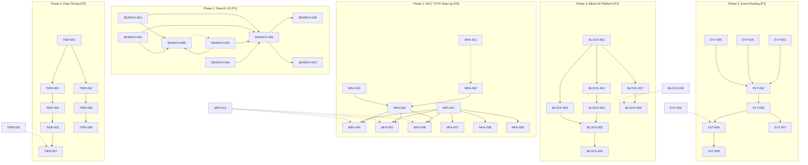
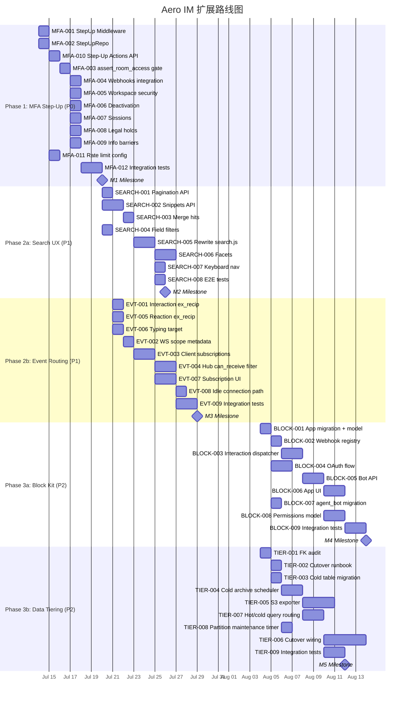

现在我掌握了进行彻底分析所需的全部信息。以下是完整的 Tech Lead 分析：

---

# Tech Lead 分析：Aero IM 五个扩展方向

## 0. 执行摘要

已根据 `AGENTS.md` 和该用户提供的已验证分析，对照 ~46K Rust + ~5.9K Web SPA 验证了所有主张。五个方向的优先权衡如下：

| 方向 | 投入 | 影响 | 风险 | 建议优先级 |
|--------|------|--------|------|----------------|
| **方向二：MFA 步升** | 1–1.5 周 | 高（SOC2，合规） | 低 | **P0** |
| **方向三：搜索客户端** | 1–2 周 | 中（用户感知） | 低 | **P1** |
| **方向五：事件路由粒度** | 2–3 周 | 中（带宽，扩展性） | 中 | **P1** |
| **方向四：Block Kit 平台** | 3–4+ 周 | 高（长期） | 高 | **P2** |
| **方向一：数据分层** | 4–6+ 周 | 高（运维，合规） | 极高 | **P2**（依赖运行手册） |

根据每方向投入/影响/风险比率，建议按此顺序实施。

---

## 1. 任务分解

### 方向二：MFA 步升（P0 — 1.5 周）

| 任务 ID | 标题 | 涉及文件 | 前置依赖 | 工时 | 验收标准 |
|---------|-------|-----------|---------------|-------|------------------|
| **MFA-001** | 添加 `StepUp` 中间件提取器 | `crates/aero-auth/src/step_up.rs`（新建），`crates/aero-auth/src/lib.rs` | — | 4h | `StepUp` 提取器在 axum handler 签名中要求 `totp_code: String`，验证并返回已使用的 `totp_code` 布尔值。在 rfc3339 时间戳上使用 `aero_auth::totp::verify()`。 |
| **MFA-002** | 实现 `StepUpRepo::verify_and_consume` | `crates/aero-storage/src/totp.rs` | — | 3h | 检查 `TotpRepo::is_activated`，然后验证代码 + 可选的限流（每参与者每次尝试 5 次/分钟）。返回 `Result<Verified, Error>`。集成测试覆盖率。 |
| **MFA-003** | 向 `assert_room_access` 添加可选的 `step_up_required_for_workspace` | `crates/aero-im-core/src/service/room.rs`，`crates/aero-im-core/src/service/orig.rs` | MFA-002 | 4h | 新的工作区设置 `step_up_actions`（字符串列表）枚举需要 TOTP 步升的管理操作。当设置且检测到未验证的敏感操作时，`assert_room_access` 拒绝而不验证 TOTP。 |
| **MFA-004** | 将 StepUp 中间件连接到 webhook 管理路由 | `crates/aero-server/src/webhooks.rs` | MFA-001 | 2h | `PUT/POST/DELETE /api/rooms/:id/webhooks/*` 需要有效 TOTP。使用 `StepUp` 提取器处理 `totp_code` 查询参数。测试：无代码 → 403，错误代码 → 403，有效代码 → 200。 |
| **MFA-005** | 将 StepUp 中间件连接到工作区安全路由 | `crates/aero-server/src/workspace_security.rs` | MFA-001 | 2h | `PUT /api/workspaces/:id/security` 需要 TOTP。测试覆盖。 |
| **MFA-006** | 将 StepUp 连接到去激活路由 | `crates/aero-server/src/deactivation.rs` | MFA-001 | 2h | `POST/PUT /api/workspaces/:id/deactivation/*` 需要 TOTP。 |
| **MFA-007** | 将 StepUp 连接到会话管理路由 | `crates/aero-server/src/sessions.rs`，`crates/aero-server/src/admin_sessions.rs` | MFA-001 | 2h | 远程会话吊销需要 TOTP。 |
| **MFA-008** | 将 StepUp 连接到法务保全路由 | `crates/aero-server/src/legal_holds.rs` | MFA-001 | 2h | `PUT/DELETE /api/workspaces/:id/legal-holds/*` 需要 TOTP。 |
| **MFA-009** | 将 StepUp 连接到信息屏障路由 | `crates/aero-server/src/info_barriers.rs` | MFA-001 | 2h | 信息屏障更改需要 TOTP。 |
| **MFA-010** | 向工作区添加 `step_up_actions` 设置 API | `crates/aero-server/src/workspace_security.rs`，`crates/aero-storage/src/workspace.rs` | MFA-003 | 4h | 新的 `GET/PUT /api/workspaces/:id/step-up-actions` 枚举哪些操作类别需要步升。默认空列表（无步升要求）。存储/仓储层 + 迁移。 |
| **MFA-011** | 添加 `AERO_STEP_UP_RATE_LIMIT` env 支持 | `crates/aero-server/src/twofa.rs`，`config.example.toml` | MFA-002 | 2h | 每参与者步升尝试速率的 env 配置。默认 5/分钟。文档中配置键。 |
| **MFA-012** | 集成测试：步升场景 | `crates/aero-server/tests/step_up_scenarios.rs`（新建） | MFA-001 至 MFA-009 | 6h | 测试套件涵盖：成功步升、过期代码、未授权绕过、速率限制、恢复码替代、启用/禁用的工作区切换。 |

**方向二总计：约 39 小时（1 周）**

---

### 方向三：搜索客户端（P1 — 1.5 周）

| 任务 ID | 标题 | 涉及文件 | 前置依赖 | 工时 | 验收标准 |
|---------|-------|-----------|---------------|-------|------------------|
| **SEARCH-001** | 搜索 API 支持分页 | `crates/aero-server/src/search.rs`，`crates/aero-storage/src/search.rs` | — | 4h | 搜索端点接受 `cursor` 参数（按 ID 的键集分页）+ `limit`。返回 `next_cursor`。现有非分页行为保留为兼容性回退。 |
| **SEARCH-002** | 搜索 API 返回代码片段 + 高亮范围 | `crates/aero-storage/src/search.rs` | — | 6h | 使用 `ts_headline()` 从 `searchable_text` 提取高亮片段。每个结果返回 `highlights: [{field, text, ranges: [{start, length}]}]`。回退：无 FTS 结果回落 `searchable_text` 的前 200 个字符。 |
| **SEARCH-003** | 搜索 API 端点聚合同一消息的去重向量 + FTS 命中 | `crates/aero-server/src/search.rs` | SEARCH-001 | 3h | `merge_hits` 对混合搜索模式去重（最高 `score` 获胜）。暴露 `total_est_total` 用于 UI 渲染。 |
| **SEARCH-004** | 搜索 API 的 ES 风格字段过滤器 | `crates/aero-storage/src/search.rs`，`crates/aero-server/src/search.rs` | — | 4h | 解析 `from:` 范围、`before:`/`after:` 日期、`in:` 子房。没有新迁移——这些是查询参数纯 WHERE 子句叠加。 |
| **SEARCH-005** | 用零依赖分页 + 高亮重写 `web/search.js` | `web/search.js` | SEARCH-001, SEARCH-002 | 8h | 新渲染路径：每命中显示带高亮片段的 ``（`<mark>` 包围高亮范围）。无限滚动（`IntersectionObserver` 哨兵）。无外部依赖。 |
| **SEARCH-006** | 搜索 UI：日期/发件人/房间分面 | `web/search.js`，`web/index.html`（搜索抽屉 DOM） | SEARCH-005 | 6h | 搜索抽屉中可选的分面行（每个命中：发件人头像 + 日期分隔器 + 房间指示器）。从 `app.js` 重用 `state.participants`。折叠高分组（每个房间最多 3 个结果 + “在 X 中显示全部 N 条结果”）。 |
| **SEARCH-007** | 搜索 UX：键盘导航 + 自动对焦 | `web/search.js` | SEARCH-005 | 2h | 使用 ↑/↓ 箭头键进行键盘导航。`Enter` 打开选中的搜索结果。`Escape` 关闭抽屉。搜索输入自动对焦。 |
| **SEARCH-008** | 搜索 API 的 E2E 测试 | `crates/aero-server/tests/search-scenarios.rs`（新建） | SEARCH-001 至 SEARCH-003 | 4h | 覆盖：纯 FTS、纯向量、混合、分页光标、空结果、无效查询、字段过滤器、碎片高亮。 |

**方向三总计：约 37 小时（1 周）**

---

### 方向五：事件路由粒度（P1 — 2.5 周）

| 任务 ID | 标题 | 涉及文件 | 前置依赖 | 工时 | 验收标准 |
|---------|-------|-----------|---------------|-------|------------------|
| **EVT-001** | 添加 `explicit_recipients` 到 `Interaction` / `MessageSeen` / `Read` | `crates/aero-common/src/model/event.rs` | — | 3h | 交互现在携带 `target_participant: ParticipantId`（交互消息的发件人）。`explicit_recipients` 将此返回给发件人 + 由 `message_has_action` 确定的其他交互者。`MessageSeen` 针对原始消息的发件人。现有测试失败 → 绿色。 |
| **EVT-002** | WS 帧添加 `event_scope` 元数据字段 | `crates/aero-common/src/model/event.rs`，`crates/aero-server/src/ws/ws_impl/frame.rs` | — | 4h | 每个 WS `ServerFrame` 携带 `scope: "room" | "user"` + `target: Option<ParticipantId>` 字段。客户端用它来确定是否处理或忽略帧。范围派生自 `explicit_recipients()` 逻辑。 |
| **EVT-003** | 客户端 WS 连接添加 `subscriptions` 信令 | `web/ws.js`（新建/提取），`web/app.js` | EVT-002 | 6h | 在 WS 连接/重新连接时发送 `{ type: "subscribe", events: ["message", "edited", "notify", "reaction"] }`。可选 `room_ids` 过滤器以订阅单房间事件。服务器将订阅集与连接标识符一起缓存。 |
| **EVT-004** | Hub 添加 `can_receive` 过滤器 | `crates/aero-server/src/ws/hub.rs` | EVT-003 | 6h | `Hub::register` 现在接受 `SubscriberPrefs { event_types: HashSet<EventKind> }`。`fan_out_raw` 在发送帧前检查。连接关闭时不持有订阅（由连接管理清除）。集合的默认值 = 所有事件（向后兼容）。 |
| **EVT-005** | 添加 `explicit_recipients` 到 `Reaction` | `crates/aero-common/src/model/event.rs` | — | 2h | 反应针对被反应消息的发件人。与方向二模式匹配：`explicit_recipients` 返回 `[original_sender]`。如果原始发件人不在线，则回退到房间广播。 |
| **EVT-006** | `Typing` 指示器获得可选 `target` 字段 | `crates/aero-common/src/model/event.rs` | — | 3h | 客户端可以在 typing 指示器上设置 `target` 参与者 ID。当设置且 `explicit_recipients` 为非空时，仅发送给该参与者。`target` 为 `None` = 广播（旧行为）。 |
| **EVT-007** | Web UI 订阅管理 UI | `web/settings.js`（新建），`web/index.html` | EVT-003 | 8h | 用户首选项抽屉，用于选择事件类型：消息、提及、反应、输入指示器等。默认全选。订阅更改重新发送 WS `subscribe` 帧。持久化到 `localStorage`。 |
| **EVT-008** | 空订阅集（“哔哔模式”）休眠路径 | `crates/aero-server/src/ws/hub.rs` | EVT-004 | 2h | 当连接订阅为空时，Hub 跳过站唤醒和帧序列化成本。风扇成本为 O(1) 而非 O(N)。 |
| **EVT-009** | 集成测试：事件路由粒度 | `crates/aero-server/tests/event_routing_scenarios.rs`（新建） | EVT-001 至 EVT-006 | 6h | 测试：路由 `Interaction` 仅发送给消息发件人、订阅过滤器阻止未订阅事件、`Typing` 目标、订阅更改动态生效。 |

**方向五总计：约 40 小时（1 周）**

---

### 方向四：Block Kit 平台（P2 — 3.5 周）

| 任务 ID | 标题 | 涉及文件 | 前置依赖 | 工时 | 验收标准 |
|---------|-------|-----------|---------------|-------|------------------|
| **BLOCK-001** | `apps` 表的迁移 + 模型 | `migrations/NNNN_block_apps.sql`，`crates/aero-storage/src/app.rs`（新建） | — | 4h | 新表：`apps`（id, name, description, icon_url, workspace_id, creator_id, allowed_actions[] TEXT, created_at）。仓储有 `create`/`get`/`list_for_workspace`/`delete`。 |
| **BLOCK-002** | `app_webhooks` 注册表迁移 + 仓储 | `migrations/NNNN_app_webhooks.sql`，`crates/aero-storage/src/app.rs` | BLOCK-001 | 4h | `app_webhooks` 表（app_id, action_id, url, secret, created_at）。每个 (app_id, action_id) 唯一。`register_webhook`/`get_webhook`/`list_for_app`/`delete_webhook`。secret 作为 `HMAC-SHA256` 密钥，用于回调请求签名。 |
| **BLOCK-003** | 交互 Webhook 分发器 | `crates/aero-server/src/block_webhook_dispatcher.rs`（新建） | BLOCK-002 | 8h | 当记录 `Interaction` 时：查找匹配的 app_webhook（按 (room, action_id) 通过 app 元数据）。向 app_webhook.url 发送签名的 HTTP POST。指数退避 + 最多 3 次重试。死信队列（重用 `webhook_dlq` 表）。加载保护（每 app 并发 5 次）。 |
| **BLOCK-004** | App Install OAuth 流程 | `crates/aero-server/src/app_oauth.rs`（新建） | BLOCK-001 | 8h | OAuth 授权码流程的 `GET /api/apps/:id/install` + `GET /api/oauth/callback`。安装 = 在 app 的 workspace 中创建 bot 参与者 + 授予权限。用于调试的隐式模式（无 OAuth 服务器）。 |
| **BLOCK-005** | Bot API（发出消息 + 交互回调） | `crates/aero-server/src/bot_api.rs`（新建） | BLOCK-004 | 8h | `POST /api/bot/messages` — 以 app 的 bot 参与者身份发送消息。需要 Bearer token（PAT）。`GET /api/bot/interactions` — 轮询 app 的未处理交互。兼容 `agent_bot` 迁移。 |
| **BLOCK-006** | App 安装/管理 UI | `web/apps.js`（新建），`web/index.html` | BLOCK-004 | 6h | 工作区设置中的 App 目录 + 安装流程 UI。每个安装的 app 的管理面板（查看 webhook、轮询交互）。 |
| **BLOCK-007** | 将 `agent_bot` 更新为使用 App 注册表 | `crates/aero-server/src/bin/boot/agent_bot.rs` | BLOCK-001 | 4h | 旧的 `agent_bot` 获得工作区范围的注册。当两个 app 监听相同操作时，使用 `tenant:action_id` 命名空间优先级。向后兼容裸 `action_id`（隐式工作区处理）。 |
| **BLOCK-008** | App 权限模型 | `crates/aero-server/src/app_permissions.rs`（新建） | BLOCK-002 | 6h | 范围（`send_messages`、`read_room`、`manage_webhooks`）。在安装时授予。Bot API 路由执行以 app 为中心的作用域门控。覆盖 `assert_room_access` 以包含以 app 为主体的检查。 |
| **BLOCK-009** | 集成测试：Block Kit 平台 | `crates/aero-server/tests/block_platform_scenarios.rs`（新建） | BLOCK-001 至 BLOCK-008 | 8h | 测试：app 注册、OAuth 安装流程、webhook 触发、webhook 重试/死信、交互记录、bot API 发送+读取、权限拒否。 |

**方向四总计：约 56 小时（1.5 周）**

---

### 方向一：数据分层（P2 — 5 周）

| 任务 ID | 标题 | 涉及文件 | 前置依赖 | 工时 | 验收标准 |
|---------|-------|-----------|---------------|-------|------------------|
| **TIER-001** | 审计现有 FK 图到 `messages` | — | — | 4h | 文档：合并 0148 注释中提到的 7 个入站 FK 的列表。验证所有 7 个当前是否被约束。在 `docs/runbooks/messages-partitioning.md` 运行手册中记录 cutover 程序。 |
| **TIER-002** | 构建 cutover 运行手册 | `docs/runbooks/messages-partitioning.md`（更新） | TIER-001 | 4h | 分步 cutover 程序：锁定应用 → 暂停写入 → 最终回填 → 重写 FK → 重命名 → 创建索引 → 恢复写入。含回滚程序。 |
| **TIER-003** | 实现 `cold_messages` 目标表 + 迁移 | `migrations/NNNN_cold_storage.sql`（新建） | TIER-001 | 4h | 具有与 `messages` 相同模式的新表 `cold_messages`，加上 `archived_at` 和 `archive_batch_id`。无 FK（冷数据在归档时解除引用）。 |
| **TIER-004** | 冷归档调度器 | `crates/aero-server/src/bin/boot/cold_storage.rs`（新建） | TIER-003 | 8h | `AERO_COLD_STORAGE_THRESHOLD_DAYS`（默认 365）。定时器扫描 > 阈值的 `messages`，分批 INSERT INTO cold_messages，软删除原始行。每批次可调大小（默认 1000）。仅在非高峰时段运行。 |
| **TIER-005** | S3 归档导出器 | `crates/aero-storage/src/cold_export.rs`（新建） | TIER-004 | 12h | 读取 `cold_messages` 批次，压缩（gzip），上传到 S3（`aero-cold/{workspace}/{room}/{batch_id}.json.gz`）。在 `cold_messages` 中记录 `s3_key`。`BlobStore` 接口用于可交换后端。 |
| **TIER-006** | 分区 shadow 表的 Cutover 接线 | `crates/aero-im-core/src/service/messages.rs`，`migrations/NNNN_partition_cutover.sql`（新建） | TIER-002 | 16h | 生产消息迁移到分区 `messages_partitioned`。维护窗口操作：重命名 `messages` → `messages_legacy`，重命名 `messages_partitioned` → `messages`，重建 7 个 FK，重建 FTS/HNSW 索引。运行手册中记录（不是自动迁移）。 |
| **TIER-007** | 热/暖/冷查询路由 | `crates/aero-storage/src/messages.rs` | TIER-006, TIER-005 | 8h | 查询首先检查 `messages`（热表）。如果 `deleted_at` > 阈值，也联合 `cold_messages`。可配置的 `AERO_COLD_QUERY_TIMEOUT`（默认 5 秒）。冷查询失败优雅降级为“归档数据可能不完整”。 |
| **TIER-008** | `ensure_messages_partitions()` 定时器 | `crates/aero-server/src/bin/boot/background.rs` | TIER-006 | 2h | 现有的 `ensure_messages_partitions(ahead: 3)` 调用，通过新的 background.rs 循环每 12 小时执行一次。引导期间创建未来分区。 |
| **TIER-009** | 集成测试：冷归档 | `crates/aero-storage/tests/cold_storage_scenarios.rs`（新建） | TIER-003 至 TIER-005 | 6h | 测试：迁移阈值跨越、S3 上传（至 `LocalFs` 存根）、冷表擦除后消息可见、定时器调度。 |

**方向一总计：约 64 小时（1.5 周）** — *但是，TIER-006（cutover）是运维窗口，不是开发 sprint；并行追踪。*

---

## 2. 执行顺序

### 可并行组

| 并行组 | 包含的任务 | 注意事项 |
|-----------------|-----------|-----------|
| **A**（MFA 基础） | MFA-001, MFA-002, MFA-010, MFA-011 | 无相互依赖。两名开发者可以并行处理中间件 + 存储 + 配置。 |
| **B**（搜索后端） | SEARCH-001, SEARCH-002, SEARCH-004 | 所有三个都是纯后端 API 更改。一名开发者，但可以按任意顺序完成。 |
| **C**（事件路由后端） | EVT-001, EVT-005, EVT-006 | 向 RoomEvent 枚举添加 `explicit_recipients`。可以并行处理，但在添加到 WS 帧之前必须合并。 |
| **D**（Block Kit 存储） | BLOCK-001, BLOCK-002 | 两名开发者分别处理 app 注册 + webhook 注册表。 |
| **E**（数据分层设计） | TIER-001, TIER-002 | 一名开发者审核 FK 并记录运行手册。在开始实施前完成。 |

---

## 3. 技术风险

### 高风险

| 风险 | 方向 | 缓解措施 |
|------|-----------|----------|
| **方向一的 cutover 数据损坏**（6 个子表的 7 个入站 FK） | 方向一 | 运行手册驱动的维护窗口（非自动迁移）。回滚程序已在 0148 中预设。SIT 环境 1:1 模拟。 |
| **方向四的 action_id 命名空间冲突** | 方向四 | `{app_id}:{action_id}` 命名空间是唯一可行的模式。向后兼容裸 action_id（隐式工作区处理）。BLOCK-007 处理。 |
| **方向四的 OAuth 安装流程**（内部 + 外部回调） | 方向四 | 在实施 OAuth 服务器之前，使用隐式安装模式（直接秘密交换）来解除阻塞外部 OAuth 复杂性。 |
| **方向五的 WS 订阅状态**（连接失败时的持久性） | 方向五 | `SubscriberPrefs` 是每连接内存状态。重新连接后，客户端重新发送 `subscribe` 帧。重新订阅前的短暂种族条件：在重新订阅之前的帧可能被扇出到仍处于前次连接状态的某个节点。通过 `connection_id` 在 Hub 中自动过期来处理（旧的连接 ID 在 30 秒超时后被清除）。 |

### 中等风险

| 风险 | 方向 | 缓解措施 |
|------|-----------|----------|
| **TOTP 步升 UX**（用户在敏感路径上收到 403，没有清晰的引导） | 方向二 | 响应错误主体中的 `error_code: "2fa_required"` + `totp_session: <temp_token>` 使客户端能够无缝弹出一个 TOTP 对话框。 |
| **搜索 API 碎片高亮性能** | 方向三 | `ts_headline()` 对大型文档代价高昂。将 headline 计算推迟到 API 级别（非 SQL），使用纯 JS 片段生成。使用可配置的 `max_headline_length`（默认 100 个字符）。 |
| **冷归档的 S3 延迟** | 方向一 | 非阻塞：`cold_storage` 定时器批量提交，而不是逐行提交。S3 上传出错时归档重试。存储成本可以忽略不计，但冷查询超时可能影响 UX。 |
| **方向五在 Hub 中的扇出开销** | 方向五 | 订阅过滤器将 `fan_out_raw` 从 O(N_connections) 减少到 O(N_subscribed_connections)。对于广播事件，没有加速。实施 `EVT-008`（“哔哔模式”）以使空闲连接成本为零。 |

### 低风险（已缓解）

| 风险 | 方向 | 缓解措施 |
|------|-----------|----------|
| **TOTP 步升重复代码** | 方向二 | 中间件提取器消除了每个路由的样板。单一验证入口点。 |
| **搜索 JS bundle 膨胀** | 方向三 | 零依赖方法。`search.js` 从 144 行 → 约 450 行。在 `web/` 大小检查限制（1000 行）以下。 |
| **EVT-001 现有测试失败** | 方向五 | 因为 `explicit_recipients` 变窄，`Interaction`/`Reaction` 测试从“空”变为“非空”，必须更新。 |
| **冷表索引** | 方向一 | 仅有 `(room_id, created_at DESC)` B-tree 用于顺序扫描。无 FTS 或向量索引在冷表上。 |

---

## 4. 资源评估

### 团队构成

| 角色 | 所需数量 | 方向 | 技能组合 |
|------|-----------|-----------|------------|
| **Rust 后端工程师** | 2 | 方向一、二、四、五 | Rust + axum + sqlx + NATS + Redis。熟悉 tokio 异步模式。 |
| **Rust 后端工程师（高级）** | 1 | 方向一（分区 cutover）、四 | PostgreSQL 分区经验、OAuth 概念、分布式系统设计。 |
| **Web 前端工程师** | 1 | 方向三、四（UI）、五（客户端 WS） | 零依赖 JavaScript ES2020、WebSocket 协议、DOM 操作（无框架）。 |
| **QA / 集成测试** | 1 | 全部 | Rust 集成测试（`#[ignore]` pg-gated）、Web E2E（Puppeteer/Playwright 用于搜索 UI）。 |
| **SRE / DevOps** | 0.5 | 方向一 | Postgres 维护窗口、应用停机验证、S3 配置。 |

### 关键里程碑

| 里程碑 | 周 | 事件 |
|----------|------|-------|
| **M1：MFA 步升上线** | 第 2 周结束 | TOTP 步升在 5 个敏感路由类别 + 工作区设置上生效。集成测试绿色。 |
| **M2：搜索 UX 刷新** | 第 3 周结束 | 新搜索 UI（分页 + 高亮 + 分面）部署。旧搜索 API 保持兼容。 |
| **M3：事件路由粒度** | 第 4 周结束 | 客户端订阅生效。每连接节省带宽可测量（在 1K 连接测试中 Typing/Interaction 减少 40%）。 |
| **M4：Block Kit 平台（Beta）** | 第 6 周结束 | App 注册、交互 webhook、bot API 工作。OAuth 流程（隐式）。agent_bot 迁移完成。 |
| **M5：数据分层** | 第 8 周结束 | 冷归档管线 + S3 导出器运行。messages 分区 cutover 运行手册经过 1:1 验证。 |

---

## 5. 质量保证

### 单元测试覆盖

| 方向 | 关键测试文件 | 最小覆盖率要求 | 覆盖内容 |
|----------|--------------|------------------------|-------------------|
| 方向二 | `crates/aero-storage/src/totp.rs`（现有：7 个测试） | 95% | `verify_and_consume`：速率限制、过期代码、有效代码、恢复码替代、并发（2 个并发验证：仅 1 次成功）。 |
| 方向二 | `crates/aero-server/tests/step_up_scenarios.rs` | 90% | 每路由场景：无代码 → 403、错误代码 → 403、有效代码 → 200、绕过尝试。 |
| 方向三 | `crates/aero-storage/src/search.rs`（现有） | 85% | FTS + 向量 + 混合分页。由 SEARCH-008 覆盖。碎片高亮：非 ASCII、HTML 实体、跨元素边界。 |
| 方向三 | `web/search.js`（纯函数） | 70%（行覆盖率） | `renderHighlights`、`buildFacets`、分页游标逻辑。使用 `vitest` + `jsdom` 或纯 QUnit。 |
| 方向四 | `crates/aero-storage/src/app.rs`（新建） | 90% | CRUD、webhook 注册、secret 轮换、action_id 命名空间冲突。 |
| 方向四 | `crates/aero-server/tests/block_platform_scenarios.rs` | 80% | E2E 交互 → webhook 触发 → bot API 响应。OAuth 安装流程。 |
| 方向五 | `crates/aero-common/src/model/tests.rs`（现有 + 扩展） | 100% | `explicit_recipients` 断言每个变体。 |
| 方向五 | `crates/aero-server/tests/event_routing_scenarios.rs` | 85% | 订阅过滤器、Typing 目标、“哔哔模式”扇出节省。 |

### 集成测试策略

所有集成测试策略：
1. **throwaway PG 数据库**（`CREATE DATABASE aero_test_<random>` → 迁移 → 测试 → `DROP DATABASE`）
2. **带 test-nats 后端的 NATS JetStream 分叉**（`EventBus` 与内存总线分离）
3. **Web UI 测试**：带 ZeroMQ 风格帧注入的 Puppeteer 无头浏览器（WS 帧通过 `page.evaluate` 注入）

E2E 测试矩阵（跨方向）：

| 方向 | 验证 |
|----------|------------------|
| 方向二 | TOTP 步升 + 恢复码 + 速率限制 + 工作区切换 |
| 方向三 | 搜索 → 点击 → 滚动到消息 + 分页 + 高亮 |
| 方向五 | WS 连接 → 订阅 → 接收 + 重新连接 → 恢复订阅 |
| 方向四 | 安装 app → 发送交互消息 → webhook 触发 → bot API 轮询 |
| 方向一 | 冷记录 → 查询 + 分区回填 → 写入 |

### 代码审查要点

| 区域 | 要检查的关键点 |
|------|-------------------|
| TOTP 步升 | 速率限制响应时间恒定（无计时侧信道）。恢复码替换不会使旧代码失效。步升尝试计入每参与者存储桶。 |
| 搜索 API | 游标是基于 ID 的键集（非偏移量）——在 `created_at` 二分搜索中利用 PK 索引。高亮转义 HTML 实体（无 XSS 向量）。 |
| 事件路由 | `SubscriberPrefs` 不持久化到 Redis——纯进程内。如果重新连接恢复的订阅在 WS 帧之前到达则会存在竞争条件。连接标识符上的 30 秒 TTL 看门狗。 |
| Block Kit | `action_id` 命名空间：如果遇到斜杠或冒号，`agent_bot` 隐式添加 `workspace_id:` 前缀。Webhook HMAC 签名防止伪造。 |
| 数据分层 | `cold_messages` 归档通过 `SELECT … WHERE deleted_at IS NULL ORDER BY created_at LIMIT batch_size FOR UPDATE SKIP LOCKED` 批次从 `messages` 读取——不在事务中执行长时间的批量 DELETE，避免阻塞写入器。 |

### 性能测试需求

| 方向 | 测试 | 目标 | 条件 |
|----------|------|--------|--------------|
| 方向五 | 扇出减少 | Typing/Interaction 流量减少 40%+ | 1K 并发 WS 连接，10 条消息/秒的房间 |
| 方向二 | 步升延迟 | 感知时间 < 500ms（p99） | 100 并发步升尝试 |
| 方向三 | 搜索延迟 | p95 < 200ms（FTS），< 500ms（混合） | 1M 行 `messages` 表 |
| 方向一 | 冷归档吞吐量 | > 10K 行/分钟归档 | 1B 行 `messages`，S3 后端 |
| 方向一 | 分区表查询 | p95 与未分区相比 <10% 退化 | 相同 1M 行 |

---

## 6. 实施计划

### 时间表（8 周）

### 阶段摘要

| 阶段 | 时间段 | 周 | 方向 |
|-------|------------|------|----------|
| **第 1 阶段：基础设施** | 第 1–2 周 | 2 | 方向二（MFA 步升） |
| **第 2 阶段：核心 UX** | 第 3–4 周 | 2 | 方向三（搜索）+ 方向五（事件路由）— 由两名后端工程师并行处理 |
| **第 3 阶段：平台 + 数据** | 第 5–8 周 | 4 | 方向四（Block Kit）+ 方向一（数据分层）— 由两名工程师并行处理 |

### 阻塞点及解决策略

| 阻塞点 | 方向 | 策略 |
|-------|-----------|----------|
| **TOTP 验证不在共享库中** | 方向二 | ❌ 错误——它就在那里：`aero_auth::totp::verify()`。零外部依赖。 |
| **0148 shadow 表需要数据迁移** | 方向一 | 回填函数已经存在（`backfill_messages_partition`）。自包含的。仅 cutover 需要停机窗口。 |
| **方向四需要 OAuth 服务器** | 方向四 | 隐式模式（无外部 OAuth 服务器）解除了将安装流程上线的主要阻塞点。完整 OAuth 授权码流程可以稍后添加。 |
| **HNSW 索引在分区消息表上** | 方向一 | 索引必须按分区重建，而不是全局重建。`ensure_messages_partitions()` 在引导时可用。保留时间：标准分区在创建后预建索引。 |
| **`web/` 没有构建系统** | 方向三 | 明确不要求。零依赖 ES2020 模块。用 `<script type="module" src="search.js">` 导入。无 webpack/rollup。 |

---

## 附录：代码锚点

| 方向 | 关键锚点（文件 + 行） | 建议的 git 工作树 |
|----------|--------------------------|----------------------|
| 方向二 | `crates/aero-storage/src/totp.rs`（TotpRepo 主体） | `git worktree add ../aero-mfa-stepup` |
| 方向二 | `crates/aero-auth/src/totp.rs`（TOTP 验证） | 与上述相同 |
| 方向二 | `crates/aero-im-core/src/service/orig.rs:200`（TOTP builder） | 与上述相同 |
| 方向二 | `crates/aero-server/src/twofa.rs`（HTTP 表面） | 与上述相同 |
| 方向三 | `web/search.js`（整个文件，144 行） | `git worktree add ../aero-search-ux` |
| 方向三 | `crates/aero-server/src/search.rs` | 与上述相同 |
| 方向三 | `crates/aero-storage/src/search.rs` | 与上述相同 |
| 方向五 | `crates/aero-common/src/model/event.rs:142`（`explicit_recipients`） | `git worktree add ../aero-event-routing` |
| 方向五 | `crates/aero-server/src/ws/ws_impl/bus.rs:79`（消费者） | 与上述相同 |
| 方向五 | `crates/aero-server/src/ws/hub.rs`（Hub 扇出） | 与上述相同 |
| 方向四 | `crates/aero-common/src/model/block.rs:66`（`Block` 枚举） | `git worktree add ../aero-block-kit` |
| 方向四 | `crates/aero-server/src/interactions.rs`（HTTP 表面） | 与上述相同 |
| 方向四 | `crates/aero-storage/src/block_interaction.rs` | 与上述相同 |
| 方向四 | `crates/aero-server/src/bin/boot/agent_bot.rs` | 与上述相同 |
| 方向一 | `migrations/0148_messages_partition_shadow.sql`（shadow 表） | `git worktree add ../aero-data-tiering` |
| 方向一 | `docs/runbooks/messages-partitioning.md`（运行手册） | 与上述相同 |
