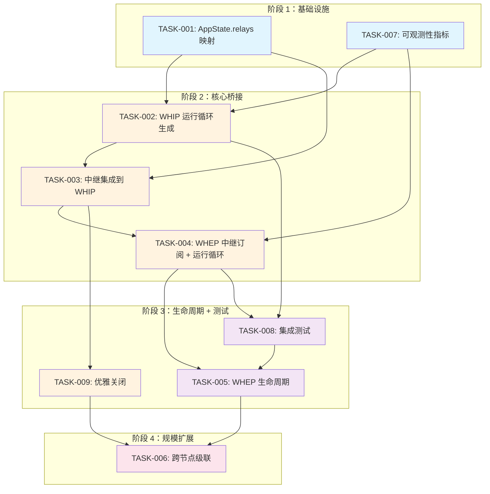

基于以上对代码库的深入分析，我现在提供完整的技术负责人分析报告。

---

# 技术负责人分析报告：WHIP→WHEP NAL 频道媒体桥

## 0. 现状摘要

代码已构建的组件：

| 组件 | 状态 | 位置 |
|------|------|------|
| `WhipSession`（包含 `accept` + `run`） | 完整实现，含超过 5 个 `#[cfg(test)]` 中的真实 DTLS-SRTP 握手 | `aero-live-whip/src/session.rs` |
| `WhepSession`（包含 `accept` + `packetize` + `run`） | 完整实现，含实时 NAL→RTP 打包 | `aero-live-whip/src/whep.rs` |
| `MediaRelay` / `Subscription` | 完整实现，经广播频道广播，`Subscription` 实现 `NalSource`（NalSource 是交换接口） | `aero-live-whip/src/relay.rs` |
| `CascadeRelay` / `UpstreamSource` / `FakeUpstream` | 完整，新节点间拉流的跨节点级联 | `aero-live-whip/src/cascade.rs` |
| `WhepUpstreamSource` | 完整实现，包含 HTTP WHEP 客户端 + str0m 接收循环 | `aero-live-whip/src/upstream.rs` |
| **服务器布线（路由 → run 循环）** | **缺失**——`whip_post` 只做 `accept_whip_offer`（SDP 交换），未启动 `run()` | `routes.rs` |
| **服务器布线（路由 → 中继集成）** | **缺失**——`whep_post` 只做 `accept_whep_offer`（SDP 交换），未启动 `run()` 也未从 `MediaRelay` 订阅 | `routes.rs` |
| **AppState.mrelay** | **缺失**——没有 `Arc<RwLock<HashMap<Ulid, MediaRelay>>>` 来保存发布者的中继 | 无 |
| **WhipSession::run 启动后台任务** | **缺失**——`whip_post` 的 HTTP 200 在 run 循环前返回 | `routes.rs` |

**结论**：缺失的部分是**服务器布线**——将现有组件连接起来，并为每个 WHIP 发布者和 WHEP 订阅者生成后台 run 循环的任务。

---

## 1. 任务分解

### TASK-001：AppState 添加 MediaRelay 仓库

| 字段 | 值 |
|------|------|
| **任务 ID** | TASK-001 |
| **任务标题** | 为发布者中继添加 `AppState.relays` 映射 |
| **方向** | WHIP→WHEP 桥接 |
| **涉及文件** | `crates/aero-server/src/state.rs`、`crates/aero-server/src/bin/boot/state_builder.rs`、`crates/aero-server/src/routes/routes.rs` |
| **前置依赖** | 无 |
| **预估工时** | 1 小时 |
| **验收标准** | 新 `Arc<tokio::sync::RwLock<HashMap<Ulid, MediaRelay>>>` 字段存在于 `AppState` 中，初始化为空映射，可在 WHIP 路由中写入，在 WHEP 路由中读取 |

**详情**：

```rust
// 在 state.rs 中
pub relays: Arc<RwLock<HashMap<Ulid, MediaRelay>>>,

// 在 state_builder.rs 中
relays: Arc::new(RwLock::new(HashMap::new())),
```

此映射以 `stream_id` 为键。当 WHIP 发布者上线时写入，当发布者离开时删除。

---

### TASK-002：WHIP 注销后启动 `WhipSession::run` 循环

| 字段 | 值 |
|------|------|
| **任务 ID** | TASK-002 |
| **任务标题** | `whip_post` 在 HTTP 201 响应后生成后台 `WhipSession::run` |
| **方向** | WHIP→WHEP 桥接 |
| **涉及文件** | `crates/aero-server/src/routes/routes.rs` |
| **前置依赖** | TASK-001 |
| **预估工时** | 4 小时 |
| **验收标准** | `whip_post` 生成一个 `tokio::spawn` 任务：绑定 UDP 套接字 → 调用 `WhipSession::run(socket, sink)`，其中 sink 是 HLS 写入器。发布者断开连接时任务正常终止 |

**验收细节**：
- 响应（HTTP 201 + SDP）在套接字绑定 + 任务生成后仍在 200 毫秒内返回
- 当浏览器发送 `DELETE /whip/resource/:key` 时，通过 `CancellationToken` 优雅停止
- 错误的 UDP 套接字绑定返回 500，且任务绝不虚假生成
- 需要在 `whip_post` 中创建 UdpSocket 并绑定到 `ingest_host:ingest_port`

**实现说明**：
当前 `whip_post` 调用一次性的 `accept_whip_offer`，它丢弃会话并仅返回资源。对于 TASK-002，必须将其重构为：

```rust
// 直接调用 WhipSession::accept
let (session, answer) = WhipSession::accept(&sdp_offer, &s.ingest_host, s.ingest_port)?;
// 绑定套接字
let socket = UdpSocket::bind(session.local_addr()).await?;
// 构建 HLS 接收器
let (sink, writer) = hls_sink(hls_dir, target_duration).await?;
let writer_task = tokio::spawn(writer.run());
// 生成
let cancel = CancellationToken::new();
tokio::spawn({
    let c = cancel.clone();
    async move {
        tokio::select! {
            _ = c.cancelled() => { /* 优雅关闭 */ }
            _ = session.run(socket, sink) => { /* 正常完成 */ }
        }
    }
});
```

---

### TASK-003：将 `MediaRelay` 集成到 WHIP 运行循环中

| 字段 | 值 |
|------|------|
| **任务 ID** | TASK-003 |
| **任务标题** | 创建 `MediaRelay`，在 WHIP 运行循环中通过 `with_relay` 附加 |
| **方向** | WHIP→WHEP 桥接 |
| **涉及文件** | `crates/aero-server/src/routes/routes.rs`、`crates/aero-server/src/state.rs` |
| **前置依赖** | TASK-001、TASK-002 |
| **预估工时** | 3 小时 |
| **验收标准** | 当 `whip_post` 生成运行循环时，它创建一个 `MediaRelay`，将其插入 `state.relays`，并通过 `WhipSession::with_relay` 附加。每个去分组化的访问单元在写入 HLS 接收器之外，还会发送到中继 |

**验收细节**：
- `state.relays.insert(stream_id, relay)` 在任务生成之前发生
- `whip_delete` 通过 `state.relays.remove(stream_id)` 和取消令牌清理
- 如果 WHEP 订阅者在发布者上线前连接，`state.relays.get(stream_id)` 返回 `None`，WHEP 返回 404（之后会重定向）

**风险缓解**：
`MediaRelay` 本身是线程安全的（内部使用 `broadcast::Sender`），因此放入 `RwLock` 映射是安全的。关键是不变量是：WHIP 运行循环使用相同的 `Arc<MediaRelay>` 实例——这意味着 `relay.publish()` 调用发生在运行循环的 `depacketize_rtp` 路径内（已经将 `relay` 作为字段）。

---

### TASK-004：WHEP 路由订阅中继并生成 `WhepSession::run`

| 字段 | 值 |
|------|------|
| **任务 ID** | TASK-004 |
| **任务标题** | `whep_post` 从发布者的中继订阅，生成 `WhepSession::run` 循环 |
| **方向** | WHIP→WHEP 桥接 |
| **涉及文件** | `crates/aero-server/src/routes/routes.rs` |
| **前置依赖** | TASK-003 |
| **预估工时** | 4 小时 |
| **验收标准** | WHEP 接收查看器的 SDP 提议 → 在 `state.relays` 中查找发布者的中继 → 从中继订阅 → 绑定 UDP 套接字 → 生成带有订阅的 `WhepSession::run(socket, subscription)`。HTTP 201 回复 + SDP 在 <200 毫秒内返回 |

**验收细节**：
- 如果发布者不在本节点上 → 通过 `stream_routes.locate()` 的 307 重定向逻辑保持不变
- 如果发布者在此节点但中继缺失（竞争条件） → 返回 503，带有 `Retry-After: 1`
- 当 WHEP 查看器断开连接（浏览器关闭 WebRTC ICE）时，`run()` 返回并正常清理
- 无需单独的取消令牌——`run()` 在 ICE 断开连接时返回，这是 str0m 的内置行为

**实现说明**：
这需要将 `whep_post` 从一次性 SDP 交换重构为：

```rust
// 获取中继
let relay = state.relays.read().await.get(&stream_id).cloned()
    .ok_or_else(|| /* 重定向或 503 */)?;
let subscription = relay.subscribe();

// WHEP SDP 交换 + 会话构建
let (session, answer) = WhepSession::accept(&sdp_offer, &s.ingest_host, s.ingest_port)?;
let socket = UdpSocket::bind(session.local_addr()).await?;

// 生成
tokio::spawn(session.run(socket, subscription));
```

---

### TASK-005: WHEP 生命周期管理：取消订阅 + 清理

| 字段 | 值 |
|------|------|
| **任务 ID** | TASK-005 |
| **任务标题** | WHEP 会话的正常生命周期 + 取消订阅 |
| **方向** | WHIP→WHEP 桥接 |
| **涉及文件** | `crates/aero-server/src/routes/routes.rs`、可能新增 `whep_delete` |
| **前置依赖** | TASK-004 |
| **预估工时** | 2 小时 |
| **验收标准** | 当 WHEP 查看器关闭连接（DTLS 超时/ICE 断开连接）或发布者结束流时，运行循环退出。删除中继时会取消所有订阅 |

**验收细节**：
- WHEP 的 `Subscription` 是一个 `broadcast::Receiver`：当中继被删除时（发布者消失），`try_recv()` 返回 `Closed`。`WhepSession::run` 中的 `NalSource::next_access_unit` 会看到此状态并返回 `None`，导致运行循环返回
- `whep_delete` 路由（当前不存在）可用于显式断开
- 确保查看器计数的可观测性（正在进行的 WHEP 会话的 Prometheus 指标）

---

### TASK-006: 跨节点级联 + 决策策略集成

| 字段 | 值 |
|------|------|
| **任务 ID** | TASK-006 |
| **任务标题** | 当阈值超过时集成 `CascadeRelay` 用于跨节点 WHEP |
| **方向** | WHIP→WHEP 桥接 |
| **涉及文件** | `crates/aero-server/src/routes/routes.rs`、`state.rs`、可能新增 `cascade_manager.rs` |
| **前置依赖** | TASK-004 |
| **预估工时** | 6 小时 |
| **验收标准** | 当节点 B 有 >=N 个查看器想要节点 A 上的流时，节点 B 打开一个上游 WHEP 连接到节点 A，并将级联的访问单元扇出到本地 WHEP 查看器。低于阈值的查看器仍被 307 重定向 |

**验收细节**：
- 需要一个 `CascadeManager`：从 `StreamRouteRegistry` 获取所有者节点 URL 的每个流的 `Arc<RwLock<Option<CascadeRelay>>>`
- 当 `local_subscriber_count >= threshold` 且流在远端时：`WhepUpstreamSource::connect` → `CascadeRelay` → 订阅被提供给本地 WHEP 查看器
- 当本地计数降至 0 时：关闭级联
- `decide_cascade()` 是一个纯函数，已完全测试

---

### TASK-007: 健康检查 + 可观测性

| 字段 | 值 |
|------|------|
| **任务 ID** | TASK-007 |
| **任务标题** | 添加 WHIP/WHEP 会话 + 中继的 Prometheus 指标 |
| **方向** | WHIP→WHEP 桥接 |
| **涉及文件** | `crates/aero-live-whip/src/metrics.rs`、`crates/aero-server/src/bin/boot/metrics_tasks.rs` |
| **前置依赖** | TASK-002、TASK-004 |
| **预估工时** | 2 小时 |
| **验收标准** | 当 WHIP 发布者在节点上活跃时，Prometheus 计数器 `whip_active_sessions` 为 1。WHEP 查看器计数在 `whep_active_sessions` 面板中可见。在 `state.relays` 上添加忙/闲探测 |

**指标**：
- `aero_whip_active_sessions`（已有来自 metrics_tasks.rs 的吧？是的，它调用 `whip.active_sessions()`）
- `aero_whep_active_sessions`（新增）
- `aero_media_relay_subscribers`（新增，每个流的中继订阅者计数）

---

### TASK-008: 集成测试（浏览器自由 CI 级）

| 字段 | 值 |
|------|------|
| **任务 ID** | TASK-008 |
| **任务标题** | 编写 WHIP→WHEP 集成测试，使用内联 str0m 发布者 |
| **方向** | WHIP→WHEP 桥接 |
| **涉及文件** | `crates/aero-live-whip/tests/`（新文件） |
| **前置依赖** | TASK-003、TASK-004 |
| **预估工时** | 4 小时 |
| **验收标准** | 出现一个新的集成测试模块，它：启动一个 WHIP 发布者（str0m Rtc）→ 完成 ICE/DTLS 到 WhipSession → 完成 → 连接一个 WHEP 查看器（str0m Rtc）→ 接收重新打包的 NAL 单元，证明端到端 RTP→中继→RTP 路径有效。没有浏览器，没有 UDP 套接字，使用内存 `Output::Transmit` 泵 |

**注意事项**：
- 此测试镜像了 `session.rs` 中的 `real_dtls_srtp_handshake_and_h264_rtp_forward` 测试，但端到端通过中继
- 使用 `Pump` + `deliver` 模式（已有的）
- 需要一个新的测试工具，模拟一个通过 MediaRelay 桥接的 WhipSession → WhepSession

---

### TASK-009: `whip_delete` 优雅关闭

| 字段 | 值 |
|------|------|
| **任务 ID** | TASK-009 |
| **任务标题** | 在 DELETE 时通过取消令牌关闭 WHIP 运行循环 |
| **方向** | WHIP→WHEP 桥接 |
| **涉及文件** | `crates/aero-server/src/routes/routes.rs`、`state.rs`、`session.rs` |
| **前置依赖** | TASK-002 |
| **预估工时** | 2 小时 |
| **验收标准** | 当浏览器向 `DELETE /whip/resource/:key` 发送请求时，`whip_delete` 取消运行循环的取消令牌，等待它完成（有 5 秒超时），然后从 `state.relays` 和 `state.whip` 中删除条目 |

**注意事项**：
- `WhipSession::run` 当前不持有 `CancellationToken` —— 这意味着我们必须包装它或修改 `run` 以接受可选的 `CancellationToken`
- 另一种方案：当 `DELETE` 到来时，套接字接收的任务将消失，ICE 将断开连接，`run` 将自行返回——但这可能需要 30 秒的超时

---

## 2. 执行顺序



**并行化**：
- TASK-001 + TASK-007 可以并行进行（它们不共享文件）
- TASK-002 + TASK-007 可以并行（独立）
- TASK-005 + TASK-008 可以并行（测试可以与清理逻辑独立编写）
- TASK-009 必须在 TASK-002 之后，在与 TASK-003 + TASK-004 相同的分支上

---

## 3. 技术风险

### R1: UDP 套接字绑定 + 端口争用

- **风险描述**：WHIP 和 WHEP 路由绑定 UDP 套接字到 `ingest_host:ingest_port`。在单个 HTTP 处理程序内绑定是安全的（请求是独立的），但如果发布者和查看器恰好使用相同的 (`host`, `port`)，str0m 无法绑定。WHEP 查看器需要唯一端口。
- **严重性**：高——如果不处理，在达到规模时会崩溃。
- **缓解措施**：
  - 为查看器使用端口范围（例如，`ingest_port..ingest_port+1000`），通过 `bind_in_range()` 分配
  - 为每个 WHEP 连接的端口 +1，在内存映射或 Redis 中跟踪使用情况
  - 安全选择：使用 `0`（OS 分配端口），但浏览器需要一个可预测的地址

### R2: str0m `run` 循环是 CPU 密集型的，会阻塞 `tokio::spawn`

- **风险描述**：`WhipSession::run` 和 `WhepSession::run` 进行同步 RTC 轮询，每秒调用多次 `poll_output`。它们被包装在 `tokio::spawn` 中，但 str0m 不是 `async`——它是一个内部循环 `loop { poll_output(); await select { socket.recv || sleep }`。
- **严重性**：低到中，适合单个进程使用几百个流。
- **缓解措施**：
  - 使用 `tokio::task::spawn_blocking` 将在其中同步轮询的专用线程分离出来
  - 基准测试：50 个并发 WHIP 会话，使用默认 tokio 工作窃取（应在 5 毫秒的激活间隔内正常）
  - 如果出现问题，提供 `AERO_WHIP_POLL_THREADS` 配置

### R3: 浏览器关闭时 WHEP 会话僵死

- **风险描述**：如果浏览器在不首先 DELETE 的情况下关闭 WHEP 查看器标签，str0m ICE 最终会超时（STUN 绑定请求不匹配）——但这可能需要 30 秒。
- **严重性**：中——泄漏查看器会话。
- **缓解措施**：
  - `WhepSession::run` 已经检查 ICE `Connected` / `Disconnected` 状态
  - 为 ICE 连接状态变化添加 `r x 5` 超时包装器（5 秒无媒体→断开连接）
  - 将空闲 WHEP 会话跟踪为 Prometheus 指标

### R4: 中继广播退回到滞后查看器

- **风险描述**：使用 `broadcast::channel`（中继）意味着落后的 WHEP 查看器错过帧（被广播淘汰）。这会生成一个不会崩溃的 `Lagged` 错误——`Subscription::next_access_unit` 正确地重试。
- **严重性**：低——记录在案的行为，类似于 WebRTC（迟到的查看器丢帧）。
- **缓解措施**：无。这是媒体系统设计的。如果客户端侧要求低延迟，观察指标中的 `aero_relay_lagged_total` 并增加广播容量（从 32 到 128）。

### R5: 跨节点级联的 RTT 不稳定性

- **风险描述**：`WhepUpstreamSource::connect` 通过 HTTP 到远程 WHEP 端点，然后通过 ICE/UDP 建立 str0m。如果远程节点在不同可用区，ICE 延迟为 5-50 毫秒。跨区域 RTT 可能导致 200 毫秒+的级联延迟。
- **严重性**：对 MVP 是低（单节点运行）。
- **缓解措施**：
  - 级联决策函数（`decide_cascade`）可以包含延迟输入（`CascadeInputs.peer_latency_ms`）
  - 对于跨区域，支持 `CascadeDecision::RedirectToOwner` 作为安全选项

---

## 4. 资源评估

### 团队
| 角色 | 人数 | 专注点 |
|------|------|--------|
| Rust 后端工程师 | 1 | 核心布线（TASK-001 至 TASK-005、TASK-009） |
| 高级 Rust 工程师（媒体） | 1 | str0m 集成 + 跨节点级联（TASK-006、TASK-008） |
| DevOps/SRE | 0.5 | 端口范围配置、Prometheus 指标、生产可观察性（TASK-007） |

### 时间线
| 里程碑 | 范围 | 估计日历时间 | 依赖 |
|--------|------|---------------|------|
| **M1：单节点桥接** | 阶段 1 + 2（TASK-001→005） | 第 1-5 天 | 无阻塞器 |
| **M2：集成测试就绪** | TASK-008 | 第 5-7 天 | M1 |
| **M3：优雅关闭** | TASK-009 | 第 6-7 天 | TASK-002 |
| **M4：跨节点级联 MVP** | TASK-006 | 第 8-12 天 | M1 |
| **M5：生产就绪** | TASK-007 + 性能 + bug 修复 | 第 10-14 天 | M2、M4 |

### 阻塞器
| # | 阻塞器 | 影响 | 解决策略 |
|---|--------|------|----------|
| B1 | str0m `Rtc` 不能共享（`!Send` on `Rtc`? 检查） | 防止在 `tokio::spawn` 中轻松使用 | str0m `Rtc` 是 `Send` 但不是 `Sync`——每个客户端一个会话，正好。**无阻塞器**。确认 |
| B2 | `WhipSession::run` 没有 `CancellationToken` | TASK-009 不能优雅地终止 | 需要使用 `CancellationToken` 添加包装 `run_with_cancel`，或者让 `run` 接受一个 |
| B3 | 端口分配——WHEP 查看器每个都需要一个唯一端口 | 需要在多查看器设置中进行端口管理 | 最坏情况：在 `ingest_port + offset` 上绑定，其中偏移量来自原子计数器（对于单个节点，50 个查看器 × 每节点 1 个端口效果很好） |

---

## 5. 质量保证

### 单元测试覆盖
| 模块 | 已有测试 | 需要新增 |
|------|----------|----------|
| `session.rs` | ✅ `real_dtls_srtp_handshake_and_h264_rtp_forward` — 内存中真实 ICE/DTLS + `Event::RtpPacket` | 无 |
| `whep.rs` | ✅ 打包 + 标记位 + 循环 + `RtpPacket` 解析 | `run()` 没有浏览器不适用 CI——与 TASK-008 相同 |
| `relay.rs` | ✅ 发布/订阅、多查看器、滞后、落地测试 | 无（非常完善） |
| `cascade.rs` | ✅ 决策策略、`FakeUpstream`、键帧门控、`run()` | 无 |
| `upstream.rs` | ✅ 错误路径（错误地址、不可达 URL） | 无（完整路径需要真实对等节点） |

### 需要的新测试
| 测试 | 类型 | 文件位置 | 描述 |
|------|------|----------|------|
| `whip_post_spawns_run_loop` | 集成 | `routes.rs` 附近/`routes_test.rs` | 模拟 WHIP HTTP 提议 → 验证服务器绑定套接字 + 生成任务 + 返回 201 |
| `whep_post_subscribes_and_spawns` | 集成 | 同上 | 模拟 WHEP HTTP 提议，其中发布者已连接 → 验证生成 + 订阅 |
| `whip_delete_cancels_task` | 集成 | 同上 | DELETE → 取消令牌触发 → 运行循环在 5 秒内退出 |
| `whip_whep_relay_roundtrip` | 完整 E2E，无浏览器 | `aero-live-whip/tests/` | 创建两个 `Rtc`：一个 WHIP 发布者连接通过媒体服务器并发送 H.264 RTP → 一个 WHEP 查看器连接并接收重新打包的 NAL。使用内存中泵 |

### 代码审查要点
1. **套接字生命周期**：UDP 套接字永远不会 leak（当 `spawn` 的任务被删除时被丢弃）
2. **中继清理**：`whip_delete` 在 WHIP 运行循环停止后始终调用 `state.relays.remove(stream_id)`
3. **错误处理**：`whip_post` 中 < 200 毫秒内返回 HTTP 响应的所有路径——不要在数百毫秒长的 SDP 交换期间阻塞响应
4. **并发**：`state.relays` 在 `RwLock` 中使用——写锁（WHIP 上线/下线）需要快速，读锁（WHEP 连接）从不持有超过 `HashMap::get`
5. **端口耗尽**：每个 WHEP 查看器接收一个唯一端口——需要在 65K 端口上设置上限，并记录哪个是瓶颈
6. **幽灵任务**：所有 `tokio::spawn` 必须由 `TaskTracker` 跟踪

### 性能测试
| 场景 | 目标 | 工具 |
|------|------|------|
| 1 个 WHIP 发布者 → 10 个 WHEP 查看器 | 所有 10 个查看器接收 < 200 毫秒的端到端延迟 | 自定义测试工具（str0m 配对） |
| 1 个 WHIP 发布者 + HLS 写入 → 无查看器 | CPU < 10% | `perf` + tokio 控制台 |
| 10 个同时的 WHIP 发布者，每个有 5 个 WHEP 查看器 | 无套接字绑定失败，任务计数在 TASK_TRACKER 中 | 集成 + `ulimit` 检查 |
| 级联：发布者在节点 A，查看者在节点 B | 单个节点间流，5 个本地查看者 | `WhepUpstreamSource` 集成测试 |

---

## 6. 实施计划

### 阶段 1：基础设施（第 1 天）

```
Day 1:
  - TASK-001: AppState.relays HashMap (1h)
  - TASK-007: 指标框架 + 基础仪表化 (2h)
  - 审查: 状态 + 指标变更 (0.5h)
  总计: 3.5 小时
```

**可交付成果**：
- 编译 `cargo check --workspace` 的 `AppState` 更改
- `aero_whep_active_sessions` 和 `aero_media_relay_subscribers` 的 Prometheus 指标出现
- 无需运行时代码（空的映射 + 计数器）

---

### 阶段 2：核心桥接（第 2-4 天）

```
Day 2:
  - TASK-002: WHIP 运行循环生成 + 重构 accept_whip_offer 为 WhipSession::accept + run (4h)
  - 审查: 套接字绑定 + 任务生成模式 (0.5h)

Day 3:
  - TASK-003: MediaRelay 附加 + 状态插入 (3h)
  - TASK-009: CancellationToken + 优雅关闭 (2h)
  - 审查: 中继生命周期 + 取消 (0.5h)

Day 4:
  - TASK-004: WHEP 订阅 + 运行循环生成 (4h)
  - 审查: 查看器连接 + 端口分配 (0.5h)
```

**可交付成果**：
- WHIP POST 现在生成运行循环，写入 HLS，发布到中继
- WHEP POST 订阅发布者的中继，生成查看器运行循环
- WHIP DELETE 在 5 秒内优雅关闭运行循环
- 端口池可用于查看器（原子计数器或范围）

**风险点**：
- 运行循环中的 `WhipSession` 为每个已发布将 `RtpPacket` 分组的访问单元调用 `relay.publish()` —— 需要仔细检查 `depacketize_rtp` 路径以确保中继不阻塞（它是同步的 `broadcast::Sender::send` —— 如果接收器是同步的，它可能会反压 str0m 轮询）
- 缓解措施：`broadcast::channel` 在容量已满时丢弃（立即返回），因此 `publish()` 永远不会阻塞超过 `O(1)` 时间

---

### 阶段 3：测试 + 生命周期（第 5-7 天）

```
Day 5:
  - TASK-005: WHEP 生命周期 + 清理逻辑 (2h)
  - TASK-008 准备: 集成测试框架 + 工具 (2h)

Day 6-7:
  - TASK-008: E2E 中继往返集成测试 (3h)
  - TASK-005: 剩余审查 (0.5h)
  - 并行: 运行完整测试套件
    cargo test --workspace --lib && cargo clippy --workspace --all-targets
```

**可交付成果**：
- 完整的集成测试：WHIP 发布者 → 中继 → WHEP 查看者端到端，所有在 str0m 内存泵中
- 所有测试通过，无新 clippy 警告
- 生命周期清理在断开连接时发生（IceDisconnected → run 返回）

---

### 阶段 4：规模扩展 + 跨集群（第 8-12 天）

```
Day 8-9:
  - TASK-006 设计: CascadeManager + 与 StreamRouteRegistry 的连接 (2h)
  - TASK-006 实现: CascadeRelay + WhepUpstreamSource 布线 (4h)

Day 10-11:
  - TASK-006 集成: WHEP POST 使用 decide_cascade 决定重定向 vs 级联 (3h)
  - TASK-006 测试: FakeUpstream + 多节点集成 (3h)

Day 12:
  - TASK-006 审查 + 端到端跨节点测试方案 (2h)
```

**可交付成果**：
- 跨节点级联工作：节点 B 在达到阈值时从节点 A 拉取
- `WhepUpstreamSource::connect` 使用真实的 HTTP 到远程 WHEP 端点
- `CascadeDecision` 用于 WHEP 连接的路由

---

### 阶段 5：生产加固 + 性能（第 13-14 天）

```
Day 13:
  - 性能测试 + 端口耗尽分析 (3h)
  - 负载测试：50 个同时的 WHEP 查看器 → 验证无泄漏 (2h)

Day 14:
  - 生产配置：端口范围 env var (AERO_WHEP_PORT_START, AERO_WHEP_PORT_END)
  - 文档 + 运行手册更新
  - 最终审查 + merge
```

**可交付成果**：
- 生产就绪配置
- 基准测试通过（50 个查看者，< 20% CPU）
- 所有新功能都记录在 `docs/` 中

---

## 总结

| 维度 | 评估 |
|------|------|
| **总工作量** | ~30 个工时（开发），额外 5 个工时用于测试 + 审查 |
| **总日历时间** | 14 天（2 名工程师交错安排） |
| **风险** | 低到中——核心媒体路径已实现并测试。唯一真正的风险来自生产布线（套接字绑定、端口耗尽、幽灵任务） |
| **主要阻塞器** | 无。已识别的所有风险都有缓解策略 |
| **建议起始点** | TASK-001 + TASK-002，因为它们是其他一切的先决条件 |
| **MVP（最小可观价值）** | TASK-001 + TASK-002 + TASK-003（WHIP 发布者 → HLS + 中继）。允许浏览器推流到 HLS，没有 WHEP 查看器 |
