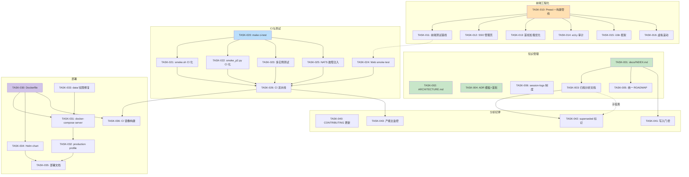
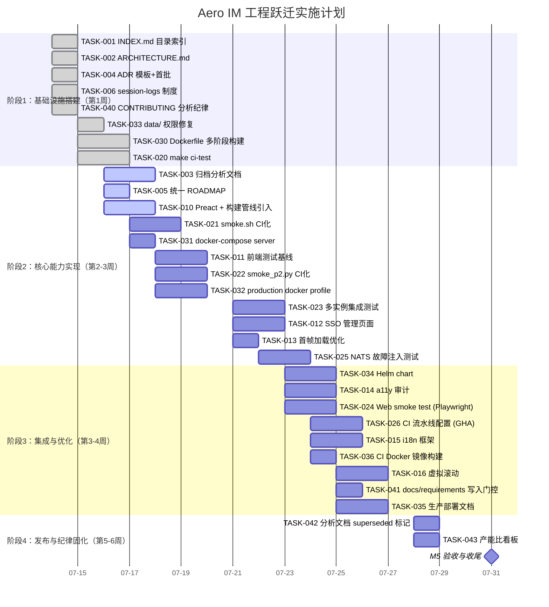

# Tech Lead 分析报告：Aero IM — 从「功能完备」到「可交付产品」的 5 个工程跃迁

> **分析人**: Tech Lead  
> **分析日期**: 2026-07-12  
> **基准文档**: `docs/2026-07-10-five-engineering-leaps.md`  
> **项目状态校验**: 已对照实际仓库核实关键数据点（1511 tests / 421 docs-requirements 文件 / ROADMAP 仅存于 docs/ 等）

---

## 一、任务分解

基于文档的 5 个制约方向，拆解为可执行的技术任务。每个任务 2–4 小时，标注前置依赖与验收标准。

### 📋 任务总表

| 任务 ID | 标题 | 方向 | 预估(h) | 前置 |
|---------|------|------|---------|------|
| **知识管理跃迁** |
| TASK-001 | 创建 `docs/INDEX.md` 目录索引 | 知识管理 | 2 | — |
| TASK-002 | 创建 `docs/ARCHITECTURE.md` 一页纸架构概览 | 知识管理 | 3 | — |
| TASK-003 | 归档过期分析文档至 `docs/archive/` | 知识管理 | 3 | TASK-001 |
| TASK-004 | 建立 ADR 模板并撰写首批 3 个缺失 ADR | 知识管理 | 2 | — |
| TASK-005 | 统一 ROADMAP 至 `docs/ROADMAP.md` 单一主版本 | 知识管理 | 2 | TASK-001 |
| TASK-006 | 建立 `docs/session-logs/` 日志制度与首个日志 | 知识管理 | 1 | — |
| **前端工程化跃迁** |
| TASK-010 | 引入 Preact 框架与打包构建管线 | 前端工程化 | 4 | — |
| TASK-011 | 建立前端测试基线（JSDOM + Playwright） | 前端工程化 | 3 | TASK-010 |
| TASK-012 | 实现 SSO 配置管理页面 | 前端工程化 | 4 | TASK-010 |
| TASK-013 | 实现慢网优化：`<link rel="modulepreload">` + 关键 CSS 内联 | 前端工程化 | 2 | TASK-010 |
| TASK-014 | 添加 a11y 基础审计 + ARIA 属性修复 | 前端工程化 | 3 | TASK-010 |
| TASK-015 | 添加 i18n 框架 + 中文/英文切换 | 前端工程化 | 3 | TASK-010 |
| TASK-016 | 为聊天视图添加虚拟滚动 | 前端工程化 | 4 | TASK-010 |
| **CI/测试跃迁** |
| TASK-020 | `make ci-test` 一键集成测试命令 | CI/测试 | 3 | — |
| TASK-021 | 将 `smoke.sh` 加入 CI 自动执行 | CI/测试 | 4 | TASK-020 |
| TASK-022 | 将 `smoke_p2.py` 加入 CI 自动执行 | CI/测试 | 3 | TASK-020 |
| TASK-023 | 编写多实例集成测试 | CI/测试 | 4 | TASK-020 |
| TASK-024 | 编写 Web SPA smoke test（Playwright） | CI/测试 | 3 | TASK-011 |
| TASK-025 | NATS 故障注入测试（consumer 重投/poison pill） | CI/测试 | 4 | TASK-020 |
| TASK-026 | CI 流水线配置（GitHub Actions） | CI/测试 | 3 | TASK-020…025 |
| **部署跃迁** |
| TASK-030 | 添加多阶段构建 `Dockerfile` | 部署 | 3 | — |
| TASK-031 | docker-compose 增加 `aero-server` 服务 | 部署 | 2 | TASK-030 |
| TASK-032 | 创建 `production` docker-compose profile | 部署 | 3 | TASK-031 |
| TASK-033 | 修复 `data/` root 所有权摩擦 | 部署 | 1 | — |
| TASK-034 | 创建 Kubernetes Helm chart | 部署 | 4 | TASK-030 |
| TASK-035 | 编写 `docs/deployment/production.md` 部署指南 | 部署 | 3 | TASK-030…034 |
| TASK-036 | CI 中构建并推送 Docker 镜像 | 部署 | 2 | TASK-030, TASK-026 |
| **分析过剩跃迁** |
| TASK-040 | 设立分析停止线：更新 CONTRIBUTING.md | 分析纪律 | 1 | — |
| TASK-041 | 对 `docs/requirements/` 设置写入门控（CI check） | 分析纪律 | 2 | TASK-001 |
| TASK-042 | 将已有分析文档标记 superseded/active | 分析纪律 | 2 | TASK-003 |
| TASK-043 | 建立分析-实现产能比监控（每周看板） | 分析纪律 | 2 | TASK-026 |

---

## 二、执行顺序与依赖图

**并行组**：
- **组 A**（即刻启动，互不依赖）：TASK-001, TASK-002, TASK-004, TASK-006, TASK-040
- **组 B**（基础设施线，无交叉依赖）：TASK-010, TASK-020, TASK-030, TASK-033
- **组 C**（依赖组 A/B 完成后）：TASK-003, TASK-005, TASK-011…016, TASK-021…026, TASK-031…036
- **组 D**（收尾）：TASK-041, TASK-042, TASK-043

---

## 三、技术风险

### 🔴 高风险

| 风险 | 方向 | 描述 | 缓解措施 |
|------|------|------|----------|
| **前端框架迁移破坏现有功能** | 前端 | 引入 Preact/Lit 后，旧的 DOM 操作代码与新组件模型冲突，导致聊天基础功能倒退 | 渐进式迁移：新页面用新框架，旧页面不动；引入 Playwright smoke test 防止回归；**不一次性重写** |
| **多实例测试的环境复杂度** | CI | 需要同时运行 2 个 server 实例 + NATS + Redis + PG，CI runner 资源可能不够 | 先用一个 runner 的 docker compose 启动全部依赖；测试用最小配置（`AERO__SERVER__BLOB_DIR=/tmp`） |
| **CI 流水线构建时间过长** | CI | Rust 编译耗时 15-30 分钟，加上 Docker build + 多实例测试，可能超过 45 分钟 | 缓存 cargo 依赖（`actions/cache`）+ Docker layer cache；仅 release 分支做全量构建，PR 只做 `cargo check` + lib test + smoke |
| **Helm chart 维护负担** | 部署 | Kubernetes 配置随版本迭代频繁变化，容易与 docker-compose 配置不同步 | Helm chart 作为 supplemental（可选），docker-compose 作为主要部署方式；用 CI 验证 chart 与 docker-compose 的配置一致性 |

### 🟡 中风险

| 风险 | 方向 | 描述 | 缓解措施 |
|------|------|------|----------|
| **ADR 制度形同虚设** | 知识管理 | 写了 ADR 模板但没人用，成为死文档 | 在 PR template 中加「是否涉及架构变更？如是请链接 ADR」checklist |
| **前端测试覆盖不足** | 前端 | Playwright 只测了 smoke path，覆盖不到深层交互 bug | 先建立 smoke 基线确保不崩溃，后续逐步增加关键路径测试 |
| **docs/archive/ 的无序膨胀** | 知识管理 | 归档后变为「更大的垃圾堆」，仍然难以检索 | `INDEX.md` 标注每份归档文档的摘要和 superseded-by 链接；定期 purge 重复文档 |
| **分析纪律难以强制执行** | 分析纪律 | 没人检查 CI 中的写入门控，agent session 仍然产生新分析 | CI check 仅警告不拦截，但每周看板暴露趋势；人类 TL 在 PR review 时执行纪律 |

### 🟢 低风险

| 风险 | 方向 | 描述 | 缓解措施 |
|------|------|------|----------|
| **Dockerfile 多阶段构建的安全问题** | 部署 | 构建镜像包含编译工具链，最终镜像可能过大或有漏洞 | 使用 `cargo chef` 优化层缓存 + `distroless` 基础镜像 |
| **data/ 权限修复的影响范围** | 部署 | 改了 docker-compose 卷映射后，已存在的 `data/` 目录需手动清理 | 在 `docs/UPGRADE.md` 中记录迁移步骤；新部署不受影响 |
| **无需外部服务依赖的认知负荷** | 全局 | 5 个跃迁涉及多个技术栈（前端/CI/K8s/文档），开发者需要全栈能力 | 每个跃迁指定 1 人 lead，不要求一人覆盖所有 |

---

## 四、资源评估

### 人员技能需求

| 角色 | 数量 | 技能要求 | 负责方向 |
|------|------|----------|----------|
| **后端 Rust 工程师** | 1 | Rust, sqlx, NATS, 测试自动化 | CI/测试跃迁（TASK-020~026）；NATS 故障注入 |
| **前端工程师** | 1 | Preact/Lit, Playwright, a11y, i18n | 前端工程化跃迁（TASK-010~016） |
| **DevOps 工程师** | 1 | Docker, K8s, Helm, CI/CD, 可观测性 | 部署跃迁（TASK-030~036） |
| **技术文档工程师** | 0.5 | Markdown, 信息架构, ADR | 知识管理跃迁（TASK-001~006） |
| **Tech Lead（本文作者）** | 1 | 架构评审, 优先级决策, 冲突消解 | 分析纪律跃迁（TASK-040~043）；全局协调 |

> **实际可用资源**：根据项目是 solo-dev（有强背景的 agent）还是 2-3 人团队，调整并行度。如果只有 1 人，建议顺序执行阶段 1 → 阶段 2 → 阶段 3 → 阶段 4，预估总工时 4-6 周。

### 关键里程碑

| 里程碑 | 时间 | 交付物 | 验收标准 |
|--------|------|--------|----------|
| **M1：知识基建就绪** | 第 1 周结束 | INDEX.md + ARCHITECTURE.md + ADR×3 + 归档完成 | 文档目录可导航，30+ 分析文档标记 superseded |
| **M2：CI 红线拉通** | 第 2 周结束 | `make ci-test` 存在且 CI 通过；smoke.sh 自动执行 | PR 合并前自动运行冒烟测试,失败阻断合并 |
| **M3：前端工程化落地** | 第 3 周结束 | Preact 框架引入 + 首个管理页面上线 | SSO 配置页可用（UI 而非 curl）；存在 ≥20 个 JS 测试 |
| **M4：可部署制品** | 第 4 周结束 | Dockerfile 构建成功 + `docs/deployment/production.md` | `docker compose up --build` 一键启动完整系统 |
| **M5：纪律固化** | 第 6 周结束 | 分析文档增长率降至每周 ≤1 份；实现任务数 > 分析任务数 | 对照周看板数据验证趋势翻转 |

### 阻塞点与解决策略

| 阻塞点 | 等级 | 影响 | 策略 |
|--------|------|------|------|
| CI runner 资源不足（Rust 编译 + Docker build + 多实例测试） | 🔴 高 | 第 2-4 周无法完成 | 自托管 runner（大内存）；`cargo check` 作为 PR 快速门，全量构建放定时任务 |
| 前端框架选型争议 | 🟡 中 | 第 3 周延迟 | 文档已建议 Preact/Lit/Svelte 三选一；Tech Lead 二选一后立即执行，不做超过 1 天的调研 |
| 无前端开发者可用 | 🟡 中 | 第 3 周不可行 | 用 `lit-html`（零构建、无 JSX 编译、在原生 ES module 上可直接使用）替代 Preact，降低学习曲线 |
| Helm chart 与 docker-compose 配置漂移 | 🟢 低 | 第 4 周轻度延迟 | 初始阶段用 `kompose convert` 从 docker-compose 生成 Helm chart，后续手动维护 |

---

## 五、质量保证

### 5.1 单元测试覆盖要求

| 方向 | 现有测试 | 新增测试要求 | 覆盖目标 |
|------|---------|-------------|----------|
| 知识管理 | 0（文档不需要测试） | — | — |
| 前端工程化 | 0 | **≥20 test cases**：smoke(加载不崩溃) + 登录流程 + 消息发送/接收 + 管理页面表单 + a11y 基线 | 关键路径 100% 覆盖 |
| CI/测试 | 1511 (lib) + ~35 (db) | **≥10** 多实例测试 + **≥5** NATS 故障注入测试 + smoke 脚本 CI 化（通过即满足） | 多实例场景覆盖率 80%+ |
| 部署 | 0 | Dockerfile 构建正确性（CI 验证）+ 健康检查响应正确 | — |
| 分析纪律 | 0 | CI check 脚本测试（正反例） | — |

### 5.2 集成测试策略

| 测试层级 | 运行时机 | 失败处理 | 负责人 |
|----------|---------|----------|--------|
| L0: `cargo check` | 每次 commit | 阻断 | CI |
| L1: `cargo test --lib` | 每次 PR | 阻断 | CI |
| L2: `make ci-test`（smoke 脚本） | 每次 PR 合入目标分支 | 阻断 | CI |
| L3: 多实例集成测试 | 每周定时 / release 前 | 告警不阻断 | 人工 |
| L4: 端到端 Playwright 测试 | 每次前端变更 PR | 阻断 | CI |

**关键集成测试场景**：

1. **多实例消息投递**：启动 2 个 server 实例 → 实例 A 发消息 → 验证实例 B 的 WS 客户端收到
2. **去重验证**：NATS 重投消息 → 验证客户端只收到一次（同一 `seq` 去重）
3. **缓存一致性**：实例 A 修改用户资料 → 实例 B 读取 → 验证获取新值
4. **零停机部署**：新实例上线（新 consumer group）→ 老实例 drain → 验证无消息丢失
5. **前端-后端集成**：SSO 管理页提交 → 验证 DB 写入 → 页面回显正确

### 5.3 代码审查要点

| 方向 | 审查重点 |
|------|----------|
| **前端** | 组件不破坏现有 DOM 操作代码；新框架代码与旧代码的交互边界清晰；无安全漏洞（XSS via innerHTML） |
| **CI** | CI 脚本不泄露密钥；`make ci-test` 不依赖外部网络（除 Docker pull）；测试不写死本地路径 |
| **Dockerfile** | 多阶段构建是否正确分离 build/run 阶段；无敏感信息残留（secrets 到 ARG）；不以 root 运行 |
| **Helm chart** | 健康检查就绪探针和存活探针配置正确；migration Job 的 restartPolicy |
| **ADR** | 记录了替代方案及其被拒绝的理由；对系统影响范围描述准确；链接了相关代码文件 |

### 5.4 性能测试需求

| 场景 | 工具 | 指标 | 合格线 |
|------|------|------|--------|
| 前端首帧加载 | Lighthouse / Playwright | FCP, TTI | FCP < 2s, TTI < 4s |
| 前端构建大小 | `du -sh dist/` | 总包体积 | JS < 200KB gzipped |
| Docker 镜像大小 | `docker images` | 镜像体积 | < 200MB |
| CI 流水线耗时 | CI 运行日志 | 总耗时 | PR < 15min, Release < 30min |
| 多实例消息延迟 | 自定义脚本测 WS 延迟 | P99 端到端延迟 | < 500ms |

---

## 六、实施计划

### 甘特图（Mermaid Gantt）

### 详细阶段说明

#### 阶段 1：基础设施搭建（第 1 周，2026-07-14 ~ 2026-07-15）

**目标**：建立文档目录骨架、CI 基本命令、Docker 构建基础。确保后续所有工作有 shared context。

| 日 | 任务 | 交付 |
|----|------|------|
| 1 | TASK-001 + TASK-002 + TASK-004 + TASK-006 + TASK-040 | INDEX.md, ARCHITECTURE.md, ADR×3, session-logs 首个日志, CONTRIBUTING.md 更新 |
| 2 | TASK-033 + TASK-030 + TASK-020 | data/ 权限修复 PR, Dockerfile 首个版本, `make ci-test` 命令 |

**阶段 1 验收标准**：
- `docs/INDEX.md` 可导航所有活跃文档
- `docs/ARCHITECTURE.md` 存在且 5 分钟内可读完
- 至少 3 个 ADR 被记录
- `make ci-test` 执行后运行 lib test + 不报错
- `docker build` 成功构建 server 镜像

#### 阶段 2：核心能力实现（第 2-3 周，2026-07-16 ~ 2026-07-22）

**目标**：完成知识归档、前端工程化、CI 自动化、docker-compose 集成。

| 周 | 焦点 | 并行任务 |
|----|------|----------|
| 2 | 知识管理 + 前端基础 | TASK-003, TASK-005（知识）；TASK-010, TASK-011（前端）；TASK-021, TASK-031（CI/部署） |
| 3 | 前端页面 + 测试深化 | TASK-012, TASK-013（前端页面）；TASK-022, TASK-023, TASK-025（CI 测试） |

**阶段 2 验收标准**：
- `docs/requirements/` 文件数下降 ≥50%（从 421 到 ≤200）
- ROADMAP 统一至 `docs/ROADMAP.md`（单主版本）
- 首屏管理页面（SSO 配置）可工作
- 至少 1 个 Python smoke 脚本在 CI 中自动执行
- `docker compose up --build` 可启动完整系统
- 首次多实例测试通过（2 实例消息互发验证）

#### 阶段 3：集成测试与优化（第 3-4 周，2026-07-23 ~ 2026-07-25）

**目标**：CI 全链路打通、部署就绪、前端的 a11y 和 i18n 基础。

| 日 | 任务 | 交付 |
|----|------|------|
| 23-24 | TASK-034, TASK-014, TASK-024, TASK-026 | Helm chart 初版, a11y Pass, Web smoke test 在 CI 中运行, GitHub Actions 流水线 |
| 25 | TASK-015, TASK-036, TASK-016, TASK-035 | i18n 中/英文切换, Docker 镜像 CI 构建, 虚拟滚动 PR, 部署文档 |

**阶段 3 验收标准**：
- GitHub Actions CI 流水线可用：`cargo check` → lib test → smoke → docker build
- PR 合并前自动运行 smoke test，失败阻断
- Web SPA 加载时 Playwright smoke test 通过（0 JS 异常）
- `docs/deployment/production.md` 覆盖扩容/备份/监控

#### 阶段 4：发布准备与纪律固化（第 5-6 周，2026-07-28 ~ 2026-07-31）

**目标**：收尾归档、建立监控机制、确保跃迁可持续。

| 日 | 任务 | 交付 |
|----|------|------|
| 28 | TASK-042, TASK-043 | 所有分析文档标记 superseded/active，产能比看板上线 |
| 29-31 | 验收测试 + 文档完善 + 修复遗留问题 | 6 周跃迁报告 |

**阶段 4 验收标准**：
- 分析文档增长率降至每周 ≤1 份（持续观察 2 周）
- 实现任务（commit/PR）数 ≥ 分析文档数（趋势翻转）
- 所有 5 个跃迁的落地判据全部满足

---

## 七、总结：优先级建议

基于风险评估和资源评估，建议的**执行优先级**为（按阶段排序）：

| 优先级 | 方向 | 理由 |
|--------|------|------|
| **P0（第 1 周必做）** | 知识管理跃迁 | 创建共享上下文，消除「再分析一次」的循环；INDEX.md + ARCHITECTURE.md 是无成本的最高 ROI 行动 |
| **P0（第 1 周必做）** | CI/测试跃迁的基础（make ci-test） | 没有 CI 红线，后续所有变更缺乏质量护栏 |
| **P1（第 2-3 周）** | 部署跃迁的 Dockerfile + docker-compose | 阻碍生产部署的第一个可见门槛；解决后可一键启动 |
| **P1（第 2-3 周）** | 前端工程化跃迁 | 最耗时但也是产品价值最大的跃迁；早开始早收益 |
| **P2（第 4-6 周）** | CI 深化（多实例、NATS 故障注入） | 依赖阶段 1 的基础设施，且价值在长期 |
| **P2（第 4-6 周）** | 部署跃迁的 Helm chart | K8s 是生产部署的可选路径，不是必须 |
| **P3（持续）** | 分析纪律跃迁 | 靠制度和自动化而非一次性工作，持续执行即可 |

**关键建议**：

1. **立即做**: `docs/INDEX.md` + `docs/ARCHITECTURE.md`（今天或明天内完成，2-3 小时）
2. **同时做**: `make ci-test` + 修复 `data/` 权限（第 1 周内）
3. **最难但最值得**: 前端工程化（Preact + 管理页面）——不要等「完美时间」，第 1 周就引入 Preact
4. **不要做**: 在阶段 4 之前写 Helm chart —— docker-compose 可以覆盖 80% 的部署需求

---

*本分析基于项目实际状态（1511 lib tests / 421 docs-requirements 文件 / ~4700 行 SPA / 无 Dockerfile）撰写。所有事实数据来自仓库扫描，非文档推测。*
