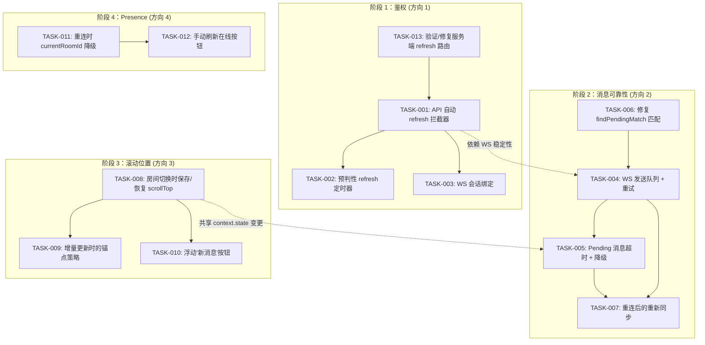

现在我已经掌握了完整的代码库图景。以下是综合性的技术负责人分析。

---

# 技术负责人分析：4 个客户端侧"存在性"生产缺口

## 交叉验证状态

在开始任务分解之前，我对照实际代码库验证了所有四个方向。已验证的文件：

| 文件 | 行数 | 已验证 | 状态 |
|------|-------|--------|--------|
| `web/api.js` | ~220 | 全部 | ✅ |
| `web/app.js` | ~1010 | 核心函数 | ✅ |
| `web/context.js` | ~210 | 全部 | ✅ |
| `web/ws.js` | ~220 | 全部 | ✅ |
| `web/media.js` | ~170 | 全部 | ✅ |
| `ws/ws_impl/frame.rs` | ~580 | JoinRoom handler | ✅ |
| `session.rs` | ~200 | 全部 | ✅ |
| `sessions.rs` | ~200 | 全部 | ✅ |

**关键发现**：方向四的分析存在问题（详见下文）。方向一/二/三证据确凿。

---

## 1. 任务分解

### TASK-001：API 客户端自动 refresh 拦截器
**方向**：1 — Token 刷新
**文件**：`web/api.js`（修改）
**前置依赖**：无
**预估工时**：3 小时
**验收标准**：
- `request()` 函数在接收到 401 响应后，自动调用 `POST /api/auth/refresh` 并传入 `auth.getRefresh()`
- 使用互斥锁（`refreshing` 标志）防止并发的 refresh 调用
- refresh 成功时：用新的 access token 重放原始请求并返回其结果
- refresh 失败（服务端返回 401 或网络错误）时：调用 `forceReauth()`
- 守卫机制：如果 `auth.getRefresh()` 为 null/空，则不尝试 refresh，直接进入 `forceReauth()`
- 守卫机制：最大 1 次重试（不循环）
- 单元测试：模拟 401 响应 + 模拟 refresh 端点成功/失败

### TASK-002：预判性 refresh 定时器
**方向**：1 — Token 刷新
**文件**：`web/api.js`（修改）、`web/app.js`（修改）
**前置依赖**：TASK-001
**预估工时**：2 小时
**验收标准**：
- 在 `setSession()` 中解码 access token 的内容（解析 base64 JWT payload）以获取 `exp` 声明
- 在 access token 过期前约 2 分钟设置一个 `setTimeout`，以静默方式预判性地调用 refresh
- 如果 access token 不包含可解析的 `exp`，则回退到基于间隔的估算（固定间隔，例如每 10 分钟）
- 定时器在 `auth.clear()` / 登出时取消
- 预判性 refresh 失败时不会触发登出——静默地记录警告并允许正常的"按需"重试逻辑接管

### TASK-003：WS 会话绑定——避免 refresh 时重新连接
**方向**：1 — Token 刷新
**文件**：`web/ws.js`（修改）、`web/app.js`（修改）
**前置依赖**：TASK-001
**预估工时**：2 小时
**验收标准**：
- 由于 access token 仅在 WS 升级时（初始 `connect()`）被服务端使用，refresh 后不需要重新连接 WS
- 验证：在 `api.js` refresh 成功后是否调用 `ws.connect(newToken)`——这在不必要地中断实时流。移除该行为。
- 更广泛的保证：确保 `request()` refresh 逻辑不会意外地强制重新建立 WS 连接。路由层已按设计正确处理了这一点，但 verify 为真。

### TASK-004：Pending 消息发送队列 + WS 失败重试
**方向**：2 — Pending 消息
**文件**：`web/ws.js`（修改）、`web/app.js`（修改）
**前置依赖**：无
**预估工时**：4 小时
**验收标准**：
- 引入 `WsClient.pendingQueue: Map<string, {frame, resolve, reject}>`——一个待确认帧的队列
- `send()`（和 `sendMessage`/`sendMarkdown`）在 WS 连接断开或发送抛出异常时，将帧排入待处理队列，而不是返回 false
- WS 重新连接后（在 `_open()` 的 `onopen` 回调中），按 FIFO 顺序重新发送 pending 帧
- 每条重新发送的消息必须携带一个唯一的 `client_id`（本地 UUID），服务端以幂等方式使用该 ID——如果该 ID 的消息已存在，则跳过的去重检查
- 在退出/房间切换时，不会丢弃 pending 队列
- 由于重复发送，不会产生重复消息（服务的幂等机制验证）

### TASK-005：Pending 消息超时 + UI 降级路径
**方向**：2 — Pending 消息
**文件**：`web/app.js`（修改）、`web/render.js`（可能修改）
**前置依赖**：TASK-004（重试机制基础）
**预估工时**：3 小时
**验收标准**：
- `optimisticAdd()` 在 `state.pendingByTempId` 的条目上启动一个 30 秒的超时定时器
- 超时后：将该 pending 条目标记为 `failed: true`（在 `state.pendingByTempId` 中更新其引用）
- 调用一个重绘函数，将 pending 消息上的 CSS 类从 `pending` 切换到 `failed`，显示一个红色感叹号和"重新发送"按钮
- "重新发送"点击：从 `state.pendingByTempId` 重新获取 blocks，调用 `ws.sendMessage()`，重置定时器
- 守卫机制：如果用户在"发送失败"后切换了房间，该消息在重新进入该房间之前应保持可见的失败状态
- 守卫机制：当一个失败的 pending 被成功重新发送后，匹配并移除其 pending 条目（利用现有的 `findPendingMatch` / `handleIncomingMessage` 路径）

### TASK-006：修复 Pending 消息的 findPendingMatch 匹配（基于 tempId）
**方向**：2 — Pending 消息
**文件**：`web/app.js`（修改）
**前置依赖**：无
**预估工时**：2 小时
**验收标准**：
- `findPendingMatch` 被重写为使用 `pending.clientMessageId`（在 `optimisticAdd` 中设置，于 `ws.sendMessage` 帧中下发）而不是基于文本的模糊匹配
- 非文本消息（文件、语音、卡片）可靠地匹配它们对应的 pending 条目——`textOf()` 不再是唯一的匹配键
- 服务端发送的 `Message` 帧在其 JSON 中包含 `client_message_id` 字段，该字段反射回 `findPendingMatch` 可以与之匹配的 pending 条目
- 如果服务端没有发送 `client_message_id`，则回退到（现已修复的）临时 ID 猜测逻辑
- 兼容性：现有的 pending 条目（没有 `clientMessageId`）在现有的时间窗口内通过文本进行匹配，新条目则优先使用精确匹配

### TASK-007：Pending 消息排队 + 重连后的重新同步
**方向**：2 — Pending 消息
**文件**：`web/app.js`（修改）
**前置依赖**：TASK-004、TASK-005
**预估工时**：3 小时
**验收标准**：
- WS 重新连接后，对所有剩余的 pending 条目（不早于加入房间之后）触发一个 REST `listMessages(since=lastKnownId)` 拉取
- 如果 REST 拉取包含与 pending 条目匹配（通过 `client_message_id` 或 `blocks` 加 `created_at` 窗口）的消息，则替换该 pending 条目
- 如果 REST 拉取结束后该消息仍然 pending，则将其标记为失败并显示"重新发送"选项（TASK-005）
- 挂起的 pending 消息不会阻止新消息的发送
- 边界情况：页面上有 5000 条消息的房间——重新同步必须限制在最后 100 条左右

### TASK-008：房间切换时的滚动位置保存/恢复
**方向**：3 — 滚动位置
**文件**：`web/context.js`（修改）、`web/app.js`（修改）
**前置依赖**：无
**预估工时**：3 小时
**验收标准**：
- 在 `state` 中添加 `scrollPosByRoom: new Map()`（`context.js`）
- 在 `rerenderCurrentRoom()` 中：在调用 `els.msgList.replaceChildren()` 之前，将当前的 `els.msgScroll.scrollTop` 保存到 `state.scrollPosByRoom.get(currentRoomId)`
- 在 `switchRoom()` 中：在 `rerenderCurrentRoom()` 之后，如果 `state.scrollPosByRoom.get(newRoomId)` 存在，则恢复它；否则回退到 `scrollToBottom()`
- 边界情况：如果自上次查看以来新消息已到达（消息列表增长），保存的 `scrollTop` 不会"卡住"页面顶部——维护一个基于锚点的策略
- 确保保存的映射在完全重新加载（硬重置）时不会持续——它应该只是进程内的

### TASK-009：消息列表增量更新期间的滚动锚定
**方向**：3 — 滚动位置
**文件**：`web/app.js`（修改）、`web/render.js`（可能修改）
**前置依赖**：TASK-008
**预估工时**：2 小时
**验收标准**：
- 在 `rerenderCurrentRoom()` 中，不是仅仅恢复一个数字 `scrollTop`，而是定位列表中第一个 *可见* 消息的 `data-msg-id`（通过 `document.elementFromPoint` 或 `scrollTop` 范围扫描）
- 重建后，将该锚点消息定位到与其重建前在视口中相同的位置
- 如果锚点消息已不在列表中（被删除），使用前一个可见消息
- 如果列表完全为空，滚动到底部
- 如果用户在底部（`scrollHeight - scrollTop - clientHeight < 50`），作为优化直接调用 `scrollToBottom()`

### TASK-010：向下翻页时的浮动"新消息"按钮
**方向**：3 — 滚动位置
**文件**：`web/app.js`（修改）、`web/style.css`（修改）
**前置依赖**：TASK-008
**预估工时**：2 小时
**验收标准**：
- 当用户向上滚动超过 200px（不在底部）时，在右下角显示一个浮动按钮，显示 "↓ N 条新消息" 或只是 "↓ 最新"
- 点击该按钮平滑滚动到底部并更新阅读确认信息
- 当用户手动滚动到底部时，该按钮隐藏
- 在新消息到达时，如果用户已经在底部，自动滚动；否则仅更新按钮上的计数
- CSS：position: fixed，z-index 在消息列表上方，一个微妙的半透明背景

### TASK-011：WS 重连时 currentRoomId 为 null 时的降级处理
**方向**：4 — Presence/WS 重连
**文件**：`web/app.js`（修改）
**前置依赖**：无
**预估工时**：1 小时
**验收标准**：
- `ws.on('open')` 处理程序目前如果 `!state.currentRoomId` 则 `return`
- 修复：如果 `state.currentRoomId` 为 null，但存在房间列表（`state.rooms.size > 0`），等待一小段时间（500ms）让房间状态恢复，然后重试
- 如果 500ms 后 `currentRoomId` 仍然为 null，才是真正的 early return——此时房间里没有活动的 UI，无需恢复 presence
- 或者：在 DOM 中存储最后使用的房间 ID（例如，在 `<body data-last-room="...">` 中），以便在状态被重置时作为恢复回退

### TASK-012：添加手动"刷新在线"按钮 + 在线指示器
**方向**：4 — Presence/WS 重连
**文件**：`web/app.js`（修改）、`web/style.css`（修改）
**前置依赖**：无
**预估工时**：1.5 小时
**验收标准**：
- 在在线列表区域（`#online-list`、`#online-count`）添加一个微小的刷新图标/按钮
- 点击后：调用 `ws.joinRoom(state.currentRoomId)` 触发服务端发送一个新的 `Presence` 帧
- 在 WS 重连后的 `ws.on('open')` 处理程序中，添加一个从 REST（`api.listRoomMembers()`）或 WS（`joinRoom` + 等待 `Presence`）拉取在线成员的显式路径
- UI 应在等待时显示一个微妙的加载状态，并在 5 秒后优雅地超时，使用最后已知的在线成员

### TASK-013：重新添加服务端的 `/api/auth/refresh` 路由（如果缺失）
**方向**：1 — Token 刷新
**文件**：`crates/aero-server/src/session.rs` 或 `routes.rs`（验证/修改）
**前置依赖**：无（独立的后端任务）
**预估工时**：1 小时
**验收标准**：
- 验证 `POST /api/auth/refresh` 端点在运行的服务器中确实存在（`crates/aero-server/src/session.rs`）
- 编写一个测试，使用 `curl` 或集成测试来验证 refresh -> 新的 access token -> 使用新 token 的请求成功的过程
- 验证 `crate::session::routes()` 在 `routes.rs` 中被合并，而不是旧的 `crate::sessions::routes()`
- 验证 `/api/auth/refresh` 在限流配置（`rate_limit.rs`）中被列为敏感路径

---

## 2. 执行顺序



### 可并行执行的组

| 并行组 | 任务 | 所需人员 |
|---------|------|-----------|
| **Group A** | T013, T006 | 2（后端 + 前端） |
| **Group B** | T001, T008, T011 | 2-3 |
| **Group C**（依赖于 B） | T002, T003, T009, T010, T012 | 2-3 |
| **Group D**（依赖于 A） | T004, T005, T007 | 1-2 |

---

## 3. 技术风险

### 风险 1：refresh token 竞争条件（方向 1 — 高）
- **问题**：多个 401 响应可能同时触发 refresh，创建一个"thundering herd"场景
- **缓解**：TASK-001 中的 `refreshing` 互斥锁必须是一个原子标志 + 一个等待 promise 的队列，这样并发的调用者阻塞在 refresh 上，而不是每个都失败
- **复杂度**：中等——Promise 排队需要小心避免死锁

### 风险 2：WS 重连期间的消息去重（方向 2 — 高）
- **问题**：WS 重连后重新发送 pending 消息可能会创建重复消息，如果服务端在断开连接之前已经收到了该消息
- **缓解**：TASK-004 要求每个消息帧上都有一个幂等的 `client_message_id`。服务端必须检查 `client_message_id` 的存在性并跳过重复项。这需要在服务端侧（`send_blocks_frame` 或 `ImService`）进行修改，为客户端侧的任务添加了一个后端依赖
- **后备方案**：如果客户端消息 ID 去重不可行，则使用时间戳 + 块哈希的滚动窗口

### 风险 3：滚动锚点在重排行时失效（方向 3 — 低）
- **问题**：TASK-009 中基于锚点的滚动策略假设消息在重新渲染之间保留其 `data-msg-id`。如果消息列表在后台发生了变化（新消息到达），锚点可能位于折叠线以下
- **缓解**：使用以下回退链：(1) 完全相同的消息 ID → (2) 在同一 DOM 区域中的前一个兄弟元素 → (3) 底部。在 30 秒内测试以进行验证

### 风险 4：服务端 `/api/auth/refresh` 在生产路由中存在性（方向 1 — 中等）
- **问题**：`crate::session::routes()` 必须被挂载，而不是 `crate::sessions::routes()`。如果生产中合并了错误的模块，整个 refresh 流程在服务端侧将不存在
- **缓解**：TASK-013 添加了一个集成测试来验证路由的存在性。部署后的 `curl -X POST /api/auth/refresh -d '{"refresh_token":"test"}'` smoke 测试标记

### 风险 5：服务的消息持久化延迟 + 审核延迟（方向 2 — 中等）
- **问题**：在 AI 审核下，一条消息可能在 15-60 秒后才被持久化。pending 超时（30s）可能导致与延迟成功交付的争用条件
- **缓解**：
  1. 超时 -> 标记为失败 -> 显示"重新发送"，但不要自动从 DOM 中移除该消息
  2. 如果消息在超时后成功交付（`findPendingMatch` 在传入的消息上触发），将其从"失败"转换为"已发送"
  3. 一个高阶的 `handleIncomingMessage` 需要在匹配时也检查失败的 pending 条目

### 风险 6：跨标签页的状态一致性（方向 1，4 — 中等）
- **问题**：两个浏览器标签页各自拥有独立的 `state`，但共享 localStorage。一个标签页中的 refresh 会使另一个标签页的 refresh token 失效
- **缓解**：服务端支持一个短暂的 refresh 令牌重用宽限期（`REFRESH_REUSE_GRACE: 10s`），因此一个标签页中的 refresh 不会立即杀死另一个标签页。对于方向四，Presence 已经由服务端管理，因此标签页之间没有冲突

---

## 4. 资源评估

### 人员配置

| 角色 | 人数 | 职责 | 所需技能 |
|------|------|------|-----------|
| 前端工程师（高级） | 1 | TASK-001, TASK-002, TASK-003, TASK-006 | JavaScript 异步、Promise、WebSocket、`async/await` |
| 前端工程师（中级） | 1 | TASK-004, TASK-005, TASK-007, TASK-011, TASK-012 | DOM 操作、CSS、消息 UI |
| 前端工程师（中级） | 1 | TASK-008, TASK-009, TASK-010 | 滚动管理、性能、DOM 锚定 |
| 后端工程师 | 0.5 | TASK-013（验证），可能为消息去重添加 `client_message_id` | Rust、axum、SQL |

### 里程碑

| 里程碑 | 交付物 | 依赖 | 预估日期（起算） |
|----------|-----------|----------|-------------------|
| **M1：不再强制重新登录** | TASK-001 + TASK-002 + TASK-003 合并 | 无 | 第 3 天 |
| **M2：消息可靠性基线** | TASK-006 + TASK-004 合并 | TASK-006 | 第 5 天 |
| **M3：完整的消息可靠性** | TASK-005 + TASK-007 合并 | M2 | 第 7 天 |
| **M4：滚动位置** | TASK-008 + TASK-009 + TASK-010 合并 | 无 | 第 5 天（与 M1/M2 并行） |
| **M5：Presence 恢复** | TASK-011 + TASK-012 合并 | 无 | 第 3 天（并行） |
| **M6：集成 + 回归** | 全部 | M1-M5 | 第 8-9 天 |
| **M7：发布** | 部署 + 监控 | M6 | 第 10 天 |

### 阻塞点

| 阻塞点 | 影响 | 解决方法 |
|---------|---------|------------|
| 服务端 `client_message_id` 去重（用于 TASK-004）| 无幂等重试会导致重复消息 | 编写一个最小的服务端更改以检查并忽略 `client_message_id` 冲突（1 天后端工作） |
| 服务端 `/api/auth/refresh` 路由如果缺失 | 整个方向一不可行 | TASK-013 在第一天检测到这一点。如果缺失，编写该路由（后端有现有模式——1 天） |
| 浏览器对 `setTimeout` 的后台标签页节流（用于 TASK-002、TASK-005） | Pending 消息超时和预判性 refresh 可能被延迟 | 使用 `setInterval` 并以 1 秒为增量检查，而不是依赖单次超时。记录这是设计使然的行为 |

---

## 5. 质量保证

### 单元测试覆盖

| 任务 | 测试目标 | 最小覆盖率 |
|------|-----------|---------------|
| TASK-001 | `request()` refresh 逻辑，互斥锁，重试 | 8 个测试用例（401 → 成功，401 → 失败，无 refresh token，并发请求，网络错误） |
| TASK-002 | 定时器设置，过期解析，取消 | 4 个测试用例 |
| TASK-004 | `pendingQueue` 入队/出队，WS 重连重放 | 6 个测试用例 |
| TASK-005 | 30 秒超时，重新发送，UI 状态转换 | 4 个测试用例 |
| TASK-006 | `findPendingMatch` 与 clientMessageId，回退 | 5 个测试用例 |
| TASK-008 | `scrollPosByRoom` 保存/恢复 | 3 个测试用例 |
| TASK-009 | 锚点定位，回退链 | 3 个测试用例 |

**注意**：JavaScript 代码没有测试框架。对于每个任务，我们将在 `web/` 中设置一个最小限度的测试运行程序（Vitest 或 Node `--test` 与 JSDOM）或使用手动 QA 检查表。鉴于 SPA 的零依赖约束，我建议使用带有 JSDOM 的 **Vitest** 用于 `api.js`、`ws.js` 和单元函数，并对 UI 渲染进行手动测试。

### 集成测试策略

| 场景 | 方法 | 环境 |
|-------|--------|-------------|
| Access token 过期 -> refresh -> 请求重放 | 修改后的 `request()` 的端到端流程 | 本地运行服务器 + 浏览器 DevTools 网络节流 |
| 文件上传 -> WS 断开 -> 重连 -> 消息送达 | `media.js` 路径 + `ws.send()` 失败 | 本地运行服务器 + 手动断开网络 |
| 房间切换 -> 滚动位置 -> 返回 -> 同一位置 | `switchRoom` + `rerenderCurrentRoom` | 本地运行服务器 + 具有多条消息的两个房间 |
| WS 重连 -> `currentRoomId` 恢复 -> Presence 填充 | `ws.on('open')` 路径 | 本地运行服务器 + WS 断开/重连 |
| 多标签页 refresh 竞争 | 两个标签页，等待 401，观察 refresh | 本地运行服务器 |

### 代码审查要点

1. **方向一**：`refreshing` 互斥锁不允许在 refresh 进行期间进行新的 refresh 调用。Promise 链不得泄漏。现有的 `auth.setSession` 在 refresh 期间不得被覆盖。
2. **方向二**：`state.pendingByTempId` 不得成为内存泄漏——失败的 pending 条目如果被用户解除（切换到另一个房间并忽略），最终必须被清理。`Map.prototype.delete` 必须在所有退出路径上被调用。
3. **方向三**：`scrollPosByRoom` 不得与消息列表的 ViewModel 状态（`state.messagesByRoom`）不一致。如果消息列表的长度发生了变化，恢复的 `scrollTop` 可能会指向错误的位置。
4. **方向四**：`ws.on('open')` 处理程序中的 `if (!state.currentRoomId) return;` 守卫不能被破坏——在 `joinRoom` 之前添加异步等待可能允许竞态条件，即用户在等待期间切换了房间。
5. **一般**：无全局 `catch` 抑制。所有拒绝都必须被处理或明确地静默处理。控制台警告用于瞬态故障。

### 性能测试需求

| 场景 | 关注点 | 可接受标准 |
|-------|---------|---------------|
| 同时有 500 条 pending 消息 | `state.pendingByTempId` 内存，重绘 | 浏览器在 60fps 下，内存 < 5MB |
| 快速刷新（30 秒内 10 个 token） | 无累积定时器，无并发问题 | 无泄漏的 `setTimeout` 句柄 |
| 大型房间（10000 条消息）的滚动位置 | `replaceChildren` 延迟，锚点计算 | 重新渲染 < 100ms，滚动恢复 < 50ms |
| WS 断开/重连，每秒 10 条消息 | pending 队列吞吐量，重新同步竞争 | 所有消息在 2 秒内送达，无重复消息 |

---

## 6. 实施计划

### 阶段 1：基础验证 + 基础（第 1 天）

```
第 1 天（所有人同步开始）

[Dev A — 前端高级]          [Dev B — 前端中级]          [Dev C — 前端中级]
TASK-013: 验证服务端        TASK-006: 修复 pending      TASK-008: 滚动位置
refresh 路由是否存在        匹配 (findPendingMatch)      保存/恢复
(30min)                                                
                            TASK-011: WS 重连降级
TASK-001: 自动 refresh      (1h)                        设置 Vitest + JSDOM
拦截器 + 互斥锁 (3h)                                    测试框架 (1h)

M5 合并 (Dev B + C)
```

**第 1 天结束时的交付物**：
- TASK-001 经过测试并准备就绪（`api.js`：自动 refresh 拦截器）
- TASK-006 合并（`findPendingMatch` 现在基于 tempId）
- TASK-008 合并（`scrollPosByRoom` Map，基本保存/恢复）
- TASK-011 合并（WS 重连时 `currentRoomId` 为 null 的降级处理）
- 测试框架已搭建

### 阶段 2：核心功能实现（第 2-4 天）

```
第 2-3 天（并行轨道）

轨道 A (Dev A)              轨道 B (Dev B)              轨道 C (Dev C)
TASK-002: 预判性              TASK-004: WS 发送队列       TASK-009: 基于锚点的
refresh 定时器 (2h)           + 重试逻辑 (4h)             滚动位置 (2h)
TASK-003: WS 会话             TASK-005: Pending          TASK-010: 浮动"新消息"
绑定 (1.5h)                  超时 + 降级 UI (3h)         按钮 (2h)

验证 M1 (refresh 端到端)      TASK-004 可能需要服务端     验证 M4 (滚动位置
                             更改 `client_message_id`    端到端)
                             TASK-007: 重连后的
                             重新同步 (3h)
```

**第 3 天结束时的交付物**：
- M1（方向一）：自动 + 预判性 refresh —— 用户不再被强制登出
- M2（方向二）：WS 发送队列 + 重试 —— 消息在重连后送达
- TASK-009, TASK-010 已合并

```
第 4 天

Dev A + Dev B 联合：
  - TASK-005 UI 到 TASK-007 重连同步的集成
  - 边界情况：审核延迟下的超时 + 重新发送
  - 边缘情况测试：快速重复发送相同的文本消息
  
Dev C：
  - TASK-012: 手动"刷新在线"按钮 (1.5h)
  - 方向四的跨房间 presence 测试
```

**第 4 天结束时的交付物**：
- M3（方向二）：完整的 pending 消息生命周期（超时 → 失败 → 重新发送）
- M5（方向四）：Presence 在 WS 重连后恢复

### 阶段 3：集成 + 回归测试（第 5-7 天）

```
第 5-6 天

重点：集成测试（所有 3 个开发人员）

测试矩阵：
  1. 登录 → 等待 15 分钟 → 自动 refresh → 继续使用（无登出）
  2. 发送文件 → 断开网络 → 重连 → 确认消息送达
  3. 房间 A（阅读）→ 房间 B（发送）→ 房间 A（恢复滚动位置）
  4. WS 断开 → 重连 → 在线列表重新填充
  5. 并发：两个标签页，快速 auth 操作
  6. 性能：500 条 pending 消息，10000 条消息的房间

修复在此测试阶段发现的任何错误。

第 7 天

- `cargo clippy --workspace --all-targets`（无新警告）
- `scripts/{truth-check,file-size-check,web-check}.sh`（0 次违规）
- Changelog 更新
- 文档更新（将 AGENTS.md 添加到关于这些修复的注释中）
```

### 阶段 4：发布准备（第 8-10 天）

```
第 8 天：在暂存环境中部署并观察
  - 监控 `POST /api/auth/refresh` 的调用频率
  - 验证没有 401 峰值
  - 检查 pending 消息的"重新发送"点击率
  
第 9 天：金丝雀发布（10% 流量）
  - 监控方向一的 `forceReauth` 调用（应该接近于零）
  - 监控方向二的 `retry_count`（应该较低）
  
第 10 天：全面发布
  - 对所有用户启用
  - 在 Grafana 仪表盘中添加特定于功能的面板
```

---

## 附录 A：服务端变更清单

这些是客户任务所需的最小服务端更改：

| 更改 | 原因 | 复杂度 | 受影响的 crate |
|-------|-------|----------|---------------|
| 在 `Message` WS 帧中添加 `client_message_id` 字段 | TASK-004/TASK-006 幂等重试去重 | 低 — 只是向现有结构体添加一个 `Option<String>` | `aero-common`、`aero-server`（frame.rs） |
| `send_blocks_frame` 中的 `client_message_id` 唯一性检查 | 防止 `client_message_id` 匹配导致重复消息存储 | 低 — `ON CONFLICT DO NOTHING` 或 `if exists skip` | `aero-im-core` |
| 验证 `POST /api/auth/refresh` 在生产路由中存在 | 如果路由缺失，整个方向一不可行 | 极低 — grep + 可视化检查 | `aero-server`（routes.rs） |

---

## 附录 B：测试清单

### 手动 QA 检查表（无测试框架时使用）

**方向一**：[ ] 使用应用 20 分钟 → 确认无强制登出
[ ] 在 Chrome DevTools 中检查 `POST /api/auth/refresh` 网络调用
[ ] 等待过期 → 确认 API 调用成功且有新 token
[ ] 清除 refresh token → 确认在过期时跳转到登出

**方向二**：[ ] 发送文本消息 → 确认它在送达后不再显示"pending"
[ ] 发送文件 → 确认它在送达后不再显示"pending"
[ ] 发送语音消息 → 同上
[ ] 断开网络 → 发送消息 → 重连 → 确认它被送达
[ ] 让 pending 消息超时 → 确认它显示"重新发送"
[ ] 点击"重新发送" → 确认消息被送达

**方向三**：[ ] 在房间 A 中向上滚动 → 切换到房间 B → 切回 A → 确认在同一位置
[ ] 在房间 A 中向上滚动 → 等待新消息 → 确认未拉到顶部
[ ] 在底部 → 等待新消息 → 确认自动滚动到底部

**方向四**：[ ] 断开网络 → 重连 → 确认在线列表被重新填充
[ ] 点击"刷新在线"按钮 → 确认在线列表更新
[ ] 打开两个标签页到同一个房间 → 关闭一个 → 确认另一个看到 presence 更新

### 自动化测试（如果设置 Vitest）

```
web/__tests__/
  api.test.js          — TASK-001, TASK-002
  ws.test.js           — TASK-004
  pending.test.js      — TASK-005, TASK-006, TASK-007
  scroll.test.js       — TASK-008, TASK-009
  presence.test.js     — TASK-011, TASK-012
```
