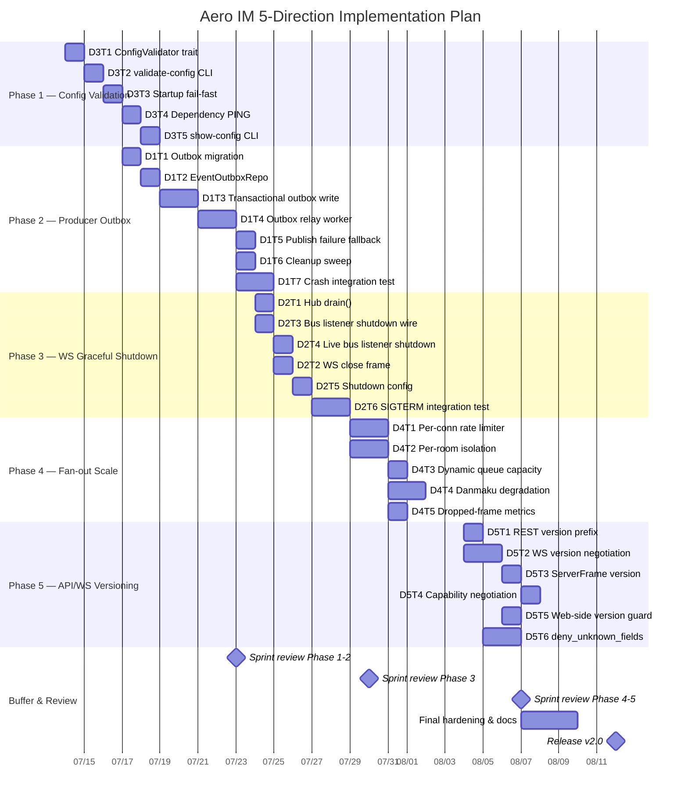

Now I have a thorough understanding of the codebase structure. Let me produce the Tech Lead analysis.

---

# Tech Lead Implementation Analysis — 5 Directions

**Source**: Code verification report (2026-07-12) cross-referenced against ~130 analysis docs  
**Reviewed files**: `hub.rs`, `bus.rs`, `events.rs` (publish_room_event), `shutdown.rs`, `background.rs`, `serve.rs`, `config.rs`, `frame.rs`, `mod.rs`

**Priority adjustments applied per review**:
| Direction | Original | Adjusted | Rationale |
|---|---|---|---|
| 1 Producer Outbox | P0 | **P0** | Data-loss window on every message — true P0 |
| 2 WS Draining | P0 | **P1** | Impact only during deployments (minutes), not runtime (milliseconds) |
| 3 Config Validation | P1 | **P1** | Cheapest/ROI highest of all five |
| 4 Fan-out Pressure | P1 | **P1** | Critical at scale but safe for <50-person rooms |
| 5 API Versioning | P2 | **P2** | No external clients today; cost grows with time |

---

## 1. Task Decomposition

### Direction 1 — Producer Outbox (P0)

| ID | Title | Files | Dependencies | Effort | Acceptance |
|---|---|---|---|---|---|
| D1T1 | Migration: `event_outbox` table | `migrations/NNNN_event_outbox.sql` | None | 2h | Table exists, indexed by `(room_id, seq)`, `status` enum `pending/failed/dead` |
| D1T2 | `EventOutboxRepo` | `aero-storage/src/event_outbox.rs`, `aero-storage/src/lib.rs` | D1T1 | 3h | `insert`/`claim`/`complete`/`fail`/`dead` methods, `claim(limit)` with `FOR UPDATE SKIP LOCKED` |
| D1T3 | Transactional outbox write in `publish_room_event` | `aero-im-core/src/service/events.rs` | D1T2 | 4h | `PG transaction` includes both message insert AND outbox insert; outbox write happens even if NATS publish fails |
| D1T4 | Outbox relay background worker | `aero-server/src/outbox_relay.rs`, `boot/background.rs` | D1T3 | 6h | Polls `claim(50)` every 200ms, publishes to NATS, marks `complete`; on transient failure `mark_failed_with_backoff`; `MAX_ATTEMPTS=5`→`dead` |
| D1T5 | NATS-publish-failure fallback into outbox | `aero-im-core/src/service/events.rs`, `aero-bus/src/jetstream.rs` | D1T3 | 2h | On `ack.await` failure or publish error, the message is already in outbox from D1T3; no action needed other than verifying no double-publish |
| D1T6 | Cleanup sweep for completed outbox rows | `aero-server/src/bin/boot/retention.rs` | D1T4 | 2h | Scheduled task deletes completed rows older than 24h; metric `event_outbox_pending` alert |
| D1T7 | Integration test: crash between PG commit and NATS ack | `tests/direction1_outbox.rs` | D1T1–D1T4 | 4h | Simulate process kill after commit but before pub; verify message delivered after relay picks it up |

**Total Direction 1**: ~23h (3 person-days)

---

### Direction 2 — WebSocket Graceful Shutdown (P1)

| ID | Title | Files | Dependencies | Effort | Acceptance |
|---|---|---|---|---|---|
| D2T1 | Hub draining: `drain()` method on `Hub` | `aero-server/src/hub.rs` | None | 3h | `Hub::drain(recipients)` drains each connection's backlog with timeout; returns count of un-sent frames |
| D2T2 | Send WS close frame to all connections on shutdown | `aero-server/src/bin/boot/shutdown.rs` | D2T1 | 3h | After drain, enqueue `CloseFrame` to each `WsSender`; wait up to 5s for acknowledgment |
| D2T3 | Wire `run_bus_listener` to observe `ai_shutdown` | `aero-server/src/ws/ws_impl/bus.rs` | None | 3h | Add `tokio::select!` in bus listener loop that exits cleanly on shutdown; stop accepting new NATS messages |
| D2T4 | Wire `run_live_bus_listener` to observe `ai_shutdown` | `aero-server/src/ws/ws_impl/bus.rs` | None | 2h | Same as D2T3 for the live stream bus listener |
| D2T5 | Config: separate drain timing for WS vs bus | `aero-server/src/config.rs` | D2T2 | 1h | Add `ws_drain_secs` (default 5) and `bus_drain_secs` (default 10) to `WsConfig` |
| D2T6 | Integration test: SIGTERM verifies WS close frame sent | `tests/direction2_shutdown.rs` | D2T1–D2T5 | 4h | Start server, connect WS, send SIGTERM, verify client receives close frame and no post-drain fan-out |

**Total Direction 2**: ~16h (2 person-days)

---

### Direction 3 — Config Validation (P1)

| ID | Title | Files | Dependencies | Effort | Acceptance |
|---|---|---|---|---|---|
| D3T1 | Create `ConfigValidator` trait + implementations | `aero-server/src/config_validate.rs` | None | 4h | Per-key validators: `BLOB_DIR` writable, `HLS_DIR` writable, `ANTHROPIC_KEY` format, `AERO_S3_BUCKET`+`REGION` presence if S3 enabled, `AERO__DATABASE__URL` reachable, JWT key pair parsable, port in valid range |
| D3T2 | Add `--validate-config` / `validate-config` command | `aero-server/src/bin/main.rs` (or CLI entry) | D3T1 | 2h | After config parsing, call `ConfigValidator::validate_all()`; exit 0 if ok, exit 1 with error list if not |
| D3T3 | Integrate config validation into startup (fail-fast) | `aero-server/src/bin/boot/serve.rs` | D3T1 | 2h | Add validation call after config load, before binding; on failure, log all errors and exit 1 |
| D3T4 | Validate Redis/Postgres/NATS connectivity at startup | `aero-server/src/bin/boot/persistence.rs` | D3T1 | 2h | After config validation, attempt lightweight `PING`/`SELECT 1`/`ping` against each external dependency |
| D3T5 | Add `--show-config` command to dump effective config | `aero-server/src/bin/main.rs` | D3T2 | 1h | Print all config values (redacting secrets) for ops debugging |

**Total Direction 3**: ~11h (1.5 person-days)

---

### Direction 4 — Fan-out Pressure (P1)

| ID | Title | Files | Dependencies | Effort | Acceptance |
|---|---|---|---|---|---|
| D4T1 | Per-connection output rate limiter on `WsSender` | `aero-server/src/hub.rs`, `aero-server/src/config.rs` | None | 4h | Token bucket per `WsSender` (default 100 msg/s, burst 200); when exceeded, enter lossy mode until bucket refills |
| D4T2 | Per-room fan-out isolation (token bucket per room) | `aero-server/src/hub.rs` | None | 4h | `fan_out_raw` checks per-room bucket; if room exceeds rate limit (e.g. 500 msg/s aggregate), drop to lossy mode for all connections in that room |
| D4T3 | Dynamic `send_queue_capacity` by room type | `aero-server/src/config.rs`, `aero-server/src/hub.rs` | D4T1 | 2h | Live rooms get 1024 cap; normal rooms 256; DM rooms 64. WsConfig grows `room_capacity_overrides` |
| D4T4 | Live-stream danmaku degradation under pressure | `aero-server/src/ws/ws_impl/bus.rs` (live handler) | D4T1 | 3h | When hub stream_watchers exceeds 1000, drop non-essential events (Typing, presence), keep only Messages and StreamEvent::Gift |
| D4T5 | Metrics: fan-out drop rate per room | `aero-server/src/hub.rs` | D4T2 | 2h | Expose counter `hub_fanout_dropped_total{room,reason}`; alert when >1% drop rate over 5m |

**Total Direction 4**: ~15h (2 person-days)

---

### Direction 5 — API/WS Protocol Versioning (P2)

| ID | Title | Files | Dependencies | Effort | Acceptance |
|---|---|---|---|---|---|
| D5T1 | REST API version prefix router | `aero-server/src/routes/routes.rs` | None | 3h | Dual-mount: `/api/v1/{path}` = existing handler, `/api/{path}` 308-redirects to `/api/v1/{path}` |
| D5T2 | WS protocol version negotiation | `aero-server/src/ws/ws_impl/mod.rs` (WsParams) | None | 4h | Add optional `version` field to `WsParams`; if provided and incompatible, reject with `"type":"version_mismatch"` frame. Default to `1` if absent (backward compat) |
| D5T3 | Add `api_version` to all `ServerFrame` messages | `aero-server/src/ws/ws_impl/mod.rs` (ServerFrame) | D5T2 | 2h | Each `ServerFrame` variant carries `api_version: u8` field (default 1), ignored by legacy parsers |
| D5T4 | Capability negotiation in WS handshake | `aero-server/src/ws/ws_impl/mod.rs` | D5T2 | 3h | On connect, server sends `ServerFrame::Features{version:1, features:[...]}` listing supported abilities (backfill, cursors, sfu, etc.) |
| D5T5 | Web-side version compatibility guard | `web/app.js` (or equivalent) | D5T2 | 2h | After WS connect, check server's `api_version`; if > client's compiled version, show upgrade banner |
| D5T6 | Add `deny_unknown_fields` to major deserialization types | `aero-common/src/model/*`, `aero-server/src/ws/ws_impl/mod.rs` (ClientFrame) | None | 4h | Add `#[serde(deny_unknown_fields)]` to `Block`, `RoomEvent`, `ClientFrame`, `ServerFrame` — behind a cfg gate or version check |

**Total Direction 5**: ~18h (2.5 person-days)

---

## 2. Execution Order

```mermaid
graph TD
    subgraph "Phase 1 — Foundation (Week 1)"
        D3T1[ConfigValidator trait] --> D3T2[validate-config CLI]
        D3T1 --> D3T3[Startup fail-fast]
        D3T1 --> D3T4[Dependency PING]
        D3T1 --> D3T5[show-config CLI]
    end

    subgraph "Phase 2 — Core Data Integrity (Weeks 2-3)"
        D1T1[Outbox migration] --> D1T2[EventOutboxRepo]
        D1T2 --> D1T3[Transactional outbox write]
        D1T3 --> D1T4[Outbox relay worker]
        D1T4 --> D1T5[Publish failure fallback]
        D1T4 --> D1T6[Cleanup sweep]
        D1T5 --> D1T7[Crash integration test]
    end

    subgraph "Phase 3 — Operational Resilience (Weeks 3-4)"
        D2T1[Hub drain()] --> D2T2[WS close frame]
        D2T2 --> D2T5[Shutdown config]
        D2T3[Bus listener shutdown] --> D2T6[SIGTERM integration test]
        D2T4[Live bus listener shutdown] --> D2T6
    end

    subgraph "Phase 4 — Scale (Weeks 4-5)"
        D4T1[Per-conn rate limiter] --> D4T5[Dropped-frame metrics]
        D4T2[Per-room isolation] --> D4T5
        D4T2 --> D4T3[Dynamic queue capacity]
        D4T2 --> D4T4[Danmaku degradation]
    end

    subgraph "Phase 5 — Future-proofing (Weeks 5-6)"
        D5T1[REST version prefix] --> D5T6[deny_unknown_fields]
        D5T2[WS version negotiation] --> D5T3[ServerFrame version]
        D5T2 --> D5T4[Capability negotiation]
        D5T2 --> D5T5[Web-side version guard]
    end

    D3T1 -.-> D2T3
    D2T3 -.-> D4T1
```

### Parallel Groups

| Group | Tasks | Rationale |
|---|---|---|
| **G1: Config validation** | D3T1, D3T2, D3T3, D3T4, D3T5 | No code dependencies; only needs understanding of env → struct mapping |
| **G2: Core data integrity** | D1T1, D1T2, D1T3, D1T4, D1T5, D1T6, D1T7 | Linear chain; must complete before any production deployment |
| **G3: Shutdown** | D2T1, D2T3, D2T4 (parallel), then D2T2, D2T5, D2T6 | Bus shutdown wiring can start before Hub drain; integration test is last |
| **G4: Fan-out** | D4T1, D4T2 (parallel), then D4T3, D4T4, D4T5 | Connection and room isolation are independent; metrics is terminal |
| **G5: Versioning** | D5T1, D5T2 (parallel), then D5T3, D5T4, D5T5, D5T6 | REST and WS versioning are independent; `deny_unknown_fields` can land last |

---

## 3. Technical Risks

### 🔴 High Risk

| Risk | Direction | Mitigation |
|---|---|---|
| **Outbox relay loop tightness** | D1 | Relay + NATS publish must not cause duplicate messages on restart. Use at-least-once with idempotency key `(room_id, seq)` on the consumer side. Risk of double-delivery to WS clients if relay publishes after ack but before outbox `complete` write. **Solution**: outbox `complete` happens before NATS ack (reverse the ordering) |
| **Hub drain timeout vs. hang** | D2 | A stalled consumer's `try_send` could block drain. **Solution**: drain must have a hard timeout (configurable, default 5s) and fall back to `close()` on the CancellationToken |
| **Per-connection rate limiter memory** | D4 | 10,000 concurrent connections = 10,000 token buckets. Each is ~80 bytes → ~800KB. Acceptable. But the per-room bucket must be bounded (max ~1000 rooms tracked with recent activity). Use LRU eviction for rooms with zero fan-out in last 60s |

### 🟡 Medium Risk

| Risk | Direction | Mitigation |
|---|---|---|
| **Config validation false positives** | D3 | Checking DB/Redis/NATS connectivity at startup could fail in containerized environments where dependencies aren't ready yet. **Solution**: make connectivity check optional (`--validate-config=strict` vs `--validate-config=syntax-only`) |
| **WS protocol negotiation breaking existing clients** | D5 | Old web SPA doesn't send `version`. **Solution**: absent `version` defaults to v1, backward compat. Only reject on explicit incompatible version |
| **Per-room fan-out isolation overhead** | D4 | Looking up a token bucket per room per fan-out adds a DashMap read + atomic op. For a 1000-member room at 100 msg/s, that's 100k lookups/sec. **Solution**: batch the bucket check per `fan_out_raw` call (one check per call, not per connection) |
| **`deny_unknown_fields` breaking existing clients** | D5 | If a legacy client sends an extra field, deserialization fails. **Solution**: version-gate — only enabled on `version >= 2` connections, or only in `#[cfg(test)]` initially |

### 🟢 Low Risk

| Risk | Direction | Mitigation |
|---|---|---|
| **Outbox table growth** | D1 | Cleanup sweep deletes completed >24h. Worst case: 10M msgs/day × 200 bytes = 2GB/day. Trivial for PG |
| **Capability negotiation feature creep** | D5 | Only ship the 5 features already supported (backfill, cursors, slow-consumer, markdown-input, ack). Add new ones only when the client needs them |

---

## 4. Resource Assessment

### Team Configuration

| Role | Required | Responsibilities |
|---|---|---|
| **Senior Rust Engineer** (x1) | Full-time (6 weeks) | D1 (outbox core), D4 (fan-out), code review of all directions |
| **Rust Backend Engineer** (x1) | Full-time (4 weeks) | D2 (shutdown), D3 (config), D5 (versioning) |
| **Part-time: DevOps/Observability** | 0.2 FTE | Review metrics/alerting additions in D4T5, config validation ops integration |
| **Part-time: Web/JS** | 0.1 FTE | D5T5 web-side version guard (~2h work spread across sprint) |

**Total**: 1.2 FTE over 6 weeks, with a surge to 2.2 FTE during weeks 2-4

### Key Milestones

| Milestone | Week | Deliverable |
|---|---|---|
| M1 — Config validated | Week 1 | `--validate-config` flag works; startup fails on bad config before binding |
| M2 — Outbox live | Week 3 | Producer outbox relay running; no message lost on crash (verified by integration test) |
| M3 — Graceful shutdown | Week 4 | `pkill aero-server` sends WS close frame to all clients; no event lost during rolling deploy |
| M4 — Scale hardened | Week 5 | Fan-out pressure management active; metrics show <0.1% drop rate for 1000-conn rooms |
| M5 — Versioned API | Week 6 | `/api/v1/` prefix live; WS version negotiation works; old and new clients coexist |

### Blockers and Solutions

| Blocker | Direction | Strategy |
|---|---|---|
| **No existing integration test infrastructure** for crash resilience | D1T7 | Use `signal`-based process control: fork child process that sends a message, parent sends SIGKILL at the critical moment, then verify outbox relay delivers. Alternately: mock the crash by dropping the NATS connection mid-flight with a controlled `JetStreamBus::disconnect()` test helper |
| **str0m call-bridge test complexity** | (indirect) | Not a blocker for any of the 5 directions; none touch call-bridge |
| **`async-nats` ack timeout default** undocumented | D1 | The code review noted `ack.await` timeout could be 30s default. Add observability: wrap NATS publish with a 5s timeout so failure is detected sooner |
| **No metrics dashboard currently** | D4T5 | Direction 4 feeds metrics; but without a dashboard, operators can't see drop rates. Add a `hub_fanout_dropped_total` counter and document the Prometheus query. Dashboard creation is out of scope (ops responsibility) |

---

## 5. Quality Assurance

### Unit Test Coverage

| Module | Direction | Required Coverage | Notes |
|---|---|---|---|
| `EventOutboxRepo` | D1 | 100% of `insert/claim/complete/fail/dead` | Use `#[sqlx::test]` with fresh PG |
| `Hub::drain()` | D2 | Full-coverage: empty hub, stalled connection, normal drain, timeout | Use tokio's controlled time for timeout tests |
| `ConfigValidator` | D3 | Validator per config key, plus error aggregation | No external dependencies needed; pure string/path validation |
| `WsSender` rate limiter | D4 | Token bucket behavior: burst, refill, exhausted | Pure logic, no async needed |
| WS version handshake | D5 | Version parse, compat check, rejection | Parse `WsParams` and verify response frame |

### Integration Test Strategy

| Test | Direction | What it validates |
|---|---|---|
| `direction1_outbox.rs` | D1 | Crash-after-commit: kills process between PG commit and NATS ack; verifies relay delivers within 5s |
| `direction2_shutdown.rs` | D2 | SIGTERM → WS close frame; verifies no fan-out after drain |
| `direction4_pressure.rs` | D4 | 1000-conn room with rate-limited producer; verifies drop rate stays below threshold |
| `direction5_versioning.rs` | D5 | V2 client connects with version=2; verifies versioned frames. Mixed v1+v2 rooms |

### Code Review Checklist

| Check | Focus |
|---|---|
| **Transactional correctness** (D1) | Is outbox insert inside the same PG transaction as message insert? Confirm no gap between outbox write and PG commit |
| **Shutdown ordering** (D2) | Bus listeners stop BEFORE WS drain starts? Confirm `select!` ordering in shutdown.rs |
| **Fail-closed** (D3) | Do all config validators fail-closed (error on unexpected state, not skip) |
| **Memory bounds** (D4) | Per-connection bucket count bounded to active connections only; LRU eviction for stale rooms |
| **Backward compatibility** (D5) | Version negotiation: absent version = v1 (no regression); `deny_unknown_fields` only for v2+ |

### Performance Testing

| Scenario | Direction | Target |
|---|---|---|
| Outbox relay under 1000 msgs/s sustained | D1 | <500ms latency from PG commit to NATS publish |
| WS drain of 10,000 connections | D2 | Drain completes within configured timeout (default 5s) |
| Config validation with all keys | D3 | <100ms (no network calls in syntax-only mode) |
| Fan-out of 500 conns at 200 msg/s | D4 | No connection's lossy flag stays true >5s; drop rate <1% |
| Version negotiation at 1000 conns/s connect rate | D5 | <10μs per negotiation |

---

## 6. Implementation Timeline



### Weekly Cadence

| Week | Focus | Delivered Value |
|---|---|---|
| **W1** (Jul 14–16) | Config validation | Immediate ops benefit: bad config fails fast instead of at first use |
| **W2-3** (Jul 17–23) | Producer outbox | **P0 fix**: no message loss on crash. Data integrity restored |
| **W3-4** (Jul 24–30) | WS graceful shutdown | Zero-downtime deploys: no more dropped events during rolling updates |
| **W4-5** (Jul 29–Aug 4) | Fan-out pressure | Scale confidence: 1000-conn rooms behave predictably |
| **W5-6** (Aug 4–12) | API/WS versioning | Future-proof: backward-compatible evolution path for all protocols |

---

## Appendix: Key Architectural Decisions

### ADR-1: Outbox → NATS, not PG → Outbox → NATS

The outbox refactor should **not** change the normal path to always go through the outbox table. Instead:
- **Happy path** (99.9%): PG commit (includes outbox row) → NATS publish → mark outbox complete in same PG transaction (or separate UPDATE)
- **Sad path** (0.1%): PG commit succeeds, NATS fails → outbox row stays `pending` → relay picks it up

This keeps the latency of the normal path unchanged (no extra DB round-trip for relay insert-then-delete on every message).

### ADR-2: Drain timeout defaults

| Config | Default | Reason |
|---|---|---|
| `ws_drain_secs` | 5 | NATS stop + close frame send. The goal is to let in-flight messages land, not to wait indefinitely |
| `bus_drain_secs` | 10 | Must outlive WS drain so no event arrives after connections are closed. The extra 5s is margin |
| `shutdown_graceful` | 15 | Sum of both drains, with 5s slack for TCP teardown |

### ADR-3: Version negotiation in WsParams (not subprotocol)

Current `WsParams` is a query-string deserialization struct. Adding `version` there is the simplest path:

```
/ws?token=...&since=...&version=2
```

- Absent → v1 (backward compatible)
- Present but incompatible → `ServerFrame::VersionMismatch` + close
- Present and compatible → server sets internal state, sends versioned frames

### ADR-4: Fan-out rate limit uses lossy flag mechanism

No new channels or semaphores. The existing `lossy` flag on `WsSender` (currently used only for full-queue drop detection) is repurposed:
- A token bucket refills at `rate_per_sec` with `burst` capacity
- When bucket is empty → set `lossy = true` → next successful delivery enqueues RESYNC_FRAME
- Difference from full-queue lossy: the bucket empties before the queue does, so the client discovers the loss sooner and the RESYNC comes earlier

---

This plan is actionable. Start with Phase 1 (config validation) as it has zero dependencies and provides immediate value while the team ramps up on the outbox architecture.
