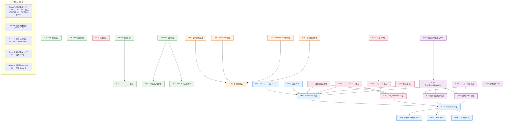
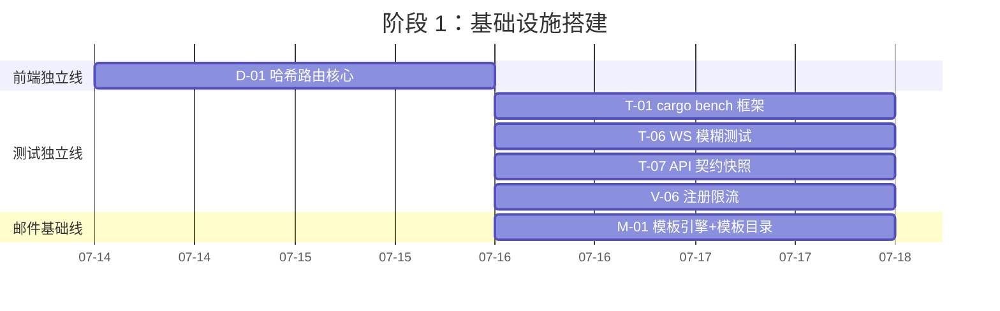
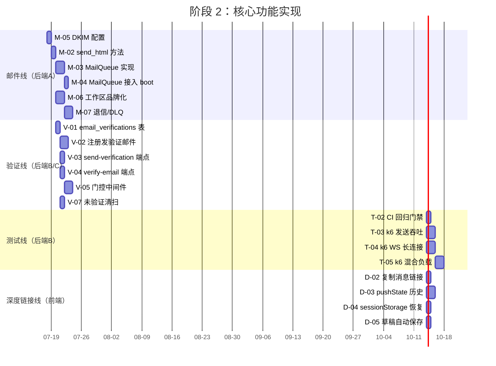
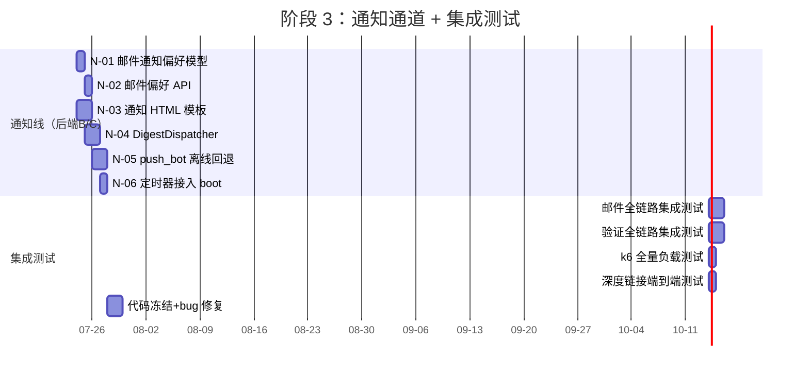
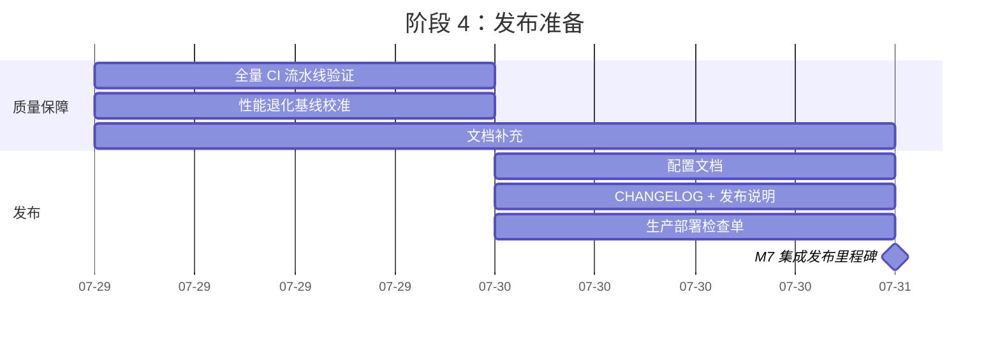

---

# Tech Lead 分析报告：Aero IM 5 大生产级缺口实施计划

> **分析日期**: 2026-07-12  
> **分析依据**: `docs/requirements/2026-07-11-code-scan-gaps.md`（14.3KB，5 方向）  
> **代码基线验证**: mailer.rs / notification_prefs.rs / background.rs / config.rs / routes.rs / app.js 等关键文件已读  
> **方法论**: 全量代码库扫描 + 既有 130+ 分析文档交叉校验

---

## 1. 任务分解（26 Tasks，每 Task 2-4h）

> 编号约定：`M##`=邮件基础设施, `T##`=测试, `D##`=深度链接, `V##`=验证, `N##`=邮件通知

### 方向一（M）：邮件基础设施成熟度

| 任务 ID | 标题 | 涉及文件 | 前置 | 工时 |
|---------|------|---------|------|------|
| **M-01** | `templates/email/` 目录 + HTML 模板引擎选型与集成 | `crates/aero-server/Cargo.toml`（加 `tinytemplate` dep），新建 `crates/aero-server/templates/email/` 含 `reset.html`, `invite.html`, `verify.html` | 无 | 3h |
| **M-02** | `Mailer::send_html` 方法：render template → `Message::builder().html_body()` 发送 | `crates/aero-server/src/mailer.rs`：新增 `render_and_send(template, data)` 泛型方法；重构 `send_password_reset` / `send_invitation` 迁至 HTML 模板 | M-01 | 2.5h |
| **M-03** | `MailQueue`：基于 `tokio::sync::mpsc` 的异步邮件队列 | `crates/aero-server/src/mail_queue.rs`（新建）：`MailQueue` struct，`enqueue(EmailJob)`，后台 drain 批量发送（批大小 10，间隔 200ms），≤3 次重试，超限入 DLQ | M-02 | 4h |
| **M-04** | `MailQueue` 接入 boot 流程：`background.rs` spawn drain | `crates/aero-server/src/bin/boot/background.rs`：`spawn_mail_drain()`；`AppState` 加 `mail_queue` 字段；`routes.rs` 里 `forgot_password` / `invite` handler 改 `mailer.send()` → `mail_queue.enqueue()` | M-03 | 2h |
| **M-05** | DKIM 签名配置与集成 | `crates/aero-common/src/config.rs`：`EmailConfig` 加 `dkim_selector`, `dkim_private_key_path`；`mailer.rs`：`build_mailer` 中构造 `DkimSigner`（`lettre::dkim`），mail 发送前 sign | M-02 | 3h |
| **M-06** | 每工作区品牌化 From 地址 | `crates/aero-storage/src/workspace_repo.rs`：`workspaces` 表加 `brand_email_from` 列（migration）；`mailer.rs`：`send_*` 方法参数加 `Option<&str>` workspace_from | M-02 | 3h |
| **M-07** | 退信处理与死信队列 | `crates/aero-server/src/mail_queue.rs`：增强 `EmailJob` `status` 枚举（`Sent`, `Bounced`, `Failed`, `Dead`）；PG 建 `email_delivery_log` 表（migration）；日志 Prometheus `email_bounces_total` 指标 | M-03 | 3.5h |

### 方向二（T）：负载与性能测试基础设施

| 任务 ID | 标题 | 涉及文件 | 前置 | 工时 |
|---------|------|---------|------|------|
| **T-01** | `cargo bench` 基准测试框架 | `crates/aero-server/Cargo.toml`（加 `criterion` dev-dep），新建 `crates/aero-server/benches/` 含 `message_throughput.rs`, `rag_retrieval.rs`, `ws_codec.rs` | 无 | 3h |
| **T-02** | CI 性能回归门禁（criterion + 阈值比较） | CI 配置 `.github/workflows/ci.yml`：`cargo bench` 步骤 + `--output-format=json` + 与基线比较，退化 >5% 标记失败 | T-01 | 2h |
| **T-03** | k6 负载场景 A：消息发送吞吐（100→1000 并发阶梯） | 新建 `scripts/k6/message_throughput.js`（k6 脚本）；`scripts/k6/run.sh`（CI 可调用包装） | 无 | 3h |
| **T-04** | k6 负载场景 B：WebSocket 长连接（5000 并发） | 新建 `scripts/k6/ws_connections.js`（k6 WS 连接 + 心跳维持 + 逐步断开） | 无 | 2.5h |
| **T-05** | k6 负载场景 C：混合负载（消息+搜索+AI 问答） | 新建 `scripts/k6/mixed_workload.js` | T-03, T-04 | 3h |
| **T-06** | WS 模糊测试框架（`fuzzcheck`） | `crates/aero-server/Cargo.toml`（加 `fuzzcheck` dev-dep）；`tests/fuzz/ws_fuzz.rs`：随机生成 `ClientFrame` 变体，验证服务端不 panic | 无 | 4h |
| **T-07** | API 契约快照测试（`insta`） | `crates/aero-server/Cargo.toml`（加 `insta` dev-dep）；对 10 条核心路由写 `insta::assert_json_snapshot!` 测试，CI 中 `cargo insta test --check` | 无 | 3h |

### 方向三（D）：Web SPA 深度链接与可分享 URL

| 任务 ID | 标题 | 涉及文件 | 前置 | 工时 |
|---------|------|---------|------|------|
| **D-01** | 客户端哈希路由核心 + `hashchange` 驱动 | `web/app.js` 重构：`Router` 对象监听 `hashchange`，支持 `#/room/{id}`, `#/room/{id}?msg={mid}`, `#/thread/{rid}`, `#/live/{sid}` | 无 | 4h |
| **D-02** | 复制消息链接功能 | `web/app.js`：消息气泡加 `[🔗]` 按钮，`navigator.clipboard.writeText(url)` | D-01 | 2h |
| **D-03** | 浏览器历史集成（`pushState` / `popState`） | `web/app.js`：视图切换时 `history.pushState`，浏览器前进/后退触发 `popState` → 路由切换 | D-01 | 3h |
| **D-04** | 会话状态持久化（`sessionStorage`） | `web/app.js`：`sessionStorage.setItem('roomId', id)` / `scrollPos` / `expandedThreads`；页面加载自动恢复 | D-01 | 2h |
| **D-05** | 草稿自动保存（`localStorage`） | `web/app.js`：composer `input` 事件防抖 500ms → `localStorage.setItem("draft:{roomId}", text)`；房间切换恢复 | D-01 | 2.5h |

### 方向四（V）：注册身份验证——邮件验证

| 任务 ID | 标题 | 涉及文件 | 前置 | 工时 |
|---------|------|---------|------|------|
| **V-01** | `email_verifications` 表 + 迁移 | `migrations/0158_email_verifications.sql`（`email TEXT UNIQUE`, `token_hash TEXT`, `expires_at TIMESTAMPTZ`, `verified_at TIMESTAMPTZ`）；`participants` 表加 `email_verified_at` 列 | M-02（需 HTML 模板发验证邮件） | 2h |
| **V-02** | `RegisterRequest` handler 追加验证邮件发送 | `crates/aero-auth/src/service.rs`：注册后 `email_verifications` 插行；`routes.rs` `register` handler：注册成功 → `mail_queue.enqueue(VerifyEmail{email, token})` | V-01, M-03 | 3h |
| **V-03** | `POST /api/auth/send-verification` 重发端点（60s 冷却） | `crates/aero-server/src/routes/auth.rs`（或 routes.rs 内联）：验证冷却 per-email 60s（Redis）；重新生成 token 发验证邮件 | V-01, M-03 | 2.5h |
| **V-04** | `POST /api/auth/verify-email` 验证令牌消费 | 新建 `crates/aero-server/src/routes/email_verification.rs`（或 routes.rs 内联）：取 token hash 比对 → `verified_at = NOW()` → `participants.email_verified_at = NOW()` | V-01 | 2h |
| **V-05** | `AERO_REQUIRE_EMAIL_VERIFICATION` 门控中间件 | 新建中间件（或重⽤ `assert_room_access` 模式）：检查 `email_verified_at`；未验证时返回 `403 VerificationRequired`；跳过 `POST /api/auth/*` 豁免路径 | V-04 | 3h |
| **V-06** | 注册限流：per-IP Redis token bucket（24h ≤ 5） | `aero-storage` 新建 `RegistrationRateLimiter` 用 `fred` Redis `INCR` + `EXPIRE`；`routes.rs` `register` handler 前置检查 | 无 | 3h |
| **V-07** | 未验证账号清扫定时器（7 天清理） | `crates/aero-server/src/bin/boot/background.rs`：新 spawn `unverified_account_sweeper`（每 3600s），软删 7 天未验证的 participant + 释放邮箱（`ON CONFLICT` 安全） | V-01 | 2h |

### 方向五（N）：邮件通知渠道

| 任务 ID | 标题 | 涉及文件 | 前置 | 工时 |
|---------|------|---------|------|------|
| **N-01** | 邮件通知偏好模型扩展 | `migrations/0159_email_notif_prefs.sql`：`notification_prefs` 表（或 `dnd_settings` 表）加列 `email_on_mention BOOL DEFAULT true`, `email_on_dm BOOL DEFAULT true`, `email_digest TEXT DEFAULT 'never'`, `email_on_golive BOOL DEFAULT false`；仓储对应字段读写 | M-02（需模板能力） | 2h |
| **N-02** | 邮件通知偏好 API：`GET/PUT /api/me/notif-prefs` | `routes.rs` 或 `crates/aero-server/src/notification_prefs.rs`：已有端点扩展邮件字段 | N-01 | 2h |
| **N-03** | 邮件通知模板（`mention.html`, `digest.html`, `golive.html`） | `templates/email/mention.html` 等 3 模板；模板变量：`{{display_name}}`, `{{room_name}}`, `{{message_preview}}`, `{{action_url}}` | M-02 | 2.5h |
| **N-04** | `EmailDigestDispatcher`：每日/每周未读摘要邮件 | 新建 `crates/aero-server/src/email_digest.rs`：扫 `email_digest='daily'|'weekly'` 用户，聚合未读消息 + @mention，批量入 `MailQueue` | N-01, N-03, M-03 | 4h |
| **N-05** | 离线回退策略：`push_bot.rs` 降级发邮件 | `crates/aero-server/src/push_bot.rs`：push 失败（FCM/APNs 不可达）且用户有 `email_on_mention` 偏好 → 入 `MailQueue` 发 `mention.html`；受 `email_digest` 偏好限制避免风暴 | N-03, M-03 | 3.5h |
| **N-06** | 邮件通知定时器接入 `background.rs` | `crates/aero-server/src/bin/boot/background.rs`：`spawn_email_digest_dispatcher`（每日/每周分 tick），gate 条件 `MailQueue` 存在 | N-04 | 1.5h |

---

## 2. 执行顺序与依赖图



### 并行任务组

| 组 | 包含任务 | 并行条件 | 建议开发者 |
|----|---------|---------|-----------|
| **A（独立）** | T-01, T-03, T-04, T-06, T-07, D-01, V-06 | 零依赖，与其余方向完全独立 | 2 人并行 |
| **B（邮件基础）** | M-01, M-05, M-06 | 互不依赖，但 M-01 是下游瓶颈 | 1 人串行或 2 人合 |
| **C（邮件队列）** | M-02→M-03→M-04→M-07 | 严格链式 | 1 人串行 |
| **D（验证）** | V-01→V-02/V-03→V-04→V-05, V-07（可 V-06 并行） | V-01/V-02 阻塞于 M-02/M-03，其余 V 子任务可分组并行 | 1 人主攻 + 1 人辅助 |
| **E（通知）** | N-01→N-02/→N-04，N-03→N-05，N-06 | N-01/N-03 阻塞于 M-02；N-04/N-05 可并行 | 1 人 |

---

## 3. 技术风险

### 3.1 高风险项

| # | 风险 | 方向 | 可能性 | 影响 | 缓解策略 |
|---|------|------|--------|------|---------|
| R1 | **lettre DKIM 支持成熟度**：lettre 0.11 DKIM 签名的 API 稳定性和文档质量 | M | 中 | 高（DKIM 是邮件送达率的硬要求） | 提前在独立分支验证 `lettre::dkim::DkimSigner` 构造；备选直接用 OpenSSL CLI 签名或换 `mail-send` crate |
| R2 | **邮件队列背压与逃逸**：`mpsc` 队列满时丢消息，但关键验证邮件不能丢 | M, V | 中 | 高（注册验证邮件必须送达） | 队列满时 `enqueue` 用 `try_send` + fallback 到 `send_mail_sync`（同步兜底）；关键邮件（验证/密码重置）不走丢路径 |
| R3 | **k6 WebSocket 脚本稳定性**：k6 WS API 是 callback 驱动，5000 并发下回调闭环复杂 | T | 中 | 中 | 测试脚本预演迭代，压缩为 3 个核心 k6 场景；用 `k6/ws.js` 模块 + 5 秒超时保护 |
| R4 | **`AERO_REQUIRE_EMAIL_VERIFICATION` 对既有部署的兼容性** | V | 低 | 高（开光后所有未验证用户锁定） | 默认为 `false`；`true` 时对所有既有 `email_verified_at IS NULL` 用户发批量验证邮件激活，或提供 `admin/bulk-verify` 端点 |
| R5 | **`push_bot.rs` 离线回退的风暴风险**：FCM 批量不可达时，所有通知涌入邮件队列 | N | 高 | 中 | 邮件队列加 per-user 速率限制（1 封/5 分钟 per 用户）；平台级邮件限流（500 封/小时 total） |
| R6 | **哈希路由与既有 SPA 架构的冲突**：当前 `showAuth/showChat` 柱塞式切换缺少虚拟 DOM 隔离 | D | 中 | 中 | 渐进式引入：不重构整个 SPA，只在 `hashchange` handler 中 `fetch` → 替换 `#main-content` innerHTML；不影响既有柱塞框架 |
| R7 | **`insta` 快照维护成本**：126+ 路由 → 快照数量大，路由微调即快照飘红 | T | 高 | 低 | 只选 10 条核心路由做快照（register / login / send_message / search / create_room 等），其余用 `minisnap` 只做 JSON shape 校验 |

### 3.2 外部依赖清单

| 依赖 | 用途 | 替代方案 | 当前版本可用？ |
|------|------|---------|-------------|
| `tinytemplate` | HTML 邮件模板 | `minijinja`（更强大但体重），`handlebars` | ✅ 成熟 |
| `lettre::dkim` | DKIM 签名 | `rmp-serde` + 外部 OpenSSL pipeline | ⚠️ 需验证 |
| `criterion` | 性能基准回归 | `divan`（较新），`cargo bench` 原生 | ✅ 成熟 |
| `k6` (`grafana/k6`) | 负载测试 CLI | `locust` (Python)，`vegeta` (Go) | ✅ 成熟 |
| `fuzzcheck` | WS 模糊测试 | `libfuzzer-sys`（Rust），`cargo-fuzz` | ✅ 成熟 |
| `insta` | API 契约快照 | `snapbox`, `k9` | ✅ 成熟 |
| `fred` | Redis 限流（已有依赖） | — | ✅ 已有 |

### 3.3 性能瓶颈与优化策略

| 瓶颈 | 方向 | 上下文 | 策略 |
|------|------|--------|------|
| 邮件队列 drain 批大小 | M | 批量 >10 可能 SMTP 超时，<5 吞吐不足 | 初始批大小 10 + 200ms 间隔，可观测 `email_send_duration` histogram 自适应 |
| 摘要邮件扫描全表 | N | 每日扫 `notification_prefs` → JOIN `messages` 聚合未读 | 加 `last_digest_sent_at` 游标 + `WHERE email_digest != 'never'` 索引；分批 LIMIT 500 |
| k6 测试污染 DB | T | 负载测试产生大量消息/用户数据 | 测试用独立 PG + Redis + NATS 实例（`aero-cli test-env`），测试结束 `DROP DATABASE` |
| SPA 路由切换性能 | D | `hashchange` + innerHTML 替换 → 全量重渲染 | 消息列表使用 `insertAdjacentHTML` 增量更新，非全量 innerHTML |

---

## 4. 资源评估

### 4.1 所需人员

| 角色 | 所需人数 | 关键技能 | 负责任务 |
|------|---------|---------|---------|
| **Rust 后端工程师 A** | 1 | Rust async（tokio/axum/sqlx），邮件生态（SMTP/DKIM），lettre | M-01~M-07（邮件线全链） |
| **Rust 后端工程师 B** | 1 | Rust 测试基础设施（criterion/k6/fuzz/insta），Redis 限流模式 | T-01~T-07（测试线） + V-06（注册限流） |
| **Rust 后端工程师 C** | 1 | IM/通知系统，push_bot 架构，NATS 事件驱动 | N-01~N-06（通知线） + V-01~V-07（验证线） |
| **前端工程师** | 1 | Vanilla JS SPA，HashRouter pattern，`sessionStorage`/`localStorage`，Web Share API | D-01~D-05（深度链接线全链） |
| **QA 工程师** | 1 | 负载测试设计，WS 协议测试，CI 门禁维护 | T-03~T-07 验收与执行 |

**建议**：
- 初期 3 人（2 Rust + 1 前端）即可覆盖 A + B + D 三线并行
- 第 2 周添加第 3 位 Rust 工程师接力 M→V 线
- QA 工程师部分时间投入（兼职或第 3 周全职）

### 4.2 关键里程碑

| 里程碑 | 时间 | 交付物 | 验收标准 |
|--------|------|-------|---------|
| **M1: 基线建立** | Day 3 | T-01, T-06, T-07, D-01, V-06 完成 | `cargo bench` 输出 3 基准；WS fuzz 能发现已知畸形帧不 panic；`#/room/{id}` 路由切换可用；注册限流返回 429 |
| **M2: 邮件底座** | Day 7 | M-01~M-04 完成 | HTML 模板发送密码重置/邀请邮件可用；`MailQueue` 在 boot 时 spawn；`forgot_password` 走队列发送 |
| **M3: 验证流程** | Day 11 | V-01~V-05 完成 | 注册后收验证邮件 → 点击验证链接 → `email_verified_at` 更新；`AERO_REQUIRE_EMAIL_VERIFICATION=true` 门控生效 |
| **M4: 测试就绪** | Day 11 | T-02~T-05 完成 | CI 中含性能回归门禁；每周定时 k6 脚本可执行；3 个 k6 场景报告产出 |
| **M5: 通知上线** | Day 15 | N-01~N-06 完成 | 邮件通知偏好 API 可用；每日摘要任务产出邮件；`push_bot` 不可达时降级发邮件 |
| **M6: 深度链接完成** | Day 12 | D-02~D-05 完成 | 消息复制链接可用；浏览器前进/后退切换房间；刷新恢复房间/滚动位置/草稿 |
| **M7: 集成发布** | Day 18 | 全方向集成 | 5 个方向全量 CI 通过；k6 场景全部绿；性能退化 <5% |

### 4.3 阻塞点与解决策略

| 阻塞点 | 影响 | 解决策略 |
|--------|------|---------|
| `lettre::dkim` API 不稳定或编译失败 | 阻塞 M-05 | 3 天内验证 → 不行则换 `rmp-serde` + 外部 OpenSSL pipeline（DKIM 签名是纯算法，可手动构造 `DKIM-Signature` 头） |
| k6 在 CI 环境中不允许大量并发连接（GitHub Actions 默认 ulimit） | 阻塞 T-03~T-05 | CI 中跑轻量版（20 并发 / 200 WS）；全量版每周手动在专用机器跑 |
| 哈希路由与既有 SPA 的事件系统冲突 | 阻塞 D-01 | 设计评审：D-01 前用 RFC（Request For Comments）方式在团队中讨论路由方案，避免大改 SPA |
| 摘要邮件扫描性能不达标（全表扫描 >30s） | 阻塞 N-04 | 降级设计：游标分页 + `WHERE email_digest != 'never'` 覆盖索引 + 限时 10s 截断 |

---

## 5. 质量保证

### 5.1 单元测试覆盖要求

| 模块 | 测试目标 | 最低覆盖率 | 测试要点 |
|------|---------|-----------|---------|
| `mailer.rs` / HTML render | 模板渲染 + mail 构造 | 单元 90%+ | 模板变量正确替换；HTML 实体转义；空 `to` 不 panic；`data` 缺字段优雅降级 |
| `mail_queue.rs` | enqueue / drain / retry / DLQ | 单元 95%+ | 3 次重试后进死信；batch drain 不丢消息；`try_send` fallback 逻辑；cancel token 优雅关闭 |
| email 验证流程（V-02~V-04） | token 生成/校验/过期/幂等 | 单元 90%+ | token hash 正确比对；过期 token 返回 `410 Gone`；重发 60s 冷却；`ON CONFLICT` 幂等 |
| 注册限流（V-06） | per-IP 24h 计数 | 单元 95%+ | 5 次后拒绝；Redis 故障 fail-open；`INCR` + `EXPIRE` 原子性 |
| 路由切换（D-01） | hash 解析 + 视图切换 | 无需 Rust 单元，前端 eslint 静态 | hash 格式解析测试（`#/room/xxx` / `#/room/xxx?msg=yyy`）；无效 hash 回到首页 |
| 通知偏好 API（N-02） | 读写/默认值/边界 | 单元 90%+ | `email_digest` 枚举校验（`never`/`instant`/`daily`/`weekly`）；非法值 422；`PUT` 合并语义 |
| Digest Dispatcher（N-04） | 未读聚合 + 频率控制 | 单元 85%+ | 游标正确推进；不重复发送；`email_digest='never'` 跳过；`last_digest_sent_at` 门控 |

### 5.2 集成测试策略

| 测试场景 | 方向 | 方法 | 数据隔离 |
|---------|------|------|---------|
| 邮件发送全链路（handler→MailQueue→SMTP） | M | 用 `FakeSmtpServer`（`greenmail` 或 mock SMTP）验证邮件实际发出 | 独立端口 `:2525` |
| 注册→验证→门控→使用（完整用户旅程） | V | `POST /api/auth/register` → 伪造验证 → `GET /api/me/export` | 独立 PG 数据库 |
| WS 连连接收畸形帧 | T | `fuzzcheck` 注入 1000 个随机 `ClientFrame`，验证 WS 不 panic | 独立实例 |
| 摘要邮件 + 离线回退 | N | 创建离线用户 → 发送消息 → 断言邮件队列收到 Job | mock MailQueue |
| `AERO_REQUIRE_EMAIL_VERIFICATION=true` 场景 | V | 注册后不验证 → 尝试发消息 → 断言 `403` | 独立 PG |

### 5.3 代码审查要点

| 检查项 | 方向 | 具体关注点 |
|--------|------|-----------|
| **幂等性（at-least-once safety）** | M, V, N | `email_verifications` 的 token 消费是 `ON CONFLICT DO NOTHING` 幂等？`MailQueue` 重投是否覆盖死信？ |
| **Fail-Open 模式** | V, N | Redis 限流故障时注册应 fail-open（放过）非 fail-close（全部拒绝）；邮件队列故障不应阻塞请求 handler |
| **模板 XSS 防护** | M, N | HTML 模板中 `{{ display_name }}` 等用户提供字段必须 `escape_html`；`tinytemplate` 默认不 escape → 需在 render 前 sanitize |
| **环境变量门控** | V | `AERO_REQUIRE_EMAIL_VERIFICATION` 默认 `false`；开光文档显式声明对既有用户的影响 |
| **日志与可观测性** | M, N | Prometheus 指标覆盖：`email_sent_total{status=ok|bounced|failed}`、`email_queue_depth`、`verification_rate_limit_hits` |
| **迁移幂等** | V, N | `CREATE TABLE IF NOT EXISTS` + `ALTER TABLE ... ADD COLUMN IF NOT EXISTS` 确保重复迁移安全 |
| **前端兼容性** | D | `navigator.clipboard` 需要 HTTPS 或 localhost，需 `copy-fallback` 文本选中模式；`hashchange` 事件监听需在 `DOMContentLoaded` 之后 |

### 5.4 性能测试需求

| 测试场景 | 指标 | 最低标准 | 告警阈值 |
|---------|------|---------|---------|
| 消息发送全路径（DB insert + NATS publish + Hub fan-out） | p50 / p99 / throughput | p99 < 50ms, 1000 msgs/s | 退化 >10% CI 失败 |
| WS 帧编解码 | latency / allocs | 编解码 < 10µs | 退化 >15% CI 失败 |
| 注册路径（hash / insert / token gen / enqueue） | p50 / p99 | p99 < 200ms | 退化 >20% CI 告警 |
| 摘要邮件聚合查询 | query time / rows | < 3s for 10K users | >5s 告警 |
| 5000 WS 长连接 | memory / CPU / FD | 每连接 < 50KB RSS | 超 300MB RSS 告警 |

---

## 6. 实施计划

### 阶段 1：基础设施搭建（Day 1 ~ Day 4）—— 4 天



**Day 1**: D-01（哈希路由核心）、M-01（模板引擎选型）、T-01 准备（bench 空框架）
**Day 2-3**: D-01 完成前端路由第一版；M-01 完成 + 3 模板落地；T-01/T-06/T-07 并行编码
**Day 4**: 各任务收尾 + code review + 合并；**M1 基线建立里程碑验收**

### 阶段 2：核心功能实现（Day 5 ~ Day 11）—— 7 天



**Day 5-7**: M-02（send_html）+ M-03（MailQueue）链式开发——这是整条 M 线的核心瓶颈。M-05（DKIM）独立可并行。D-02~D-05 前端并行。
**Day 7-8**: **M2 邮件底座里程碑验收**——M-01~M-04 完成可演示。
**Day 8-10**: V-01~V-04 密集开发——依赖 M-02/M-03 就绪。T-02~T-05 k6 脚本开发并行。
**Day 10-11**: V-05 门控中间件 + V-07 清扫定时器；T-05 k6 混合负载脚本完成。
**Day 11**: **M3 验证流程里程碑** + **M4 测试就绪里程碑** 双验收。

### 阶段 3：通知通道 + 集成集成（Day 12 ~ Day 15）—— 4 天



**Day 12**: N-01（偏好模型）+ N-03（通知模板）并行启动。
**Day 13-14**: N-04（摘要调度器）+ N-05（离线回退）并行开发——这里有两个后端工程师并行。
**Day 14**: **M5 深度链接完成里程碑**（D-02~D-05 全部完成）。
**Day 15**: N-06 接入 + 全方向集成测试。
**Day 15**: **M6 通知上线里程碑验收**。

### 阶段 4：发布准备（Day 16 ~ Day 18）—— 3 天



**Day 16**: 全量 CI 跑通（`cargo check` + `cargo test` + `cargo clippy` + `cargo bench` + `scripts/*.sh` + `k6 smoke`）。补充架构文档 `docs/email.md` 和 `docs/deep-linking.md`。
**Day 17**: 性能基线校准（提交 benchmark 基线到 `benches/baseline/`）。生产部署配置文档（DKIM DNS 记录配置、SPF 记录更新、`AERO_REQUIRE_EMAIL_VERIFICATION` 开光文档）。
**Day 18**: 发布检查单逐项通过。**M7 集成发布里程碑验收**。

### 总时间线：18 个工作日

```
Week 1 (Mon-Thu):  Phase 1 基础设施搭建（4 days）
Week 1-2 (Fri-Wed): Phase 2 核心功能实现（7 days）
Week 2-3 (Thu-Tue): Phase 3 通知通道 + 集成（4 days）
Week 3 (Wed-Fri):   Phase 4 发布准备（3 days）
```

### 资源日历

```
Day  1- 4: 2 Rust + 1 前端 (3人)
Day  5-11: 3 Rust + 1 前端 (4人, 第3位 Rust Day 5 加入)
Day 12-15: 2 Rust + 1 前端 + 1 QA (4人)
Day 16-18: 2 Rust + 1 前端 + 1 QA (4人)
```

**总计**: ~54 人天（含重叠）

---

## 7. 附录：各任务验收标准速查表

| 任务 ID | 核心验收标准 |
|---------|------------|
| M-01 | `tinytemplate` 集成完成；3 模板文件存在且 render 出含品牌占位的 HTML；单元测试覆盖全部模板变量 |
| M-02 | `Mailer::render_and_send` 发送 HTML 邮件；`send_password_reset` 迁移到 HTML；`Message::builder().html_body()` 可用 |
| M-03 | `MailQueue::enqueue` 返回 `Result`；drain loop 批处理 ≤10；3 次重试后入 DLQ；cancel token 优雅关闭 |
| M-04 | `AppState` 含 `mail_queue`；`forgot_password` / `invite` 走队列；boot 日志 `"mail queue drain started"` |
| M-05 | `EmailConfig` 含 `dkim_selector`, `dkim_private_key_path`；mail 发送时 `DKIM-Signature` 头存在；验证签名链 |
| M-06 | `workspaces.brand_email_from` 列；`Mailer::send_*` 接受可选 from 覆盖；工作区品牌化邮件展示公司域名 |
| M-07 | `email_delivery_log` 表 + 插入；`status` 枚举；Prometheus `email_bounces_total` 指标 |
| T-01 | `cargo bench` 输出 3 基准结果（message_throughput / rag_retrieval / ws_codec）；报告 p50/p99 延迟 |
| T-02 | CI 中 `cargo bench -- --output-format=json` + 基线比较；退化 >5% 标记 CI 为 `check-fail` |
| T-03 | `k6 run scripts/k6/message_throughput.js` 可用；100→1000 并发阶梯，产出吞吐报告 |
| T-04 | `k6 run scripts/k6/ws_connections.js` 可用；5000 WS 连接逐步建立/断开；FD 不泄漏 |
| T-05 | `k6 run scripts/k6/mixed_workload.js` 可用；消息+搜索+AI 混合场景；p95 < 1s |
| T-06 | `cargo fuzzcheck` 注入 ≥100 随机 `ClientFrame`；服务端不 panic 且返回语义有效响应 |
| T-07 | `cargo insta test --check` 绿色；10 路由快照含 `register/login/send_message/search/create_room` 等 |
| D-01 | `hashchange` 驱动 `#/room/{id}` → 视图切换；无效 hash → 首页；`#/room/{id}?msg={mid}` 解析 |
| D-02 | 消息气泡 `[🔗]` 按钮存在；`navigator.clipboard.writeText(url)` 可用；URL 格式 `{origin}/#/room/{rid}?msg={mid}` |
| D-03 | `history.pushState` 房间切换时记录；浏览器前进/后退触发 `popState` → 路由切换 |
| D-04 | `sessionStorage` 保存 `currentRoomId` + `scrollPos`；页面加载自动恢复；"跳转至上次位置"功能 |
| D-05 | `composerInput input` 事件防抖 500ms → `localStorage.setItem("draft:{roomId}", text)`；房间切换恢复 |
| V-01 | 迁移 0158 可执行；`email_verifications` 表 + `participants.email_verified_at`；`cargo build` + migrate 通过 |
| V-02 | 注册完成后 `MailQueue` 收到验证邮件 job；`email_verifications` 行插入；token 含 `sha256` hash |
| V-03 | `POST /api/auth/send-verification` 60s 冷却；重发 token 生效；已验证用户返回 `409 Conflict` |
| V-04 | `POST /api/auth/verify-email` 消费 token；`email_verified_at` 更新；过期 token `410 Gone` |
| V-05 | `AERO_REQUIRE_EMAIL_VERIFICATION=true` → 未验证用户 `403 VerificationRequired`；豁免路径：`/auth/*` |
| V-06 | per-IP `REGISTRATION_LIMIT_KEY` 计数 5；超出返回 `429 Too Many Requests`；Redis 故障 fail-open |
| V-07 | 定时器每 3600s 扫 7 天未验证 participant；软删除 + `participants.email = uuid`（释放邮箱） |
| N-01 | migration 0159 含 `email_on_mention`, `email_on_dm`, `email_digest`, `email_on_golive`；仓储读写 |
| N-02 | `GET /api/me/notif-prefs` 返回邮件偏好；`PUT` 支持部分更新；默认值语义正确 |
| N-03 | 3 模板（mention/digest/golive）render 正确；用户显示名 escape；action URL 含 `utm_source=email` |
| N-04 | 每日/每周扫描 `email_digest='daily'|'weekly'` 用户；聚合未读消息 + @mention + 开播；入 MailQueue |
| N-05 | `push_bot` 收到 FCM/APNs `Unreachable` 错误 → 检查 `email_on_mention` → 入 MailQueue；per-user 5min 限流 |
| N-06 | `background.rs` spawn `email_digest_dispatcher`；gate：`MailQueue` 存在；日志 `"email digest dispatcher started"` |
