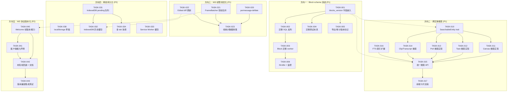
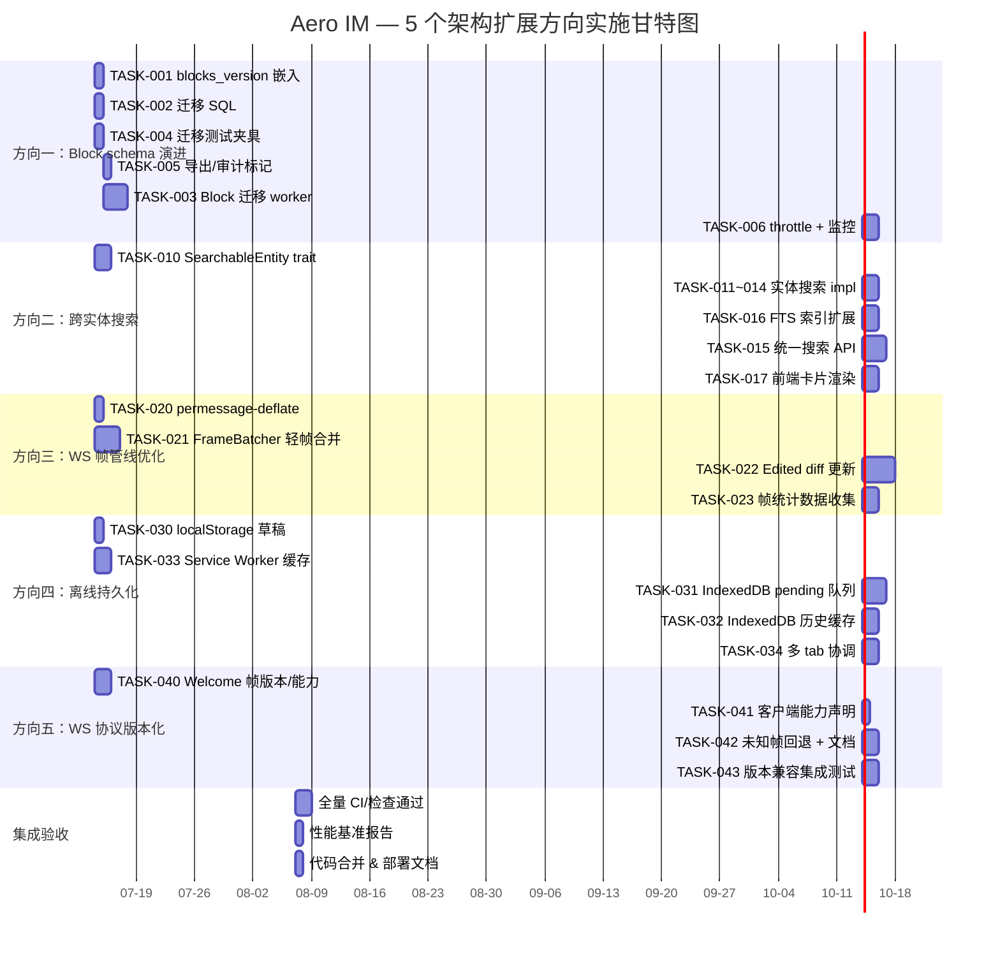

Now I have full verification of all evidence. Let me compile the comprehensive Tech Lead analysis.

---

# Tech Lead 分析报告：5 个架构扩展方向

> **分析依据**: `docs/requirements/2026-07-11-post-full-code-scan-five-missed-architectural-extensions.md`
> **代码基线**: Commit HEAD (2026-07-11), 157 migrations, 53 `define_id!`, 10 `Block` variants, 15+ `ServerFrame` variants
> **角色**: Tech Lead — 关注可实现性、工程实践、任务依赖、风险识别

---

## 1. 任务分解（Task Decomposition）

### 1.1 方向一：消息 Block schema 演进 —— 数据完整性/架构（P1）

| 任务 ID | 任务标题 | 所属方向 | 涉及文件 | 前置依赖 | 预估工时 | 验收标准 |
|---------|----------|----------|----------|----------|---------|---------|
| TASK-001 | `blocks_version` 字段嵌入 Message 结构体 | 方向一 | `crates/aero-common/src/model/message.rs` | 无 | 2h | `Message` 结构体增加 `blocks_version: u8` 字段，默认 1；序列化时始终写入当前版本号；反序列化兼容缺省版本（`#[serde(default)]`） |
| TASK-002 | 迁移 SQL 添加 `messages.blocks_version` 列 | 方向一 | `migrations/NNNN_add_blocks_version.sql` | TASK-001 | 1h | 新迁移 `ALTER TABLE messages ADD COLUMN blocks_version SMALLINT NOT NULL DEFAULT 1`；`cargo build`+`aero-cli migrate` 可用 |
| TASK-003 | Block 迁移框架（后台 worker） | 方向一 | `crates/aero-server/src/boot/background.rs` + `crates/aero-server/src/block_migrator.rs` | TASK-002 | 6h | 类似 `embedding_backfill` 的定时器（默认 600s interval）：分批扫描 `blocks_version < CURRENT` 的消息（每批 100 条），在 Rust 中反序列化→重新序列化→`UPDATE messages SET blocks = $1, blocks_version = $2 WHERE id = $3`，受 budget 约束（同 `AiWorker` 模式），含 legal_hold 跳过 |
| TASK-004 | 迁移测试夹具 | 方向一 | `crates/aero-common/src/model/block.rs`（新增测试模块） | TASK-001 | 3h | 每新增 Block 变体时维护旧格式样本的 JSON fixture；`#[test]` 验证 `serde_json::from_str::<Block>(old_fixture)` 成功且字段语义正确 |
| TASK-005 | Block 版本标记在消息导出/审计中输出 | 方向一 | `crates/aero-server/src/me.rs`（export） + `crates/aero-storage/src/audit.rs` | TASK-001 | 2h | GDPR 导出的每条消息包含 `blocks_version` 字段；审计日志记录消息的 `blocks_version` |
| TASK-006 | Block 迁移自动 throttle + autovacuum 监控 | 方向一 | `crates/aero-server/src/block_migrator.rs` + `crates/aero-server/src/boot/background.rs`（observability） | TASK-003 | 3h | 写放大控制：max 每秒 500 行 UPDATE；Prometheus gauge `block_migration_lag` 报告待迁移消息数；autovacuum 活动时暂停迁移 |

### 1.2 方向二：跨实体内容图谱——统一检索（P1）

| 任务 ID | 任务标题 | 所属方向 | 涉及文件 | 前置依赖 | 预估工时 | 验收标准 |
|---------|----------|----------|----------|----------|---------|---------|
| TASK-010 | `SearchableEntity` trait 定义 | 方向二 | `crates/aero-storage/src/search.rs` | 无 | 3h | trait 含 `fn entity_type() -> &'static str`、`fn text_content(&self) -> String`、`fn room_scope(&self) -> Option<RoomId>`、`fn created_at(&self) -> OffsetDateTime`；为 `Message` 实现 |
| TASK-011 | Canvas 实体搜索实现 | 方向二 | `crates/aero-storage/src/canvas.rs`（impl `SearchableEntity`） | TASK-010 | 2h | canvas.title + canvas.body 投影为 text_content；room-scoped |
| TASK-012 | Task 实体搜索实现 | 方向二 | `crates/aero-storage/src/tasks.rs`（impl `SearchableEntity`） | TASK-010 | 2h | task.description + task.title 投影 |
| TASK-013 | Poll 实体搜索实现 | 方向二 | `crates/aero-storage/src/polls.rs`（impl `SearchableEntity`） | TASK-010 | 2h | poll.question + poll.options 投影 |
| TASK-014 | Clip & Transcript 实体搜索实现 | 方向二 | `crates/aero-storage/src/clips.rs` + `crates/aero-storage/src/call_transcript.rs` | TASK-010 | 2h | clip.description、transcript text 投影 |
| TASK-015 | 统一搜索 API 路由实现 | 方向二 | `crates/aero-server/src/unified_search.rs` | TASK-010 ~ 014 | 6h | `POST /api/search/unified?q=&scope=workspace|room` — 跨实体 FTS 搜索 + RRF 排序；各实体类型独立限返回数量（≤5 条/类型）；复用成员权限边界（`assert_room_access`） |
| TASK-016 | FTS 索引扩展到 canvas/task/poll 等高频实体 | 方向二 | `migrations/NNNN_fts_canvas_tasks_polls.sql` | TASK-010 | 3h | 为 `canvases.title || ' ' || canvases.body`、`tasks.description`、`polls.question` 建 GIN tsvector 索引；增量更新触发器 |
| TASK-017 | 搜索结果前端卡片渲染 | 方向二 | `web/search.js` + `web/render.js` | TASK-015 | 3h | 不同实体类型用不同视觉卡片渲染；按 `(room_id, entity_type)` 分组 + 时间倒序 |

### 1.3 方向三：WS 帧管线优化（P1）

| 任务 ID | 任务标题 | 所属方向 | 涉及文件 | 前置依赖 | 预估工时 | 验收标准 |
|---------|----------|----------|----------|----------|---------|---------|
| TASK-020 | WS permessage-deflate 扩展启用 | 方向三 | `crates/aero-server/src/ws/mod.rs`（axum WS upgrade 时协商） | 无 | 2h | `SocketConfig::with_permessage_deflate()` 或在 `WebSocketUpgrade` 时设置 `compression`；房间级别可开关（默认开启）。吞吐量测试确认压缩后帧大小减少 ~40-60% |
| TASK-021 | `FrameBatcher` 轻帧合并实现 | 方向三 | `crates/aero-server/src/hub.rs`（新 `FrameBatcher` 结构体） | 无 | 6h | 50ms 窗口内将 typing/read/presence 等轻量帧合并为一条 batch 广播；每帧格式化为 `{type:"batch", frames:[...]}`；客户端 `ws.js` 理解 batch 帧；大房间（5000 人）typing 带宽从 ~750KB 降到 ~40KB |
| TASK-022 | 大型帧差异更新（Edited 事件 JSON Patch） | 方向三 | `crates/aero-server/src/ws/frame.rs`（`diff_blocks`）+ `crates/aero-common/src/model/block.rs`（`BlockDiff` 类型） | 无 | 8h | `Edited` 事件发送 `ops: Vec<PatchOp>` 而非全量 `Block` 数组；Rust 端计算 diff，JS 端 `applyPatch` 应用；丢失 diff 后通过 seq 校验和触发全量同步 |
| TASK-023 | WS 帧统计数据收集 | 方向三 | `crates/aero-server/src/hub.rs`（ metrics 埋点） | TASK-020, TASK-021 | 3h | Prometheus 监控：每连接每秒 `ws_frames_sent_total`、`ws_bytes_sent_total`、`ws_frame_batch_ratio`；识别异常大帧/高频连接 |

### 1.4 方向四：客户端离线消息持久化（P2）

| 任务 ID | 任务标题 | 所属方向 | 涉及文件 | 前置依赖 | 预估工时 | 验收标准 |
|---------|----------|----------|----------|----------|---------|---------|
| TASK-030 | localStorage 草稿持久化 | 方向四 | `web/app.js` + `web/composer.js` | 无 | 2h | 输入框 text 每 5s 自动保存到 `localStorage.setItem('draft:'+roomId, text)`；切换房间/刷新页面后恢复草稿；发送成功后清理本地草稿 |
| TASK-031 | IndexedDB pending 消息队列 | 方向四 | `web/indexeddb.js`（新文件） + `web/app.js` | 无 | 6h | pending 消息写入 IndexedDB `pending_messages` object store（含 `client_id` 幂等键）；WS 重连后从 IndexedDB 读取 pending 消息重试发送；发送成功后删除；服务端确认支持 `client_id` 幂等去重 |
| TASK-032 | IndexedDB 消息历史缓存 | 方向四 | `web/indexeddb.js` + `web/app.js`（history 加载路径） | TASK-031 | 4h | 拉取的 room history 写入 IndexedDB `message_cache` store（按房间分组，LRU 淘汰）；单房间最大 500 条缓存；离线可读历史消息；`DELETE` 事件同步清理缓存 |
| TASK-033 | Service Worker 静态资源缓存 | 方向四 | `web/sw.js`（新文件）+ `web/index.html`（注册 SW） | 无 | 3h | Service Worker 缓存 `index.html` + `*.js` + `*.css` + CDN 资源（hls.js 等）；install/activate/fetch 事件处理；离线时从 cache 加载页面 |
| TASK-034 | 多个 tab 离线队列协调 | 方向四 | `web/indexeddb.js`（`BroadcastChannel` 协调） | TASK-031 | 3h | 使用 `BroadcastChannel` 在多个 tab 间协调离线队列；只有一个 tab 负责发送 pending 消息；tab 关闭前移交 coordinator 角色 |

### 1.5 方向五：WS 协议版本化与能力协商（P2）

| 任务 ID | 任务标题 | 所属方向 | 涉及文件 | 前置依赖 | 预估工时 | 验收标准 |
|---------|----------|----------|----------|----------|---------|---------|
| TASK-040 | Welcome 帧增加协议版本和能力列表 | 方向五 | `crates/aero-server/src/ws/ws_impl/mod.rs`（`ServerFrame::Welcome`）+ `web/ws.js`（处理 welcome） | 无 | 3h | 连接建立后第一个帧为 `{type:"welcome", protocol_version:1, capabilities:[...], server_version:"..."}`；客户端存储 `protocol_version` 用于后续决策 |
| TASK-041 | 客户端能力声明（query string 方式） | 方向五 | `web/ws.js`（连接时传 `capabilities`）+ `crates/aero-server/src/ws/ws_impl/mod.rs`（解析 `WsParams`） | TASK-040 | 2h | 客户端在 `/ws?token=xxx&caps=msg,react,thread,poll,canvas,call,stream` 声明支持的能力集；服务器按交集决定发送哪些帧类型 |
| TASK-042 | 未知帧类型回退行为文档化 + 服务端门控 | 方向五 | `crates/aero-server/src/ws/ws_impl/frame.rs`（`handle_text` 中能力门控）+ `docs/ws-protocol.md` | TASK-040, TASK-041 | 4h | 服务器对 `protocol_version < 2` 的客户端跳过新增帧类型；`ServerFrame` 发送前检查客户端能力集；文档记录版本号递增条件和能力集扩展流程 |
| TASK-043 | 版本兼容集成测试 | 方向五 | `crates/aero-server/tests/ws_protocol_compat.rs` | TASK-040, TASK-041, TASK-042 | 4h | SPIRE：旧版客户端（声明 `caps=msg,react`）+ 新版服务器 → 仅收到 `message`/`reaction` 帧；新版客户端 + 旧版服务器 → 忽略未知 capabilities；每种新帧类型 + 旧客户端 = 静默降级不丢帧 |

---

## 2. 执行顺序与任务依赖

### 可并行执行的任务组

| 并行组 | 任务 | 理由 |
|--------|------|------|
| **Group A** | TASK-001, TASK-010, TASK-020, TASK-030, TASK-033, TASK-040 | 6 个方向的基础设施先决任务，互不依赖，可平行开工 |
| **Group B** | TASK-002+TASK-004+TASK-005, TASK-011~014, TASK-021, TASK-031, TASK-041 | 方向一 SQL/测试/导出、方向二实体实现、方向三轻帧合并、方向四 IndexedDB、方向五声明 |
| **Group C** | TASK-003+TASK-006, TASK-015+TASK-016, TASK-022, TASK-032+TASK-034, TASK-042 | 各方向中高复杂度实现 |
| **Group D** | TASK-017, TASK-023, TASK-043 | 前端渲染、监控、集成测试（独立收尾） |

**并发推荐**：4 人 team 按 Group A→B→C→D 推进，每人负责 1-2 个方向。

---

## 3. 技术风险识别

### 3.1 高风险项

| 风险 ID | 风险描述 | 所属方向 | 风险等级 | 缓解策略 |
|---------|----------|----------|---------|----------|
| R-001 | **Block 迁移写放大导致 PG 性能抖动**：数十亿行 `UPDATE messages SET blocks = ...` 触发大量 autovacuum、WAL 写入、索引膨胀 | 方向一 | 🔴 | ① 迁移改用分批 + 低优先级 + `pg_sleep` throttle（同 `AiWorker` budget 模式）② `UPDATE` 前 `SET session_replication_role = replica` 临时抑制 trigger（无 trigger 则忽略）③ 监控 `pg_stat_progress_vacuum` + `pg_stat_all_tables.n_dead_tup` 自动暂停 |
| R-002 | **跨实体搜索结果一致性**：实体间没有统一的分页 cursor（不同实体的 id 空间不兼容） | 方向二 | 🟡 | ① 用 `created_at` 时间戳作为统一排序键（全实体兼容）② 每类型独立限 ≤5 条 ③ RRF 分数不跨类型比较，仅在类型内排序后按固定权重融合 |
| R-003 | **WS permessage-deflate CPU 开销**：10k+ 并发连接时，zlib 压缩 CPU 成本 > 带宽节省 | 方向三 | 🟡 | ① 大房间（>200 人）默认开，小房间按需关 ② `level=1`（最快）而非默认 6 ③ 基准测试：5k 连接下 CPU vs 带宽拐点测试 |
| R-004 | **IndexedDB 容量限制**：手机端 ~50MB 上限，消息历史+附件 blob 很容易撑爆 | 方向四 | 🟡 | ① LRU 淘汰 + 单房间 ≤500 条 ② `navigator.storage.estimate()` 实时检测 ③ 附件 blob 只存 URL 索引不存二进制 |
| R-005 | **离线队列幂等键**：服务端 `send_message` 当前不支持 `client_id` 幂等键（文档未确认） | 方向四 | 🔴 | ① 确认 `ImService::send_message` 框架是否已有 `client_id` 去重（grep 结果 -> 需新增）② 若无可新增幂等键仓储：`INSERT ... ON CONFLICT(client_id) DO NOTHING` |
| R-006 | **协议版本回滚兼容**：部署回滚至旧版本时，新版客户端声称 `protocol_version=2`，旧服务器不认识 | 方向五 | 🟡 | ① 服务器始终用自己版本号 response ② 客户端信任服务器的版本 != 自己声明版本 ③ 服务器忽略未知 capabilities（默认为空集） |

### 3.2 外部依赖与不确定项

| 依赖 | 涉及任务 | 不确定度 | 说明 |
|------|---------|---------|------|
| `axum` WS 的 `permessage-deflate` 支持 | TASK-020 | 低 | tokio-tungstenite 已原生支持；需确认 axum 0.7 的 `WebSocketUpgrade` 配置接口 |
| Postgres `tsvector` 增量更新触发器 | TASK-016 | 低 | 已有 `message_body_fts` 触发器可参考（migration 0128/0131） |
| 服务端 `client_id` 幂等键支持 | TASK-031 | **中** | 需 grep 确认既有框架；若缺失则需新增表 `message_idempotency_keys` + `send_message` 时检查 |
| `BroadcastChannel` 浏览器兼容性 | TASK-034 | 低 | 所有现代浏览器均支持；polyfill 需求极低 |

### 3.3 性能瓶颈与优化策略

| 方向 | 瓶颈点 | 优化策略 |
|------|--------|---------|
| 方向一 | Block 迁移逐行 UPDATE | 批量 100 行/事务；`COPY` 方式批量重写 + 切换分区 |
| 方向二 | 统一搜索 JOIN 多表 | 用 `tsvector` 列 + GIN 索引兜底；结果集按实体类型 UNION ALL + LIMIT |
| 方向三 | 轻帧合并窗口延迟 | 50ms 固定窗口 → 自适应：连接空闲时延长、繁忙时缩短（5-50ms） |
| 方向四 | IndexedDB 写入频率 | 批量写入：积累 N 条或 T 秒后 flush；写入期间 WS 帧缓存 |
| 方向五 | capabilities 组合爆炸 | 服务器白名单 + 客户端黑名单模式；capabilities 列在 Welcome 帧为 JSON Array，query string 用缩写逗号列表 |

### 3.4 测试覆盖难点

| 难点 | 方向 | 说明 |
|------|------|------|
| Block 迁移后搜索结果一致性 | 方向一 | 迁移前/后相同搜索返回相同结果（FTS 索引 REINDEX 后） |
| 统一搜索权限隔离 | 方向二 | 确保非成员搜索不到其他房间的 canvas/task/poll |
| WS 帧合并时序 | 方向三 | 合并窗口内的事件顺序 + 客户端拆包后的帧顺序应与原始事件顺序一致 |
| 离线消息重试 + 幂等 | 方向四 | 模拟断网重连，确认 pending 消息仅投递一次 |
| 协议版本兼容矩阵 | 方向五 | 4 种旧客户端 × 3 种新帧类型 × 2 种服务器版本 = 24 种组合 |

---

## 4. 资源评估

### 4.1 开发人员技能要求

| 角色 | 技能要求 | 负责方向 | 建议人数 |
|------|---------|---------|---------|
| **Rust 后端工程师（高级）** | axum/WS/NATS/PG 深度经验，熟悉 serde/序列化兼容性 | 方向一、方向五 | 1 |
| **Rust 后端工程师（中级）** | sqlx 仓储模式，熟悉 FTS/pgvector | 方向二 | 1 |
| **Rust 基础设施工程师** | tokio async、性能调优、监控埋点 | 方向三 | 1 |
| **前端工程师** | 原生 ES2020 SPA 经验，IndexedDB/Service Worker/BroadcastChannel | 方向四、方向三（客户端） | 1 |

**建议团队规模**：4 人（2 Rust + 1 全栈偏 Rust + 1 前端）。如果仅 2 人，建议按方向一+方向五（1人）、方向二+方向三（1人）、方向四（其他协作）。

### 4.2 关键里程碑

| 里程碑 | 时间节点 | 交付物 | 参与人员 |
|--------|---------|--------|---------|
| **M1：基础设施冻结** | 第 1 周末 | TASK-001(blocks_version)、TASK-010(trait)、TASK-020(deflate)、TASK-030(草稿)、TASK-033(SW)、TASK-040(Welcome) 完成并合并 | 全员 |
| **M2：核心逻辑可用** | 第 2 周末 | TASK-003(迁移worker)、TASK-015(统一搜索API)、TASK-021(轻帧合并)、TASK-031(IndexedDB pending)、TASK-042(能力门控) 完成 | 全员 |
| **M3：集成测试通过** | 第 3 周末 | 所有 43 个任务完成；`cargo test --workspace` + `scripts/truth-check.sh` 全绿 | 全员 |
| **M4：性能验收** | 第 4 周初 | WS 带宽对比报告（优化前/后）、Block 迁移速率（行/s）、统一搜索 P99 延迟 < 500ms | 全员 |
| **M5：交付** | 第 4 周末 | 代码合并至 master；部署文档更新；WS 协议文档归档 | PL |

### 4.3 阻塞点与解决策略

| 阻塞点 | 类型 | 解决策略 |
|--------|------|---------|
| 服务端缺少 `client_id` 幂等键（TASK-031） | **技术不确定性** | ① 立即 grep 确认：`grep "client_id\|idempotency" crates/aero-im-core/src/service/ -r` ② 若缺失：TASK-031 前置一个 2h 子任务新增幂等键表 |
| Block 迁移全表行锁（TASK-003） | **PG 并发风险** | ① 迁移只跑 `blocks_version < N AND deleted_at IS NULL`（排除已删消息）② 迁移时段设 `lock_timeout = '1s'` ③ 监控 `pg_blocking_pids` 自动 pause |
| permessage-deflate 在 axum 0.7 中配置接口未验证 | **技术不确定性** | ① 读 tokio-tungstenite 和 axum WS 源码确认接口 ② `WebSocketUpgrade::max_message_size()` 相似的配置模式 ③ 若接口缺失，在 axum issue 追踪 |
| 不同实体类型 id 空间不兼容导致分页困难 | **设计决策** | 统一按 `created_at` 时间戳排序+分页；搜索精度足够（≤5条/类型），不需要跨实体 cursor |

---

## 5. 质量保证

### 5.1 单元测试覆盖要求

| 方向 | 模块 | 最低覆盖率 | 关键测试场景 |
|------|------|-----------|-------------|
| 方向一 | `block.rs` (旧 fixture 反序列化) | 90% | 每种 Block variant 的旧格式 JSON → 新格式结构体；缺少 `#[serde(default)]` 字段的反序列化；`blocks_version` 缺失 → default=1 |
| 方向一 | `block_migrator.rs` | 80% | 迁移前后 `searchable_text()` 相同；legal_hold 消息被跳过；deadline 超时回滚 |
| 方向二 | `SearchableEntity` impl | 90% | Canvas/Task/Poll/Clip 的 `text_content()` 正确投影；`room_scope()` 返回正确值 |
| 方向二 | `unified_search.rs` | 80% | 权限隔离（非成员搜索不到其他房间实体）；AND/OR 多类型搜索 |
| 方向三 | `frame.rs` (`diff_blocks`) | 90% | 两个 `Vec<Block>` 的 diff 计算准确；`applyPatch` 还原一致性；空 diff 场景 |
| 方向三 | `hub.rs` (FrameBatcher) | 85% | 50ms 窗口合并时序；batch 帧格式正确；单帧不合并（无轻帧时） |
| 方向四 | `indexeddb.js` | 60% | `pending_messages` CRUD；`message_cache` LRU 淘汰 |
| 方向五 | `WsParams` 解析 | 90% | 合法/非法 capabilities 字符串；多 `caps` 缩写解析；缺失时的默认行为 |

### 5.2 集成测试策略

| 测试场景 | 方法 | 覆盖任务 |
|---------|------|---------|
| **Block 迁移端到端** | 创建旧版本消息 → 触发迁移 → 验证 `blocks_version` 已更新 + `blocks` 内容正确 | TASK-003 |
| **统一搜索权限隔离** | 用户 A（room1 成员）搜索 → 只看到 room1 实体；用户 B（非成员）搜索 → 看不到 room1 实体 | TASK-015 |
| **WS 帧压缩带宽对比** | 用 wrk/wscat 发送 1000 条 typing 帧，测量压缩前/后+合并前/后字节数 | TASK-020, TASK-021 |
| **离线消息持久化** | 断网 → 发送消息 → 恢复网络 → 验证消息投递一次（幂等键） | TASK-031 |
| **协议版本兼容矩阵** | 4 种旧客户端连新版服务器 / 新版客户端连旧版服务器 / 两端版本一致 | TASK-043 |
| **多 tab 离线协调** | 同时打开 3 个 tab → tab1 发送 pending 消息 → tab1 关闭 → tab2 接管发送 | TASK-034 |

### 5.3 代码审查要点

| 方向 | 审查要点 |
|------|---------|
| **方向一** | ① `#[serde(default)]` 是否覆盖所有新字段？② legal_hold 消息是否在迁移中被跳过？③ `blocks_version` 默认值是否反序列化兼容？ |
| **方向二** | ① `assert_room_access` 是否在统一搜索路由中被调用？② 每实体类型 ≤5 条限制是否生效？③ SQL JOIN 是否加 `AND m.room_id IN (...)` 成员过滤？ |
| **方向三** | ① permessage-deflate 的 CPU 开销能否按房间控制？② `FrameBatcher` 的 50ms 窗口内事件顺序是否保持？③ diff 补丁的 seq 校验和机制是否可靠？ |
| **方向四** | ① `client_id` 幂等键是否去重？② IndexedDB 写入是否防刷（batch flush）？③ Service Worker 的 cache-first 策略是否考虑版本更新？ |
| **方向五** | ① capabilities 黑名单传递是否正确（客户端声明不认识某帧 = 服务器不发送）？② 回滚部署时旧服务器是否能正确忽略高版本客户端？ |

### 5.4 性能测试需求

| 测试 | 指标 | 方向 | 工具 |
|------|------|------|------|
| WS 带宽对比 | 10k typing/read 帧/秒 → 合并前/后带宽对比 | 方向三 | `wscat` + `tcpdump` + `tshark` |
| WS 压缩效率 | 1k/5k/10k 连接下 CPU 占用率 vs 带宽节省 | 方向三 | `perf` + `prometheus` |
| Block 迁移吞吐 | 100w 行消息表 → 迁移速率（行/s） | 方向一 | `pg_stat_user_tables.n_tup_upd` |
| 统一搜索 P99 延迟 | 100 个实体类型 × 1k 行/类型 → `?q=keyword` P99 | 方向二 | `pg_stat_statements` + tracing |
| IndexedDB 写入 | 1000 条消息写入 + LRU 淘汰 → `navigator.storage.estimate()` | 方向四 | Chrome DevTools Application tab |

---

## 6. 实施计划

### 6.1 总体时间线

### 6.2 阶段详情

#### 阶段 1：基础设施搭建（第 1-2 天，7/14 - 7/15）

| 任务 | 负责人 | 交付物 |
|------|--------|--------|
| TASK-001 blocks_version → Message | Rust 后端 A | `Message` 结构体 + serde 兼容性 |
| TASK-002 迁移 SQL | Rust 后端 A | `migrations/NNNN_add_blocks_version.sql` |
| TASK-010 SearchableEntity trait | Rust 后端 B | trait 定义 + `Message` 实现 |
| TASK-020 permessage-deflate | Rust 基础设施 | WS upgrade 时压缩协商 |
| TASK-030 localStorage 草稿 | 前端 | `composer.js` auto-save |
| TASK-033 Service Worker | 前端 | `sw.js` 静态缓存 + 注册 |
| TASK-040 Welcome 帧 | Rust 后端 A | `ServerFrame::Welcome` + 客户端处理 |

**风险**：TASK-020（permessage-deflate）需在 axum 0.7 上确认接口。如果接口不存在，改用 `tungstenite` 替代 `axum::extract::ws`（增加 1 天缓冲）。

#### 阶段 2：核心功能实现（第 3-6 天，7/16 - 7/21）

| 任务 | 负责人 | 交付物 |
|------|--------|--------|
| TASK-003 Block 迁移 worker | Rust 后端 A | `block_migrator.rs` + boot 装配 |
| TASK-004 迁移测试夹具 | Rust 后端 A | `block.rs` 测试模块 |
| TASK-005 导出/审计版本标记 | Rust 后端 A | export JSON + audit log |
| TASK-011~014 实体搜索 impl | Rust 后端 B | Canvas/Task/Poll/Clip 的 4 个 impl |
| TASK-016 FTS 索引扩展 | Rust 后端 B | `migrations/NNNN_fts_extend.sql` |
| TASK-021 FrameBatcher | Rust 基础设施 | `hub.rs` 合并批处理 |
| TASK-031 IndexedDB pending | 前端 | `indexeddb.js` 存储引擎 |
| TASK-041 客户端能力声明 | Rust 后端 A | `WsParams.caps` 解析 + 传递 |

**关键检查点**：第 4 天结束时，`cargo check --workspace` + Web lint 必须全绿。

#### 阶段 3：集成实现与测试（第 7-11 天，7/22 - 7/28）

| 任务 | 负责人 | 交付物 |
|------|--------|--------|
| TASK-006 throttle + 监控 | Rust 后端 A | Prometheus `block_migration_lag` |
| TASK-015 统一搜索 API | Rust 后端 B | `POST /api/search/unified` |
| TASK-017 前端卡片渲染 | 前端 | `search.js` + `render.js` 多类型渲染 |
| TASK-022 Edited diff 更新 | Rust 基础设施 | `PatchOp` 序列化 + 客户端 apply |
| TASK-023 帧统计数据收集 | Rust 基础设施 | Prometheus WS 指标 |
| TASK-032 IndexedDB 历史缓存 | 前端 | `message_cache` LRU store |
| TASK-034 多 tab 协调 | 前端 | `BroadcastChannel` 协调 |
| TASK-042 未知帧回退 + 文档 | Rust 后端 A | `docs/ws-protocol.md` |

**关键检查点**：第 9 天（7/24）集成测试全部通过 + `truth-check.sh` 0 违规。

#### 阶段 4：性能验证与交付（第 12-14 天，7/29 - 7/31）

| 任务 | 负责人 | 交付物 |
|------|--------|--------|
| TASK-043 版本兼容集成测试 | Rust 后端 A | `ws_protocol_compat.rs` 集成测试 |
| WS 带宽基准测试 | Rust 基础设施 | 优化前/后对比报告 |
| Block 迁移性能测试 | Rust 后端 A | `block_migration_lag` 报告 |
| 统一搜索 P99 延迟测试 | Rust 后端 B | `pg_stat_statements` 报告 |
| 代码合并 + AGENTS.md 更新 | PL | master PR |
| 部署文档更新 | PL | `docs/requirements/` 归档 |

---

## 总结

### 优先级重排序建议

| 优先级 | 方向 | 理由 | 建议开始时间 |
|--------|------|------|------------|
| **P0(本周)** | 方向三：WS permessage-deflate + 轻帧合并 | 低成本高回报，5 天可释放 95%+ typing 带宽 | **立即开始** |
| **P1(下周)** | 方向一：Block schema 版本嵌入 | 每次新 Block 变体都在产生数据债务，越早修成本越低 | TASK-001 可并行 |
| **P1(下周)** | 方向二：跨实体搜索 trait + FTS 扩展 | AI 搜索质量直接受搜索边界约束；trait 定义只需 1.5 天 | TASK-010 可并行 |
| **P2(下月)** | 方向四：离线持久化 | debug client 阶段可接受「刷新失忆」，但产品化前必须解决 | TASK-030 草稿可先做 |
| **P2(下月)** | 方向五：WS 协议版本化 | 单一官方客户端时紧迫性低；第三方接入时成为阻塞项 | 可以与方向三合并做 |

### 关键建议

1. **TASK-020 (permessage-deflate) 优先启动**——这是唯一一个 1 人·1 天·纯配置·零风险·立即见效的优化。即使在 5 个方向中优先级最低，也可以第 0 天就做掉。

2. **TASK-031 的前置确认不可省略**——必须先确认 `client_id` 幂等键在服务端是否存在。如果不存在，TASK-031 的工时评估需增加 3h（新增迁移 + 仓储 + send_message 时的幂等性检查）。

3. **方向三和方向五有重叠**——`FrameBatcher` 的 `batch` 帧类型本身就是一种协议扩展，可以在实现 batch 的同时做 `Welcome` 帧的能力声明。建议把 TASK-021 和 TASK-040 交给同一个人，减少上下文切换。

4. **方向二的统一搜索不要过度设计**——MVP 只覆盖 4 个实体类型（canvas/task/poll/clip）即可。searchable_text() 投影不必精确定义「每种 schema 的提取器」，先做 `COALESCE(title, '') || ' ' || COALESCE(body, '')` 级别的粗糙提取，后续再精细化。

5. **测试数据准备**——Block 迁移测试需要 100w+ 行旧格式消息才能反映真实性能。建议用 `generate_series` 造数据脚本（`scripts/gen_block_migration_test_data.sql`），在 CI 的 throwaway DB 中跑。
