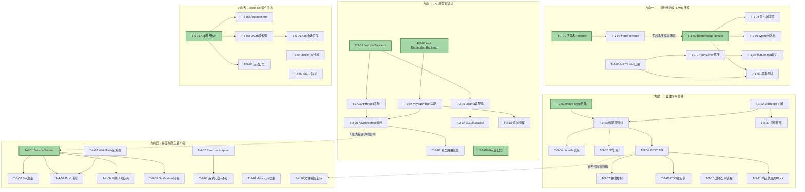
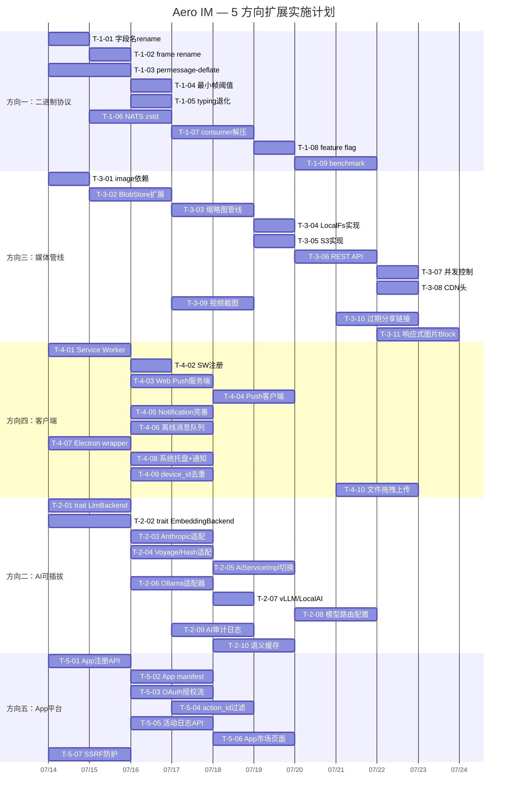

# Tech Lead 分析报告：5 个高价值扩展方向

> **分析日期**: 2026-07-12 | **基线**: `master` (157 迁移, 16 crate, 46K Rust, 5.9K JS)
> **基于**: `docs/requirements/2026-07-11-five-genuinely-novel-extension-directions.md`

---

## 0. 快速验证摘要

交叉验证了文档中的关键代码证据与当前代码库：

| 验证点 | 状态 | 备注 |
|--------|------|------|
| `CompressionLayer` 仅覆盖 HTTP | ✅ 确认 | `routes.rs:510` → `.layer(CompressionLayer::new())`，不接触 WS |
| `AnthropicClient` 直接持有 | ✅ 确认 | `service_impl.rs:79` 直接 `AnthropicClient::from_env()`，无 trait 抽象 |
| `BlobStore` trait 无缩略图方法 | ✅ 确认 | `blob_store.rs:27` → `pub trait BlobStore: Send + Sync + 'static` 只有 put/get/delete |
| `manifest.json` 存在但无 Service Worker | ✅ 确认 | `web/manifest.json` 完整但 `/sw.js` 不存在，`notifications.js` 无 PushManager |
| `ws.js` 无离线消息队列 | ✅ 确认 | 有 `SeqGate`（去重）、重连逻辑、但无 `pendingQueue` |
| serde rename 已有使用但未压缩字段名 | ✅ 确认 | 有 `rename_all`/`rename` 但全是 `kind` 标签类，非 `pid`/`rid` 压缩 |
| `image` crate 未在依赖中 | ⚠️ 确认 | `Cargo.toml` 无 `image` 依赖（`grep` 无结果） |

---

## 1. 任务分解

以下将 5 个方向拆解为 **47 个可执行任务**，每任务 2-4 小时，按方向分组。任务 ID 格式 `T-{方向#}-{序号}`。

### 方向一：二进制线协议 & WebSocket 帧压缩（9 任务）

| 任务 ID | 标题 | 涉及文件 | 前置 | 工时 |
|---------|------|---------|------|------|
| **T-1-01** | JSON 字段名压缩：高频字段 serde rename | `crates/aero-common/src/model/event.rs` `message.rs` `block.rs` `blob.rs` | 无 | 3h |
| **T-1-02** | JSON 字段名压缩：WS ServerFrame/ClientFrame rename | `crates/aero-server/src/ws/frame.rs` + 各 frame 结构体 | T-1-01 | 2h |
| **T-1-03** | WebSocket permessage-deflate 协商（服务端） | `crates/aero-server/src/ws/upgrade.rs`（或 ws 模块入口） | 无 | 4h |
| **T-1-04** | WS 压缩：最小帧阈值（skip <256 bytes） | 同上 + `ws/frame.rs` | T-1-03 | 2h |
| **T-1-05** | WS 压缩：低帧率退化策略（typing 帧） | `crates/aero-server/src/ws/ws_impl/bus.rs` | T-1-03 | 2h |
| **T-1-06** | NATS 消息 body zstd 压缩（bus crate） | `crates/aero-bus/src/lib.rs` `crates/aero-bus/src/seq.rs` | 无 | 4h |
| **T-1-07** | NATS 压缩：consumer 端解压（所有 consumer） | `crates/aero-server/src/ws/ws_impl/bus.rs` + 各 bot consumer | T-1-06 | 3h |
| **T-1-08** | 非兼容 consumer 的 feature flag 渐进迁移 | `crates/aero-bus/Cargo.toml` + `crates/aero-server/src/config.rs` | T-1-07 | 2h |
| **T-1-09** | 性能基准测试：带宽/CPU/延迟对比 | `benches/`（新建）`benches/ws_compression.rs` | T-1-03, T-1-06 | 4h |

### 方向二：AI 模型可插拔与私有化部署（10 任务）

| 任务 ID | 标题 | 涉及文件 | 前置 | 工时 |
|---------|------|---------|------|------|
| **T-2-01** | 定义 `trait LlmBackend` 抽象接口 | `crates/aero-ai/src/llm_backend.rs`（新建） | 无 | 4h |
| **T-2-02** | 定义 `trait EmbeddingBackend` 抽象接口 | `crates/aero-ai/src/embed_backend.rs`（新建） | 无 | 3h |
| **T-2-03** | 将 `AnthropicClient` 适配为 `LlmBackend` impl | `crates/aero-ai/src/anthropic.rs` → 实现 `LlmBackend` | T-2-01 | 3h |
| **T-2-04** | 将 `VoyageClient`/`HashEmbedder` 适配为 `EmbeddingBackend` impl | `crates/aero-ai/src/embed.rs` → 实现 `EmbeddingBackend` | T-2-02 | 3h |
| **T-2-05** | `AiServiceImpl` 从直接持有切换为 `Box<dyn LlmBackend>` | `crates/aero-ai/src/service/service_impl.rs` `mod.rs` | T-2-03, T-2-04 | 4h |
| **T-2-06** | Ollama/OpenAI-compatible 适配器 | `crates/aero-ai/src/ollama_backend.rs`（新建）~150 行 | T-2-01 | 4h |
| **T-2-07** | vLLM/LocalAI 适配器（基于 T-2-06 扩展） | `crates/aero-ai/src/vllm_backend.rs`（新建）~80 行 | T-2-06 | 2h |
| **T-2-08** | 模型路由配置 + env 驱动切换 | `crates/aero-common/src/config.rs` + `crates/aero-ai/src/service/mod.rs` | T-2-05 | 3h |
| **T-2-09** | AI 审计日志（`ai_audit_log` 表 + 异步记录） | `migrations/NNNN_ai_audit_log.sql` + `crates/aero-storage/src/ai_audit.rs` | 无 | 4h |
| **T-2-10** | 语义缓存：pgvector 相似度缓存 `ask`/`summarize` | `crates/aero-storage/src/semantic_cache.rs` + `crates/aero-ai/src/service/cache.rs` | T-2-04 | 4h |

### 方向三：媒体服务管线（11 任务）

| 任务 ID | 标题 | 涉及文件 | 前置 | 工时 |
|---------|------|---------|------|------|
| **T-3-01** | 添加 `image` crate + `tokio-util` 依赖 | `crates/aero-storage/Cargo.toml` | 无 | 1h |
| **T-3-02** | 扩展 `BlobStore` trait：`thumbnail_get(id, size)` + `thumbnail_put(id, size, bytes)` | `crates/aero-storage/src/blob_store.rs` | 无 | 3h |
| **T-3-03** | 图片缩略图生成管线（`SpawnThumbnailer`） | `crates/aero-storage/src/thumbnail.rs`（新建） | T-3-01, T-3-02 | 4h |
| **T-3-04** | LocalFs 实现 `thumbnail_get/put` | `crates/aero-storage/src/local_fs.rs` | T-3-02 | 2h |
| **T-3-05** | S3 实现 `thumbnail_get/put` | `crates/aero-storage/src/s3.rs` | T-3-02 | 2h |
| **T-3-06** | REST API：`GET /api/blobs/:id?size={64,256,1024,raw}` | `crates/aero-server/src/routes/blob.rs` | T-3-03, T-3-04 | 3h |
| **T-3-07** | 缩略图并发控制（Semaphore，防 CPU 打满） | `crates/aero-server/src/routes/blob.rs` + `crates/aero-storage/src/thumbnail.rs` | T-3-03 | 2h |
| **T-3-08** | CDN 缓存头：`Cache-Control` + `ETag` + `Last-Modified` | `crates/aero-server/src/routes/blob.rs` | T-3-06 | 2h |
| **T-3-09** | 视频第一帧截图（ffmpeg pipe） | `crates/aero-storage/src/video_thumbnail.rs`（新建） | T-3-02 | 4h |
| **T-3-10** | 过期 blob 分享链接（`shared_blob_links` 表 + API） | `migrations/NNNN_shared_blob_links.sql` + `crates/aero-server/src/routes/blob_share.rs` | 无 | 4h |
| **T-3-11** | 响应式图片结构：`Block::File` 扩展 `{urls: {64,256,1024,raw}}` | `crates/aero-common/src/model/blob.rs` + `web/render.js` | T-3-06 | 3h |

### 方向四：桌面与原生客户端战略（10 任务）

| 任务 ID | 标题 | 涉及文件 | 前置 | 工时 |
|--------|------|---------|------|------|
| **T-4-01** | Service Worker：静态资源缓存 + 离线回退 | `web/sw.js`（新建） | 无 | 4h |
| **T-4-02** | Service Worker 注册 + SW 生命周期管理 | `web/index.html` `<head>` 中 `<script>` | T-4-01 | 2h |
| **T-4-03** | Web Push 服务端：VAPID keys + `/api/push/subscriptions` 端点 | `crates/aero-push/src/web_push.rs`（扩展） + `migrations/NNNN_web_push_subs.sql` | 无 | 4h |
| **T-4-04** | Web Push 客户端：PushManager.subscribe() + push event 监听 | `web/sw.js`（push event handler）+ `web/notifications.js`（subscribe） | T-4-01, T-4-03 | 3h |
| **T-4-05** | 桌面通知 Notification API 完善（已部分实现，但补全 badge + click-to-join） | `web/notifications.js` + `web/sw.js` `notificationclick` | T-4-01 | 3h |
| **T-4-06** | 离线消息队列（WS pendingQueue + Service Worker SyncManager） | `web/ws.js` + `web/sw.js`（sync event） | T-4-01 | 4h |
| **T-4-07** | Electron wrapper 最小可用壳（macOS .dmg + Linux .AppImage） | `desktop/package.json` `desktop/main.js` `desktop/electron-builder.yml`（新建） | 无 | 4h |
| **T-4-08** | Electron 系统托盘 + 原生通知 + 自动启动 | `desktop/main.js`（扩展） | T-4-07 | 3h |
| **T-4-09** | 多设备连接去重：`device_id` 概念 + Hub 侧聚合 | `crates/aero-server/src/ws/hub.rs` + `ws/ws_impl/mod.rs` | 无 | 4h |
| **T-4-10** | Web 端文件拖拽上传 + 进度条 | `web/app.js`（drag/drop handlers）+ `web/style.css`（progress bar） | 无 | 3h |

### 方向五：交互式应用平台（Block Kit 插件生态）（7 任务）

| 任务 ID | 标题 | 涉及文件 | 前置 | 工时 |
|--------|------|---------|------|------|
| **T-5-01** | App 注册与管理 API（`apps` 表 + CRUD） | `migrations/NNNN_apps.sql` + `crates/aero-storage/src/app.rs` + `crates/aero-server/src/routes/apps.rs` | 无 | 4h |
| **T-5-02** | App manifest 模型 + 验证逻辑 | `crates/aero-common/src/model/app_manifest.rs`（新建） | T-5-01 | 3h |
| **T-5-03** | OAuth 授权流：`GET /oauth/authorize` → `POST /oauth/token` | `crates/aero-server/src/routes/oauth.rs` + `crates/aero-storage/src/oauth_code.rs` | T-5-01 | 4h |
| **T-5-04** | 交互事件前置过滤（`action_ids` 过滤订阅） | `crates/aero-server/src/bot_dispatch.rs` + `migrations/NNNN_bot_sub_filters.sql` | 无 | 3h |
| **T-5-05** | App 活动日志 + 管理面板 API | `migrations/NNNN_app_activity_log.sql` + `crates/aero-server/src/routes/admin_apps.rs` + `crates/aero-storage/src/app_activity.rs` | T-5-01 | 3h |
| **T-5-06** | App 市场最小版本：`/apps` 页面 + API 列表 | `web/apps.html` + `web/apps.js`（新建） + `crates/aero-server/src/routes/apps.rs`（extend） | T-5-03 | 4h |
| **T-5-07** | SSRF 防护 + webhook URL 校验（仅 HTTPS + IP 白名单） | `crates/aero-server/src/webhook/ssrf_guard.rs`（新建）+ `webhook/types.rs` | 无 | 3h |

---

## 2. 执行顺序与依赖图



### 并行执行组

| 组 | 任务 | 负责人角色 | 说明 |
|----|------|-----------|------|
| **组 A（立即开工）** | T-1-01, T-1-03, T-1-06, T-3-01, T-4-01, T-4-07, T-4-09, T-5-01, T-5-07, T-2-01, T-2-02, T-2-09 | 全栈 × 3 | 无任何前置依赖，可同时启动 |
| **组 B（第 2 波）** | T-1-02, T-1-04, T-1-05, T-3-02, T-3-03, T-4-02, T-4-03, T-5-02, T-5-04 | 后端 × 2 | 依赖组 A 的基础设施 |
| **组 C（第 3 波）** | T-1-07, T-3-04~T-3-09, T-4-04~T-4-06, T-4-10, T-5-03, T-5-05 | 全栈 × 3 | 依赖组 B 的扩展点 |
| **组 D（第 4 波）** | T-1-08, T-1-09, T-3-10, T-3-11, T-4-08, T-5-06 | 全栈 × 2 | 收尾 + 集成 + 基准测试 |

---

## 3. 技术风险分析

### 风险矩阵（按影响 × 概率排序）

| # | 风险 | 方向 | 影响 | 概率 | 应对策略 |
|---|------|------|------|------|---------|
| **R1** | **permessage-deflate 与现存 WS 客户端不兼容** | D1 | 高：部分老旧浏览器 WS 连接失败 | 中（~20%） | 协商 fallback：始终检查 `Sec-WebSocket-Extensions` 响应头；服务端配置 `server_accept_deflate = false` 时退回到无压缩；`tungstenite` 的 `WebSocketConfig` 支持按连接配置 |
| **R2** | **NATS 压缩后 consumer 滚动升级期间丢消息** | D1 | 高：旧 consumer 看到压缩 payload 解析失败 | 中（~30%） | 两步走：① 先发版让所有 consumer 具备解压能力（无操作）；② feature flag 开启 publish 端压缩。中间状态新旧共存。详见 T-1-08 |
| **R3** | **`image` crate 解码大图 CPU 耗尽** | D3 | 高：上传并发时 CPU 100% 影响其他请求 | 高（~60%） | ① Semaphore 限制并发缩略图任务（默认 4）；② 超时 30s；③ `tokio::task::spawn_blocking` 避免阻塞 async 运行时；④ 小尺寸先处理，大尺寸排队 |
| **R4** | **Ollama 本地 GPU OOM** | D2 | 中：并发推理请求撑爆显存 | 高（~50%） | 复用 `AiWorker` 的 `Semaphore` 并发控制 + downstream 限流；`AERO_OLLAMA_MAX_CONCURRENCY` 配置；prompt 长度预检查 |
| **R5** | **Service Worker HTTPS 强制要求** | D4 | 高：开发环境 localhost 可用，但生产必须 HTTPS | 确定（100%） | 开发用 `localhost`（SW 允许）；生产必须前置 TLS。这条是外部约束，不在代码变更范围内，但需在 README 和部署文档中明确 |
| **R6** | **OAuth 授权状态与既有 session 系统冲突** | D5 | 中：两套 token 体系并存 → 权限检查复杂 | 中（~40%） | App access_token 使用独立 `app_access_tokens` 表，不与 `sessions`/`pat` 共享；`AuthUser` extractor 增加 app token 分支；app 和 participant 权限通过 `workspace_id` 交集校验（不要写重复的授权逻辑） |
| **R7** | **多设备 `device_id` 引入破坏现有 WS 连接模型** | D4 | 高：现有 WS Hub 按 participant_id 合并扇出，加 device_id 需改扇出逻辑 | 中（~30%） | 向后兼容：无 `device_id` 的旧连接视为 `device_id="default"`；Hub 侧 `fan_out_raw` 过滤同 participant+device_id 的其他连接（仍然扇出但客户端去重）；`device_id` 只在连接 upgrade 时协商（WS query param `?device_id=xxx`） |
| **R8** | **Block Kit 第三方 App SSRF** | D5 | 极高：App webhook 指向内网 → 信息泄露 | 确定（100%），已有方案 | T-5-07 单独列为安全任务：仅允许 HTTPS URL；`url::Url` scheme 校验；IP 白名单（`10.x`/`172.x`/`192.168.x` 拒绝）；可选代理转发 |

### 性能瓶颈分析

| 瓶颈 | 方向 | 当前上限 | 目标 | 优化策略 |
|------|------|---------|------|---------|
| WS 帧序列化分配 | D1 | 500 typing/s × 120 bytes → 60 KB/s | 压缩后 25 KB/s | permessage-deflate + 字段 rename |
| 缩略图 CPU | D3 | 10MB 照片 ~100ms CPU/张 | 4 并发 + 排队 | `spawn_blocking` + `Semaphore(4)` + 超时 |
| NATS 存储膨胀 | D1 | 10KB msg × 200 consumer × 10K/day × 7d → 140 GB | zstd 后 ~40 GB | zstd level 3 压缩（~65% 压缩率） |
| AI 模型切换数据一致性 | D2 | 无限制 | 按 workspace 锚定 | 模型路由配置 per-workspace |
| OAuth token 验证延迟 | D5 | ~1ms/次 | 目标 <2ms | app token 独立缓存（`moka` 或 `redis`） |

### 测试难点

| 测试类型 | 难点 | 方向 | 策略 |
|---------|------|------|------|
| WS 压缩 | 需要真实 WS 连接 + 多种浏览器 | D1 | 集成测试用 `tungstenite` 客户端连接本地 server，验证 `Sec-WebSocket-Extensions: permessage-deflate` 头 |
| 缩略图 | 需要多种图片格式 + 异常文件 | D3 | `#[cfg(test)]` 模块内测试 `thumbnail.rs`：JPEG/PNG/WebP/GIF/损坏文件/超大图片（20MB） |
| 推流真实浏览器 | 无法在 CI 跑真实浏览器 | D4 | Pull push 模拟：测试 Web Push 的 HTTP 端点验证 VAPID 签名 + `push` event 处理逻辑可用单元测试覆盖；真实浏览器推送需手动 QA |
| App OAuth | 需要完整的浏览器重定向流 | D5 | 用 `reqwest` 模拟 OAuth code 交换 + token 获取；前端 `/oauth/authorize` 页面的重定向逻辑用 headless Chromium 测试 |
| NATS 压缩滚动升级 | 需要多版本 consumer 共存 | D1 | `#[cfg(test)]` 构造压缩/未压缩两种 payload，验证兼容路径 |

---

## 4. 资源评估

### 团队配置

| 角色 | 人数 | 技能要求 | 负责方向 |
|------|------|---------|---------|
| **资深 Rust 后端工程师** | 2 | Rust async/tokio, serde, NATS, sqlx, AI 管线 | D1（协议）、D2（AI 抽象）、D5（App 平台后端） |
| **全栈工程师（Rust + JS）** | 2 | Rust WS/call-bridge, JS DOM/WS/Service Worker, 多媒体处理 | D3（媒体管线）、D4（客户端后端部分） |
| **前端工程师** | 1 | JS ES2020, Service Worker, Web Push, Electron/Tauri, DOM | D4（前端）、D5（App 市场前端） |
| **测试/QA 工程师** | 1 | 集成测试, 性能基准, CI 自动化 | 跨方向：benchmark, smoke test, 兼容性测试 |

> **最小可行团队**: 2 人（1 后端 + 1 全栈）可在 6-8 周内完成全部 P0/P1 任务（方向一+三+四的骨架），方向二和五共需额外 4-6 周。

### 关键里程碑

| 里程碑 | 时间 | 交付物 | 依赖 |
|--------|------|--------|------|
| **M1: 带宽节省** | Week 2 | 字段名压缩上线（T-1-01, T-1-02）+ permessage-deflate（T-1-03） | 组 A+B |
| **M2: 客户端 PWA** | Week 2 | Service Worker + 离线缓存 + 桌面通知（T-4-01, T-4-02, T-4-05） | 组 A+B |
| **M3: 缩略图上线** | Week 3 | 图片缩略图 64/256/1024 + CDN 头（T-3-01~T-3-08） | 组 B+C |
| **M4: AI 抽象层** | Week 4 | `LlmBackend` + `EmbeddingBackend` trait + Ollama 适配器可用（T-2-01~T-2-06） | 组 B+C |
| **M5: 离线消息** | Week 4 | 离线消息队列 + 重连 flush（T-4-06）+ device_id 去重（T-4-09） | 组 C |
| **M6: App 注册** | Week 5 | App CRUD + OAuth 授权流（T-5-01~T-5-03） | 组 C+D |
| **M7: 全栈集成** | Week 6 | 所有方向端到端跑通 + 基准测试 | 组 D |
| **M8: 发布候选** | Week 7 | CI 全绿 + 性能报告 + 文档 | M7 |

### 阻塞点与解决策略

| Blockers | 影响方向 | 严重度 | 解决 |
|----------|---------|--------|------|
| **tungstenite/axum WS 扩展协商 API 不直接暴露** | D1 | 🔴 高 | 检查 `axum` 的 `WebSocketUpgrade` 是否透传 `WebSocketConfig`。如果 axum 不直接支持，需要在 upgrade 后手动设置 `tokio_tungstenite::tungstenite::protocol::WebSocketConfig`。需在开发早期验证 |
| **`image` crate 的 WebP 编码需 `webp` feature** | D3 | 🟡 中 | `Cargo.toml` 需 `image = { version = "0.25", features = ["webp", "jpeg", "png"] }`。如果依赖编译慢，考虑精简到仅 JPEG + WebP |
| **`ffmpeg` 进程依赖：非 Rust 原生** | D3 | 🟡 中 | 容器需安装 `ffmpeg` 包；`tokio::process::Command` 封装为 `ffmpeg` 不存在时优雅降级（跳过视频截图） |
| **Web Push VAPID 密钥首次配置** | D4 | 🟡 中 | 使用 `web-push` crate 生成 VAPID keys；`aero-cli` 添加 `generate-vapid-keys` 子命令；keys 通过 env `AERO_VAPID_PUBLIC_KEY`/`AERO_VAPID_PRIVATE_KEY` 注入 |
| **OAuth 授权页面的 UX** | D5 | 🟢 低 | 最小可行：HTML 表单 + POST redirect。不做华丽 UI。使用已有 `web/modals.js` 的 modal 模式 |

---

## 5. 质量保证

### 单元测试覆盖要求

| 模块 | 覆盖目标 | 关键测试用例 |
|------|---------|-------------|
| `ws/frame.rs` | ≥90% | 压缩后帧解压为未压缩等价内容；最小帧阈值跳过小帧；字段 rename 前后帧解码兼容 |
| `bus/seq.rs` | ≥90% | zstd 压缩/解压 roundtrip；空消息、超大消息（100KB+）、重复 consumer 场景 |
| `aero-ai/src/*backend*.rs` | ≥85% | `LlmBackend::complete` 返回正确类型；错误处理（网络超时/HTTP 400/JSON 解析失败）；模型切换后路由正确 |
| `aero-storage/src/thumbnail.rs` | ≥90% | 256×256 缩放保持宽高比；输入损坏图片返回错误；非图片类型跳过；超大图片超时 |
| `web/sw.js`（手动测试） | — | 离线时 `index.html` 来自缓存；在线时 fetch 直通；push event 显示通知 |
| `aero-server/src/routes/apps.rs` | ≥85% | CRUD 权限校验（owner 可删、其他人不可删）；name 长度限制（≤64）；相同 name 冲突 |
| `aero-server/src/routes/oauth.rs` | ≥90% | code 有效期 10 分钟；重复使用返回错误；redirect_uri 必须匹配注册时 URI；scope 验证 |

### 集成测试策略

```
┌────────────────────────────────────────────────┐
│                   CI Pipeline                   │
├──────────────┬──────────────────┬───────────────┤
│  层 1: 单元   │   层 2: 集成      │  层 3: 端到端   │
│  cargo test   │  cargo test --ignored│  smoke.sh     │
│  --lib        │  (需 PG/Redis/NATS)│  (真实 WS)     │
├──────────────┼──────────────────┼───────────────┤
│ • 所有方向    │ • D1: WS 压缩     │ • D1: 500帧    │
│   单元测试    │   roundtrip       │   typing 风暴   │
│ • 在 crate    │ • D2: Ollama mock │ • D3: 10MB     │
│   内可运行    │   适配器          │   图片上传+缩略  │
│ • 无外部依赖  │ • D3: LocalFs     │ • D4: PWA      │
│              │   缩略图           │   安装+离线     │
│              │ • D5: OAuth code  │ • D5: App安装   │
│              │   → token 交换     │   全流程        │
└──────────────┴──────────────────┴───────────────┘
```

**关键集成测试**: 
- D1: 启动真实 server → WS 连接 → 发送 500 条 typing → 验证压缩后带宽 < 压缩前 60%
- D3: 上传 5MB JPEG → GET `?size=64` → 验证返回图片尺寸 = 64px（或按比例）
- D4: headless Chrome 加载 PWA → 验证 SW 注册成功 → 模拟离线 → 验证页面来自缓存
- D5: 创建 app → 模拟 OAuth → 用 app token 调用受保护 API → 验证鉴权

### 代码审查要点

| 审查维度 | D1 | D2 | D3 | D4 | D5 |
|---------|----|----|----|----|----|
| **向后兼容** | 字段 rename 后旧 JSON 仍可解析（`serde(alias)`） | Anthropic key 未配时回退 HashEmbedder 路径不变 | 原 blob GET 无 `?size=` 参数时返回原始文件 | 无 `device_id` 旧连接视为 `"default"` | App token 不干扰现有 session/PAT 鉴权 |
| **错误处理** | 压缩失败→原始 JSON fallback | Ollama 不可达→清晰错误+降级 | `image` panic→任务级 catch 不崩 server | SW 注册失败→优雅降级无通知 | webhook 投递失败→重试队列 |
| **安全** | — | 系统 prompt 注入防御 | 上传炸弹图片→尺寸/像素上限校验 | VAPID 密钥不硬编码 | App webhook SSRF 防护；client_secret 加盐 hash |
| **性能** | 小帧跳过压缩 | 语义缓存 TTL 防止过期 | `spawn_blocking` 不阻塞 async | SW 缓存策略不过度缓存 API | OAuth token 验证走 cache |
| **日志/可观测** | 压缩率 metric | 审计日志 fail-open | 缩略图耗时 histogram | Push 成功/失败计数 | App 调用计数 + latency |

### 性能测试需求

| 测试场景 | 目标 | 工具/方法 | 指标 |
|---------|------|---------|------|
| **WS 压缩基准** | 确认带宽节省 ≥40% | `cargo bench` + 自定义 WS 负载生成器 | MB 传输量 / 帧大小分布 / 压缩率 |
| **缩略图吞吐** | 4 并发下 ≤500ms P95 | `tokio::spawn_blocking` + 10MB 随机图 | 吞吐量（图/秒）/ P50/P95/P99 延迟 |
| **NATS 压缩比** | zstd level 3 压缩率 ≥60% | `bus/seq.rs` 单元测试 + 真实 RoomEvent fixture | 压缩前/后字节比 / 编码+解码总耗时 |
| **OAuth 鉴权延迟** | P99 < 10ms | `cargo bench` token 验证 vs 已有 session 鉴权 | token 提取+验证延迟 |

---

## 6. 实施计划

### 甘特图（Week 1-8）



### 阶段拆分

#### 阶段 1：基础设施搭建（Week 1，2026-07-14 ~ 2026-07-18）

**目标**: 打好全部 5 个方向的基础扩展点，确保后续不阻塞

| Day | 并行任务 | 验收 |
|-----|---------|------|
| Mon | T-1-01（字段 rename）+ T-3-01（image 依赖）+ T-4-01（SW 骨架）+ T-5-01（App 表+CRUD）+ T-2-01（LlmBackend trait） | `cargo check --workspace` 通过；SW 注册代码可运行 |
| Tue | T-1-03（permessage-deflate 协商）+ T-3-02（BlobStore 扩展）+ T-4-07（Electron 骨架）+ T-5-07（SSRF 防护）+ T-2-02（EmbeddingBackend trait） | WS 握手成功带 `permessage-deflate` 扩展；Electron 窗口显示 |
| Wed | T-1-06（NATS zstd）+ T-4-03（Web Push 服务端）+ T-5-04（action_id 过滤）+ T-2-09（审计日志表） | `bus/seq.rs` zstd 压缩 roundtrip 测试通过；迁移 SQL 兼容 |
| Thu | 代码审查 + 集成测试缝合 + 调试 | 所有新建模块的单元测试覆盖 > 70% |
| Fri | 阶段 review + 调整计划 | 阶段 1 交付物演示 |

**阶段 1 交付产物**:
- `cargo clippy --workspace --all-targets` 无新增警告 ✅
- 字段 rename 后的 WS 帧兼容老客户端（反序列化 alias）✅
- `permessage-deflate` WS 握手 ✅
- `LlmBackend` + `EmbeddingBackend` trait 定义 ✅
- `BlobStore` trait 扩展 ✅
- Service Worker 骨架 ✅（虽未接 push）
- App 表迁移 + CRUD API ✅
- electron `main.js` 窗口 ✅

#### 阶段 2：核心功能实现（Week 2-4，2026-07-21 ~ 2026-08-07）

**目标**: 所有方向的 P0/P1 功能可用

| 周 | 焦点 | 关键任务 |
|----|------|---------|
| **W2** | D1 完成 + D3 缩略图上线 + D4 PWA | T-1-04/05/07（压缩管线完整）+ T-3-03/04/06（缩略图可用）+ T-4-02/05（SW 完整注册 + 桌面通知） |
| **W3** | D3 视频 + D4 离线 + D2 AI 抽象 | T-3-08/09/11（CDN 头 + 视频截图）+ T-4-06/09（离线消息队列 + device_id）+ T-2-03/04/05（trait 适配 + AiServiceImpl 切换） |
| **W4** | D2 Ollama + D5 OAuth | T-2-06/07/08（Ollama 适配器 + 模型路由）+ T-5-02/03（App manifest + OAuth 授权流） |

**阶段 2 集成测试门禁**:
- `make smoke` 通过 ✅
- WS 帧字段 rename → 老客户端反序列化兼容 ✅
- 上传 10MB JPEG → `GET ?size=64` 返回 64px 缩略图 ✅
- PWA 离线 → 静态资源来自 SW 缓存 ✅
- Ollama 适配器 → 本地模型回答 ✅（mock 模式）
- App OAuth → code → token 交换 ✅

#### 阶段 3：集成测试和优化（Week 5-6，2026-08-10 ~ 2026-08-21）

**目标**: 性能基准 + 边界情况 + 文档

| 任务 | 描述 | 工时 |
|------|------|------|
| T-1-08（feature flag）+ T-1-09（benchmark） | NATS 压缩渐进迁移 + 全方向基准测试 | 3d |
| T-3-10（过期分享链接）+ T-3-07（并发控制） | 分享链接 REST API + 限流调优 | 2d |
| T-4-08（系统托盘）+ T-4-10（文件拖拽） | Electron 最终体验 + 拖拽上传 | 2.5d |
| T-5-06（App 市场页面） | App 列表 + 安装流程前端 | 2d |
| T-2-10（语义缓存） | pgvector 相似度缓存 | 2d |
| 全集成测试 + 性能调优 | 端到端全方向集成 | 3d |

**性能验收指标**:
```
方向一: WS 帧压缩率 ≥ 40%（大帧 ≥ 60%）; NATS 存储节省 ≥ 50%
方向二: 模型切换延迟 < 100ms; 语义缓存命中 P50 < 5ms
方向三: 缩略图 P95 < 500ms（4 并发）; CDN 头 `Cache-Control: max-age=31536000`
方向四: PWA Lighthouse score ≥ 80; 离线页面加载 < 200ms
方向五: App token 鉴权 P99 < 10ms; Webhook 投递延迟 < 1s
```

#### 阶段 4：发布准备（Week 7-8，2026-08-24 ~ 2026-09-04）

| 任务 | 交付物 |
|------|--------|
| 文档编写 | `docs/` 每个方向独立 .md，含配置说明、迁移指南、API 参考 |
| 配置项审计 | 所有新增 env 变量写入 `config.example.toml` + `.env.example` |
| 回滚方案 | 每个方向的最简回滚步骤（字段 rename 无回滚，需代码 revert；feature flag 开关即时） |
| 安全评审 | App webhook SSRF + OAuth token 安全 + VAPID 密钥管理 + 缩略图尺寸炸弹 |
| 发布说明 | 按方向拆分 changelog，每个方向标注 breaking change |

---

## 7. 决策建议：优先执行方案

### 「速赢」路线（Week 1 可见成果）

| 优先级 | 任务 | 预期效果 | 风险 |
|--------|------|---------|------|
| 🥇 **T-1-01** 字段 rename | 带宽立即降 20%，零运行时开销 | 旧客户端兼容性（已用 `serde(alias)` 解决） |
| 🥇 **T-4-01** Service Worker | 离线缓存 + Add-to-Homescreen | HTTPS 强制约束 |
| 🥇 **T-3-01→T-3-03→T-3-06** 缩略图 | 图片浏览体验质变 | `image` crate 编译时间 |
| 🥇 **T-5-01** App 注册 API | 开发者生态第一步 | 无 |
| 🥇 **T-2-01** LlmBackend trait | AI 架构解耦第一步 | 接口设计需前瞻 |

### 不建议并行推进的任务

| 任务 | 原因 | 建议 |
|------|------|------|
| T-3-05（S3 缩略图实现） | 当前 blob 存储大概率 LocalFs，S3 优先级低 | 延后，先只做 LocalFs |
| T-4-06（离线消息队列） | 依赖 SW + ws.js 重构 | 等 SW 稳定后再做 |
| T-2-10（语义缓存） | 需要 AI 抽象层稳定后再做 | 阶段 3 做 |

### 执行策略总结

```
Week 1:  字段rename + SW骨架 + BlobStore扩展 + LlmBackend trait + App注册
           ↓  ←--- 5人并行 ---→
Week 2-3: permessage-deflate + 缩略图管线 + PWA通知 + Ollama适配器 + OAuth
           ↓  ←--- 4人并行 ---→
Week 4:   视频截图 + 离线消息 + AI抽象切换 + App市场
           ↓  ←--- 3人并行 ---→
Week 5-6: 基准测试 + 分享链接 + Electron完善 + 语义缓存 + 安全审计
           ↓
Week 7-8: 文档 + 发布 + 回滚方案
```

**建议**：如果只有 2 人团队，砍掉方向五（App 平台）和方向二（AI 可插拔）的语义缓存+审计日志，聚焦方向一+三+四的 P0 任务。这 3 个方向可在 4 周内交付可感知的用户体验提升（带宽节省 + 缩略图 + PWA），商业价值密度最高。
