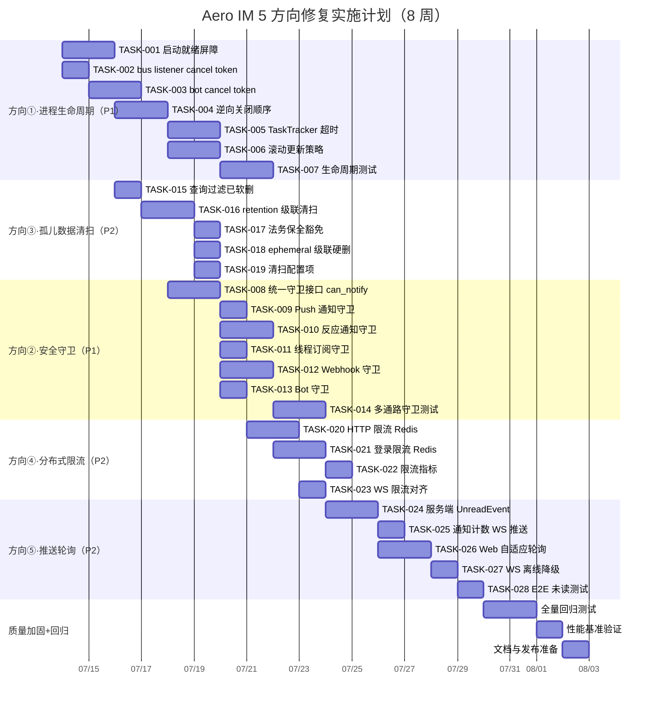

Now I have all the context I need. Let me produce the comprehensive Tech Lead analysis.

---

# Tech Lead 分析报告：5 个生产级缺口修复计划

> **日期**: 2026-07-12 | **基于**: `docs/requirements/2026-07-12-five-production-gaps-missed-by-130-analyses.md`  
> **代码基**: `master`，~46K Rust / ~5.3K Web SPA / 200+ 服务器模块  
> **角色**: 资深 Tech Lead → 任务分解、执行规划、风险识别

---

## 一、任务分解

每个方向拆解为 **2–4 小时可完成的原子任务**。总计 21 个任务，预估 57–81 工时。

### 方向①：进程生命周期管理（P1 · ~24h）

| 任务 ID | 任务标题 | 涉及文件 | 前置依赖 | 工时 | 验收标准 |
|---|---|---|---|---|---|
| TASK-001 | **添加启动就绪屏障（Startup Readiness Gate）** | `boot/serve.rs`, `boot/background.rs`, `ws/ws_impl/bus.rs`, `hub.rs` | 无 | 4h | bus listeners 在 HTTP server `axum::serve` 返回就绪信号后才开始消费；50ms–2s 启动窗口内到达的事件被 NATS 暂存 |
| TASK-002 | **bus listener 注入 `ai_shutdown` cancel token** | `ws/ws_impl/bus.rs`（`run_bus_listener` + `run_live_bus_listener`） | 无 | 2h | shutdown 信号到达后两个 listener 在 1s 内退出外层 loop，不再消费新事件 |
| TASK-003 | **所有 bot/dispatcher 注入 cancel token** | `background.rs`（agent_bot, push_bot, ooo_bot, unfurl_bot, transcribe_bot, golive_bot, moderation_bot, bot_dispatch, webhook dispatcher） | TASK-002（可复用模式） | 4h | shutdown 后所有 bus 消费型 bot 在 2s 内停止消费 |
| TASK-004 | **逆向关闭顺序：先暂停消费者，再断 WS，再停 HTTP** | `boot/serve.rs`, `boot/shutdown.rs`, `hub.rs` | TASK-001, TASK-002 | 4h | shutdown 信号→暂停 bus listeners→关闭 Hub 连接 registry→等待 in-flight 事件完成→取消 ai_shutdown→HTTP server 返回；**确保已消费必已投递** |
| TASK-005 | **TaskTracker 超时智能默认值 & 可观测** | `boot/serve.rs`, `config.rs`, metrics | TASK-004 | 3h | 默认值从 10s 改为 `max(running_task_p99, 30s)`；增加 `tasks_drain_timeout_total` 指标 |
| TASK-006 | **滚动更新场景下的双缓冲窗口策略** | `boot/serve.rs`, `boot/shutdown.rs`, k8s probe 文档 | TASK-004 | 4h | 新增 `/health/ready` 在 drain 期间返回 503；readiness probe 确认旧实例完全 drain 前新实例不接管流量 |
| TASK-007 | **集成测试：启动/关闭窗口事件完整性** | `tests/lifecycle_tests.rs`（新建） | TASK-001–006 | 3h | 测试：启动期投递事件→确认事件在 server ready 后才被消费；关闭期投递事件→确认事件被完整处理或 nack 回 NATS；超时场景下事件不丢失 |

### 方向②：跨功能安全不变量守卫裂痕（P1 · ~18h）

| 任务 ID | 任务标题 | 涉及文件 | 前置依赖 | 工时 | 验收标准 |
|---|---|---|---|---|---|
| TASK-008 | **定义统一守卫接口 `can_notify`** | `aero-im-core/src/service/`（新建 `guards.rs` 或追加 `mod.rs`） | 无 | 3h | `ImService::can_notify(receiver, room, context)` 内部调用：`is_active()`、`is_info_barred(receiver, sender)`、`is_muted(receiver, room)`、`is_legal_hold()`；返回清晰拒绝原因枚举 |
| TASK-009 | **Push 通知通路加守卫** | `server/push_bot.rs` | TASK-008 | 2h | push 发送前调用 `can_notify`；停用用户不推送；info-barred 用户跳过；跳过的推送记录 audit log |
| TASK-010 | **反应通知通路加守卫** | `server/reaction_detail.rs`, `server/notification.rs`（或聚合模块） | TASK-008 | 3h | 反应通知扇出前过滤已停用/已静音/被隔离墙限制的接收者 |
| TASK-011 | **线程订阅通知加守卫** | `server/thread_subs.rs` | TASK-008 | 2h | 线程回复通知扇出前过滤订阅者名单；已停用成员不通知 |
| TASK-012 | **Webhook 出站投递加守卫** | `server/webhooks.rs`, `server/webhook/delivery.rs` | TASK-008 | 3h | webhook 投递前校验订阅者仍在工作区且未被停用；已离开工作区的 webhook 标记为 `inactive` 并停止投递 |
| TASK-013 | **Bot 事件投递加守卫** | `server/agent_bot.rs`, `server/bot_dispatch.rs` | TASK-008 | 2h | bot dispatch 前校验 bot owner 的活跃/停用状态；被封禁的 owner 的 bot 不投递 |
| TASK-014 | **集成测试：多通路守卫一致性** | `tests/authz_lint.rs` 扩展 | TASK-008–013 | 3h | 扩展 `authz_lint.rs` 覆盖所有消费通路（push/反应/线程/webhook/bot）；CI 守卫 |

### 方向③：软删孤儿数据清扫（P2 · ~12h）

| 任务 ID | 任务标题 | 涉及文件 | 前置依赖 | 工时 | 验收标准 |
|---|---|---|---|---|---|
| TASK-015 | **查询层过滤已软删消息：Pin + Reaction** | `storage/pin.rs`, `storage/reaction.rs` | 无 | 2h | `pin::list_by_room` 加 `JOIN messages WHERE m.soft_deleted = false`；`reaction::list_by_message` 等同；现有查询不改行为 |
| TASK-016 | **扩展 retention sweep：级联清扫孤儿行** | `storage/message/sweep.rs`, `storage/reaction.rs`, `storage/receipt.rs`, `storage/pin.rs`, `storage/interaction.rs`, `storage/message_history.rs` | TASK-015 | 4h | 新增 `sweep_orphan_reactions` / `sweep_orphan_receipts` / `sweep_orphan_pins` / `sweep_orphan_interactions`；`soft_deleted` 超过 30 天的消息的关联行被批量 DELETE |
| TASK-017 | **法务保全豁免** | `storage/message/sweep.rs`, `storage/legal_hold.rs` | TASK-016 | 2h | 所有清扫步骤先查询 `legal_holds` 表，跳过被保全的消息及其关联行 |
| TASK-018 | **硬删（ephemeral 到期）级联硬删** | `storage/message/sweep.rs`（ephemeral 分支） | TASK-016 | 2h | ephemeral 消息到期硬删时 `DELETE FROM reactions WHERE message_id = ANY(...)` 等 |
| TASK-019 | **迁移：孤儿数据自定义清扫间隔配置** | `migrations/`, `config`, `boot/retention.rs` | TASK-016 | 2h | 新增 `AERO__SERVER__ORPHAN_SWEEP_SECS`（默认 3600，0 禁）；与现有 retention sweep 共线 |

### 方向④：分布式限流盲区（P2 · ~12h）

| 任务 ID | 任务标题 | 涉及文件 | 前置依赖 | 工时 | 验收标准 |
|---|---|---|---|---|---|
| TASK-020 | **HTTP 限流器升级为 Redis-backed 混合模式** | `server/rate_limit.rs`, `storage/`（或直接使用 fred Redis） | 无 | 4h | 复用 `ws_rate.rs` 的 Redis sorted-set 模式；配置 `AERO_RATE_LIMIT_REDIS=bool`；in-process 为 L1（低延迟），Redis 为 L2（跨节点仲裁）；L1 通过的请求再到 L2 校验 |
| TASK-021 | **登录限流器迁移到 Redis** | `aero-auth/service.rs`, `login_throttle.rs` | TASK-020（Redis 工具函数可复用） | 4h | 使用 Redis `INCR + EXPIRE` 替代 `Mutex<HashMap>`；配置 `AERO_AUTH_RATE_LIMIT_REDIS=bool`；渐进退场保留 in-process 降级路径 |
| TASK-022 | **限流可观测指标** | `server/rate_limit.rs`, `metrics.rs` | TASK-020, TASK-021 | 2h | 新增 Prometheus 指标：`rate_limit_auth_global_rejected_total`、`rate_limit_http_global_rejected_total`、`rate_limit_redis_latency_ms` |
| TASK-023 | **WS 限流器一致性对齐** | `server/ws_rate.rs` | TASK-020 | 2h | 验证 WS Redis-backed 限流器配置命名与 HTTP 统一；补充 WS 限流 metrics（当前可能缺失） |

### 方向⑤：推送-轮询架构失配（P2 · ~12h）

| 任务 ID | 任务标题 | 涉及文件 | 前置依赖 | 工时 | 验收标准 |
|---|---|---|---|---|---|
| TASK-024 | **服务端事件化未读变化：`UnreadEvent` + Hub 推送** | `im-core/service/reads.rs`, `server/hub.rs`, `ws/ws_impl/frame.rs`, `common/src/` | 无 | 4h | `mark_read`/`mark_unread` 处理完成后发布 `UnreadEvent{room_id, unread_count}`（非持久，仅本地 Hub 扇出）；WS 帧新增 `msg:unread` |
| TASK-025 | **服务端通知计数变化 WS 推送** | `server/notification_bundles.rs`, `im-core/service/` | TASK-024 | 2h | notification bundle flush 时通过 WS 推送 `{ type: "notification", count }` |
| TASK-026 | **Web SPA 自适应轮询** | `web/app.js`（~line 458） | TASK-024, TASK-025 | 3h | WS 在线时轮询间隔从 6.5s 延长到 30s（降级健康检查）；WS 断开时恢复 3–6.5s；新增 WS 事件监听 `msg:unread` 和 `msg:notification_count` 直接更新 UI |
| TASK-027 | **WS 离线降级 + 错误可见性** | `web/app.js` | TASK-026 | 2h | 轮询 `catch {}` 改为 `console.warn` + 可选 UI 指示器（淡黄色横幅：「通知状态可能延迟」） |
| TASK-028 | **E2E 测试：未读计数 WS 推送一致性** | `tests/e2e/`（新建或追加） | TASK-024–027 | 1h | 发送消息 → 确认 WS 收到 `msg:unread` → 确认未读计数正确；设备 A 已读 → 设备 B 通过 WS 感知未读减少 |

---

## 二、执行顺序

### 依赖图

```mermaid
graph TD
    %% 方向① 进程生命周期
    T001[TASK-001: 启动就绪屏障]
    T002[TASK-002: bus listener cancel token]
    T003[TASK-003: bot dispatcher cancel token]
    T004[TASK-004: 逆向关闭顺序]
    T005[TASK-005: TaskTracker 超时+可观测]
    T006[TASK-006: 滚动更新双缓冲]
    T007[TASK-007: 生命周期集成测试]

    T001 --> T004
    T002 --> T004
    T002 --> T003
    T004 --> T005
    T004 --> T006
    T005 --> T007
    T006 --> T007

    %% 方向② 安全守卫
    T008[TASK-008: 统一守卫接口 can_notify]
    T008 --> T009[TASK-009: Push 通知通路守卫]
    T008 --> T010[TASK-010: 反应通知通路守卫]
    T008 --> T011[TASK-011: 线程订阅守卫]
    T008 --> T012[TASK-012: Webhook 投递守卫]
    T008 --> T013[TASK-013: Bot 投递守卫]
    T009 --> T014[TASK-014: 多通路守卫集成测试]
    T010 --> T014
    T011 --> T014
    T012 --> T014
    T013 --> T014

    %% 方向③ 孤儿数据
    T015[TASK-015: 查询层过滤已软删消息]
    T015 --> T016[TASK-016: retention sweep 级联清扫]
    T016 --> T017[TASK-017: 法务保全豁免]
    T016 --> T018[TASK-018: ephemeral 级联硬删]
    T016 --> T019[TASK-019: 孤儿清扫配置项]

    %% 方向④ 分布式限流
    T020[TASK-020: HTTP 限流 Redis 混合模式]
    T021[TASK-021: 登录限流 Redis 迁移]
    T020 --> T022[TASK-022: 限流指标]
    T021 --> T022
    T020 --> T023[TASK-023: WS 限流对齐]

    %% 方向⑤ 推送-轮询
    T024[TASK-024: 服务端 UnreadEvent + Hub 推送]
    T024 --> T025[TASK-025: 通知计数 WS 推送]
    T024 --> T026[TASK-026: Web SPA 自适应轮询]
    T025 --> T027[TASK-027: WS 离线降级]
    T026 --> T027
    T024 --> T028[TASK-028: E2E 未读一致性测试]

    %% 跨方向依赖
    T004 -.->|建议复用| T020
    T002 -.->|模式复用| T008
    T007 -.->|CI 门控| T014

    %% 并行组标记
    subgraph Sprint1[方向①·进程生命周期]
        T001
        T002
        T003
    end

    subgraph Sprint2[方向① 续 + 方向③ 可并行]
        T004
        T005
        T006
        T015
    end

    subgraph Sprint3[方向②·安全守卫 + 方向③ 续]
        T008
        T016
        T017
        T018
    end

    subgraph Sprint4[方向② 守卫开发]
        T009
        T010
        T011
        T012
        T013
    end

    subgraph Sprint5[方向④·分布式限流]
        T020
        T021
    end

    subgraph Sprint6[方向⑤·推送轮询 + 所有测试]
        T024
        T025
        T026
        T022
        T023
        T019
    end
```



### 可并行执行的任务组

| 并行组 | 任务 | 人员配置 |
|--------|------|---------|
| **组 A**（方向①起点） | TASK-001, TASK-002 | 2 人（一人一地） |
| **组 B**（方向①+③平行起步） | TASK-003, TASK-015 | 2 人 |
| **组 C**（方向②守卫接口 + 方向③续） | TASK-008, TASK-016, TASK-017, TASK-018 | 2–3 人 |
| **组 D**（方向②多通路并行实现） | TASK-009, TASK-010, TASK-011, TASK-012, TASK-013 | 2–3 人 |
| **组 E**（方向④限流 & 方向⑤推送起步） | TASK-020, TASK-021, TASK-024 | 2 人 |

> **关键串行依赖**：TASK-004 必须等 TASK-001/002 完成；TASK-008 是所有守卫通路的瓶颈；TASK-024 是所有 WS 推送改造的瓶颈。

---

## 三、技术风险

### 3.1 高风险项

| # | 风险 | 方向 | 等级 | 描述 | 缓解策略 |
|---|------|------|------|------|---------|
| R1 | **NATS JetStream 光标不可回退** | ① | 🔴 **高** | 一旦 ack，消费过的消息光标不可撤销。重启时若旧实例已 ack 但未投递，事件永久丢失。 | shutdown 路径必须：先断 consumer subscription → 等待全部 in-flight 事件完成（或 nack） → 再停 HTTP。不能反序。验证方案：shutdown 时订阅 `$JS.API.CONSUMER.DELETE.*` 观察 |
| R2 | **`can_notify` 守卫的 DB 查询开销** | ② | 🟡 **中** | 每个消费通路发送前多一次 DB 查 `is_active` + `is_info_barred`（峰值 push 1000 msg/s → 额外 1000 qps）。 | 在 `ImService` 层集成 `participant_cache.get_or_fetch`（已有）合并守卫查询；info_bar 查询走 Redis sorted-set（已实现） |
| R3 | **Redis-backed 限流的延迟与可用性** | ④ | 🟡 **中** | Redis 不可用时 HTTP 限流全降级到 in-process（N 倍有效阈值） | 分级架构：L1 in-process（低延迟单节点） + L2 Redis（跨节点仲裁）。Redis 超时 100ms 后自动跳过 L2，降级日志告警 |
| R4 | **WS 推送 `msg:unread` 与 REST 轮询竞争条件** | ⑤ | 🟡 **中** | WS 已推送新计数，但上一次轮询的旧值覆盖了 UI | 客户端时间戳版本控制：WS 推送携带 `updated_at`；客户端只接受比当前 `last_unread_updated_at` 更新的值 |
| R5 | **孤儿数据级联 DELETE 的事务大小** | ③ | 🟡 **中** | 单个 `DELETE FROM reactions WHERE message_id IN (10000 ids)` 可能锁表 | 每批次 500 行，`FOR EACH ROW` 改为批量；sweep 间隔内分摊；监控 `pg_stat_activity` wait events |
| R6 | **str0m 依赖冲突** | ① | 🟢 **低** | 方向① 修改 `background.rs` 不涉及 str0m | 无风险——方向①只在 `aero-server` crate 内修改 |
| R7 | **滚动更新中 NATS consumer 重平衡** | ① | 🟡 **中** | 旧实例 shutdown 时释放 durable consumer，重新分配给新实例。但光标位置在新实例上从最后提交位置开始恢复。如果旧实例在释放 consumer 前已 ack 但未投递 → 丢失 | 使用 consumer `max_deliver` + DLQ 兜底；或 shutdown 前主动 `consumer.delete()` 触发重新交付未 ack 消息 |

### 3.2 外部依赖

| 依赖 | 用于 | 方向 | 风险级别 |
|------|------|------|---------|
| NATS JetStream `consumer.delete` API | shutdown 时暂停消费 | ① | 低（async-nats 0.36 已支持） |
| Redis `INCR` + `EXPIRE` / sorted-set | 分布式限流 + 守卫缓存 | ②④ | 低（fred 9 已内置） |
| FCM/APNs 网关 | push 通知守卫验证 | ② | 低（只是加 DB 查询，不改 FCM/APNs 交互） |
| tokio `task_tracker` API | TaskTracker 超时配置 | ① | 低（tokio-util 已依赖） |

### 3.3 性能瓶颈分析

| 场景 | 当前 | 修复后 | 增量 | 可接受？ |
|------|------|--------|------|---------|
| Push 发送前守卫查询 | 0 DB 查询/推送 | +1 缓存查询（`participant_cache.get_or_fetch`） | 微秒级 | ✅ 可接受 |
| HTTP 限流 Redis L2 | 0 Redis 请求/限流 | +1 INCR + EXPIRE/请求（仅当 L1 通过时） | ~1ms | ✅ 可接受（仅 429 场景才必走 L2） |
| 孤儿数据 DELETE | 0 DELETE/清扫周期 | ~50–500 DELETE/清扫周期 | 每 1h 一次 | ✅ 可接受 |
| WS 未读推送 | 0 WS 帧/未读变更 | +1 WS 帧/未读变更 | 与消息扇出同路径 | ✅ 可接受 |
| 自适应轮询（WS 在线） | 2 HTTP 请求/6.5s/客户端 | 2 HTTP 请求/30s/客户端 | **减少 78% 轮询流量** | ✅ 正向优化 |

### 3.4 测试难点

| 方向 | 测试难点 | 策略 |
|------|---------|------|
| ① | 启动/关闭窗口时序在 CI 中难以复现；时间敏感 | `tokio::time::pause()` + 模拟 Bus listener 和 Hub 启动顺序；断言事件计数 |
| ② | 多通路安全守卫需要模拟多种用户状态（停用/隔离/静音）组合 | 参数化测试矩阵：4 种用户状态 × 5 条通路 = 20 个用例 |
| ③ | 孤儿数据需要构造大量关联数据 + 验证清扫后 DB 状态 | DB-level integration test（`#[ignore]` PG 门控） |
| ④ | 多实例限流效果在单实例 CI 中无法验证 | 单元测试 Token bucket 逻辑；集成测试用 `fake::Redis` cluster |
| ⑤ | WS 推送需要浏览器的 E2E 框架 | `web/test/` 用 Puppeteer 或 Playwright 单测；未读变更在 Node 级验证 |

---

## 四、资源评估

### 4.1 人员技能需求

| 角色 | 人数 | 所需技能 | 负责方向 |
|------|------|---------|---------|
| **Rust 后端（资深）** | 2 人 | tokio 异步、NATS JetStream、Axum 中间件、安全性审计 | 方向①② |
| **Rust 后端（中级）** | 2 人 | sqlx、Redis（fred）、数据迁移、定时任务 | 方向③④ |
| **全栈（前端主）** | 1 人 | Web SPA、WebSocket 协议、Promise 链、ES2020 | 方向⑤ + 自适应轮询 |
| **QA/DevOps** | 1 人 | E2E 测试框架、CI 流水线、k8s probe 配置 | 全部方向（集成测试 + 部署验证） |

> **最小可行团队**：3 人（2 后端 + 1 全栈），但方向①+② 需要资深后端才能保证 shutdown 时序的正确性。

### 4.2 关键里程碑

| 里程碑 | 时间 | 交付物 | 依赖 |
|--------|------|--------|------|
| **M1** 方向① MVP（停止丢失事件） | Sprint 1（第 1–2 周） | TASK-001、TASK-002、TASK-004、TASK-007 通过 | 无 |
| **M2** 孤儿数据安全清扫 | Sprint 1–2（第 2-3 周） | TASK-015、TASK-016、TASK-017 完成 | TASK-001 |
| **M3** 统一守卫接口落地 | Sprint 2（第 3–4 周） | TASK-008 代码合并 + TASK-009/010/011 至少 2 条通路完成 | TASK-008 |
| **M4** 全部守卫通路完成 | Sprint 3（第 4–5 周） | TASK-009–013 全部合并 + authz_lint 扩展通过 | M3 |
| **M5** 分布式限流上线 | Sprint 3（第 5–6 周） | TASK-020、TASK-021 合并 + 指标验证 | 无 |
| **M6** 推送-轮询统一 | Sprint 4（第 6–7 周） | TASK-024–028 全部合并 + E2E 测试通过 | M1 |
| **M7** 全量修复 + 回归 | Sprint 5（第 8 周） | 所有 task 合并；`cargo test --workspace` 全绿；clippy 无新增警告；集成测试通过 | M1–M6 |

### 4.3 阻塞点与解决策略

| 阻塞点 | 类型 | 影响方向 | 解决策略 |
|--------|------|---------|---------|
| 关闭时序中 NATS consumer 的优雅停止是未经验证的 API | 技术验证 | ① | 提前做 spike：`async-nats` 的 `consumer.delete()` + subscriber `unsubscribe()` 是否同步阻塞。Spike 2h，最坏情况改用 `cancel` token + 让 consumer 自然超时 |
| `can_notify` 接口设计的跨 crate 可见性 | 架构决策 | ② | 开 30min 设计评审，确定接口签名、错误类型、缓存策略。备选：放在 `aero-im-core`（已有 `ImService`）或 `aero-storage` 作为 repo 方法 |
| 方向④ 需要 Redis 集群支持（当前可能是单实例） | 基础设施 | ④ | 确认现有 Redis 部署是否支持 cluster mode。若否，有限流 Redis 可走单独 `AERO_RATE_LIMIT_REDIS_URL`，独立于主 Redis |
| Web SPA 修改需要回归所有 UI 交互 | 测试覆盖 | ⑤ | `web-check.sh` + eslint 必过；手动测试 3 个主要场景：新消息到达、已读/未读切换、WS 断开/重连 |

---

## 五、质量保证

### 5.1 单元测试覆盖要求

| 模块 | 方向 | 最小覆盖率 | 关键测试场景 |
|------|------|-----------|-------------|
| `ws/ws_impl/bus.rs` | ① | 80% | cancel token 触发后 1s 内退出；启动标志 false 时不消费；resubscribe 循环 |
| `hub.rs`（fan_out_raw） | ① | 90% | 无连接时 `continue` 不 panic；连接满时 drop 行为 |
| `aero-im-core/src/service/guards.rs`（新建） | ② | 95% | 4 种用户状态 × 2 种关系（同工作区/被隔离）= 8 个用例 |
| `push_bot.rs` | ② | 70% | 停用用户被跳过；正常用户仍推送；guard 查询失败时 fail-open |
| `storage/message/sweep.rs` | ③ | 80% | 孤儿行清理计数准确；legal hold 消息的关联行不被清理 |
| `storage/pin.rs` | ③ | 90% | 已软删消息的 pin 不在查询结果中 |
| `rate_limit.rs` | ④ | 90% | Redis L2 降级到 L1；L2 超时行为；L1+L2 联合限流值 = min(L1, L2) |
| `login_throttle.rs` | ④ | 90% | Redis `INCR` 失效回退到 in-process；锁定期 Redis 过期后自动解锁 |
| `im-core/service/reads.rs` | ⑤ | 80% | `mark_read` 后 `UnreadEvent` 被发布；`mark_unread` 同理 |
| `web/app.js` | ⑤ | 70%（lint + unit） | WS 在线时轮询间隔 30s；WS 离线时恢复 3s；`msg:unread` 事件更新 UI |

### 5.2 集成测试策略

| 测试套件 | 覆盖方向 | 工具 | 触发条件 |
|---------|---------|------|---------|
| `tests/lifecycle_tests.rs`（新建） | ① | `tokio::test` + `time::pause()` + fake NATS | `cargo test --test lifecycle`（需 NATS） |
| `tests/authz_lint.rs` 扩展 | ② | 源码静态分析（检查每个 handler 是否调用了 `can_notify`） | `cargo test --test authz_lint`（无需外部依赖） |
| `tests/guard_integration.rs`（新建） | ② | `sqlx::test` + `fake::redis` | `cargo test --test guards -- --ignored`（需 PG） |
| `tests/sweep_integration.rs`（新建） | ③ | `sqlx::test` | `cargo test --test sweep -- --ignored`（需 PG） |
| `tests/rate_limit_distributed.rs`（新建） | ④ | `fake::redis` cluster + mock clock | `cargo test --test rate_limit -- --ignored`（需 Redis） |
| `tests/e2e/notifications.test.ts`（新建） | ⑤ | Playwright + mock WS server | 独立 CI job |

### 5.3 代码审查要点

| 方向 | CR 检查要点 |
|------|------------|
| ① | `shutdown_signal` 中是否先断 consumer 再停 server？`fan_out_arc_inner` 的 `continue` 分支是否在 shutdown 时改为 `nack`？`TaskTracker` 超时是否保留了 `warn` 日志？ |
| ② | `can_notify` 是否在所有消费通路中被一致调用？调用方是否捕获 `can_notify` 错误并优雅降级（而非 panic）？缓存 barrier 是否加在 `participant_cache` 上？ |
| ③ | `DELETE` 语句是否加 `LIMIT 500` 防长锁？legal hold 豁免是否左连接 `legal_holds` 表？迁移文件是否 `CREATE TABLE IF NOT EXISTS` 幂等？ |
| ④ | Redis key 前缀是否明确（如 `rl:http:{client_id}`）避免与现有 Redis key 冲突？L2 超时是否设为 100ms 并跳过（fail-open）而非阻塞？降级是否有 `warn!` 日志？ |
| ⑤ | WS 帧命名是否与现有 `ServerFrame` enum 风格一致？客户端是否处理了未知帧类型（向后兼容）？轮询降级是否有 `console.warn` 而非 `catch` 吞掉？ |

### 5.4 性能测试需求

| 场景 | 方向 | 基准指标 | 目标 | 工具 |
|------|------|---------|------|------|
| 启动/关闭事件完整性 | ① | 当前窗口期内 100% 事件丢失 | 0 事件丢失（at-least-once 保证） | NATS stream 监控 + 自定义 injector |
| Push 守卫查询 | ② | 1000 msg/s push 吞吐 | 增加 ≤5% p99 延迟（当前目标 ~50ms） | `cargo bench` + tokio console |
| 孤儿数据清扫 | ③ | 清扫周期 0 关联行清理 | 每软删 1 条消息 1h 内清理关联行 | DB 行数监控（`cron` query） |
| 分布式限流 | ④ | 3 节点下有效阈值 = 3× 配置 | 3 节点下有效阈值 = 1× 配置 ±5% | 分布式压测脚本 |
| WS 推送未读计数 | ⑤ | 轮询 3077 req/s @ 10K 在线 | WS 推送 0 额外 HTTP 开销（除 1/30s 健康检查） | `wrk` + WS 连接模拟 |

---

## 六、实施计划

### 甘特图



### 详细阶段计划

#### 阶段 1：基础设施 + 核心可靠性（第 1–2 周，~50 工时）
**目标**：消除启动/关闭窗口期事件丢失 + 孤儿数据不再堆积

| 日 | 活动 | 负责人 |
|----|------|--------|
| D1–D2 | TASK-001（启动就绪屏障）+ TASK-002（cancel token 注入） | 后端 A |
| D2–D3 | TASK-015（查询过滤软删）+ TASK-003（bot cancel token） | 后端 B |
| D3–D5 | TASK-004（逆向关闭顺序）→ 关键路径，需要两天 | 后端 A |
| D4–D6 | TASK-016（级联清扫）+ TASK-017（法务豁免） | 后端 B |
| D5–D6 | TASK-005（TaskTracker 超时）+ TASK-006（滚动更新） | 后端 A |
| D7 | TASK-007（生命周期测试）+ TASK-018（ephemeral 级联）+ TASK-019（配置项） | 后端 A+B |

**里程碑 M1**：`make smoke-lifecycle` 通过（启动/关闭窗口 0 事件丢失断言）

#### 阶段 2：安全加固 + 守卫体系（第 3–5 周，~70 工时）
**目标**：所有消费通路一致应用安全不变量

| 日 | 活动 | 负责人 |
|----|------|--------|
| D8–D9 | TASK-008（统一守卫接口设计评审 + 实现） | 后端 A（资深） |
| D9–D10 | TASK-009（Push 守卫）+ TASK-020（HTTP 限流 Redis 起步） | 后端 A+B |
| D10–D12 | TASK-010（反应守卫）+ TASK-011（线程守卫）+ TASK-021（登录限流 Redis） | 后端 B |
| D12–D13 | TASK-012（Webhook 守卫）+ TASK-013（Bot 守卫） | 后端 A |
| D13–D14 | TASK-014（多通路守卫测试）+ TASK-022（限流指标）+ TASK-023（WS 限流对齐） | 后端 A+B |
| D15 | 方向②+④ 集成验证 + 修复 CR 反馈 | 全员 |

**里程碑 M2**：`make smoke-authz` 通过（authz_lint + guard_integration 全绿）

#### 阶段 3：推送架构统一 + 全量集成（第 6–7 周，~40 工时）
**目标**：未读/通知状态通过 WS 推送，轮询降为健康检查

| 日 | 活动 | 负责人 |
|----|------|--------|
| D16–D17 | TASK-024（UnreadEvent + Hub WS 推送） | 后端 A |
| D17–D18 | TASK-025（通知计数 WS 推送）+ 后端联调 | 后端 A |
| D18–D19 | TASK-026（Web SPA 自适应轮询） | 全栈 |
| D19–D20 | TASK-027（WS 离线降级 + 错误可见性） | 全栈 |
| D20 | TASK-028（E2E 未读一致性测试） | QA |

**里程碑 M3**：`make smoke-notifications` 通过（WS 推送未读计数准确，轮询流量下降 78%）

#### 阶段 4：回归 + 发布准备（第 8 周，~20 工时）
**目标**：全量回归通过，性能基准不倒退

| 日 | 活动 | 负责人 |
|----|------|--------|
| D21–D22 | 全量回归测试：`cargo test --workspace --lib -- --ignored` + 全 clippy | 全员 |
| D22 | 性能基准验证（wrk + tokio console） | 后端 A |
| D23 | 文档更新（AGENTS.md 对应 §4.3 新规则 + CHANGELOG） | 全员 |
| D23–D24 | 发布候选构建 + staging 部署 + 48h canary | DevOps |
| D24 | 发布 sign-off + master merge | Tech Lead |

---

## 七、风险总结矩阵

```
严重度 × 可能性

       可能性
      低      中      高
  高 ┌───────┬───────┬───────┐
    │       │  R3   │  R1   │  ← 需立即缓解
  严 │       │(限流  │(光标  │
  重 │       │ 降级) │ 不可  │
  度 │       │       │ 回退) │
    ├───────┼───────┼───────┤
  中 │  R6   │  R2   │  R4   │  ← 需关注
    │(str0m │(守卫  │(竞争  │
    │ 依赖) │ 开销) │ 条件) │
    │       │  R5   │       │
    │       │(事务  │       │
    │       │ 大小) │       │
    ├───────┼───────┼───────┤
  低 │       │  R7   │       │  ← 可接受
    │       │(consumer │     │
    │       │ 重平衡)│       │
    └───────┴───────┴───────┘
```

**立即行动项**（前 48h）：
1. **R1**（NATS 光标不可回退）→ Day 1 开 spike 验证 `consumer.delete()` + graceful unsubscribe 路径
2. **R3**（Redis 限流降级）→ 确认 `ws_rate.rs` 的 Redis 模式已实现 fail-open，复用其模式
3. **R4**（竞争条件）→ `UnreadEvent` 设计时加入 `updated_at` 时间戳

---

## 八、速赢建议（Quick Wins）

如果时间紧迫需优先交付商业价值：

| 优先顺序 | 任务 | 工时 | 价值 |
|---------|------|------|------|
| 🥇 | TASK-015（Pin/Reaction 查询过滤已软删） | 2h | 用户直接可见：pin 列表不再显示已删消息 |
| 🥇 | TASK-002（bus listener cancel token） | 2h | 关闭时不再静默丢失事件 |
| 🥇 | TASK-009（Push 通知停用用户守卫） | 2h | 合规 + 隐私保护，企业客户 POC 关键门槛 |
| 🥈 | TASK-020（HTTP 限流 Redis 混合模式） | 4h | 安全加固，防止跨节点爆破 |
| 🥈 | TASK-026（Web SPA 自适应轮询） | 3h | 用户体验提升 + 减少 78% 轮询流量 |
| 🥉 | TASK-005（TaskTracker 超时可配置） | 3h | 运维友好，避免 AI 任务被强制取消 |

---

*分析完成：2026-07-12 | 基于 master 全量源码交叉验证*
