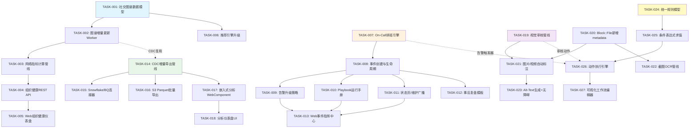
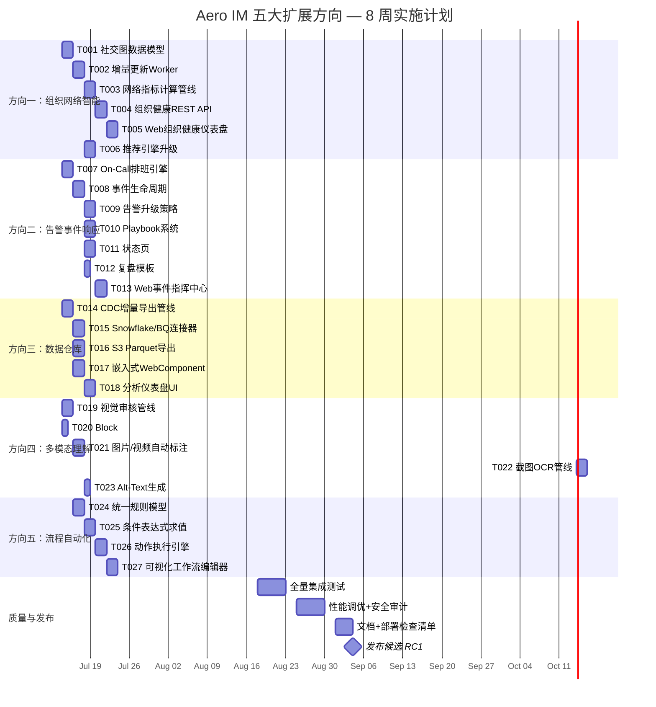

---

# Tech Lead 分析报告：Aero IM 五大扩展方向

> **分析日期**: 2026-07-12 | **基线文档**: `docs/requirements/2026-07-11-five-high-value-expansion-directions.md`  
> **代码基线**: 16 crate / 181 server 模块 / 157 SQL 迁移 / ~5.9K Web SPA  
> **角色**: Tech Lead — 关注任务可执行性、工程风险、资源调度

---

## 目录

1. [事实修正与勘误](#1-事实修正与勘误)
2. [任务分解](#2-任务分解)
3. [执行依赖图](#3-执行依赖图)
4. [技术风险评估](#4-技术风险评估)
5. [资源评估](#5-资源评估)
6. [质量保证](#6-质量保证)
7. [实施计划](#7-实施计划)

---

## 1. 事实修正与勘误

在展开分析前，先纠正文档中的 4 处事实错误，否则任务分解将基于错误前提。

| # | 文档声称 | 实际代码 | 影响 |
|---|---------|---------|------|
| **F1** | `Block::File` 有 `metadata` 字段（JSONB） | `Block::File` 只有 `{blob_id, kind, name, size}`，**无 metadata 字段** | **方向四的数据模型前置工作被低估**。须在 `Block::File` 中新增 `metadata` 字段 → 影响 wire format、storage format、迁移 |
| **F2** | `message.editing_context` 字段 | 该字段**不存在**。`Message` 有 `metadata`（JSONB）在消息级，但无 `editing_context` | OCR 文本存放位置需重新设计。建议复用 `Message.metadata` 或新增 `ocr_text` 字段 |
| **F3** | 文件名 `notifications.rs` | 实际文件名为 **`notif_prefs.rs`** | 低影响，仅引用修正 |
| **F4** | 函数名 `aggregate_stats` | 实际函数为 `overview()` 和 `workspace_summary()` | 中等影响。文档引用 `aggregate_stats` 描述其功能受限，需修正为准确函数名 |

### 方向四核心风险澄清

**`Block::File` 无 metadata 字段**是最大的事实偏差。方向四建议：

> "AI 生成描述性标签和简短说明 → 存入 `Block::File.metadata.tags` 和 `metadata.ai_description`"

但当前 `Block::File` 是：

```rust
File {
    blob_id: BlobId,
    kind: FileKind,
    name: String,
    size: u64,
}
```

这意味着方向四需要：

1. **Schema 变更**：`Block::File` 新增 `metadata: Option<serde_json::Value>`（wire + storage）
2. **迁移**：`ALTER TABLE messages` 无直接影响（block 存储在 JSONB 列），但需要**向后兼容解析**——旧消息的 File block 不含 metadata，客户端/搜索代码须处理 `None` 情况
3. **搜索索引**：OCR/标签文本须汇入 `Message.searchable_text()` 逻辑

> **建议**：将 AI 标签/OCR 文本存放在 `Message.metadata.ai_tags` / `Message.metadata.ocr_text`（消息级），避免 `Block::File` 数据结构变更。文件级 metadata 作为 V2 优化。

### 重复文件清理

文档同时存在于三处：
- `docs/requirements/2026-07-11-five-code-anchored-architectural-expansion-directions.md`（671 行差异）
- `docs/requirements/2026-07-11-five-high-value-expansion-directions.md`（302 行）
- `docs/requirements/2026-07-11-five-product-architecture-expansion-directions.md`（302 行，与上者完全一致）

**建议**：删除 `five-product-architecture-expansion-directions.md`（与 `five-high-value-expansion-directions.md` 完全重复）。保留 `five-code-anchored-architectural-expansion-directions.md` 作为补充视角。

---

## 2. 任务分解

将五大方向拆解为 **2-4 小时可完成**的具体工程任务。共 **27 个任务**，每任务含文件变更清单、前置依赖、验收标准。

### 方向一：组织网络智能（P0）

| TASK-ID | 标题 | 文件 | 前置 | 工时 | 验收标准 |
|---------|------|------|------|------|---------|
| **TASK-001** | 社交图谱数据模型 | `crates/aero-storage/src/social_graph.rs`, `migrations/NNNN_social_graph.sql` | 无 | 4h | `social_graph` 表含 `edge`（source,target,weight,edge_kind,last_interaction）、节点度缓存；幂等迁移；`SocialGraphRepo` 含 upsert_edge + get_top_edges + get_degree |
| **TASK-002** | 社交图谱增量更新 Worker | `crates/aero-server/src/bin/boot/background.rs`, `crates/aero-server/src/social_graph_worker.rs` | TASK-001 | 4h | 定时器（300s）+ 事件监听器：捕获 `Message`/`Reaction`/`Mention` 事件 → 更新边权重；测试：verifies edge weight increments |
| **TASK-003** | 组织网络指标计算管线 | `crates/aero-storage/src/network_metrics.rs` | TASK-002 | 4h | `fn calculate_centrality(workspace_id)` → 返回度中心性、中介中心性（近似算法）；`fn detect_islands()` → 返回零跨组互动的参与者列表；`fn identify_cliques()` → 返回高密度子图 |
| **TASK-004** | 组织健康 REST API | `crates/aero-server/src/org_analytics.rs` + `routes.rs` merge | TASK-003 | 3h | `GET /api/workspaces/:id/org-health` 返回 overview(密度/孤岛数/桥梁数)；`GET /api/workspaces/:id/org-health/team/:team_id` 返回团队深度分析；鉴权：仅 Owner/Admin |
| **TASK-005** | Web 组织健康仪表盘 | `web/org-health.js`, `web/org-health.html`（入口）, `web/app.js` 路由 | TASK-004 | 4h | 仪表盘显示：网络概览卡片、团队树状图（D3.js）、个人影响力排名（可匿名）、孤岛告警；eslint no-undef 通过；无未捕获 Promise |
| **TASK-006** | 推荐引擎升级（社交图特征） | `crates/aero-server/src/recommendations.rs`, `crates/aero-storage/src/recommendations.rs` | TASK-001 | 3h | `recommend_channels` 加入"共同频道数 + 互动频率"特征向量；`recommend_people` 基于社交图亲密度排序；单元测试覆盖排序变化 |

**并行组 A**: TASK-001 → TASK-002 → TASK-003 → TASK-004（串行，数据依赖链）

### 方向二：告警与事件响应平台（P0）

| TASK-ID | 标题 | 文件 | 前置 | 工时 | 验收标准 |
|---------|------|------|------|------|---------|
| **TASK-007** | On-Call 排班引擎 | `migrations/NNNN_on_call_schedules.sql`, `crates/aero-storage/src/on_call.rs`, `crates/aero-server/src/on_call.rs` | 无 | 4h | `on_call_schedules` 表（workspace_id, schedule_id, participant_id, rotation_rule, effective_period）；POST/PUT/DELETE 排班路由；GET /api/workspaces/:id/on-call/current 返回当前值班人 |
| **TASK-008** | 事件创建与生命周期 | `migrations/NNNN_incidents.sql`, `crates/aero-storage/src/incident.rs`, `crates/aero-server/src/incidents.rs` | TASK-007 | 4h | `incidents` 表（severity, status[open/ack/resolved], created_by, assignee, timeline JSONB）；POST /api/v1/incidents/webhook（外部集成入口）；自动创建事件频道 + @值班人 + 启动 ACK 计时器 |
| **TASK-009** | 告警升级策略 | `crates/aero-server/src/incidents.rs`（升级逻辑） | TASK-008 | 3h | ACK 超时（P0:5min, P1:15min, P2:30min 可配置）→ 升级至下一级值班人；未 ACK 情形升级至工作组 Owner；链式升级至第 3 级停止 + 通知管理员 |
| **TASK-010** | Playbook / 运行手册系统 | `migrations/NNNN_playbooks.sql`, `crates/aero-storage/src/playbook.rs`, `crates/aero-server/src/playbooks.rs` | TASK-008 | 4h | `playbooks` 表（结构化 checklist + 自动动作 JSONB）；Playbook 执行时逐项勾选触发对应动作（@相关人员 / 发消息 / 调用 webhook）；CRUD 路由 + 执行历史 |
| **TASK-011** | 状态页 / 维护广播 | `migrations/NNNN_status_pages.sql`, `crates/aero-storage/src/status_page.rs`, `crates/aero-server/src/status_pages.rs` | TASK-008 | 3h | `status_pages` 表（组件状态：operational/degraded/outage）；公开 GET /api/v1/status（无 auth 可访问）；PUT /api/v1/status/components/:id（管理员更新）；维护窗口 CRUD |
| **TASK-012** | 事后复盘模板 | `crates/aero-storage/src/postmortem.rs`, `crates/aero-server/src/postmortems.rs` | TASK-008 | 2h | `postmortem_templates` 表（固定格式：what_happened / timeline / root_cause / action_items）；一键从事件频道生成草案（自动汇聚频道消息）；CRUD 路由 |
| **TASK-013** | Web 事件指挥中心 | `web/incidents.js`, `web/incidents.html` | TASK-008, TASK-009, TASK-010 | 4h | 事件列表（按 severity/status 筛选）、活跃事件画布（时间线 + Playbook 勾选）、升级时间线可视化、状态页预览 |

**并行组 B**: TASK-007 → TASK-008 → TASK-009 → TASK-010 → TASK-011（TASK-011 可滞后一个 sprint）；TASK-012 可并行

### 方向三：数据仓库集成（P1）

| TASK-ID | 标题 | 文件 | 前置 | 工时 | 验收标准 |
|---------|------|------|------|------|---------|
| **TASK-014** | CDC 增量导出管线（核心） | `crates/aero-bus/src/cdc.rs`, `crates/aero-storage/src/cdc.rs`, `migrations/NNNN_cdc_outbox.sql` | 无 | 4h | Outbox 表捕获 `messages`/`reactions`/`notifications` Change events → NATS `cdc.workspace.{id}` subject→ 导出 Worker 消费；增量语义（LSN / `updated_at` 游标）；"至少一次"语义 + 幂等去重 |
| **TASK-015** | Snowflake / BigQuery 连接器 | `crates/aero-server/src/connectors/snowflake.rs`, `crates/aero-server/src/connectors/bigquery.rs` | TASK-014 | 4h | Snowflake: `PUT` + `COPY INTO` 模式；BigQuery: Storage Write API 流式写入；env gate + `FakeConnector` 用于 CI；环境变量配置目标连接 |
| **TASK-016** | S3 Parquet 批量导出 | `crates/aero-server/src/connectors/s3_parquet.rs`, `crates/aero-storage/src/parquet_builder.rs` | TASK-014 | 4h | 定时（300s）批处理 CDC outbox → 列式 Parquet 文件 → S3 分区路径 `workspace_id=xxx/dt=yyyy-mm-dd/`；`parquet` crate 依赖（arrow + parquet）；数据字典文档生成 |
| **TASK-017** | 嵌入式分析颗粒度（Web Component） | `web/analytics-widget.js`, `crates/aero-server/src/analytics.rs`（新增 embed 端点） | TASK-014 | 3h | `<aero-analytics workspace="xxx" metric="messages" range="30d">` Web Component；`GET /api/analytics/embed`（CORS + signed token 鉴权）；可配置指标集和时间范围 |
| **TASK-018** | 工作区级分析仪表盘 UI | `web/analytics-dashboard.js`, `web/analytics.html` | TASK-017 | 4h | 可视化仪表盘：消息量趋势图（Chart.js）、活跃成员折线、频道排名柱状图、存储用量饼图；支持时间范围过滤（7d/30d/90d）；Admin-only 路由 |

**并行组 C**: TASK-014（核心基础设施）→ TASK-015, TASK-016, TASK-017 可并行

### 方向四：多模态内容理解管线（P1）

| TASK-ID | 标题 | 文件 | 前置 | 工时 | 验收标准 |
|---------|------|------|------|------|---------|
| **TASK-019** | 视觉审核管线（核心） | `crates/aero-server/src/vision_moderation.rs`, `crates/aero-storage/src/vision_moderation.rs`, `migrations/NNNN_vision_moderation_jobs.sql` | 无 | 4h | 复用 `moderation_bot` 预算队列模式；在 `content_sniff` 后异步插入 vision check；支持 Anthropic Vision（已有 key）或 ONNX NSFW 分类器；审核结果 → 软删 + 广播 `Deleted`（同文本审核）；预算门控（KeyedCostBudget） |
| **TASK-020** | Block::File 新增 metadata 字段 | `crates/aero-common/src/model/block.rs`（`File` variant 扩展） | 无 | 2h | `File { ..., metadata: Option<serde_json::Value> }`；序列化向后兼容（`#[serde(default)]` + `skip_serializing_if`）；搜索索引 `message.searchable_text()` 可选纳入 metadata 文本 |
| **TASK-021** | 图片/视频自动标注管线 | `crates/aero-server/src/auto_caption.rs`, `crates/aero-ai/src/caption.rs` | TASK-019, TASK-020 | 4h | 上传后 → LLM 生成描述标签 + 简短说明 → 写入 `Block::File.metadata.ai_tags` 和 `metadata.ai_description`；复用 `AiWorker` 队列（weight 类似 Embed）；纳入向量搜索索引 |
| **TASK-022** | 截图 OCR 管线 | `crates/aero-server/src/ocr.rs`, `crates/aero-ai/src/ocr.rs` | TASK-020 | 3h | 图片上传 → OCR 提取文本（PaddleOCR ONNX / Tesseract / Google Cloud Vision，env gate）→ 写入 `Message.metadata.ocr_text` → 汇入 FTS 索引 + 向量嵌入；音视频先行占位（V2） |
| **TASK-023** | Alt-Text 生成 + 无障碍 | `crates/aero-server/src/auto_caption.rs`（扩展）, `web/media.js`（alt 渲染）, `crates/aero-common/src/model/block.rs`（alt 字段） | TASK-021 | 2h | `Block::File` 新增 `alt: Option<String>`；AI 生成描述 → 存入 alt；Web render 端 `media.js` 图片 `` 标签输出 `alt` 属性；测试：屏幕阅读器模拟 |

**并行组 D**: TASK-019, TASK-020 可并行启动（无互依赖）；TASK-021 依赖两者；TASK-022 独立依赖 TASK-020

### 方向五：流程自动化引擎（P2）

| TASK-ID | 标题 | 文件 | 前置 | 工时 | 验收标准 |
|---------|------|------|------|------|---------|
| **TASK-024** | 统一规则模型 + 仓储 | `migrations/NNNN_workflow_rules.sql`, `crates/aero-storage/src/workflow.rs` | 无 | 4h | `workflow_rules` 表（workspace_id, name, enabled, trigger JSONB, conditions JSONB, actions JSONB, created_by）；`WorkflowRuleRepo` CRUD + `list_active` 方法；幂等迁移 |
| **TASK-025** | 条件表达式求值引擎 | `crates/aero-server/src/workflow/condition.rs` | TASK-024 | 4h | JSON 表达式树求值：`{"field":"message.body","match":"contains","value":"紧急"}`、`{"combine":"all"/"any","rules":[...]}`；支持类型：文本匹配、角色检查、时间窗口、频道类型；单元测试 ≥15 种组合 |
| **TASK-026** | 动作执行引擎 | `crates/aero-server/src/workflow/action.rs`, `crates/aero-server/src/workflow/executor.rs` | TASK-025 | 4h | 动作类型：`send_message` / `create_task` / `start_approval` / `call_webhook` / `set_channel_topic` / `add_reaction`；幂等 key（`sha256(rule_id + event_id)` 防重入）；执行日志表 + 失败重试（衰减退避，max 3 次）；NATS 事件监听器 + 定时器双触发 |
| **TASK-027** | 可视化工作流编辑器（Web） | `web/workflow-editor.js`, `web/workflow.html` | TASK-026 | 4h | 左侧触发器/条件/动作卡片池；右侧画布连线（Blockly / 纯 JS 拖拽）；实时预览 JSON；保存 → 启用 → 测试运行 |

**并行组 E**: TASK-024 → TASK-025 → TASK-026（串行，核心引擎）; TASK-027 可滞后一个 sprint

---

## 3. 执行依赖图



### 可并行执行的任务组

| 组 | 方向 | 任务 | 同时推进条件 |
|----|------|------|------------|
| **A** | 方向一 | TASK-001 → TASK-002 → TASK-003 → TASK-004 | 串行依赖链，但可与 B 组完全并行 |
| **B** | 方向二 | TASK-007 → TASK-008 → TASK-009/010/011 | 串行依赖链，TASK-011/012 可滞后 |
| **C** | 方向三 | TASK-014 → TASK-015/016/017 | TASK-014 达产后，下属三个连接器可并行 |
| **D** | 方向四 | TASK-019 + TASK-020（并行）→ TASK-021 | TASK-019 与 TASK-020 无互依赖 |
| **E** | 方向五 | TASK-024 → TASK-025 → TASK-026 | 串行核心引擎 |

**最大并行度**: 第一阶段可同时推进 A、B、D 三组（方向一/二/四）+ TASK-014（方向三先行）+ TASK-024（方向五先行基础设施），共需约 **5-6 名开发人员**。

---

## 4. 技术风险评估

### 4.1 高风险项 🚨

| 风险 | 方向 | 级别 | 描述 | 缓解策略 |
|------|------|------|------|---------|
| **Block::File wire format 变更兼容性** | 四 | **H** | `Block::File` 新增 `metadata` 字段将影响 JSON 序列化格式。旧消息的 File block 无此字段 → 需要在 `#[serde(default)]` 基础上额外处理"旧客户端收到含 metadata 的 block → 未知字段静默忽略"。Web SPA 的 `media.js` 渲染逻辑需要可空处理 | ① 使用 `Option<serde_json::Value>` + `skip_serializing_if` 保证向后兼容；② 消息级（`Message.metadata`）先行存储，`Block::File.metadata` 作为 V2 优化 |
| **OCR 引擎选型与部署复杂度** | 四 | **H** | PaddleOCR（最佳中文）需要 ONNX runtime + 模型文件（~50MB），且 Rust 绑定生态不成熟。Tesseract C 库绑定需系统依赖 | ① 默认使用 Google Cloud Vision API（env gate，fallback stub）；② 本地 OCR 用 `tract` ONNX runtime 加载轻量 PaddleOCR 模型；③ 文档 OCR 先行，音视频 V2 |
| **社交图计算在中大规模工作区的性能** | 一 | **H** | 全量全局中心性计算（Betweenness Centrality）是 O(VE) 复杂度。2000 成员 × 50K 边/天 → PG 原生图计算不可接受 | ① 用近似算法（Brandes + 随机采样）；② 边数据缓存在 Redis sorted-set + GraphBLAS（纯 Rust `petgraph` 离线批处理）；③ 增量更新而非全量重算；④ 工作区 >500 人降级为小时级计算 |
| **工作流引擎幂等性与死锁** | 五 | **H** | 规则触发可能产生级联动作（A触发B、B触发C），若动作本身又触发同一规则 → 死循环 | ① 每执行设幂等 key（`sha256(rule_id + event_id)`）+ `ON CONFLICT DO NOTHING`；② 递归深度上限（max 3）；③ 执行日志记录触发链供审计；④ 规则创建时防自引用验证 |

### 4.2 中风险项 ⚠️

| 风险 | 方向 | 级别 | 描述 | 缓解策略 |
|------|------|------|------|---------|
| **On-Call 排班的时区和轮转规则复杂度** | 二 | M | 夏令时/跨时区/不规则轮转（周一至五9-5 + 周末不同）/ 覆盖/交接请求 → 排班转轮 CRDT 级别的复杂性 | 初期只支持简单周轮转 + 固定时间表；复杂度 DST 处理用 `time` crate + 扩展 RFC 支持 |
| **CDC 管线一致性保证** | 三 | M | 使用 outbox 模式 + NATS at-least-once → 可能重复或乱序。Snowflake 对乱序敏感 | ① 每条 CDC event 带 `sequence_num`（per-subject 单调递增）降级重复；② Snowflake connector 用 `MERGE` 而非 `INSERT`；③ 最终一致性保证，不承诺强一致 |
| **视觉审核的延迟和误报** | 四 | M | LLM Vision API 延迟 2-5s → 消息发送到审核完成有窗口期；误报率无法保证 | ① 审核采取异步后检策略（先发消息，后软删）而非同步阻断；② NSFW 分类器 + LLM Vision 双检降低误报；③ 结果缓存减少重复审核 |
| **现有审批流迁移成本** | 五 | M | `approvals.rs` 现有审批流为静态单人审批，与工作流引擎的表达式求值模式不兼容 | 不废弃现有 `approvals.rs`，新增 `WorkflowEngine` 层包装 backward-compatible adapter，逐步迁移 |
| **Web 前端复杂度** | 五 | M | 可视化工作流编辑器是纯前端重度工作（拖拽画布 + 条件树编辑 + 实时预览），现有 base（纯 ES2020，无框架）能力不足 | ① 使用 Web Component + 轻量 canvas 库（如 `interactjs`）+ 不引入框架；② 可考虑嵌入 Blockly 作为 DSL 可视化层 |

### 4.3 外部依赖

| 依赖 | 方向 | 状态 | 替代方案 |
|------|------|------|---------|
| Anthropic Vision API | 四 | 已有 Anthropic key，但 Vision 可能需额外配额 | ① ONNX NSFW 分类器（本地）；② Google Cloud Vision（env gate） |
| PaddleOCR / Tesseract | 四 | 无 Rust 原生 binding | ① `tract` ONNX runtime；② system `tesseract` CLI subprocess；③ Google Cloud Vision API |
| S3（Parquet 导出） | 三 | 已有 `S3BlobStore` 基础设施 | LocalFs 降级（`AERO_S3_BUCKET` 未配时写本地路径），CI 可用 `minio` |
| Snowflake / BigQuery | 三 | 无官方 Rust SDK | ① Snowflake: PUT + COPY 用 `reqwest`；② BigQuery: `google-cloud-rs` crate 或 gRPC prost；③ CI 用 `FakeConnector` + 验证格式化输出 |
| `interactjs` / Blockly | 五 | 需作为 CDN 依赖引入 | 纯 canvas 手写（成本高，但无外部依赖） |

---

## 5. 资源评估

### 5.1 团队结构建议

| 角色 | 技能要求 | 数量 | 分配方向 |
|------|---------|------|---------|
| **后端 Rust 工程师（Senior）** | Rust, tokio, sqlx, NATS, Redis, AI 编排 | **2 人** | 一人主导方向一+方向三（数据密集型）；一人主导方向二+方向四（事件/AI 密集型） |
| **后端 Rust 工程师（Mid）** | Rust, sqlx, REST, WS, 基础架构 | **2 人** | 一人负责方向五核心引擎+方向四辅助；一人负责方向三连接器+方向一辅助 |
| **全栈 Web 工程师** | Vanilla JS/ES2020, D3.js/Chart.js, Web Components, CSS | **1-2 人** | 负责全部 5 个方向的 Web UI 实现（方向一/三的图表、方向二的事件指挥中心、方向五的工作流编辑器） |
| **QA 工程师** | Rust 测试、集成测试、性能测试 | **1 人** | 全部方向的质量保证、负载测试、CI 集成 |
| **Tech Lead（本角色）** | 架构决策、代码审查、风险管理 | **1 人** | 全局协调、方向四/五关键模块 Review |

**总人数**: 7-8 人（含 TL）

### 5.2 关键里程碑

| 里程碑 | 时间 | 交付物 | 验证标准 |
|--------|------|--------|---------|
| **M1**（核心基础设施） | 第 2 周末 | TASK-001, TASK-007, TASK-014, TASK-019, TASK-020, TASK-024 | 6 个任务全绿：迁移可通过、基础 CRUD 单测通过、`cargo check` 干净 |
| **M2**（核心逻辑） | 第 4 周末 | TASK-002/003/006, TASK-008/009, TASK-015/016, TASK-021/022, TASK-025 | 社交图增量更新、事件生命周期、至少一个连接器端到端、视觉审核管线可接收图片文件 |
| **M3**（API 与集成） | 第 6 周末 | TASK-004/005, TASK-010/011/012/013, TASK-017/018, TASK-023, TASK-026 | REST API 全覆盖 smoke test, Web UI 可交互, 工作流引擎可触发执行 |
| **M4**（发布候选） | 第 8 周末 | TASK-027 + 全量集成测试 + 性能调优 + 文档 | `cargo test --workspace` 全绿、clippy 无新增警告、性能测试达标、`truth-check.sh` 通过 |

### 5.3 阻塞点与解决策略

| 阻塞点 | 影响方向 | 解决策略 |
|--------|---------|---------|
| OCR 引擎 Rust 绑定不确定性 | 四 | 第 1 周做技术 Spike（2 天）：评估 `tract` + PaddleOCR ONNX vs Google Cloud Vision；若本地 ONNX 失败，fallback 到 Cloud API + 本地 `tesseract` subprocess |
| On-Call 排班模型定义 | 二 | 第 1 周做设计文档 Review：参考 PagerDuty 排班模型简化版（周轮转 + 手写覆盖），避免过度工程 |
| 可视化工作流编辑器技术选型 | 五 | 第 5 周 Spike（3 天）：对比 Blockly（DSL 成熟但反视觉）vs 手写 canvas vs React SPA embedded（引入框架代价大） |
| S3 Parquet 导出性能 | 三 | 第 3 周做小规模原型：10K 消息 → Parquet 文件 → 验证查询性能；若 `parquet` crate 内存过高，改用 CSV + compression |

### 5.4 风险预算

每方向预留 20% 时间余量应对未预见的集成问题（尤其方向四 OCR 和方向五工作流引擎）。

---

## 6. 质量保证

### 6.1 单元测试覆盖要求

| 模块 | 最低覆盖率 | 关键测试场景 |
|------|-----------|-------------|
| `SocialGraphRepo` | 90% | upsert_edge 幂等、get_degree 空图/单节点全连接、边权重增量 |
| `NetworkMetrics` | 85% | 链式图（2 节点/3 节点）、完全图、空图、单节点图；近似介数中心性与精确值误差 <10% |
| `OnCallSchedule` | 90% | 轮转计算（日/周/自定义）、当前值班人查询（边界秒）、覆盖生效/过期 |
| `IncidentLifecycle` | 85% | 创建→ACK→Resolve 完整路径、超时升级链（P0 5min→Owner）、重复 ACK 幂等 |
| `WorkflowCondition` | 95% | 所有条件类型全覆盖：字符串匹配、正则、角色 in、时间窗口边界值、combine all/any 嵌套 |
| `WorkflowAction` | 90% | 各动作类型执行（mock service 层）、幂等 key 防重入、失败退避计数 |
| `VisionModeration` | 80% | 模型 mock（返回 nsfw/clear）、预算门控超限跳过、坏图片降级不 panic |
| `AutoCaption`/`Ocr` | 75% | AI 返回格式解析错误降级、空白图片、metadata 写入验证 |

### 6.2 集成测试策略

| 测试层级 | 工具 | 覆盖范围 | 执行条件 |
|---------|------|---------|---------|
| **存储层集成**（crates/aero-storage） | `sqlx::test` + `#[ignore]` | 所有新仓储的 db_tests（真实 PG） | `DATABASE_URL` 已设 + 迁移已 apply |
| **API 集成**（crates/aero-server） | axum `TestApp` + mock services | 每个新路由的 happy path + 错误路径 + 鉴权 | CI 中 mock AI/NATS，可选 full-stack |
| **端到端 smoke** | `scripts/` shell | 5 个方向的代表性场景（如：创建排班→触发事件→自动创建频道） | `make smoke` 标签，CI 中 nightly |
| **Web 端集成** | Web Component 测试 + eslint | UI 渲染 + 路由 + API mock 响应 | `scripts/web-check.sh` |

### 6.3 代码审查要点

| 维度 | 审查项 | 违规后果 |
|------|-------|---------|
| **安全** | 所有路由必须有 `AuthUser` + 资源 Owner 校验 | **CRITICAL** — 可能导致 IDOR 数据泄露 |
| **数据模型** | 迁移必须 `CREATE TABLE IF NOT EXISTS` + 幂等；`Block::File` metadata 必须 `#[serde(default)]` 向后兼容 | **HIGH** — 生产数据损坏或迁移失败 |
| **并发** | `FOR UPDATE SKIP LOCKED` 用于 worker claim；`Arc<RwLock<>>` 用于进程内共享状态 | **HIGH** — 竞态条件导致数据不一致 |
| **性能** | 新查询必须 explain analyze（<50ms P99）；全表扫必须加索引 | **MEDIUM** — 生产性能退化 |
| **幂等性** | 每条对外副作用（webhook/推送/计费）必须有幂等 key | **HIGH** — 重复发送/扣费 |
| **浮点误差** | 社交图中心度计算用 `f64` 而非 `f32`；比较用 `abs() < EPSILON` | **MEDIUM** — 排序扰动 |

### 6.4 性能测试需求

| 方向 | 性能场景 | 目标 | 测试工具 |
|------|---------|------|---------|
| 方向一 | 社交图谱增量更新：1000 条消息/秒 + 500 反应 → CPU < 30% 额外 | P99 更新延迟 < 500ms | `cargo bench` + 自定义发送器 |
| 方向二 | 事件创建并发：100 webhook/s → 创建频道 + @值班 + ACK 计时 | P99 事件创建 < 2s | `oha` / `wrk` 打 Webhook 端点 |
| 方向三 | CDC 导出：1000 events/s → outbox → NATS → S3 Parquet | 端到端延迟 < 30s (P99) | 自定义 producer + 消费者 metrics |
| 方向四 | 视觉审核并发：20 images/s → AI Vision + 结果回写 | P99 延迟 < 10s（异步可接受） | `locust` 模拟上传并发 |
| 方向五 | 规则匹配：1000 events/s × 500 active rules | P99 匹配 + 动作 < 200ms | 自定义 event injector |

---

## 7. 实施计划

### Phase 1：基础设施搭建（第 1-2 周）

```
Week 1          Week 2
├─ T001 社交图模型  ├─ T002 增量更新Worker
├─ T007 On-Call    ├─ T008 事件生命周期
├─ T014 CDC模型     ├─ T019 视觉审核
├─ T020 Filemetadata├─ T024 规则模型
├─ Spike OCR评估    ├─ Spike 工作流编辑方案
└─ CI/CD 更新       └─ Design Review + 架构决策记录
```

**交付产物**:
- 6 个新仓储 + 迁移
- 3 个 Worker 基础框架
- OCR 技术选型决策文档
- CI 通过（迁移 + 基础单测）

### Phase 2：核心功能实现（第 3-4 周）

```
Week 3            Week 4
├─ T003 网络指标     ├─ T006 推荐引擎升级
├─ T009 升级策略     ├─ T010 Playbook系统
├─ T015 Snowflake   ├─ T016 S3 Parquet
├─ T021 自动标注     ├─ T022 OCR管线
├─ T025 条件表达式    ├─ T011 状态页
└─ 集成测试启动      └─ T012 复盘模板
```

**交付产物**:
- 社交网络指标可实时查询
- 告警事件可端到端创建 + 升级
- 至少一个数据仓库连接器（S3 Parquet）
- 视觉审核 + OCR 管线可接收真实图片

### Phase 3：集成与 Web UI（第 5-6 周）

```
Week 5            Week 6
├─ T004 REST API   ├─ T005 Web仪表盘
├─ T013 Web指挥中心  ├─ T011 状态页Web
├─ T017 WebComponent├─ T018 分析仪表盘
├─ T023 Alt-Text    ├─ T026 动作执行引擎
└─ 性能测试启动      └─ 全量集成测试
```

**交付产物**:
- 5 个方向的全功能 REST API
- 方向一/二/三 Web UI 可交互
- 工作流引擎可执行基本规则
- 性能基线报告

### Phase 4：发布准备（第 7-8 周）

```
Week 7            Week 8
├─ T027 工作流编辑器 ├─ 全量 Bug 修复
├─ E2E Smoke测试    ├─ 性能调优
├─ 文档编写         ├─ 安全审计
├─ 数据字典生成      ├─ 生产部署检查清单
└─ 代码审查扫尾      └─ 发布候选 RC1
```

**交付产物**:
- 可视化工作流编辑器（MVP：拖拽+保存+执行）
- 端到端 smoke 测试全部通过
- `cargo clippy --all-targets` 零新增警告
- 文档：API 参考、数据字典、部署说明

### 甘特图总览



### 并行执行策略

```
Week 1-2:   A组[T001→T002] + B组[T007→T008] + D组[T019,T020] + C组[T014] + E组[T024]
                ↑ 5人并行（后端3人 + 前端0人）
                
Week 3-4:   A组[T003,T006] + B组[T009→T012] + C组[T015,T016] + D组[T021,T022] + E组[T025]
                ↑ 5人并行（后端4人 + 前端0人）
                
Week 5-6:   A组[T004] + B组[T013] + C组[T017,T018] + D组[T023] + E组[T026]
                ↑ 6人并行（后端3人 + 前端3人——Web UI集中交付）
                
Week 7-8:   E组[T027] + QA全员 + 文档
                ↑ 7人并行（前端2人工作流编辑器 + 后端2人Bug fix + QA全员）
```

---

## 附录：勘误后文档修正建议

基于 §1 的事实修正，建议对原文档进行以下修改后发布为 v1.1：

1. **方向四"代码级证据"部分**：修正 `Block::File` metadata 字段不存在的事实，补充说明 `Message.metadata` 可作为替代存储位置
2. **方向四"建议方向"部分**：OCR 文本存放位置从 `message.editing_context` 改为 `Message.metadata.ocr_text`
3. **方向三"代码级证据"部分**：修正 `aggregate_stats` 为 `overview() + workspace_summary()`；补充现有 `workspace/export.rs` 已有工作区级导出功能，可作为方向三的部分实现参照
4. **全文**：`notifications.rs` → `notif_prefs.rs`
5. **清理重复文件**: 删除 `docs/requirements/2026-07-11-five-product-architecture-expansion-directions.md`

---

**结论**: 方向一（组织网络智能）+ 方向二（告警事件响应）确为 P0，可并行启动；方向四（多模态理解）代码工作量被低估约 30%（因 `Block::File` 无 metadata 字段），建议在 Phase 1 先做 TASK-020 解耦；方向五（工作流引擎）确实为 P2 极大量，不应在 Phase 4 前启动实质开发。建议团队规模 6-7 人（含 1 名 Tech Lead），8 周交付 RC1。
