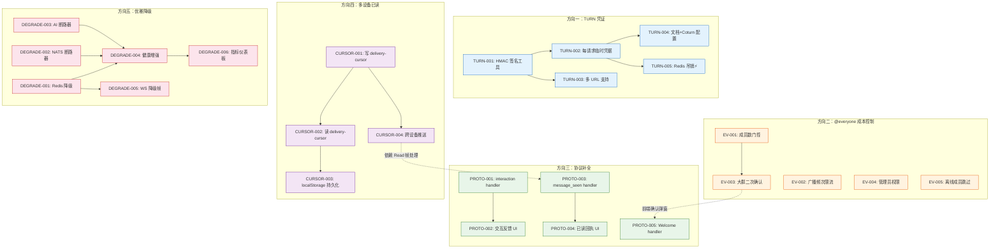
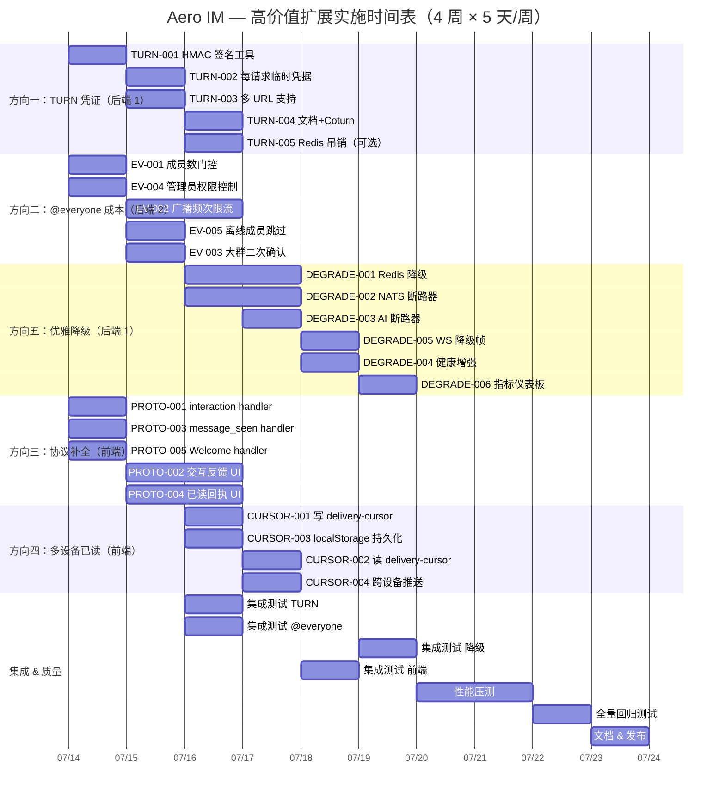

现在我已完整理解文档内容。让我从 Tech Lead 角度给出系统分析。

---

# Tech Lead 分析报告：高价值扩展方向实施规划

## 1. 任务分解

将 5 个方向拆解为 28 个可执行任务，每任务 2–4 小时。

### 方向一：TURN 凭证生命周期管理（P1 · 安全）

| Task ID | 标题 | 涉及文件 | 前置 | 工时 | 验收标准 |
|---------|------|---------|------|------|---------|
| **TURN-001** | 引入 `AERO_TURN_SECRET` + HMAC 签名工具 | `aero-server/src/routes/routes.rs` (rtc_config_payload), `aero-common/src/` (新模块 `turn_auth.rs`) | — | 3h | `AERO_TURN_SECRET` 取值，对 `{pid}:{timestamp}` 输出 HMAC-SHA1 hex；无 `AERO_TURN_SECRET` 时回退旧明文行为 |
| **TURN-002** | 重构 `/api/rtc-config` 为每请求临时凭据 | `aero-server/src/routes/routes.rs` (rtc_config 处理函数)、`aero-server/src/state.rs` (注入 turn_secret) | TURN-001 | 3h | 每次请求生成不同 `username`（含 `pid:unix_ts`）和 `credential`（HMAC）；凭据有效期 24h；coturn 侧 `use-auth-secret` 可验证 |
| **TURN-003** | 多 TURN 服务器 URL 支持（CSV 解析） | `routes.rs` 的 env 解析段 | TURN-001 | 2h | `AERO_TURN_URLS` CSV 格式=多 URL 入 ice_servers；兼容单 `AERO_TURN_URL` 旧格式 |
| **TURN-004** | 文档 + Coturn 部署配置更新 | `docs/`（新增 `turn-deployment.md`）、`config.example.toml`、`.env.example` | TURN-002 | 2h | 包含 Coturn 启动参数示例、`use-auth-secret` 配置、轮换流程 |
| **TURN-005** | Redis 凭据吊销支持（可选） | `aero-server/src/routes/routes.rs`、`aero-storage/src/redis.rs` (新增 revoked_turn set) | TURN-002, 要求 Redis 上下文 | 4h | 登出时 `SADD revoked_turn:{pid}` → coturn 侧 `redis-server` 检查黑名单；凭据生成时查黑名单拒绝 |

### 方向二：@everyone 成本控制（P1 · 稳定性）

| Task ID | 标题 | 涉及文件 | 前置 | 工时 | 验收标准 |
|---------|------|---------|------|------|---------|
| **EV-001** | 成员数阈值门控：房间 > N 人时禁止 @everyone | `aero-im-core/src/service/notify.rs`（广播展开处）、`config.example.toml`（新增 `max_broadcast_members`） | — | 3h | 房间成员 > `max_broadcast_members`（默认 100）时 `@everyone` 降级为普通 @mention；env 可配 |
| **EV-002** | 广播频次限流：per-(sender, workspace) 滑动窗口 | `aero-server/src/routes/routes.rs`（消息发送 handler）、`aero-storage/src/redis.rs`（滑动窗口实现） | — | 4h | Redis 滑动窗口 60s 内最多 N 次广播 token 使用；超限静默降级为普通 @mention；返回 `X-RateLimit-*` 头 |
| **EV-003** | 大群广播二次确认 | `aero-server/src/routes/routes.rs`（前置检查）、`web/app.js`（确认弹窗 UI） | EV-001 | 3h | 房间 > 50 人时 `@everyone` 消息发送前返回 `confirmation_required` 帧→客户端弹确认→携带 `confirmed: true` 重发 |
| **EV-004** | 管理员广播权限控制 | `aero-im-core/src/service/notify.rs`、`storage/src/workspace.rs`（新增 `broadcast_role` 字段） | — | 3h | 工作区设置 `broadcast_role=admin/owner/all`；非授权用户发 @everyone 被拒绝并返回 `Forbidden` |
| **EV-005** | @everyone 通知跳过离线成员 | `aero-im-core/src/service/notify.rs`（过滤逻辑）、`hub.rs`（在线成员查询接口） | — | 3h | `@everyone` 只展开在线成员→通知插入和推送量 O(online) 而非 O(all)；保留 `@all` 原始语义 |

### 方向三：Interactive Block / MessageSeen 协议修复（P2 · 协议）

| Task ID | 标题 | 涉及文件 | 前置 | 工时 | 验收标准 |
|---------|------|---------|------|------|---------|
| **PROTO-001** | Web SPA 添加 `msg:interaction` 处理器 | `web/app.js`（新增 `ws.on('msg:interaction', ...)`）、`web/ws.js`（帧类型注册表） | — | 2h | 客户端收到 `ServerFrame::Interaction` 不静默丢帧；打印 console.debug 日志；触发自定义事件 |
| **PROTO-002** | 交互块反馈 UI 组件 | `web/components/interaction-feedback.js`（新文件）、`web/message.js`（消息渲染中集成） | PROTO-001 | 4h | Button/Select 下方渲染「Alice 点击了」「Bob 选择了 Option A」；有界显示（最多 3 名 + +N） |
| **PROTO-003** | Web SPA 添加 `msg:message_seen` 处理器 | `web/app.js`（新增 `ws.on('msg:message_seen', ...)`）、`web/ws.js`（注册） | — | 2h | 收到 `MessageSeen` 帧时更新消息的已读状态数据；触发 `message_seen` 自定义事件 |
| **PROTO-004** | 已读回执 UI 组件 | `web/components/read-receipt.js`（新文件）；`web/message.js` 集成 | PROTO-003 | 4h | 消息底部渲染「Alice、Bob 已读」；最多 3 个头像 + `+N`；使用 `participant_cache` 解析显示名 |
| **PROTO-005** | `Welcome` 帧处理器 | `web/app.js`（`hookWs` 的 `open` 回调中校验 Welcome 帧的 participant）、`web/ws.js` | — | 2h | 连接后首个 frame 为 `Welcome`→校验 participant.id === 当前用户→显示连接确认日志 |

### 方向四：多设备已读状态收敛（P2 · UX）

| Task ID | 标题 | 涉及文件 | 前置 | 工时 | 验收标准 |
|---------|------|---------|------|------|---------|
| **CURSOR-001** | `markRead` 后同步写 delivery-cursor | `web/app.js`（`handleReadReceipt` 中追加 `PUT /api/rooms/:id/delivery-cursor` 调用） | — | 3h | 每次 `markRead` 成功后异步 `PUT` 写 `delivery_cursors` 表；失败静默（不阻塞读回执） |
| **CURSOR-002** | WS 连接时读取 delivery-cursor 校准 `_lastSeen` | `web/ws.js`（`connect` 中 `GET /api/delivery-cursor/{roomId}`）、`web/app.js`（`joinRoom` 中触发） | CURSOR-001 | 3h | 加入房间时从 `/api/delivery-cursor/{roomId}` 获取最后游标→设置 `_lastSeen`→更新未读计数 |
| **CURSOR-003** | `_lastSeen` 持久化到 localStorage | `web/ws.js`（`markRead` 后写 `localStorage`、`connect` 时读） | — | 2h | 页面刷新后 `_lastSeen` 从 localStorage 恢复而非 null；跨标签页同步 |
| **CURSOR-004** | 跨设备已读推送：`RoomEvent::Read` 同步到 `_lastSeen` | `web/app.js`（`handleReadReceipt` 处理 `Read` 帧时不仅更新 inbox 也更新 `_lastSeen`） | CURSOR-001, PROTO-003 | 3h | 设备 B 收到设备 A 的 Read 帧→B 的对应房间 `_lastSeen` 推进→未读计数减少 |

### 方向五：优雅降级策略（P1 · 韧性）

| Task ID | 标题 | 涉及文件 | 前置 | 工时 | 验收标准 |
|---------|------|---------|------|------|---------|
| **DEGRADE-001** | Redis 读路径降级：Presence/Viewers 回退 Hub 本地数据 | `aero-server/src/online.rs`（`room_members_online` 加 fallback）、`hub.rs`（暴露进程内成员视图）、`aero-common/src/metrics.rs`（新增 `degraded_read` gauge） | — | 4h | Redis `ERR`/超时时→从 `hub.participants` 进程内缓存读数→标记 `degraded_read{component="redis",source="hub"}`→返回 stale 但可用数据 |
| **DEGRADE-002** | NATS 写路径断路器：失败时写 PG pending 表 | `aero-im-core/src/service/events.rs`（`publish_room_event` 加 breaker）、`migrations/NNNN_room_events_pending.sql`（新表）、`aero-storage/src/`（`PendingEventRepo`） | — | 4h | NATS `publish` 连续失败 ≥3 次→切 `room_events_pending` 表写入→恢复回放（drain）→ `DRAINED_EVENTS_TOTAL` 指标 |
| **DEGRADE-003** | AI 调用断路器：连续失败→休眠窗→半开探活 | `aero-server/src/agent_bot.rs`（加 CircuitBreaker 封装）、`aero-common/src/`（通用 `CircuitBreaker` 实现） | — | 4h | 连续 5 次 AI Err→休眠 60s→半开探活（1 请求）→成功恢复/失败再休眠→日志 `CIRCUIT_OPEN`/`HALF_OPEN`/`CLOSED` |
| **DEGRADE-004** | 增强 `/health` 端点：降级状态明细 | `aero-server/src/routes/routes.rs`（`/health/degraded`）、`aero-server/src/state.rs`（`DegradationState` 共享状态） | DEGRADE-001, DEGRADE-002, DEGRADE-003 | 3h | `GET /health/degraded` 返回 `{"degraded_modes":[{"component":"redis","mode":"presence_stale","since":"..."}],"healthy_dependencies":["pg","nats","ai"]}` |
| **DEGRADE-005** | WS 降级通知帧 | `aero-server/src/ws/frame.rs`（新 `ServerFrame::Degraded` variant）、`web/app.js`（handler） | DEGRADE-001 | 3h | 进入/退出降级模式时房内广播 `{"type":"degraded","component":"redis","mode":"presence_stale","active":true}`→客户端显示黄色横幅 |
| **DEGRADE-006** | 全局降级指标仪表板 | `aero-common/src/metrics.rs`（`DEGRADED_MODE_ACTIVE` gauge + `DEGRADED_EVENTS_TOTAL` counter）；Prometheus 规则示例 | DEGRADE-004 | 2h | Prometheus 暴露 `aero_degraded_mode_active{component, mode}` 和 `aero_degraded_events_total`；`/metrics` 可查 |

---

## 2. 执行顺序与依赖图

### 可并行执行的任务组

| 并行组 | 包含任务 | 所需角色 |
|--------|---------|---------|
| **组 A** | TURN-001, EV-001, EV-002, EV-004, EV-005, PROTO-001, PROTO-003, PROTO-005, CURSOR-001, CURSOR-003, DEGRADE-001, DEGRADE-002, DEGRADE-003 | 3–4 人并行（后端 2 + 前端 1–2） |
| **组 B** | TURN-002, TURN-003, EV-003, PROTO-002, PROTO-004, CURSOR-002, CURSOR-004, DEGRADE-005 | 依赖组 A 部分完成 |
| **组 C** | TURN-004, TURN-005, DEGRADE-004, DEGRADE-006 | 依赖组 B 部分完成 |

---

## 3. 技术风险

### 3.1 高风险项

| 风险 | 方向 | 等级 | 说明 | 缓解策略 |
|------|------|------|------|---------|
| **Coturn `use-auth-secret` 兼容性** | 一 | **高** | 未在生产验证过 Coturn 的 HMAC 认证模式；不同版本行为可能不同 | 先 dockerc-compose 起 coturn 本地 E2E 验证；文档明确最低 coturn 版本 |
| **Redis 降级→Hub 本地数据不一致** | 五 | **高** | 多实例场景下 Hub 进程内数据仅是本地视图，回落数据可能严重过时 | 回落结果打 `stale: true` 标记；客户端 UI 显示「实时状态延迟」横幅 |
| **NATS 断路器→PG pending 表写入→恢复回放** | 五 | **高** | NATS 恢复后 drain 可能顺序乱序/重复；pending 表无消费者隔离设计 | 复用 `bus/seq.rs` 的 per-subject seq 去重；回放前清空 seq 缓存重新学习 |
| **Web SPA 交互反馈 UI 性能** | 三 | **中** | 大群多条消息的交互块实时渲染反馈状态→DOM 频繁更新 | 虚拟列表 + 反馈状态聚合（每按钮只显示最近 3 人）；`requestAnimationFrame` 合并渲染 |
| **未读计数跨设备收敛的一致性模型** | 四 | **中** | `_lastSeen` + delivery-cursor + Read 帧三者之间的时钟/顺序关系 | delivery-cursor 作为权威源；`_lastSeen` 是本地缓存；Read 帧是异步推送，不保证全序 |
| **AI 断路器半开探活对真实用户的体验** | 五 | **中** | 半开状态探活请求可能命中真实用户提问→返回不可预测结果 | 探活专用静态请求（`"ping"`）；探活失败不暴露给用户（静默降级） |
| **`@everyone` 确认弹窗的 UX 摩擦** | 二 | **中** | 确认弹窗打断用户流畅度 | 仅 >50 人房间才弹；弹窗带「记住选择」选项；Desktop notification 同步提示 |

### 3.2 外部依赖风险

| 依赖 | 影响方向 | 风险 |
|------|---------|------|
| Coturn TURN 服务器 | 一 | 自建 Coturn 的高可用/监控覆盖不足；公有云 TURN 服务（Twilio）成本 |
| Redis 可用性 | 二、五 | EV-002（限流）和所有降级策略依赖 Redis→Redis 本身故障时限流失效（fail-open） |
| Browser `localStorage` | 四 | 私有模式、存储满、用户清除数据场景下不可靠；跨标签页 sync 仅同源 |
| Prometheus 监控栈 | 五 | 已有 `/metrics` 端点但无告警规则配置→降级事件无通知 |

### 3.3 性能瓶颈

| 瓶颈 | 方向 | 分析 | 优化策略 |
|------|------|------|---------|
| EV-002 滑动窗口 Redis 内存 | 二 | per-(sender, workspace) 窗口 * 60s 窗口 * key 过期 TTL—万级用户时 O(10^5) key | 窗口 TTL=120s；`UNLINK` 异步淘汰；内存预警阈值 |
| 大群广播二次确认（EV-003）的额外 RTT | 二 | 一次 POST→确认帧→二次 POST→消息发布 | `confirmation_required` 响应头（`409` + `Retry-After`）比 WS 帧更低延迟 |
| DEGRADE-002 pending 表 drain 吞吐 | 五 | NATS 恢复后 bulk drain 可能冲击 PG | drain 使用 `FOR UPDATE SKIP LOCKED` + 按 subject 分组批处理（≤50/batch）+ 可配节流间隔 |

---

## 4. 资源评估

### 4.1 团队组成

| 角色 | 技能需求 | 数量 | 负责方向 |
|------|---------|------|---------|
| **后端 Rust 工程师（高级）** | Rust / tokio / async / serde / sqlx / fred(Redis) / NATS | 2 | 方向一、二、五（核心基础设施） |
| **后端 Rust 工程师（中级）** | Rust / sqlx / REST API 模式 | 1 | 方向二（EV-001, EV-004）、方向五辅助 |
| **前端 JS 工程师** | ES2020 / WebSocket / DOM / SPA 架构 / localStorage | 1–2 | 方向三、四（全部前端工作） |
| **DevOps / SRE** | Coturn / Docker / Prometheus / NGINX | 0.5（或咨询） | TURN-004 文档、Coturn 部署验证 |

**人力估算**：2 后端 + 1 前端全职，约 4 周（160 人日）。

### 4.2 关键里程碑

| 里程碑 | 时间 | 交付物 |
|--------|------|--------|
| **M1：安全修复就位** | 第 1 周末 | TURN HMAC 凭据 + Coturn 文档；`@everyone` 成员数门控 + 限流 |
| **M2：降级骨架完成** | 第 2 周末 | Redis/NATS/AI 断路器 + `/health/degraded` 端点 |
| **M3：前端的协议补全** | 第 3 周末 | `Interaction`/`MessageSeen` handler + UI + `Welcome` + delivery-cursor 读写 |
| **M4：全量集成+发布** | 第 4 周末 | 所有方向集成测试通过 + 性能压测 + 文档 + 发布 |

### 4.3 阻塞点（Blockers）

| 阻塞点 | 方向 | 阻塞原因 | 解决策略 |
|--------|------|---------|---------|
| **Coturn 生产部署未进行** | 一 | 无 TURN server → HMAC 凭据无法 E2E 验证 | 先用 `docker-compose` 本地起 coturn；部署脚本化；文档提供 Terraform 示例 |
| **Redis 环境无 HA** | 二、五 | 降级策略依赖 Redis 读路径—Redis 单点故障时限流 + 降级本身失效 | 短期：Redis Sentinel / 长期：Redis Cluster；降级策略注明 Redis 本身不可用时的兜底（fail-open 或 degrade-to-offline） |
| **Web SPA 无模块化构建** | 三、四 | `web/app.js` 是单文件 ~4000 行，修改风险高 | 本次不改构建（ROI 低）；通过新文件 `web/components/*.js` + `importScripts` 或 script tag 隔离作用域 |
| **无 E2E 测试框架** | 三、四、五 | 前端交互（确认弹窗、已读回执 UI）无法自动化验证 | 后端变更用 `cargo test --lib` + `#[ignore]` db_tests；前端用 `eslint` + 手动验收列表 |

---

## 5. 质量保证

### 5.1 单元测试覆盖

| 方向 | 关键测试模块 | 要求 | 测试策略 |
|------|------------|------|---------|
| **一** | `turn_auth.rs` 的 HMAC 生成 + 验证 | 覆盖率 ≥ 90% | 固定 key + payload + golden HMAC 签名向量；验证时间戳有效期 (±1s)；无 secret 回退行为 |
| **二** | `notify.rs` 的 broadcast 展开 + 过滤 | 覆盖率 ≥ 85% | mock `ParticipantRepo` 返回不同成员数/角色；验证阈值门控、离线过滤、角色权限；限流 Redis 滑动窗口用 `MockRedis` 或集成测试 |
| **三** | `web/app.js` handler 注册 + 自定义事件触发 | 手动测试（无 JS test runner） | eslint 确保 handler 函数存在；验收列表逐一确认 |
| **四** | delivery-cursor 写/读/持久化 | 覆盖率 ≥ 80% | localStorage mock (`jest` style `__setMock`）；`PUT`/`GET` API 用 `mock fetch` |
| **五** | `CircuitBreaker` 通用实现 | 覆盖率 ≥ 95% | 状态机验证：CLOSED→OPEN→HALF_OPEN→CLOSED；并发线程安全；探活时序 |
| **五** | `PendingEventRepo` + drain | 覆盖率 ≥ 85% | PG 集成测试 (`FOR UPDATE SKIP LOCKED`)；并发 drain 冲突模拟 |

### 5.2 集成测试策略

| 测试场景 | 方法 | 触发时机 |
|---------|------|---------|
| TURN HMAC 凭据→Coturn 握手 | `docker-compose up coturn` + curl `GET /api/rtc-config` → 验证 credential 格式 | PR 前本地跑 |
| @everyone 限流→429 | 连续 POST 带 @everyone → 验证 `X-RateLimit-Remaining: 0` + 返回 429 | CI（需 Redis） |
| Redis 宕机→presence 降级 | `redis-cli DEBUG SLEEP 10` → 查询 `/api/rooms/:id/online` → 验证返回进程内数据 + `stale: true` | 手动 |
| NATS 断连→pending 写入→恢复回放 | 停 NATS → 发消息 → 确认 `room_events_pending` 有行 → 起 NATS → drain → 确认消息扇出 | 手动 |
| 多设备已读收敛 | 浏览器 A 登录→读消息→登出→浏览器 B 登录→验证未读计数 | 手动验收 |
| 断路器：AI 超时→休眠→恢复 | mock AI 返回超时 ×5 → 验证 agent_bot 日志 CIRCUIT_OPEN → mock AI 返回 200 → 验证恢复 | `#[cfg(test)]` 集成测试 |

### 5.3 代码审查要点

| 方向 | 审查要点 |
|------|---------|
| **全部** | 新增 `unsafe_code` → **禁止**（`forbid` lint）；新 warn → **0 容忍** |
| **一** | HMAC secret 不落日志（`Sensitive` 包装）；`AERO_TURN_SECRET` 类型安全（`SecretString`）；旧凭据 env var 废弃→兼容期过渡 |
| **二** | Redis fail → `fail-open` 而非 `fail-close`（限流失效比拒绝所有消息好）；`UNLINK` 替代 `DEL` |
| **三** | `ws.on('msg:interaction', ...)` 用 `console.debug` 非 `console.log`；帧解析用 `JSON.parse` 的 try-catch |
| **四** | `localStorage` 写用 try-catch（捕获 `QuotaExceededError`）；跨标签页用 `storage` 事件同步 |
| **五** | 断路器 `tokio::sync::RwLock` 非 `Mutex`（read-heavy）；pending 表 `room_id` + `seq` 唯一约束防重复回放；drain `ack` 时机在 PG 删除后 |

### 5.4 性能测试需求

| 测试 | 场景 | 指标 | 目标 |
|------|------|------|------|
| @everyone 广播（5000 人房间） | 每秒 10 条带有 @everyone 的消息 | PG 写入延迟、Redis 限流命中率、notification 插入耗时 | 写入延迟 <200ms p99；Redis 命中率 >99.9%（防滑窗泄漏） |
| NATS pending 表 drain（10000 行 backlog） | NATS 恢复后 drain 所有积压 | drain 耗时、PG IOPS、Hub 扇出延迟 | 10k 行 <30s drain；扇出延迟 <500ms p99 |
| 断路器自动恢复（AI 模块） | 模拟 AI 间歇性故障（75% 失败率） | 用户可见错误数、断路器正确跳闸/恢复次数 | 断路器打开期间用户可见 0 次 AI 错误（降级道歉）；恢复后 <1s 重新正常 |

---

## 6. 实施计划

### 6.1 甘特图

### 6.2 分阶段详细计划

#### 阶段 1：基础设施搭建（Day 1–3）

| 日 | 后端（×2） | 前端（×1） |
|---|-----------|-----------|
| **D1** | TURN-001（HMAC 工具）+ EV-001（成员数门控）+ EV-004（管理员权限） | PROTO-001 + PROTO-003 + PROTO-005（3 个 handler 注册） |
| **D2** | TURN-002（每请求凭据）+ EV-002（限流实现）+ EV-005（离线跳过） | PROTO-002（交互反馈 UI 初版） |
| **D3** | TURN-003（多 URL）+ EV-003（二次确认）+ 开始 DEGRADE-001（Redis 降级） | PROTO-004（已读回执 UI 初版）+ PROTO-002 完善 |

**检查点 M1**（D3 末）：TURN HMAC 凭据 E2E 可工作；@everyone 成员数门控 + 限流已部署；前端三大 handler 注册不静默丢帧。

#### 阶段 2：核心功能实现（Day 4–10）

| 日 | 后端（×2） | 前端（×1） |
|---|-----------|-----------|
| **D4** | DEGRADE-002（NATS 断路器）+ DEGRADE-003（AI 断路器） | CURSOR-001（写 delivery-cursor） |
| **D5** | DEGRADE-005（WS 降级帧）+ DEGRADE-001 完善 | CURSOR-003（localStorage 持久化） |
| **D6** | DEGRADE-004（健康增强）+ TURN-005（Redis 吊销，如时间允许） | CURSOR-002（读 delivery-cursor） |
| **D7** | TURN-004（Coturn 文档）+ DEGRADE-006（指标仪表板） | CURSOR-004（跨设备推送）+ 前端验收问题修复 |
| **D8** | 开始集成测试：TURN + @everyone + 断路器单元测试 | 前端 E2E 验收：交互反馈 + 已读回执 + 游标同步 |
| **D9** | 集成测试：降级场景（Redis/NATS/AI 故障注入） | 前端跨设备收敛手动测试（多 tab + 多 browser） |
| **D10** | 性能压测 + 问题修复 | 性能压测支持 + 修复 |

**检查点 M2–M3**（D10 末）：降级骨架（Redis/NATS/AI）全部就位并通过故障注入测试；前端协议补全 + delivery-cursor 读写链完整。

#### 阶段 3：集成测试与优化（Day 11–13）

| 日 | 活动 | 负责人 |
|----|------|--------|
| **D11** | 全链路集成测试：启动 → Redis 宕机 → 消息发送（PG pending）→ NATS 恢复 → drain → 客户端验证 | 后端 + 前端 |
| **D12** | 性能压测：@everyone 5000 人房间 × 10 条/s → 观察 PG/Redis 水位；断路器：75% AI 失败率 → 验证降级行为 | 后端 |
| **D13** | 修复发现的问题；重复测试 D11–D12；前端 eslint+truth-check 全面清理 | 全员 |

#### 阶段 4：发布准备（Day 14–15）

| 日 | 活动 | 产出 |
|----|------|------|
| **D14** | 文档撰写 + 更新 `AGENTS.md`/`README.md` 功能矩阵 + 更新 `config.example.toml` + `.env.example` | 文档完备 |
| **D15** | `cargo check --workspace` + `cargo clippy --workspace --all-targets`（0 新 warn）+ 全量 `cargo test --workspace --lib`（全绿）+ 发布 PR | 发布就绪 |

**检查点 M4**（D15 末）：全部 5 个方向已合并、测试通过、文档齐全、CI 干净。

---

## 总结：投入产出比

| 方向 | 投入（人日） | 产出 | ROI |
|------|------------|------|-----|
| **一：TURN 凭证** | 4–6 | 解锁生产 WebRTC 部署；消除安全合规风险 | **⭐⭐⭐⭐⭐** — 阻塞性投入，不上不能部署 WebRTC |
| **二：@everyone 成本** | 6–8 | 防止大群广播 DoS→保护 PG/Redis/推送通道 | **⭐⭐⭐⭐** — 预防性投入，出事故后修复成本高 10x |
| **三：协议补全** | 6–8 | 完成 Block Kit 交互闭环；提供已读回执基础能力 | **⭐⭐⭐** — 产品完整性重要，但非阻塞 |
| **四：多设备已读** | 5–7 | 消除跨设备 UX 断裂（NPS 影响） | **⭐⭐⭐⭐** — 基础设施已就位，接入成本低但用户感知强 |
| **五：优雅降级** | 12–15 | 防止单点故障级联；提升整体系统韧性 | **⭐⭐⭐⭐⭐** — P1 稳定性投入，生产必选项 |

**建议执行顺序**：一（第 1 周前半）+ 五（第 1 周后半–第 2 周平行）→ 二（第 1–2 周）→ 三 + 四（第 3 周，前端为主）→ 集成测试 + 发布（第 4 周）。后端在一二五完成后可协助前端的 API 调试与集成测试。
