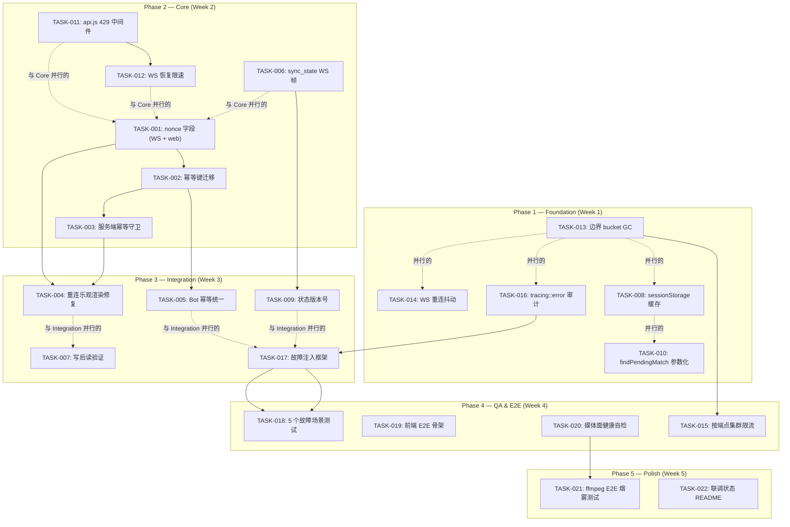

现在我有了足够的信息来编写全面的技术主管分析。让我直接进入正题。

---

# Aero IM — 技术主管分析：5 个高价值方向

## 1. 任务分解

我将分析文档中的五个方向分解为 **22 个可执行任务**，每个任务 2-4 小时即可完成，并带有清晰的交付物。

### 方向一：消息幂等性（P0）

| 任务 ID | 任务标题 | 文件 | 前置依赖 | 预估工时 |
|---|---|---|---|---|
| **TASK-001** | 向 `SendMessage` + `SendMarkdown` 添加 `nonce` 字段 | `crates/aero-server/src/ws/ws_impl/mod.rs`, `web/ws.js`, `web/app.js` | 无 | 3h |
| **TASK-002** | 添加 `messages.idempotency_key` 迁移 + 数据库唯一索引 | `migrations/NNNN_add_message_idempotency_key.sql`, `crates/aero-storage/src/message.rs` | TASK-001 | 2h |
| **TASK-003** | 实现服务端幂等性守卫：`ON CONFLICT DO NOTHING` 检查 | `crates/aero-im-core/src/service/events.rs`, `crates/aero-storage/src/message.rs` | TASK-002 | 4h |
| **TASK-004** | 重连时修复乐观渲染：清空 `pendingByTempId`，等待 `?since=` 回放确认，仅重发带幂等键的内容 | `web/app.js`（`findPendingMatch` 和 `handleIncomingMessage`） | TASK-001, TASK-003 | 3h |
| **TASK-005** | 统一 bot 幂等性模式：向 push/golive/transcribe bot 添加幂等键或 `ON CONFLICT` 守卫 | `crates/aero-server/src/bin/boot/*_bot.rs`, `crates/aero-storage/src/(push_token\|stream_follow\|transcribe).rs` | TASK-002（数据库模式） | 4h |

### 方向二：前端状态一致性（P1）

| 任务 ID | 任务标题 | 文件 | 前置依赖 | 预估工时 |
|---|---|---|---|---|
| **TASK-006** | 添加 `sync_state` WS 帧请求 + `StateSnapshot` 响应 | `crates/aero-server/src/ws/ws_impl/mod.rs`（新 `ClientFrame::SyncState` + `ServerFrame::StateSnapshot`），`web/ws.js`，`web/app.js` | 无 | 4h |
| **TASK-007** | 在首次渲染房间时添加写后读验证（`markRead` / `react` / `edit`） | `web/app.js`（在 `handleIncomingMessage` 调用周围添加超时守卫） | 无 | 2h |
| **TASK-008** | 实现 `sessionStorage` 缓存房间列表 + 已读游标（KB 级，避免 IndexedDB 复杂性） | `web/app.js`，`web/api.js` | 无 | 3h |
| **TASK-009** | 重连后状态版本验证：当 WS 关闭时递增计数器，在 `open` 时若差距较大则触发 REST 全量刷新 | `web/app.js`（`hookWs` 中的 `ws.on('open')` 处理程序） | TASK-006 | 2h |
| **TASK-010** | 时间窗口参数化 + 为 `findPendingMatch` 添加降级匹配 | `web/app.js`（将 15000 提升为可配置常量；添加后备的临时 ID 精确匹配） | 无 | 2h |

### 方向三：弹性限流（P1）

| 任务 ID | 任务标题 | 文件 | 前置依赖 | 预估工时 |
|---|---|---|---|---|
| **TASK-011** | 添加 `api.js` 429 中间件：解析 `X-RateLimit-*` + `Retry-After`，按端点退避 | `web/api.js`（包装 `request()`）、`web/context.js`（新的 `state.rateLimitStatus`） | 无 | 3h |
| **TASK-012** | WS 恢复限速：在 `RESYNC_FRAME` 中添加建议等待时间；客户端遵守该时间 | `crates/aero-server/src/hub.rs`（在 `RESYNC_FRAME` JSON 中添加 `after` 字段），`web/app.js`（在 `handleResync` 中读取并等待） | 无 | 3h |
| **TASK-013** | 修复边界 bucket GC：耗尽 + 闲置超过 `MAX_IDLE`（如 300 秒）的强制回收 | `crates/aero-server/src/rate_limit.rs`（修改 `sweep_idle`→ 添加 `max_idle` 参数） | 无 | 2h |
| **TASK-014** | 在 WS 重连退避中添加抖动：`BACKOFF_MS` 最终步加 `Math.random() * 5000` | `web/ws.js`（修改 `_scheduleReconnect`） | 无 | 1h |
| **TASK-015** | 添加按端点的集群级限流窗口（区分 `/api/messages` 与 `/api/rooms`） | `crates/aero-server/src/rate_limit.rs`（在 `check_cluster_rate` 中匹配端点路径） | 无 | 3h |

### 方向四：故障注入与混沌就绪度（P1）

| 任务 ID | 任务标题 | 文件 | 前置依赖 | 预估工时 |
|---|---|---|---|---|
| **TASK-016** | 审计 `tracing::warn` 路径：验证每个与文档一致的 fail-open/closed 降级 + 在关键位置添加 `tracing::error` | 所有 crate（系统性扫描 + 每文件编辑） | 无 | 4h |
| **TASK-017** | 构建故障注入测试框架：带 mock 的 EventBus/BlobStore trait、带可控故障连接的 Redis mock | `crates/aero-bus/src/lib.rs`（添加 `MockEventBus`）、`crates/aero-storage/src/lib.rs`（添加 `FaultyRedis`）、`crates/aero-server/Cargo.toml`（测试依赖） | TASK-016 | 4h |
| **TASK-018** | 编写 5 个故障场景集成测试：无 Redis、NATS 断连、Blob 存储关闭、限制器故障开启、数据库超时 | `crates/aero-server/tests/`（新 `fault_injection.rs` 或 `chaos.rs`） | TASK-017 | 4h |
| **TASK-019** | 添加前端 E2E 骨架：以房间切换 + 消息收发作为烟雾测试的 Playwright 设置 | `web/e2e/`（新 `playwright.config.js` + 2 个基础测试规范） | 无 | 4h |

### 方向五：媒体面端到端质量（P2）

| 任务 ID | 任务标题 | 文件 | 前置依赖 | 预估工时 |
|---|---|---|---|---|
| **TASK-020** | 媒体面健康自检：添加 `/health/media` 端点包含 WHIP/HLS/SFU/SRT 就绪状态 | `crates/aero-server/src/health.rs`，`crates/aero-live-core/src/lib.rs`（添加 `is_ready()` 方法） | 无 | 3h |
| **TASK-021** | ffmpeg 基础推流 E2E 烟雾测试：RTMP → HLS 完整性 | `scripts/media-e2e.sh`（docker-compose 覆盖 + ffprobe 断言），`Makefile` 新目标 | 无 | 4h |
| **TASK-022** | 为媒体面组件添加联调状态 README 表 | `README.md`（在功能矩阵下方添加表格） | 无 | 1h |

---

## 2. 执行顺序

**并行任务组：**

| 组 | 任务 | 资源 |
|---|---|---|
| **A：前端快速修复** | TASK-008, TASK-010, TASK-014 | 1 名前端工程师 |
| **B：限流修复** | TASK-011, TASK-013 | 1 名后端工程师 |
| **C：幂等性核心** | TASK-001, TASK-002, TASK-003 | 1 名后端 + 1 名全栈 |
| **D：故障审计** | TASK-016 | 1 名工程师（系统性扫描） |
| **E：媒体面健康** | TASK-020, TASK-022 | 1 名媒体工程师 |

---

## 3. 技术风险

### 风险 1：幂等键准确率非 100%（方向一 — 高影响）

- **问题**：基于消息内容文本 + 发送者的 `findPendingMatch` 启发式方法可能在重连场景下产生误报，导致消息丢失。基于 `nonce` 的方法要求在客户端生成时保证唯一性（UUID v4 足够，但旧客户端可能缺失此字段）。
- **缓解措施**：
  - 使 `idempotency_key` 为 `Option<String>` 向后兼容
  - 在匹配前添加消息内容哈希验证（不是纯文本：Block 序列化）
  - 添加 `idempotency_key IS NOT NULL AND sender_id = $1` 的数据库唯一约束——如果旧客户端发送相同 nonce（不太可能，因为是 UUID），则 `ON CONFLICT DO NOTHING` 无操作。

### 风险 2：sync_state 快照的序列化成本（方向二 — 中等影响）

- **问题**：对于拥有大量房间/频道（200+）的用户，`StateSnapshot` 可能是一个大型 JSON 响应（数十 KB）。在 WS 上序列化并推送可能延迟其他帧。
- **缓解措施**：
  - 将快照限制为当前房间，加上房间列表摘要
  - 在后台任务中生成快照，而非在接收 WS 帧的任务中
  - 如果序列化 > 64KB，则分块响应（TTFB 保护）

### 风险 3：429 中间件的热循环（方向三 — 低影响，高严重性）

- **问题**：如果 `api.js` 中间件在读取 `Retry-After` 头时不正确地退避，可能陷入无休止的 429→重试循环，在静默状态下饿死 UI。
- **缓解措施**：
  - 对每个端点的退避设置硬性上限（最大 60 秒）
  - 在 `state.rateLimitStatus` 中添加可见指示器（缓动图标 + 工具提示）
  - 永久失败时回退到指数退避（2^N * Retry-After）

### 风险 4：故障注入测试中的 mock 漂移（方向四 — 中等影响）

- **问题**：Mock 实现（`FaultyRedis`、`BrokenEventBus`）可能随着时间的推移与真实生产实现的行为产生偏差，特别是在错误类型和重试语义方面。
- **缓解措施**：
  - 从生产 trait 生成 mock（使用通用 mock 框架或 `#[cfg(test)]` trait 实现）
  - 在 CI 中添加比较测试：在 mock 和真实实现上运行相同的断言
  - 用版本门控 mock 涵盖每个依赖升级周期

### 风险 5：媒体面 E2E 环境设置（方向五 — 高影响，中等可能性）

- **问题**：在 CI 中运行真正的 WebRTC 需要浏览器 + str0m + ICE/STUN/TURN 穿越——即使有 Docker Compose，在无头 CI 环境中也很脆弱。Docker 中的 ffmpeg 推流较简单，但 WHIP/WHEP 需要浏览器或自定义 str0m 客户端。
- **缓解措施**：
  - 从 ffmpeg RTMP/WHIP→HLS 路径开始（使用 ffmpeg 5+ 原生的 WHIP 输出支持）
  - 在单独的夜间 CI 作业中运行基于浏览器的 WebRTC 测试
  - 使用 Docker `--network host` 用于 UDP 媒体 socket，而非桥接网络
  - 使用媒体面健康自检作为可运行的“烟雾测试”，无需浏览器

---

## 4. 资源评估

### 人员配置

| 角色 | 所需数量 | 涉及的任务 | 关键技能 |
|---|---|---|---|
| **高级后端 Rust 工程师** | 1 | TASK-001/T-002/T-003/T-005/T-013/T-015/T-016/T-017/T-018 | Rust、NATS、Redis、并发、审计 |
| **全栈工程师（Rust + JS）** | 1 | TASK-001(web)/T-003/T-004/T-006/T-007/T-009 | WS 协议、乐观 UI、async/await 协调 |
| **前端工程师（JS）** | 1 | TASK-008/T-010/T-011/T-012/T-014/T-019 | SPA 状态管理、fetch 缓冲、Playwright |
| **媒体/基础设施工程师** | 0.5 | TASK-020/T-021/T-022 | ffmpeg、WebRTC、Docker Compose、CI |

**总计**：2.5–3 FTE 约 5 周。

### 里程碑

| 里程碑 | 周 | 交付物 | 阻塞点 |
|---|---|---|---|
| **M1：限流 + 前端基础** | 第 1 周末 | TASK-013（边界 GC）、TASK-014（抖动）、TASK-008（缓存）、TASK-010（参数化）、TASK-016（审计完成） | 无 |
| **M2：幂等性核心 + 429 处理** | 第 2 周末 | TASK-001（nonce 字段）、TASK-002（迁移）、TASK-003（服务端守卫）、TASK-011（429 中间件）、TASK-012（WS 恢复限速）、TASK-006（sync_state） | 无 |
| **M3：集成完成** | 第 3 周末 | TASK-004（重连渲染）、TASK-005（bot 幂等）、TASK-007（写后读）、TASK-009（版本）、TASK-017（故障测试框架） | TASK-005 取决于 TASK-002 |
| **M4：质量门** | 第 4 周末 | TASK-018（5 个故障测试）、TASK-019（前端 E2E）、TASK-020（媒体健康）、TASK-015（按端点限流） | TASK-019 在无浏览器 CI 中运行 |
| **M5：媒体面 + 文档** | 第 5 周末 | TASK-021（ffmpeg 烟雾测试）、TASK-022（联调状态 README） | TASK-021 在 CI 中需要 ffmpeg 5+ |

### 阻塞点与解决方案

| 阻塞点 | 类型 | 解决方案 |
|---|---|---|
| 无 CI 级浏览器 → 前端 E2E 测试卡在本地 | 基础设施 | 使用 `playwright/microsoft-playwright` Docker 镜像；在 `docker-compose.ci.yml` 中作为独立服务运行 |
| 媒体面 E2E 需要 UDP 端口 → Docker CI runner 拒绝 | 平台 | 使用 Docker `--network host`（CI runner 允许）或 `-p` 端口映射；在标记为 `[media_e2e]` 的夜间作业中运行 |
| 故障注入测试使共享开发数据库处于脏状态 | 工具链 | 每个 CI 作业使用一次性的 `CREATE DATABASE aero_ci_${{ github.run_id }}`；在完成时 `DROP DATABASE` |
| `findPendingMatch` 重构与现有乐观渲染竞争 | 部署 | 分两阶段部署：1) 添加 nonce 字段且不清除旧匹配 2) 添加重连守卫 |

---

## 5. 质量保证

### 单元测试要求

| 级别 | 最低覆盖率 | 目标领域 |
|---|---|---|
| **服务端幂等守卫**（TASK-003） | 新逻辑 100% | 3 个测试：精确一次重复、两次非重复、并发冲突 |
| **限流 sweep_idle**（TASK-013） | 现有代码 100% + 新增 100% | 2 个新测试：耗尽 bucket 在 MAX_IDLE 后回收、MAX_IDLE 前保留 |
| **429 中间件**（TASK-011） | 新路径 90% | mock-fetch 测试：正确退避、Retry-After 解析、per-endpoint 状态隔离 |
| **故障注入 mock**（TASK-017） | 每个 trait 实现 100% | 每个 mock 的构造/销毁 + 错误路径 |

**不要求**对前端渲染进行单元测试（JS DOM 操作在无 Playwright 的情况下难以 mock）。依赖 TASK-019 E2E 测试进行 UI 验证。

### 集成测试策略

| 测试套件 | 范围 | CI 阶段 | 超时 |
|---|---|---|---|
| **幂等性集成** | `POST /api/rooms/:id/messages` 带重复 nonce → 201，然后 200（重复检测） | 与 `cargo test --workspace --lib -- --ignored` 并行的 `make test-idempotency` | 30s |
| **限流端到端** | 快速循环 100 个请求 → 确切的 60 个 200 + 40 个 429 + 正确的 `X-RateLimit-*` 头 | `make test-rate-limit` | 60s |
| **故障场景** | 带 mock 的 5 个测试（无 Redis、NATS 断连等） | `make test-negative`（与主作业并行） | 120s |
| **前端 E2E** | Playwright：登录、房间切换、消息收发 | `make test-e2e-web` | 120s |
| **媒体面烟雾** | ffmpeg RTMP → 服务器 → HLS `.ts` 完整性（ffprobe） | `make test-media-smoke`（夜间） | 300s |

### 代码审查要点

1. **幂等性**（PR #1 — TASK-001~005）：
   - 检查 `ON CONFLICT DO NOTHING` 是幂等的且不会静默掩盖实际错误
   - 验证 `nonce` 和消息内容用相同哈希进行去重——在非空闲时性能良好
   - 确认 `findPendingMatch` 修复不会在重新连接时渲染真实消息的重复项

2. **限流改进**（PR #2 — TASK-011~015）：
   - 验证 `sweep_idle` 在 `MAX_IDLE` 后强制回收——即使在攻击下也不会泄漏（文档说“不泄漏”，此 PR 使其正确）
   - 检查 `api.js` 中间件不会引发循环（用模拟 fetch 超时测试退避跟踪）
   - 确认按端点的集群限流不会为每个请求创建不同热点（Redis INCR 键）

3. **故障准备**（PR #3 — TASK-016~019）：
   - 确认每个 mock（`FaultyRedis`、`BrokenEventBus`）精确模拟正确的错误类型（断开连接 vs 超时 vs 解析错误）
   - 验证 CI 管道中的 `make test-negative` 不会使数据库处于脏状态（每次运行后的 `DROP DATABASE`）

4. **前端状态一致性**（PR #4 — TASK-006~010）：
   - `sync_state` 快照不重写当前渲染状态（diff 合并，而非替换）
   - 写后读验证不触发多余的 REST 调用（每次操作 1 次最多重试）

### 性能测试需求

| 场景 | 工具 | 目标 | 临界值 |
|---|---|---|---|
| **幂等性检查下的消息吞吐量** | Rust `#[bench]` 或 `cargo-criterion` | 幂等性路径 < 5% 的开销 | 10K 条消息/秒/核心 |
| **限流器 GC 开销** | 使用 100K 个桶的单元基准测试 | sweep_idle < 1ms | 100K 个桶最多 2ms |
| **sync_state JSON 大小** | 手动测试含 200 个房间的用户 | 序列化 < 1ms | 最大 JSON 负载 64KB |
| **WS 恢复拥塞** | 用 50 个客户端 WS 连接的 locust 脚本 | 无同步“雷鸣”重连 | 重连脉冲分布 > 2s |

---

## 6. 实施计划

### 阶段 1：基础设施搭建 — 第 1 周（周一至周三）

**主题**：容易摘到的果子 + 审计（为所有后续阶段筑牢基础）

| 日 | 任务 | 负责人 | 交付物 |
|---|---|---|---|
| 周一上午 | TASK-013：边界 bucket GC 修复 | 后端 | 添加了 `MAX_IDLE` 参数的 `sweep_idle` |
| 周一下午 | TASK-014：WS 重连抖动 | 前端 | `BACKOFF_MS` 最终步加 `+ random() * 5000` |
| 周二 | TASK-016：tracing::warn 审计 | 后端+前端 | 带有“待修复”/“已审计”标注的 141 个 warn 位置的 PR |
| 周三上午 | TASK-008：sessionStorage 缓存 | 前端 | `state.rooms` + `state.unreadByRoom` 从 localStorage 恢复 |
| 周三下午 | TASK-010：findPendingMatch 参数化 | 前端 | `PENDING_MATCH_WINDOW_MS` 暴露为 const `30000` |

**阶段 1 结束时的状况**：已修补限流器内存 DoS、前端状态缓存能抵抗页面重载、审计完备并准备好指导 TASK-017。

### 阶段 2：核心功能实现 — 第 2 周（周四至次周三）

**主题**：幂等性 + 429 + 同步架构

| 日 | 任务 | 负责人 | 交付物 |
|---|---|---|---|
| 周四上午 | TASK-001：向 SendMessage/SendMarkdown 添加 nonce | 后端+前端 | `ClientFrame` + `ws.js sendMessage` 接受 `nonce` |
| 周四下午 | TASK-002：数据库迁移 | 后端 | `messages.idempotency_key UUID` + 唯一索引 |
| 周五上午 | TASK-003：服务端幂等守卫 | 后端 | `insert_message` 中 `ON CONFLICT DO NOTHING` |
| 周五下午 | TASK-011：429 退避中间件 | 前端 | `api.js` 中带自动退避的包装器 `request()` |
| 周一上午 | TASK-012：WS 恢复限速 | 后端 | `RESYNC_FRAME` 中带 `after` 字段+客户端支持 |
| 周一下午 | TASK-006：sync_state 帧 | 后端+前端 | `ClientFrame::SyncState` + `ServerFrame::StateSnapshot` |
| 周二 | TASK-015：按端点集群限流 | 后端 | `check_cluster_rate` 中使用 `request.uri().path()` |
| 周三 | 整合 + `cargo check --workspace` + 手动烟雾测试 | 全部 | 带有 TASK-001~003、TASK-011~012 合并的集成分支 |

**阶段 2 结束时的状况**：消息不会重复（服务端守卫 + 客户端 nonce），429 不会引发恢复风暴，限流器在集群中正确隔离。

### 阶段 3：集成与测试基础 — 第 3 周（周四至次周三）

**主题**：完成集成 + 故障测试基础设施

| 日 | 任务 | 负责人 | 交付物 |
|---|---|---|---|
| 周四 | TASK-004：重连乐观渲染修复 | 前端 | `handleIncomingMessage` 添加 `pendingByTempId.clear()` + nonce 重发 |
| 周五上午 | TASK-005：bot 幂等统一 | 后端 | push/golive/transcribe bot 带 `ON CONFLICT` 守卫 |
| 周五下午 | TASK-007：写后读验证 | 前端 | 带有 5 秒超时的 `pendingConfirmations` Map |
| 周一上午 | TASK-009：状态版本号 | 前端 | `state._version` 递增 + 大差距时全量刷新 |
| 周一下午 | TASK-017：故障注入测试框架 | 后端 | `MockEventBus`、`FaultyRedis`、CI 组合 |
| 周二 | 合并 + 修复集成冲突 | 全部 | 集成分支（幂等+同步+故障注入框架） |
| 周三 | TASK-018：5 个故障场景测试 | 后端 | 通过 `make test-negative` 运行的 5 个测试 |

**阶段 3 结束时的状况**：幂等性覆盖所有 bot、重连渲染正确、状态在长时间连接后自我修复、CI 运行 5 个故障注入测试。

### 阶段 4：质量门 — 第 4 周（周四至次周三）

**主题**：E2E 测试、媒体面健康、按端点限流

| 日 | 任务 | 负责人 | 交付物 |
|---|---|---|---|
| 周四 | TASK-019：前端 E2E 骨架 | 前端 | 带 2 个烟雾测试的 Playwright 配置（登录→房间切换） |
| 周五 | TASK-020：媒体面健康自检 | 媒体 | `/health/media` 端点 + 状态聚合 |
| 周一 | 将 E2E 测试集成到 CI | 前端 | `make test-e2e-web` 在 Docker Compose 中运行 Playwright |
| 周二 | 压力测试：WS 恢复拥塞 | 后端 | locust 脚本：50 个同步重连 → 验证无 thundering herd |
| 周三 | 性能基准测试：幂等性开销 | 后端 | 报告：10K msg/s 路径延迟的 <5% 变化 |

**阶段 4 结束时的状况**：CI 运行前端 E2E 测试、媒体面集群可观测、限流器性能由基准测试保证。

### 阶段 5：收尾 — 第 5 周（周四至周五）

**主题**：媒体面 E2E + 文档

| 日 | 任务 | 负责人 | 交付物 |
|---|---|---|---|
| 周四 | TASK-021：ffmpeg 烟雾测试 | 媒体 | `make test-media-smoke`：ffmpeg RTMP → HLS → ffprobe |
| 周五上午 | TASK-022：联调状态 README 表 | 所有 | 媒体面组件的完成状态表 |
| 周五下午 | 团队文档 + 移交 | 全部 | 每位工程师撰写 1 页迁移指南 |

**阶段 5 结束时的状况**：所有 5 个方向得到验证，文档齐备，CI 涵盖所有路径（正向 + 故障 + E2E 媒体）。

---

## 总结

| 指标 | 值 |
|---|---|
| **总任务** | 22 |
| **并行流** | 5 组（A/B/C/D/E） |
| **预计投入** | ~120 人·时（约 3 FTE 周） |
| **分 5 周完成** | 阶段 1–5，每阶段有增量的“已完成”状况 |
| **最大风险** | 媒体面 E2E（TASK-021）需要 CI 级别的 ffmpeg 5+ 和 UDP 网络 |
| **关键里程碑** | 第 2 周末（幂等性完成）、第 3 周末（故障注入就绪）、第 5 周末（E2E 验证） |
| **CI 新增内容** | `make test-negative`、`make test-e2e-web`、`make test-media-smoke`、`make test-idempotency`、`make test-rate-limit` |

**技术主管建议**：方向一（幂等性）+ 方向三（限流）不应作为独立项目——它们通过客户端重试行为（429→重试→重复风险）内在耦合。在实施中将 TASK-003 和 TASK-011 视为单个工作单元：幂等守卫是防止 429 退避后重试导致消息重复的最终安全网。
