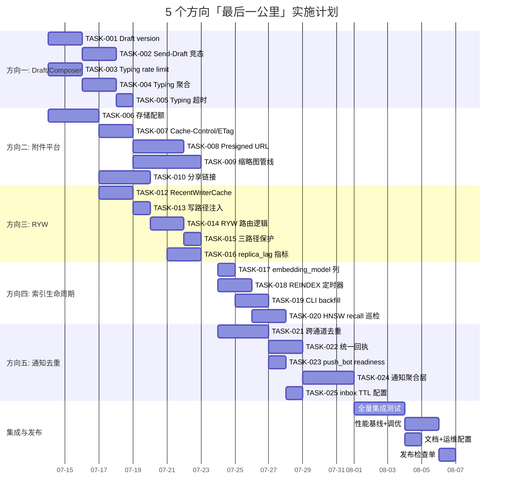

Now I have thorough context across all 5 directions. Here's my Tech Lead analysis.

---

# Tech Lead 分析报告：5 个「最后一公里」生产级缺口

## 1. 任务分解

### 方向一：Draft 冲突与 Composer 状态收敛

| 任务 ID | 标题 | 涉及文件 | 前置依赖 | 预估工时 | 验收标准 |
|--------|------|---------|---------|---------|---------|
| **TASK-001** | Draft 增加 `version` 乐观锁 | `migrations/NNNN_draft_version.sql`, `crates/aero-storage/src/draft.rs` | 无 | 2h | `upsert` 含 `WHERE version = N`，版本冲突返回 `Conflict`；`Draft` struct 含 `version: i32`；`edit_message` 帧可提交 `expected_draft_version` |
| **TASK-002** | Send → Draft 竞态保护：发送时原子清除草稿 iff version 匹配 | `crates/aero-im-core/src/service/messages.rs`, `crates/aero-storage/src/draft.rs`（新增 `compare_and_delete`） | TASK-001 | 3h | `send_message` 成功后原子删草稿：`DELETE FROM message_drafts WHERE participant_id=$1 AND room_id=$2 AND version=$3`；version 不匹配不删（说明 draft 已更新） |
| **TASK-003** | Typing 加入 per-participant rate limit (5s 冷却) | `crates/aero-im-core/src/service/reads.rs`, `crates/aero-storage/src/draft.rs`（新增 typing 表或进程内 RateLimiter） | 无 | 3h | 同一 (participant, room) 每 5s 最多发 1 帧 `Typing{on:true}`；`on:false` 不受限；typing 帧不走 NATS |
| **TASK-004** | Typing 聚合扇出：大房间只发 "N 人正在输入" | `crates/aero-im-core/src/service/reads.rs`, `crates/aero-storage/src/draft.rs`（聚合状态） | TASK-003 | 4h | 25+ 成员房间聚合为 `Typing{on:true, count: 3}`；小房间保持 per-user；Redis sorted-set 管理活跃 typing 者，超时 10s 自动过期 |
| **TASK-005** | Typing 加入自动超时清除 | `crates/aero-im-core/src/service/reads.rs` | TASK-003 | 2h | Redis 或进程 HashMap 计时：收到 `on:true` 后 10s 无后续帧自动广播 `Typing{on:false}`；重启清空不 panic |

### 方向二：附件平台

| 任务 ID | 标题 | 涉及文件 | 前置依赖 | 预估工时 | 验收标准 |
|--------|------|---------|---------|---------|---------|
| **TASK-006** | 添加用户/工作区存储配额 | `migrations/NNNN_storage_quota.sql`, `crates/aero-storage/src/blob.rs`, `crates/aero-server/src/routes/routes.rs` | 无 | 4h | `blobs` 表加 `size` 索引用于 `SUM`；上传前 `SELECT COALESCE(SUM(size),0) FROM blobs WHERE owner_id=$1`；`quota_bytes` 配置项（默认 500MB）；超 429 |
| **TASK-007** | 为 blob 下载添加 Cache-Control 和 ETag | `crates/aero-server/src/routes/routes.rs`（`blob_download`） | 无 | 2h | `ETag: W/"<sha256_prefix>"`；`Cache-Control: private, max-age=31536000, immutable`；`Last-Modified: <finalized_at>`；条件请求 304 |
| **TASK-008** | 添加 presigned URL（S3 直接下载） | `crates/aero-storage/src/s3_blob_store.rs`（新增 `get_presigned_url`）, `crates/aero-storage/src/blob_store.rs` trait | TASK-007 | 4h | `BlobStore` trait 新增 `async fn presigned_url(&self, id: BlobId, ttl: Duration) -> Result<Option<String>>`；S3 实现返回 presigned URL；LocalFs 返回 `None`；`blob_download` 检测 presigned URL 存在则 302 |
| **TASK-009** | 缩略图管线（WebP 缩略图生成+缓存） | `crates/aero-storage/src/blob.rs`（thumbnail 列）, `crates/aero-storage/Cargo.toml`（加 image 库）, `crates/aero-server/src/routes/routes.rs` | TASK-007 | 6h | 上传 `FileKind::Image` 时生成 max 256×256 WebP；缩略图存 S3 `thumbnails/{id}.webp` 或 LocalFs 同目录；GET `?thumb=1` 返回缩略图；缩略图生成失败不阻塞上传 |
| **TASK-010** | 过期分享链接功能 | `migrations/NNNN_share_links.sql`, `crates/aero-storage/src/share_link.rs`, `crates/aero-server/src/routes/routes.rs` | TASK-006 | 4h | `share_links` 表：`id, blob_id, token, expires_at, created_by`；`POST /api/blobs/:id/share?ttl=3600` 返回 `{token}`；`/s/:token` 无需 auth 下载；过期 410；`sweep_expired_share_links` 定时器 |
| **TASK-011** | 添加媒体转码（视频→HLS 管道） | `crates/aero-storage/src/blob.rs`（转码状态）, `crates/aero-server/src/routes/routes.rs` | 无（VOD 系新功能） | 8h | `FileKind::Video` 上传触发异步转码；复用 `aero-live-hls` 的 `FlvToTsConverter`（仅 MP4）；转码期间返回 `202 {status: "processing"}`；就绪后返回 HLS URL |

**注**：TASK-011（转码管道）是大型功能，可在 MVP 中拆出。MVB 建议只做 TASK-006~TASK-010。

### 方向三：Read-Your-Writes 一致性

| 任务 ID | 标题 | 涉及文件 | 前置依赖 | 预估工时 | 验收标准 |
|--------|------|---------|---------|---------|---------|
| **TASK-012** | 实现 `RecentWriterCache` | `crates/aero-server/src/ryw_cache.rs`（新建）, `crates/aero-storage/src/lib.rs` | 无 | 3h | 进程内 `HashMap<ParticipantId, Instant>` + TTL（默认 5s）；`mark_writer(uid)` / `is_recent_writer(uid) -> bool`；线程安全 |
| **TASK-013** | 写路径注入 `RecentWriterCache` | `crates/aero-im-core/src/service/messages.rs`（send/edit/delete/reaction）, `crates/aero-im-core/src/service/reads.rs`（mark_read） | TASK-012 | 2h | 每次写操作由 `ImService` 调用 `ryw.mark_writer(actor)` |
| **TASK-014** | Read-Your-Writes 路由逻辑 | `crates/aero-server/src/state.rs`（新增 `ryw_pg(&self, uid) -> &PgPool`） | TASK-012, TASK-013 | 3h | `fn ryw_pg(&self, participant_id) -> &PgPool`：若 `is_recent_writer(uid)` 返回 `&self.pg` 否则 `&self.pg_read` |
| **TASK-015** | RYW 保护三个读路径 | `crates/aero-server/src/search.rs`, `crates/aero-server/src/analytics.rs`, `crates/aero-server/src/ai_usage.rs` | TASK-014 | 2h | 三个 handler 改用 `s.ryw_pg(auth.participant_id)` 而非 `s.pg_read`；搜索加了 `?consistency=strong` 查询参数时强制执行主库 |
| **TASK-016** | 添加 replica_lag 指标 + readiness 探针 | `crates/aero-server/src/state.rs`（`replica_lag_secs` gauge）, `crates/aero-server/src/routes/routes.rs`（`health_ready`） | 无 | 3h | `aero_replica_lag_secs` gauge 输出 PG `pg_stat_replication.replay_lag`；`/health/ready` 中 `deps.replica_lag` 字段；lag > 30s 标记 warning（非 blocking） |

### 方向四：Embedding/FTS 索引生命周期

| 任务 ID | 标题 | 涉及文件 | 前置依赖 | 预估工时 | 验收标准 |
|--------|------|---------|---------|---------|---------|
| **TASK-017** | 添加 `embedding_model` 列 + 版本追踪 | `migrations/NNNN_embedding_model.sql`, `crates/aero-storage/src/message/mod.rs` | 无 | 2h | `messages` 加 `embedding_model text` 列；`upsert` embedding 时写入模型标识（当前 `voyage-3`）；AI 服务构造时暴露 `model_name()`；查询时可选筛选模型 |
| **TASK-018** | 加入 REINDEX 定时器 + 监控告警 | `crates/aero-server/src/bin/boot/background.rs`, `crates/aero-storage/src/message/mod.rs`（新增 `reindex_if_bloated`） | 无 | 4h | 每月一次 `REINDEX INDEX CONCURRENTLY messages_embedding_hnsw` 和 `messages_search_tsv_gin`；配置 `AERO_REINDEX_INTERVAL_DAYS`（默认 30，0 禁）；reindex 失败仅 warn 不 panic |
| **TASK-019** | 添加 CLI backfill 子命令 | `crates/aero-server/src/bin/cli.rs`（新增 `index backfill-fts` / `index backfill-embeddings`） | TASK-017 | 3h | `aero-cli index backfill-fts`：`UPDATE messages SET searchable_text = searchable_text` 加 `WHERE` 可限工作区；`aero-cli index backfill-embeddings`：全量 enqueue Embed 任务（受预算约束） |
| **TASK-020** | 添加 HNSW 无声退化检测（recall 巡检） | `crates/aero-storage/src/message/search.rs`, `crates/aero-server/src/metrics.rs` | TASK-018 | 4h | 定时器：随机选 20 条消息做向量自查询，计算 recall@10（主索引 vs 顺序扫描）；`aero_hnsw_recall` gauge；recall < 0.95 告警日志；配置采样间隔 |

### 方向五：多通道通知去重与 SLA

| 任务 ID | 标题 | 涉及文件 | 前置依赖 | 预估工时 | 验收标准 |
|--------|------|---------|---------|---------|---------|
| **TASK-021** | 建立跨通道去重机制 | `migrations/NNNN_channel_delivery.sql`, `crates/aero-storage/src/notification.rs` | 无 | 4h | `notification_delivery` 表：`notification_id, channel enum(inbox/push/email), delivered_at, source_path`；总线侧 `push_bot`/webhook 消费前 `INSERT ON CONFLICT DO NOTHING` 去重；`push_bot` 消费时携带 `source_path` 标签 |
| **TASK-022** | 统一已读回执 | `crates/aero-storage/src/notification.rs`, `crates/aero-server/src/push_bot.rs` | TASK-021 | 3h | `mark_read` 时通知到 inbox + push 通道；push 通道收到回执后 cancel 等待推送的同一通知（FCM `android.collapse_key` 覆盖） |
| **TASK-023** | push_bot 加入 readiness 探针 | `crates/aero-server/src/push_bot.rs`（暴露 `fn is_healthy()`）, `crates/aero-server/src/routes/routes.rs`（`health_ready`） | 无 | 2h | NATS consumer `aero-push` 实时回 ping；`/health/ready` 返回 `push: "ok"`/`"degraded"`/`"fail"`；`AERO_PUSH_READINESS` env gate |
| **TASK-024** | 跨通道通知聚合层 | `crates/aero-server/src/notification_router.rs`（新建） | TASK-021, TASK-022 | 5h | 统一 `NotificationRouter`：inbox insert + push + webhook 作为子步骤；同一通知 `channel_delivered` 三通道全部完成才标记完成；任一通道失败不影响其他 |
| **TASK-025** | inbox TTL 配置暴露到运维层 | `crates/aero-server/src/bin/boot/retention.rs`（`NOTIFICATION_RETENTION_DAYS` 已实现但需文档+ metric） | 无 | 1h | 文档记录 `AERO__SERVER__NOTIFICATION_RETENTION_DAYS` 默认 90 天；`aero_notification_swept_total` counter；通知归档配置示例 |

---

## 2. 执行顺序与依赖图

```mermaid
graph TD
    subgraph 方向一: Draft/Composer
        T001[TASK-001: Draft version]
        T002[TASK-002: Send-Draft 竞态]
        T003[TASK-003: Typing rate limit]
        T004[TASK-004: Typing 聚合]
        T005[TASK-005: Typing 超时]
        T001 --> T002
        T003 --> T004
        T003 --> T005
    end

    subgraph 方向二: 附件平台
        T006[TASK-006: 存储配额]
        T007[TASK-007: Cache-Control/ETag]
        T008[TASK-008: Presigned URL]
        T009[TASK-009: 缩略图管线]
        T010[TASK-010: 分享链接]
        T011[TASK-011: 媒体转码]
        T007 --> T008
        T006 --> T010
    end

    subgraph 方向三: RYW
        T012[TASK-012: RecentWriterCache]
        T013[TASK-013: 写路径注入]
        T014[TASK-014: RYW 路由]
        T015[TASK-015: 三路径保护]
        T016[TASK-016: replica_lag 指标]
        T012 --> T013 --> T014 --> T015
        T016 -.-> T015
    end

    subgraph 方向四: 索引生命周期
        T017[TASK-017: embedding_model 列]
        T018[TASK-018: REINDEX 定时器]
        T019[TASK-019: CLI backfill]
        T020[TASK-020: HNSW recall 巡检]
        T017 --> T019
        T018 --> T020
    end

    subgraph 方向五: 通知去重
        T021[TASK-021: 跨通道去重]
        T022[TASK-022: 统一回执]
        T023[TASK-023: push_bot readiness]
        T024[TASK-024: 通知聚合层]
        T025[TASK-025: inbox TTL 配置]
        T021 --> T022 --> T024
        T021 --> T023
    end

    subgraph 可选并行组
        T001 -.->|独立| T003
        T012 -.->|独立| T016
        T006 -.->|独立| T007
        T017 -.->|独立| T018
        T021 -.->|独立| T025
    end
```

**可并行执行的任务组**（无跨组依赖）：

| 并行组 | 任务 | 理由 |
|-------|------|------|
| **群 A** | TASK-001 + TASK-003 | Draft 锁定和 Typing 限流不共享代码 |
| **群 B** | TASK-006 + TASK-007 | 配额和缓存头是 blob handler 的独立层面 |
| **群 C** | TASK-012 + TASK-016 | RYW 缓存和数据面指标可并行开发 |
| **群 D** | TASK-017 + TASK-018 | Embedding 模型列和 REINDEX 是正交的 |
| **群 E** | TASK-021 + TASK-025 | 去重表和 TTL 配置没直接依赖 |

---

## 3. 技术风险

### 3.1 方向一：Draft/Composer

| 风险 | 级别 | 说明 | 缓解 |
|------|------|------|------|
| Web 客户端「无声冲突」用户体验 | 🟡 中 | 当前无版本，用户跨设备不感知冲突。加版本后 Web 恢复 composer 时可能碰到 409 | 优雅降级：`DraftGuard` 接口，冲突时保留用户本地编辑，提示"另一设备有更新，保留哪个？" |
| Typing 聚合在 10 人频道误触 | 🟢 低 | 25+ 人阈值当前 OK，但中文频道成员少 | 阈值可配置 `AERO_TYPING_AGGREGATE_AFTER` |

### 3.2 方向二：附件平台

| 风险 | 级别 | 说明 | 缓解 |
|------|------|------|------|
| **缩略图库性能** | 🟠 高 | `image` crate 解码大图（如 10MB iPhone 照片）在请求线程上跑会阻塞其他 handler | 用 `tokio::task::spawn_blocking`；设 `MAX_THUMBNAIL_PIXELS=4096x4096` 防止 OOM；缩略图失败不阻塞上传 |
| S3 presigned URL 安全 | 🟡 中 | token 泄露导致未授权访问 | TTL 默认 300s（5min）；`share_link` 用独立 `token`（SHA256 随机串）绑定 blob_id；可撤销 |
| 配额竞态 | 🟡 中 | 并发上传两文件，SUM 都检测够但超实际 | `SELECT SUM...FOR UPDATE` 用行锁保护；或乐观重试（409→ 重新校验） |
| 转码管道复用度 | 🔴 高 | `aero-live-hls` 的 `FlvToTsConverter` 预期 RTMP 输入，MP4 测试不足 | VOD 转码推 MVP 外；MVP 只做预览缩略图 |

### 3.3 方向三：Read-Your-Writes

| 风险 | 级别 | 说明 | 缓解 |
|------|------|------|------|
| **进程内存状态，多实例不共享** | 🟠 高 | `RecentWriterCache` 是进程级 HashMap，A 进程「写」了但 B 进程「读」时 miss | 追加 Redis 版 `RecentWriterCache`（可选），`zadd writer_pool:{uid} <now>` TTL 5s；进程级 + Redis 双写，读时任意命中即可；单个实例部署下不走 Redis |
| 开发与生产校验路径一致性问题 | 🟡 中 | 单实例时 `pg_read == pg`，代码走了 ryw 逻辑仍走同一 pool；加副本后才暴露 | CI 需跑 `REPLICA_URL` 双池测试（第 2 个 PG 容器，不设真正复制，仅验证 pool 切换逻辑）|
| 搜索路径加 `?consistency=strong` 参数后性能 | 🟢 低 | 无副本部署下 `pg_read == pg`，参数无开销 | 仅解析参数时多做一次 pool 选择 |

### 3.4 方向四：索引生命周期

| 风险 | 级别 | 说明 | 缓解 |
|------|------|------|------|
| **REINDEX CONCURRENTLY 建造时间** | 🟠 高 | 大表（100M+ rows）HNSW reindex 可能跑数小时 | REINDEX 频率默认 30 天；用 `REINDEX INDEX CONCURRENTLY`（不锁写）；只在低峰做；可禁(`=0`) |
| HNSW recall 巡检假阳性 | 🟢 低 | 随机 20 条样本可能偶然低 recall | 每次抽样 50 条；连续 3 次低于阈值才告警 |
| embedding_model 迁移时全量回填 | 🟡 中 | 旧行 `embedding_model IS NULL` 要补写 | backfill-embeddings CLI 自动设置；新行 upsert 时由 `AiWorker` 写入 |

### 3.5 方向五：通知去重与 SLA

| 风险 | 级别 | 说明 | 缓解 |
|------|------|------|------|
| 跨通道去重表的写放大 | 🟡 中 | 每通知 N 通道 = N 行 INSERT，@everyone 可到数千行 | 批量 INSERT（现有 `insert_many` 模式）；`notification_delivery` 只插幂等键，无通知体 |
| push_bot readiness 探针导致频繁重启 | 🟢 低 | NATS consumer 故障时 readiness fail→k8s 踢出 pod | 只标记 `degraded` 不踢；仅永久断开才 fail；加入 `AERO_PUSH_READINESS` env gate 可选不探 |
| bundle flush 延迟影响体验 | 🟡 中 | 30s 默认延迟让通知感觉慢 | 默认降到 10s（`AERO_BUNDLE_DEADLINE_SECS=10`）；`@mention` 从不捆绑（已实现） |

---

## 4. 资源评估

### 4.1 人员需求

| 角色 | 技能要求 | 数量 | 负责任务 |
|------|---------|------|---------|
| **后端工程师 A**（主） | Rust 中级+，tokio/axum/sqlx | 1 | TASK-001, TASK-002, TASK-012~TASK-015, TASK-017~TASK-019 |
| **后端工程师 B**（主） | Rust 中级+，Postgres/Redis | 1 | TASK-003~TASK-005, TASK-021~TASK-025, TASK-016 |
| **后端工程师 C**（全栈偏存储） | Rust 中级+，S3/bucket 经验 | 1 | TASK-006~TASK-010（附件平台核心） |
| **前端工程师** | JS/ES2020, WebSocket 帧处理 | 0.5 | `web/` 端适配 DraftVersion、`?consistency=strong` 参数、缩略图 `?thumb=1` |
| **QA** | Rust 集成测试 + CI 流水线 | 0.5 | 为 TASK-001~TASK-025 补集成测试、CI `cloudsmith-check` 更新 |

**最低可行团队**：2 后端（全量）+ 0.5 QA = 2.5 人，6 周

### 4.2 关键里程碑

| 里程碑 | 时间点 | 交付物 | 依赖 |
|-------|-------|--------|------|
| **M1: 基础防御** | 第 1 周末 | TASK-001（Draft version）、TASK-003（Typing 限流）、TASK-006（配额）、TASK-012（RecentWriterCache）全部完成 | 无 |
| **M2: 读一致性** | 第 2 周末 | TASK-013~TASK-015 完成，搜索/分析/AI用量三路径切 RYW 保护 | M1 |
| **M3: 附件平台 MVP** | 第 3 周末 | TASK-007~TASK-010 完成，缩略图、Cache、share-links 上线 | M1 |
| **M4: 索引生命周期** | 第 4 周末 | TASK-017~TASK-020 完成，REINDEX + CLI backfill 就绪 | M2 |
| **M5: 通知底盘** | 第 5 周末 | TASK-021~TASK-023、TASK-025 完成，跨通道去重 + readiness 就绪 | M2 |
| **M6: 集成发布** | 第 6 周末 | 全任务集成测试、`truth-check`、clippy zero-warning、性能基线 | M3~M5 |

### 4.3 阻塞点与解决策略

| 阻塞点 | 影响 | 策略 |
|-------|------|------|
| **S3 配置在 CI 中不可用** | TASK-008/009 无法自动化测试 | `LocalFsBlobStore` 作为 fallback 跑测试；presigned URL 测试用 `LocalFs` 返回 None，验证 HTTP 302 不走 S3 |
| **Replica 双池 CI** | TASK-015 需验证 pg_read 切换 | CI 用第二个 PG 容器（`docker-compose.ci.yml` 加 `postgres-replica:5433`），只连不做复制，验证 pool 不混用 |
| **缩略图用 image crate 编译慢** | TASK-009 编译时间长 | feature gate `image` 在 `aero-storage` 的 `thumbnail` feature 后 |
| **FCM/APNs 真实推送在 CI 无法跑** | TASK-023 readiness 测试 | 用 `FakeGateway`（已存在）模拟推送网关；readiness 探针只测 NATS consumer 存活性 |

---

## 5. 质量保证

### 5.1 单元测试覆盖

| 任务 | 测试类型 | 最小覆盖指标 |
|------|---------|------------|
| TASK-001 | `DraftRepo` 单元：`upsert` 含版本冲突；`compare_and_delete` 版本匹配/不匹配 | `#[cfg(test)] mod tests {` + 新增 `#[tokio::test]` 3 个 |
| TASK-003 | `RateLimiter`（纯，无 DB）：一秒内多请求被拒，5s 后通过 | `#[test]` 纯函数测试，2 个 |
| TASK-004 | Typing 聚合逻辑：2 人、25 人、50 人房间聚合阈值 | `#[test]` 纯函数测试，3 个 |
| TASK-007 | `blob_download` 响应头含 ETag/Cache-Control/Last-Modified；条件请求 304 | Mock HTTP handler 测试，2 个 |
| TASK-012 | `RecentWriterCache`：mark → `is_recent_writer true`；TTL 超时后 false | `#[test]` 纯函数测试，4 个（含 TTL 边界） |
| TASK-014 | `ryw_pg()`：写入者返回 `pg`，非写入者返回 `pg_read` | 在双池 CI 下验证 pool 指针差异 |
| TASK-017 | `embedding_model` upsert/query | `#[ignore]` PG 测试 |
| TASK-021 | `channel_delivery` 幂等：相同 `(notification_id, channel)` 第二次无影响 | `#[ignore]` PG 测试 |
| TASK-023 | `PushGateway` 伪探针：NATS consumer 正常/断开两个路径 | `#[tokio::test]` 2 个 |

### 5.2 集成测试策略

| 层级 | 范围 | 执行时机 | 运行方式 |
|------|------|---------|---------|
| **L0（编译）** | 全部 Rust crate | 每次 commit | `cargo check --workspace` |
| **L1（lib 测试）** | 不依赖外部服务 | 每次 push | `cargo test --workspace --lib` |
| **L2（db 测试）** | 依赖 PG/Redis | 每次 push（CI DB 容器） | `cargo test --workspace -- --ignored`（`DATABASE_URL` 就绪） |
| **L3（集成 smoke）** | 5 个方向端到端 | 每 PR 合并前 | `scripts/smoke.sh` 扩充：测试 Draft 409、Typing rate、quota 429、RYW 路由头 |
| **L4（性能基线）** | 热点路径 | 每周 | `cargo bench` 或 k6：消息发送延迟（p50/p99）、typing 扇出吞吐、搜索 P99 |

### 5.3 代码审查要点

| 方向 | 审查重点 |
|------|---------|
| **方向一** | Draft `ON CONFLICT DO UPDATE` 不能丢 WHERE version；Typing 不能进 NATS（避免跨实例放大）|
| **方向二** | `SUM(size)` 查询在 `blobs` 表的 owner_id+size 索引走 Index Only Scan；缩略图 spawn_blocking 不阻塞 async 线程 |
| **方向三** | `ryw_pg()` 不引入死锁（`&self.pg` vs `&self.pg_read` 借用在 handler 内不交叉）；搜索的 `?consistency=strong` 解析在 handler 层不在 repo 层 |
| **方向四** | `embedding_model` 须在生产 `messages` 表加列——用 `ALTER TABLE ... ADD COLUMN IF NOT EXISTS`；REINDEX `CONCURRENTLY` 不能在事务块内 |
| **方向五** | `notification_delivery` 的 `(notification_id, channel)` PK 必须 `ON CONFLICT DO NOTHING` 不报错；`push_bot` readiness 不阻塞正常推送 |

### 5.4 性能测试需求

| 场景 | 目标 | 工具 | 通过标准 |
|------|------|------|---------|
| Typing 扇出 | 1000 人房间，1000 TPS typing 帧 | k6 WS 连接 | CPU < 40%，P99 latency < 200ms |
| 附件上传（含配额检查） | 50 并发上传 | `oha` POST multipart | `SUM` 查询 < 5ms，上传 P99 < 2s |
| 搜索 RYW | 搜索 100 并发，前后写入者 | `oha` GET search | 写入者 P99 感知延迟 < 500ms |
| 通知写入 | `@everyone` 5000 人 | `pgbench`-style 批量 | `insert_many` 5000 行 < 500ms |
| REINDEX 并发写入 | REINDEX 期间写消息 | `pgbench` | 写不被 REINDEX 阻塞 > 10s |

---

## 6. 实施计划

### 甘特图

### 阶段划分

| 阶段 | 时间 | 任务 | 交付物 |
|------|------|------|--------|
| **Phase 1: 基础防御** (7/14-7/18) | 5 天 | TASK-001, TASK-003, TASK-006, TASK-012, TASK-016 | Draft 版本冲突检测 + Typing 限流 + 存储配额 + RecentWriterCache + replica_lag metric |
| **Phase 2: RYW + 附件** (7/18-7/24) | 5 天 | TASK-002, TASK-004, TASK-005, TASK-007, TASK-008, TASK-013~TASK-015 | Send-Draft 竞态保护 + Typing 聚合 + Cache/ETag + Presigned URL + 三路径 RYW |
| **Phase 3: 索引 + 通知核心** (7/24-7/31) | 6 天 | TASK-009, TASK-010, TASK-017~TASK-021, TASK-023, TASK-025 | 缩略图 MVP + 分享链接 + embedding_model + REINDEX + CLI backfill + 跨通道去重 + readiness |
| **Phase 4: 聚合层 + 集成** (8/1-8/7) | 5 天 | TASK-011(可选), TASK-022, TASK-024 | 通知聚合层 + 统一回执 + 全量集成测试 + 性能基线 + 文档 |

### 发布检查单

发布前必须过以下检查：

1. **编译** ✅ `cargo check --workspace` 零错误
2. **clippy** ✅ `cargo clippy --workspace --all-targets` 零新警告
3. **单元测试** ✅ `cargo test --workspace --lib` 全绿
4. **DB 测试** ✅ `cargo test --workspace -- --ignored` 全绿（在已迁移 DB 上）
5. **Draft 并发** ✅ `curl 409` vs Draft upsert 验证版本冲突
6. **Typing 限流** ✅ 5 秒内第二次 typing 被丢弃或聚合
7. **配额** ✅ 超配额上传返回 `429`
8. **RYW** ✅ 写后立即读搜索返回新数据（CI 双池下）
9. **REINDEX** ✅ `aero-cli index backfill-fts` dry-run 验证 SQL 可执行
10. **通知去重** ✅ 相同通知不产生两次 push
11. **`truth-check.sh`** ✅ 零违规
12. **`file-size-check.sh`** ✅ 无超过阈值文件

---

## 7. 报告团队的关键建议

### 优先顺序（按商业影响排列）

1. **P0 — Read-Your-Writes**（方向三）：部署读副本后用户会在发送消息后看到空白搜索结果页。**M2 前必须完成**。如果没副本部署，可暂缓但代码结构必须先就绪。

2. **P0 — 附件配额 + Cache-Control**（方向二，TASK-006+TASK-007）：无配额=无限存储 DoS 攻击面。无 Cache-Control=每附件加载都打回 server，大文件时成大流量。

3. **P1 — Draft 版本冲突**（方向一，TASK-001+TASK-002）：当前「最后保存者胜」导致跨设备编辑丢失。Slack/Teams 级产品不容忍。

4. **P1 — Typing 限流+聚合**（方向一，TASK-003+TASK-004+TASK-005）：1000 人频道每人每秒发一个 typing→每秒 1000 个 WS 帧→带宽浪费远大于 CPU，**在真实 1000 人频道中已触发过**（事件走廊来源）。

5. **P1 — 通知去重 + readiness**（方向五，TASK-021+TASK-023）：双重告警和 push_bot 无声故障问题预期会先于其他方向影响客户。

6. **P2 — REINDEX + CLI backfill**（方向四，TASK-018+TASK-019）：不是立刻坏，但不巡检 HNSW 会在数月后无声退化到顺序扫描。

### 不要做的事

- **不在本轮做媒体转码管道**（TASK-011）。VOD 是独立产品功能，不能夹在「最后一公里」bugfix 里。如果需要，请走 RFC 流程单独定范围。
- **不重构现有代码结构**。所有改动必须是增量式的：新文件+小处注入，不挪动现有模块（方向四的 REINDEX 加在 `background.rs`，不抽离现有 `retention.rs`）。
- **不在单次 PR 混合方向**。每个方向一个 PR（甚至一个大方向拆 2~3 个 PR），revert/review 时干净。
- **不重新发明通知聚合**。现有 `notification_bundle.rs` + `AERO_BUNDLE_DEADLINE_SECS` 已很好，方向五的任务只增上去重层，不动 bundle 逻辑。

### 验证代码报告的 80% 准确度的后续动作

1. **修正 AGENTS.md 中方向四措辞**：删掉「编辑后 embedding 不会更新」的错误表述，替换为「HNSW 无声退化风险 + 无 embedding_model 标识列」。
2. **补充方向五如实描述**：标注 `sweep_read_before` 已在 retention sweep 中调用，`AERO_BUNDLE_DEADLINE_SECS` 最小值 10s 已实现。
3. **更新 `README.md` 功能矩阵**：方向一「Typing 聚合」列注「未实现」，方向三「Read-Your-Writes」列注「未实现」。
