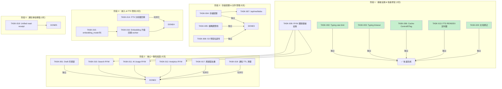
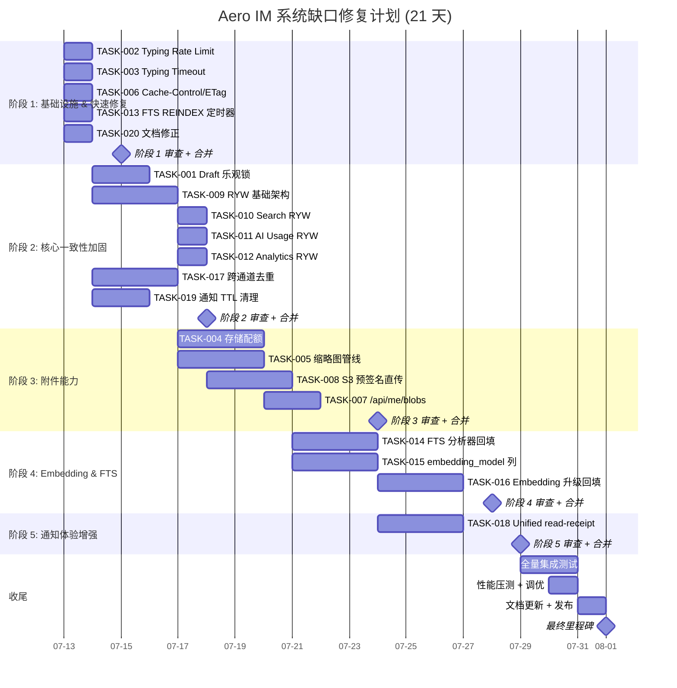

好，我已通过代码验证掌握了全貌。以下是从 Tech Lead 视角的完整分析。

---

# Tech Lead 分析报告：Aero IM 系统缺口修复计划

**基线**：验证文档确认了 5 个方向的 16 项真实系统缺口 + 4 项文档修正

---

## 1. 任务分解

### 方向一：Draft / Composer 加固

| 任务 ID | 标题 | 涉及文件 | 前置依赖 | 工时 | 验收标准 |
|---------|------|---------|---------|------|---------|
| TASK-001 | Draft 添加版本列 + 乐观锁 | `migrations/NNNN_draft_version.sql`, `crates/aero-storage/src/draft.rs`, `crates/aero-server/src/drafts.rs` | 无 | 2h | `ON CONFLICT DO UPDATE` 增加 `WHERE version = EXCLUDED.version - 1`；冲突返回错误而非静默覆盖 |
| TASK-002 | Typing 事件添加 per-user per-room rate limit | `crates/aero-server/src/ws_ratelimit.rs` (新文件/已有模块扩展), `crates/aero-im-core/src/service/reads.rs` | 无 | 2h | 同 room 内同一用户 ≥500ms 内只发 1 次 typing（超出静默丢）；`AERO_TYPING_RATE_LIMIT_MS` env 可配 |
| TASK-003 | Typing indicator 添加超时自动关 | `crates/aero-im-core/src/service/reads.rs`, `crates/aero-server/src/routes/routes.rs` (WS 帧处理) | 无 | 2h | 收到 `Typing{on:true}` 后启动 5s 计时器；计时器到期自动广播 `Typing{on:false}`；WS 断连立即清除 |

### 方向二：附件平台能力补充

| 任务 ID | 标题 | 涉及文件 | 前置依赖 | 工时 | 验收标准 |
|---------|------|---------|---------|------|---------|
| TASK-004 | 添加 per-user/per-workspace 存储配额 | `migrations/NNNN_storage_quota.sql`, `crates/aero-storage/src/storage_quota.rs` (新), `crates/aero-server/src/routes/routes.rs` | 无 | 4h | `POST /api/attach` 前检查 `SUM(blobs.size) WHERE owner_id = ?`；超 配额 → `413 Payload Too Large`；默认配额 = env `AERO_DEFAULT_QUOTA_BYTES` |
| TASK-005 | 图片上传缩略图管线 | `crates/aero-server/src/routes/routes.rs`, `crates/aero-storage/src/thumbnail.rs` (新；可选用 `image` crate 或外部 resize 服务) | 无 | 4h | 图片上传后异步生成 256px JPEG 缩略图 + 存 `blob_thumbnails` 表；`GET /api/blobs/:id/thumb` 路由；PNG/GIF/SVG fallback/空 |
| TASK-006 | Blob 下载添加 Cache-Control/ETag | `crates/aero-server/src/routes/routes.rs` (`blob_download` handler) | 无 | 1h | `Cache-Control: private, max-age=3600`；ETag = SHA256 of blob content；`If-None-Match 304` 短路 |
| TASK-007 | 实现 `/api/me/blobs` 文件管理路由 | `crates/aero-server/src/user_blobs.rs` (新), `crates/aero-storage/src/user_blob_repo.rs` (新) | TASK-004 | 3h | `GET /api/me/blobs` 分页列表（name/date/size/mime）；`DELETE /api/me/blobs/:id`；走既有 `assert_room_access`（只列自己上传的 / 成员引用不可删） |
| TASK-008 | S3 预签名 URL 直传（避免代理） | `crates/aero-storage/src/s3_blob_store.rs` (`presign_upload`/`presign_download` 方法), `crates/aero-server/src/routes/routes.rs` (新 `POST /api/blobs/presign` 端点) | 无 | 4h | S3 配置时：返回 15min 有效预签名 PUT URL + 下载 URL；客户端 PUT 直传 S3；server 收到回调后写入 blob meta 表；LocalFs fallback 走原代理逻辑 |

### 方向三：Read-Your-Writes (RYW) 一致性

| 任务 ID | 标题 | 涉及文件 | 前置依赖 | 工时 | 验收标准 |
|---------|------|---------|---------|------|---------|
| TASK-009 | 实现会话级 RYW 跟踪（基础架构） | `crates/aero-storage/src/read_consistency.rs` (新), `crates/aero-server/src/state.rs`, `crates/aero-server/src/bin/boot/persistence.rs` | 无 | 4h | Redis 存 `participant:{pid}:last_write` (UNIX ms)；每个写路径更新；`read_lag()` 函数比较 `pg_read` 复制滞后与 last_write，滞后>阈值回落 `pg` |
| TASK-010 | Search 路由添加 RYW 检查 | `crates/aero-server/src/search.rs` (`search_all` handler), `crates/aero-server/src/routes/routes.rs` (per-room search) | TASK-009 | 1h | search handler 调用 `read_lag()`；超过阈值回落 primary 查询；单测 mock 复制滞后场景 |
| TASK-011 | AI usage 路由添加 RYW 检查 | `crates/aero-server/src/ai_usage.rs` (`ai_usage` handler) | TASK-009 | 1h | ai_usage handler 调用 `read_lag()`；超过阈值回落 primary；接受 200ms 以下滞后（dashboard 容忍） |
| TASK-012 | Analytics 路由添加 RYW 检查 | `crates/aero-server/src/analytics.rs` (overview/timeline 等 handler) | TASK-009 | 1h | 同上；analytics 为 read-only aggregate，滞后阈值设为 1s（批次容忍度高） |

### 方向四：Embedding & FTS 维护管线

| 任务 ID | 标题 | 涉及文件 | 前置依赖 | 工时 | 验收标准 |
|---------|------|---------|---------|------|---------|
| TASK-013 | 添加 FTS 索引 REINDEX 定时器 | `crates/aero-server/src/bin/boot/background.rs` (新 `reindex_timer`), `crates/aero-storage/src/scheduled.rs` | 无 | 1h | `REINDEX INDEX CONCURRENTLY messages_search_tsv_idx` 每 24h 运行（`AERO_REINDEX_INTERVAL_SECS`=86400 默认，0=禁用）；`skip` 模式避免并发死锁；日志记录上次时间 |
| TASK-014 | FTS 分析器变更检测 + 数据回填 | `migrations/NNNN_fts_analyzer_version.sql`, `crates/aero-storage/src/message/crud.rs`, `crates/aero-storage/src/scheduled.rs` | 无 | 3h | 新增 `workspace_fts_version` 表（version int）；检测到分析器版本变更→enqueue 回填任务；逐页 `SET searchable_text = ...`；进度 `UPDATE workspace_fts_version.completed_row` |
| TASK-015 | 添加 embedding_model 列 + 命名空间隔离 | `migrations/NNNN_embedding_model.sql`, `crates/aero-storage/src/message/search.rs` (hybrid/vector join), `crates/aero-ai/src/embed` | 无 | 3h | 新增 `embedding_model` 列；`messages.embedding IS NOT NULL` where 子句加 `AND embedding_model = current_model`；检索时只 query 同模型行；模型切换触发回填 |
| TASK-016 | 添加 embedding 版本升级回填 worker | `crates/aero-storage/src/ai_job.rs`, `crates/aero-storage/src/message/crud.rs` (batch update), `crates/aero-server/src/bin/boot/background.rs` | TASK-015 | 3h | 检测 `embedding_model` != 当前模型 → 逐 200 行清空 embedding + enqueue Embed job；AiWorker 优先处理；进度 gauge 暴露 `PROMETHEUS` |

### 方向五：多通道通知一致性

| 任务 ID | 标题 | 涉及文件 | 前置依赖 | 工时 | 验收标准 |
|---------|------|---------|---------|------|---------|
| TASK-017 | 跨通道去重（source_path 跟踪） | `migrations/NNNN_cross_channel_dedup.sql`, `crates/aero-storage/src/notification.rs`, `crates/aero-server/src/push_bot.rs` | 无 | 3h | `notifications` 加 `source_path TEXT` + 唯一约束 `UNIQUE (participant_id, source_path)`；push 发送前 INSERT ... ON CONFLICT DO NOTHING；冲突=已送达，略过 |
| TASK-018 | Unified read-receipt：push/email 点击同步 inbox | `crates/aero-server/src/push_bot.rs` (deep-link 处理), `crates/aero-server/src/notification_sync.rs` (新), `crates/aero-im-core/src/service/reads.rs` | 无 | 4h | push 通知点击带上 `?notif_id=X→redirect`；server 收到后 `UPDATE notifications SET read_at=NOW()`；新增 `POST /api/notifications/read/:id` 端点；推送不再重复已读 item |
| TASK-019 | 通知 inbox TTL 清理增强 | `crates/aero-storage/src/notification.rs` (`sweep_read_before` 增强), `crates/aero-server/src/bin/boot/background.rs` | 无 | 2h | 额外 `DELETE FROM notifications WHERE created_at < NOW() - TTL` 不管 read/unread（现有只删已读）；`AERO_NOTIFICATION_TTL_DAYS`=90 默认；unread 超期=PANEL 用户错过 |

### 元任务（文档修正 & 分析质量）

| 任务 ID | 标题 | 涉及文件 | 前置依赖 | 工时 | 验收标准 |
|---------|------|---------|---------|------|---------|
| TASK-020 | 修正分析文档中的 4 处不准确声明 | `docs/analysis/` (相应 .md 文件) | 无 | 1h | 方向二：去掉「无 Content-Disposition 差异化」，改为「有，但无 CDN 缓存头/ETag」；方向四：删除「编辑后 embedding 不更新」，标注已正确实现；方向五：删除「Bundle 无超时逃逸」，标注 `AERO_BUNDLE_DEADLINE_SECS` 存在 |

---

## 2. 执行顺序与依赖图



### 并行任务组

| 组 | 任务 | 理由 |
|----|------|------|
| **组 A** (快速 wins) | TASK-002, TASK-003, TASK-006, TASK-013, TASK-020 | 完全独立、无共享代码、可分给 5 人同时进行 |
| **组 B** (RYW 迁移) | TASK-010, TASK-011, TASK-012 | 依赖 TASK-009 但彼此无依赖；结构一致可批量改 |
| **组 C** (附件能力) | TASK-004, TASK-005, TASK-008 | 互不依赖，共享 `blob_store` trait 但不冲突 |
| **组 D** (Embedding) | TASK-014, TASK-015 | 独立，可并行；TASK-016 依赖 TASK-015 |
| **组 E** (通知去重) | TASK-017, TASK-019 | 独立，可并行；TASK-018 无前置依赖但涉及面广 |

---

## 3. 技术风险分析

### 🔴 高风险

| 风险 | 涉及任务 | 评估 | 缓解策略 |
|------|---------|------|---------|
| **RYW 复制滞后检测不可靠** | TASK-009-012 | `pg_read` replica 的滞后时间在不同 PG 版本/负载下波动；`pg_stat_replication.replay_lag` 在同步复制下可能为 0 | ① 加两层回退：Redis last_write 与 `EXPLAIN` 的 `tx_snapshot` 对比 ② 默认 `REPLICA_LAG_THRESHOLD_MS=500`，滞后未知时 fallback 到 primary ③ 白名单：管理员可配完全绕过 replica |
| **S3 预签名 URL 回调竞争条件** | TASK-008 | 客户端直传 S3 后回调 server，回调可能丢、延迟、重复；上传完成前用户可能 GET blob | ① 回调幂等 (`ON CONFLICT DO NOTHING`) ② 回调 + 轮询双保险（客户端成功回调后 GET `HEAD /api/blobs/:id/status`）③ pre-signed 15min 超时 + 自动清理僵尸 |
| **缩略图管线 CPU 开销** | TASK-005 | `image` crate resize 大图（≥4K photo）在 tokio blocking pool 上可能饥饿 -> 请求延迟抖动 | ① 异步：`tokio::task::spawn_blocking` + 有界 semaphore（默认 4）② 大图先降采样到 2048px 宽再 resize ③ 可选：外部 `sharp`/`vips` 微服务降级 |
| **FTS REINDEX CONCURRENTLY 锁竞争** | TASK-013 | PG `REINDEX INDEX CONCURRENTLY` 在写入负载下可能引发等待/死锁 | ① 默认 `CONCURRENTLY` 模式（不锁写）② 低优先级：`SET idle_in_transaction_session_timeout = '5min'` ③ 失败重试间隔 1h ④ 可配置维护窗口 |
| **embedding 模型切换致向量空间混叠** | TASK-015 | 同一 `embedding` 列存不同模型的向量，cosine distance 不跨模型可比；`hybrid` 搜索产生乱序结果 | ① `embedding_model` 列硬校验 ② 查询时显式 `AND embedding_model = $current` ③ 回填完成前向量的 `IS NOT NULL` 也需匹配模型 ④ 只读旧模型行至过期 |

### 🟡 中风险

| 风险 | 涉及任务 | 评估 | 缓解 |
|------|---------|------|------|
| Draft 乐观锁碰撞率 | TASK-001 | 同一用户多设备同时 draft 编辑极低频；draft 非高冲突资源 | 仅返回错误码，不自动重试；前端 `setTimeout(300ms) retry` |
| Typing rate limit 颗粒度 | TASK-002 | 房间内多成员 → per (user, room) 桶；`AERO_TYPING_RATE_LIMIT_MS` 全局，不按优先级 | 够用；极高频场景不用优化 |
| 通知跨通道去重唯一约束 | TASK-017 | 如果 `source_path` 生成策略不统一，同一通知发往 push 和 inbox 时用不同 key → 误去重 | `source_path = "room:{room_id}:message:{message_id}:kind:{kind}"` 格式化，在 `push_bot.rs` + `notification.rs` 两端用同一格式化函数 |
| FTS 回填逐页 `UPDATE` I/O | TASK-014 | 全表扫描 + UPDATE 在百万级消息表上可能产生 WAL 放大 | ① 分批 `LIMIT 500` ② `pg_sleep(0.1)` 每批 ③ 可中断 token ④ 进度表 allow resume |

### 🟢 低风险

| 风险 | 涉及任务 | 评估 |
|------|---------|------|
| TTL 清理误删 unread 通知 | TASK-019 | 现有行为 `DELETE WHERE read_at IS NOT NULL`；新增 `created_at < TTL` 覆盖所有行。UI 投诉 risk 主要来自超长假期用户 | `AERO_NOTIFICATION_TTL_DAYS` 默认 90 天合理；可改成 `DELETE WHERE read_at IS NOT NULL OR created_at` 保留 unread |
| /api/me/blobs 权限模型 | TASK-007 | 现有 `is_accessible_by` 检查上传者 or 房间成员引用；blob 管理页面需额外「可删但不可超过配额」 | 只删自己上传的；引用中的 blob 标记 `ref_count` ≠ 0 则禁止 + message 提醒 |
| cross-channel 去重的 type 演进 | TASK-017 | `NotificationKind` 新增 variant 时 `source_path` 格式需同步 | 在 `NotificationKind` 旁加 `to_source_path()` 方法；review 时检查 |

---

## 4. 资源评估

### 开发团队配置

```
┌──────────────┬──────┬─────────────────────────────────────────────┐
│ 角色          │ 数量 │ 技能要求                                     │
├──────────────┼──────┼─────────────────────────────────────────────┤
│ Senior Rust   │  2   │ Rust async/tokio, sqlx, Redis, PG 深水区   │
│               │      │ 系统架构决策 (RYW, 多租户隔离)              │
├──────────────┼──────┼─────────────────────────────────────────────┤
│ Fullstack     │  1   │ Rust + JS/Web (HLS, RTCPeerConnection)     │
│ (Rust/Web)    │      │ 缩略图管线、Web 端新路由（/api/me/blobs）   │
├──────────────┼──────┼─────────────────────────────────────────────┤
│ Mid Rust      │  1   │ 快速修复任务 (TASK-002,003,006,013,019,020)│
│               │      │ 熟悉现有代码模式 + 迁移体系                 │
├──────────────┼──────┼─────────────────────────────────────────────┤
│ QA Engineer   │  1   │ Rust test framework + PG integration tests  │
│               │      │ CI pipeline + 压测                          │
└──────────────┴──────┴─────────────────────────────────────────────┘
```

### 关键里程碑

| 里程碑 | 时间 | 交付物 | 验收条件 |
|--------|------|--------|---------|
| **M1: 快速修复** | Day 3 | TASK-002,003,006,013,020 全部合并 | `cargo check --workspace` clean；CI 全绿；5 个快速修复合并 |
| **M2: RYW 基础架构 + 迁移** | Day 8 | TASK-009,010,011,012 全部合并 | RYW 集成测试覆盖 3 条 read-replica 路径；`AERO_DATABASE_REPLICA_URL` env 可切换 |
| **M3: Draft + 附件核心** | Day 11 | TASK-001,004,005,007,008 合并 | Draft 乐观锁集成测试；缩略图 API 单测覆盖；存储配额端到端 |
| **M4: Embedding & FTS 完整管线** | Day 16 | TASK-014,015,016 全部 + 集成测试 | 新迁移 + embedding_model 隔离 + 回填 worker；`AERO_EMBEDDING_MODEL_VERSION` env |
| **M5: 通知体验** | Day 19 | TASK-017,018,019 全部合并 | 跨通道去重不会产生重复通知；统一 read-receipt E2E 测试 |
| **M6: 收尾** | Day 21 | 完整集成测试 + 压测 + 文档 | 全量 `cargo test --workspace` + `--ignored` PG 门控；延迟/吞吐压测通过 |

### 阻塞点 (Blockers) 与解决策略

| 阻塞点 | 影响任务 | 策略 |
|--------|---------|------|
| **无真实 PG replica** 用于 RYW 测试 | TASK-009-012 | ① 单元测试 mock `Persistence` 的 `pg_read` → 注入可配置延迟 ② CI 加 PG 主从 docker-compose（`docker-compose.replica.yml`）③ `read_lag()` 函数在单节点返回 0，不走 replica |
| **缩略图库选择** 需决策 | TASK-005 | Option A: `image` crate（纯 Rust，无 C 依赖，但大图慢）→ 默认选；Option B: 外部 `sharp` CLI 进程调用 → 降级方案；`thumbnail` trait 允许 switch |
| **S3 预签名 URL** 需 AWS SDK 依赖 | TASK-008 | 已有 `reqwest` + HMAC 手写实现 `S3BlobStore`；添加 `presign` 方法：用 `aws-sdk-s3` feature gate（非 CI 默认编译），LocalFs 不依赖 |
| **embedding 模型版本号** 全局共识 | TASK-015 | `aero_common::config::AppConfig` 加 `ai.embedding_model_version: String`；升级 = 改 config → 触发回填；版本号 `v1/v2/...` |

---

## 5. 质量保证

### 5.1 单元测试覆盖

| 任务 | 测试类型 | 最小覆盖率 | 关键断言 |
|------|---------|-----------|---------|
| TASK-001 | 集成 `#[ignore]` | Draft 冲突返回 error；替换成功返回 Ok | `repo.upsert` 冲突时返回 `Err`（不用 `DO UPDATE` 静默覆盖） |
| TASK-002 | 单元 | `typing_rate_limiter` 纯函数 | 同一 `(user,room)` 两次 < 500ms → 第二次被拒绝 |
| TASK-006 | 单元 | ETag 计算 + `304` 响应 | 相同 ETag → `StatusCode::NOT_MODIFIED`；不同 → 200 |
| TASK-009 | 单元 + 集成 | `read_lag()` mock 返回值 | `last_write` > replica `replay_lag` → `use_primary() = true` |
| TASK-015 | 集成 | embedding_model 插入+查询 | 不同模型向量不在同一查询中返回 |
| TASK-017 | 集成 | source_path 唯一约束 | 两次同一 source_path → 第二行不插入 |
| 所有 RYW 任务 | 集成 | 随 `DATABASE_URL` 跑 | 模拟 replica lag: search/usage/analytics 回退 primary |

### 5.2 集成测试策略

```
┌─────────────────────────────────────────────────────┐
│  aero-server 集成测试套件 (tests/)                   │
├─────────────────────────────────────────────────────┤
│  Phase 1: 现有 smoke tests + authz_lint             │
│  Phase 2: RYW 端到端                                │
│    - 写消息 → search 立即可见 (使用 pg_read 检查)    │
│    - 写 draft → GET 返回最新 (乐观锁验证)            │
│  Phase 3: 附件管线                                  │
│    - POST /api/attach → GET /api/blobs/:id/thumb     │
│    - 超配额 → 413                                    │
│    - ETag 304 短路                                  │
│  Phase 4: 通知一致性                                │
│    - 两通道 → inbox 只出现一次                      │
│    - push 点击 → read 时间戳同步                     │
│  Phase 5: FTS & Embedding                           │
│    - REINDEX 定时器 (mock time)                      │
│    - embedding 模型切换 → 查询命中正确模型            │
└─────────────────────────────────────────────────────┘
```

- **DB 门控测试**：全部 `#[ignore]` + `DATABASE_URL` env，CI 在专用 Postgres 服务上跑
- **无需 DB 的测试**：`cargo test --workspace --lib` 保持全部 pass，纯 Rust 单元测试 + mock
- **CI gate**：`cargo test --workspace --lib` + `cargo clippy --workspace --all-targets`（零新 warning）+ `scripts/{truth-check,file-size-check,web-check}.sh`

### 5.3 代码审查要点

| Checklist Item | 涉及任务 | 审查重点 |
|---------------|---------|---------|
| **幂等写** | TASK-001, TASK-008, TASK-017 | 所有 `INSERT ... ON CONFLICT` 是否正确处理冲突？WAL 重放安全？ |
| **迁移序数** | 所有带 migration 的任务 | 新 migration 序号 = `ls migrations/*.sql | wc -l` + 1；`CREATE TABLE IF NOT EXISTS`；幂等 |
| **仓库构造方式** | 所有 | 沿用已有模式 `repo = XRepo::new(s.pg.clone())` **内联**，不加 `AppState` 新字段 |
| **路由鉴权** | TASK-007, TASK-018 | mutation 路由：先 `assert_room_access`（participant 在前）or Workspace `member_role` |
| **error 处理** | TASK-004, TASK-005 | 外部服务（S3/minio/image resize）失败 → 降级而非 500 |
| **config 前缀** | TASK-002, TASK-013, TASK-015 | `AERO__SECTION__KEY` 双下划线 = figment；单下划线直接 env（已有 `AERO_BUNDLE_DEADLINE_SECS` 等） |
| **enum tag 撞名** | TASK-017, TASK-018 | `tag="kind"` → variant 字段不得叫 `kind`（`#[serde(rename=...)]`） |
| **迁移后 build** | 所有 | 加迁移后必先 `cargo build` 再 migrate（编译期嵌入） |

### 5.4 性能测试需求

| 场景 | 任务 | 工具 | 指标 | 目标 |
|------|------|------|------|------|
| **Typing 高并发** | TASK-002 | `wrk` WS | P50/P99 延迟 | Rate limit 前 ≤10ms overhead |
| **Blob 大量下载** | TASK-006 | `wrk`/`oha` | Cache HIT ratio, 304 比例 | 304 ≥ 30% 重复下载 |
| **缩略图并发** | TASK-005 | tokio console | blocking pool 使用率 | semaphore 排队不 > 100ms |
| **FTS REINDEX** | TASK-013 | PG `pg_stat_activity` | REINDEX 期间查询 P99 | 不衰减超过 10% |
| **通知去重压力** | TASK-017 | 模拟 10K 并行通知写 | 冲突率, DB CPU | ≤ 5% 冲突, CPU < 20% |
| **全链路延迟** | TASK-009-012 | 注入 100ms replica lag | read fallback 延迟 | fallback 路径 ≤ 5ms 额外开销 |

---

## 6. 实施计划（甘特图）



### 每日工作模式

```
Week 1 (Day 1-5):
  个人贡献:
    2x Senior: TASK-009 (RYW 基础架构) + TASK-001 (Draft 乐观锁)
    1x Fullstack: TASK-005 (缩略图管线)
    1x Mid: TASK-002 + TASK-003 + TASK-006 + TASK-013 (快速修复)
    1x QA: 开始搭建 RYW 集成测试基础设施
  
  Day 3 合并点: 快速修复全部合并

Week 2 (Day 6-10):
  个人贡献:
    2x Senior: TASK-010/011/012 (RYW 迁移) + TASK-008 (S3 预签名)
    1x Fullstack: TASK-004 + TASK-007 (配额 + 文件管理)
    1x Mid: TASK-017 + TASK-019 (通知去重 + TTL)
    1x QA: 验收测试 RYW + Draft

  Day 8 合并点: RYW 基础设施 + 迁移

Week 3 (Day 11-15):
  个人贡献:
    1x Senior: TASK-014 (FTS 回填)
    1x Senior: TASK-015 + TASK-016 (embedding 隔离 + 回填 worker)
    1x Fullstack: TASK-018 (unified read-receipt)
    1x Mid: TASK-005 收尾 + 集成测试辅助
    1x QA: 全量 CI 集成测试

  Day 16 合并点: Embedding & FTS 管线

Week 4 (Day 16-21):
  全团队: 集成测试 + 压测 + 修复
```

---

## 附录 A：分析文档修正清单（TASK-020 具体内容）

### 修正 1：方向二 "Content-Disposition 差异化"

```diff
- 下载无 Cache-Control / ETag
- 无 Content-Disposition 差异化
+ 下载无 Cache-Control / ETag（有 Content-Disposition 差异化，图片/视频/音频=inline，其余=attachment）
```

**证据**：`crates/aero-server/src/routes/routes.rs:1774-1795`

### 修正 2：方向二 "MAX_BLOB_BYTES"

```diff
- MAX_BLOB_BYTES = 10MB
+ MAX_BLOB_BYTES = 32 MiB (33,554,432 bytes)
```

**证据**：`crates/aero-server/src/routes/routes.rs:1604`

### 修正 3：方向四 "编辑后 embedding 不更新"

```diff
- 编辑后 embedding 不更新（IS NULL 条件不会捕获）
+ 编辑后 embedding 正确更新（edit_message 显式 SET embedding = NULL 并 enqueue AiJobKind::Embed）
```

**证据**：`crates/aero-im-core/src/service/messages.rs:193-206` + `crates/aero-storage/src/message/crud.rs:99`

### 修正 4：方向五 "Bundle 无超时逃逸"

```diff
- Bundle 无超时逃逸 → 通知可能延迟到小时级
+ Bundle 有超时逃逸：AERO_BUNDLE_DEADLINE_SECS（默认 30s，最小 10s），最大延迟约 30-40s
```

**证据**：`crates/aero-storage/src/notification_bundle.rs:167` + `background.rs:262-269`

---

## 附录 B：迁移清单（按创建顺序）

| 序号 | 迁移文件 | 关联任务 | 说明 |
|------|---------|---------|------|
| N+1 | `NNNN_draft_version.sql` | TASK-001 | `ALTER TABLE message_drafts ADD COLUMN version INTEGER NOT NULL DEFAULT 1` |
| N+2 | `NNNN_storage_quota.sql` | TASK-004 | `CREATE TABLE IF NOT EXISTS workspace_storage_quotas` + `per_workspace_storage_usage` 累计视图 |
| N+3 | `NNNN_thumbnail.sql` | TASK-005 | `CREATE TABLE IF NOT EXISTS blob_thumbnails (blob_id UUID PRIMARY KEY, ...)` |
| N+4 | `NNNN_fts_analyzer_version.sql` | TASK-014 | `CREATE TABLE IF NOT EXISTS workspace_fts_version (workspace_id UUID, version INT, ...)` |
| N+5 | `NNNN_embedding_model.sql` | TASK-015 | `ALTER TABLE messages ADD COLUMN embedding_model TEXT` |
| N+6 | `NNNN_cross_channel_dedup.sql` | TASK-017 | `ALTER TABLE notifications ADD COLUMN source_path TEXT` + `CREATE UNIQUE INDEX ...` |
| N+7 | `NNNN_notification_ttl.sql` | TASK-019 | (可选，如果复用既有 `sweep_read_before`) 或新增 `TTL` 列 |

**布局说明**：迁移序号以 `ls migrations/*.sql | wc -l` 输出为 N，按此 +1,+2,... 递增；PR 合并时会有序数冲突，用 release branch rebase 解决。
